# 可观测性视角：监控、追踪、日志

## 📑 目录

- [可观测性视角：监控、追踪、日志](#可观测性视角监控追踪日志)
  - [📑 目录](#-目录)
  - [1 概述](#1-概述)
    - [1.1 核心思想](#11-核心思想)
  - [2 可观测性视角定义](#2-可观测性视角定义)
    - [2.1 可观测性视角概念](#21-可观测性视角概念)
    - [2.2 可观测性视角特点](#22-可观测性视角特点)
  - [3 虚拟化可观测性](#3-虚拟化可观测性)
    - [3.1 虚拟化监控指标](#31-虚拟化监控指标)
    - [3.2 虚拟化追踪](#32-虚拟化追踪)
  - [4 容器化可观测性](#4-容器化可观测性)
    - [4.1 容器化监控指标](#41-容器化监控指标)
    - [4.2 容器化追踪](#42-容器化追踪)
  - [5 沙盒化可观测性](#5-沙盒化可观测性)
    - [5.1 沙盒化监控指标](#51-沙盒化监控指标)
    - [5.2 沙盒化追踪](#52-沙盒化追踪)
  - [6 Service Mesh 可观测性](#6-service-mesh-可观测性)
    - [6.1 Service Mesh 监控指标](#61-service-mesh-监控指标)
    - [6.2 Service Mesh 追踪](#62-service-mesh-追踪)
    - [6.3 Service Mesh 日志](#63-service-mesh-日志)
  - [7 OPA 可观测性](#7-opa-可观测性)
    - [7.1 OPA 监控指标](#71-opa-监控指标)
    - [7.2 OPA 追踪](#72-opa-追踪)
    - [7.3 OPA 日志](#73-opa-日志)
  - [8 统一可观测性](#8-统一可观测性)
    - [8.1 统一可观测性架构](#81-统一可观测性架构)
    - [8.2 可观测性数据流](#82-可观测性数据流)
  - [9 可观测性最佳实践](#9-可观测性最佳实践)
    - [9.1 指标收集](#91-指标收集)
    - [9.2 日志管理](#92-日志管理)
    - [9.3 追踪链路](#93-追踪链路)
  - [10 形式化定义](#10-形式化定义)
    - [10.1 可观测性定义](#101-可观测性定义)
    - [10.2 指标定义](#102-指标定义)
  - [11 总结](#11-总结)
    - [11.1 相关文档](#111-相关文档)

---

## 1 概述

本文档从**可观测性视角**阐述软件架构，重点关注监控、追踪、日志。

### 1.1 核心思想

> **从可观测性视角理解系统，关注系统的监控、追踪、日志，以及如何通过虚拟化、容器
> 化、沙盒化等技术实现可观测性**

## 2 可观测性视角定义

### 2.1 可观测性视角概念

**可观测性视角**关注监控、追踪、日志，包括：

- **指标监控**：系统的指标监控
- **链路追踪**：分布式链路追踪
- **日志聚合**：日志的聚合和分析
- **可视化**：数据的可视化展示

### 2.2 可观测性视角特点

**可观测性视角特点**：

- **可观测导向**：以可观测性为核心
- **指标分析**：关注系统指标
- **追踪分析**：关注链路追踪
- **日志分析**：关注日志分析

## 3 虚拟化可观测性

### 3.1 虚拟化监控指标

**虚拟化监控指标**：

| 指标类型       | 说明          | 典型实现            |
| -------------- | ------------- | ------------------- |
| **CPU 使用率** | VM CPU 使用率 | vCPU Metrics        |
| **内存使用率** | VM 内存使用率 | Memory Metrics      |
| **磁盘 I/O**   | VM 磁盘 I/O   | Disk I/O Metrics    |
| **网络 I/O**   | VM 网络 I/O   | Network I/O Metrics |

### 3.2 虚拟化追踪

**虚拟化追踪**：

- **VM 生命周期追踪**：VM 创建、启动、停止、删除
- **资源分配追踪**：资源分配和释放
- **迁移追踪**：VM 迁移追踪

## 4 容器化可观测性

### 4.1 容器化监控指标

**容器化监控指标**：

| 指标类型       | 说明                 | 典型实现 |
| -------------- | -------------------- | -------- |
| **CPU 使用率** | Container CPU 使用率 | cAdvisor |
| **内存使用率** | Container 内存使用率 | cAdvisor |
| **网络 I/O**   | Container 网络 I/O   | cAdvisor |
| **文件系统**   | Container 文件系统   | cAdvisor |

### 4.2 容器化追踪

**容器化追踪**：

- **容器生命周期追踪**：容器创建、启动、停止、删除
- **应用追踪**：应用请求追踪
- **资源追踪**：资源使用追踪

## 5 沙盒化可观测性

### 5.1 沙盒化监控指标

**沙盒化监控指标**：

| 指标类型     | 说明                | 典型实现           |
| ------------ | ------------------- | ------------------ |
| **系统调用** | 系统调用统计        | Seccomp-BPF        |
| **能力使用** | Capability 使用统计 | Capability Metrics |
| **安全事件** | 安全事件统计        | Security Metrics   |

### 5.2 沙盒化追踪

**沙盒化追踪**：

- **系统调用追踪**：系统调用追踪
- **安全事件追踪**：安全事件追踪
- **策略决策追踪**：策略决策追踪

## 6 Service Mesh 可观测性

### 6.1 Service Mesh 监控指标

**Service Mesh 监控指标**：

| 指标类型     | 说明     | 典型实现   |
| ------------ | -------- | ---------- |
| **请求速率** | 请求速率 | Prometheus |
| **错误率**   | 错误率   | Prometheus |
| **延迟**     | 请求延迟 | Prometheus |
| **流量分布** | 流量分布 | Prometheus |

### 6.2 Service Mesh 追踪

**Service Mesh 追踪**：

| 追踪类型       | 说明           | 典型实现      |
| -------------- | -------------- | ------------- |
| **分布式追踪** | 分布式链路追踪 | Tempo/Jaeger  |
| **请求追踪**   | 请求链路追踪   | OpenTelemetry |
| **服务追踪**   | 服务调用追踪   | OpenTelemetry |

### 6.3 Service Mesh 日志

**Service Mesh 日志**：

| 日志类型     | 说明         | 典型实现         |
| ------------ | ------------ | ---------------- |
| **访问日志** | 访问日志     | Envoy Access Log |
| **错误日志** | 错误日志     | Envoy Error Log  |
| **配置日志** | 配置变更日志 | Istio Config Log |

## 7 OPA 可观测性

### 7.1 OPA 监控指标

**OPA 监控指标**：

| 指标类型     | 说明         | 典型实现   |
| ------------ | ------------ | ---------- |
| **决策延迟** | 决策延迟     | Prometheus |
| **决策速率** | 决策速率     | Prometheus |
| **策略评估** | 策略评估次数 | Prometheus |

### 7.2 OPA 追踪

**OPA 追踪**：

- **策略评估追踪**：策略评估追踪
- **决策追踪**：决策追踪
- **Bundle 更新追踪**：Bundle 更新追踪

### 7.3 OPA 日志

**OPA 日志**：

| 日志类型     | 说明     | 典型实现     |
| ------------ | -------- | ------------ |
| **决策日志** | 决策日志 | Decision Log |
| **错误日志** | 错误日志 | Error Log    |
| **审计日志** | 审计日志 | Audit Log    |

## 8 统一可观测性

### 8.1 统一可观测性架构

**统一可观测性架构**：

```text
应用层
  ├── OpenTelemetry SDK
  └── 自动注入遥测
  ↓
收集层
  ├── OpenTelemetry Collector
  ├── Prometheus（指标）
  ├── Loki（日志）
  └── Tempo（追踪）
  ↓
存储层
  ├── Prometheus TSDB
  ├── Loki 对象存储
  └── Tempo 对象存储
  ↓
可视化层
  └── Grafana（统一面板）
```

### 8.2 可观测性数据流

**可观测性数据流**：

```text
应用
  ├── Metrics → Prometheus
  ├── Logs → Loki
  └── Traces → Tempo
  ↓
Grafana
  ├── 指标可视化
  ├── 日志查询
  └── 追踪分析
```

## 9 可观测性最佳实践

### 9.1 指标收集

**指标收集最佳实践**：

- **标准化**：使用 OpenTelemetry 标准
- **自动化**：通过 sidecar 自动注入
- **聚合**：在 Collector 层聚合指标

### 9.2 日志管理

**日志管理最佳实践**：

- **结构化**：使用结构化日志格式
- **采样**：对高频日志进行采样
- **压缩**：对日志进行压缩存储

### 9.3 追踪链路

**追踪链路最佳实践**：

- **分布式追踪**：使用 OpenTelemetry 分布式追踪
- **采样策略**：根据业务需求设置采样策略
- **链路分析**：通过 Grafana 分析链路

## 10 形式化定义

### 10.1 可观测性定义

```text
可观测性 O = ⟨metrics, logs, traces, visualization⟩
其中：
- metrics: 指标集合
- logs: 日志集合
- traces: 追踪集合
- visualization: 可视化面板
```

### 10.2 指标定义

```text
指标 M = ⟨name, type, value, timestamp⟩
其中：
- name: 指标名称
- type: 指标类型（Counter/Gauge/Histogram）
- value: 指标值
- timestamp: 时间戳
```

## 11 总结

通过**可观测性视角**，我们理解了：

1. **指标监控**：系统的指标监控机制
2. **链路追踪**：分布式链路追踪机制
3. **日志聚合**：日志的聚合和分析机制
4. **统一可观测性**：统一的可观测性架构
5. **可视化**：数据的可视化展示

### 11.1 相关文档

**扩展阅读**：

- **[eBPF/OTLP 架构视角](07-ebpf-otlp-perspective.md)** ⭐ - 横纵耦合的可观测性
  驱动架构
  - 横纵耦合问题定位模型（OTLP 横向 + eBPF 纵向）
  - 智能系统能力架构（自我感知、自动伸缩、自我治愈）
  - 技术规范与语义模型对齐
- **[32. eBPF/OTLP 扩展技术分析](../../../../TECHNICAL/32-ebpf-otlp-analysis/ebpf-otlp-analysis.md)**
  ⭐ - eBPF/OTLP 扩展技术分析文档
- **[31. eBPF 技术堆栈](../../../../TECHNICAL/31-ebpf-stack/ebpf-stack.md)** -
  eBPF 技术堆栈完整技术参考文档
- **[29. 隔离栈](../../../../TECHNICAL/29-isolation-stack/isolation-stack.md)** -
  问题定位模型、横纵耦合定位方法

---

---

## 12 认知增强：思维导图、知识矩阵与专家观点

### 12.1 可观测性视角完整思维导图

```mermaid
graph TB
    A[可观测性视角] --> B[视角定义]
    A --> C[虚拟化可观测性]
    A --> D[容器化可观测性]
    A --> E[沙盒化可观测性]
    A --> F[Service Mesh可观测性]
    A --> G[OPA可观测性]
    A --> H[统一可观测性]
    A --> I[最佳实践]

    B --> B1[可观测导向]
    B --> B2[指标分析]
    B --> B3[追踪分析]
    B --> B4[日志分析]

    C --> C1[监控指标]
    C --> C2[追踪]

    D --> D1[监控指标]
    D --> D2[追踪]

    E --> E1[监控指标]
    E --> E2[追踪]

    F --> F1[监控指标]
    F --> F2[追踪]
    F --> F3[日志]

    G --> G1[监控指标]
    G --> G2[追踪]
    G --> G3[日志]

    H --> H1[统一架构]
    H --> H2[数据流]

    I --> I1[指标收集]
    I --> I2[日志管理]
    I --> I3[追踪链路]

    style A fill:#ff9999
    style B fill:#99ccff
    style C fill:#99ff99
    style D fill:#ffcc99
    style E fill:#cc99ff
    style F fill:#ff99cc
    style G fill:#99ffcc
    style H fill:#ffccff
    style I fill:#ccff99
```



### 12.2 知识多维关系矩阵

#### 技术栈可观测性多维关系矩阵

| 可观测性维度 | 虚拟化 | 容器化 | 沙盒化 | Service Mesh | OPA | 可观测性协同 | 认知价值 |
|---------|--------|--------|--------|-------------|-----|-----------|---------|
| **监控指标** | CPU使用率、内存使用率、磁盘I/O、网络I/O | CPU使用率、内存使用率、网络I/O、文件系统 | 系统调用、能力使用、安全事件 | 请求速率、错误率、延迟、流量分布 | 决策延迟、决策速率、策略评估 | 指标对比 | 指标理解 |
| **追踪** | VM生命周期追踪、资源分配追踪、迁移追踪 | 容器生命周期追踪、应用追踪、资源追踪 | 系统调用追踪、安全事件追踪、策略决策追踪 | 分布式追踪、请求追踪、服务追踪 | 策略评估追踪、决策追踪、Bundle更新追踪 | 追踪对比 | 追踪理解 |
| **日志** | VM操作日志 | 容器日志、应用日志 | 安全事件日志、策略决策日志 | 访问日志、错误日志、配置日志 | 决策日志、错误日志、审计日志 | 日志对比 | 日志理解 |
| **可视化** | VM监控面板 | 容器监控面板 | 沙盒监控面板 | Grafana统一面板 | OPA监控面板 | 可视化对比 | 可视化理解 |
| **可观测性演进** | 第一代 | 第二代 | 第三代 | 第四代 | 第五代 | 演进对比 | 演进理解 |
| **学习难度** | ⭐⭐⭐ | ⭐⭐⭐ | ⭐⭐⭐⭐ | ⭐⭐⭐⭐ | ⭐⭐⭐⭐ | ⭐⭐⭐⭐ | 渐进学习 |
| **专家推荐** | ⭐⭐⭐⭐⭐ | ⭐⭐⭐⭐⭐ | ⭐⭐⭐⭐⭐ | ⭐⭐⭐⭐⭐ | ⭐⭐⭐⭐⭐ | ⭐⭐⭐⭐⭐ | 技术深度 |

#### 可观测性三大支柱多维关系矩阵

| 支柱维度 | Metrics指标 | Logs日志 | Traces追踪 | 支柱协同 | 认知价值 |
|---------|-----------|---------|-----------|---------|---------|
| **定义** | 数值型指标 | 文本型日志 | 分布式追踪 | 定义对比 | 定义理解 |
| **典型实现** | Prometheus | Loki | Tempo/Jaeger | 实现对比 | 实现理解 |
| **数据格式** | Prometheus格式 | 结构化日志 | OpenTelemetry格式 | 格式对比 | 格式理解 |
| **存储方式** | TSDB时序数据库 | 对象存储 | 对象存储 | 存储对比 | 存储理解 |
| **可视化** | Grafana指标面板 | Grafana日志查询 | Grafana追踪分析 | 可视化对比 | 可视化理解 |
| **学习难度** | ⭐⭐⭐ | ⭐⭐⭐ | ⭐⭐⭐⭐ | ⭐⭐⭐⭐ | 渐进学习 |
| **专家推荐** | ⭐⭐⭐⭐⭐ | ⭐⭐⭐⭐⭐ | ⭐⭐⭐⭐⭐ | ⭐⭐⭐⭐⭐ | 技术深度 |

### 12.3 形象化解释论证

#### 可观测性视角的形象化类比

##### 1. 可观测性视角 = 体检视角

> **类比**：可观测性视角就像体检视角，监控指标像体检指标（系统的指标监控），链路追踪像体检追踪（分布式链路追踪），日志聚合像体检报告（日志的聚合和分析），就像体检视角关注系统的健康，而不是系统的结构一样。

**认知价值**：

- **视角理解**：通过体检视角类比，理解可观测性视角的含义
- **指标理解**：通过体检指标类比，理解监控指标的重要性
- **追踪理解**：通过体检追踪类比，理解链路追踪的作用

##### 2. Metrics = 体温计

> **类比**：Metrics就像体温计，指标监控像体温测量（系统的指标监控），指标类型像体温类型（Counter/Gauge/Histogram），指标值像体温值（指标值），就像体温计将复杂指标监控分解为测量，通过测量实现指标监控一样。

**认知价值**：

- **指标理解**：通过体温计类比，理解Metrics的含义
- **类型理解**：通过体温类型类比，理解指标类型的重要性
- **测量理解**：通过体温测量类比，理解指标监控的作用

##### 3. Traces = 病历追踪

> **类比**：Traces就像病历追踪，分布式追踪像病历追踪（分布式链路追踪），请求追踪像病历请求（请求链路追踪），服务追踪像病历服务（服务调用追踪），就像病历追踪将复杂追踪分解为追踪，通过追踪实现链路追踪一样。

**认知价值**：

- **追踪理解**：通过病历追踪类比，理解Traces的含义
- **链路理解**：通过病历链路类比，理解链路追踪的重要性
- **分析理解**：通过病历分析类比，理解追踪分析的作用

##### 4. Logs = 病历记录

> **类比**：Logs就像病历记录，访问日志像病历访问（访问日志），错误日志像病历错误（错误日志），配置日志像病历配置（配置变更日志），就像病历记录将复杂日志分解为记录，通过记录实现日志管理一样。

**认知价值**：

- **日志理解**：通过病历记录类比，理解Logs的含义
- **记录理解**：通过病历记录类比，理解日志记录的重要性
- **管理理解**：通过病历管理类比，理解日志管理的作用

##### 5. 统一可观测性 = 统一体检系统

> **类比**：统一可观测性就像统一体检系统，应用层像体检对象（应用层），收集层像体检收集（收集层），存储层像体检存储（存储层），可视化层像体检报告（可视化层），就像统一体检系统将复杂可观测性分解为系统，通过系统实现统一可观测性一样。

**认知价值**：

- **统一理解**：通过统一体检系统类比，理解统一可观测性的含义
- **系统理解**：通过体检系统类比，理解统一可观测性系统的价值
- **架构理解**：通过体检架构类比，理解统一可观测性架构的作用

### 12.4 专家观点与论证

#### 计算信息软件科学家的观点

##### 1. Charity Majors（Honeycomb联合创始人）

> **观点**："Observability is a property of a system, not a tool."（可观测性是系统的属性，而不是工具）

**与可观测性视角的关联**：

- **属性理解**：可观测性视角体现了可观测性属性的重要性（监控、追踪、日志）
- **工具理解**：通过可观测性视角理解可观测性工具的局限性（可观测性不是工具，而是属性）
- **系统理解**：通过可观测性视角理解可观测性系统的属性性（监控、追踪、日志）

##### 2. Ben Sigelman（OpenTelemetry联合创始人）

> **观点**："Observability is about understanding systems from the outside in."（可观测性是从外到内理解系统）

**与可观测性视角的关联**：

- **理解理解**：可观测性视角体现了从外到内理解系统的重要性（监控、追踪、日志）
- **系统理解**：通过可观测性视角理解系统的可观测性（从外到内理解系统）
- **视角理解**：通过可观测性视角理解可观测性视角的含义（从外到内理解系统）

##### 3. Cindy Sridharan（可观测性专家）

> **观点**："Observability is not just about collecting data, but about understanding what's happening in your system."（可观测性不仅仅是收集数据，而是理解系统中正在发生的事情）

**与可观测性视角的关联**：

- **理解理解**：可观测性视角体现了理解系统的重要性（监控、追踪、日志）
- **数据理解**：通过可观测性视角理解数据收集的局限性（不仅仅是收集数据）
- **系统理解**：通过可观测性视角理解系统的可观测性（理解系统中正在发生的事情）

#### 计算信息软件教育家的观点

##### 1. Robert C. Martin（《代码整洁之道》作者）

> **观点**："The only way to go fast is to go well."（快速前进的唯一方法是做好）

**与可观测性视角的关联**：

- **质量理解**：可观测性视角体现了架构质量（可观测导向、指标分析、追踪分析、日志分析）
- **速度理解**：通过可观测性视角理解速度与质量的权衡（监控vs追踪）
- **实践理解**：通过可观测性视角指导实践，选择"做好"的架构

##### 2. Martin Fowler（重构之父）

> **观点**："Any fool can write code that a computer can understand. Good programmers write code that humans can understand."（任何傻瓜都能编写计算机能理解的代码。好的程序员编写人类能理解的代码）

**与可观测性视角的关联**：

- **可理解性理解**：可观测性视角通过可观测导向、指标分析提高可理解性
- **人类理解**：通过可观测性视角理解架构的人类可理解性（清晰的监控、明确的追踪）
- **选择理解**：通过可观测性视角选择"人类能理解"的架构

#### 计算信息软件认知学家的观点

##### 1. Donald Norman（《设计心理学》作者）

> **观点**："The real problem with the interface is that it is an interface. Interfaces get in the way. I don't want to focus my energies on an interface. I want to focus on the job."（界面的真正问题是它是界面。界面会妨碍。我不想把精力集中在界面上。我想专注于工作）

**与可观测性视角的关联**：

- **接口理解**：可观测性视角体现了可观测性接口的重要性（监控接口、追踪接口），但也要避免过度关注接口
- **工作理解**：通过可观测性视角专注于架构工作（可观测导向、指标分析），而不是过度关注接口细节
- **平衡理解**：通过可观测性视角理解接口与工作的平衡

##### 2. Herbert A. Simon（认知科学家）

> **观点**："A wealth of information creates a poverty of attention."（信息丰富导致注意力贫乏）

**与可观测性视角的关联**：

- **注意力理解**：可观测性视角通过可观测导向、指标分析管理注意力，避免信息过载
- **结构化理解**：通过可观测性视角结构化信息（监控、追踪、日志），减少认知负荷
- **管理理解**：通过可观测性视角管理信息，避免注意力贫乏

### 12.5 认知学习路径矩阵

| 学习阶段 | 推荐内容 | 推荐技术栈 | 学习重点 | 学习时间 | 前置要求 | 后续进阶 |
|---------|---------|-----------|---------|---------|---------|---------|
| **新手阶段** | 概述、视角定义 | 可观测性视角概念理解 | 视角理解、基本概念理解 | 1-2周 | 无 | 进阶阶段 |
| **进阶阶段** | 虚拟化、容器化、沙盒化可观测性 | 虚拟化、容器化、沙盒化 | 可观测性理解、技术栈理解 | 4-8周 | 新手阶段 | 专家阶段 |
| **专家阶段** | Service Mesh、OPA可观测性、统一可观测性、最佳实践 | 完整技术栈 | 统一可观测性理解、最佳实践理解 | 16+周 | 进阶阶段 | - |

### 12.6 专家推荐阅读路径

**路径1：视角理解路径**：

1. **第一步**：阅读概述（第1节），理解可观测性视角概览
2. **第二步**：阅读视角定义（第2节），理解可观测导向、指标分析、追踪分析、日志分析
3. **第三步**：阅读统一可观测性（第8节），理解统一可观测性架构
4. **第四步**：阅读总结（第11节），回顾关键要点

**路径2：技术栈理解路径**：

1. **第一步**：阅读概述（第1节），了解可观测性视角
2. **第二步**：阅读虚拟化、容器化、沙盒化可观测性（第3-5节），学习技术栈可观测性
3. **第三步**：阅读Service Mesh、OPA可观测性（第6-7节），学习高级可观测性
4. **第四步**：阅读最佳实践（第9节），学习可观测性最佳实践方法

**路径3：统一可观测性理解路径**：

1. **第一步**：阅读概述（第1节），了解可观测性视角
2. **第二步**：阅读统一可观测性（第8节），理解统一可观测性架构
3. **第三步**：阅读最佳实践（第9节），理解统一可观测性与最佳实践的关系
4. **第四步**：阅读总结（第11节），学习统一可观测性最佳实践

---

**更新时间**：2025-11-15 **版本**：v1.2 **参考**：`architecture_view.md` 可观测性视角部分

**更新内容（v1.2）**：

- ✅ 添加认知增强章节（思维导图、知识矩阵、形象化解释、专家观点）
- ✅ 添加认知学习路径矩阵
- ✅ 添加专家推荐阅读路径（3条路径）
