# eBPF/OTLP 架构视角：横纵耦合的可观测性驱动架构

> **文档版本**：v1.0 **最后更新：2025-11-15 **维护者**：项目团队

## 📑 目录

- [eBPF/OTLP 架构视角：横纵耦合的可观测性驱动架构](#ebpfotlp-架构视角横纵耦合的可观测性驱动架构)
  - [📑 目录](#-目录)
  - [1 概述](#1-概述)
    - [1.1 核心思想](#11-核心思想)
    - [1.2 架构视角定位](#12-架构视角定位)
  - [2 eBPF/OTLP 架构视角定义](#2-ebpfotlp-架构视角定义)
    - [2.1 架构视角概念](#21-架构视角概念)
    - [2.2 架构视角特点](#22-架构视角特点)
  - [3 技术堆栈全景解析](#3-技术堆栈全景解析)
    - [3.1 eBPF 技术堆栈](#31-ebpf-技术堆栈)
    - [3.2 OTLP 技术堆栈](#32-otlp-技术堆栈)
    - [3.3 技术堆栈对比论证](#33-技术堆栈对比论证)
  - [4 横纵耦合问题定位模型](#4-横纵耦合问题定位模型)
    - [4.1 模型定义](#41-模型定义)
    - [4.2 架构实现](#42-架构实现)
    - [4.3 问题定位流程](#43-问题定位流程)
    - [4.4 架构价值](#44-架构价值)
  - [5 智能系统能力架构](#5-智能系统能力架构)
    - [5.1 系统自我感知：从观测到认知的跃迁](#51-系统自我感知从观测到认知的跃迁)
    - [5.2 自动伸缩：从响应式到预测式的演进](#52-自动伸缩从响应式到预测式的演进)
    - [5.3 自我治愈：从发现到恢复的闭环](#53-自我治愈从发现到恢复的闭环)
  - [6 虚拟化/容器化/沙盒化架构视角](#6-虚拟化容器化沙盒化架构视角)
    - [6.1 eBPF 沙盒化：内核态的轻量级虚拟化](#61-ebpf-沙盒化内核态的轻量级虚拟化)
    - [6.2 容器化部署：eBPF 在云原生中的沙盒化实践](#62-容器化部署ebpf-在云原生中的沙盒化实践)
    - [6.3 虚拟化与多租户：高密度环境下的 eBPF + OTLP 架构](#63-虚拟化与多租户高密度环境下的-ebpf--otlp-架构)
  - [7 技术规范与语义模型对齐](#7-技术规范与语义模型对齐)
    - [7.1 eBPF 核心规范体系](#71-ebpf-核心规范体系)
    - [7.2 OTLP 技术规范演进](#72-otlp-技术规范演进)
  - [8 架构模式与实践](#8-架构模式与实践)
    - [8.1 生产级实践架构](#81-生产级实践架构)
    - [8.2 性能与开销平衡](#82-性能与开销平衡)
      - [8.2.1 挑战](#821-挑战)
      - [8.2.2 解决方案](#822-解决方案)
    - [8.3 安全与权限管理](#83-安全与权限管理)
  - [9 未来演进：从智能到自治](#9-未来演进从智能到自治)
    - [9.1 eBPF 内核态强化学习](#91-ebpf-内核态强化学习)
    - [9.2 服务网格自治](#92-服务网格自治)
    - [9.3 eBPF as a Service (EaaS)](#93-ebpf-as-a-service-eaas)
  - [10 总结](#10-总结)
    - [10.1 架构视角核心价值](#101-架构视角核心价值)
    - [10.2 范式转移](#102-范式转移)
    - [10.3 最终论断](#103-最终论断)
  - [相关文档](#相关文档)
    - [多视角文档](#多视角文档)
    - [技术文档](#技术文档)
    - [认知模型文档](#认知模型文档)

---

## 1 概述

本文档从 **eBPF（extended Berkeley Packet Filter）和 OTLP（OpenTelemetry
Protocol）的架构视角**阐述软件架构，重点关注：

- **横纵耦合问题定位模型**：OTLP 横向请求链 + eBPF 纵向内核栈
- **智能系统能力架构**：自我感知、自动伸缩、自我治愈
- **虚拟化/容器化/沙盒化架构**：eBPF 沙盒化、容器化部署、虚拟化 IO 全链路监测
- **技术规范对齐**：从底层字节码到协议层的精密映射

### 1.1 核心思想

> **eBPF 提供了"感知与执行"的神经网络末梢，OTLP 构建了"传输与语义"的神经网络中枢
> ，两者在虚拟化、容器化、沙盒化的多层次隔离体系中，共同实现了可观测性驱动的系统
> 自治。**

### 1.2 架构视角定位

| 视角维度     | eBPF/OTLP 架构视角              | 传统可观测性视角       |
| ------------ | ------------------------------- | ---------------------- |
| **数据源头** | 内核事件、硬件计数器            | 应用埋点、日志文件     |
| **隔离模型** | 函数级内核沙盒 + 协议级租户隔离 | 进程级容器隔离         |
| **语义模型** | 从内核到业务的垂直语义穿透      | 应用层业务语义         |
| **性能模型** | 全量、实时、延迟毫秒级          | 采样、聚合、延迟分钟级 |
| **自治能力** | 内核态检测 + OTLP 驱动决策      | 人工规则 + 脚本        |

---

## 2 eBPF/OTLP 架构视角定义

### 2.1 架构视角概念

**eBPF/OTLP 架构视角**关注：

- **纵向深度**：eBPF 内核态可编程探针，事件驱动，聚焦数据采集的底层实现
- **横向广度**：OTLP 观测数据标准化协议与生态，解决数据交换与生态互通
- **横纵耦合**：OTLP 横向请求链 + eBPF 纵向内核栈，实现精确问题定位
- **智能自治**：系统自我感知、自动伸缩、自我治愈

### 2.2 架构视角特点

**eBPF/OTLP 架构视角特点**：

- **零侵入性**：通过字节码注入实现快速可编程观测，无需修改应用代码
- **全栈可见性**：通过 `eBPF + USDT/Tracepoint/kprobe` 覆盖内核、运行时、基础库
  等多层次
- **标准化协议**：OTLP 作为 CNCF 主导的观测数据交换标准，实现生态互通
- **智能闭环**：从观测到认知、从响应到预测、从发现到恢复的完整闭环

---

## 3 技术堆栈全景解析

### 3.1 eBPF 技术堆栈

**核心架构层**：

- **验证器（Verifier）**：在加载前进行静态代码分析，确保程序运行时安全
- **JIT 编译器**：将字节码编译为原生机器码，实现接近内核模块的执行效率
- **运行时引擎**：基于事件驱动模型，挂载到内核钩子点执行
- **BPF Maps**：内核态与用户态共享的键值存储，支持多种数据结构

**关键技术特征**：

- **无侵入性**：通过字节码注入实现快速可编程观测，无需修改应用代码或重启进程
- **全栈可见性**：通过 `eBPF + USDT/Tracepoint/kprobe` 覆盖内核、运行时、基础库
  等多层次
- **跨平台兼容**：CO-RE（Compile Once – Run Everywhere）技术支持不同 Linux 版本
  和架构

**应用场景层**：

1. **网络性能优化**：XDP 加速、TC 加速、Socket 映射
2. **可观测性支柱**：持续剖析、全景拓扑
3. **容器安全**：逃逸防护、入侵检测
4. **流量治理**：流量镜像、访问控制

### 3.2 OTLP 技术堆栈

**协议规范层**：

- **核心数据模型**：Logs、Metrics、Traces、Profiles
- **传输协议**：gRPC（默认）、HTTP/1.1 & HTTP/2
- **并发控制**：支持批量发送、压缩、重试、超时等生产级特性

**数据采集层**：

- **语言探针生态**：自动化插桩、手动埋点、性能剖析
- **基础设施采集**：主机指标、Kubelet 集成、服务发现

**传输与处理层**：

- **Collector 架构**：Receivers → Processors → Exporters
- **核心功能**：数据转换、智能采样、资源关联、批处理与背压

**后端生态层**：

- **存储与分析**：时序数据库、日志存储、追踪存储、分析平台
- **与 eBPF 的集成点**：eBPF 技术支持 OpenTelemetry 生态接口，实现异构系统集成

### 3.3 技术堆栈对比论证

| 维度         | eBPF                           | OTLP                            |
| ------------ | ------------------------------ | ------------------------------- |
| **核心思想** | 内核态可编程探针，事件驱动     | 观测数据标准化协议与生态        |
| **侵入性**   | 零代码侵入，但对内核版本有要求 | 应用层插桩，需引入 SDK 或 Agent |
| **数据源头** | 系统调用、内核函数、网络包     | 应用日志、指标、Span            |
| **执行位置** | 内核态安全沙箱                 | 用户态进程/Agent                |
| **治理模式** | 内核验证器强制安全             | 协议规范与社区治理              |

**论证**：eBPF 是**纵向深度**的技术，聚焦数据采集的底层实现；OTLP 是**横向广
度**的规范，解决数据交换与生态互通。两者不在同一抽象层级，而是互补关系。

---

## 4 横纵耦合问题定位模型

### 4.1 模型定义

**横纵耦合问题定位模型**：

- **横向（OTLP）**：分布式请求链追踪，跨服务、跨节点的请求流转
- **纵向（eBPF）**：内核栈深度追踪，从应用层到内核层的完整调用栈

### 4.2 架构实现

```text
横向请求链（OTLP）：
Service-A → Service-B → Service-C → Database
  ↓           ↓           ↓           ↓
Trace-1    Trace-2    Trace-3    Trace-4
  ↓           ↓           ↓           ↓
纵向内核栈（eBPF）：
Application → Runtime → System Call → Kernel Function
```

### 4.3 问题定位流程

1. **横向定位**：通过 OTLP Trace 识别异常服务节点
2. **纵向下钻**：通过 eBPF 从应用层下钻到内核层
3. **上下文关联**：通过 cgroup_id 关联容器上下文
4. **根因定位**：结合横向和纵向数据，精确定位问题根因

### 4.4 架构价值

- **精确性**：横纵耦合实现秒级精确问题定位
- **完整性**：覆盖从应用层到内核层的完整调用栈
- **自动化**：零代码侵入，自动发现和定位问题

---

## 5 智能系统能力架构

### 5.1 系统自我感知：从观测到认知的跃迁

**全景感知能力构建**：

| 感知层级       | 数据源                                  | 技术实现                                                            | 数据特征                         |
| -------------- | --------------------------------------- | ------------------------------------------------------------------- | -------------------------------- |
| **基础设施层** | CPU 调度延迟、内存分配、磁盘 IO、网络包 | `tracepoint:kmem/kmalloc`<br>`kprobe:blk_mq_submit_bio`<br>`XDP/TC` | 微秒级延迟、零采样损耗、全量事件 |
| **运行时层**   | JVM GC 暂停、Go 协程调度、Python GIL    | `USDT:java:gc__begin`<br>`kprobe:runtime·schedule`                  | 语言原生事件、符号解析、无侵入   |
| **应用层**     | 系统调用、文件访问、网络连接            | `tracepoint:syscalls/sys_enter_*`<br>`kprobe:tcp_connect`           | 进程级细粒度行为、安全上下文     |
| **服务拓扑层** | 跨 Pod TCP/UDP 流量、服务依赖           | `sockops` 捕获 socket 元数据<br>`eBPF Map` 存储拓扑关系             | 自动发现、零配置、覆盖所有服务   |

**上下文关联与因果推断**：

- **跨层关联引擎**：eBPF+OTLP 实现垂直上下文穿透
- **因果推断**：从磁盘驱动 → TCP 栈 → JVM GC → 业务 Span 的完整因果图

### 5.2 自动伸缩：从响应式到预测式的演进

**细粒度指标驱动**：

| 指标类型               | eBPF 采集方式                           | OTLP Metrics 类型 | 伸缩价值             |
| ---------------------- | --------------------------------------- | ----------------- | -------------------- |
| **Socket 队列积压**    | `bpf_probe_read_kernel(&sk->sk_rcvbuf)` | Gauge             | 预测网络 IO 瓶颈     |
| **goroutine 阻塞数**   | USDT:runtime·park                       | UpDownCounter     | 预测 Go 服务线程饥饿 |
| **JVM 老年代分配速率** | USDT:java:mem\_\_alloc                  | Rate              | 预测 GC 压力         |
| **TCP 重传率**         | kprobe:tcp_retransmit_skb               | Histogram         | 预测网络质量恶化     |

**实时反馈控制回路**：

1. **感知层**：eBPF 程序每秒采集 socket 队列长度
2. **决策层**：OpenTelemetry Collector 转换为 OTLP Metrics
3. **执行层**：HPA Controller 触发扩容
4. **验证层**：eBPF 监控新 Pod 的冷启动延迟

### 5.3 自我治愈：从发现到恢复的闭环

**故障模式的内核态检测**：

| 故障类型         | eBPF 检测点                                 | 检测逻辑                           | OTLP 输出                           |
| ---------------- | ------------------------------------------- | ---------------------------------- | ----------------------------------- |
| **内存泄漏**     | kprobe:**alloc_pages<br>kprobe:**free_pages | 分配/释放计数差值持续增长          | Log: memory_leak_alarm              |
| **死锁**         | tracepoint:sched/sched_switch               | 同一进程长时间占用 mutex           | Span: deadlock_detected             |
| **DNS 解析超时** | kprobe:dns_query<br>kprobe:tcp_connect      | 查询延迟 > 5s 且重试 > 3 次        | Metric: dns_resolution_failure_rate |
| **容器逃逸**     | LSM hook:file_open                          | 容器进程访问 /proc/1/ns 等敏感路径 | Log: container_escape_attempt       |

**自愈能力分级模型**：

- **L1: 局部隔离（毫秒级）**：`bpf_send_signal()` 向异常进程发送 SIGTERM
- **L2: 服务重启（秒级）**：用户态 Agent 调用 Kube-API 删除 Pod
- **L3: 流量调度（秒级）**：更新 `BPF_MAP_TYPE_SOCKMAP`，重定向流量
- **L4: 架构降级（分钟级）**：通过 sockops 修改 HTTP 响应状态码为 503

---

## 6 虚拟化/容器化/沙盒化架构视角

### 6.1 eBPF 沙盒化：内核态的轻量级虚拟化

**沙盒架构本质**：

| 隔离维度     | eBPF 沙盒                       | 传统内核模块             | Docker 容器                | KVM 虚拟机               |
| ------------ | ------------------------------- | ------------------------ | -------------------------- | ------------------------ |
| **隔离粒度** | 函数/代码段级                   | 内核模块级               | 进程级（cgroup/namespace） | 操作系统级               |
| **安全边界** | 验证器静态检查 + JIT 运行时保护 | 无（可访问任意内核内存） | Seccomp + AppArmor         | 硬件虚拟化（VT-x/AMD-V） |
| **启动速度** | < 10ms（加载+JIT）              | 秒级（insmod）           | 秒级（containerd）         | 分钟级（OS 启动）        |
| **资源开销** | 极低（512B 栈 + 固定 Map 内存） | 高（内核符号导出）       | 中（cgroup 管理开销）      | 高（全 OS 内存占用）     |

**验证器的形式化验证**：

- **循环检测**：通过有界循环检查（`#pragma unroll`）确保无无限循环
- **内存有界性**：所有指针类型（`PTR_TO_*`）关联长度检查
- **类型守恒**：MOV 指令改变寄存器类型需满足类型转换规则

### 6.2 容器化部署：eBPF 在云原生中的沙盒化实践

**DaemonSet 部署模型的沙盒边界**：

```yaml
apiVersion: apps/v1
kind: DaemonSet
metadata:
  name: ebpf-agent
spec:
  template:
    spec:
      hostNetwork: true # 共享宿主机网络命名空间
      hostPID: true # 共享 PID 命名空间，用于追踪进程
      containers:
        - name: ebpf-agent
          securityContext:
            privileged: true # 需要加载 eBPF 程序
            capabilities:
              add: [CAP_BPF, CAP_PERFMON, CAP_SYS_ADMIN]
```

**CO-RE：容器化可移植性的基石**：

- **CO-RE（Compile Once – Run Everywhere）**：通过 BTF（BPF Type Format）实现跨
  内核版本兼容
- **容器化优势**：CO-RE 使 eBPF Agent 镜像**轻量、快速启动**，适合大规模 K8s 部
  署

### 6.3 虚拟化与多租户：高密度环境下的 eBPF + OTLP 架构

**虚拟化 IO 全链路监测**：

```c
// 在 KVM 宿主机内核追踪 virtio 请求
int trace_virtio_submit(struct virtqueue *vq) {
  struct request *req = vq->vq_req;
  u64 delay = bpf_ktime_get_ns() - req->timestamp;
  // 将延迟写入按 VM ID 分区的 Map
  bpf_map_update_elem(&vm_io_latency, &vm_id, &delay, BPF_ANY);
}
```

**虚拟化栈穿透能力**：

```text
Host Kernel (eBPF Probe) → QEMU Process → Guest Kernel → Container → App
 |<------- 跨命名空间追踪 -------->|
```

**OTLP 多租户隔离模型**：

- 每个 VM/租户独立 OTLP Stream
- 资源隔离：每个租户独立 Resource
- 租户级 cgroup 配额

---

## 7 技术规范与语义模型对齐

### 7.1 eBPF 核心规范体系

**字节码与指令集规范（ISA 层）**：

| 规范维度       | 技术细节                           | 与 OTLP 的关联价值                                    |
| -------------- | ---------------------------------- | ----------------------------------------------------- |
| **寄存器模型** | 11 个 64 位寄存器（R0-R10）        | 寄存器状态可映射为 OTLP Span 的 `ebpf.reg_state` 属性 |
| **指令限制**   | 默认 4096 条指令（`BPF_MAXINSNS`） | 指令计数可作为 OTLP Metric `ebpf.program_complexity`  |
| **内存模型**   | 512 字节固定栈，禁止任意内存指针   | 内存访问模式构成 OTLP 安全审计日志的一部分            |
| **有界循环**   | 支持 `#pragma unroll` 显式展开     | 循环次数可导出为 OTLP Histogram                       |

**验证器（Verifier）规范**：

- **验证过程输出 → OTLP Logs 语义模型**：
  - **验证成功**：生成 `ebpf.verifier.passed` 日志
  - **验证失败**：生成 `ebpf.verifier.failed` 日志

**JIT 编译规范**：

| JIT 特性     | 技术规范                         | OTLP 监控语义                                  |
| ------------ | -------------------------------- | ---------------------------------------------- |
| **编译时机** | 加载时即时编译（首次延迟）       | Metric: `ebpf.jit.compile_duration_seconds`    |
| **指令优化** | 寄存器分配、死代码消除、指令融合 | Metric: `ebpf.jit.optimized_instruction_count` |
| **架构适配** | x86-64、ARM64、RISC-V 后端       | Attribute: `ebpf.jit.target_arch`              |

**Map 类型与通信规范**：

```yaml
# Map 类型 → OTLP 数据模型映射
BPF_MAP_TYPE_HASH: → OTLP Gauge (键值对快照)
BPF_MAP_TYPE_ARRAY: → OTLP Sum (累加值)
BPF_MAP_TYPE_PERF_EVENT_ARRAY: → OTLP Logs (事件流)
BPF_MAP_TYPE_RINGBUF: → OTLP Traces (有序事件序列)
BPF_MAP_TYPE_CGROUP_ARRAY: → OTLP Resource (关联 cgroup 元数据)
```

### 7.2 OTLP 技术规范演进

**OTLP 协议缓冲区（Protobuf）语义模型**：

| OTLP 信号    | 核心语义                                             | eBPF 数据映射路径                                                            |
| ------------ | ---------------------------------------------------- | ---------------------------------------------------------------------------- |
| **Traces**   | Span（操作单元）+ Events（时间戳）+ Links（因果）    | eBPF probe 触发 → Span Event<br>eBPF stack trace → Span 的 `ebpf.stack` 属性 |
| **Metrics**  | Gauge/Counter/Histogram/Summary/ExponentialHistogram | eBPF Map 统计值 → OTLP Metric<br>eBPF 性能计数器 → Sum/Gauge                 |
| **Logs**     | LogRecord（时间戳、严重级、正文、属性）              | eBPF 验证器日志 → OTLP Log<br>eBPF 安全事件 → Log with `security.*` 属性     |
| **Profiles** | 持续剖析数据（CPU/Memory 火焰图）                    | eBPF `perf_event` → OTLP Profile<br>eBPF USDT 探针 → Profile LabelSet        |

**列式编码规范（Apache Arrow 融合）**：

- **性能提升论证**：
  - **压缩率提升**：eBPF 采集的同质化网络事件压缩率提升 **3-5x**
  - **序列化加速**：减少对象分配，批量处理使 CPU 缓存命中率提升 **40%**
  - **I/O 效率**：跨网络边界遥测出口成本降低 **60%**

**资源与上下文语义模型**：

```protobuf
// OTLP Resource Schema
Resource {
  attributes {
    "ebpf.program_type": "kprobe"
    "ebpf.attach_func": "tcp_connect"
    "k8s.pod.name": <从 cgroup_id 解析>
    "k8s.namespace": <从 bpf_task_storage 获取>
    "container.id": <从 bpf_get_current_task_btf() 提取>
  }
}
```

---

## 8 架构模式与实践

### 8.1 生产级实践架构

**分层架构**：

```yaml
数据平面:
  - eBPF Probes: 部署于宿主机内核，采集系统事件
  - 用户态 Agent: 读取 Maps，执行数据转换

控制平面:
  - OpenTelemetry Collector: 接收 eBPF 数据
  - Processors: 注入 K8s 元数据、执行采样
  - Exporters: 分发到 Prometheus/Jaeger/ES

管理平面:
  - eBPF Program 管理: 动态加载/卸载
  - Collector 配置管理: 通过 ConfigMap 热更新
```

### 8.2 性能与开销平衡

#### 8.2.1 挑战

eBPF 高频数据上报导致 Collector 过载。

#### 8.2.2 解决方案

1. **内核态预聚合**：在 eBPF 程序中计算直方图、移动平均，仅上报聚合结果
2. **OTLP 采样策略**：基于异常检测结果动态调整采样率
3. **Ring Buffer 优化**：使用 `BPF_MAP_TYPE_RINGBUF` 替代 Perf Event，减少内存拷
   贝开销

**量化论证**：某电商系统压测显示，内核态预聚合使 Collector CPU 占用从 45% 降至
8%，网络带宽降低 82%。

### 8.3 安全与权限管理

**零信任架构设计**：

```yaml
eBPF Loader:
  - 使用 Kubernetes CSI 驱动，将 eBPF 程序作为 Volume 挂载
  - 签名验证：验证 ELF 文件签名，防止恶意代码注入
  - 权限收敛：仅授予 DaemonSet 的 ServiceAccount eBPF 加载权限

OTLP mTLS:
  - eBPF Agent 加载 Pod 的 ServiceAccount Token
  - 通过 TokenReview API 验证身份
  - 双向 TLS 确保数据加密与身份认证
```

---

## 9 未来演进：从智能到自治

### 9.1 eBPF 内核态强化学习

**研究前沿**：在内核态运行轻量级 RL 模型

```c
// 伪代码：内核态 Q-Learning 选择最优网络路径
BPF_MAP_TYPE_ARRAY(q_table);
int choose_path(struct __sk_buff *ctx) {
  state = get_network_state(ctx);  // 延迟、丢包率
  action = argmax(q_table[state]); // 选择 Q 值最大的路径
  bpf_sock_map_update(ctx, &action, BPF_ANY);
}
```

**OTLP 角色**：将网络状态（Metrics）和动作（Logs）上报到中心训练器，更新模型后通
过 OTLP 推送到各节点。

### 9.2 服务网格自治

**Cilium 的愿景**：**基于 eBPF 的完全自治服务网格**

```text
数据平面：eBPF 实现 Sidecar-less 的 mTLS、负载均衡、熔断
控制平面：OTLP 统一采集服务指标，反馈给策略引擎
自治循环：
  eBPF 检测后端异常 → OTLP 上报 → 策略引擎下发熔断指令 →
  eBPF 更新 sockmap 实现流量切换 → OTLP 追踪切换效果
```

### 9.3 eBPF as a Service (EaaS)

**愿景**：在公有云中提供 eBPF 沙盒即服务

- **多租户 Map 隔离**：`BPF_MAP_TYPE_ARRAY_OF_MAPS` 实现租户级资源池
- **计费模型**：基于 eBPF 指令执行次数和 Map 内存占用量
- **SLA 保障**：验证器超时时间、JIT 编译失败率等指标通过 OTLP 暴露

---

## 10 总结

### 10.1 架构视角核心价值

通过 **eBPF/OTLP 架构视角**，我们理解了：

1. **横纵耦合问题定位模型**：OTLP 横向请求链 + eBPF 纵向内核栈，实现秒级精确问题
   定位
2. **智能系统能力架构**：系统自我感知、自动伸缩、自我治愈
3. **虚拟化/容器化/沙盒化架构**：eBPF 沙盒化、容器化部署、虚拟化 IO 全链路监测
4. **技术规范对齐**：从底层字节码到协议层的精密映射
5. **架构模式与实践**：生产级实践架构、性能与开销平衡、安全与权限管理

### 10.2 范式转移

eBPF 与 OTLP 的融合，标志着可观测性从 **"监控工具集"** 转向 **"基础设施原生能力
"** ：

| 演进维度     | 传统方案               | eBPF+OTLP 新范式                |
| ------------ | ---------------------- | ------------------------------- |
| **数据源头** | 应用埋点、日志文件     | 内核事件、硬件计数器            |
| **隔离模型** | 进程级容器隔离         | 函数级内核沙盒 + 协议级租户隔离 |
| **语义模型** | 应用层业务语义         | 从内核到业务的垂直语义穿透      |
| **性能模型** | 采样、聚合、延迟分钟级 | 全量、实时、延迟毫秒级          |
| **自治能力** | 人工规则 + 脚本        | 内核态检测 + OTLP 驱动决策      |

### 10.3 最终论断

**eBPF 提供了"感知与执行"的神经网络末梢，OTLP 构建了"传输与语义"的神经网络中枢，
两者在虚拟化、容器化、沙盒化的多层次隔离体系中，共同实现了可观测性驱动的系统自治
，这不仅是技术栈的升级，更是云原生基础设施架构的范式革命。**

---

## 相关文档

### 多视角文档

- **[认知视角](../../../../ebpf_otlp_view.md)** - eBPF/OTLP 视角完整文档（1438
  行）
- **[可观测性视角](06-observability-perspective.md)** - 传统可观测性视角
- **[安全视角](05-security-perspective.md)** - 安全架构视角

### 技术文档

- **[32. eBPF/OTLP 扩展技术分析](../../../../TECHNICAL/32-ebpf-otlp-analysis/ebpf-otlp-analysis.md)**
  ⭐ - eBPF/OTLP 扩展技术分析文档
- **[31. eBPF 技术堆栈](../../../../TECHNICAL/31-ebpf-stack/ebpf-stack.md)** -
  eBPF 技术堆栈完整技术参考文档
- **[29. 隔离栈](../../../../TECHNICAL/29-isolation-stack/isolation-stack.md)** -
  问题定位模型、横纵耦合定位方法
- **[16. 监控与可观测性](../../../../TECHNICAL/16-observability/observability.md)** -
  OTLP、OpenTelemetry、eBPF 等技术规范

### 认知模型文档

- **[13. eBPF/OTLP 认知视角](../../../../COGNITIVE/04-application-perspectives/ebpf-otlp-perspective/ebpf-otlp-perspective.md)**
  ⭐ - eBPF/OTLP 认知视角分析文档

---

---

## 11 认知增强：思维导图、知识矩阵与专家观点

### 11.1 eBPF/OTLP架构视角完整思维导图

```mermaid
graph TB
    A[eBPF/OTLP架构视角] --> B[架构视角定义]
    A --> C[技术堆栈全景解析]
    A --> D[横纵耦合问题定位模型]
    A --> E[智能系统能力架构]
    A --> F[虚拟化/容器化/沙盒化架构视角]
    A --> G[技术规范与语义模型对齐]
    A --> H[架构模式与实践]
    A --> I[未来演进]

    B --> B1[纵向深度]
    B --> B2[横向广度]
    B --> B3[横纵耦合]
    B --> B4[智能自治]

    C --> C1[eBPF技术堆栈]
    C --> C2[OTLP技术堆栈]
    C --> C3[技术堆栈对比论证]

    D --> D1[横向OTLP]
    D --> D2[纵向eBPF]
    D --> D3[问题定位流程]
    D --> D4[架构价值]

    E --> E1[系统自我感知]
    E --> E2[自动伸缩]
    E --> E3[自我治愈]

    F --> F1[eBPF沙盒化]
    F --> F2[容器化部署]
    F --> F3[虚拟化与多租户]

    G --> G1[eBPF核心规范体系]
    G --> G2[OTLP技术规范演进]

    H --> H1[生产级实践架构]
    H --> H2[性能与开销平衡]
    H --> H3[安全与权限管理]

    I --> I1[eBPF内核态强化学习]
    I --> I2[服务网格自治]
    I --> I3[eBPF as a Service]

    style A fill:#ff9999
    style B fill:#99ccff
    style C fill:#99ff99
    style D fill:#ffcc99
    style E fill:#cc99ff
    style F fill:#ff99cc
    style G fill:#99ffcc
    style H fill:#ffccff
    style I fill:#ccff99
```



### 11.2 知识多维关系矩阵

#### eBPF/OTLP架构视角多维关系矩阵

| 架构维度 | eBPF | OTLP | eBPF+OTLP协同 | 传统可观测性 | 认知价值 |
|---------|------|------|--------------|------------|---------|
| **数据源头** | 内核事件、硬件计数器 | 应用日志、指标、Span | 内核+应用全栈 | 应用埋点、日志文件 | 源头理解 |
| **隔离模型** | 函数级内核沙盒 | 协议级租户隔离 | 函数级+协议级 | 进程级容器隔离 | 隔离理解 |
| **语义模型** | 内核层语义 | 应用层语义 | 从内核到业务的垂直语义穿透 | 应用层业务语义 | 语义理解 |
| **性能模型** | 全量、实时、延迟毫秒级 | 标准化协议传输 | 全量实时+标准化 | 采样、聚合、延迟分钟级 | 性能理解 |
| **自治能力** | 内核态检测 | OTLP驱动决策 | 内核态检测+OTLP驱动决策 | 人工规则+脚本 | 自治理解 |
| **学习难度** | ⭐⭐⭐⭐⭐ | ⭐⭐⭐⭐ | ⭐⭐⭐⭐⭐ | ⭐⭐⭐ | 渐进学习 |
| **专家推荐** | ⭐⭐⭐⭐⭐ | ⭐⭐⭐⭐⭐ | ⭐⭐⭐⭐⭐ | ⭐⭐⭐⭐ | 技术深度 |

#### 横纵耦合问题定位模型多维关系矩阵

| 定位维度 | 横向OTLP | 纵向eBPF | 横纵耦合 | 传统定位 | 认知价值 |
|---------|---------|---------|---------|---------|---------|
| **定位范围** | 分布式请求链追踪 | 内核栈深度追踪 | 跨服务+跨内核层 | 应用层追踪 | 范围理解 |
| **定位精度** | 服务级 | 函数级 | 服务级+函数级 | 服务级 | 精度理解 |
| **定位速度** | 秒级 | 毫秒级 | 秒级+毫秒级 | 分钟级 | 速度理解 |
| **定位自动化** | 自动追踪 | 自动探针 | 自动追踪+自动探针 | 手动埋点 | 自动化理解 |
| **定位完整性** | 跨服务完整 | 跨内核层完整 | 跨服务+跨内核层完整 | 应用层部分 | 完整性理解 |
| **学习难度** | ⭐⭐⭐⭐ | ⭐⭐⭐⭐⭐ | ⭐⭐⭐⭐⭐ | ⭐⭐⭐ | 渐进学习 |
| **专家推荐** | ⭐⭐⭐⭐⭐ | ⭐⭐⭐⭐⭐ | ⭐⭐⭐⭐⭐ | ⭐⭐⭐⭐ | 技术深度 |

### 11.3 形象化解释论证

#### eBPF/OTLP架构视角的形象化类比

##### 1. eBPF/OTLP架构视角 = 神经网络架构

> **类比**：eBPF/OTLP架构视角就像神经网络架构，eBPF像神经网络末梢（感知与执行），OTLP像神经网络中枢（传输与语义），就像神经网络架构将复杂系统分解为末梢和中枢，通过末梢和中枢实现系统自治一样。

**认知价值**：

- **架构理解**：通过神经网络架构类比，理解eBPF/OTLP架构视角的含义
- **末梢理解**：通过神经网络末梢类比，理解eBPF的感知与执行能力
- **中枢理解**：通过神经网络中枢类比，理解OTLP的传输与语义能力

##### 2. 横纵耦合问题定位模型 = GPS导航系统

> **类比**：横纵耦合问题定位模型就像GPS导航系统，横向OTLP像GPS横向定位（分布式请求链追踪），纵向eBPF像GPS纵向定位（内核栈深度追踪），就像GPS导航系统将复杂定位分解为横向和纵向，通过横向和纵向实现精确问题定位一样。

**认知价值**：

- **定位理解**：通过GPS导航系统类比，理解横纵耦合问题定位模型的含义
- **横向理解**：通过GPS横向定位类比，理解横向OTLP的作用
- **纵向理解**：通过GPS纵向定位类比，理解纵向eBPF的作用

##### 3. 智能系统能力架构 = 自动驾驶系统

> **类比**：智能系统能力架构就像自动驾驶系统，系统自我感知像自动驾驶感知（从观测到认知的跃迁），自动伸缩像自动驾驶控制（从响应式到预测式的演进），自我治愈像自动驾驶恢复（从发现到恢复的闭环），就像自动驾驶系统将复杂能力分解为感知、控制、恢复，通过感知、控制、恢复实现系统自治一样。

**认知价值**：

- **能力理解**：通过自动驾驶系统类比，理解智能系统能力架构的含义
- **感知理解**：通过自动驾驶感知类比，理解系统自我感知的重要性
- **控制理解**：通过自动驾驶控制类比，理解自动伸缩的价值
- **恢复理解**：通过自动驾驶恢复类比，理解自我治愈的作用

##### 4. eBPF沙盒化 = 安全沙箱

> **类比**：eBPF沙盒化就像安全沙箱，函数级内核沙盒像安全沙箱隔离（函数/代码段级隔离），验证器静态检查像安全沙箱验证（验证器静态检查+JIT运行时保护），就像安全沙箱将复杂沙盒化分解为隔离和验证，通过隔离和验证实现内核态轻量级虚拟化一样。

**认知价值**：

- **沙盒理解**：通过安全沙箱类比，理解eBPF沙盒化的含义
- **隔离理解**：通过安全沙箱隔离类比，理解函数级内核沙盒的重要性
- **验证理解**：通过安全沙箱验证类比，理解验证器静态检查的价值

##### 5. 技术规范与语义模型对齐 = 翻译系统

> **类比**：技术规范与语义模型对齐就像翻译系统，eBPF核心规范体系像源语言规范（字节码与指令集规范），OTLP技术规范演进像目标语言规范（协议缓冲区语义模型），就像翻译系统将复杂对齐分解为源语言和目标语言，通过源语言和目标语言实现精密映射一样。

**认知价值**：

- **对齐理解**：通过翻译系统类比，理解技术规范与语义模型对齐的含义
- **规范理解**：通过源语言规范类比，理解eBPF核心规范体系的重要性
- **语义理解**：通过目标语言规范类比，理解OTLP技术规范演进的价值

### 11.4 专家观点与论证

#### 计算信息软件科学家的观点

##### 1. Brendan Gregg（eBPF专家，Netflix）

> **观点**："eBPF is doing for the kernel what JavaScript did for the browser."（eBPF对内核的作用就像JavaScript对浏览器的作用）

**与eBPF/OTLP架构视角的关联**：

- **可编程性理解**：eBPF/OTLP架构视角体现了可编程性的重要性（eBPF内核态可编程探针）
- **生态理解**：通过eBPF/OTLP架构视角理解eBPF生态的可编程性（就像JavaScript生态一样）
- **系统理解**：通过eBPF/OTLP架构视角理解内核系统的可编程性（内核态可编程探针）

##### 2. Ben Sigelman（OpenTelemetry联合创始人）

> **观点**："Observability is about understanding systems from the outside in."（可观测性是从外到内理解系统）

**与eBPF/OTLP架构视角的关联**：

- **理解理解**：eBPF/OTLP架构视角体现了从外到内理解系统的重要性（横纵耦合问题定位模型）
- **系统理解**：通过eBPF/OTLP架构视角理解系统的可观测性（从内核到业务的垂直语义穿透）
- **视角理解**：通过eBPF/OTLP架构视角理解可观测性视角的含义（从外到内理解系统）

##### 3. Thomas Graf（Cilium联合创始人）

> **观点**："eBPF enables us to program the kernel without modifying kernel source code."（eBPF使我们能够在不修改内核源代码的情况下编程内核）

**与eBPF/OTLP架构视角的关联**：

- **零侵入性理解**：eBPF/OTLP架构视角体现了零侵入性的重要性（通过字节码注入实现快速可编程观测）
- **系统理解**：通过eBPF/OTLP架构视角理解内核系统的可编程性（无需修改内核源代码）
- **实践理解**：通过eBPF/OTLP架构视角指导实践，选择"零侵入性"的架构

#### 计算信息软件教育家的观点

##### 1. Robert C. Martin（《代码整洁之道》作者）

> **观点**："The only way to go fast is to go well."（快速前进的唯一方法是做好）

**与eBPF/OTLP架构视角的关联**：

- **质量理解**：eBPF/OTLP架构视角体现了架构质量（横纵耦合问题定位模型、智能系统能力架构）
- **速度理解**：通过eBPF/OTLP架构视角理解速度与质量的权衡（全量实时vs采样聚合）
- **实践理解**：通过eBPF/OTLP架构视角指导实践，选择"做好"的架构

##### 2. Martin Fowler（重构之父）

> **观点**："Any fool can write code that a computer can understand. Good programmers write code that humans can understand."（任何傻瓜都能编写计算机能理解的代码。好的程序员编写人类能理解的代码）

**与eBPF/OTLP架构视角的关联**：

- **可理解性理解**：eBPF/OTLP架构视角通过横纵耦合问题定位模型、智能系统能力架构提高可理解性
- **人类理解**：通过eBPF/OTLP架构视角理解架构的人类可理解性（清晰的横纵耦合、明确的智能系统能力）
- **选择理解**：通过eBPF/OTLP架构视角选择"人类能理解"的架构

#### 计算信息软件认知学家的观点

##### 1. Donald Norman（《设计心理学》作者）

> **观点**："The real problem with the interface is that it is an interface. Interfaces get in the way. I don't want to focus my energies on an interface. I want to focus on the job."（界面的真正问题是它是界面。界面会妨碍。我不想把精力集中在界面上。我想专注于工作）

**与eBPF/OTLP架构视角的关联**：

- **接口理解**：eBPF/OTLP架构视角体现了接口的重要性（eBPF探针接口、OTLP协议接口），但也要避免过度关注接口
- **工作理解**：通过eBPF/OTLP架构视角专注于架构工作（横纵耦合问题定位、智能系统能力），而不是过度关注接口细节
- **平衡理解**：通过eBPF/OTLP架构视角理解接口与工作的平衡

##### 2. Herbert A. Simon（认知科学家）

> **观点**："A wealth of information creates a poverty of attention."（信息丰富导致注意力贫乏）

**与eBPF/OTLP架构视角的关联**：

- **注意力理解**：eBPF/OTLP架构视角通过横纵耦合问题定位模型、智能系统能力架构管理注意力，避免信息过载
- **结构化理解**：通过eBPF/OTLP架构视角结构化信息（横向OTLP、纵向eBPF），减少认知负荷
- **管理理解**：通过eBPF/OTLP架构视角管理信息，避免注意力贫乏

### 11.5 认知学习路径矩阵

| 学习阶段 | 推荐内容 | 推荐技术栈 | 学习重点 | 学习时间 | 前置要求 | 后续进阶 |
|---------|---------|-----------|---------|---------|---------|---------|
| **新手阶段** | 概述、架构视角定义 | eBPF/OTLP架构视角概念理解 | 视角理解、基本概念理解 | 2-4周 | 无 | 进阶阶段 |
| **进阶阶段** | 技术堆栈全景解析、横纵耦合问题定位模型 | eBPF、OTLP | 技术栈理解、定位模型理解 | 8-16周 | 新手阶段 | 专家阶段 |
| **专家阶段** | 智能系统能力架构、技术规范与语义模型对齐、架构模式与实践 | 完整技术栈 | 智能系统理解、规范对齐理解、实践理解 | 32+周 | 进阶阶段 | - |

### 11.6 专家推荐阅读路径

**路径1：架构视角理解路径**：

1. **第一步**：阅读概述（第1节），理解eBPF/OTLP架构视角概览
2. **第二步**：阅读架构视角定义（第2节），理解纵向深度、横向广度、横纵耦合、智能自治
3. **第三步**：阅读横纵耦合问题定位模型（第4节），理解横向OTLP、纵向eBPF、问题定位流程
4. **第四步**：阅读总结（第10节），回顾关键要点

**路径2：技术栈理解路径**：

1. **第一步**：阅读概述（第1节），了解eBPF/OTLP架构视角
2. **第二步**：阅读技术堆栈全景解析（第3节），学习eBPF技术堆栈、OTLP技术堆栈、技术堆栈对比论证
3. **第三步**：阅读技术规范与语义模型对齐（第7节），学习eBPF核心规范体系、OTLP技术规范演进
4. **第四步**：阅读架构模式与实践（第8节），学习生产级实践架构、性能与开销平衡、安全与权限管理

**路径3：智能系统理解路径**：

1. **第一步**：阅读概述（第1节），了解eBPF/OTLP架构视角
2. **第二步**：阅读智能系统能力架构（第5节），理解系统自我感知、自动伸缩、自我治愈
3. **第三步**：阅读虚拟化/容器化/沙盒化架构视角（第6节），理解eBPF沙盒化、容器化部署、虚拟化与多租户
4. **第四步**：阅读未来演进（第9节），学习eBPF内核态强化学习、服务网格自治、eBPF as a Service

---

**最后更新**：2025-11-15 **文档版本**：v1.1 **维护者**：项目团队

**更新内容（v1.1）**：

- ✅ 添加认知增强章节（思维导图、知识矩阵、形象化解释、专家观点）
- ✅ 添加认知学习路径矩阵
- ✅ 添加专家推荐阅读路径（3条路径）
