# 应用层架构

**版本**：v1.0 **最后更新：2025-11-15 **维护者**：项目团队

## 📑 目录

- [应用层架构](#应用层架构)
  - [📑 目录](#-目录)
  - [1 概述](#1-概述)
  - [2 核心职责](#2-核心职责)
    - [2.1. 业务逻辑实现](#21-业务逻辑实现)
    - [2.2. API 设计与实现](#22-api-设计与实现)
    - [2.3. 数据访问](#23-数据访问)
    - [2.4. 业务集成](#24-业务集成)
  - [3 架构层次](#3-架构层次)
  - [4 架构模式](#4-架构模式)
    - [4.1. 分层架构（Layered Architecture）](#41-分层架构layered-architecture)
    - [4.2. 洋葱架构（Onion Architecture）](#42-洋葱架构onion-architecture)
    - [4.3. 微服务架构（Microservices Architecture）](#43-微服务架构microservices-architecture)
    - [4.4. 事件驱动架构（Event-Driven Architecture）](#44-事件驱动架构event-driven-architecture)
  - [5 应用层设计原则](#5-应用层设计原则)
    - [5.1. 单一职责原则（SRP）](#51-单一职责原则srp)
    - [5.2. 依赖倒置原则（DIP）](#52-依赖倒置原则dip)
    - [5.3. 开闭原则（OCP）](#53-开闭原则ocp)
    - [5.4. 接口隔离原则（ISP）](#54-接口隔离原则isp)
    - [5.5. 里氏替换原则（LSP）](#55-里氏替换原则lsp)
  - [6 与底层基础设施的关系](#6-与底层基础设施的关系)
    - [6.1. 与服务网格层](#61-与服务网格层)
    - [6.2. 与容器运行时层](#62-与容器运行时层)
    - [6.3. 与 OPA 策略层](#63-与-opa-策略层)
  - [7 应用层演进路径](#7-应用层演进路径)
    - [7.1. 第一阶段：单体应用（2000-2010）](#71-第一阶段单体应用2000-2010)
    - [7.2. 第二阶段：SOA（2010-2015）](#72-第二阶段soa2010-2015)
    - [7.3. 第三阶段：微服务（2015-2020）](#73-第三阶段微服务2015-2020)
    - [7.4. 第四阶段：云原生微服务（2020-2025）](#74-第四阶段云原生微服务2020-2025)
  - [8 最佳实践](#8-最佳实践)
    - [8.1. API 设计](#81-api-设计)
    - [8.2. 错误处理](#82-错误处理)
    - [8.3. 数据一致性](#83-数据一致性)
    - [8.4. 性能优化](#84-性能优化)
    - [8.5. 安全实践](#85-安全实践)
  - [9 参考资源](#9-参考资源)

---

## 1 概述

应用层（Application Layer）是架构的最顶层，直接承载业务逻辑和业务功能。在
Service Mesh、容器化、虚拟化等底层基础设施的支持下，应用层可以专注于业务价值的实
现，而无需关心底层技术细节。

## 2 核心职责

### 2.1. 业务逻辑实现

- **领域模型**：DDD（领域驱动设计）
- **业务服务**：微服务、服务化架构
- **业务规则**：策略模式、规则引擎

### 2.2. API 设计与实现

- **RESTful API**：HTTP/JSON
- **gRPC**：高性能 RPC
- **GraphQL**：灵活查询
- **WebSocket**：实时通信

### 2.3. 数据访问

- **数据模型**：ORM、ODM
- **事务管理**：分布式事务、Saga
- **缓存策略**：Redis、Memcached
- **数据一致性**：CQRS、Event Sourcing

### 2.4. 业务集成

- **消息队列**：Kafka、RabbitMQ
- **事件总线**：事件驱动架构
- **API 网关**：统一入口、聚合服务
- **服务编排**：工作流、状态机

## 3 架构层次

```text
┌─────────────────────────────────────┐
│      Application Layer              │
│  ├─ Presentation Layer (表现层)      │
│  │   ├─ Web UI (React/Vue/Angular)  │
│  │   ├─ Mobile App (React Native)   │
│  │   └─ API Gateway (Kong/Istio)    │
│  ├─ Application Service Layer       │
│  │   ├─ 业务服务 (Spring Boot)       │
│  │   ├─ 工作流 (Temporal/Camunda)    │
│  │   └─ 业务网关 (API Gateway)       │
│  ├─ Domain Layer (领域层)            │
│  │   ├─ 领域模型 (DDD)               │
│  │   ├─ 聚合根 (Aggregate Root)      │
│  │   └─ 领域服务 (Domain Service)    │
│  └─ Integration Layer (集成层)       │
│      ├─ 适配器 (Adapter)             │
│      ├─ 消息总线 (Event Bus)         │
│      └─ 外部系统集成                 │
└─────────────────────────────────────┘
                 ▲
┌─────────────────────────────────────┐
│      Service Mesh Layer             │
│  (流量治理、安全、可观测性)           │
└─────────────────────────────────────┘
```

## 4 架构模式

### 4.1. 分层架构（Layered Architecture）

```text
┌─────────────────────┐
│   Presentation      │  表现层
├─────────────────────┤
│   Application       │  应用层
├─────────────────────┤
│   Domain            │  领域层
├─────────────────────┤
│   Infrastructure    │  基础设施层
└─────────────────────┘
```

### 4.2. 洋葱架构（Onion Architecture）

```text
         ┌─────────┐
         │  Domain │  核心领域模型
      ┌──┴─────────┴──┐
      │ Application   │  应用服务
   ┌──┴───────────────┴──┐
   │ Infrastructure      │  基础设施
   └─────────────────────┘
```

### 4.3. 微服务架构（Microservices Architecture）

```text
┌──────────┐  ┌──────────┐  ┌──────────┐
│ Service A│  │ Service B│  │ Service C│
└──────────┘  └──────────┘  └──────────┘
       │            │            │
       └────────────┴────────────┘
              Service Mesh
```

### 4.4. 事件驱动架构（Event-Driven Architecture）

```text
Service A ──Event──> Event Bus ──Event──> Service B
                         │
                         └──Event──> Service C
```

## 5 应用层设计原则

### 5.1. 单一职责原则（SRP）

- 每个服务只负责一个业务功能
- 避免功能耦合
- 清晰的边界定义

### 5.2. 依赖倒置原则（DIP）

- 高层模块不依赖低层模块
- 都依赖抽象接口
- 通过依赖注入实现

### 5.3. 开闭原则（OCP）

- 对扩展开放
- 对修改关闭
- 通过策略模式、插件机制实现

### 5.4. 接口隔离原则（ISP）

- 客户端不应依赖不需要的接口
- 接口应该小而专一
- 避免臃肿的接口

### 5.5. 里氏替换原则（LSP）

- 子类可以替换父类
- 保持行为一致性
- 多态的基础

## 6 与底层基础设施的关系

### 6.1. 与服务网格层

**关系**：

- 应用层通过 Service Mesh 实现服务间通信
- Service Mesh 提供流量治理、安全、可观测性
- 应用层无需关心网络细节

**示例**：

```yaml
# 应用层只需定义服务
apiVersion: v1
kind: Service
metadata:
  name: orders-service
spec:
  selector:
    app: orders
  ports:
    - port: 80
# Service Mesh 自动注入 sidecar
# 自动提供 mTLS、路由、熔断等功能
```

### 6.2. 与容器运行时层

**关系**：

- 应用打包为容器镜像
- 容器运行时管理应用生命周期
- 应用层无需关心资源调度

### 6.3. 与 OPA 策略层

**关系**：

- 应用层定义业务规则
- OPA 执行安全策略
- 策略即代码，版本化管理

## 7 应用层演进路径

### 7.1. 第一阶段：单体应用（2000-2010）

- **特点**：所有功能在一个应用中
- **优势**：简单、易于部署
- **劣势**：难以扩展、技术栈耦合

### 7.2. 第二阶段：SOA（2010-2015）

- **特点**：服务化架构，ESB 集成
- **优势**：服务复用、标准化
- **劣势**：ESB 成为瓶颈、复杂度高

### 7.3. 第三阶段：微服务（2015-2020）

- **特点**：小型、独立部署的服务
- **优势**：技术栈灵活、独立扩展
- **劣势**：分布式复杂性、运维成本高

### 7.4. 第四阶段：云原生微服务（2020-2025）

- **特点**：Service Mesh、容器化、Serverless
- **优势**：基础设施自动化、可观测性
- **趋势**：服务网格、策略即代码、GitOps

## 8 最佳实践

### 8.1. API 设计

- **RESTful 原则**：资源导向、HTTP 动词、状态码
- **版本管理**：URL 版本、Header 版本
- **文档化**：OpenAPI、Swagger
- **契约测试**：Pact、Contract Testing

### 8.2. 错误处理

- **统一错误码**：标准化错误响应
- **错误分类**：业务错误、系统错误
- **错误传播**：分布式追踪、错误链

### 8.3. 数据一致性

- **最终一致性**：Event Sourcing、CQRS
- **分布式事务**：Saga、TCC
- **补偿机制**：回滚、重试

### 8.4. 性能优化

- **缓存策略**：多级缓存、缓存穿透防护
- **异步处理**：消息队列、事件驱动
- **数据库优化**：读写分离、分库分表

### 8.5. 安全实践

- **输入验证**：参数校验、SQL 注入防护
- **认证授权**：JWT、OAuth2
- **敏感数据**：加密存储、传输加密
- **审计日志**：操作记录、合规审计

## 9 参考资源

- **DDD**：<https://www.domainlanguage.com/ddd/>
- **微服务模式**：<https://microservices.io/>
- **API 设计**：<https://restfulapi.net/>
- **CQRS**：<https://martinfowler.com/bliki/CQRS.html>
- **Event Sourcing**：<https://martinfowler.com/eaaDev/EventSourcing.html>

---

## 10 认知增强：思维导图、知识矩阵与专家观点

### 10.1 应用层完整思维导图

```mermaid
graph TB
    A[应用层] --> B[核心职责]
    A --> C[架构层次]
    A --> D[架构模式]
    A --> E[设计原则]
    A --> F[与底层基础设施关系]
    A --> G[演进路径]
    A --> H[最佳实践]

    B --> B1[业务逻辑实现]
    B --> B2[API设计与实现]
    B --> B3[数据访问]
    B --> B4[业务集成]

    C --> C1[表现层]
    C --> C2[应用服务层]
    C --> C3[领域层]
    C --> C4[集成层]

    D --> D1[分层架构]
    D --> D2[洋葱架构]
    D --> D3[微服务架构]
    D --> D4[事件驱动架构]

    E --> E1[单一职责原则]
    E --> E2[依赖倒置原则]
    E --> E3[开闭原则]
    E --> E4[接口隔离原则]
    E --> E5[里氏替换原则]

    F --> F1[与服务网格层]
    F --> F2[与容器运行时层]
    F --> F3[与OPA策略层]

    G --> G1[单体应用]
    G --> G2[SOA]
    G --> G3[微服务]
    G --> G4[云原生微服务]

    H --> H1[API设计]
    H --> H2[错误处理]
    H --> H3[数据一致性]
    H --> H4[性能优化]
    H --> H5[安全实践]

    style A fill:#ff9999
    style B fill:#99ccff
    style C fill:#99ff99
    style D fill:#ffcc99
    style E fill:#cc99ff
    style F fill:#ff99cc
    style G fill:#99ffcc
    style H fill:#ffccff
```



### 10.2 知识多维关系矩阵

#### 应用层核心职责多维关系矩阵

| 职责维度 | 业务逻辑实现 | API设计与实现 | 数据访问 | 业务集成 | 职责协同 | 认知价值 |
|---------|------------|-------------|---------|---------|---------|---------|
| **核心内容** | 领域模型、业务服务、业务规则 | RESTful API、gRPC、GraphQL、WebSocket | 数据模型、事务管理、缓存策略、数据一致性 | 消息队列、事件总线、API网关、服务编排 | 内容对比 | 内容理解 |
| **典型技术** | DDD、微服务、策略模式 | HTTP/JSON、gRPC、GraphQL | ORM、ODM、分布式事务、CQRS | Kafka、RabbitMQ、事件驱动、工作流 | 技术对比 | 技术理解 |
| **架构层次** | 领域层 | 表现层 | 集成层 | 集成层 | 层次对比 | 层次理解 |
| **设计原则** | 单一职责、依赖倒置 | 接口隔离、开闭原则 | 数据一致性、事务管理 | 事件驱动、服务编排 | 原则对比 | 原则理解 |
| **适用场景** | 业务建模、领域专家 | 服务间通信、API设计 | 数据持久化、数据一致性 | 服务集成、业务流程 | 场景对比 | 场景理解 |
| **学习难度** | ⭐⭐⭐⭐ | ⭐⭐⭐ | ⭐⭐⭐⭐ | ⭐⭐⭐⭐ | ⭐⭐⭐⭐ | 渐进学习 |
| **专家推荐** | ⭐⭐⭐⭐⭐ | ⭐⭐⭐⭐⭐ | ⭐⭐⭐⭐⭐ | ⭐⭐⭐⭐⭐ | ⭐⭐⭐⭐⭐ | 技术深度 |

#### 应用层架构模式多维关系矩阵

| 模式维度 | 分层架构 | 洋葱架构 | 微服务架构 | 事件驱动架构 | 模式协同 | 认知价值 |
|---------|---------|---------|-----------|------------|---------|---------|
| **核心思想** | 按层次组织代码 | 领域为核心，依赖向内 | 小型、独立部署的服务 | 通过事件解耦服务 | 思想对比 | 思想理解 |
| **典型技术** | Presentation、Application、Domain | Domain、Application、Infrastructure | Service Mesh、容器化 | Event Bus、消息队列 | 技术对比 | 技术理解 |
| **适用场景** | 传统企业应用 | 领域驱动设计 | 大型分布式系统 | 异步处理、解耦 | 场景对比 | 场景理解 |
| **优势** | 清晰的分层、易于理解 | 领域核心、测试友好 | 技术栈灵活、独立扩展 | 解耦、异步、可扩展 | 优势对比 | 优势理解 |
| **劣势** | 可能过度分层 | 复杂度较高 | 分布式复杂性、运维成本高 | 事件顺序、一致性挑战 | 劣势对比 | 劣势理解 |
| **学习难度** | ⭐⭐⭐ | ⭐⭐⭐⭐ | ⭐⭐⭐⭐ | ⭐⭐⭐⭐ | ⭐⭐⭐⭐ | 渐进学习 |
| **专家推荐** | ⭐⭐⭐⭐⭐ | ⭐⭐⭐⭐⭐ | ⭐⭐⭐⭐⭐ | ⭐⭐⭐⭐⭐ | ⭐⭐⭐⭐⭐ | 技术深度 |

### 10.3 形象化解释论证

#### 应用层的形象化类比

##### 1. 应用层 = 从单一功能到业务价值系统

> **类比**：应用层就像从单一功能到业务价值系统，业务逻辑实现像业务核心（领域模型、业务服务），API设计与实现像业务接口（RESTful API、gRPC），数据访问像业务数据（数据模型、事务管理），就像业务价值系统将复杂业务分解为价值，通过价值实现业务管理一样。

**认知价值**：

- **业务理解**：通过业务价值系统类比，理解应用层的含义
- **核心理解**：通过业务核心类比，理解业务逻辑实现的重要性
- **接口理解**：通过业务接口类比，理解API设计与实现的价值

##### 2. 架构模式 = 从单一模式到多模式系统

> **类比**：架构模式就像从单一模式到多模式系统，分层架构像建筑分层（按层次组织代码），洋葱架构像洋葱结构（领域为核心，依赖向内），微服务架构像微服务系统（小型、独立部署的服务），就像多模式系统将复杂模式分解为模式，通过模式实现架构管理一样。

**认知价值**：

- **模式理解**：通过多模式系统类比，理解架构模式的含义
- **分层理解**：通过建筑分层类比，理解分层架构的重要性
- **洋葱理解**：通过洋葱结构类比，理解洋葱架构的价值

##### 3. 设计原则 = 从单一原则到多原则系统

> **类比**：设计原则就像从单一原则到多原则系统，单一职责原则像单一职责（每个服务只负责一个业务功能），依赖倒置原则像依赖倒置（高层模块不依赖低层模块），开闭原则像开闭原则（对扩展开放，对修改关闭），就像多原则系统将复杂原则分解为原则，通过原则实现设计管理一样。

**认知价值**：

- **原则理解**：通过多原则系统类比，理解设计原则的含义
- **职责理解**：通过单一职责类比，理解单一职责原则的重要性
- **依赖理解**：通过依赖倒置类比，理解依赖倒置原则的价值

##### 4. 演进路径 = 从单一阶段到多阶段系统

> **类比**：演进路径就像从单一阶段到多阶段系统，单体应用像单一阶段（所有功能在一个应用中），SOA像服务化阶段（服务化架构，ESB集成），微服务像微服务阶段（小型、独立部署的服务），云原生微服务像云原生阶段（Service Mesh、容器化、Serverless），就像多阶段系统将复杂演进分解为阶段，通过阶段实现演进管理一样。

**认知价值**：

- **演进理解**：通过多阶段系统类比，理解演进路径的含义
- **单体理解**：通过单一阶段类比，理解单体应用的局限性
- **微服务理解**：通过微服务阶段类比，理解微服务架构的价值

##### 5. 与底层基础设施关系 = 从单一关系到多关系系统

> **类比**：与底层基础设施关系就像从单一关系到多关系系统，与服务网格层像网络关系（应用层通过Service Mesh实现服务间通信），与容器运行时层像容器关系（应用打包为容器镜像），与OPA策略层像策略关系（应用层定义业务规则，OPA执行安全策略），就像多关系系统将复杂关系分解为关系，通过关系实现基础设施管理一样。

**认知价值**：

- **关系理解**：通过多关系系统类比，理解与底层基础设施关系的含义
- **网络理解**：通过网络关系类比，理解与服务网格层的重要性
- **容器理解**：通过容器关系类比，理解与容器运行时层的价值
- **策略理解**：通过策略关系类比，理解与OPA策略层的作用

### 10.4 专家观点与论证

#### 计算信息软件科学家的观点

##### 1. Eric Evans（《领域驱动设计》作者）

> **观点**："The domain model is the heart of software. The domain model is the business logic."（领域模型是软件的核心。领域模型就是业务逻辑）

**与应用层的关联**：

- **领域理解**：应用层通过领域层（领域模型、聚合根、领域服务）体现领域驱动设计
- **核心理解**：通过应用层理解领域层作为业务核心的重要性
- **设计理解**：通过应用层指导设计，将领域层作为架构核心

##### 2. Martin Fowler（重构之父）

> **观点**："Any fool can write code that a computer can understand. Good programmers write code that humans can understand."（任何傻瓜都能编写计算机能理解的代码。好的程序员编写人类能理解的代码）

**与应用层的关联**：

- **可理解性理解**：应用层通过清晰的架构层次（表现层、应用服务层、领域层、集成层）提高可理解性
- **人类理解**：通过应用层理解架构的人类可理解性（清晰的层次、明确的职责）
- **选择理解**：通过应用层选择"人类能理解"的架构

##### 3. Robert C. Martin（《架构整洁之道》作者）

> **观点**："The architecture of a system is defined by the boundaries drawn between components and the dependencies that cross those boundaries."（系统的架构由组件之间绘制的边界和跨越这些边界的依赖关系定义）

**与应用层的关联**：

- **边界理解**：应用层通过架构层次边界（表现层、应用服务层、领域层、集成层）定义架构
- **依赖理解**：通过应用层理解依赖关系（依赖倒置原则、依赖注入）
- **组件理解**：通过应用层理解组件划分（业务逻辑、API设计、数据访问、业务集成）

#### 计算信息软件教育家的观点

##### 1. Alistair Cockburn（敏捷开发专家）

> **观点**："Architecture is the decisions that you wish you could get right early in a project."（架构是你在项目早期希望做对的决策）

**与应用层的关联**：

- **决策理解**：应用层通过架构模式、设计原则提供早期决策框架
- **早期理解**：通过应用层理解早期架构决策的重要性（架构模式选择、设计原则应用）
- **实践理解**：通过应用层指导实践，在项目早期"做对决策"

##### 2. Grady Booch（UML创始人）

> **观点**："Architecture represents the significant design decisions that shape a system, where significant is measured by cost of change."（架构代表塑造系统的重大设计决策，其中"重大"由变更成本来衡量）

**与应用层的关联**：

- **决策理解**：应用层体现了架构决策的重要性（架构模式、设计原则、演进路径）
- **成本理解**：通过应用层理解架构变更成本（模式替换、原则调整、演进路径）
- **设计理解**：通过应用层指导设计，选择"变更成本低"的架构

#### 计算信息软件认知学家的观点

##### 1. Donald Norman（《设计心理学》作者）

> **观点**："The real problem with the interface is that it is an interface. Interfaces get in the way. I don't want to focus my energies on an interface. I want to focus on the job."（界面的真正问题是它是界面。界面会妨碍。我不想把精力集中在界面上。我想专注于工作）

**与应用层的关联**：

- **接口理解**：应用层通过API接口（RESTful API、gRPC、GraphQL）定义接口，但也要避免过度关注接口
- **工作理解**：通过应用层专注于架构工作（业务逻辑、数据访问、业务集成），而不是过度关注接口细节
- **平衡理解**：通过应用层理解接口与工作的平衡

##### 2. Herbert A. Simon（认知科学家）

> **观点**："A wealth of information creates a poverty of attention."（信息丰富导致注意力贫乏）

**与应用层的关联**：

- **注意力理解**：应用层通过架构层次、设计原则管理注意力，避免信息过载
- **结构化理解**：通过应用层结构化信息（核心职责、架构模式、设计原则），减少认知负荷
- **管理理解**：通过应用层管理信息，避免注意力贫乏

### 10.5 认知学习路径矩阵

| 学习阶段 | 推荐内容 | 推荐技术栈 | 学习重点 | 学习时间 | 前置要求 | 后续进阶 |
|---------|---------|-----------|---------|---------|---------|---------|
| **新手阶段** | 概述、核心职责、架构层次 | 应用层概念理解 | 职责理解、层次理解、基本概念理解 | 2-4周 | 无 | 进阶阶段 |
| **进阶阶段** | 架构模式、设计原则、与底层基础设施关系 | 完整技术栈 | 模式理解、原则理解、关系理解 | 8-16周 | 新手阶段 | 专家阶段 |
| **专家阶段** | 演进路径、最佳实践 | 完整技术栈 | 演进理解、实践理解 | 32+周 | 进阶阶段 | - |

### 10.6 专家推荐阅读路径

**路径1：职责理解路径**：

1. **第一步**：阅读概述（第1节），理解应用层概览
2. **第二步**：阅读核心职责（第2节），理解业务逻辑实现、API设计与实现、数据访问、业务集成
3. **第三步**：阅读架构层次（第3节），理解表现层、应用服务层、领域层、集成层
4. **第四步**：阅读最佳实践（第8节），回顾关键要点

**路径2：模式理解路径**：

1. **第一步**：阅读概述（第1节），了解应用层
2. **第二步**：阅读架构模式（第4节），学习分层架构、洋葱架构、微服务架构、事件驱动架构
3. **第三步**：阅读设计原则（第5节），学习单一职责、依赖倒置、开闭原则、接口隔离、里氏替换
4. **第四步**：阅读最佳实践（第8节），学习API设计、错误处理、数据一致性、性能优化、安全实践

**路径3：演进理解路径**：

1. **第一步**：阅读概述（第1节），了解应用层
2. **第二步**：阅读演进路径（第7节），理解单体应用、SOA、微服务、云原生微服务
3. **第三步**：阅读与底层基础设施关系（第6节），理解与服务网格层、容器运行时层、OPA策略层的关系
4. **第四步**：阅读最佳实践（第8节），学习最佳实践

---

**更新时间**：2025-11-15 **版本**：v1.1 **参考**：`architecture_view.md` 应用层部分

**更新内容（v1.1）**：

- ✅ 添加认知增强章节（思维导图、知识矩阵、形象化解释、专家观点）
- ✅ 添加认知学习路径矩阵
- ✅ 添加专家推荐阅读路径（3条路径）
