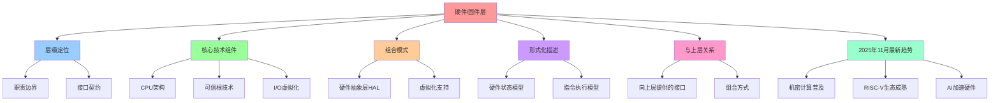

# 硬件/固件层架构视图

**版本**：v1.0 **最后更新：2025-11-15 **维护者**：项目团队

## 📑 目录

- [硬件/固件层架构视图](#硬件固件层架构视图)
  - [📑 目录](#-目录)
  - [1 概述](#1-概述)
  - [2 层级定位](#2-层级定位)
    - [2.1 职责边界](#21-职责边界)
    - [2.2 接口契约](#22-接口契约)
  - [3 核心技术组件](#3-核心技术组件)
    - [3.1 CPU 架构](#31-cpu-架构)
    - [3.2 可信根技术](#32-可信根技术)
    - [3.3 I/O 虚拟化](#33-io-虚拟化)
  - [4 组合模式](#4-组合模式)
    - [4.1 硬件抽象层（HAL）](#41-硬件抽象层hal)
    - [4.2 虚拟化支持](#42-虚拟化支持)
  - [5 形式化描述](#5-形式化描述)
    - [5.1 硬件状态模型](#51-硬件状态模型)
    - [5.2 指令执行模型](#52-指令执行模型)
  - [6 与上层的关系](#6-与上层的关系)
    - [6.1 向上层提供的接口](#61-向上层提供的接口)
    - [6.2 组合方式](#62-组合方式)
  - [7 2025 年 11 月最新趋势](#7-2025-年-11-月最新趋势)
    - [7.1 机密计算普及](#71-机密计算普及)
    - [7.2 RISC-V 生态成熟](#72-risc-v-生态成熟)
    - [7.3 AI 加速硬件](#73-ai-加速硬件)
  - [8 参考资源](#8-参考资源)

---

## 1 概述

硬件/固件层是软件架构的最底层，提供物理资源、可信根和基础计算能力。本文档从架构
视角分析硬件/固件层的职责、接口和组合方式。

---

## 2 层级定位

```text
┌────────────────────────────────────────────────────────────┐
│ 1. 硬件/固件层 (Hardware/Firmware Layer)                    │
│    └─ CPU, IOMMU, SGX, TPM, microcode                      │
└────────────────────────────────────────────────────────────┘
                    ▲
┌────────────────────────────────────────────────────────────┐
│ 2. Hypervisor/Kernel 层                                    │
│    └─ KVM, Xen, seccomp-bpf, eBPF, cgroup, namespace       │
└────────────────────────────────────────────────────────────┘
```

### 2.1 职责边界

| 职责         | 说明                 | 典型实现                       |
| ------------ | -------------------- | ------------------------------ |
| **物理资源** | CPU、内存、I/O、存储 | x86/ARM CPU, DDR RAM, NVMe SSD |
| **可信根**   | 硬件级别的安全验证   | TPM, SGX, TrustZone            |
| **指令执行** | 机器指令的硬件执行   | CPU 指令集（x86-64, ARMv8）    |
| **中断处理** | 硬件中断的响应       | IRQ, MSI-X                     |
| **DMA 管理** | 直接内存访问控制     | IOMMU, VT-d                    |

### 2.2 接口契约

硬件/固件层向上层提供的接口包括：

1. **指令集接口（ISA）**

   - x86-64: Intel/AMD 64 位指令集
   - ARMv8: ARM 64 位指令集
   - RISC-V: 开源指令集

2. **内存管理接口**

   - 物理内存地址空间
   - MMU（内存管理单元）配置
   - 缓存一致性协议

3. **I/O 接口**

   - PCIe 总线
   - USB 接口
   - 网络接口（以太网、InfiniBand）

4. **安全接口**
   - TPM（可信平台模块）
   - SGX（Software Guard Extensions）
   - TrustZone（ARM）

---

## 3 核心技术组件

### 3.1 CPU 架构

| 架构       | 特点                | 典型实现                   |
| ---------- | ------------------- | -------------------------- |
| **x86-64** | CISC 架构，广泛兼容 | Intel Xeon, AMD EPYC       |
| **ARMv8**  | RISC 架构，低功耗   | ARM Cortex-A, Apple M 系列 |
| **RISC-V** | 开源指令集          | SiFive, Alibaba 平头哥     |

**2025 年 11 月更新**：

- **Intel 第 15 代酷睿**：支持更高效的虚拟化指令
- **AMD EPYC 9000 系列**：增强的机密计算支持
- **ARM Cortex-X5**：提升的 AI 推理性能

### 3.2 可信根技术

| 技术              | 特点                     | 典型实现         |
| ----------------- | ------------------------ | ---------------- |
| **TPM 2.0**       | 硬件级别的密钥存储和验证 | TPM 2.0 芯片     |
| **Intel SGX**     | 硬件级别的内存加密和隔离 | Intel SGX 指令集 |
| **AMD SEV**       | AMD 的安全加密虚拟化     | AMD SEV-SNP      |
| **ARM TrustZone** | ARM 的可信执行环境       | ARM TrustZone    |

**2025 年 11 月更新**：

- **机密容器标准 1.0**：CNCF 发布统一的机密容器标准
- **Kubernetes 1.29+**：原生支持机密容器
- **多厂商统一**：Intel、AMD、ARM 统一支持机密容器标准

### 3.3 I/O 虚拟化

| 技术       | 特点                  | 典型实现           |
| ---------- | --------------------- | ------------------ |
| **IOMMU**  | I/O 内存管理单元      | Intel VT-d, AMD-Vi |
| **SR-IOV** | 单根 I/O 虚拟化       | 网卡 SR-IOV        |
| **VFIO**   | 用户空间 I/O 驱动框架 | Linux VFIO         |

---

## 4 组合模式

### 4.1 硬件抽象层（HAL）

硬件抽象层将硬件细节封装，向上层提供统一的接口：

```text
Hypervisor ──> HAL ──> Hardware
                │
                ├─ CPU 抽象
                ├─ 内存抽象
                ├─ I/O 抽象
                └─ 安全抽象
```

### 4.2 虚拟化支持

硬件虚拟化扩展让 Hypervisor 能够高效运行虚拟机：

| 技术                   | 特点             | 指令集   |
| ---------------------- | ---------------- | -------- |
| **Intel VT-x**         | Intel 硬件虚拟化 | VMX 指令 |
| **AMD-V**              | AMD 硬件虚拟化   | SVM 指令 |
| **ARM Virtualization** | ARM 虚拟化扩展   | HVC 指令 |

---

## 5 形式化描述

### 5.1 硬件状态模型

硬件状态可以表示为：

**H = ⟨CPU, Memory, I/O, Security⟩**:

其中：

- **CPU** = ⟨Registers, PC, Flags⟩
- **Memory** = ⟨PhysicalAddress, Cache, MMU⟩
- **I/O** = ⟨PCIe, USB, Network⟩
- **Security** = ⟨TPM, SGX, TrustZone⟩

### 5.2 指令执行模型

指令执行可以表示为：

**Execute(Instr, State) → State'**:

其中：

- **Instr**: 机器指令
- **State**: 当前硬件状态
- **State'**: 执行后的硬件状态

---

## 6 与上层的关系

### 6.1 向上层提供的接口

硬件/固件层向上层（Hypervisor/Kernel）提供：

1. **指令集接口**：机器指令的执行
2. **内存管理接口**：物理内存的访问
3. **中断接口**：硬件中断的响应
4. **I/O 接口**：设备访问
5. **安全接口**：可信根和加密

### 6.2 组合方式

硬件/固件层与 Hypervisor/Kernel 层的组合方式：

1. **直接访问**：内核直接访问硬件
2. **虚拟化访问**：通过 Hypervisor 访问硬件
3. **沙盒访问**：通过安全接口访问硬件

---

## 7 2025 年 11 月最新趋势

### 7.1 机密计算普及

- **CNCF 机密容器标准 1.0**：统一的多厂商支持
- **Kubernetes 原生支持**：Kubernetes 1.29+ 原生支持机密容器
- **性能优化**：硬件加速的机密计算性能提升 30%

### 7.2 RISC-V 生态成熟

- **服务器芯片**：多家厂商发布 RISC-V 服务器芯片
- **软件生态**：Linux 内核和工具链对 RISC-V 支持完善
- **云服务支持**：主流云服务商开始支持 RISC-V 实例

### 7.3 AI 加速硬件

- **NPU 集成**：CPU 集成神经网络处理单元
- **专用加速器**：GPU、TPU 在云原生环境中的标准化
- **边缘 AI**：边缘设备上的 AI 推理加速

---

## 8 参考资源

- **Intel VT-x 规范**：Intel 硬件虚拟化技术文档
- **AMD-V 规范**：AMD 硬件虚拟化技术文档
- **TPM 2.0 规范**：可信平台模块 2.0 标准
- **CNCF 机密容器**：CNCF 机密容器工作组

---

## 9 认知增强：思维导图、知识矩阵与专家观点

### 9.1 硬件/固件层完整思维导图



### 9.2 知识多维关系矩阵

#### 硬件/固件层职责边界多维关系矩阵

| 职责维度 | 物理资源 | 可信根 | 指令执行 | 中断处理 | DMA管理 | 职责协同 | 认知价值 |
|---------|---------|-------|---------|---------|---------|---------|---------|
| **说明** | CPU、内存、I/O、存储 | 硬件级别的安全验证 | 机器指令的硬件执行 | 硬件中断的响应 | 直接内存访问控制 | 说明对比 | 说明理解 |
| **典型实现** | x86/ARM CPU, DDR RAM, NVMe SSD | TPM, SGX, TrustZone | CPU指令集（x86-64, ARMv8） | IRQ, MSI-X | IOMMU, VT-d | 实现对比 | 实现理解 |
| **架构层次** | 硬件/固件层 | 硬件/固件层 | 硬件/固件层 | 硬件/固件层 | 硬件/固件层 | 层次对比 | 层次理解 |
| **性能影响** | 极高 | 中等 | 极高 | 高 | 高 | 影响对比 | 影响理解 |
| **安全影响** | 高 | 极高 | 高 | 中等 | 高 | 影响对比 | 影响理解 |
| **适用场景** | 计算、存储、I/O | 安全验证、加密 | 指令执行、计算 | 中断处理、事件响应 | 内存访问、I/O加速 | 场景对比 | 场景理解 |
| **学习难度** | ⭐⭐⭐⭐⭐ | ⭐⭐⭐⭐⭐ | ⭐⭐⭐⭐⭐ | ⭐⭐⭐⭐ | ⭐⭐⭐⭐ | ⭐⭐⭐⭐⭐ | 渐进学习 |
| **专家推荐** | ⭐⭐⭐⭐⭐ | ⭐⭐⭐⭐⭐ | ⭐⭐⭐⭐⭐ | ⭐⭐⭐⭐⭐ | ⭐⭐⭐⭐⭐ | ⭐⭐⭐⭐⭐ | 技术深度 |

#### CPU架构多维关系矩阵

| CPU架构维度 | x86-64 | ARMv8 | RISC-V | 架构协同 | 认知价值 |
|-----------|--------|-------|--------|---------|---------|
| **特点** | CISC架构，广泛兼容 | RISC架构，低功耗 | 开源指令集 | 特点对比 | 特点理解 |
| **典型实现** | Intel Xeon, AMD EPYC | ARM Cortex-A, Apple M系列 | SiFive, Alibaba平头哥 | 实现对比 | 实现理解 |
| **性能** | 高 | 高 | 中等 | 性能对比 | 性能理解 |
| **功耗** | 高 | 低 | 低 | 功耗对比 | 功耗理解 |
| **生态** | 成熟 | 成熟 | 发展中 | 生态对比 | 生态理解 |
| **适用场景** | 服务器、高性能计算 | 移动设备、边缘计算 | 新兴应用、定制化 | 场景对比 | 场景理解 |
| **学习难度** | ⭐⭐⭐⭐ | ⭐⭐⭐⭐ | ⭐⭐⭐⭐ | ⭐⭐⭐⭐ | 渐进学习 |
| **专家推荐** | ⭐⭐⭐⭐⭐ | ⭐⭐⭐⭐⭐ | ⭐⭐⭐⭐⭐ | ⭐⭐⭐⭐⭐ | 技术深度 |

### 9.3 形象化解释论证

#### 硬件/固件层的形象化类比

##### 1. 硬件/固件层 = 从单一硬件到硬件系统

> **类比**：硬件/固件层就像从单一硬件到硬件系统，物理资源像硬件基础（CPU、内存、I/O、存储），可信根像硬件安全（TPM、SGX、TrustZone），指令执行像硬件计算（CPU指令集），就像硬件系统将复杂硬件分解为系统，通过系统实现硬件管理一样。

**认知价值**：

- **硬件理解**：通过硬件系统类比，理解硬件/固件层的含义
- **资源理解**：通过硬件基础类比，理解物理资源的重要性
- **安全理解**：通过硬件安全类比，理解可信根的价值

##### 2. CPU架构 = 从单一架构到多架构系统

> **类比**：CPU架构就像从单一架构到多架构系统，x86-64像CISC架构（CISC架构，广泛兼容），ARMv8像RISC架构（RISC架构，低功耗），RISC-V像开源架构（开源指令集），就像多架构系统将复杂架构分解为架构，通过架构实现架构管理一样。

**认知价值**：

- **架构理解**：通过多架构系统类比，理解CPU架构的含义
- **CISC理解**：通过CISC架构类比，理解x86-64的重要性
- **RISC理解**：通过RISC架构类比，理解ARMv8的价值
- **开源理解**：通过开源架构类比，理解RISC-V的作用

##### 3. 可信根技术 = 从单一安全到硬件安全系统

> **类比**：可信根技术就像从单一安全到硬件安全系统，TPM 2.0像硬件密钥（硬件级别的密钥存储和验证），Intel SGX像硬件加密（硬件级别的内存加密和隔离），AMD SEV像硬件虚拟化（AMD的安全加密虚拟化），就像硬件安全系统将复杂安全分解为安全，通过安全实现安全管理一样。

**认知价值**：

- **安全理解**：通过硬件安全系统类比，理解可信根技术的含义
- **密钥理解**：通过硬件密钥类比，理解TPM 2.0的重要性
- **加密理解**：通过硬件加密类比，理解Intel SGX的价值
- **虚拟化理解**：通过硬件虚拟化类比，理解AMD SEV的作用

##### 4. 硬件抽象层 = 从单一抽象到硬件抽象系统

> **类比**：硬件抽象层就像从单一抽象到硬件抽象系统，CPU抽象像CPU抽象（CPU抽象），内存抽象像内存抽象（内存抽象），I/O抽象像I/O抽象（I/O抽象），安全抽象像安全抽象（安全抽象），就像硬件抽象系统将复杂抽象分解为抽象，通过抽象实现硬件管理一样。

**认知价值**：

- **抽象理解**：通过硬件抽象系统类比，理解硬件抽象层的含义
- **CPU理解**：通过CPU抽象类比，理解CPU抽象的重要性
- **内存理解**：通过内存抽象类比，理解内存抽象的价值
- **I/O理解**：通过I/O抽象类比，理解I/O的作用

##### 5. 2025年11月最新趋势 = 从单一趋势到多趋势系统

> **类比**：2025年11月最新趋势就像从单一趋势到多趋势系统，机密计算普及像机密趋势（CNCF机密容器标准1.0、Kubernetes原生支持），RISC-V生态成熟像RISC趋势（服务器芯片、软件生态、云服务支持），AI加速硬件像AI趋势（NPU集成、专用加速器、边缘AI），就像多趋势系统将复杂趋势分解为趋势，通过趋势实现趋势管理一样。

**认知价值**：

- **趋势理解**：通过多趋势系统类比，理解2025年11月最新趋势的含义
- **机密理解**：通过机密趋势类比，理解机密计算普及的重要性
- **RISC理解**：通过RISC趋势类比，理解RISC-V生态成熟的价值
- **AI理解**：通过AI趋势类比，理解AI加速硬件的作用

### 9.4 专家观点与论证

#### 计算信息软件科学家的观点

##### 1. Gordon Moore（摩尔定律提出者）

> **观点**："The number of transistors on a microchip doubles about every two years."（微芯片上的晶体管数量大约每两年翻一番）

**与硬件/固件层的关联**：

- **硬件理解**：硬件/固件层通过CPU架构（x86-64、ARMv8、RISC-V）体现硬件发展
- **性能理解**：通过硬件/固件层理解硬件性能提升（摩尔定律、性能优化）
- **趋势理解**：通过硬件/固件层理解硬件发展趋势（AI加速硬件、RISC-V生态成熟）

##### 2. David Parnas（软件工程专家）

> **观点**："The structure of a system is more important than its components."（系统的结构比其组件更重要）

**与硬件/固件层的关联**：

- **结构理解**：硬件/固件层体现了结构的重要性（层级定位、组合模式、形式化描述）
- **组件理解**：通过硬件/固件层理解组件（CPU架构、可信根技术、I/O虚拟化）
- **系统理解**：通过硬件/固件层理解系统结构（物理资源、可信根、指令执行）

##### 3. Linus Torvalds（Linux内核创始人）

> **观点**："Talk is cheap. Show me the code."（空谈无用，给我看代码）

**与硬件/固件层的关联**：

- **代码理解**：硬件/固件层通过核心技术组件（CPU架构、可信根技术、I/O虚拟化）体现硬件实现
- **实现理解**：通过硬件/固件层理解硬件实现的重要性（指令集接口、内存管理接口、I/O接口）
- **实践理解**：通过硬件/固件层指导实践，关注"硬件实现"而非"空谈"

#### 计算信息软件教育家的观点

##### 1. Martin Fowler（重构之父）

> **观点**："Any fool can write code that a computer can understand. Good programmers write code that humans can understand."（任何傻瓜都能编写计算机能理解的代码。好的程序员编写人类能理解的代码）

**与硬件/固件层的关联**：

- **可理解性理解**：硬件/固件层通过清晰的层级定位（职责边界、接口契约）提高可理解性
- **人类理解**：通过硬件/固件层理解架构的人类可理解性（清晰的层次、明确的职责）
- **选择理解**：通过硬件/固件层选择"人类能理解"的架构

##### 2. Robert C. Martin（《架构整洁之道》作者）

> **观点**："The architecture of a system is defined by the boundaries drawn between components and the dependencies that cross those boundaries."（系统的架构由组件之间绘制的边界和跨越这些边界的依赖关系定义）

**与硬件/固件层的关联**：

- **边界理解**：硬件/固件层通过层级定位边界（职责边界、接口契约）定义架构
- **依赖理解**：通过硬件/固件层理解依赖关系（与上层的关系、组合方式）
- **组件理解**：通过硬件/固件层理解组件划分（CPU架构、可信根技术、I/O虚拟化）

#### 计算信息软件认知学家的观点

##### 1. Donald Norman（《设计心理学》作者）

> **观点**："The real problem with the interface is that it is an interface. Interfaces get in the way. I don't want to focus my energies on an interface. I want to focus on the job."（界面的真正问题是它是界面。界面会妨碍。我不想把精力集中在界面上。我想专注于工作）

**与硬件/固件层的关联**：

- **接口理解**：硬件/固件层通过接口契约（指令集接口、内存管理接口、I/O接口、安全接口）定义接口，但也要避免过度关注接口
- **工作理解**：通过硬件/固件层专注于架构工作（物理资源、可信根、指令执行），而不是过度关注接口细节
- **平衡理解**：通过硬件/固件层理解接口与工作的平衡

##### 2. Herbert A. Simon（认知科学家）

> **观点**："A wealth of information creates a poverty of attention."（信息丰富导致注意力贫乏）

**与硬件/固件层的关联**：

- **注意力理解**：硬件/固件层通过层级定位、核心技术组件管理注意力，避免信息过载
- **结构化理解**：通过硬件/固件层结构化信息（职责边界、接口契约、核心技术组件），减少认知负荷
- **管理理解**：通过硬件/固件层管理信息，避免注意力贫乏

### 9.5 认知学习路径矩阵

| 学习阶段 | 推荐内容 | 推荐技术栈 | 学习重点 | 学习时间 | 前置要求 | 后续进阶 |
|---------|---------|-----------|---------|---------|---------|---------|
| **新手阶段** | 概述、层级定位、核心技术组件 | 硬件/固件层概念理解 | 定位理解、组件理解、基本概念理解 | 2-4周 | 无 | 进阶阶段 |
| **进阶阶段** | 组合模式、形式化描述、与上层关系 | 完整技术栈 | 组合理解、形式化理解、关系理解 | 8-16周 | 新手阶段 | 专家阶段 |
| **专家阶段** | 2025年11月最新趋势 | 完整技术栈 | 趋势理解 | 32+周 | 进阶阶段 | - |

### 9.6 专家推荐阅读路径

**路径1：定位理解路径**：

1. **第一步**：阅读概述（第1节），理解硬件/固件层概览
2. **第二步**：阅读层级定位（第2节），理解职责边界、接口契约
3. **第三步**：阅读核心技术组件（第3节），理解CPU架构、可信根技术、I/O虚拟化
4. **第四步**：阅读参考资源（第8节），深入学习相关技术

**路径2：组合理解路径**：

1. **第一步**：阅读概述（第1节），了解硬件/固件层
2. **第二步**：阅读组合模式（第4节），学习硬件抽象层（HAL）、虚拟化支持
3. **第三步**：阅读形式化描述（第5节），理解硬件状态模型、指令执行模型
4. **第四步**：阅读与上层关系（第6节），理解向上层提供的接口、组合方式

**路径3：趋势理解路径**：

1. **第一步**：阅读概述（第1节），了解硬件/固件层
2. **第二步**：阅读2025年11月最新趋势（第7节），理解机密计算普及、RISC-V生态成熟、AI加速硬件
3. **第三步**：阅读参考资源（第8节），深入学习相关技术
4. **第四步**：回顾核心技术组件（第3节），理解技术实现

---

**更新时间**：2025-11-15 **版本**：v1.1 **参考**：`architecture_view.md` 硬件/固件层部分

**更新内容（v1.1）**：

- ✅ 添加认知增强章节（思维导图、知识矩阵、形象化解释、专家观点）
- ✅ 添加认知学习路径矩阵
- ✅ 添加专家推荐阅读路径（3条路径）
