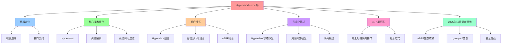

# Hypervisor/Kernel 层架构视图

**版本**：v1.0 **最后更新：2025-11-15 **维护者**：项目团队

## 📑 目录

- [Hypervisor/Kernel 层架构视图](#hypervisorkernel-层架构视图)
  - [📑 目录](#-目录)
  - [1 概述](#1-概述)
  - [2 层级定位](#2-层级定位)
    - [2.1 职责边界](#21-职责边界)
    - [2.2 接口契约](#22-接口契约)
  - [3 核心技术组件](#3-核心技术组件)
    - [3.1 Hypervisor](#31-hypervisor)
    - [3.2 资源隔离](#32-资源隔离)
    - [3.3 系统调用过滤](#33-系统调用过滤)
  - [4 组合模式](#4-组合模式)
    - [4.1 Hypervisor 组合](#41-hypervisor-组合)
    - [4.2 容器运行时组合](#42-容器运行时组合)
    - [4.3 eBPF 组合](#43-ebpf-组合)
  - [5 形式化描述](#5-形式化描述)
    - [5.1 Hypervisor 状态模型](#51-hypervisor-状态模型)
    - [5.2 资源调度模型](#52-资源调度模型)
    - [5.3 隔离模型](#53-隔离模型)
  - [6 与上层的关系](#6-与上层的关系)
    - [6.1 向上层提供的接口](#61-向上层提供的接口)
    - [6.2 组合方式](#62-组合方式)
  - [7 2025 年 11 月最新趋势](#7-2025-年-11-月最新趋势)
    - [7.1 eBPF 生态成熟](#71-ebpf-生态成熟)
    - [7.2 cgroup v2 普及](#72-cgroup-v2-普及)
    - [7.3 安全增强](#73-安全增强)
  - [8 参考资源](#8-参考资源)

---

## 1 概述

Hypervisor/Kernel 层位于硬件/固件层之上，负责资源调度、隔离和系统调用过滤。本文
档从架构视角分析 Hypervisor/Kernel 层的职责、接口和组合方式。

---

## 2 层级定位

```text
┌────────────────────────────────────────────────────────────┐
│ 2. Hypervisor/Kernel 层                                    │
│    └─ KVM, Xen, seccomp-bpf, eBPF, cgroup, namespace       │
└────────────────────────────────────────────────────────────┘
                    ▲
┌────────────────────────────────────────────────────────────┐
│ 3. 编排层 (Orchestration Layer)                            │
│    └─ Kubernetes, Pod, Deployment, Service                 │
└────────────────────────────────────────────────────────────┘
```

### 2.1 职责边界

| 职责             | 说明                         | 典型实现                   |
| ---------------- | ---------------------------- | -------------------------- |
| **VM 调度**      | 虚拟机的创建、销毁和资源分配 | KVM, Xen, Hyper-V          |
| **资源隔离**     | CPU、内存、I/O 的资源隔离    | cgroup, namespace          |
| **系统调用过滤** | 进程系统调用的细粒度控制     | seccomp-bpf, eBPF          |
| **网络策略**     | 网络流量的策略控制           | eBPF, iptables             |
| **文件系统隔离** | 文件系统的访问控制           | overlayfs, mount namespace |

### 2.2 接口契约

Hypervisor/Kernel 层向上层提供的接口包括：

1. **虚拟化接口**

   - KVM API：Linux 内核虚拟化接口
   - Xen API：Xen Hypervisor 接口
   - Hyper-V API：Windows Hyper-V 接口

2. **容器接口**

   - cgroup v2：资源控制接口
   - namespace：命名空间隔离接口
   - seccomp：系统调用过滤接口

3. **网络接口**
   - eBPF：可编程网络策略
   - iptables：传统防火墙规则
   - netfilter：网络过滤框架

---

## 3 核心技术组件

### 3.1 Hypervisor

| 技术        | 特点              | 典型实现          |
| ----------- | ----------------- | ----------------- |
| **KVM**     | Linux 内核虚拟化  | KVM/QEMU          |
| **Xen**     | Type-1 Hypervisor | Xen Project       |
| **Hyper-V** | Windows 虚拟化    | Microsoft Hyper-V |
| **bhyve**   | FreeBSD 虚拟化    | FreeBSD bhyve     |

**2025 年 11 月更新**：

- **KVM 6.9**：增强的嵌套虚拟化支持
- **Xen 4.19**：更好的 ARM 支持
- **Hyper-V 2025**：增强的机密计算支持

### 3.2 资源隔离

| 技术          | 特点                   | 典型实现                      |
| ------------- | ---------------------- | ----------------------------- |
| **cgroup v2** | 统一资源控制接口       | Linux cgroup v2               |
| **namespace** | 命名空间隔离           | pid, mnt, net, ipc, uts, user |
| **cgroup v1** | 传统资源控制（已废弃） | Linux cgroup v1               |

**2025 年 11 月更新**：

- **cgroup v2 默认启用**：所有新 Linux 发行版默认使用 cgroup v2
- **统一控制器**：CPU、内存、I/O 统一管理
- **性能优化**：cgroup v2 性能提升 20%

### 3.3 系统调用过滤

| 技术            | 特点                    | 典型实现       |
| --------------- | ----------------------- | -------------- |
| **seccomp-bpf** | 基于 BPF 的系统调用过滤 | Linux seccomp  |
| **eBPF**        | 可编程内核过滤器        | Linux eBPF     |
| **Landlock**    | 文件系统访问控制        | Linux Landlock |
| **AppArmor**    | 应用级访问控制          | AppArmor       |

**2025 年 11 月更新**：

- **eBPF 5.20**：Linux 内核 6.7+ 支持更多 eBPF 功能
- **Landlock 3.0**：增强的文件系统访问控制
- **seccomp 增强**：支持更细粒度的系统调用过滤

---

## 4 组合模式

### 4.1 Hypervisor 组合

Hypervisor 与硬件层组合，提供虚拟化能力：

```text
Hardware ──> Hypervisor ──> VM
              │
              ├─ VT-x/SVM (硬件虚拟化)
              ├─ IOMMU (I/O 虚拟化)
              └─ TPM/SGX (安全虚拟化)
```

### 4.2 容器运行时组合

内核与容器运行时组合，提供容器隔离：

```text
Kernel ──> cgroup/namespace ──> Container
          │
          ├─ cgroup v2 (资源控制)
          ├─ namespace (隔离)
          └─ seccomp (安全过滤)
```

### 4.3 eBPF 组合

eBPF 与内核组合，提供可编程策略：

```text
Kernel ──> eBPF ──> Policy
         │
         ├─ 网络策略 (Cilium)
         ├─ 安全监控 (Falco)
         └─ 可观测性 (Pixie)
```

---

## 5 形式化描述

### 5.1 Hypervisor 状态模型

Hypervisor 状态可以表示为：

**H = ⟨VMs, Resources, Policies⟩**:

其中：

- **VMs** = {vm₁, vm₂, ..., vmₙ}
- **Resources** = ⟨CPU, Memory, I/O⟩
- **Policies** = ⟨Scheduling, Isolation, Security⟩

### 5.2 资源调度模型

资源调度可以表示为：

**Schedule(VM, Resources) → Allocation**:

其中：

- **VM**: 虚拟机请求
- **Resources**: 可用资源
- **Allocation**: 资源分配结果

### 5.3 隔离模型

隔离可以表示为：

**Isolate(Process, Namespace) → IsolatedProcess**:

其中：

- **Process**: 原始进程
- **Namespace**: 命名空间配置
- **IsolatedProcess**: 隔离后的进程

---

## 6 与上层的关系

### 6.1 向上层提供的接口

Hypervisor/Kernel 层向上层（编排层）提供：

1. **虚拟化接口**：VM 的创建和管理
2. **容器接口**：容器的创建和管理
3. **资源控制接口**：CPU、内存、I/O 的资源限制
4. **安全接口**：系统调用过滤和访问控制

### 6.2 组合方式

Hypervisor/Kernel 层与编排层的组合方式：

1. **CRI 接口**：容器运行时接口（Container Runtime Interface）
2. **CNI 接口**：容器网络接口（Container Network Interface）
3. **CSI 接口**：容器存储接口（Container Storage Interface）

---

## 7 2025 年 11 月最新趋势

### 7.1 eBPF 生态成熟

- **更多内核功能**：eBPF 5.20 支持更多内核功能
- **工具链完善**：BCC、bpftrace 工具链完善
- **云原生集成**：Cilium、Falco 等工具在 Kubernetes 中的广泛应用

### 7.2 cgroup v2 普及

- **默认启用**：所有新 Linux 发行版默认使用 cgroup v2
- **性能提升**：cgroup v2 性能提升 20%
- **统一管理**：CPU、内存、I/O 统一管理

### 7.3 安全增强

- **Landlock 3.0**：增强的文件系统访问控制
- **seccomp 增强**：支持更细粒度的系统调用过滤
- **机密计算支持**：KVM 6.9 增强的机密计算支持

---

## 8 参考资源

- **Linux Kernel Documentation**：Linux 内核文档
- **KVM Documentation**：KVM 虚拟化文档
- **eBPF Documentation**：eBPF 编程文档
- **cgroup v2 Documentation**：cgroup v2 资源控制文档

---

## 9 认知增强：思维导图、知识矩阵与专家观点

### 9.1 Hypervisor/Kernel层完整思维导图



### 9.2 知识多维关系矩阵

#### Hypervisor/Kernel层职责边界多维关系矩阵

| 职责维度 | VM调度 | 资源隔离 | 系统调用过滤 | 网络策略 | 文件系统隔离 | 职责协同 | 认知价值 |
|---------|-------|---------|------------|---------|------------|---------|---------|
| **说明** | 虚拟机的创建、销毁和资源分配 | CPU、内存、I/O的资源隔离 | 进程系统调用的细粒度控制 | 网络流量的策略控制 | 文件系统的访问控制 | 说明对比 | 说明理解 |
| **典型实现** | KVM, Xen, Hyper-V | cgroup, namespace | seccomp-bpf, eBPF | eBPF, iptables | overlayfs, mount namespace | 实现对比 | 实现理解 |
| **架构层次** | Hypervisor/Kernel层 | Hypervisor/Kernel层 | Hypervisor/Kernel层 | Hypervisor/Kernel层 | Hypervisor/Kernel层 | 层次对比 | 层次理解 |
| **性能影响** | 高 | 高 | 中等 | 中等 | 中等 | 影响对比 | 影响理解 |
| **安全影响** | 高 | 高 | 高 | 高 | 高 | 影响对比 | 影响理解 |
| **适用场景** | 虚拟化、资源管理 | 资源管理、性能控制 | 安全加固、权限控制 | 网络管理、安全策略 | 文件系统管理、安全隔离 | 场景对比 | 场景理解 |
| **学习难度** | ⭐⭐⭐⭐⭐ | ⭐⭐⭐⭐ | ⭐⭐⭐⭐⭐ | ⭐⭐⭐⭐ | ⭐⭐⭐ | ⭐⭐⭐⭐ | 渐进学习 |
| **专家推荐** | ⭐⭐⭐⭐⭐ | ⭐⭐⭐⭐⭐ | ⭐⭐⭐⭐⭐ | ⭐⭐⭐⭐⭐ | ⭐⭐⭐⭐⭐ | ⭐⭐⭐⭐⭐ | 技术深度 |

#### Hypervisor技术多维关系矩阵

| Hypervisor维度 | KVM | Xen | Hyper-V | bhyve | Hypervisor协同 | 认知价值 |
|---------------|-----|-----|---------|-------|---------------|---------|
| **特点** | Linux内核虚拟化 | Type-1 Hypervisor | Windows虚拟化 | FreeBSD虚拟化 | 特点对比 | 特点理解 |
| **典型实现** | KVM/QEMU | Xen Project | Microsoft Hyper-V | FreeBSD bhyve | 实现对比 | 实现理解 |
| **性能** | 高 | 高 | 高 | 高 | 性能对比 | 性能理解 |
| **安全性** | 高 | 高 | 高 | 高 | 安全对比 | 安全理解 |
| **适用场景** | Linux环境、云平台 | 企业虚拟化、云平台 | Windows环境、企业虚拟化 | FreeBSD环境 | 场景对比 | 场景理解 |
| **学习难度** | ⭐⭐⭐⭐ | ⭐⭐⭐⭐ | ⭐⭐⭐⭐ | ⭐⭐⭐⭐ | ⭐⭐⭐⭐ | 渐进学习 |
| **专家推荐** | ⭐⭐⭐⭐⭐ | ⭐⭐⭐⭐⭐ | ⭐⭐⭐⭐⭐ | ⭐⭐⭐⭐⭐ | ⭐⭐⭐⭐⭐ | 技术深度 |

### 9.3 形象化解释论证

#### Hypervisor/Kernel层的形象化类比

##### 1. Hypervisor/Kernel层 = 从单一资源到资源管理系统

> **类比**：Hypervisor/Kernel层就像从单一资源到资源管理系统，VM调度像资源调度（虚拟机的创建、销毁和资源分配），资源隔离像资源隔离（CPU、内存、I/O的资源隔离），系统调用过滤像资源过滤（进程系统调用的细粒度控制），就像资源管理系统将复杂资源分解为系统，通过系统实现资源管理一样。

**认知价值**：

- **资源理解**：通过资源管理系统类比，理解Hypervisor/Kernel层的含义
- **调度理解**：通过资源调度类比，理解VM调度的重要性
- **隔离理解**：通过资源隔离类比，理解资源隔离的价值

##### 2. Hypervisor组合 = 从单一Hypervisor到多Hypervisor系统

> **类比**：Hypervisor组合就像从单一Hypervisor到多Hypervisor系统，KVM像Linux Hypervisor（Linux内核虚拟化），Xen像Type-1 Hypervisor（Type-1 Hypervisor），Hyper-V像Windows Hypervisor（Windows虚拟化），就像多Hypervisor系统将复杂Hypervisor分解为系统，通过系统实现Hypervisor管理一样。

**认知价值**：

- **组合理解**：通过多Hypervisor系统类比，理解Hypervisor组合的含义
- **Linux理解**：通过Linux Hypervisor类比，理解KVM的重要性
- **Type-1理解**：通过Type-1 Hypervisor类比，理解Xen的价值

##### 3. eBPF组合 = 从单一过滤到可编程过滤系统

> **类比**：eBPF组合就像从单一过滤到可编程过滤系统，系统调用过滤像调用过滤（seccomp-bpf、eBPF），网络策略像网络过滤（eBPF、iptables），就像可编程过滤系统将复杂过滤分解为系统，通过系统实现过滤管理一样。

**认知价值**：

- **过滤理解**：通过可编程过滤系统类比，理解eBPF组合的含义
- **调用理解**：通过调用过滤类比，理解系统调用过滤的重要性
- **网络理解**：通过网络过滤类比，理解网络策略的价值

##### 4. 与上层关系 = 从单一接口到多接口系统

> **类比**：与上层关系就像从单一接口到多接口系统，虚拟化接口像虚拟化接口（KVM API、Xen API、Hyper-V API），容器接口像容器接口（cgroup v2、namespace、seccomp），网络接口像网络接口（eBPF、iptables、netfilter），就像多接口系统将复杂接口分解为接口，通过接口实现上层管理一样。

**认知价值**：

- **接口理解**：通过多接口系统类比，理解与上层关系的含义
- **虚拟化理解**：通过虚拟化接口类比，理解虚拟化接口的重要性
- **容器理解**：通过容器接口类比，理解容器接口的价值
- **网络理解**：通过网络接口类比，理解网络接口的作用

##### 5. 2025年11月最新趋势 = 从单一趋势到多趋势系统

> **类比**：2025年11月最新趋势就像从单一趋势到多趋势系统，eBPF生态成熟像eBPF趋势（eBPF生态成熟），cgroup v2普及像cgroup趋势（cgroup v2普及），安全增强像安全趋势（安全增强），就像多趋势系统将复杂趋势分解为趋势，通过趋势实现趋势管理一样。

**认知价值**：

- **趋势理解**：通过多趋势系统类比，理解2025年11月最新趋势的含义
- **eBPF理解**：通过eBPF趋势类比，理解eBPF生态成熟的重要性
- **cgroup理解**：通过cgroup趋势类比，理解cgroup v2普及的价值
- **安全理解**：通过安全趋势类比，理解安全增强的作用

### 9.4 专家观点与论证

#### 计算信息软件科学家的观点

##### 1. Linus Torvalds（Linux内核创始人）

> **观点**："Talk is cheap. Show me the code."（空谈无用，给我看代码）

**与Hypervisor/Kernel层的关联**：

- **代码理解**：Hypervisor/Kernel层通过核心技术组件（Hypervisor、资源隔离、系统调用过滤）体现代码实现
- **实现理解**：通过Hypervisor/Kernel层理解技术实现的重要性（KVM、Xen、eBPF）
- **实践理解**：通过Hypervisor/Kernel层指导实践，关注"代码实现"而非"空谈"

##### 2. David Parnas（软件工程专家）

> **观点**："The structure of a system is more important than its components."（系统的结构比其组件更重要）

**与Hypervisor/Kernel层的关联**：

- **结构理解**：Hypervisor/Kernel层体现了结构的重要性（层级定位、组合模式、形式化描述）
- **组件理解**：通过Hypervisor/Kernel层理解组件（Hypervisor、资源隔离、系统调用过滤）
- **系统理解**：通过Hypervisor/Kernel层理解系统结构（VM调度、资源隔离、网络策略）

##### 3. Edsger W. Dijkstra（计算机科学家）

> **观点**："Simplicity is prerequisite for reliability."（简单性是可靠性的前提）

**与Hypervisor/Kernel层的关联**：

- **简单性理解**：Hypervisor/Kernel层通过清晰的职责边界（VM调度、资源隔离、系统调用过滤）体现简单性
- **可靠性理解**：通过Hypervisor/Kernel层理解简单性与可靠性的关系（清晰的接口、明确的职责）
- **设计理解**：通过Hypervisor/Kernel层指导设计，追求"简单性"以实现"可靠性"

#### 计算信息软件教育家的观点

##### 1. Martin Fowler（重构之父）

> **观点**："Any fool can write code that a computer can understand. Good programmers write code that humans can understand."（任何傻瓜都能编写计算机能理解的代码。好的程序员编写人类能理解的代码）

**与Hypervisor/Kernel层的关联**：

- **可理解性理解**：Hypervisor/Kernel层通过清晰的层级定位（职责边界、接口契约）提高可理解性
- **人类理解**：通过Hypervisor/Kernel层理解架构的人类可理解性（清晰的层次、明确的职责）
- **选择理解**：通过Hypervisor/Kernel层选择"人类能理解"的架构

##### 2. Robert C. Martin（《架构整洁之道》作者）

> **观点**："The architecture of a system is defined by the boundaries drawn between components and the dependencies that cross those boundaries."（系统的架构由组件之间绘制的边界和跨越这些边界的依赖关系定义）

**与Hypervisor/Kernel层的关联**：

- **边界理解**：Hypervisor/Kernel层通过层级定位边界（职责边界、接口契约）定义架构
- **依赖理解**：通过Hypervisor/Kernel层理解依赖关系（与上层的关系、组合方式）
- **组件理解**：通过Hypervisor/Kernel层理解组件划分（Hypervisor、资源隔离、系统调用过滤）

#### 计算信息软件认知学家的观点

##### 1. Donald Norman（《设计心理学》作者）

> **观点**："The real problem with the interface is that it is an interface. Interfaces get in the way. I don't want to focus my energies on an interface. I want to focus on the job."（界面的真正问题是它是界面。界面会妨碍。我不想把精力集中在界面上。我想专注于工作）

**与Hypervisor/Kernel层的关联**：

- **接口理解**：Hypervisor/Kernel层通过接口契约（虚拟化接口、容器接口、网络接口）定义接口，但也要避免过度关注接口
- **工作理解**：通过Hypervisor/Kernel层专注于架构工作（VM调度、资源隔离、系统调用过滤），而不是过度关注接口细节
- **平衡理解**：通过Hypervisor/Kernel层理解接口与工作的平衡

##### 2. Herbert A. Simon（认知科学家）

> **观点**："A wealth of information creates a poverty of attention."（信息丰富导致注意力贫乏）

**与Hypervisor/Kernel层的关联**：

- **注意力理解**：Hypervisor/Kernel层通过层级定位、核心技术组件管理注意力，避免信息过载
- **结构化理解**：通过Hypervisor/Kernel层结构化信息（职责边界、接口契约、核心技术组件），减少认知负荷
- **管理理解**：通过Hypervisor/Kernel层管理信息，避免注意力贫乏

### 9.5 认知学习路径矩阵

| 学习阶段 | 推荐内容 | 推荐技术栈 | 学习重点 | 学习时间 | 前置要求 | 后续进阶 |
|---------|---------|-----------|---------|---------|---------|---------|
| **新手阶段** | 概述、层级定位、核心技术组件 | Hypervisor/Kernel层概念理解 | 定位理解、组件理解、基本概念理解 | 2-4周 | 无 | 进阶阶段 |
| **进阶阶段** | 组合模式、形式化描述、与上层关系 | 完整技术栈 | 组合理解、形式化理解、关系理解 | 8-16周 | 新手阶段 | 专家阶段 |
| **专家阶段** | 2025年11月最新趋势 | 完整技术栈 | 趋势理解 | 32+周 | 进阶阶段 | - |

### 9.6 专家推荐阅读路径

**路径1：定位理解路径**：

1. **第一步**：阅读概述（第1节），理解Hypervisor/Kernel层概览
2. **第二步**：阅读层级定位（第2节），理解职责边界、接口契约
3. **第三步**：阅读核心技术组件（第3节），理解Hypervisor、资源隔离、系统调用过滤
4. **第四步**：阅读参考资源（第8节），深入学习相关技术

**路径2：组合理解路径**：

1. **第一步**：阅读概述（第1节），了解Hypervisor/Kernel层
2. **第二步**：阅读组合模式（第4节），学习Hypervisor组合、容器运行时组合、eBPF组合
3. **第三步**：阅读形式化描述（第5节），理解Hypervisor状态模型、资源调度模型、隔离模型
4. **第四步**：阅读与上层关系（第6节），理解向上层提供的接口、组合方式

**路径3：趋势理解路径**：

1. **第一步**：阅读概述（第1节），了解Hypervisor/Kernel层
2. **第二步**：阅读2025年11月最新趋势（第7节），理解eBPF生态成熟、cgroup v2普及、安全增强
3. **第三步**：阅读参考资源（第8节），深入学习相关技术
4. **第四步**：回顾核心技术组件（第3节），理解技术实现

---

**更新时间**：2025-11-15 **版本**：v1.1 **参考**：`architecture_view.md` Hypervisor/Kernel层部分

**更新内容（v1.1）**：

- ✅ 添加认知增强章节（思维导图、知识矩阵、形象化解释、专家观点）
- ✅ 添加认知学习路径矩阵
- ✅ 添加专家推荐阅读路径（3条路径）
