# 分层架构模型

**版本**：v1.0 **最后更新：2025-11-15 **维护者**：项目团队

## 📑 目录

- [分层架构模型](#分层架构模型)
  - [📑 目录](#-目录)
  - [1 概述](#1-概述)
    - [1.1 核心思想](#11-核心思想)
  - [2 整体分层模型](#2-整体分层模型)
  - [3 各层职责详解](#3-各层职责详解)
  - [4 层级关系与依赖](#4-层级关系与依赖)
    - [4.1 依赖方向](#41-依赖方向)
    - [4.2 接口契约](#42-接口契约)
  - [5 状态空间压缩](#5-状态空间压缩)
    - [5.1 各层状态空间](#51-各层状态空间)
    - [5.2 压缩收益](#52-压缩收益)
  - [6 跨层组合模式](#6-跨层组合模式)
    - [6.1 垂直组合](#61-垂直组合)
    - [6.2 水平组合](#62-水平组合)
  - [7 裁剪路径](#7-裁剪路径)
    - [7.1 裁剪效果](#71-裁剪效果)
  - [8 典型案例：支付网关](#8-典型案例支付网关)
  - [9 2025 年分层架构趋势](#9-2025-年分层架构趋势)
    - [9.1 轻量化](#91-轻量化)
    - [9.2 边缘计算](#92-边缘计算)
    - [9.3 机密计算](#93-机密计算)
  - [10 总结](#10-总结)
  - [11 参考资源](#11-参考资源)

---

## 1 概述

本文档阐述从硬件到业务的分层架构模型，包括 9 个主要层级及其职责、依赖关系、状态
空间压缩和组合模式。

### 1.1 核心思想

> **分层架构通过逐层抽象和状态空间压缩，将复杂的硬件-操作系统-网络-应用状态压缩
> 为可管理的、可版本化的、可观测的中间层模型，让架构师聚焦业务逻辑而非底层细节**

---

## 2 整体分层模型

从硬件到业务，软件架构可以划分为以下层次：

```text
┌────────────────────────────────────────────────────────────┐
│ 9. 应用层 (Application Layer)                               │
│    └─ 业务微服务、API、前端                                  │
└────────────────────────────────────────────────────────────┘
                    ▲
┌────────────────────────────────────────────────────────────┐
│ 8. Service Mesh 层 (Service Mesh Layer)                    │
│    └─ Istio/Linkerd sidecars、流量治理、mTLS                │
└────────────────────────────────────────────────────────────┘
                    ▲
┌────────────────────────────────────────────────────────────┐
│ 7. Network Service Mesh 层 (NSM Layer)                     │
│    └─ vL3 + vWire + Network Service Endpoints              │
└────────────────────────────────────────────────────────────┘
                    ▲
┌────────────────────────────────────────────────────────────┐
│ 6. 沙盒层 (Sandbox Layer)                                  │
│    └─ seccomp-bpf, eBPF, Landlock, AppArmor                │
└────────────────────────────────────────────────────────────┘
                    ▲
┌────────────────────────────────────────────────────────────┐
│ 5. 容器运行时层 (Container Runtime Layer)                   │
│    └─ runc, Kata, gVisor, Firecracker, WasmEdge            │
└────────────────────────────────────────────────────────────┘
                    ▲
┌────────────────────────────────────────────────────────────┐
│ 4. 镜像层 (Image Layer)                                    │
│    └─ OCI Image, Index, Layer, SBOM                        │
└────────────────────────────────────────────────────────────┘
                    ▲
┌────────────────────────────────────────────────────────────┐
│ 3. 编排层 (Orchestration Layer)                            │
│    └─ Kubernetes, Pod, Deployment, Service                 │
└────────────────────────────────────────────────────────────┘
                    ▲
┌────────────────────────────────────────────────────────────┐
│ 2. Hypervisor/Kernel 层                                    │
│    └─ KVM, Xen, seccomp-bpf, eBPF, cgroup, namespace       │
└────────────────────────────────────────────────────────────┘
                    ▲
┌────────────────────────────────────────────────────────────┐
│ 1. 硬件/固件层 (Hardware/Firmware Layer)                    │
│    └─ CPU, IOMMU, SGX, TPM, microcode                      │
└────────────────────────────────────────────────────────────┘
```

## 3 各层职责详解

| 层级                     | 主要职责                          | 典型技术                                       | 关注点（被裁剪）       | 让架构师聚焦             |
| ------------------------ | --------------------------------- | ---------------------------------------------- | ---------------------- | ------------------------ |
| **1. 硬件/固件**         | CPU、内存、I/O、可信根            | VT‑x, AMD‑V, SGX, TPM, microcode               | 物理资源调度、功耗     | 设备安全、可信度         |
| **2. Hypervisor/Kernel** | VM 与容器的资源调度、系统调用过滤 | KVM, Xen, seccomp‑bpf, eBPF, cgroup, namespace | VM 资源分配、调度算法  | 资源池化、可扩展性       |
| **3. 编排层**            | 服务调度、复制、生命周期          | Kubernetes, Pod, Deployment, Service           | Pod 生命周期、滚动升级 | 可靠发布、灰度           |
| **4. 镜像层**            | 镜像打包、签名、层化              | OCI Image, Index, Layer, SBOM                  | 镜像压缩、层缓存       | 轻量化部署、快速迭代     |
| **5. 容器运行时**        | 进程隔离、镜像运行                | runc, Kata, gVisor, Firecracker, WasmEdge      | 容器生命周期、镜像压缩 | 轻量化部署、快速迭代     |
| **6. 沙盒层**            | 系统调用过滤、文件系统隔离        | seccomp‑bpf, Landlock, eBPF                    | 进程权限、IO 访问      | 安全模型、合规           |
| **7. NSM 层**            | 跨域网络聚合、虚拟 L3             | vL3, vWire, Network Service Endpoints          | 网络协议、TLS、熔断    | 观测、可观测性、服务治理 |
| **8. Service Mesh**      | 代理、流量治理、监控              | Envoy, Istio, Linkerd                          | 网络协议、TLS、熔断    | 观测、可观测性、服务治理 |
| **9. 应用层**            | 业务逻辑、数据访问                | 微服务、DDD、CQRS                              | 业务流程、数据一致性   | 业务建模、领域专家       |

## 4 层级关系与依赖

### 4.1 依赖方向

```text
应用层 → Service Mesh → NSM → 沙盒 → 容器 → 镜像 → 编排 → Kernel → 硬件
```

**原则**：上层依赖下层，下层不依赖上层

### 4.2 接口契约

每层通过**接口契约**与相邻层交互：

- **硬件 ↔ Kernel**：系统调用（syscall）
- **Kernel ↔ 容器**：OCI 运行时接口
- **容器 ↔ 编排**：CRI (Container Runtime Interface)
- **编排 ↔ Service Mesh**：Kubernetes API
- **Service Mesh ↔ 应用**：HTTP/gRPC 协议

## 5 状态空间压缩

### 5.1 各层状态空间

| 层级           | 状态空间大小 | 压缩比 |
| -------------- | ------------ | ------ | ----------- | ---- |
| **硬件层**     |              | Σ₀     | ≈ 2^10^10   | 基准 |
| **虚拟化层**   |              | Σ₁     | ≈ 2^(20+30) | 10^6 |
| **容器层**     |              | Σ₂     | ≈ 10^6      | 10^3 |
| **沙盒层**     |              | Σ₃     | ≈ 10^5      | 10^1 |
| **中层模型 ℳ** |              | ℳ      | ≈ 10^6      | 10^4 |

### 5.2 压缩收益

- **可管理性**：状态空间从不可枚举变为可版本化
- **可观测性**：每层都有清晰的遥测接口
- **可验证性**：每层都可以独立测试和验证

## 6 跨层组合模式

### 6.1 垂直组合

```text
硬件 → 虚拟化 → 容器 → 沙盒 → Service Mesh → 应用
```

每层都封装下层的复杂性，提供简化的接口。

### 6.2 水平组合

```text
Service Mesh (Istio) + NSM (vWire) + OPA (策略)
```

多个中间件层可以并行工作，各司其职。

## 7 裁剪路径

```text
硬件 → 虚拟化 → 容器 → 沙箱 → 服务网格 → 业务
```

每层都把上层的"技术细节"隐藏，只保留"接口"和"约束"。

### 7.1 裁剪效果

- **硬件层**：物理资源管理 → VM 资源池
- **虚拟化层**：完整操作系统 → 轻量容器
- **容器层**：OS 进程管理 → 沙盒进程
- **沙盒层**：系统调用 → 安全策略
- **Service Mesh 层**：网络协议 → 流量策略

## 8 典型案例：支付网关

| 层级            | 技术                         | 说明                          |
| --------------- | ---------------------------- | ----------------------------- |
| **1. 虚拟化**   | KVM → 10 台专用 VM（高可用） | 物理资源隔离，支持 99.99% SLA |
| **2. 容器化**   | Docker + Kata (VM‑容器)      | 统一镜像，快速迭代            |
| **3. 沙箱化**   | seccomp + eBPF               | 防止支付服务泄露敏感文件      |
| **4. 服务网格** | Istio + Envoy                | 细粒度路由、MTLS、熔断        |
| **5. 监控**     | OpenTelemetry + Prometheus   | 业务指标、异常告警            |
| **6. CI/CD**    | GitHub Actions + ArgoCD      | 代码 → 镜像 →K8s 自动化       |

## 9 2025 年分层架构趋势

### 9.1 轻量化

- **K3s**：轻量级 Kubernetes
- **Linkerd**：Rust 重写的轻量 Service Mesh
- **WasmEdge**：WebAssembly 运行时

### 9.2 边缘计算

- **边缘节点**：K3s + Service Mesh
- **边缘存储**：轻量级分布式存储
- **边缘安全**：OPA + 沙盒

### 9.3 机密计算

- **SGX**：可信执行环境
- **SEV**：内存加密
- **机密容器**：运行时加密

## 10 总结

分层架构通过逐层抽象和状态空间压缩，将复杂的硬件-操作系统-网络-应用状态压缩为可
管理的、可版本化的、可观测的中间层模型，让架构师聚焦业务逻辑而非底层细节。

---

## 11 参考资源

- **C4 Model**：<https://c4model.com>
- **ArchiMate**：<https://archimate.org>
- **Kubernetes 文档**：<https://kubernetes.io/docs/>
- **Istio 文档**：<https://istio.io/latest/docs/>
- **相关文档**：
  - `03-models/hardware-firmware-layer.md` - 硬件/固件层详细说明
  - `03-models/hypervisor-kernel-layer.md` - Hypervisor/Kernel 层详细说明
  - `03-models/runtime-container-layer.md` - 容器运行时层详细说明
  - `03-models/sandbox-layer.md` - 沙盒层详细说明
  - `03-models/service-mesh-layer.md` - Service Mesh 层详细说明
  - `03-models/application-layer.md` - 应用层详细说明
  - `00-theory/04-state-compression/state-space-compression-complete.md` - 状态
    空间压缩形式化证明

---

## 12 认知增强：思维导图、知识矩阵与专家观点

### 12.1 分层架构模型完整思维导图

```mermaid
graph TB
    A[分层架构模型] --> B[9层架构]
    A --> C[层级关系与依赖]
    A --> D[状态空间压缩]
    A --> E[跨层组合模式]
    A --> F[裁剪路径]
    A --> G[典型案例]
    A --> H[2025年趋势]

    B --> B1[1. 硬件/固件层]
    B --> B2[2. Hypervisor/Kernel层]
    B --> B3[3. 编排层]
    B --> B4[4. 镜像层]
    B --> B5[5. 容器运行时层]
    B --> B6[6. 沙盒层]
    B --> B7[7. NSM层]
    B --> B8[8. Service Mesh层]
    B --> B9[9. 应用层]

    C --> C1[依赖方向]
    C --> C2[接口契约]

    D --> D1[各层状态空间]
    D --> D2[压缩收益]

    E --> E1[垂直组合]
    E --> E2[水平组合]

    F --> F1[裁剪效果]

    G --> G1[支付网关案例]

    H --> H1[轻量化]
    H --> H2[边缘计算]
    H --> H3[机密计算]

    style A fill:#ff9999
    style B fill:#99ccff
    style C fill:#99ff99
    style D fill:#ffcc99
    style E fill:#cc99ff
    style F fill:#ff99cc
    style G fill:#99ffcc
    style H fill:#ffccff
```



### 12.2 知识多维关系矩阵

#### 9层架构多维关系矩阵

| 层级维度 | 硬件/固件 | Hypervisor/Kernel | 编排层 | 镜像层 | 容器运行时 | 沙盒层 | NSM层 | Service Mesh | 应用层 | 认知价值 |
|---------|---------|-----------------|-------|-------|----------|-------|------|-------------|-------|---------|
| **主要职责** | CPU、内存、I/O、可信根 | VM与容器资源调度、系统调用过滤 | 服务调度、复制、生命周期 | 镜像打包、签名、层化 | 进程隔离、镜像运行 | 系统调用过滤、文件系统隔离 | 跨域网络聚合、虚拟L3 | 代理、流量治理、监控 | 业务逻辑、数据访问 | 职责理解 |
| **典型技术** | VT-x, AMD-V, SGX, TPM | KVM, Xen, seccomp-bpf, eBPF | Kubernetes, Pod, Deployment | OCI Image, Index, Layer | runc, Kata, gVisor, WasmEdge | seccomp-bpf, Landlock, eBPF | vL3, vWire, Network Service | Envoy, Istio, Linkerd | 微服务、DDD、CQRS | 技术理解 |
| **关注点（被裁剪）** | 物理资源调度、功耗 | VM资源分配、调度算法 | Pod生命周期、滚动升级 | 镜像压缩、层缓存 | 容器生命周期、镜像压缩 | 进程权限、IO访问 | 网络协议、TLS、熔断 | 网络协议、TLS、熔断 | 业务流程、数据一致性 | 关注点理解 |
| **让架构师聚焦** | 设备安全、可信度 | 资源池化、可扩展性 | 可靠发布、灰度 | 轻量化部署、快速迭代 | 轻量化部署、快速迭代 | 安全模型、合规 | 观测、可观测性、服务治理 | 观测、可观测性、服务治理 | 业务建模、领域专家 | 聚焦理解 |
| **状态空间大小** | Σ₀ ≈ 2^10^10 | Σ₁ ≈ 2^(20+30) | - | - | Σ₂ ≈ 10^6 | Σ₃ ≈ 10^5 | - | - | ℳ ≈ 10^6 | 状态理解 |
| **压缩比** | 基准 | 10^6 | - | - | 10^3 | 10^1 | - | - | 10^4 | 压缩理解 |
| **学习难度** | ⭐⭐⭐⭐⭐ | ⭐⭐⭐⭐⭐ | ⭐⭐⭐⭐ | ⭐⭐⭐ | ⭐⭐⭐⭐ | ⭐⭐⭐⭐ | ⭐⭐⭐⭐ | ⭐⭐⭐⭐ | ⭐⭐⭐ | ⭐⭐⭐⭐ | 渐进学习 |
| **专家推荐** | ⭐⭐⭐⭐⭐ | ⭐⭐⭐⭐⭐ | ⭐⭐⭐⭐⭐ | ⭐⭐⭐⭐⭐ | ⭐⭐⭐⭐⭐ | ⭐⭐⭐⭐⭐ | ⭐⭐⭐⭐⭐ | ⭐⭐⭐⭐⭐ | ⭐⭐⭐⭐⭐ | ⭐⭐⭐⭐⭐ | 技术深度 |

#### 状态空间压缩多维关系矩阵

| 压缩维度 | 硬件层 | 虚拟化层 | 容器层 | 沙盒层 | 中层模型 | 压缩协同 | 认知价值 |
|---------|-------|---------|-------|-------|---------|---------|---------|
| **状态空间大小** | Σ₀ ≈ 2^10^10 | Σ₁ ≈ 2^(20+30) | Σ₂ ≈ 10^6 | Σ₃ ≈ 10^5 | ℳ ≈ 10^6 | 大小对比 | 大小理解 |
| **压缩比** | 基准 | 10^6 | 10^3 | 10^1 | 10^4 | 压缩对比 | 压缩理解 |
| **压缩收益** | - | 可管理性 | 可管理性 | 可管理性 | 可管理性、可观测性、可验证性 | 收益对比 | 收益理解 |
| **可管理性** | 不可枚举 | 可版本化 | 可版本化 | 可版本化 | 可版本化 | 管理对比 | 管理理解 |
| **可观测性** | 无 | 有 | 有 | 有 | 有（清晰的遥测接口） | 观测对比 | 观测理解 |
| **可验证性** | 无 | 有 | 有 | 有 | 有（独立测试和验证） | 验证对比 | 验证理解 |
| **学习难度** | ⭐⭐⭐⭐⭐ | ⭐⭐⭐⭐⭐ | ⭐⭐⭐⭐ | ⭐⭐⭐⭐ | ⭐⭐⭐⭐ | ⭐⭐⭐⭐ | 渐进学习 |
| **专家推荐** | ⭐⭐⭐⭐⭐ | ⭐⭐⭐⭐⭐ | ⭐⭐⭐⭐⭐ | ⭐⭐⭐⭐⭐ | ⭐⭐⭐⭐⭐ | ⭐⭐⭐⭐⭐ | 技术深度 |

### 12.3 形象化解释论证

#### 分层架构模型的形象化类比

##### 1. 分层架构模型 = 从单一建筑到分层建筑系统

> **类比**：分层架构模型就像从单一建筑到分层建筑系统，硬件/固件层像建筑地基（CPU、内存、I/O），Hypervisor/Kernel层像建筑框架（VM与容器资源调度），应用层像建筑功能（业务逻辑），就像分层建筑系统将复杂建筑分解为层次，通过层次实现建筑管理一样。

**认知价值**：

- **架构理解**：通过分层建筑系统类比，理解分层架构模型的含义
- **层次理解**：通过建筑层次类比，理解9层架构的重要性
- **职责理解**：通过建筑功能类比，理解每层职责的价值

##### 2. 状态空间压缩 = 从无限空间到有限空间系统

> **类比**：状态空间压缩就像从无限空间到有限空间系统，硬件层像无限空间（Σ₀ ≈ 2^10^10），虚拟化层像压缩空间（Σ₁ ≈ 2^(20+30)，压缩比10^6），中层模型像有限空间（ℳ ≈ 10^6，压缩比10^4），就像有限空间系统将复杂空间分解为有限，通过有限实现空间管理一样。

**认知价值**：

- **压缩理解**：通过有限空间系统类比，理解状态空间压缩的含义
- **空间理解**：通过无限空间类比，理解硬件层的复杂性
- **有限理解**：通过有限空间类比，理解压缩的价值

##### 3. 跨层组合模式 = 从单一组合到多层组合系统

> **类比**：跨层组合模式就像从单一组合到多层组合系统，垂直组合像建筑垂直结构（硬件→虚拟化→容器→沙盒→Service Mesh→应用），水平组合像建筑水平结构（Service Mesh + NSM + OPA），就像多层组合系统将复杂组合分解为多层，通过多层实现组合管理一样。

**认知价值**：

- **组合理解**：通过多层组合系统类比，理解跨层组合模式的含义
- **垂直理解**：通过建筑垂直结构类比，理解垂直组合的重要性
- **水平理解**：通过建筑水平结构类比，理解水平组合的价值

##### 4. 裁剪路径 = 从复杂细节到简化接口系统

> **类比**：裁剪路径就像从复杂细节到简化接口系统，硬件层像复杂细节（物理资源管理），虚拟化层像简化接口（VM资源池），应用层像简化接口（业务逻辑），就像简化接口系统将复杂细节分解为接口，通过接口实现细节管理一样。

**认知价值**：

- **裁剪理解**：通过简化接口系统类比，理解裁剪路径的含义
- **细节理解**：通过复杂细节类比，理解硬件层的复杂性
- **接口理解**：通过简化接口类比，理解裁剪的价值

##### 5. 分层架构趋势 = 从单一趋势到多趋势系统

> **类比**：分层架构趋势就像从单一趋势到多趋势系统，轻量化像轻量趋势（K3s、Linkerd、WasmEdge），边缘计算像边缘趋势（边缘节点、边缘存储、边缘安全），机密计算像机密趋势（SGX、SEV、机密容器），就像多趋势系统将复杂趋势分解为趋势，通过趋势实现趋势管理一样。

**认知价值**：

- **趋势理解**：通过多趋势系统类比，理解分层架构趋势的含义
- **轻量理解**：通过轻量趋势类比，理解轻量化的重要性
- **边缘理解**：通过边缘趋势类比，理解边缘计算的价值
- **机密理解**：通过机密趋势类比，理解机密计算的作用

### 12.4 专家观点与论证

#### 计算信息软件科学家的观点

##### 1. Grady Booch（UML创始人）

> **观点**："Architecture represents the significant design decisions that shape a system, where significant is measured by cost of change."（架构代表塑造系统的重大设计决策，其中"重大"由变更成本来衡量）

**与分层架构模型的关联**：

- **决策理解**：分层架构模型体现了架构决策的重要性（9层架构、层级关系、状态空间压缩）
- **成本理解**：通过分层架构模型理解架构变更成本（层级替换、依赖调整、状态空间压缩）
- **设计理解**：通过分层架构模型指导设计，选择"变更成本低"的架构

##### 2. Robert C. Martin（《架构整洁之道》作者）

> **观点**："The architecture of a system is defined by the boundaries drawn between components and the dependencies that cross those boundaries."（系统的架构由组件之间绘制的边界和跨越这些边界的依赖关系定义）

**与分层架构模型的关联**：

- **边界理解**：分层架构模型通过层级边界（接口契约、依赖方向）定义架构
- **依赖理解**：通过分层架构模型理解依赖关系（上层依赖下层、下层不依赖上层）
- **组件理解**：通过分层架构模型理解组件划分（9层架构、各层职责）

##### 3. Martin Fowler（重构之父）

> **观点**："Architecture is about the important stuff. Whatever that is."（架构是关于重要的事情。无论那是什么）

**与分层架构模型的关联**：

- **重要性理解**：分层架构模型通过层级划分（9层架构、各层职责）识别重要内容
- **关注点理解**：通过分层架构模型理解关注点分离（各层关注点、让架构师聚焦）
- **实践理解**：通过分层架构模型指导实践，关注"重要的事情"

#### 计算信息软件教育家的观点

##### 1. Eric Evans（《领域驱动设计》作者）

> **观点**："The domain model is the heart of software. The domain model is the business logic."（领域模型是软件的核心。领域模型就是业务逻辑）

**与分层架构模型的关联**：

- **领域理解**：分层架构模型通过应用层（业务逻辑、数据访问）体现领域驱动设计
- **核心理解**：通过分层架构模型理解应用层作为业务核心的重要性
- **设计理解**：通过分层架构模型指导设计，将应用层作为架构核心

##### 2. Alistair Cockburn（敏捷开发专家）

> **观点**："Architecture is the decisions that you wish you could get right early in a project."（架构是你在项目早期希望做对的决策）

**与分层架构模型的关联**：

- **决策理解**：分层架构模型通过9层架构、层级关系、状态空间压缩提供早期决策框架
- **早期理解**：通过分层架构模型理解早期架构决策的重要性（层级划分、依赖方向、状态空间压缩）
- **实践理解**：通过分层架构模型指导实践，在项目早期"做对决策"

#### 计算信息软件认知学家的观点

##### 1. Donald Norman（《设计心理学》作者）

> **观点**："The real problem with the interface is that it is an interface. Interfaces get in the way. I don't want to focus my energies on an interface. I want to focus on the job."（界面的真正问题是它是界面。界面会妨碍。我不想把精力集中在界面上。我想专注于工作）

**与分层架构模型的关联**：

- **接口理解**：分层架构模型通过接口契约（硬件↔Kernel、Kernel↔容器等）定义接口，但也要避免过度关注接口
- **工作理解**：通过分层架构模型专注于架构工作（层级划分、状态空间压缩、跨层组合），而不是过度关注接口细节
- **平衡理解**：通过分层架构模型理解接口与工作的平衡

##### 2. Herbert A. Simon（认知科学家）

> **观点**："A wealth of information creates a poverty of attention."（信息丰富导致注意力贫乏）

**与分层架构模型的关联**：

- **注意力理解**：分层架构模型通过层级划分、状态空间压缩管理注意力，避免信息过载
- **结构化理解**：通过分层架构模型结构化信息（9层架构、层级关系、状态空间压缩），减少认知负荷
- **管理理解**：通过分层架构模型管理信息，避免注意力贫乏

### 12.5 认知学习路径矩阵

| 学习阶段 | 推荐内容 | 推荐技术栈 | 学习重点 | 学习时间 | 前置要求 | 后续进阶 |
|---------|---------|-----------|---------|---------|---------|---------|
| **新手阶段** | 概述、整体分层模型、各层职责详解 | 分层架构模型概念理解 | 层次理解、职责理解、基本概念理解 | 2-4周 | 无 | 进阶阶段 |
| **进阶阶段** | 层级关系与依赖、状态空间压缩、跨层组合模式 | 完整技术栈 | 关系理解、压缩理解、组合理解 | 8-16周 | 新手阶段 | 专家阶段 |
| **专家阶段** | 裁剪路径、典型案例、2025年趋势 | 完整技术栈 | 裁剪理解、案例理解、趋势理解 | 32+周 | 进阶阶段 | - |

### 12.6 专家推荐阅读路径

**路径1：层次理解路径**：

1. **第一步**：阅读概述（第1节），理解分层架构模型概览
2. **第二步**：阅读整体分层模型（第2节），理解9层架构
3. **第三步**：阅读各层职责详解（第3节），理解每层职责、典型技术、关注点
4. **第四步**：阅读总结（第10节），回顾关键要点

**路径2：压缩理解路径**：

1. **第一步**：阅读概述（第1节），了解分层架构模型
2. **第二步**：阅读状态空间压缩（第5节），学习各层状态空间、压缩收益
3. **第三步**：阅读裁剪路径（第7节），学习裁剪效果
4. **第四步**：阅读典型案例（第8节），学习支付网关案例

**路径3：组合理解路径**：

1. **第一步**：阅读概述（第1节），了解分层架构模型
2. **第二步**：阅读层级关系与依赖（第4节），理解依赖方向、接口契约
3. **第三步**：阅读跨层组合模式（第6节），理解垂直组合、水平组合
4. **第四步**：阅读2025年趋势（第9节），理解轻量化、边缘计算、机密计算

---

**更新时间**：2025-11-15 **版本**：v1.1 **参考**：`architecture_view.md` 第2.1-2.8节，分层架构模型部分

**更新内容（v1.1）**：

- ✅ 添加认知增强章节（思维导图、知识矩阵、形象化解释、专家观点）
- ✅ 添加认知学习路径矩阵
- ✅ 添加专家推荐阅读路径（3条路径）
