# 容器运行时层架构视图

**版本**：v1.0 **最后更新：2025-11-15 **维护者**：项目团队

## 📑 目录

- [容器运行时层架构视图](#容器运行时层架构视图)
  - [📑 目录](#-目录)
  - [1 概述](#1-概述)
  - [2 容器运行时定义](#2-容器运行时定义)
    - [2.1 形式化定义](#21-形式化定义)
    - [2.2 核心组件](#22-核心组件)
  - [3 容器运行时架构](#3-容器运行时架构)
    - [3.1 分层架构](#31-分层架构)
    - [3.2 容器运行时接口](#32-容器运行时接口)
  - [4 Namespace 隔离](#4-namespace-隔离)
    - [4.1 Namespace 类型](#41-namespace-类型)
    - [4.2 Namespace 实现](#42-namespace-实现)
  - [5 Cgroup 资源控制](#5-cgroup-资源控制)
    - [5.1 Cgroup v2 架构](#51-cgroup-v2-架构)
    - [5.2 资源限制示例](#52-资源限制示例)
  - [6 OverlayFS 文件系统](#6-overlayfs-文件系统)
    - [6.1 OverlayFS 架构](#61-overlayfs-架构)
    - [6.2 镜像层化](#62-镜像层化)
  - [7 网络管理](#7-网络管理)
    - [7.1 CNI (Container Network Interface)](#71-cni-container-network-interface)
    - [7.2 网络模式](#72-网络模式)
  - [8 容器运行时实现](#8-容器运行时实现)
    - [8.1 containerd](#81-containerd)
    - [8.2 cri-o](#82-cri-o)
    - [8.3 runc](#83-runc)
  - [9 性能优化](#9-性能优化)
    - [9.1 启动时间优化](#91-启动时间优化)
    - [9.2 资源利用率优化](#92-资源利用率优化)
  - [10 安全加固](#10-安全加固)
    - [10.1 安全策略](#101-安全策略)
    - [10.2 镜像安全](#102-镜像安全)
  - [11 可观测性](#11-可观测性)
    - [11.1 指标监控](#111-指标监控)
    - [11.2 日志聚合](#112-日志聚合)
  - [12 总结](#12-总结)

---

## 1 概述

本文档基于 `architecture_view.md` 的核心思想，详细阐述容器运行时层的架构设计和技
术实现。

## 2 容器运行时定义

### 2.1 形式化定义

**容器运行时**：C : Image → Container

**定义**：

```text
Container = ⟨
  Image: ImageID,
  Namespace: {pid, mnt, net, ipc, uts, user},
  Cgroup: {cpu, memory, io, pids},
  Rootfs: OverlayFS,
  State: {Created, Running, Stopped, Paused}
⟩
```

**属性**：

- **隔离级别**：OS-level (namespace, cgroup)
- **资源开销**：Medium（共享内核）
- **启动时间**：< 1 s
- **可移植性**：High（镜像可跨平台）
- **安全模型**：隔离 + Overlay

### 2.2 核心组件

**容器运行时组件**：

1. **镜像管理**：Image 的拉取、存储、删除
2. **容器生命周期**：创建、启动、停止、删除
3. **资源隔离**：Namespace 和 Cgroup 管理
4. **文件系统**：OverlayFS 管理
5. **网络管理**：CNI 插件集成

## 3 容器运行时架构

### 3.1 分层架构

```text
┌─────────────────────────────────────┐
│  Application Layer (业务应用)        │
└─────────────────────────────────────┘
           ▲
┌─────────────────────────────────────┐
│  Container Runtime Layer             │
│  ├─ containerd / cri-o               │
│  ├─ runc / crun                      │
│  ├─ CNI Plugins                      │
│  └─ Storage Drivers                   │
└─────────────────────────────────────┘
           ▲
┌─────────────────────────────────────┐
│  Host Kernel Layer                   │
│  ├─ Namespaces (pid, mnt, net, ...) │
│  ├─ Cgroups (cpu, memory, io, ...)  │
│  ├─ OverlayFS                        │
│  └─ Seccomp / AppArmor               │
└─────────────────────────────────────┘
           ▲
┌─────────────────────────────────────┐
│  Hypervisor / Hardware Layer         │
└─────────────────────────────────────┘
```

### 3.2 容器运行时接口

**CRI (Container Runtime Interface)**：

```yaml
# Pod 定义
apiVersion: v1
kind: Pod
metadata:
  name: my-pod
spec:
  containers:
    - name: my-container
      image: my-image:latest
      resources:
        requests:
          cpu: "100m"
          memory: "128Mi"
        limits:
          cpu: "200m"
          memory: "256Mi"
```

**OCI (Open Container Initiative)**：

```json
{
  "ociVersion": "1.0.0",
  "process": {
    "user": { "uid": 0, "gid": 0 },
    "args": ["/bin/sh"],
    "env": ["PATH=/usr/bin"]
  },
  "root": {
    "path": "rootfs",
    "readonly": true
  },
  "mounts": [
    {
      "destination": "/proc",
      "type": "proc",
      "source": "proc"
    }
  ],
  "linux": {
    "namespaces": [
      { "type": "pid" },
      { "type": "network" },
      { "type": "mount" }
    ],
    "cgroupsPath": "/my-container",
    "resources": {
      "cpu": { "shares": 1024 },
      "memory": { "limit": 268435456 }
    }
  }
}
```

## 4 Namespace 隔离

### 4.1 Namespace 类型

**PID Namespace**：

- **功能**：进程隔离
- **实现**：每个容器有独立的 PID 空间
- **效果**：容器内进程看不到宿主机进程

**Mount Namespace**：

- **功能**：文件系统隔离
- **实现**：每个容器有独立的挂载点
- **效果**：容器内文件系统独立

**Network Namespace**：

- **功能**：网络隔离
- **实现**：每个容器有独立的网络栈
- **效果**：容器内网络接口独立

**IPC Namespace**：

- **功能**：进程间通信隔离
- **实现**：每个容器有独立的 IPC 空间
- **效果**：容器间无法通过 IPC 通信

**UTS Namespace**：

- **功能**：主机名隔离
- **实现**：每个容器有独立的主机名
- **效果**：容器内主机名独立

**User Namespace**：

- **功能**：用户隔离
- **实现**：每个容器有独立的用户空间
- **效果**：容器内用户 ID 映射到宿主机

### 4.2 Namespace 实现

**创建 Namespace**：

```c
// 创建 PID Namespace
int pid_fd = open("/proc/self/ns/pid", O_RDONLY);
unshare(CLONE_NEWPID);
```

**进入 Namespace**：

```c
// 进入 PID Namespace
setns(pid_fd, CLONE_NEWPID);
```

## 5 Cgroup 资源控制

### 5.1 Cgroup v2 架构

**Cgroup v2 层次结构**：

```text
/sys/fs/cgroup/
├── cgroup.controllers
├── cgroup.events
├── cgroup.procs
├── cpu.weight
├── memory.max
├── io.weight
└── pids.max
```

**控制器**：

- **CPU**：cpu.weight, cpu.max
- **Memory**：memory.max, memory.swap.max
- **IO**：io.weight, io.max
- **PIDs**：pids.max

### 5.2 资源限制示例

**CPU 限制**：

```bash
# 设置 CPU 权重
echo 1024 > /sys/fs/cgroup/my-container/cpu.weight

# 设置 CPU 最大使用率
echo "50000 100000" > /sys/fs/cgroup/my-container/cpu.max
```

**Memory 限制**：

```bash
# 设置内存限制
echo 268435456 > /sys/fs/cgroup/my-container/memory.max
```

**IO 限制**：

```bash
# 设置 IO 权重
echo 500 > /sys/fs/cgroup/my-container/io.weight
```

## 6 OverlayFS 文件系统

### 6.1 OverlayFS 架构

**OverlayFS 层次结构**：

```text
upperdir (可写层)
    ↑
lowerdir (只读层)
    ↓
merged (合并视图)
```

**实现**：

```bash
# 挂载 OverlayFS
mount -t overlay overlay \
  -o lowerdir=lower,upperdir=upper,workdir=work \
  merged
```

### 6.2 镜像层化

**镜像层结构**：

```json
{
  "layers": ["sha256:base-layer", "sha256:app-layer", "sha256:config-layer"],
  "config": {
    "Cmd": ["/bin/sh"],
    "Env": ["PATH=/usr/bin"],
    "WorkingDir": "/app"
  }
}
```

**层合并**：

```bash
# 合并层
lowerdir=layer1:layer2:layer3
upperdir=writable
merged=final
```

## 7 网络管理

### 7.1 CNI (Container Network Interface)

**CNI 插件**：

- **bridge**：桥接网络
- **host-local**：本地 IP 分配
- **portmap**：端口映射
- **firewall**：防火墙规则

**CNI 配置**：

```json
{
  "cniVersion": "0.4.0",
  "name": "mynet",
  "type": "bridge",
  "bridge": "cni0",
  "ipam": {
    "type": "host-local",
    "subnet": "10.22.0.0/16"
  }
}
```

### 7.2 网络模式

**Bridge 模式**：

- 容器连接到虚拟网桥
- 通过 NAT 访问外部网络
- 默认网络模式

**Host 模式**：

- 容器共享宿主机网络
- 直接使用宿主机网络接口
- 性能最高

**None 模式**：

- 容器没有网络接口
- 需要手动配置网络
- 用于特殊场景

## 8 容器运行时实现

### 8.1 containerd

**架构**：

```text
containerd
├─ CRI Plugin (Kubernetes 接口)
├─ Runtime Plugin (runc, Kata, gVisor)
├─ Image Service (镜像管理)
├─ Content Service (内容存储)
└─ Metadata Service (元数据管理)
```

**特点**：

- 轻量级运行时
- 支持多种运行时后端
- 完整的镜像管理

### 8.2 cri-o

**架构**：

```text
cri-o
├─ CRI Interface (Kubernetes 接口)
├─ Runtime (runc, crun)
├─ Image Service (镜像管理)
└─ Storage Service (存储管理)
```

**特点**：

- 专为 Kubernetes 设计
- 轻量级实现
- 快速启动

### 8.3 runc

**架构**：

```text
runc
├─ OCI Runtime Spec (OCI 标准)
├─ Namespace Management (命名空间管理)
├─ Cgroup Management (资源控制)
└─ Process Management (进程管理)
```

**特点**：

- OCI 标准实现
- 轻量级运行时
- 广泛采用

## 9 性能优化

### 9.1 启动时间优化

**优化策略**：

1. **镜像层缓存**：复用基础镜像层
2. **延迟挂载**：按需挂载文件系统
3. **进程预启动**：预热容器进程
4. **镜像压缩**：减小镜像大小

**优化效果**：

- 镜像拉取时间：从 10 s → 2 s
- 容器启动时间：从 1 s → 200 ms

### 9.2 资源利用率优化

**优化策略**：

1. **Cgroup v2**：统一资源控制
2. **资源配额**：精确的资源限制
3. **资源回收**：及时释放资源
4. **资源预测**：基于历史数据预测

**优化效果**：

- 资源利用率：从 50% → 70%
- 资源浪费：从 30% → 10%

## 10 安全加固

### 10.1 安全策略

**Seccomp**：

```json
{
  "defaultAction": "SCMP_ACT_ERRNO",
  "syscalls": [
    {
      "names": ["read", "write"],
      "action": "SCMP_ACT_ALLOW"
    }
  ]
}
```

**AppArmor**：

```bash
# 加载 AppArmor 配置文件
apparmor_parser -r /etc/apparmor.d/my-container
```

**SELinux**：

```bash
# 设置 SELinux 上下文
chcon -t container_file_t /var/lib/containers/my-container
```

### 10.2 镜像安全

**镜像扫描**：

- Trivy：镜像漏洞扫描
- Clair：镜像安全分析
- Falco：运行时安全监控

**镜像签名**：

- Notary：镜像签名和验证
- Cosign：镜像签名工具

## 11 可观测性

### 11.1 指标监控

**cAdvisor**：

- 容器资源使用指标
- CPU、内存、网络、IO 统计

**Prometheus**：

- 指标收集和存储
- 查询和告警

### 11.2 日志聚合

**容器日志**：

- stdout/stderr 日志
- 日志驱动（json-file, syslog, journald）

**日志聚合**：

- Fluentd：日志收集
- Loki：日志聚合
- ELK：日志分析

## 12 总结

容器运行时层是云原生架构的核心组件，提供了：

1. **资源隔离**：Namespace 和 Cgroup 隔离
2. **快速启动**：< 1 s 启动时间
3. **镜像管理**：层化镜像和 OverlayFS
4. **网络管理**：CNI 插件和网络模式
5. **安全加固**：Seccomp、AppArmor、SELinux
6. **可观测性**：cAdvisor、Prometheus、日志聚合

通过这些特性，容器运行时层实现了从 VM 到 Container 的抽象，为上层应用提供了轻量
级、快速、安全的运行环境。

---

## 13 认知增强：思维导图、知识矩阵与专家观点

### 13.1 容器运行时层完整思维导图

```mermaid
graph TB
    A[容器运行时层] --> B[容器运行时定义]
    A --> C[容器运行时架构]
    A --> D[Namespace隔离]
    A --> E[Cgroup资源控制]
    A --> F[OverlayFS文件系统]
    A --> G[网络管理]
    A --> H[容器运行时实现]
    A --> I[性能优化]
    A --> J[安全加固]
    A --> K[可观测性]

    B --> B1[形式化定义]
    B --> B2[核心组件]

    C --> C1[分层架构]
    C --> C2[容器运行时接口]

    D --> D1[Namespace类型]
    D --> D2[Namespace实现]

    E --> E1[Cgroup v2架构]
    E --> E2[资源限制示例]

    F --> F1[OverlayFS架构]
    F --> F2[镜像层化]

    G --> G1[CNI]
    G --> G2[网络模式]

    H --> H1[containerd]
    H --> H2[cri-o]
    H --> H3[runc]

    I --> I1[启动时间优化]
    I --> I2[资源利用率优化]

    J --> J1[安全策略]
    J --> J2[镜像安全]

    K --> K1[指标监控]
    K --> K2[日志聚合]

    style A fill:#ff9999
    style B fill:#99ccff
    style C fill:#99ff99
    style D fill:#ffcc99
    style E fill:#cc99ff
    style F fill:#ff99cc
    style G fill:#99ffcc
    style H fill:#ffccff
    style I fill:#ccff99
    style J fill:#ffcc99
    style K fill:#cc99ff
```



### 13.2 知识多维关系矩阵

#### 容器运行时层核心组件多维关系矩阵

| 组件维度 | 镜像管理 | 容器生命周期 | 资源隔离 | 文件系统 | 网络管理 | 组件协同 | 认知价值 |
|---------|---------|------------|---------|---------|---------|---------|---------|
| **核心内容** | Image拉取、存储、删除 | 创建、启动、停止、删除 | Namespace和Cgroup管理 | OverlayFS管理 | CNI插件集成 | 内容对比 | 内容理解 |
| **典型技术** | Image Registry、OCI Image | containerd、cri-o、runc | Namespace、Cgroup v2 | OverlayFS、Layer | CNI、网络模式 | 技术对比 | 技术理解 |
| **架构层次** | Container Runtime Layer | Container Runtime Layer | Container Runtime Layer | Container Runtime Layer | Container Runtime Layer | 层次对比 | 层次理解 |
| **性能影响** | 中等 | 高 | 高 | 中等 | 中等 | 影响对比 | 影响理解 |
| **安全影响** | 高 | 中等 | 高 | 中等 | 中等 | 影响对比 | 影响理解 |
| **适用场景** | 镜像管理、镜像存储 | 容器管理、容器编排 | 资源管理、性能控制 | 文件系统管理、镜像层化 | 网络管理、网络隔离 | 场景对比 | 场景理解 |
| **学习难度** | ⭐⭐⭐ | ⭐⭐⭐ | ⭐⭐⭐⭐ | ⭐⭐⭐ | ⭐⭐⭐⭐ | ⭐⭐⭐⭐ | 渐进学习 |
| **专家推荐** | ⭐⭐⭐⭐⭐ | ⭐⭐⭐⭐⭐ | ⭐⭐⭐⭐⭐ | ⭐⭐⭐⭐⭐ | ⭐⭐⭐⭐⭐ | ⭐⭐⭐⭐⭐ | 技术深度 |

#### 容器运行时实现多维关系矩阵

| 实现维度 | containerd | cri-o | runc | 实现协同 | 认知价值 |
|---------|-----------|-------|------|---------|---------|
| **定位** | 容器运行时守护进程 | 轻量级CRI实现 | OCI运行时规范实现 | 定位对比 | 定位理解 |
| **功能** | 镜像管理、容器生命周期、存储驱动 | CRI接口实现、镜像管理 | 容器创建、启动、停止 | 功能对比 | 功能理解 |
| **性能** | 高 | 高 | 高 | 性能对比 | 性能理解 |
| **复杂度** | 中等 | 低 | 低 | 复杂度对比 | 复杂度理解 |
| **适用场景** | 生产环境、Kubernetes | Kubernetes、CRI | 容器运行时底层 | 场景对比 | 场景理解 |
| **学习难度** | ⭐⭐⭐⭐ | ⭐⭐⭐ | ⭐⭐⭐⭐ | ⭐⭐⭐⭐ | 渐进学习 |
| **专家推荐** | ⭐⭐⭐⭐⭐ | ⭐⭐⭐⭐⭐ | ⭐⭐⭐⭐⭐ | ⭐⭐⭐⭐⭐ | 技术深度 |

### 13.3 形象化解释论证

#### 容器运行时层的形象化类比

##### 1. 容器运行时层 = 从单一容器到容器管理系统

> **类比**：容器运行时层就像从单一容器到容器管理系统，镜像管理像容器仓库（Image拉取、存储、删除），容器生命周期像容器工厂（创建、启动、停止、删除），资源隔离像容器隔离（Namespace和Cgroup管理），就像容器管理系统将复杂容器分解为系统，通过系统实现容器管理一样。

**认知价值**：

- **容器理解**：通过容器管理系统类比，理解容器运行时层的含义
- **镜像理解**：通过容器仓库类比，理解镜像管理的重要性
- **生命周期理解**：通过容器工厂类比，理解容器生命周期的价值

##### 2. Namespace隔离 = 从单一空间到多空间系统

> **类比**：Namespace隔离就像从单一空间到多空间系统，PID命名空间像进程空间（进程树隔离），网络命名空间像网络空间（网络栈隔离），用户命名空间像用户空间（UID/GID映射），就像多空间系统将复杂空间分解为空间，通过空间实现隔离管理一样。

**认知价值**：

- **隔离理解**：通过多空间系统类比，理解Namespace隔离的含义
- **进程理解**：通过进程空间类比，理解PID命名空间的重要性
- **网络理解**：通过网络空间类比，理解网络命名空间的价值

##### 3. Cgroup资源控制 = 从单一资源到资源控制系统

> **类比**：Cgroup资源控制就像从单一资源到资源控制系统，CPU限制像CPU控制（公平调度），内存限制像内存控制（OOM保护），IO限制像IO控制（IO带宽限制），就像资源控制系统将复杂资源分解为控制，通过控制实现资源管理一样。

**认知价值**：

- **资源理解**：通过资源控制系统类比，理解Cgroup资源控制的含义
- **CPU理解**：通过CPU控制类比，理解CPU限制的重要性
- **内存理解**：通过内存控制类比，理解内存限制的价值

##### 4. OverlayFS文件系统 = 从单一文件系统到层化文件系统

> **类比**：OverlayFS文件系统就像从单一文件系统到层化文件系统，镜像层化像文件系统层（只读层、读写层），OverlayFS架构像文件系统架构（Lower层、Upper层、Work层），就像层化文件系统将复杂文件系统分解为层，通过层实现文件系统管理一样。

**认知价值**：

- **文件系统理解**：通过层化文件系统类比，理解OverlayFS文件系统的含义
- **层化理解**：通过文件系统层类比，理解镜像层化的重要性
- **架构理解**：通过文件系统架构类比，理解OverlayFS架构的价值

##### 5. 容器运行时演进 = 从单一实现到多实现系统

> **类比**：容器运行时演进就像从单一实现到多实现系统，containerd像完整实现（容器运行时守护进程），cri-o像轻量实现（轻量级CRI实现），runc像底层实现（OCI运行时规范实现），就像多实现系统将复杂实现分解为实现，通过实现实现运行时管理一样。

**认知价值**：

- **实现理解**：通过多实现系统类比，理解容器运行时演进的含义
- **完整理解**：通过完整实现类比，理解containerd的重要性
- **轻量理解**：通过轻量实现类比，理解cri-o的价值

### 13.4 专家观点与论证

#### 计算信息软件科学家的观点

##### 1. Solomon Hykes（Docker创始人）

> **观点**："Containers are not lightweight VMs. Containers are a way to package software with its dependencies."（容器不是轻量级虚拟机。容器是一种将软件与其依赖项打包的方式）

**与容器运行时层的关联**：

- **容器理解**：容器运行时层体现了容器的本质（镜像管理、容器生命周期、资源隔离）
- **打包理解**：通过容器运行时层理解容器打包（镜像层化、OverlayFS）
- **依赖理解**：通过容器运行时层理解依赖管理（镜像管理、文件系统）

##### 2. Tim Hockin（Kubernetes联合创始人）

> **观点**："Containers are the new unit of deployment."（容器是新的部署单元）

**与容器运行时层的关联**：

- **部署理解**：容器运行时层通过容器生命周期（创建、启动、停止、删除）体现部署单元
- **单元理解**：通过容器运行时层理解容器作为部署单元的重要性
- **管理理解**：通过容器运行时层理解容器管理（镜像管理、资源隔离、网络管理）

##### 3. David Parnas（软件工程专家）

> **观点**："The structure of a system is more important than its components."（系统的结构比其组件更重要）

**与容器运行时层的关联**：

- **结构理解**：容器运行时层体现了结构的重要性（分层架构、容器运行时接口）
- **组件理解**：通过容器运行时层理解组件（镜像管理、容器生命周期、资源隔离）
- **系统理解**：通过容器运行时层理解系统结构（Namespace、Cgroup、OverlayFS、CNI）

#### 计算信息软件教育家的观点

##### 1. Martin Fowler（重构之父）

> **观点**："Any fool can write code that a computer can understand. Good programmers write code that humans can understand."（任何傻瓜都能编写计算机能理解的代码。好的程序员编写人类能理解的代码）

**与容器运行时层的关联**：

- **可理解性理解**：容器运行时层通过清晰的架构层次（Application Layer、Container Runtime Layer）提高可理解性
- **人类理解**：通过容器运行时层理解架构的人类可理解性（清晰的层次、明确的职责）
- **选择理解**：通过容器运行时层选择"人类能理解"的架构

##### 2. Robert C. Martin（《架构整洁之道》作者）

> **观点**："The architecture of a system is defined by the boundaries drawn between components and the dependencies that cross those boundaries."（系统的架构由组件之间绘制的边界和跨越这些边界的依赖关系定义）

**与容器运行时层的关联**：

- **边界理解**：容器运行时层通过架构层次边界（Application Layer、Container Runtime Layer）定义架构
- **依赖理解**：通过容器运行时层理解依赖关系（容器运行时接口、CNI接口）
- **组件理解**：通过容器运行时层理解组件划分（镜像管理、容器生命周期、资源隔离、文件系统、网络管理）

#### 计算信息软件认知学家的观点

##### 1. Donald Norman（《设计心理学》作者）

> **观点**："The real problem with the interface is that it is an interface. Interfaces get in the way. I don't want to focus my energies on an interface. I want to focus on the job."（界面的真正问题是它是界面。界面会妨碍。我不想把精力集中在界面上。我想专注于工作）

**与容器运行时层的关联**：

- **接口理解**：容器运行时层通过容器运行时接口（CRI、OCI）定义接口，但也要避免过度关注接口
- **工作理解**：通过容器运行时层专注于架构工作（镜像管理、容器生命周期、资源隔离），而不是过度关注接口细节
- **平衡理解**：通过容器运行时层理解接口与工作的平衡

##### 2. Herbert A. Simon（认知科学家）

> **观点**："A wealth of information creates a poverty of attention."（信息丰富导致注意力贫乏）

**与容器运行时层的关联**：

- **注意力理解**：容器运行时层通过架构层次、核心组件管理注意力，避免信息过载
- **结构化理解**：通过容器运行时层结构化信息（容器运行时定义、架构、实现），减少认知负荷
- **管理理解**：通过容器运行时层管理信息，避免注意力贫乏

### 13.5 认知学习路径矩阵

| 学习阶段 | 推荐内容 | 推荐技术栈 | 学习重点 | 学习时间 | 前置要求 | 后续进阶 |
|---------|---------|-----------|---------|---------|---------|---------|
| **新手阶段** | 概述、容器运行时定义、容器运行时架构 | 容器运行时层概念理解 | 定义理解、架构理解、基本概念理解 | 2-4周 | 无 | 进阶阶段 |
| **进阶阶段** | Namespace隔离、Cgroup资源控制、OverlayFS文件系统、网络管理 | 完整技术栈 | 隔离理解、资源理解、文件系统理解、网络理解 | 8-16周 | 新手阶段 | 专家阶段 |
| **专家阶段** | 容器运行时实现、性能优化、安全加固、可观测性 | 完整技术栈 | 实现理解、优化理解、安全理解、观测理解 | 32+周 | 进阶阶段 | - |

### 13.6 专家推荐阅读路径

**路径1：定义理解路径**：

1. **第一步**：阅读概述（第1节），理解容器运行时层概览
2. **第二步**：阅读容器运行时定义（第2节），理解形式化定义、核心组件
3. **第三步**：阅读容器运行时架构（第3节），理解分层架构、容器运行时接口
4. **第四步**：阅读总结（第12节），回顾关键要点

**路径2：实现理解路径**：

1. **第一步**：阅读概述（第1节），了解容器运行时层
2. **第二步**：阅读Namespace隔离（第4节）、Cgroup资源控制（第5节）、OverlayFS文件系统（第6节）、网络管理（第7节），学习核心技术
3. **第三步**：阅读容器运行时实现（第8节），学习containerd、cri-o、runc
4. **第四步**：阅读性能优化（第9节）、安全加固（第10节）、可观测性（第11节），学习最佳实践

**路径3：优化理解路径**：

1. **第一步**：阅读概述（第1节），了解容器运行时层
2. **第二步**：阅读性能优化（第9节），学习启动时间优化、资源利用率优化
3. **第三步**：阅读安全加固（第10节），学习安全策略、镜像安全
4. **第四步**：阅读可观测性（第11节），学习指标监控、日志聚合

---

**更新时间**：2025-11-15 **版本**：v1.1 **参考**：`architecture_view.md` 第3节

**更新内容（v1.1）**：

- ✅ 添加认知增强章节（思维导图、知识矩阵、形象化解释、专家观点）
- ✅ 添加认知学习路径矩阵
- ✅ 添加专家推荐阅读路径（3条路径）
