# 沙盒层架构

**版本**：v1.0 **最后更新：2025-11-15 **维护者**：项目团队

## 📑 目录

- [沙盒层架构](#沙盒层架构)
  - [📑 目录](#-目录)
  - [1 概述](#1-概述)
  - [2 核心职责](#2-核心职责)
    - [2.1. 系统调用过滤](#21-系统调用过滤)
    - [2.2. 进程隔离](#22-进程隔离)
    - [2.3. 资源限制](#23-资源限制)
    - [2.4. 安全模型](#24-安全模型)
  - [3 架构层次](#3-架构层次)
  - [4 技术实现](#4-技术实现)
    - [4.1. seccomp-bpf](#41-seccomp-bpf)
    - [4.2. gVisor (用户态内核)](#42-gvisor-用户态内核)
    - [4.3. Firecracker (轻量级 MicroVM)](#43-firecracker-轻量级-microvm)
    - [4.4. WasmEdge (WebAssembly 运行时)](#44-wasmedge-webassembly-运行时)
  - [5 对比矩阵](#5-对比矩阵)
  - [6 安全模型](#6-安全模型)
    - [6.1. 能力闭包（Capability Closure）](#61-能力闭包capability-closure)
    - [6.2. 最小权限原则](#62-最小权限原则)
    - [6.3. 可编程策略](#63-可编程策略)
  - [7 与其他层的关系](#7-与其他层的关系)
    - [7.1. 与容器运行时层](#71-与容器运行时层)
    - [7.2. 与服务网格层](#72-与服务网格层)
    - [7.3. 与 OPA 策略层](#73-与-opa-策略层)
  - [8 演进路径](#8-演进路径)
    - [8.1. 第一阶段：基础隔离（2010-2015）](#81-第一阶段基础隔离2010-2015)
    - [8.2. 第二阶段：系统调用过滤（2015-2020）](#82-第二阶段系统调用过滤2015-2020)
    - [8.3. 第三阶段：用户态内核（2020-2025）](#83-第三阶段用户态内核2020-2025)
    - [8.4. 第四阶段：WebAssembly 沙盒（2025-）](#84-第四阶段webassembly-沙盒2025-)
  - [9 最佳实践](#9-最佳实践)
    - [9.1. 最小权限原则](#91-最小权限原则)
    - [9.2. 分层防御](#92-分层防御)
    - [9.3. 策略即代码](#93-策略即代码)
    - [9.4. 可观测性](#94-可观测性)
  - [10 参考资源](#10-参考资源)

---

## 1 概述

沙盒层（Sandbox Layer）是在容器运行时层之上，对容器内部进程进行进一步安全隔离的
抽象层。它通过系统调用过滤、文件系统隔离、网络策略等技术，将容器内进程抽象为"安
全进程"。

## 2 核心职责

### 2.1. 系统调用过滤

- **seccomp-bpf**：基于 eBPF 的系统调用过滤
- **Landlock**：文件系统访问控制
- **AppArmor/SELinux**：强制访问控制（MAC）

### 2.2. 进程隔离

- **用户命名空间**：UID/GID 映射
- **PID 命名空间**：进程树隔离
- **网络命名空间**：网络栈隔离

### 2.3. 资源限制

- **cgroup v2**：统一资源控制器
- **内存限制**：OOM 保护
- **CPU 限制**：公平调度

### 2.4. 安全模型

- **最小权限原则**：只允许必要的系统调用
- **能力边界**：Capability 控制
- **动态策略**：可编程的安全策略

## 3 架构层次

```text
┌─────────────────────────────────────┐
│      Application Layer              │
│  (业务逻辑、业务代码)                │
└─────────────────────────────────────┘
                 ▲
┌─────────────────────────────────────┐
│      Sandbox Layer                  │
│  ├─ seccomp-bpf (系统调用过滤)      │
│  ├─ Landlock (文件系统隔离)         │
│  ├─ eBPF (可编程过滤器)             │
│  ├─ User Namespace (UID/GID映射)    │
│  └─ Capability (权限控制)           │
└─────────────────────────────────────┘
                 ▲
┌─────────────────────────────────────┐
│      Container Runtime Layer        │
│  (runc, Kata, gVisor, Firecracker)  │
└─────────────────────────────────────┘
```

## 4 技术实现

### 4.1. seccomp-bpf

```yaml
# seccomp 配置文件示例
apiVersion: v1
kind: Pod
metadata:
  name: sandboxed-pod
spec:
  securityContext:
    seccompProfile:
      type: Localhost
      localhostProfile: profiles/restrictive.json
  containers:
    - name: app
      image: nginx:latest
```

### 4.2. gVisor (用户态内核)

- **Sentry**：Go 实现的用户态内核
- **Gofer**：文件系统代理
- **隔离级别**：介于容器和 VM 之间

### 4.3. Firecracker (轻量级 MicroVM)

- **内存占用**：< 5 MB
- **启动时间**：< 125 ms
- **适用场景**：Serverless、边缘计算

### 4.4. WasmEdge (WebAssembly 运行时)

- **沙盒隔离**：WASI 安全模型
- **启动速度**：< 1 ms
- **资源占用**：极低

## 5 对比矩阵

| 属性         | seccomp-bpf    | gVisor       | Firecracker | WasmEdge      |
| ------------ | -------------- | ------------ | ----------- | ------------- |
| **隔离级别** | 系统调用过滤   | 用户态内核   | 轻量级 VM   | WASI 沙盒     |
| **资源开销** | 极低           | 低           | 中          | 极低          |
| **启动时间** | < 1 ms         | < 50 ms      | < 125 ms    | < 1 ms        |
| **安全模型** | 系统调用白名单 | 完整内核隔离 | VM 隔离     | WASI 能力模型 |
| **适用场景** | 容器内进程隔离 | 多租户 SaaS  | Serverless  | 边缘计算      |

## 6 安全模型

### 6.1. 能力闭包（Capability Closure）

**定义**：沙盒的能力闭包 = 所有允许的系统调用的交集

```text
Capability(S) = ∩{Syscall_i | process needs Syscall_i}
```

**形式化**：

- 对于任意进程 p，其能力集 `Cap(p) ⊆ Syscall_set`
- 最小权限原则：`|Cap(p)| ≤ 35`（Google 生产数据）

### 6.2. 最小权限原则

**公理 A5**：能力闭包公理

> ∀u∈U, Capability(u) ⊆ ∩{Syscall_i | u needs Syscall_i}

**实现**：

- 只允许必要的系统调用
- 动态调整权限
- 审计和监控

### 6.3. 可编程策略

**OPA + seccomp**：

- 策略即代码（Rego）
- 动态调整
- 版本化治理

## 7 与其他层的关系

### 7.1. 与容器运行时层

```text
Container Runtime ──> Sandbox
  (进程隔离)          (系统调用过滤)
```

### 7.2. 与服务网格层

```text
Sandbox ──> Service Mesh
  (进程安全)    (流量安全)
```

### 7.3. 与 OPA 策略层

```text
Sandbox ──> OPA
  (运行时隔离)  (策略决策)
```

## 8 演进路径

### 8.1. 第一阶段：基础隔离（2010-2015）

- **技术**：Linux namespaces、cgroups
- **特点**：进程级隔离

### 8.2. 第二阶段：系统调用过滤（2015-2020）

- **技术**：seccomp、AppArmor
- **特点**：细粒度权限控制

### 8.3. 第三阶段：用户态内核（2020-2025）

- **技术**：gVisor、Firecracker
- **特点**：完整内核隔离

### 8.4. 第四阶段：WebAssembly 沙盒（2025-）

- **技术**：WasmEdge、WASI
- **特点**：极轻量、快速启动

## 9 最佳实践

### 9.1. 最小权限原则

- 只允许必要的系统调用
- 使用 seccomp 白名单
- 定期审计权限

### 9.2. 分层防御

- 容器层：进程隔离
- 沙盒层：系统调用过滤
- 服务网格层：流量安全

### 9.3. 策略即代码

- 使用 OPA 管理安全策略
- 版本化策略配置
- CI/CD 集成

### 9.4. 可观测性

- 监控系统调用
- 审计权限变更
- 追踪安全事件

## 10 参考资源

- **seccomp**：<https://www.kernel.org/doc/Documentation/prctl/seccomp_filter.txt>
- **gVisor**：<https://gvisor.dev/>
- **Firecracker**：<https://firecracker-microvm.github.io/>
- **WasmEdge**：<https://wasmedge.org/>
- **OPA**：<https://www.openpolicyagent.org/>

---

## 11 认知增强：思维导图、知识矩阵与专家观点

### 11.1 沙盒层完整思维导图

```mermaid
graph TB
    A[沙盒层] --> B[核心职责]
    A --> C[架构层次]
    A --> D[技术实现]
    A --> E[安全模型]
    A --> F[与其他层关系]
    A --> G[演进路径]
    A --> H[最佳实践]

    B --> B1[系统调用过滤]
    B --> B2[进程隔离]
    B --> B3[资源限制]
    B --> B4[安全模型]

    C --> C1[Application Layer]
    C --> C2[Sandbox Layer]
    C --> C3[Container Runtime Layer]

    D --> D1[seccomp-bpf]
    D --> D2[gVisor]
    D --> D3[Firecracker]
    D --> D4[WasmEdge]

    E --> E1[能力闭包]
    E --> E2[最小权限原则]
    E --> E3[可编程策略]

    F --> F1[与容器运行时层]
    F --> F2[与服务网格层]
    F --> F3[与OPA策略层]

    G --> G1[基础隔离]
    G --> G2[系统调用过滤]
    G --> G3[用户态内核]
    G --> G4[WebAssembly沙盒]

    H --> H1[最小权限原则]
    H --> H2[分层防御]
    H --> H3[策略即代码]
    H --> H4[可观测性]

    style A fill:#ff9999
    style B fill:#99ccff
    style C fill:#99ff99
    style D fill:#ffcc99
    style E fill:#cc99ff
    style F fill:#ff99cc
    style G fill:#99ffcc
    style H fill:#ffccff
```



### 11.2 知识多维关系矩阵

#### 沙盒层核心职责多维关系矩阵

| 职责维度 | 系统调用过滤 | 进程隔离 | 资源限制 | 安全模型 | 职责协同 | 认知价值 |
|---------|------------|---------|---------|---------|---------|---------|
| **核心内容** | seccomp-bpf、Landlock、AppArmor/SELinux | 用户命名空间、PID命名空间、网络命名空间 | cgroup v2、内存限制、CPU限制 | 最小权限原则、能力边界、动态策略 | 内容对比 | 内容理解 |
| **典型技术** | eBPF、Landlock、MAC | Namespace、UID/GID映射 | cgroup v2、OOM保护、公平调度 | Capability、可编程策略 | 技术对比 | 技术理解 |
| **架构层次** | Sandbox Layer | Sandbox Layer | Sandbox Layer | Sandbox Layer | 层次对比 | 层次理解 |
| **安全级别** | 高 | 中 | 中 | 高 | 级别对比 | 级别理解 |
| **适用场景** | 系统调用控制、文件系统隔离 | 进程隔离、权限控制 | 资源管理、性能控制 | 安全策略、合规 | 场景对比 | 场景理解 |
| **学习难度** | ⭐⭐⭐⭐⭐ | ⭐⭐⭐⭐ | ⭐⭐⭐ | ⭐⭐⭐⭐ | ⭐⭐⭐⭐ | 渐进学习 |
| **专家推荐** | ⭐⭐⭐⭐⭐ | ⭐⭐⭐⭐⭐ | ⭐⭐⭐⭐⭐ | ⭐⭐⭐⭐⭐ | ⭐⭐⭐⭐⭐ | 技术深度 |

#### 沙盒层技术实现多维关系矩阵

| 技术维度 | seccomp-bpf | gVisor | Firecracker | WasmEdge | 技术协同 | 认知价值 |
|---------|------------|--------|------------|----------|---------|---------|
| **定位** | 系统调用过滤 | 用户态内核 | 轻量级MicroVM | WebAssembly运行时 | 定位对比 | 定位理解 |
| **隔离级别** | 进程级 | 内核级 | VM级 | 运行时级 | 级别对比 | 级别理解 |
| **性能** | 高 | 中等 | 高 | 高 | 性能对比 | 性能理解 |
| **安全性** | 高 | 高 | 高 | 高 | 安全对比 | 安全理解 |
| **适用场景** | 容器安全加固 | 多租户隔离 | 边缘计算、Serverless | WebAssembly应用 | 场景对比 | 场景理解 |
| **学习难度** | ⭐⭐⭐⭐⭐ | ⭐⭐⭐⭐ | ⭐⭐⭐⭐ | ⭐⭐⭐⭐ | ⭐⭐⭐⭐ | 渐进学习 |
| **专家推荐** | ⭐⭐⭐⭐⭐ | ⭐⭐⭐⭐⭐ | ⭐⭐⭐⭐⭐ | ⭐⭐⭐⭐⭐ | ⭐⭐⭐⭐⭐ | 技术深度 |

### 11.3 形象化解释论证

#### 沙盒层的形象化类比

##### 1. 沙盒层 = 从单一隔离到多层隔离系统

> **类比**：沙盒层就像从单一隔离到多层隔离系统，系统调用过滤像系统调用隔离（seccomp-bpf、Landlock），进程隔离像进程隔离（用户命名空间、PID命名空间），资源限制像资源隔离（cgroup v2、内存限制），就像多层隔离系统将复杂隔离分解为多层，通过多层实现隔离管理一样。

**认知价值**：

- **隔离理解**：通过多层隔离系统类比，理解沙盒层的含义
- **调用理解**：通过系统调用隔离类比，理解系统调用过滤的重要性
- **进程理解**：通过进程隔离类比，理解进程隔离的价值

##### 2. 能力闭包 = 从单一权限到权限闭包系统

> **类比**：能力闭包就像从单一权限到权限闭包系统，最小权限原则像权限最小化（只允许必要的系统调用），能力边界像权限边界（Capability控制），动态策略像权限策略（可编程的安全策略），就像权限闭包系统将复杂权限分解为闭包，通过闭包实现权限管理一样。

**认知价值**：

- **闭包理解**：通过权限闭包系统类比，理解能力闭包的含义
- **权限理解**：通过权限最小化类比，理解最小权限原则的重要性
- **策略理解**：通过权限策略类比，理解可编程策略的价值

##### 3. 演进路径 = 从单一阶段到多阶段系统

> **类比**：演进路径就像从单一阶段到多阶段系统，基础隔离像基础阶段（2010-2015），系统调用过滤像过滤阶段（2015-2020），用户态内核像内核阶段（2020-2025），WebAssembly沙盒像沙盒阶段（2025-），就像多阶段系统将复杂演进分解为阶段，通过阶段实现演进管理一样。

**认知价值**：

- **演进理解**：通过多阶段系统类比，理解演进路径的含义
- **基础理解**：通过基础阶段类比，理解基础隔离的局限性
- **沙盒理解**：通过沙盒阶段类比，理解WebAssembly沙盒的价值

##### 4. 与其他层关系 = 从单一关系到多关系系统

> **类比**：与其他层关系就像从单一关系到多关系系统，与容器运行时层像容器关系（在容器运行时层之上进行安全隔离），与服务网格层像网络关系（与服务网格层协同提供安全），与OPA策略层像策略关系（与OPA策略层协同执行安全策略），就像多关系系统将复杂关系分解为关系，通过关系实现层管理一样。

**认知价值**：

- **关系理解**：通过多关系系统类比，理解与其他层关系的含义
- **容器理解**：通过容器关系类比，理解与容器运行时层的重要性
- **策略理解**：通过策略关系类比，理解与OPA策略层的价值

##### 5. 最佳实践 = 从单一实践到多实践系统

> **类比**：最佳实践就像从单一实践到多实践系统，最小权限原则像权限实践（只允许必要的系统调用），分层防御像防御实践（多层安全防护），策略即代码像策略实践（可编程的安全策略），可观测性像观测实践（安全事件监控），就像多实践系统将复杂实践分解为实践，通过实践实现实践管理一样。

**认知价值**：

- **实践理解**：通过多实践系统类比，理解最佳实践的含义
- **权限理解**：通过权限实践类比，理解最小权限原则的重要性
- **防御理解**：通过防御实践类比，理解分层防御的价值
- **策略理解**：通过策略实践类比，理解策略即代码的作用

### 11.4 专家观点与论证

#### 计算信息软件科学家的观点

##### 1. Saltzer & Schroeder（安全设计原则提出者）

> **观点**："Every program and every user of the system should operate using the least set of privileges necessary to complete the job."（每个程序和系统的每个用户都应该使用完成工作所需的最小权限集来操作）

**与沙盒层的关联**：

- **权限理解**：沙盒层通过最小权限原则（只允许必要的系统调用）体现安全设计原则
- **最小理解**：通过沙盒层理解最小权限原则的重要性
- **设计理解**：通过沙盒层指导设计，应用最小权限原则

##### 2. Ben Laurie（OpenSSL联合创始人）

> **观点**："Security is not a product, but a process."（安全不是产品，而是过程）

**与沙盒层的关联**：

- **过程理解**：沙盒层通过可编程策略、可观测性体现安全过程
- **策略理解**：通过沙盒层理解可编程策略的重要性
- **观测理解**：通过沙盒层理解可观测性的价值

##### 3. Tim Hinrichs（OPA联合创始人）

> **观点**："Policy as code means treating policy like any other code: versioned, tested, and reviewed."（策略即代码意味着将策略像其他代码一样对待：版本化、测试和审查）

**与沙盒层的关联**：

- **策略理解**：沙盒层通过策略即代码（可编程的安全策略）体现策略管理
- **代码理解**：通过沙盒层理解策略即代码的重要性
- **管理理解**：通过沙盒层理解策略版本化、测试和审查的价值

#### 计算信息软件教育家的观点

##### 1. Robert C. Martin（《架构整洁之道》作者）

> **观点**："The architecture of a system is defined by the boundaries drawn between components and the dependencies that cross those boundaries."（系统的架构由组件之间绘制的边界和跨越这些边界的依赖关系定义）

**与沙盒层的关联**：

- **边界理解**：沙盒层通过架构层次边界（Application Layer、Sandbox Layer、Container Runtime Layer）定义架构
- **依赖理解**：通过沙盒层理解依赖关系（与其他层的关系）
- **组件理解**：通过沙盒层理解组件划分（系统调用过滤、进程隔离、资源限制、安全模型）

##### 2. Martin Fowler（重构之父）

> **观点**："Any fool can write code that a computer can understand. Good programmers write code that humans can understand."（任何傻瓜都能编写计算机能理解的代码。好的程序员编写人类能理解的代码）

**与沙盒层的关联**：

- **可理解性理解**：沙盒层通过清晰的架构层次（Application Layer、Sandbox Layer、Container Runtime Layer）提高可理解性
- **人类理解**：通过沙盒层理解架构的人类可理解性（清晰的层次、明确的职责）
- **选择理解**：通过沙盒层选择"人类能理解"的架构

#### 计算信息软件认知学家的观点

##### 1. Donald Norman（《设计心理学》作者）

> **观点**："The real problem with the interface is that it is an interface. Interfaces get in the way. I don't want to focus my energies on an interface. I want to focus on the job."（界面的真正问题是它是界面。界面会妨碍。我不想把精力集中在界面上。我想专注于工作）

**与沙盒层的关联**：

- **接口理解**：沙盒层通过系统调用接口（seccomp-bpf、Landlock）定义接口，但也要避免过度关注接口
- **工作理解**：通过沙盒层专注于架构工作（系统调用过滤、进程隔离、资源限制），而不是过度关注接口细节
- **平衡理解**：通过沙盒层理解接口与工作的平衡

##### 2. Herbert A. Simon（认知科学家）

> **观点**："A wealth of information creates a poverty of attention."（信息丰富导致注意力贫乏）

**与沙盒层的关联**：

- **注意力理解**：沙盒层通过架构层次、安全模型管理注意力，避免信息过载
- **结构化理解**：通过沙盒层结构化信息（核心职责、技术实现、安全模型），减少认知负荷
- **管理理解**：通过沙盒层管理信息，避免注意力贫乏

### 11.5 认知学习路径矩阵

| 学习阶段 | 推荐内容 | 推荐技术栈 | 学习重点 | 学习时间 | 前置要求 | 后续进阶 |
|---------|---------|-----------|---------|---------|---------|---------|
| **新手阶段** | 概述、核心职责、架构层次 | 沙盒层概念理解 | 职责理解、层次理解、基本概念理解 | 2-4周 | 无 | 进阶阶段 |
| **进阶阶段** | 技术实现、安全模型、与其他层关系 | 完整技术栈 | 实现理解、安全理解、关系理解 | 8-16周 | 新手阶段 | 专家阶段 |
| **专家阶段** | 演进路径、最佳实践 | 完整技术栈 | 演进理解、实践理解 | 32+周 | 进阶阶段 | - |

### 11.6 专家推荐阅读路径

**路径1：职责理解路径**：

1. **第一步**：阅读概述（第1节），理解沙盒层概览
2. **第二步**：阅读核心职责（第2节），理解系统调用过滤、进程隔离、资源限制、安全模型
3. **第三步**：阅读架构层次（第3节），理解Application Layer、Sandbox Layer、Container Runtime Layer
4. **第四步**：阅读最佳实践（第9节），回顾关键要点

**路径2：实现理解路径**：

1. **第一步**：阅读概述（第1节），了解沙盒层
2. **第二步**：阅读技术实现（第4节），学习seccomp-bpf、gVisor、Firecracker、WasmEdge
3. **第三步**：阅读安全模型（第6节），学习能力闭包、最小权限原则、可编程策略
4. **第四步**：阅读与其他层关系（第7节），理解与容器运行时层、服务网格层、OPA策略层的关系

**路径3：演进理解路径**：

1. **第一步**：阅读概述（第1节），了解沙盒层
2. **第二步**：阅读演进路径（第8节），理解基础隔离、系统调用过滤、用户态内核、WebAssembly沙盒
3. **第三步**：阅读最佳实践（第9节），学习最小权限原则、分层防御、策略即代码、可观测性
4. **第四步**：阅读参考资源（第10节），深入学习相关技术

---

**更新时间**：2025-11-15 **版本**：v1.1 **参考**：`architecture_view.md` 沙盒层部分

**更新内容（v1.1）**：

- ✅ 添加认知增强章节（思维导图、知识矩阵、形象化解释、专家观点）
- ✅ 添加认知学习路径矩阵
- ✅ 添加专家推荐阅读路径（3条路径）
