# Service Mesh 层架构

**版本**：v1.0 **最后更新：2025-11-15 **维护者**：项目团队

## 📑 目录

- [Service Mesh 层架构](#service-mesh-层架构)
  - [📑 目录](#-目录)
  - [1 概述](#1-概述)
  - [2 核心职责](#2-核心职责)
    - [2.1. 流量治理](#21-流量治理)
    - [2.2. 安全通信](#22-安全通信)
    - [2.3. 可观测性](#23-可观测性)
    - [2.4. 策略治理](#24-策略治理)
  - [3 架构层次](#3-架构层次)
  - [4 技术实现](#4-技术实现)
    - [4.1. Istio](#41-istio)
    - [4.2. Linkerd](#42-linkerd)
    - [4.3. Consul Connect](#43-consul-connect)
  - [5 Service Mesh 对比矩阵](#5-service-mesh-对比矩阵)
  - [6 安全模型](#6-安全模型)
    - [6.1. 身份驱动拓扑](#61-身份驱动拓扑)
    - [6.2. mTLS 自动轮转](#62-mtls-自动轮转)
    - [6.3. 零信任网络](#63-零信任网络)
  - [7 与 Network Service Mesh 的关系](#7-与-network-service-mesh-的关系)
    - [7.1. Service Mesh 作为 Network Service](#71-service-mesh-作为-network-service)
  - [8 节点聚合：从物理地址到身份驱动拓扑](#8-节点聚合从物理地址到身份驱动拓扑)
    - [8.1. 传统模型 vs Service Mesh 模型](#81-传统模型-vs-service-mesh-模型)
    - [8.2. 聚合逻辑成为声明式配置](#82-聚合逻辑成为声明式配置)
  - [9 服务组合：从跨服务流到可编排的本地函数](#9-服务组合从跨服务流到可编排的本地函数)
    - [9.1. Envoy Filter Chain](#91-envoy-filter-chain)
    - [9.2. 组合语义上升到架构描述层](#92-组合语义上升到架构描述层)
  - [10 架构设计范式重塑](#10-架构设计范式重塑)
    - [10.1. "先定接口，再定部署" → "先定流量，再定接口"](#101-先定接口再定部署--先定流量再定接口)
    - [10.2. 非功能性从"后期治理"变为"设计期可组合元素"](#102-非功能性从后期治理变为设计期可组合元素)
  - [11 最佳实践](#11-最佳实践)
    - [11.1. 渐进式采用](#111-渐进式采用)
    - [11.2. 统一配置管理](#112-统一配置管理)
    - [11.3. 可观测性优先](#113-可观测性优先)
    - [11.4. 安全策略](#114-安全策略)
  - [12 参考资源](#12-参考资源)

## 1 概述

Service Mesh 层是在应用层之下，提供网络服务治理的中间层。它通过 Sidecar 代理模式
，将网络功能从业务代码中剥离，实现流量治理、安全、可观测性的统一管理。

## 2 核心职责

### 2.1. 流量治理

- **路由规则**：基于标签、版本的路由
- **负载均衡**：多种负载均衡算法
- **熔断降级**：故障隔离和快速失败
- **限流控制**：请求速率限制

### 2.2. 安全通信

- **mTLS**：双向 TLS 加密
- **身份认证**：SPIFFE/SPIRE
- **授权策略**：基于角色的访问控制（RBAC）
- **零信任网络**：默认拒绝、最小权限

### 2.3. 可观测性

- **分布式追踪**：OpenTelemetry、Jaeger
- **指标监控**：Prometheus、Grafana
- **日志聚合**：Fluentd、Loki
- **服务拓扑**：动态服务依赖图

### 2.4. 策略治理

- **OPA 集成**：策略即代码
- **配置管理**：统一配置中心
- **版本管理**：灰度发布、金丝雀部署

## 3 架构层次

```text
┌─────────────────────────────────────┐
│      Application Layer              │
│  (业务微服务、业务逻辑)              │
└─────────────────────────────────────┘
                 ▲
┌─────────────────────────────────────┐
│      Service Mesh Layer              │
│  ├─ Data Plane (Envoy sidecar)      │
│  │   ├─ 流量路由                      │
│  │   ├─ 负载均衡                      │
│  │   ├─ 熔断降级                      │
│  │   └─ mTLS 加密                     │
│  ├─ Control Plane (Istio/Linkerd)   │
│  │   ├─ 配置管理                      │
│  │   ├─ 服务发现                      │
│  │   └─ 策略下发                      │
│  └─ Observability (OTel)            │
│      ├─ 分布式追踪                    │
│      ├─ 指标监控                      │
│      └─ 日志聚合                      │
└─────────────────────────────────────┘
                 ▲
┌─────────────────────────────────────┐
│      Network Service Mesh (NSM)      │
│  (跨域网络聚合)                       │
└─────────────────────────────────────┘
```

## 4 技术实现

### 4.1. Istio

**架构组件**：

- **Envoy**：数据平面代理
- **Istiod**：控制平面
- **Pilot**：服务发现和配置管理
- **Citadel**：证书管理
- **Galley**：配置验证

**核心 CRD**：

- `VirtualService`：路由规则
- `DestinationRule`：负载均衡策略
- `AuthorizationPolicy`：授权策略
- `PeerAuthentication`：mTLS 配置

### 4.2. Linkerd

**架构组件**：

- **Linkerd-proxy**：Rust 实现的轻量级代理
- **Linkerd-control-plane**：控制平面
- **Linkerd-viz**：可视化组件

**特点**：

- 轻量级（< 10 MB 内存）
- 低延迟（< 1 ms P99）
- 简单易用

### 4.3. Consul Connect

**架构组件**：

- **Consul Agent**：服务注册与发现
- **Consul Connect**：服务网格
- **Envoy**：数据平面

**特点**：

- 多数据中心支持
- 服务发现集成
- 丰富的生态

## 5 Service Mesh 对比矩阵

| 属性         | Istio            | Linkerd        | Consul Connect | Kuma         |
| ------------ | ---------------- | -------------- | -------------- | ------------ |
| **代理**     | Envoy            | Linkerd-proxy  | Envoy          | Envoy        |
| **语言**     | Go/Java          | Rust           | Go             | Go           |
| **资源占用** | 高（~100 MB）    | 低（~10 MB）   | 中（~50 MB）   | 中（~50 MB） |
| **延迟**     | < 1 ms           | < 1 ms         | < 1 ms         | < 1 ms       |
| **学习曲线** | 陡峭             | 平缓           | 中等           | 中等         |
| **生态**     | 丰富             | 中等           | 丰富           | 中等         |
| **适用场景** | 企业级、复杂场景 | 简单场景、边缘 | 多数据中心     | 多云         |

## 6 安全模型

### 6.1. 身份驱动拓扑

**传统模型**：

```text
节点 = IP:Port
拓扑 = 静态路由表
```

**Service Mesh 模型**：

```text
节点 = SPIFFE ID (身份)
拓扑 = 动态 xDS 配置
路由 = 基于标签/版本
```

### 6.2. mTLS 自动轮转

**流程**：

1. **SPIRE** 生成 SPIFFE 证书
2. **Istio Citadel** 管理证书生命周期
3. **Envoy** 自动使用证书进行 mTLS
4. **证书自动轮转**：定期更新

### 6.3. 零信任网络

**原则**：

- 默认拒绝所有流量
- 显式授权才允许
- 最小权限原则
- 持续验证

## 7 与 Network Service Mesh 的关系

### 7.1. Service Mesh 作为 Network Service

**组合方式**：

1. 将 Service Mesh 注册为 NSM Network Service
2. 通过 vWire 连接跨域节点
3. 统一网络治理

**示例**：

```bash
# 注册 Istio 为 NSM 网络服务
nsmctl ns create istio-namespace --namespace=istio-system

# 创建 vWire 连接
nsmctl client create orders-vwire --service=orders --endpoint=vm-endpoint
```

## 8 节点聚合：从物理地址到身份驱动拓扑

### 8.1. 传统模型 vs Service Mesh 模型

| 维度         | 传统 TCP/HTTP        | Service Mesh        |
| ------------ | -------------------- | ------------------- |
| **节点标识** | IP:Port              | SPIFFE ID (身份)    |
| **拓扑生成** | kube-proxy/IPVS 静态 | 控制面 xDS 动态下发 |
| **负载均衡** | 语言 SDK 耦合        | Envoy 可插拔 filter |
| **服务发现** | DNS/A 记录           | Envoy CDS + EDS     |
| **版本管理** | 手动 DNS 切换        | 标签选择器 + 权重   |

### 8.2. 聚合逻辑成为声明式配置

**传统方式**：

```yaml
# 硬编码在代码中
apiVersion: v1
kind: Service
metadata:
  name: orders
spec:
  selector:
    app: orders
    version: v1 # 硬编码版本
```

**Service Mesh 方式**：

```yaml
# 声明式配置
apiVersion: networking.istio.io/v1beta1
kind: VirtualService
metadata:
  name: orders
spec:
  http:
    - match:
        - headers:
            x-canary:
              exact: "1"
      route:
        - destination:
            host: orders
            subset: v2
          weight: 100
    - route:
        - destination:
            host: orders
            subset: v1
          weight: 90
        - destination:
            host: orders
            subset: v2
          weight: 10
```

## 9 服务组合：从跨服务流到可编排的本地函数

### 9.1. Envoy Filter Chain

**Pipeline 模式**：

```text
Request → [Auth] → [RateLimit] → [CircuitBreaker] → [Retry] → [Transform] → [Cache] → Upstream
```

**可编程 Lambda**：

- 每条 filter 可热插拔
- A/B 对比
- 灰度发布

### 9.2. 组合语义上升到架构描述层

**架构图从"分层图"到"过滤器图"**：

传统架构图：

```text
Edge LB → API Gateway → Biz Service → Cache → DB
```

Service Mesh 时代：

```text
Request → [JWT|RBAC|RateLimit|Circuit|Retry|Transform] → Upstream
```

## 10 架构设计范式重塑

### 10.1. "先定接口，再定部署" → "先定流量，再定接口"

- **流量特征**（延迟、重试、超时、安全）先于 **Java interface/proto file** 被固
  定
- **接口演进** = VirtualService 版本化
- 不再需要 v1/v2 两套代码仓库

### 10.2. 非功能性从"后期治理"变为"设计期可组合元素"

- **安全**：mTLS 自动轮转，架构图里把"锁"图标换成 Policy 对象
- **可观测**：trace/metric 由 sidecar 自动注入 header，架构师无需在时序图里画
  Zipkin 箭头
- **弹性**：超时、重试、Hedging、SlowStart 都是 Envoy 参数，可被 SLO 驱动地自动
  调优

## 11 最佳实践

### 11.1. 渐进式采用

- 从关键服务开始
- 逐步扩展到全量服务
- 监控性能和稳定性

### 11.2. 统一配置管理

- 使用 GitOps 管理配置
- 版本化配置变更
- 自动化测试

### 11.3. 可观测性优先

- 部署前先建立可观测性
- 分布式追踪、指标、日志全覆盖
- 建立告警机制

### 11.4. 安全策略

- 启用 mTLS
- 实施零信任网络
- 定期审计策略

## 12 参考资源

- **Istio**：<https://istio.io/>
- **Linkerd**：<https://linkerd.io/>
- **Consul**：<https://www.consul.io/>
- **Envoy**：<https://www.envoyproxy.io/>
- **SPIFFE**：<https://spiffe.io/>

---

## 13 认知增强：思维导图、知识矩阵与专家观点

### 13.1 Service Mesh层完整思维导图

```mermaid
graph TB
    A[Service Mesh层] --> B[核心职责]
    A --> C[架构层次]
    A --> D[技术实现]
    A --> E[安全模型]
    A --> F[与NSM关系]
    A --> G[节点聚合]
    A --> H[服务组合]
    A --> I[范式重塑]
    A --> J[最佳实践]

    B --> B1[流量治理]
    B --> B2[安全通信]
    B --> B3[可观测性]
    B --> B4[策略治理]

    C --> C1[Data Plane]
    C --> C2[Control Plane]
    C --> C3[Observability]

    D --> D1[Istio]
    D --> D2[Linkerd]
    D --> D3[Consul Connect]

    E --> E1[身份驱动拓扑]
    E --> E2[mTLS自动轮转]
    E --> E3[零信任网络]

    F --> F1[Service Mesh作为Network Service]

    G --> G1[传统模型vs Service Mesh模型]
    G --> G2[聚合逻辑成为声明式配置]

    H --> H1[Envoy Filter Chain]
    H --> H2[组合语义上升到架构描述层]

    I --> I1[先定流量再定接口]
    I --> I2[非功能性成为设计期可组合元素]

    J --> J1[渐进式采用]
    J --> J2[统一配置管理]
    J --> J3[可观测性优先]
    J --> J4[安全策略]

    style A fill:#ff9999
    style B fill:#99ccff
    style C fill:#99ff99
    style D fill:#ffcc99
    style E fill:#cc99ff
    style F fill:#ff99cc
    style G fill:#99ffcc
    style H fill:#ffccff
    style I fill:#ccff99
    style J fill:#ffcc99
```



### 13.2 知识多维关系矩阵

#### Service Mesh层多维关系矩阵

| Service Mesh维度 | 流量治理 | 安全通信 | 可观测性 | 策略治理 | 组合协同 | 认知价值 |
|----------------|---------|---------|---------|---------|---------|---------|
| **核心职责** | 路由规则、负载均衡、熔断降级、限流控制 | mTLS、身份认证、授权策略、零信任网络 | 分布式追踪、指标监控、日志聚合、服务拓扑 | OPA集成、配置管理、版本管理 | 职责对比 | 职责理解 |
| **典型技术** | Envoy、Istio、Linkerd | SPIFFE/SPIRE、mTLS、RBAC | OpenTelemetry、Jaeger、Prometheus、Grafana | OPA、统一配置中心 | 技术对比 | 技术理解 |
| **架构层次** | Data Plane | Data Plane + Control Plane | Observability | Control Plane | 层次对比 | 层次理解 |
| **实现方式** | Sidecar代理、流量路由 | 双向TLS加密、身份认证 | 分布式追踪、指标监控 | 策略即代码、配置管理 | 方式对比 | 方式理解 |
| **适用场景** | 微服务通信、流量管理 | 安全通信、身份管理 | 监控、追踪、日志 | 策略管理、配置管理 | 场景对比 | 场景理解 |
| **学习难度** | ⭐⭐⭐⭐ | ⭐⭐⭐⭐⭐ | ⭐⭐⭐⭐ | ⭐⭐⭐⭐ | ⭐⭐⭐⭐ | 渐进学习 |
| **专家推荐** | ⭐⭐⭐⭐⭐ | ⭐⭐⭐⭐⭐ | ⭐⭐⭐⭐⭐ | ⭐⭐⭐⭐⭐ | ⭐⭐⭐⭐⭐ | 技术深度 |

#### Service Mesh技术对比多维关系矩阵

| 技术维度 | Istio | Linkerd | Consul Connect | 技术协同 | 认知价值 |
|---------|-------|---------|---------------|---------|---------|
| **定位** | 功能丰富的Service Mesh | 轻量级、高性能Service Mesh | 服务发现+Service Mesh | 定位对比 | 定位理解 |
| **Data Plane** | Envoy | Linkerd-proxy (Rust) | Envoy | Data Plane对比 | Data Plane理解 |
| **Control Plane** | Istiod | Linkerd控制平面 | Consul | Control Plane对比 | Control Plane理解 |
| **性能** | 中等 | 高性能 | 中等 | 性能对比 | 性能理解 |
| **复杂度** | 高 | 低 | 中等 | 复杂度对比 | 复杂度理解 |
| **适用场景** | 大型企业、复杂需求 | 中小型团队、性能优先 | 已有Consul基础设施 | 场景对比 | 场景理解 |
| **学习难度** | ⭐⭐⭐⭐⭐ | ⭐⭐⭐ | ⭐⭐⭐⭐ | ⭐⭐⭐⭐ | 渐进学习 |
| **专家推荐** | ⭐⭐⭐⭐⭐ | ⭐⭐⭐⭐⭐ | ⭐⭐⭐⭐⭐ | ⭐⭐⭐⭐⭐ | 技术深度 |

### 13.3 形象化解释论证

#### Service Mesh层的形象化类比

##### 1. Service Mesh层 = 从单一网络到智能网络系统

> **类比**：Service Mesh层就像从单一网络到智能网络系统，流量治理像交通管理（路由规则、负载均衡），安全通信像安全通道（mTLS、身份认证），可观测性像监控系统（分布式追踪、指标监控），就像智能网络系统将复杂网络分解为系统，通过系统实现网络管理一样。

**认知价值**：

- **网络理解**：通过智能网络系统类比，理解Service Mesh层的含义
- **治理理解**：通过交通管理类比，理解流量治理的重要性
- **安全理解**：通过安全通道类比，理解安全通信的价值
- **可观测理解**：通过监控系统类比，理解可观测性的作用

##### 2. 节点聚合 = 从物理地址到身份驱动拓扑

> **类比**：节点聚合就像从物理地址到身份驱动拓扑，传统模型像物理地址（基于IP地址），Service Mesh模型像身份驱动拓扑（基于SPIFFE ID），就像身份驱动拓扑将复杂地址分解为身份，通过身份实现拓扑管理一样。

**认知价值**：

- **聚合理解**：通过身份驱动拓扑类比，理解节点聚合的含义
- **地址理解**：通过物理地址类比，理解传统模型的局限性
- **身份理解**：通过身份驱动类比，理解Service Mesh模型的价值

##### 3. 服务组合 = 从跨服务流到可编排的本地函数

> **类比**：服务组合就像从跨服务流到可编排的本地函数，Envoy Filter Chain像函数链（可编排的过滤器链），组合语义像函数语义（上升到架构描述层），就像可编排的本地函数将复杂服务分解为函数，通过函数实现服务组合一样。

**认知价值**：

- **组合理解**：通过可编排的本地函数类比，理解服务组合的含义
- **链理解**：通过函数链类比，理解Envoy Filter Chain的重要性
- **语义理解**：通过函数语义类比，理解组合语义的价值

##### 4. 架构设计范式重塑 = 从后期治理到设计期可组合元素

> **类比**：架构设计范式重塑就像从后期治理到设计期可组合元素，"先定接口，再定部署"像后期治理（接口先定，部署后定），"先定流量，再定接口"像设计期可组合元素（流量先定，接口后定），就像设计期可组合元素将复杂治理分解为元素，通过元素实现治理管理一样。

**认知价值**：

- **范式理解**：通过设计期可组合元素类比，理解架构设计范式重塑的含义
- **接口理解**：通过后期治理类比，理解传统范式的局限性
- **流量理解**：通过设计期可组合元素类比，理解新范式的价值

##### 5. Service Mesh与NSM关系 = 从单一服务到网络服务系统

> **类比**：Service Mesh与NSM关系就像从单一服务到网络服务系统，Service Mesh作为Network Service像服务注册（把Service Mesh作为Network Service注册到NSM），NSM像网络服务系统（统一管理网络服务），就像网络服务系统将复杂服务分解为服务，通过服务实现网络管理一样。

**认知价值**：

- **关系理解**：通过网络服务系统类比，理解Service Mesh与NSM关系的含义
- **注册理解**：通过服务注册类比，理解Service Mesh作为Network Service的重要性
- **系统理解**：通过网络服务系统类比，理解NSM的价值

### 13.4 专家观点与论证

#### 计算信息软件科学家的观点

##### 1. William Morgan（Linkerd创始人）

> **观点**："Service Mesh is a dedicated infrastructure layer for making service-to-service communication safe, fast, and reliable."（服务网格是用于使服务间通信安全、快速和可靠的专用基础设施层）

**与Service Mesh层的关联**：

- **基础设施理解**：Service Mesh层体现了基础设施的重要性（Data Plane、Control Plane、Observability）
- **通信理解**：通过Service Mesh层理解服务间通信（流量治理、安全通信、可观测性）
- **系统理解**：通过Service Mesh层理解网络系统（节点聚合、服务组合、范式重塑）

##### 2. Tim Berners-Lee（万维网发明者）

> **观点**："The Web is more a social creation than a technical one. I designed it for a social effect—to help people work together—and not as a technical toy."（万维网更像是一个社会创造，而不是技术创造。我设计它是为了社会效果——帮助人们协作——而不是作为技术玩具）

**与Service Mesh层的关联**：

- **协作理解**：Service Mesh层通过流量治理、安全通信、可观测性支持协作（微服务通信、安全通信、监控）
- **社会理解**：通过Service Mesh层理解网络的社会价值（统一管理、灵活组合）
- **设计理解**：通过Service Mesh层指导设计，关注"协作"而非"技术玩具"

##### 3. David Parnas（软件工程专家）

> **观点**："The structure of a system is more important than its components."（系统的结构比其组件更重要）

**与Service Mesh层的关联**：

- **结构理解**：Service Mesh层体现了结构的重要性（架构层次、节点聚合、服务组合）
- **组件理解**：通过Service Mesh层理解组件（Data Plane、Control Plane、Observability）
- **系统理解**：通过Service Mesh层理解系统结构（流量治理、安全通信、可观测性）

#### 计算信息软件教育家的观点

##### 1. Martin Fowler（重构之父）

> **观点**："Any fool can write code that a computer can understand. Good programmers write code that humans can understand."（任何傻瓜都能编写计算机能理解的代码。好的程序员编写人类能理解的代码）

**与Service Mesh层的关联**：

- **可理解性理解**：Service Mesh层通过清晰的架构层次（Data Plane、Control Plane、Observability）提高可理解性
- **人类理解**：通过Service Mesh层理解架构的人类可理解性（清晰的层次、明确的职责）
- **选择理解**：通过Service Mesh层选择"人类能理解"的架构

##### 2. Robert C. Martin（《架构整洁之道》作者）

> **观点**："The architecture of a system is defined by the boundaries drawn between components and the dependencies that cross those boundaries."（系统的架构由组件之间绘制的边界和跨越这些边界的依赖关系定义）

**与Service Mesh层的关联**：

- **边界理解**：Service Mesh层通过架构层次边界（Data Plane、Control Plane、Observability）定义架构
- **依赖理解**：通过Service Mesh层理解依赖关系（节点聚合、服务组合）
- **组件理解**：通过Service Mesh层理解组件划分（流量治理、安全通信、可观测性）

#### 计算信息软件认知学家的观点

##### 1. Donald Norman（《设计心理学》作者）

> **观点**："The real problem with the interface is that it is an interface. Interfaces get in the way. I don't want to focus my energies on an interface. I want to focus on the job."（界面的真正问题是它是界面。界面会妨碍。我不想把精力集中在界面上。我想专注于工作）

**与Service Mesh层的关联**：

- **接口理解**：Service Mesh层通过Sidecar代理接口（Data Plane接口）定义接口，但也要避免过度关注接口
- **工作理解**：通过Service Mesh层专注于架构工作（流量治理、安全通信、可观测性），而不是过度关注接口细节
- **平衡理解**：通过Service Mesh层理解接口与工作的平衡

##### 2. Herbert A. Simon（认知科学家）

> **观点**："A wealth of information creates a poverty of attention."（信息丰富导致注意力贫乏）

**与Service Mesh层的关联**：

- **注意力理解**：Service Mesh层通过架构层次、统一管理管理注意力，避免信息过载
- **结构化理解**：通过Service Mesh层结构化信息（核心职责、架构层次、技术实现），减少认知负荷
- **管理理解**：通过Service Mesh层管理信息，避免注意力贫乏

### 13.5 认知学习路径矩阵

| 学习阶段 | 推荐内容 | 推荐技术栈 | 学习重点 | 学习时间 | 前置要求 | 后续进阶 |
|---------|---------|-----------|---------|---------|---------|---------|
| **新手阶段** | 概述、核心职责、架构层次 | Service Mesh层概念理解 | 职责理解、层次理解、基本概念理解 | 2-4周 | 无 | 进阶阶段 |
| **进阶阶段** | 技术实现、安全模型、与NSM关系 | 完整技术栈 | 实现理解、安全理解、关系理解 | 8-16周 | 新手阶段 | 专家阶段 |
| **专家阶段** | 节点聚合、服务组合、范式重塑、最佳实践 | 完整技术栈 | 聚合理解、组合理解、范式理解、实践理解 | 32+周 | 进阶阶段 | - |

### 13.6 专家推荐阅读路径

**路径1：职责理解路径**：

1. **第一步**：阅读概述（第1节），理解Service Mesh层概览
2. **第二步**：阅读核心职责（第2节），理解流量治理、安全通信、可观测性、策略治理
3. **第三步**：阅读架构层次（第3节），理解Data Plane、Control Plane、Observability
4. **第四步**：阅读最佳实践（第11节），回顾关键要点

**路径2：实现理解路径**：

1. **第一步**：阅读概述（第1节），了解Service Mesh层
2. **第二步**：阅读技术实现（第4节），学习Istio、Linkerd、Consul Connect
3. **第三步**：阅读安全模型（第6节），学习身份驱动拓扑、mTLS自动轮转、零信任网络
4. **第四步**：阅读与NSM关系（第7节），学习Service Mesh作为Network Service

**路径3：范式理解路径**：

1. **第一步**：阅读概述（第1节），了解Service Mesh层
2. **第二步**：阅读节点聚合（第8节），理解传统模型vs Service Mesh模型、聚合逻辑成为声明式配置
3. **第三步**：阅读服务组合（第9节），理解Envoy Filter Chain、组合语义上升到架构描述层
4. **第四步**：阅读架构设计范式重塑（第10节），理解"先定流量，再定接口"、非功能性成为设计期可组合元素

---

**更新时间**：2025-11-15 **版本**：v1.1 **参考**：`architecture_view.md` Service Mesh层部分

**更新内容（v1.1）**：

- ✅ 添加认知增强章节（思维导图、知识矩阵、形象化解释、专家观点）
- ✅ 添加认知学习路径矩阵
- ✅ 添加专家推荐阅读路径（3条路径）
