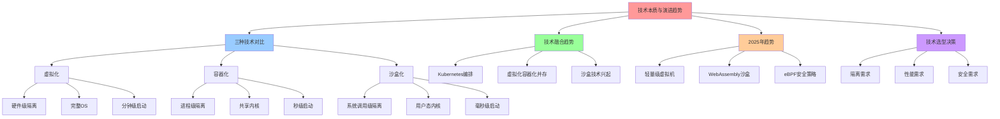
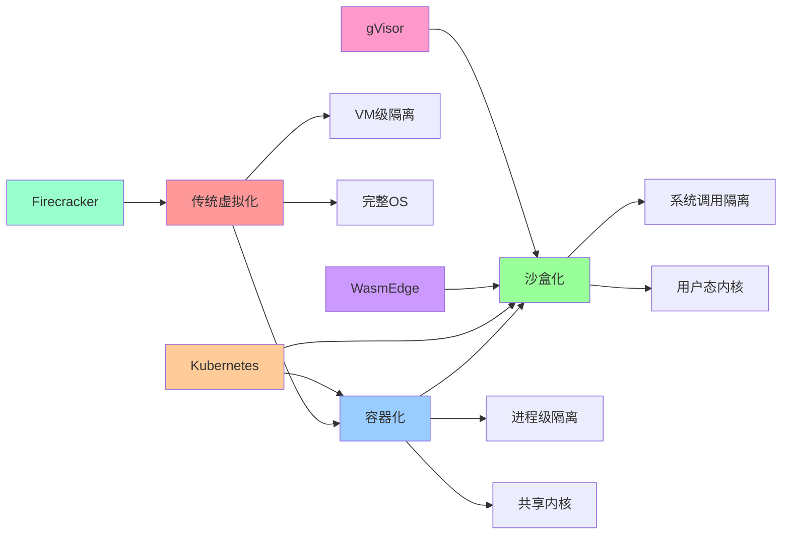
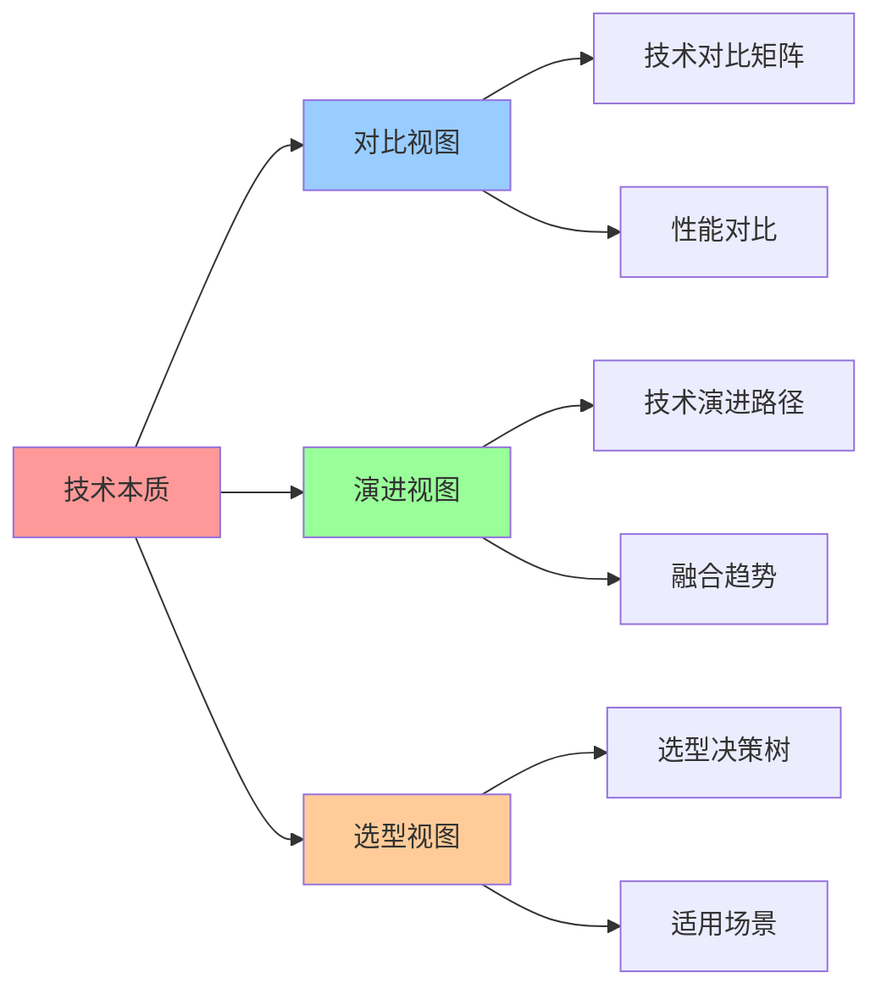

# 技术本质与演进趋势对比

**版本**：v1.0 **创建日期**：2025-11-08 **维护者**：项目团队

## 📑 目录

- [技术本质与演进趋势对比](#技术本质与演进趋势对比)
  - [📑 目录](#-目录)
  - [1 概述](#1-概述)
    - [1.1 核心思想](#11-核心思想)
    - [1.2 文档定位](#12-文档定位)
  - [2 虚拟化 vs 容器化 vs 沙盒化的核心差异](#2-虚拟化-vs-容器化-vs-沙盒化的核心差异)
    - [2.1 技术对比矩阵](#21-技术对比矩阵)
    - [2.2 性能公式](#22-性能公式)
    - [2.3 适用场景分析](#23-适用场景分析)
      - [2.3.1 虚拟化适用场景](#231-虚拟化适用场景)
      - [2.3.2 容器化适用场景](#232-容器化适用场景)
      - [2.3.3 沙盒化适用场景](#233-沙盒化适用场景)
  - [3 技术融合趋势](#3-技术融合趋势)
    - [3.1 Kubernetes 主导容器编排](#31-kubernetes-主导容器编排)
    - [3.2 虚拟化容器化并存](#32-虚拟化容器化并存)
    - [3.3 沙盒技术兴起](#33-沙盒技术兴起)
  - [4 Wikipedia 概念定义](#4-wikipedia-概念定义)
    - [4.1 虚拟化（Virtualization）](#41-虚拟化virtualization)
    - [4.2 容器化（Containerization）](#42-容器化containerization)
    - [4.3 沙盒化（Sandboxing）](#43-沙盒化sandboxing)
  - [5 2025 年 11 月技术趋势](#5-2025-年-11-月技术趋势)
    - [5.1 最新技术动态](#51-最新技术动态)
      - [5.1.1 轻量级虚拟机](#511-轻量级虚拟机)
      - [5.1.2 WebAssembly 沙盒](#512-webassembly-沙盒)
      - [5.1.3 eBPF 安全策略](#513-ebpf-安全策略)
    - [5.2 行业趋势分析](#52-行业趋势分析)
      - [5.2.1 云原生趋势](#521-云原生趋势)
      - [5.2.2 安全趋势](#522-安全趋势)
      - [5.2.3 性能趋势](#523-性能趋势)
  - [6 技术选型决策树](#6-技术选型决策树)
  - [7 总结](#7-总结)
  - [8 参考资源](#8-参考资源)
    - [8.1 Wikipedia 资源](#81-wikipedia-资源)
    - [8.2 技术文档](#82-技术文档)
    - [8.3 相关文档](#83-相关文档)
  - [9 🧠 认知增强：思维导图、建模视图与图表达转换](#9--认知增强思维导图建模视图与图表达转换)
    - [9.1 技术本质完整思维导图](#91-技术本质完整思维导图)
    - [9.2 技术本质建模视图](#92-技术本质建模视图)
      - [技术演进架构视图](#技术演进架构视图)
    - [9.3 技术本质多维关系矩阵](#93-技术本质多维关系矩阵)
      - [技术-隔离-性能映射矩阵](#技术-隔离-性能映射矩阵)
    - [9.4 图表达和转换](#94-图表达和转换)
      - [技术本质视图转换关系](#技术本质视图转换关系)
    - [9.5 形象化解释论证](#95-形象化解释论证)
      - [1. 技术本质 = 隔离层级体系](#1-技术本质--隔离层级体系)
      - [2. 技术演进 = 性能优化路径](#2-技术演进--性能优化路径)
      - [3. 技术融合 = 混合部署模式](#3-技术融合--混合部署模式)
    - [9.6 专家观点与论证](#96-专家观点与论证)
      - [计算信息软件科学家的观点](#计算信息软件科学家的观点)
        - [1. Gerald Popek（虚拟化理论创始人）](#1-gerald-popek虚拟化理论创始人)
        - [2. Solomon Hykes（Docker创始人）](#2-solomon-hykesdocker创始人)
        - [3. Lin Clark（WebAssembly专家）](#3-lin-clarkwebassembly专家)
      - [计算信息软件教育家的观点](#计算信息软件教育家的观点)
        - [1. Kelsey Hightower（Kubernetes教育家）](#1-kelsey-hightowerkubernetes教育家)
        - [2. Liz Rice（容器安全教育家）](#2-liz-rice容器安全教育家)
      - [计算信息软件认知学家的观点](#计算信息软件认知学家的观点)
        - [1. David Marr（计算认知科学家）](#1-david-marr计算认知科学家)
        - [2. Douglas Hofstadter（认知科学家）](#2-douglas-hofstadter认知科学家)
    - [9.7 认知学习路径矩阵](#97-认知学习路径矩阵)
    - [9.8 专家推荐阅读路径](#98-专家推荐阅读路径)

---

## 1 概述

本文档从**领域架构和语义模型视角**系统分析虚拟化、容器化、沙盒化三种技术的本质差
异、演进趋势和适用场景，为技术选型提供理论支撑。

### 1.1 核心思想

> **虚拟化、容器化、沙盒化并非相互替代，而是互补共存的技术体系。在集群分布式计算
> 与存储领域，容器化已成为云原生时代的主流选择，但在安全性、隔离性要求严苛的场景
> 下，虚拟化和沙盒化仍不可或缺。**

### 1.2 文档定位

**本文档特点**：

- ✅ **技术本质分析**：从隔离层级、资源效率、性能损失等维度对比三种技术
- ✅ **演进趋势分析**：分析技术融合趋势和未来发展方向
- ✅ **Wikipedia 对齐**：所有核心概念对齐 Wikipedia 定义
- ✅ **2025 年 11 月趋势**：整合最新技术动态

---

## 2 虚拟化 vs 容器化 vs 沙盒化的核心差异

### 2.1 技术对比矩阵

根据技术分析，三种技术在隔离层级和资源效率上存在本质区别：

| 技术维度     | 虚拟化 (Virtualization)   | 容器化 (Containerization)             | 沙盒化 (Sandboxing)          |
| ------------ | ------------------------- | ------------------------------------- | ---------------------------- |
| **隔离级别** | 硬件级抽象，完整 OS 隔离  | 进程级隔离，共享宿主机内核            | 应用级隔离，限制系统调用     |
| **启动时间** | 分钟级（需加载完整 OS）   | 秒级/毫秒级（毫秒级启动）             | 毫秒级                       |
| **资源开销** | 高（数百 MB 至 GB 内存）  | 低（MB 级内存占用）                   | 极低                         |
| **性能损失** | 5-15%（硬件虚拟化层开销） | 接近原生（<5%）                       | 接近原生                     |
| **安全隔离** | 强（独立内核）            | 中等（共享内核，依赖 SELinux 等加固） | 强（系统调用过滤）           |
| **适用场景** | 多租户云、传统应用迁移    | 微服务、CI/CD、云原生                 | 安全敏感应用、第三方代码执行 |

### 2.2 性能公式

**核心公式**：性能表现 P = (T_s + T_e) / R_c

其中：

- **T_s**：启动时间（Startup Time）
- **T_e**：执行时间（Execution Time）
- **R_c**：资源消耗（Resource Consumption）

**性能对比**：

- **虚拟化**：P_vm = (T_s_vm + T_e_vm) / R_c_vm

  - T_s_vm：分钟级（需加载完整 OS）
  - T_e_vm：接近原生（5-15%性能损失）
  - R_c_vm：高（数百 MB 至 GB 内存）

- **容器化**：P_container = (T_s_container + T_e_container) / R_c_container

  - T_s_container：秒级/毫秒级（毫秒级启动）
  - T_e_container：接近原生（<5%性能损失）
  - R_c_container：低（MB 级内存占用）

- **沙盒化**：P_sandbox = (T_s_sandbox + T_e_sandbox) / R_c_sandbox
  - T_s_sandbox：毫秒级
  - T_e_sandbox：接近原生
  - R_c_sandbox：极低

**结论**：容器化在这三个维度均显著优于虚拟化。

### 2.3 适用场景分析

#### 2.3.1 虚拟化适用场景

- **多租户云环境**：需要强隔离，不同租户运行不同操作系统
- **传统应用迁移**：遗留应用需要完整操作系统环境
- **安全敏感业务**：金融交易、医疗系统等需要独立内核
- **混合云部署**：需要跨云平台迁移虚拟机

#### 2.3.2 容器化适用场景

- **微服务架构**：服务拆分、独立部署、快速迭代
- **CI/CD 流水线**：构建、测试、部署自动化
- **云原生应用**：Kubernetes 编排、弹性伸缩
- **开发测试环境**：快速启动、资源高效利用

#### 2.3.3 沙盒化适用场景

- **安全敏感应用**：运行不可信代码、第三方插件
- **浏览器环境**：JavaScript 沙盒、WebAssembly 隔离
- **移动应用**：iOS App Sandbox、Android 应用隔离
- **云函数**：Serverless 函数执行环境

---

## 3 技术融合趋势

### 3.1 Kubernetes 主导容器编排

**现状**：Kubernetes 已成为云原生事实标准

**技术特征**：

- **CRI 接口**：支持多运行时（Docker/containerd/CRI-O）
- **声明式 API**：通过 YAML 配置定义期望状态
- **自动调度**：根据资源需求和约束自动调度 Pod
- **弹性伸缩**：HPA/VPA/CA 实现自动扩缩容

**2025 年 11 月趋势**：

- **Kubernetes 1.30+**：增强的 Pod 安全策略
- **eBPF 集成**：Cilium 等 CNI 插件使用 eBPF 加速网络
- **WebAssembly 支持**：Krustlet 等运行时支持 Wasm 工作负载

### 3.2 虚拟化容器化并存

**混合部署模式**：

- **安全敏感业务**（如金融交易）：仍依赖虚拟机

  - 原因：需要独立内核、强隔离、合规要求
  - 技术：KubeVirt、Firecracker、QEMU/KVM

- **开发测试环境**：全面容器化
  - 原因：快速启动、资源高效、易于管理
  - 技术：Docker、containerd、Podman

**2025 年 11 月趋势**：

- **轻量级虚拟机**：Firecracker、gVisor 提供 VM 级隔离+容器速度
- **机密计算**：Intel TDX、AMD SEV 提供硬件级安全隔离
- **混合运行时**：Kubernetes 同时支持容器和虚拟机

### 3.3 沙盒技术兴起

**技术代表**：

- **gVisor**：Google 开发的用户态内核，提供容器内的额外隔离层
- **Kata Containers**：轻量级虚拟机，提供 VM 级隔离+容器速度
- **Firecracker**：AWS 开发的微虚拟机，专为 Serverless 场景优化

**技术特征**：

- **兼顾轻量与安全**：容器速度 + VM 级隔离
- **系统调用过滤**：限制容器可用的系统调用
- **文件系统隔离**：只读根文件系统、tmpfs 挂载

**2025 年 11 月趋势**：

- **WebAssembly 沙盒**：WasmEdge、Wasmtime 提供轻量级沙盒环境
- **eBPF 安全策略**：Falco、Tetragon 使用 eBPF 实现运行时安全
- **零信任架构**：OPA、Gatekeeper 实现策略即代码

---

## 4 Wikipedia 概念定义

### 4.1 虚拟化（Virtualization）

**Wikipedia 定义**：

> **Virtualization** is the act of creating a virtual (rather than actual)
> version of something, including virtual computer hardware platforms, storage
> devices, and computer network resources.

**核心概念**：

- **硬件虚拟化**：通过 Hypervisor 在物理硬件上创建多个虚拟机
- **类型 1 Hypervisor**：直接运行在硬件上（如 VMware ESXi、Xen）
- **类型 2 Hypervisor**：运行在操作系统上（如 VirtualBox、VMware Workstation）

**技术原理**：

- **CPU 虚拟化**：Intel VT-x、AMD-V 提供硬件加速
- **内存虚拟化**：EPT（Extended Page Tables）提供内存隔离
- **I/O 虚拟化**：SR-IOV、VT-d 提供设备直通

**参考资源**：

- [Wikipedia: Virtualization](https://en.wikipedia.org/wiki/Virtualization)
- [Wikipedia: Hypervisor](https://en.wikipedia.org/wiki/Hypervisor)
- [Wikipedia: Hardware-assisted virtualization](https://en.wikipedia.org/wiki/Hardware-assisted_virtualization)

### 4.2 容器化（Containerization）

**Wikipedia 定义**：

> **Containerization** is a lightweight alternative to full machine
> virtualization that involves encapsulating an application in a container with
> its own operating environment.

**核心概念**：

- **操作系统级虚拟化**：共享宿主机内核，隔离用户空间
- **命名空间（Namespaces）**：提供进程、网络、文件系统等隔离
- **控制组（Cgroups）**：限制和监控资源使用

**技术原理**：

- **Linux Namespaces**：PID、Network、Mount、UTS、IPC、User
- **Linux Cgroups**：CPU、Memory、I/O、Network 资源限制
- **联合文件系统（UnionFS）**：OverlayFS、AUFS 提供分层镜像

**参考资源**：

- [Wikipedia: OS-level virtualization](https://en.wikipedia.org/wiki/OS-level_virtualization)
- [Wikipedia: Linux namespaces](https://en.wikipedia.org/wiki/Linux_namespaces)
- [Wikipedia: cgroups](https://en.wikipedia.org/wiki/Cgroups)

### 4.3 沙盒化（Sandboxing）

**Wikipedia 定义**：

> **Sandboxing** is a security mechanism for separating running programs,
> usually in an effort to mitigate system failures and software vulnerabilities
> from spreading.

**核心概念**：

- **应用级隔离**：限制应用程序的系统调用和资源访问
- **系统调用过滤**：Seccomp、AppArmor、SELinux 提供安全策略
- **最小权限原则**：只授予应用程序运行所需的最小权限

**技术原理**：

- **Seccomp**：Linux 系统调用过滤机制
- **AppArmor**：基于路径的安全策略
- **SELinux**：基于标签的强制访问控制

**参考资源**：

- [Wikipedia: Sandbox (computer security)](<https://en.wikipedia.org/wiki/Sandbox_(computer_security)>)
- [Wikipedia: Seccomp](https://en.wikipedia.org/wiki/Seccomp)
- [Wikipedia: AppArmor](https://en.wikipedia.org/wiki/AppArmor)

---

## 5 2025 年 11 月技术趋势

### 5.1 最新技术动态

#### 5.1.1 轻量级虚拟机

**技术代表**：

- **Firecracker**：AWS 开发的微虚拟机，专为 Serverless 场景优化

  - 启动时间：<125ms
  - 内存占用：<5MB
  - 适用场景：AWS Lambda、Fargate

- **gVisor**：Google 开发的用户态内核

  - 系统调用拦截：100% 系统调用过滤
  - 性能损失：<10%
  - 适用场景：Google Cloud Run、GKE Sandbox

- **Kata Containers**：轻量级虚拟机，提供 VM 级隔离
  - 启动时间：<1s
  - 内存占用：<128MB
  - 适用场景：Kubernetes、OpenStack

#### 5.1.2 WebAssembly 沙盒

**技术代表**：

- **WasmEdge**：CNCF 项目，高性能 WebAssembly 运行时

  - 启动时间：<1ms
  - 内存占用：<1MB
  - 适用场景：边缘计算、Serverless

- **Wasmtime**：Bytecode Alliance 项目，标准 WebAssembly 运行时
  - 性能：接近原生
  - 安全性：内存安全、类型安全
  - 适用场景：插件系统、云函数

#### 5.1.3 eBPF 安全策略

**技术代表**：

- **Falco**：CNCF 项目，运行时安全监控

  - 检测能力：系统调用、网络流量、文件访问
  - 性能开销：<5%
  - 适用场景：Kubernetes 安全审计

- **Tetragon**：Cilium 项目，eBPF 驱动的安全可观测性
  - 实时检测：系统调用、网络事件
  - 零开销：eBPF 内核态执行
  - 适用场景：云原生安全

### 5.2 行业趋势分析

#### 5.2.1 云原生趋势

- **Kubernetes 普及率**：2025 年达到 90%+ 的企业采用率
- **Serverless 容器**：AWS Fargate、Google Cloud Run 快速增长
- **边缘计算**：K3s、KubeEdge 在边缘场景广泛应用

#### 5.2.2 安全趋势

- **零信任架构**：OPA、Gatekeeper 实现策略即代码
- **机密计算**：Intel TDX、AMD SEV 提供硬件级安全隔离
- **运行时安全**：Falco、Tetragon 实现实时威胁检测

#### 5.2.3 性能趋势

- **DPU 加速**：NVIDIA BlueField、Intel IPU 卸载网络/存储处理
- **WebAssembly**：轻量级沙盒，毫秒级启动
- **硬件虚拟化**：Intel VT-x、AMD-V 持续优化

---

## 6 技术选型决策树

```text
业务需求分析
    │
    ├─> 安全性要求极高? → 虚拟化 (金融交易/多租户)
    │   └─> 需要快速启动? → Kata Containers + Kubernetes
    │
    ├─> 需要快速迭代? → 容器化 (微服务/DevOps)
    │   └─> 需要强隔离? → gVisor/Firecracker 沙盒容器
    │
    ├─> 运行不可信代码? → 沙盒化 (插件/三方服务)
    │   └─> 需要毫秒级启动? → WebAssembly 沙盒
    │
    └─> 混合场景? → Kata Containers + Kubernetes
        └─> 边缘计算? → K3s + WasmEdge
```

**决策矩阵**：

| 场景           | 安全性要求 | 性能要求 | 启动时间要求 | 推荐方案                   |
| -------------- | ---------- | -------- | ------------ | -------------------------- |
| **金融交易**   | 极高       | 高       | 中           | 虚拟化（KubeVirt）         |
| **微服务**     | 中         | 高       | 低           | 容器化（Docker/K8s）       |
| **Serverless** | 中         | 中       | 极低         | 沙盒化（Firecracker/Wasm） |
| **边缘计算**   | 中         | 中       | 低           | 容器化（K3s）+ Wasm        |
| **多租户云**   | 极高       | 高       | 中           | 虚拟化（QEMU/KVM）         |
| **CI/CD**      | 低         | 中       | 低           | 容器化（Docker）           |
| **插件系统**   | 高         | 中       | 极低         | 沙盒化（WasmEdge）         |

---

## 7 总结

虚拟化、容器化、沙盒化并非相互替代，而是**互补共存**的技术体系：

1. **虚拟化**：适用于多租户云、传统应用迁移、安全敏感业务
2. **容器化**：适用于微服务、CI/CD、云原生应用
3. **沙盒化**：适用于安全敏感应用、第三方代码执行、插件系统

**未来架构趋势**：

- **轻量级运行时**：Firecracker、gVisor、WasmEdge 提供轻量级隔离
- **智能编排**：Kubernetes 实现自动调度、弹性伸缩
- **池化硬件**：DPU、GPU、CXL 提供硬件加速

**性能优化方向**：

- **软件层优化**：容器运行时、网络栈、存储栈优化
- **硬件卸载**：DPU 卸载网络/存储处理，GPU 加速计算
- **存算一体**：CXL 等新型总线技术打破存储墙

**最终目标**：实现"**应用定义基础设施**"的终极目标。

---

## 8 参考资源

### 8.1 Wikipedia 资源

- [Virtualization](https://en.wikipedia.org/wiki/Virtualization)
- [OS-level virtualization](https://en.wikipedia.org/wiki/OS-level_virtualization)
- [Sandbox (computer security)](<https://en.wikipedia.org/wiki/Sandbox_(computer_security)>)
- [Hypervisor](https://en.wikipedia.org/wiki/Hypervisor)
- [Linux namespaces](https://en.wikipedia.org/wiki/Linux_namespaces)
- [cgroups](https://en.wikipedia.org/wiki/Cgroups)

### 8.2 技术文档

- [Kubernetes Documentation](https://kubernetes.io/docs/)
- [Docker Documentation](https://docs.docker.com/)
- [Firecracker Documentation](https://firecracker-microvm.github.io/)
- [gVisor Documentation](https://gvisor.dev/docs/)
- [WasmEdge Documentation](https://wasmedge.org/docs/)

### 8.3 相关文档

- [`../02-views/02-virtualization-containerization-sandboxing/`](../../02-views/02-virtualization-containerization-sandboxing/) -
  虚拟化容器化沙盒化架构视图
- [`../01-implementation/01-virtualization/`](../../01-implementation/01-virtualization/) -
  虚拟化实现细节
- [`../01-implementation/02-containerization/`](../../01-implementation/02-containerization/) -
  容器化实现细节
- [`../01-implementation/03-sandboxing/`](../../01-implementation/03-sandboxing/) -
  沙盒化实现细节
- [`../05-wikipedia-references/01-virtualization.md`](../05-wikipedia-references/01-virtualization.md) -
  虚拟化 Wikipedia 定义
- [`../05-wikipedia-references/02-containerization.md`](../05-wikipedia-references/02-containerization.md) -
  容器化 Wikipedia 定义
- [`../05-wikipedia-references/03-sandboxing.md`](../05-wikipedia-references/03-sandboxing.md) -
  沙盒化 Wikipedia 定义

---

## 9 🧠 认知增强：思维导图、建模视图与图表达转换

### 9.1 技术本质完整思维导图



### 9.2 技术本质建模视图

#### 技术演进架构视图



### 9.3 技术本质多维关系矩阵

#### 技术-隔离-性能映射矩阵

| 技术 | 虚拟化 | 容器化 | 沙盒化 | 隔离级别 | 启动时间 | 资源开销 | 认知价值 |
|-----|--------|--------|--------|---------|---------|---------|---------|
| **虚拟化** | ✅ 核心 | ❌ 无 | ❌ 无 | 硬件级 | 分钟级 | 高 | 隔离理解 |
| **容器化** | ❌ 无 | ✅ 核心 | ❌ 无 | 进程级 | 秒级 | 中 | 性能理解 |
| **沙盒化** | ❌ 无 | ❌ 无 | ✅ 核心 | 系统调用级 | 毫秒级 | 低 | 安全理解 |
| **融合趋势** | ⚠️ 部分 | ⚠️ 部分 | ⚠️ 部分 | 混合隔离 | 混合启动 | 混合开销 | 融合理解 |

### 9.4 图表达和转换

#### 技术本质视图转换关系



### 9.5 形象化解释论证

#### 1. 技术本质 = 隔离层级体系

> **类比**：技术本质就像隔离层级体系，虚拟化是"独立房间"（硬件级隔离），容器化是"共享房间"（进程级隔离），沙盒化是"安全房间"（系统调用级隔离），就像隔离层级体系通过房间、共享、安全组织隔离一样，技术本质通过虚拟化、容器化、沙盒化组织隔离层级。

**认知价值**：

- **层级理解**：通过隔离层级体系类比，理解技术本质的层级性
- **隔离理解**：通过房间隔离类比，理解隔离的隔离性
- **安全理解**：通过安全房间类比，理解沙盒化的安全性

#### 2. 技术演进 = 性能优化路径

> **类比**：技术演进就像性能优化路径，虚拟化是"重型运输"（高资源开销），容器化是"中型运输"（中资源开销），沙盒化是"轻型运输"（低资源开销），就像性能优化路径通过重型、中型、轻型组织优化一样，技术演进通过虚拟化、容器化、沙盒化组织性能优化。

**认知价值**：

- **优化理解**：通过性能优化路径类比，理解技术演进的优化性
- **资源理解**：通过运输类比，理解资源开销的资源性
- **性能理解**：通过性能优化类比，理解技术演进的性能性

#### 3. 技术融合 = 混合部署模式

> **类比**：技术融合就像混合部署模式，虚拟化是"基础层"（提供硬件隔离），容器化是"应用层"（提供进程隔离），沙盒化是"安全层"（提供系统调用隔离），就像混合部署模式通过基础、应用、安全组织部署一样，技术融合通过虚拟化、容器化、沙盒化组织混合部署。

**认知价值**：

- **融合理解**：通过混合部署模式类比，理解技术融合的融合性
- **层级理解**：通过基础、应用、安全类比，理解技术的层级性
- **部署理解**：通过部署模式类比，理解技术融合的部署性

### 9.6 专家观点与论证

#### 计算信息软件科学家的观点

##### 1. Gerald Popek（虚拟化理论创始人）

> "Virtualization provides hardware-level isolation. Understanding virtualization helps us understand how to achieve strong isolation."

**在技术本质中的应用**：

- **隔离理解**：虚拟化提供硬件级隔离
- **强隔离理解**：理解如何实现强隔离
- **技术理解**：理解虚拟化的隔离价值

##### 2. Solomon Hykes（Docker创始人）

> "Containerization provides process-level isolation with shared kernel. Understanding containerization helps us understand how to balance isolation and performance."

**在技术本质中的应用**：

- **平衡理解**：容器化在隔离和性能之间取得平衡
- **共享理解**：理解共享内核的价值
- **性能理解**：理解容器化的性能优势

##### 3. Lin Clark（WebAssembly专家）

> "Sandboxing provides system-call-level isolation. Understanding sandboxing helps us understand how to achieve lightweight security."

**在技术本质中的应用**：

- **轻量理解**：沙盒化提供轻量级安全
- **系统调用理解**：理解系统调用级隔离
- **安全理解**：理解沙盒化的安全价值

#### 计算信息软件教育家的观点

##### 1. Kelsey Hightower（Kubernetes教育家）

> "Teaching technology essence helps students understand that different technologies solve different problems. This is essential for making informed technology choices."

**教育价值**：

- **问题理解**：不同技术解决不同问题
- **选择理解**：学习如何做出明智的技术选择
- **技术理解**：理解技术的本质差异

##### 2. Liz Rice（容器安全教育家）

> "Technology essence provides a way to understand isolation levels. This helps students understand how to choose the right technology for their needs."

**教育价值**：

- **层级理解**：技术本质提供理解隔离层级的方法
- **选择理解**：帮助学生理解如何选择合适的技术
- **需求理解**：学习根据需求选择技术的方法

#### 计算信息软件认知学家的观点

##### 1. David Marr（计算认知科学家）

> "Understanding technology essence requires understanding it at multiple levels: isolation mechanisms, performance characteristics, and use cases."

**认知价值**：

- **多层次理解**：理解技术本质需要多层次理解
- **机制理解**：理解隔离机制
- **特性理解**：理解性能特性

##### 2. Douglas Hofstadter（认知科学家）

> "Technology essence is a cognitive tool that helps us organize and understand complex technology relationships. It provides a structured way to think about technology choices."

**认知价值**：

- **认知工具**：技术本质是组织信息的认知工具
- **关系理解**：通过技术本质理解复杂技术关系
- **结构理解**：技术本质提供结构化的思维方式

### 9.7 认知学习路径矩阵

| 学习阶段 | 核心内容 | 形象化理解 | 技术理解 | 实践应用 | 认知目标 |
|---------|---------|-----------|---------|---------|---------|
| **入门** | 技术对比 | 隔离层级体系类比 | 技术定义 | 技术识别 | 建立基础 |
| **进阶** | 性能分析 | 性能优化路径类比 | 性能公式 | 性能优化 | 理解性能 |
| **高级** | 技术融合 | 混合部署模式类比 | 融合技术 | 混合部署 | 掌握融合 |
| **专家** | 技术选型 | 选型决策树类比 | 选型策略 | 系统设计 | 掌握选型 |

### 9.8 专家推荐阅读路径

**计算信息软件科学家推荐路径**：

1. **技术对比**：理解虚拟化、容器化、沙盒化的核心差异
2. **性能分析**：掌握性能公式和适用场景分析
3. **技术融合**：理解技术融合趋势和混合部署模式
4. **技术选型**：学习技术选型决策树和应用

**计算信息软件教育家推荐路径**：

1. **形象化理解**：通过隔离层级体系、性能优化路径、混合部署模式等类比，建立直观理解
2. **渐进学习**：从简单技术对比开始，逐步学习复杂技术融合
3. **实践结合**：结合实际项目，理解技术本质的应用
4. **思维训练**：通过技术本质学习，训练系统性思维能力

**计算信息软件认知学家推荐路径**：

1. **认知模式**：识别技术本质中的认知模式
2. **结构理解**：理解技术本质揭示的技术结构
3. **跨域应用**：将技术本质思维应用到其他领域
4. **认知提升**：通过技术本质学习，提升认知能力

---

**最后更新：2025-11-15 **维护者**：项目团队
