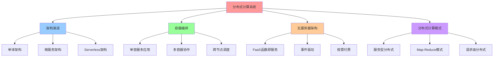
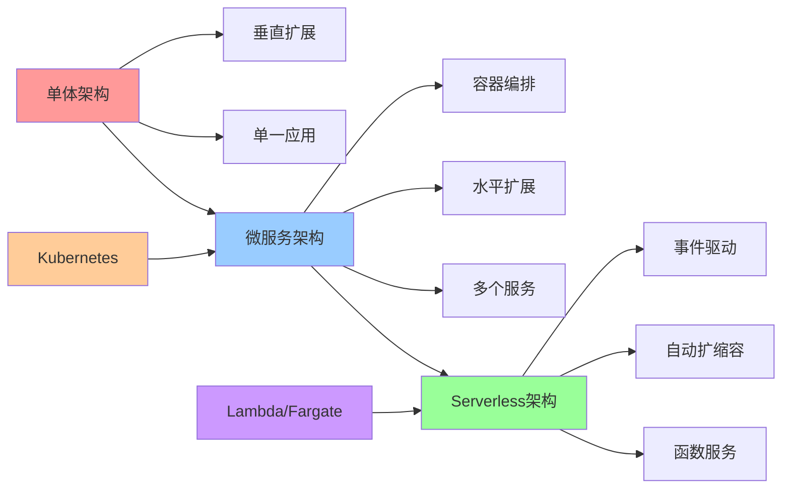
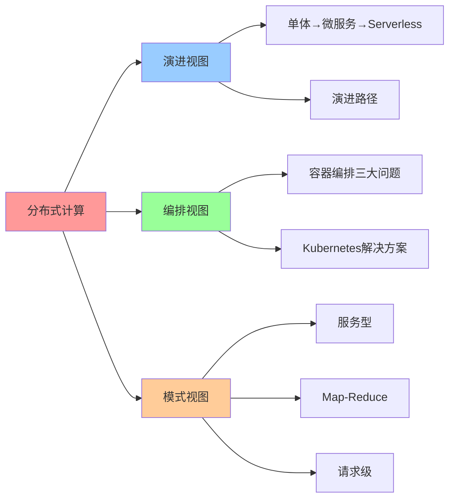

# 集群分布式计算系统架构演进

**版本**：v1.0 **创建日期**：2025-11-08 **维护者**：项目团队

## 📑 目录

- [集群分布式计算系统架构演进](#集群分布式计算系统架构演进)
  - [📑 目录](#-目录)
  - [1 概述](#1-概述)
    - [1.1 核心思想](#11-核心思想)
    - [1.2 文档定位](#12-文档定位)
  - [2 从单体到微服务的范式转变](#2-从单体到微服务的范式转变)
    - [2.1 架构演进路径](#21-架构演进路径)
    - [2.2 容器编排三大核心问题](#22-容器编排三大核心问题)
      - [2.2.1 问题 1：单容器多应用](#221-问题-1单容器多应用)
      - [2.2.2 问题 2：多容器协作](#222-问题-2多容器协作)
      - [2.2.3 问题 3：跨节点调度](#223-问题-3跨节点调度)
    - [2.3 范式转变的本质](#23-范式转变的本质)
  - [3 无服务器架构的崛起](#3-无服务器架构的崛起)
    - [3.1 无服务器架构特征](#31-无服务器架构特征)
    - [3.2 适用场景判断](#32-适用场景判断)
      - [3.2.1 可预测流量](#321-可预测流量)
      - [3.2.2 不可预测流量](#322-不可预测流量)
    - [3.3 2025 年 11 月趋势](#33-2025-年-11-月趋势)
      - [3.3.1 Serverless 容器](#331-serverless-容器)
      - [3.3.2 WebAssembly Serverless](#332-webassembly-serverless)
  - [4 分布式计算模式对比](#4-分布式计算模式对比)
    - [4.1 服务型分布式计算](#41-服务型分布式计算)
    - [4.2 Map-Reduce 模式](#42-map-reduce-模式)
    - [4.3 请求级分布式架构](#43-请求级分布式架构)
  - [5 Wikipedia 概念定义](#5-wikipedia-概念定义)
    - [5.1 分布式系统（Distributed Systems）](#51-分布式系统distributed-systems)
    - [5.2 微服务（Microservices）](#52-微服务microservices)
    - [5.3 无服务器计算（Serverless Computing）](#53-无服务器计算serverless-computing)
  - [6 总结](#6-总结)
  - [7 参考资源](#7-参考资源)
    - [7.1 Wikipedia 资源](#71-wikipedia-资源)
    - [7.2 技术文档](#72-技术文档)
    - [7.3 相关文档](#73-相关文档)
  - [8 🧠 认知增强：思维导图、建模视图与图表达转换](#8--认知增强思维导图建模视图与图表达转换)
    - [8.1 分布式计算完整思维导图](#81-分布式计算完整思维导图)
    - [8.2 分布式计算建模视图](#82-分布式计算建模视图)
      - [分布式计算架构演进视图](#分布式计算架构演进视图)
    - [8.3 分布式计算多维关系矩阵](#83-分布式计算多维关系矩阵)
      - [架构模式-编排-模式映射矩阵](#架构模式-编排-模式映射矩阵)
    - [8.4 图表达和转换](#84-图表达和转换)
      - [分布式计算视图转换关系](#分布式计算视图转换关系)
    - [8.5 形象化解释论证](#85-形象化解释论证)
      - [1. 架构演进 = 城市发展](#1-架构演进--城市发展)
      - [2. 容器编排三大问题 = 交通管理三大挑战](#2-容器编排三大问题--交通管理三大挑战)
      - [3. 分布式计算模式 = 工作组织模式](#3-分布式计算模式--工作组织模式)
    - [8.6 专家观点与论证](#86-专家观点与论证)
      - [计算信息软件科学家的观点](#计算信息软件科学家的观点)
        - [1. Martin Fowler（微服务架构专家）](#1-martin-fowler微服务架构专家)
        - [2. Werner Vogels（AWS CTO）](#2-werner-vogelsaws-cto)
      - [计算信息软件教育家的观点](#计算信息软件教育家的观点)
        - [1. Martin Fowler（微服务架构教育家）](#1-martin-fowler微服务架构教育家)
        - [2. Kelsey Hightower（Kubernetes教育家）](#2-kelsey-hightowerkubernetes教育家)
      - [计算信息软件认知学家的观点](#计算信息软件认知学家的观点)
        - [1. David Marr（计算认知科学家）](#1-david-marr计算认知科学家)
        - [2. Douglas Hofstadter（认知科学家）](#2-douglas-hofstadter认知科学家)
    - [8.7 认知学习路径矩阵](#87-认知学习路径矩阵)
    - [8.8 专家推荐阅读路径](#88-专家推荐阅读路径)

---

## 1 概述

本文档从**领域架构和语义模型视角**系统分析集群分布式计算系统架构的演进规律，重点
阐述从单体到微服务、从手动编排到声明式调度的范式转变。

### 1.1 核心思想

> **传统架构向分布式演进的核心驱动力是业务解耦和资源弹性。容器编排通过
> Pod、Service 等抽象解决了单容器多应用、多容器协作、跨节点调度三大核心问题。**

### 1.2 文档定位

**本文档特点**：

- ✅ **架构演进分析**：从单体到微服务的范式转变
- ✅ **容器编排分析**：Kubernetes 解决的核心问题
- ✅ **无服务器架构**：AWS Lambda 等无服务器化方案
- ✅ **分布式计算模式**：服务型、Map-Reduce、请求级分布式架构
- ✅ **Wikipedia 对齐**：所有核心概念对齐 Wikipedia 定义

---

## 2 从单体到微服务的范式转变

### 2.1 架构演进路径

传统架构向分布式演进的核心驱动力是**业务解耦和资源弹性**：

```plaintext
单体应用 → 垂直拆分 → 微服务集群 → 服务网格
   ↓            ↓            ↓            ↓
进程内调用   进程间调用    跨节点调度   跨服务治理
```

**演进特征**：

- **单体应用**：所有功能在一个进程中，进程内调用
- **垂直拆分**：按业务模块拆分，进程间调用（RPC/HTTP）
- **微服务集群**：服务独立部署，跨节点调度（Kubernetes）
- **服务网格**：服务间通信治理（Istio/Linkerd）

### 2.2 容器编排三大核心问题

**容器编排三大核心问题与解决方案**：

#### 2.2.1 问题 1：单容器多应用

**问题描述**：违反"单进程/容器"最佳实践

**解决方案**：拆分为多容器

```yaml
# 错误做法：单容器多应用
apiVersion: v1
kind: Pod
spec:
  containers:
    - name: app
      image: my-app:latest
      # 容器内运行多个进程（违反最佳实践）

# 正确做法：多容器协作
apiVersion: v1
kind: Pod
spec:
  containers:
    - name: app
      image: my-app:latest
    - name: sidecar
      image: my-sidecar:latest
```

#### 2.2.2 问题 2：多容器协作

**问题描述**：需共享网络/存储/配置

**解决方案**：Pod 作为原子调度单元

```yaml
apiVersion: v1
kind: Pod
spec:
  containers:
    - name: app
      image: my-app:latest
      volumeMounts:
        - name: shared-data
          mountPath: /data
    - name: sidecar
      image: my-sidecar:latest
      volumeMounts:
        - name: shared-data
          mountPath: /data
  volumes:
    - name: shared-data
      emptyDir: {}
```

**Pod 特征**：

- **共享网络**：同一 Pod 内的容器共享网络命名空间
- **共享存储**：同一 Pod 内的容器共享 Volume
- **共享配置**：同一 Pod 内的容器共享 ConfigMap/Secret

#### 2.2.3 问题 3：跨节点调度

**问题描述**：容器可能分布在不同宿主机

**解决方案**：Kubernetes Service 抽象

```yaml
apiVersion: v1
kind: Service
metadata:
  name: my-service
spec:
  selector:
    app: my-app
  ports:
    - protocol: TCP
      port: 80
      targetPort: 8080
  type: ClusterIP
```

**Service 特征**：

- **服务发现**：通过 DNS 自动发现服务
- **负载均衡**：kube-proxy 实现负载均衡
- **抽象层**：应用无需感知 Pod 的具体位置

### 2.3 范式转变的本质

**从"如何实现分布式"到"想要什么状态"**：

| 传统架构     | 容器编排架构       | 语义转换本质                       |
| ------------ | ------------------ | ---------------------------------- |
| **服务发现** | CoreDNS + Service  | 从"主动注册"到"被动发现"           |
| **负载均衡** | kube-proxy/IPVS    | 从"集中式代理"到"分布式内核态转发" |
| **容错**     | Pod 自动重启       | 从"业务代码埋点"到"基础设施兜底"   |
| **扩缩容**   | HPA/VPA/CA         | 从"响应式触发"到"声明式目标"       |
| **配置管理** | ConfigMap/Secret   | 从"拉取配置"到"挂载文件"           |
| **健康检查** | Liveness/Readiness | 从"手动监控"到"自动探测"           |

---

## 3 无服务器架构的崛起

### 3.1 无服务器架构特征

**AWS Lambda 等无服务器化方案提供极致弹性**：

**优势**：

- **免运维**：无需管理服务器、操作系统、运行时
- **按调用付费**：只为实际使用的计算时间付费
- **毫秒级自动扩展**：自动处理流量峰值
- **事件驱动**：支持多种事件源（API Gateway、S3、DynamoDB 等）

**劣势**：

- **冷启动延迟**：首次调用需要初始化运行时（100ms-10s）
- **15 秒 API 超时限制**：不适合长时间运行的任务
- **无状态设计**：无法保持会话状态
- **资源限制**：内存、CPU、临时存储有限

### 3.2 适用场景判断

**适用场景判断**：

#### 3.2.1 可预测流量

**场景**：Netflix 新片发布

**方案**：预先扩展虚拟机/容器集群

```yaml
# 预先扩展集群
apiVersion: autoscaling/v2
kind: HorizontalPodAutoscaler
metadata:
  name: video-service-hpa
spec:
  minReplicas: 10
  maxReplicas: 100
  metrics:
    - type: Resource
      resource:
        name: cpu
        target:
          type: Utilization
          averageUtilization: 70
```

#### 3.2.2 不可预测流量

**场景**：YouTube 直播

**方案**：无服务器化+容器混合架构

```yaml
# 无服务器处理突发流量
apiVersion: serving.knative.dev/v1
kind: Service
metadata:
  name: live-stream-processor
spec:
  template:
    spec:
      containers:
        - image: stream-processor:latest
      # Knative 自动缩容至零，按需启动
```

### 3.3 2025 年 11 月趋势

#### 3.3.1 Serverless 容器

**技术代表**：

- **AWS Fargate**：无需管理服务器的容器服务

  - 启动时间：<30s
  - 适用场景：ECS、EKS 无服务器模式

- **Google Cloud Run**：完全托管的 Serverless 容器平台

  - 启动时间：<10s（预热后 <1s）
  - 适用场景：HTTP 服务、事件处理

- **Azure Container Apps**：基于 Kubernetes 的 Serverless 容器平台
  - 启动时间：<20s
  - 适用场景：微服务、API 服务

#### 3.3.2 WebAssembly Serverless

**技术代表**：

- **WasmEdge Serverless**：基于 WebAssembly 的 Serverless 平台

  - 启动时间：<1ms
  - 内存占用：<1MB
  - 适用场景：边缘计算、实时处理

- **Fermyon**：WebAssembly 云平台
  - 启动时间：<10ms
  - 适用场景：API 服务、边缘函数

---

## 4 分布式计算模式对比

### 4.1 服务型分布式计算

**特征**：

- **应用改造程度**：无需改造
- **计算粒度**：请求级
- **典型代表**：微服务网格（Istio、Linkerd）
- **适用业务**：OLTP、API 服务

**架构模式**：

```yaml
# 微服务架构
apiVersion: apps/v1
kind: Deployment
metadata:
  name: order-service
spec:
  replicas: 3
  template:
    spec:
      containers:
        - name: order-service
          image: order-service:latest
---
apiVersion: v1
kind: Service
metadata:
  name: order-service
spec:
  selector:
    app: order-service
  ports:
    - port: 80
```

### 4.2 Map-Reduce 模式

**特征**：

- **应用改造程度**：需完全重构
- **计算粒度**：任务级
- **典型代表**：Hadoop/Spark
- **适用业务**：批处理、大数据

**架构模式**：

```yaml
# Spark on Kubernetes
apiVersion: sparkoperator.k8s.io/v1beta2
kind: SparkApplication
metadata:
  name: batch-processing
spec:
  driver:
    cores: 1
    memory: "1g"
  executor:
    instances: 10
    cores: 2
    memory: "4g"
  mainApplicationFile: "s3://apps/batch-job.jar"
```

### 4.3 请求级分布式架构

**特征**：

- **应用改造程度**：部分改造
- **计算粒度**：请求级
- **典型代表**：分库分表（Sharding）
- **适用业务**：传统数据库扩展

**架构模式**：

```yaml
# 分库分表架构
apiVersion: apps/v1
kind: StatefulSet
metadata:
  name: database-shard
spec:
  replicas: 4
  serviceName: database
  template:
    spec:
      containers:
        - name: database
          image: mysql:8.0
          env:
            - name: SHARD_ID
              valueFrom:
                fieldRef:
                  fieldPath: metadata.name
```

**对比总结**：

| 模式             | 应用改造程度 | 计算粒度 | 典型代表     | 适用业务       |
| ---------------- | ------------ | -------- | ------------ | -------------- |
| 服务型分布式计算 | 无需改造     | 请求级   | 微服务网格   | OLTP、API 服务 |
| Map-Reduce       | 需完全重构   | 任务级   | Hadoop/Spark | 批处理、大数据 |
| 请求级分布式架构 | 部分改造     | 请求级   | 分库分表     | 传统数据库扩展 |

---

## 5 Wikipedia 概念定义

### 5.1 分布式系统（Distributed Systems）

**Wikipedia 定义**：

> **Distributed computing** is a field of computer science that studies
> distributed systems. A distributed system is a system whose components are
> located on different networked computers, which communicate and coordinate
> their actions by passing messages to one another.

**核心概念**：

- **CAP 定理**：一致性（Consistency）、可用性（Availability）、分区容错性
  （Partition tolerance）三者不可兼得
- **一致性模型**：强一致性、最终一致性、因果一致性
- **分布式算法**：Paxos、Raft、Gossip

**参考资源**：

- [Wikipedia: Distributed computing](https://en.wikipedia.org/wiki/Distributed_computing)
- [Wikipedia: CAP theorem](https://en.wikipedia.org/wiki/CAP_theorem)
- [Wikipedia: Consensus (computer science)](<https://en.wikipedia.org/wiki/Consensus_(computer_science)>)

### 5.2 微服务（Microservices）

**Wikipedia 定义**：

> **Microservices** are a software development technique—a variant of the
> service-oriented architecture (SOA) architectural style that structures an
> application as a collection of loosely coupled services.

**核心概念**：

- **服务拆分**：按业务领域拆分服务
- **独立部署**：每个服务可独立部署和扩展
- **服务通信**：通过 API（REST/gRPC）通信

**参考资源**：

- [Wikipedia: Microservices](https://en.wikipedia.org/wiki/Microservices)
- [Wikipedia: Service-oriented architecture](https://en.wikipedia.org/wiki/Service-oriented_architecture)

### 5.3 无服务器计算（Serverless Computing）

**Wikipedia 定义**：

> **Serverless computing** is a cloud computing execution model in which the
> cloud provider allocates machine resources on demand, taking care of the
> servers on behalf of their customers.

**核心概念**：

- **函数即服务（FaaS）**：AWS Lambda、Azure Functions、Google Cloud Functions
- **事件驱动**：响应事件自动执行函数
- **按需付费**：只为实际使用的计算时间付费

**参考资源**：

- [Wikipedia: Serverless computing](https://en.wikipedia.org/wiki/Serverless_computing)
- [Wikipedia: Function as a service](https://en.wikipedia.org/wiki/Function_as_a_service)

---

## 6 总结

集群分布式计算系统架构演进的核心规律：

1. **从单体到微服务**：业务解耦和资源弹性驱动架构演进
2. **容器编排三大问题**：单容器多应用、多容器协作、跨节点调度
3. **无服务器架构**：提供极致弹性，但存在冷启动、超时等限制
4. **分布式计算模式**：服务型、Map-Reduce、请求级分布式架构各有适用场景

**未来趋势**：

- **Serverless 容器**：AWS Fargate、Google Cloud Run 实现"容器即服务"
- **WebAssembly Serverless**：WasmEdge Serverless 提供毫秒级启动
- **AI 驱动的编排**：基于历史负载预测的智能扩缩容

---

## 7 参考资源

### 7.1 Wikipedia 资源

- [Distributed computing](https://en.wikipedia.org/wiki/Distributed_computing)
- [Microservices](https://en.wikipedia.org/wiki/Microservices)
- [Serverless computing](https://en.wikipedia.org/wiki/Serverless_computing)
- [CAP theorem](https://en.wikipedia.org/wiki/CAP_theorem)

### 7.2 技术文档

- [Kubernetes Documentation](https://kubernetes.io/docs/)
- [AWS Lambda Documentation](https://docs.aws.amazon.com/lambda/)
- [Apache Spark Documentation](https://spark.apache.org/docs/)

### 7.3 相关文档

- [`../03-layered-disintegration-law/02-distributed-computing-disintegration.md`](../03-layered-disintegration-law/02-distributed-computing-disintegration.md) -
  分布式系统：从手动编排到声明式调度
- [`../04-domain-case-studies/01-spark-semantic-layering.md`](../04-domain-case-studies/01-spark-semantic-layering.md) -
  Spark 软件栈的语义分层模型
- [`../05-wikipedia-references/04-distributed-systems.md`](../05-wikipedia-references/04-distributed-systems.md) -
  分布式系统 Wikipedia 定义

---

## 8 🧠 认知增强：思维导图、建模视图与图表达转换

### 8.1 分布式计算完整思维导图



### 8.2 分布式计算建模视图

#### 分布式计算架构演进视图



### 8.3 分布式计算多维关系矩阵

#### 架构模式-编排-模式映射矩阵

| 架构模式 | 单体 | 微服务 | Serverless | 编排需求 | 扩展性 | 认知价值 |
|---------|------|--------|-----------|---------|--------|---------|
| **单体架构** | ✅ 核心 | ❌ 无 | ❌ 无 | 无 | 垂直扩展 | 简单理解 |
| **微服务架构** | ❌ 无 | ✅ 核心 | ⚠️ 部分 | Kubernetes | 水平扩展 | 复杂理解 |
| **Serverless架构** | ❌ 无 | ⚠️ 部分 | ✅ 核心 | 自动编排 | 极致弹性 | 弹性理解 |
| **演进路径** | ✅ 起点 | ✅ 中间 | ✅ 终点 | 递增编排 | 递增扩展 | 演进理解 |

### 8.4 图表达和转换

#### 分布式计算视图转换关系



### 8.5 形象化解释论证

#### 1. 架构演进 = 城市发展

> **类比**：架构演进就像城市发展，单体架构是"小城镇"（单一应用），微服务架构是"大城市"（多个服务），Serverless架构是"智慧城市"（自动管理），就像城市发展通过城镇、城市、智慧城市组织发展一样，架构演进通过单体、微服务、Serverless组织演进。

**认知价值**：

- **发展理解**：通过城市发展类比，理解架构演进的发展性
- **规模理解**：通过城镇、城市、智慧城市类比，理解架构的规模性
- **管理理解**：通过自动管理类比，理解Serverless的管理性

#### 2. 容器编排三大问题 = 交通管理三大挑战

> **类比**：容器编排三大问题就像交通管理三大挑战，单容器多应用是"一辆车多人"（资源竞争），多容器协作是"多车协作"（服务协调），跨节点调度是"跨区域调度"（资源调度），就像交通管理三大挑战通过车辆、协作、调度组织管理一样，容器编排三大问题通过容器、协作、调度组织编排。

**认知价值**：

- **挑战理解**：通过交通管理三大挑战类比，理解容器编排三大问题的挑战性
- **资源理解**：通过车辆类比，理解容器的资源性
- **调度理解**：通过跨区域调度类比，理解跨节点调度的调度性

#### 3. 分布式计算模式 = 工作组织模式

> **类比**：分布式计算模式就像工作组织模式，服务型分布式是"部门协作"（服务间协作），Map-Reduce是"任务分解"（任务分解和聚合），请求级分布式是"请求路由"（请求级路由），就像工作组织模式通过部门、任务、请求组织工作一样，分布式计算模式通过服务、任务、请求组织计算。

**认知价值**：

- **组织理解**：通过工作组织模式类比，理解分布式计算模式的组织性
- **协作理解**：通过部门协作类比，理解服务型分布式的协作性
- **分解理解**：通过任务分解类比，理解Map-Reduce的分解性

### 8.6 专家观点与论证

#### 计算信息软件科学家的观点

##### 1. Martin Fowler（微服务架构专家）

> "Microservices architecture provides a way to decompose monolithic applications. Understanding microservices helps us understand how to build scalable systems."

**在分布式计算中的应用**：

- **分解理解**：微服务架构提供分解单体应用的方法
- **扩展性理解**：理解如何构建可扩展系统
- **架构理解**：理解微服务架构的价值

##### 2. Werner Vogels（AWS CTO）

> "Serverless architecture provides ultimate elasticity. Understanding serverless helps us understand how to build cost-effective systems."

**在分布式计算中的应用**：

- **弹性理解**：Serverless架构提供极致弹性
- **成本理解**：理解如何构建成本效益系统
- **架构理解**：理解Serverless架构的价值

#### 计算信息软件教育家的观点

##### 1. Martin Fowler（微服务架构教育家）

> "Teaching distributed computing helps students understand that building distributed systems is fundamentally different from building single-machine systems."

**教育价值**：

- **差异理解**：分布式系统与单机系统有根本差异
- **系统理解**：学习构建分布式系统的方法
- **复杂性理解**：理解分布式系统的复杂性

##### 2. Kelsey Hightower（Kubernetes教育家）

> "Distributed computing provides a way to understand how to scale systems. This helps students understand modern computing."

**教育价值**：

- **扩展性理解**：分布式计算提供理解如何扩展系统的方法
- **计算理解**：学习现代计算的基础
- **系统理解**：理解可扩展系统的构建方法

#### 计算信息软件认知学家的观点

##### 1. David Marr（计算认知科学家）

> "Understanding distributed computing requires understanding it at multiple levels: architecture patterns, orchestration mechanisms, and computing models."

**认知价值**：

- **多层次理解**：理解分布式计算需要多层次理解
- **模式理解**：理解架构模式
- **机制理解**：理解编排机制

##### 2. Douglas Hofstadter（认知科学家）

> "Distributed computing is a cognitive tool that helps us organize and understand complex computing systems. It provides a structured way to think about system design."

**认知价值**：

- **认知工具**：分布式计算是组织信息的认知工具
- **系统理解**：通过分布式计算理解复杂计算系统
- **结构理解**：分布式计算提供结构化的思维方式

### 8.7 认知学习路径矩阵

| 学习阶段 | 核心内容 | 形象化理解 | 技术理解 | 实践应用 | 认知目标 |
|---------|---------|-----------|---------|---------|---------|
| **入门** | 架构演进 | 城市发展类比 | 架构定义 | 简单架构 | 建立基础 |
| **进阶** | 容器编排 | 交通管理类比 | 编排技术 | 容器编排 | 理解编排 |
| **高级** | Serverless | 智慧城市类比 | Serverless技术 | Serverless应用 | 掌握Serverless |
| **专家** | 分布式模式 | 工作组织模式类比 | 分布式模式 | 系统设计 | 掌握模式 |

### 8.8 专家推荐阅读路径

**计算信息软件科学家推荐路径**：

1. **架构演进**：理解从单体到微服务到Serverless的演进路径
2. **容器编排**：掌握容器编排三大问题和解决方案
3. **Serverless架构**：理解Serverless架构的特征和适用场景
4. **分布式模式**：学习服务型、Map-Reduce、请求级分布式模式

**计算信息软件教育家推荐路径**：

1. **形象化理解**：通过城市发展、交通管理、工作组织模式等类比，建立直观理解
2. **渐进学习**：从简单架构演进开始，逐步学习复杂分布式模式
3. **实践结合**：结合实际项目，理解分布式计算的应用
4. **思维训练**：通过分布式计算学习，训练系统性思维能力

**计算信息软件认知学家推荐路径**：

1. **认知模式**：识别分布式计算中的认知模式
2. **结构理解**：理解分布式计算揭示的系统结构
3. **跨域应用**：将分布式计算思维应用到其他领域
4. **认知提升**：通过分布式计算学习，提升认知能力

---

**最后更新：2025-11-15 **维护者**：项目团队
