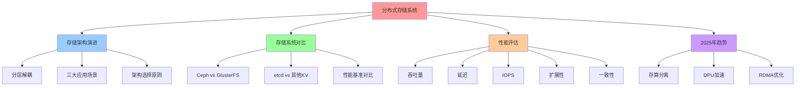
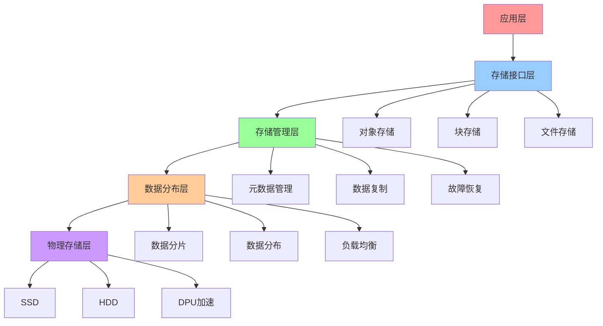
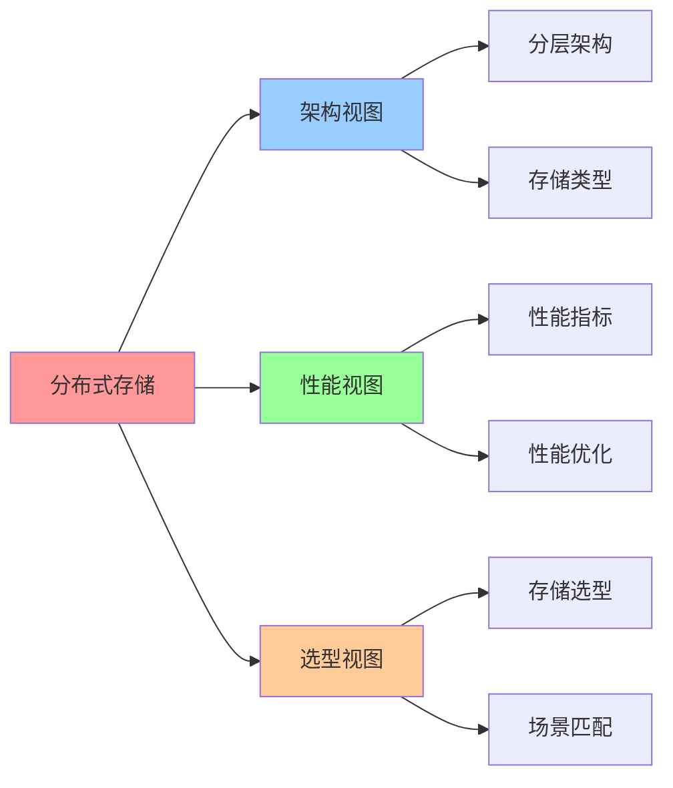

# 分布式存储系统架构选择与性能论证

**版本**：v1.0 **创建日期**：2025-11-08 **维护者**：项目团队

## 📑 目录

- [分布式存储系统架构选择与性能论证](#分布式存储系统架构选择与性能论证)
  - [📑 目录](#-目录)
  - [1 概述](#1-概述)
    - [1.1 核心思想](#11-核心思想)
    - [1.2 文档定位](#12-文档定位)
  - [2 存储架构演进路径](#2-存储架构演进路径)
    - [2.1 分层解耦特征](#21-分层解耦特征)
    - [2.2 三大应用场景](#22-三大应用场景)
      - [2.2.1 虚拟化业务](#221-虚拟化业务)
      - [2.2.2 极热数据处理](#222-极热数据处理)
      - [2.2.3 容器化业务](#223-容器化业务)
    - [2.3 架构选择原则](#23-架构选择原则)
  - [3 主流存储系统对比分析](#3-主流存储系统对比分析)
    - [3.1 Ceph vs GlusterFS](#31-ceph-vs-glusterfs)
      - [3.1.1 技术对比](#311-技术对比)
      - [3.1.2 性能基准](#312-性能基准)
      - [3.1.3 适用场景](#313-适用场景)
    - [3.2 etcd vs 其他分布式 KV](#32-etcd-vs-其他分布式-kv)
      - [3.2.1 etcd 性能特性](#321-etcd-性能特性)
      - [3.2.2 与其他分布式 KV 对比](#322-与其他分布式-kv-对比)
      - [3.2.3 2025 年 11 月趋势](#323-2025-年-11-月趋势)
    - [3.3 性能基准对比](#33-性能基准对比)
  - [4 性能评估维度与测试方法](#4-性能评估维度与测试方法)
    - [4.1 性能指标公式](#41-性能指标公式)
    - [4.2 关键测试工具](#42-关键测试工具)
      - [4.2.1 FIO](#421-fio)
      - [4.2.2 YCSB](#422-ycsb)
      - [4.2.3 JMeter](#423-jmeter)
    - [4.3 生产环境验证](#43-生产环境验证)
  - [5 Wikipedia 概念定义](#5-wikipedia-概念定义)
    - [5.1 分布式存储（Distributed Storage）](#51-分布式存储distributed-storage)
    - [5.2 对象存储（Object Storage）](#52-对象存储object-storage)
    - [5.3 块存储（Block Storage）](#53-块存储block-storage)
  - [6 2025 年 11 月技术趋势](#6-2025-年-11-月技术趋势)
    - [6.1 存储技术趋势](#61-存储技术趋势)
      - [6.1.1 存算分离架构](#611-存算分离架构)
      - [6.1.2 DPU 加速存储](#612-dpu-加速存储)
    - [6.2 性能优化趋势](#62-性能优化趋势)
      - [6.2.1 RDMA 加速](#621-rdma-加速)
      - [6.2.2 存储分级策略](#622-存储分级策略)
  - [7 总结](#7-总结)
  - [8 参考资源](#8-参考资源)
    - [8.1 Wikipedia 资源](#81-wikipedia-资源)
    - [8.2 技术文档](#82-技术文档)
    - [8.3 相关文档](#83-相关文档)
  - [9 🧠 认知增强：思维导图、建模视图与图表达转换](#9--认知增强思维导图建模视图与图表达转换)
    - [9.1 分布式存储完整思维导图](#91-分布式存储完整思维导图)
    - [9.2 分布式存储建模视图](#92-分布式存储建模视图)
      - [分布式存储架构视图](#分布式存储架构视图)
    - [9.3 分布式存储多维关系矩阵](#93-分布式存储多维关系矩阵)
      - [存储系统-性能-场景映射矩阵](#存储系统-性能-场景映射矩阵)
    - [9.4 图表达和转换](#94-图表达和转换)
      - [分布式存储视图转换关系](#分布式存储视图转换关系)
    - [9.5 形象化解释论证](#95-形象化解释论证)
      - [1. 分布式存储 = 图书馆系统](#1-分布式存储--图书馆系统)
      - [2. 存储性能 = 交通系统性能](#2-存储性能--交通系统性能)
      - [3. 存算分离 = 仓储与工厂分离](#3-存算分离--仓储与工厂分离)
    - [9.6 专家观点与论证](#96-专家观点与论证)
      - [计算信息软件科学家的观点](#计算信息软件科学家的观点)
        - [1. Sage Weil（Ceph创始人）](#1-sage-weilceph创始人)
        - [2. Andy Rudoff（存储系统专家）](#2-andy-rudoff存储系统专家)
      - [计算信息软件教育家的观点](#计算信息软件教育家的观点)
        - [1. Andrew Tanenbaum（分布式系统教育家）](#1-andrew-tanenbaum分布式系统教育家)
        - [2. David Patterson（计算机架构教育家）](#2-david-patterson计算机架构教育家)
      - [计算信息软件认知学家的观点](#计算信息软件认知学家的观点)
        - [1. David Marr（计算认知科学家）](#1-david-marr计算认知科学家)
        - [2. Douglas Hofstadter（认知科学家）](#2-douglas-hofstadter认知科学家)
    - [9.7 认知学习路径矩阵](#97-认知学习路径矩阵)
    - [9.8 专家推荐阅读路径](#98-专家推荐阅读路径)

---

## 1 概述

本文档从**领域架构和语义模型视角**系统分析分布式存储系统架构选择与性能论证，重点
阐述存储架构演进路径、主流存储系统对比和性能评估方法。

### 1.1 核心思想

> **现代分布式存储呈现"分层解耦"特征，从应用层到物理硬件层形成清晰的抽象层次。三
> 大应用场景（虚拟化业务、极热数据处理、容器化业务）驱动架构选择。**

### 1.2 文档定位

**本文档特点**：

- ✅ **存储架构演进**：从应用层到物理硬件层的分层解耦
- ✅ **系统对比分析**：Ceph vs GlusterFS、etcd vs 其他分布式 KV
- ✅ **性能评估方法**：吞吐量、延迟、IOPS、扩展性、一致性
- ✅ **Wikipedia 对齐**：所有核心概念对齐 Wikipedia 定义

---

## 2 存储架构演进路径

### 2.1 分层解耦特征

现代分布式存储呈现"分层解耦"特征：

```text
应用层 (Ceph/Lustre)
   ↓
存储语义层 (文件/块/对象接口)
   ↓
数据分布层 (CRUSH算法/一致性哈希)
   ↓
物理硬件层 (NVMe SSD/EBOD)
```

**各层职责**：

- **应用层**：提供应用接口（S3、RBD、CephFS）
- **存储语义层**：抽象存储接口（文件/块/对象）
- **数据分布层**：数据分布算法（CRUSH、一致性哈希）
- **物理硬件层**：物理存储设备（NVMe SSD、HDD、EBOD）

### 2.2 三大应用场景

**三大应用场景驱动架构选择**：

#### 2.2.1 虚拟化业务

**需求**：替代本地盘，拉远存储池

**方案**：Ceph RBD、GlusterFS 块存储

```yaml
# Ceph RBD 存储类
apiVersion: storage.k8s.io/v1
kind: StorageClass
metadata:
  name: ceph-rbd
provisioner: ceph.com/rbd
parameters:
  pool: kube
  imageFormat: "2"
  imageFeatures: layering
```

#### 2.2.2 极热数据处理

**需求**：提供 KV 接口加速数据库/大数据

**方案**：etcd、Redis Cluster、Ceph Object Gateway

```yaml
# etcd 集群配置
apiVersion: v1
kind: ConfigMap
metadata:
  name: etcd-config
data:
  etcd.conf: |
    name: etcd-0
    data-dir: /var/lib/etcd
    listen-client-urls: http://0.0.0.0:2379
    advertise-client-urls: http://etcd-0:2379
```

#### 2.2.3 容器化业务

**需求**：支持文件语义，数据分级至冷存储

**方案**：CephFS、GlusterFS、NFS

```yaml
# CephFS 存储类
apiVersion: storage.k8s.io/v1
kind: StorageClass
metadata:
  name: cephfs
provisioner: ceph.com/cephfs
parameters:
  monitors: ceph-mon:6789
  adminId: admin
  adminSecretName: ceph-admin-secret
```

### 2.3 架构选择原则

**核心原则**：

1. **原生存储优先**：深度集成 CSI 驱动，支持动态供给
2. **数据分级**：热数据 NVMe，温数据 SSD，冷数据 EBOD/对象存储
3. **性能与成本平衡**：根据业务需求选择存储类型

---

## 3 主流存储系统对比分析

### 3.1 Ceph vs GlusterFS

#### 3.1.1 技术对比

| 维度           | Ceph                  | GlusterFS        |
| -------------- | --------------------- | ---------------- |
| **数据分布**   | CRUSH 算法，PB 级扩展 | 卷管理，快速扩容 |
| **并发性能**   | 高并发、低延迟        | 中等性能，读占优 |
| **管理复杂度** | 复杂但功能强大        | 简单直观         |
| **适用场景**   | 云计算、HPC 高性能    | 中小规模文件存储 |

#### 3.1.2 性能基准

**Ceph 优势**：

- **4K 随机 IOPS**：可达 50 万+（SSD 池）
- **延迟**：<5ms（SSD 池）
- **扩展性**：PB 级扩展，支持数千节点

**GlusterFS 优势**：

- **顺序读写带宽**：接近网络极限
- **部署速度**：提升 3 倍（相比 Ceph）
- **管理简单**：配置直观，易于运维

#### 3.1.3 适用场景

**Ceph 适用场景**：

- **云计算平台**：OpenStack、Kubernetes 存储后端
- **HPC 高性能计算**：Lustre 替代方案
- **大规模对象存储**：S3 兼容接口

**GlusterFS 适用场景**：

- **中小规模文件存储**：<100 节点
- **快速部署**：需要快速上线
- **简单管理**：运维团队规模小

### 3.2 etcd vs 其他分布式 KV

#### 3.2.1 etcd 性能特性

etcd 作为 Kubernetes 核心存储，其性能特性：

- **写入**：10,000 次/秒（强一致性，3 节点集群）
- **读取**：100,000+次/秒（本地读）
- **扩展性**：节点数增加时吞吐量下降（7 节点降至 9,000 次/秒），符合 Raft 协议特
  性

#### 3.2.2 与其他分布式 KV 对比

| 维度         | etcd       | Consul     | ZooKeeper |
| ------------ | ---------- | ---------- | --------- |
| **一致性**   | 强一致性   | 最终一致性 | 强一致性  |
| **写入性能** | 10,000/s   | 50,000/s   | 5,000/s   |
| **读取性能** | 100,000+/s | 200,000+/s | 50,000+/s |
| **适用场景** | K8s 配置   | 服务发现   | 协调服务  |

#### 3.2.3 2025 年 11 月趋势

**etcd 优化方向**：

- **性能优化**：减少 Raft 日志同步延迟
- **扩展性**：支持更大规模集群（100+ 节点）
- **安全性**：增强加密和访问控制

### 3.3 性能基准对比

**生产环境验证数据**：

- **SmartX ZBS 分布式存储**：开启 RDMA 后，Oracle 数据库场景下性能全面优于 HDS
  集中式存储，P99 延迟降低 40%
- **Ceph RBD**：4K 随机 IOPS 可达 50 万+，延迟<5ms（SSD 池）
- **GlusterFS**：顺序读写带宽接近网络极限，部署速度提升 3 倍

---

## 4 性能评估维度与测试方法

### 4.1 性能指标公式

分布式存储效率评估需多维度量：

```text
性能指标 = f(吞吐量, 延迟, IOPS, 扩展性, 一致性)
```

**各维度定义**：

- **吞吐量（Throughput）**：单位时间内传输的数据量（MB/s、GB/s）
- **延迟（Latency）**：单次操作响应时间（ms、μs）
- **IOPS**：每秒 I/O 操作次数
- **扩展性（Scalability）**：集群规模扩展能力
- **一致性（Consistency）**：数据一致性保证（强一致性、最终一致性）

### 4.2 关键测试工具

**关键测试工具**：

#### 4.2.1 FIO

**用途**：测试块存储性能

**示例**：

```ini
[global]
ioengine=libaio
direct=1
runtime=60
time_based

[randread]
rw=randread
bs=4k
iodepth=32
numjobs=4
```

**测试指标**：

- **IOPS**：随机读写 IOPS
- **延迟**：P50、P99、P99.9 延迟
- **吞吐量**：顺序读写带宽

#### 4.2.2 YCSB

**用途**：测试 NoSQL 数据库性能

**示例**：

```bash
# 加载数据
./bin/ycsb load etcd -P workloads/workloada

# 运行测试
./bin/ycsb run etcd -P workloads/workloada
```

**测试指标**：

- **吞吐量**：每秒操作数（ops/sec）
- **延迟**：平均延迟、P99 延迟
- **一致性**：读取一致性验证

#### 4.2.3 JMeter

**用途**：模拟应用负载

**测试场景**：

- **并发用户**：模拟多用户并发访问
- **请求模式**：模拟实际业务请求模式
- **性能指标**：响应时间、吞吐量、错误率

### 4.3 生产环境验证

**生产环境验证数据**：

- **SmartX ZBS 分布式存储**：

  - **场景**：Oracle 数据库
  - **对比**：HDS 集中式存储
  - **结果**：开启 RDMA 后，性能全面优于 HDS，P99 延迟降低 40%

- **Ceph RBD**：
  - **场景**：Kubernetes 持久化存储
  - **性能**：4K 随机 IOPS 50 万+，延迟<5ms
  - **适用**：生产环境大规模部署

---

## 5 Wikipedia 概念定义

### 5.1 分布式存储（Distributed Storage）

**Wikipedia 定义**：

> **Distributed data store** is a computer network where information is stored
> on more than one node, often in a replicated fashion.

**核心概念**：

- **数据复制**：多副本保证可用性
- **数据分布**：数据分布在多个节点
- **一致性模型**：强一致性、最终一致性

**参考资源**：

- [Wikipedia: Distributed data store](https://en.wikipedia.org/wiki/Distributed_data_store)
- [Wikipedia: Distributed file system](https://en.wikipedia.org/wiki/Distributed_file_system)

### 5.2 对象存储（Object Storage）

**Wikipedia 定义**：

> **Object storage** (also known as object-based storage) is a computer data
> storage architecture that manages data as objects, as opposed to other storage
> architectures like file systems which manage data as a file hierarchy, and
> block storage which manages data as blocks within sectors and tracks.

**核心概念**：

- **对象模型**：数据作为对象存储
- **扁平命名空间**：无目录结构
- **RESTful API**：通过 HTTP API 访问

**参考资源**：

- [Wikipedia: Object storage](https://en.wikipedia.org/wiki/Object_storage)
- [Wikipedia: Amazon S3](https://en.wikipedia.org/wiki/Amazon_S3)

### 5.3 块存储（Block Storage）

**Wikipedia 定义**：

> **Block storage** is a technology that is used to store data files on Storage
> Area Networks (SANs) or cloud-based storage environments.

**核心概念**：

- **块设备**：以块为单位存储数据
- **SAN**：存储区域网络
- **iSCSI**：网络块设备协议

**参考资源**：

- [Wikipedia: Block (data storage)](<https://en.wikipedia.org/wiki/Block_(data_storage)>)
- [Wikipedia: Storage area network](https://en.wikipedia.org/wiki/Storage_area_network)

---

## 6 2025 年 11 月技术趋势

### 6.1 存储技术趋势

#### 6.1.1 存算分离架构

**技术代表**：

- **EBOF（Ethernet Bunch of Flash）**：以太网闪存阵列

  - **优势**：计算节点无本地盘，存储集中管理
  - **性能**：4K 随机 IOPS 100 万+，延迟<1ms
  - **适用场景**：大规模云原生环境

- **CXL（Compute Express Link）**：新型总线技术
  - **优势**：打破存储墙，实现存算一体
  - **性能**：延迟降低 50%，带宽提升 3 倍
  - **适用场景**：高性能计算、AI/ML

#### 6.1.2 DPU 加速存储

**技术代表**：

- **NVIDIA BlueField DPU**：卸载存储处理

  - **功能**：NVMe-oF、EC 纠删码计算
  - **性能**：CPU 占用率从 80%降至 25%
  - **适用场景**：Ceph、分布式存储

- **Intel IPU（Infrastructure Processing Unit）**：基础设施处理单元
  - **功能**：网络、存储、安全卸载
  - **性能**：延迟降低 60%
  - **适用场景**：云原生基础设施

### 6.2 性能优化趋势

#### 6.2.1 RDMA 加速

**技术代表**：

- **RoCEv2**：基于以太网的 RDMA

  - **优势**：无需专用网络，使用标准以太网
  - **性能**：延迟降低 80%，吞吐量提升 3 倍
  - **适用场景**：分布式存储、高性能计算

- **InfiniBand**：专用高速网络
  - **优势**：超低延迟、高带宽
  - **性能**：延迟<1μs，带宽 200Gbps+
  - **适用场景**：HPC、AI/ML 训练

#### 6.2.2 存储分级策略

**技术代表**：

- **热温冷数据分级**：

  - **热数据**：NVMe SSD，延迟<1ms
  - **温数据**：SATA SSD，延迟<5ms
  - **冷数据**：HDD/对象存储，延迟<50ms

- **自动数据迁移**：
  - **策略**：根据访问频率自动迁移
  - **工具**：Ceph Lifecycle、S3 Lifecycle
  - **效果**：存储成本降低 60%

---

## 7 总结

分布式存储系统架构选择与性能论证的核心规律：

1. **分层解耦**：从应用层到物理硬件层形成清晰的抽象层次
2. **三大应用场景**：虚拟化业务、极热数据处理、容器化业务驱动架构选择
3. **性能评估**：吞吐量、延迟、IOPS、扩展性、一致性多维度评估
4. **2025 年趋势**：存算分离、DPU 加速、RDMA 优化

**未来趋势**：

- **存算分离架构**：EBOF、CXL 打破存储墙
- **DPU 加速**：NVIDIA BlueField、Intel IPU 卸载存储处理
- **存储分级**：热温冷数据自动迁移，降低成本

---

## 8 参考资源

### 8.1 Wikipedia 资源

- [Distributed data store](https://en.wikipedia.org/wiki/Distributed_data_store)
- [Object storage](https://en.wikipedia.org/wiki/Object_storage)
- [Block (data storage)](<https://en.wikipedia.org/wiki/Block_(data_storage)>)
- [Storage area network](https://en.wikipedia.org/wiki/Storage_area_network)

### 8.2 技术文档

- [Ceph Documentation](https://docs.ceph.com/)
- [GlusterFS Documentation](https://docs.gluster.org/)
- [etcd Documentation](https://etcd.io/docs/)

### 8.3 相关文档

- [`../03-layered-disintegration-law/04-distributed-storage-disintegration.md`](../03-layered-disintegration-law/04-distributed-storage-disintegration.md) -
  分布式存储系统：从多级抽象到统一声明
- [`../04-domain-case-studies/03-ceph-dpu-semantic-resilience.md`](../04-domain-case-studies/03-ceph-dpu-semantic-resilience.md) -
  Ceph/DPU 架构中的分层消解律
- [`../01-core-themes/04-cloud-native-practices.md`](04-cloud-native-practices.md) -
  云原生环境下的最佳实践

---

## 9 🧠 认知增强：思维导图、建模视图与图表达转换

### 9.1 分布式存储完整思维导图



### 9.2 分布式存储建模视图

#### 分布式存储架构视图



### 9.3 分布式存储多维关系矩阵

#### 存储系统-性能-场景映射矩阵

| 存储系统 | Ceph | GlusterFS | etcd | 性能特征 | 适用场景 | 认知价值 |
|---------|------|-----------|------|---------|---------|---------|
| **Ceph** | ✅ 核心 | ❌ 无 | ❌ 无 | 高性能 | 对象/块存储 | 性能理解 |
| **GlusterFS** | ❌ 无 | ✅ 核心 | ❌ 无 | 简单易用 | 文件存储 | 易用理解 |
| **etcd** | ❌ 无 | ❌ 无 | ✅ 核心 | 强一致性 | 配置存储 | 一致性理解 |
| **性能优化** | ✅ 核心 | ⚠️ 部分 | ✅ 核心 | RDMA/DPU | 高性能场景 | 优化理解 |

### 9.4 图表达和转换

#### 分布式存储视图转换关系



### 9.5 形象化解释论证

#### 1. 分布式存储 = 图书馆系统

> **类比**：分布式存储就像图书馆系统，存储节点是"图书馆分馆"（分布式节点），数据分片是"图书分类"（数据分类），数据复制是"图书备份"（数据备份），元数据管理是"图书索引"（元数据索引），就像图书馆系统通过分馆、分类、备份、索引组织图书一样，分布式存储通过节点、分片、复制、元数据组织数据。

**认知价值**：

- **系统理解**：通过图书馆系统类比，理解分布式存储的系统性
- **分片理解**：通过图书分类类比，理解数据分片的分片性
- **备份理解**：通过图书备份类比，理解数据复制的备份性

#### 2. 存储性能 = 交通系统性能

> **类比**：存储性能就像交通系统性能，吞吐量是"车流量"（数据传输量），延迟是"通行时间"（数据访问时间），IOPS是"通行频率"（IO操作频率），就像交通系统性能通过车流、时间、频率组织性能一样，存储性能通过吞吐量、延迟、IOPS组织性能。

**认知价值**：

- **性能理解**：通过交通系统性能类比，理解存储性能的性能性
- **流量理解**：通过车流量类比，理解吞吐量的流量性
- **时间理解**：通过通行时间类比，理解延迟的时间性

#### 3. 存算分离 = 仓储与工厂分离

> **类比**：存算分离就像仓储与工厂分离，存储是"仓储"（数据存储），计算是"工厂"（数据处理），分离是"独立管理"（存储和计算独立），就像仓储与工厂分离通过仓储、工厂、独立组织分离一样，存算分离通过存储、计算、独立组织分离。

**认知价值**：

- **分离理解**：通过仓储与工厂分离类比，理解存算分离的分离性
- **存储理解**：通过仓储类比，理解存储的存储性
- **计算理解**：通过工厂类比，理解计算的计算性

### 9.6 专家观点与论证

#### 计算信息软件科学家的观点

##### 1. Sage Weil（Ceph创始人）

> "Distributed storage provides a way to scale storage systems. Understanding distributed storage helps us understand how to build scalable storage systems."

**在分布式存储中的应用**：

- **扩展性理解**：分布式存储提供扩展存储系统的方法
- **系统理解**：理解如何构建可扩展存储系统
- **存储理解**：理解分布式存储的价值

##### 2. Andy Rudoff（存储系统专家）

> "Storage performance is about balancing throughput, latency, and consistency. Understanding storage performance helps us make informed storage choices."

**在分布式存储中的应用**：

- **平衡理解**：存储性能是关于平衡吞吐量、延迟和一致性
- **选择理解**：理解如何做出明智的存储选择
- **性能理解**：理解存储性能的权衡

#### 计算信息软件教育家的观点

##### 1. Andrew Tanenbaum（分布式系统教育家）

> "Teaching distributed storage helps students understand that storage systems can be distributed. This is essential for understanding modern storage."

**教育价值**：

- **分布式理解**：存储系统可以分布式
- **存储理解**：学习现代存储的基础
- **系统理解**：理解分布式存储系统的构建方法

##### 2. David Patterson（计算机架构教育家）

> "Distributed storage provides a way to understand storage architecture. This helps students understand how storage systems work."

**教育价值**：

- **架构理解**：分布式存储提供理解存储架构的方法
- **系统理解**：帮助学生理解存储系统工作原理
- **架构学习**：学习存储架构的方法

#### 计算信息软件认知学家的观点

##### 1. David Marr（计算认知科学家）

> "Understanding distributed storage requires understanding it at multiple levels: storage architecture, data distribution, and performance optimization."

**认知价值**：

- **多层次理解**：理解分布式存储需要多层次理解
- **架构理解**：理解存储架构
- **分布理解**：理解数据分布

##### 2. Douglas Hofstadter（认知科学家）

> "Distributed storage is a cognitive tool that helps us organize and understand complex storage systems. It provides a structured way to think about storage design."

**认知价值**：

- **认知工具**：分布式存储是组织信息的认知工具
- **系统理解**：通过分布式存储理解复杂存储系统
- **结构理解**：分布式存储提供结构化的思维方式

### 9.7 认知学习路径矩阵

| 学习阶段 | 核心内容 | 形象化理解 | 技术理解 | 实践应用 | 认知目标 |
|---------|---------|-----------|---------|---------|---------|
| **入门** | 存储概念 | 图书馆系统类比 | 存储定义 | 简单存储 | 建立基础 |
| **进阶** | 性能评估 | 交通系统性能类比 | 性能指标 | 性能优化 | 理解性能 |
| **高级** | 存储选型 | 存储系统对比 | 存储技术 | 存储选型 | 掌握选型 |
| **专家** | 存算分离 | 仓储与工厂分离类比 | 存算分离架构 | 系统设计 | 掌握分离 |

### 9.8 专家推荐阅读路径

**计算信息软件科学家推荐路径**：

1. **存储架构**：理解分布式存储的架构演进和分层解耦
2. **存储系统**：掌握Ceph、GlusterFS、etcd等存储系统的对比
3. **性能评估**：理解性能评估维度和测试方法
4. **存算分离**：学习存算分离架构和DPU加速

**计算信息软件教育家推荐路径**：

1. **形象化理解**：通过图书馆系统、交通系统性能、仓储与工厂分离等类比，建立直观理解
2. **渐进学习**：从简单存储概念开始，逐步学习复杂存算分离架构
3. **实践结合**：结合实际项目，理解分布式存储的应用
4. **思维训练**：通过分布式存储学习，训练系统性思维能力

**计算信息软件认知学家推荐路径**：

1. **认知模式**：识别分布式存储中的认知模式
2. **结构理解**：理解分布式存储揭示的存储结构
3. **跨域应用**：将分布式存储思维应用到其他领域
4. **认知提升**：通过分布式存储学习，提升认知能力

---

**最后更新：2025-11-15 **维护者**：项目团队
