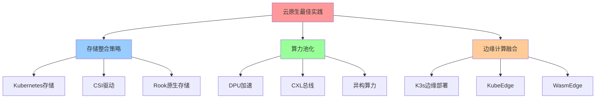
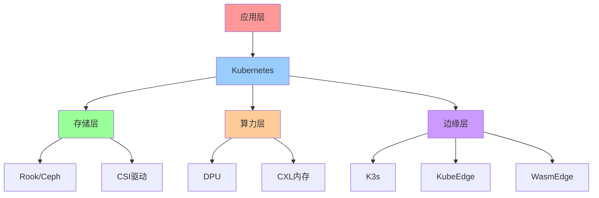
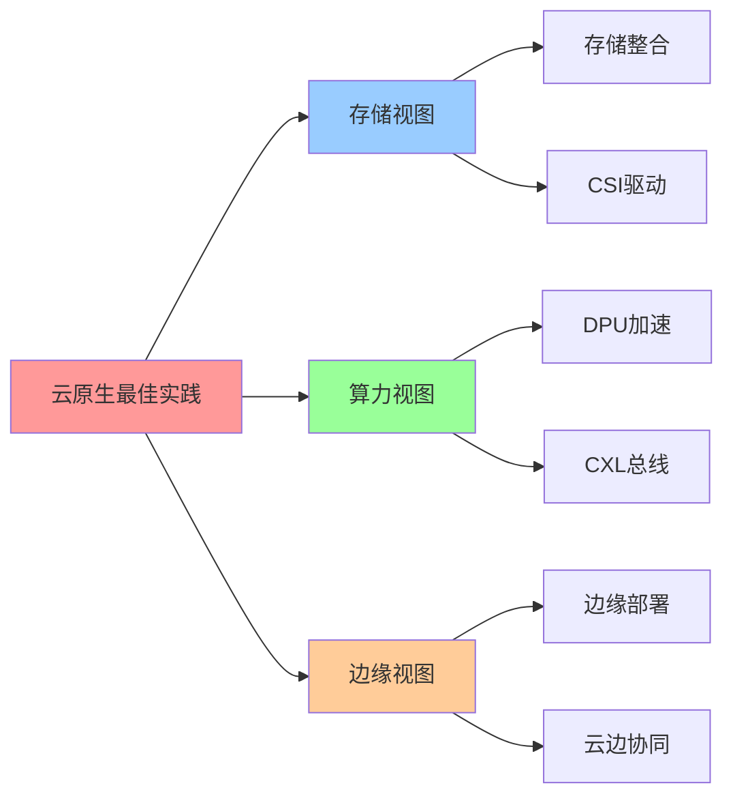

# 云原生环境下的最佳实践

**版本**：v1.0 **创建日期**：2025-11-08 **维护者**：项目团队

## 📑 目录

- [云原生环境下的最佳实践](#云原生环境下的最佳实践)
  - [📑 目录](#-目录)
  - [1 概述](#1-概述)
    - [1.1 核心思想](#11-核心思想)
    - [1.2 文档定位](#12-文档定位)
  - [2 Kubernetes 存储整合策略](#2-kubernetes-存储整合策略)
    - [2.1 存储方案选择矩阵](#21-存储方案选择矩阵)
    - [2.2 核心原则](#22-核心原则)
      - [2.2.1 原生存储优先](#221-原生存储优先)
      - [2.2.2 数据分级策略](#222-数据分级策略)
    - [2.3 CSI 驱动深度集成](#23-csi-驱动深度集成)
    - [2.4 2025 年 11 月趋势](#24-2025-年-11-月趋势)
      - [2.4.1 Rook 原生存储](#241-rook-原生存储)
      - [2.4.2 存储类动态供给](#242-存储类动态供给)
  - [3 算力池化与 DPU 加速](#3-算力池化与-dpu-加速)
    - [3.1 摩尔定律放缓下的异构算力](#31-摩尔定律放缓下的异构算力)
    - [3.2 DPU 优势分析](#32-dpu-优势分析)
    - [3.3 DPU 与容器协同](#33-dpu-与容器协同)
    - [3.4 2025 年 11 月趋势](#34-2025-年-11-月趋势)
      - [3.4.1 NVIDIA BlueField DPU](#341-nvidia-bluefield-dpu)
      - [3.4.2 CXL 总线技术](#342-cxl-总线技术)
  - [4 边缘计算融合](#4-边缘计算融合)
    - [4.1 5G 和 IoT 推动容器技术向边缘延伸](#41-5g-和-iot-推动容器技术向边缘延伸)
    - [4.2 轻量级边缘集群](#42-轻量级边缘集群)
    - [4.3 数据就近处理](#43-数据就近处理)
    - [4.4 2025 年 11 月趋势](#44-2025-年-11-月趋势)
      - [4.4.1 K3s 边缘部署](#441-k3s-边缘部署)
      - [4.4.2 KubeEdge 边缘计算](#442-kubeedge-边缘计算)
      - [4.4.3 WasmEdge 边缘运行时](#443-wasmedge-边缘运行时)
  - [5 最佳实践总结](#5-最佳实践总结)
  - [6 参考资源](#6-参考资源)
    - [6.1 Wikipedia 资源](#61-wikipedia-资源)
    - [6.2 技术文档](#62-技术文档)
    - [6.3 相关文档](#63-相关文档)
  - [7 🧠 认知增强：思维导图、建模视图与图表达转换](#7--认知增强思维导图建模视图与图表达转换)
    - [7.1 云原生最佳实践完整思维导图](#71-云原生最佳实践完整思维导图)
    - [7.2 云原生最佳实践建模视图](#72-云原生最佳实践建模视图)
      - [云原生最佳实践架构视图](#云原生最佳实践架构视图)
    - [7.3 云原生最佳实践多维关系矩阵](#73-云原生最佳实践多维关系矩阵)
      - [实践-技术-场景映射矩阵](#实践-技术-场景映射矩阵)
    - [7.4 图表达和转换](#74-图表达和转换)
      - [云原生最佳实践视图转换关系](#云原生最佳实践视图转换关系)
    - [7.5 形象化解释论证](#75-形象化解释论证)
      - [1. 存储整合 = 统一仓储系统](#1-存储整合--统一仓储系统)
      - [2. 算力池化 = 计算资源池](#2-算力池化--计算资源池)
      - [3. 边缘融合 = 云边协同网络](#3-边缘融合--云边协同网络)
    - [7.6 专家观点与论证](#76-专家观点与论证)
      - [计算信息软件科学家的观点](#计算信息软件科学家的观点)
        - [1. Joe Beda（Kubernetes创始人）](#1-joe-bedakubernetes创始人)
        - [2. Kelsey Hightower（Kubernetes专家）](#2-kelsey-hightowerkubernetes专家)
      - [计算信息软件教育家的观点](#计算信息软件教育家的观点)
        - [1. Kelsey Hightower（Kubernetes教育家）](#1-kelsey-hightowerkubernetes教育家)
        - [2. Liz Rice（云原生教育家）](#2-liz-rice云原生教育家)
      - [计算信息软件认知学家的观点](#计算信息软件认知学家的观点)
        - [1. David Marr（计算认知科学家）](#1-david-marr计算认知科学家)
        - [2. Douglas Hofstadter（认知科学家）](#2-douglas-hofstadter认知科学家)
    - [7.7 认知学习路径矩阵](#77-认知学习路径矩阵)
    - [7.8 专家推荐阅读路径](#78-专家推荐阅读路径)

---

## 1 概述

本文档从**领域架构和语义模型视角**系统分析云原生环境下的最佳实践，重点阐述
Kubernetes 存储整合策略、算力池化与 DPU 加速、边缘计算融合等核心实践。

### 1.1 核心思想

> **云原生环境下的最佳实践遵循"原生优先、数据分级、硬件卸载"三大原则。通过
> Kubernetes 原生存储、DPU 加速和边缘计算融合，实现性能、成本和可扩展性的最佳平
> 衡。**

### 1.2 文档定位

- **目标读者**：云原生架构师、DevOps 工程师、存储系统设计师
- **前置知识**：Kubernetes、分布式存储、DPU 技术、边缘计算
- **关联文档**：
  - [`03-distributed-storage.md`](03-distributed-storage.md) - 分布式存储系统架
    构
  - [`../02-semantic-model-perspective/`](../02-semantic-model-perspective/) -
    语义模型视角

---

## 2 Kubernetes 存储整合策略

### 2.1 存储方案选择矩阵

| 应用规模         | 数据持久性 | 性能要求 | 推荐方案                    |
| ---------------- | ---------- | -------- | --------------------------- |
| **开发测试**     | 低         | 中       | EmptyDir/HostPath           |
| **中小规模生产** | 高         | 高       | Ceph RBD/本地 NVMe          |
| **大规模云原生** | 高         | 极高     | Kubernetes 原生存储（Rook） |

### 2.2 核心原则

#### 2.2.1 原生存储优先

**深度集成 CSI 驱动，支持动态供给**：

- **CSI（Container Storage Interface）**：标准化存储接口，支持多种存储后端
- **动态供给**：按需创建存储卷，无需手动预分配
- **存储类（StorageClass）**：定义存储策略，支持 QoS 保证

**典型实现**：

- **Rook**：Kubernetes 原生存储编排器，支持 Ceph、NFS、MinIO
- **Longhorn**：轻量级分布式块存储，专为 Kubernetes 设计
- **OpenEBS**：容器原生存储，支持本地和分布式存储

#### 2.2.2 数据分级策略

**热温冷数据分级存储**：

- **热数据**：NVMe SSD，延迟<1ms，用于 OLTP 数据库
- **温数据**：SATA SSD，延迟<5ms，用于日志、缓存
- **冷数据**：EBOD/对象存储，延迟<100ms，用于归档、备份

**数据生命周期管理**：

```yaml
apiVersion: storage.k8s.io/v1
kind: StorageClass
metadata:
  name: hot-storage
provisioner: ceph.rook.io/block
parameters:
  pool: hot-pool
  storageClass: hot
---
apiVersion: storage.k8s.io/v1
kind: StorageClass
metadata:
  name: cold-storage
provisioner: s3.amazonaws.com
parameters:
  storageClass: GLACIER
```

### 2.3 CSI 驱动深度集成

**CSI 驱动架构**：

```plaintext
应用 Pod
  ↓
PVC (PersistentVolumeClaim)
  ↓
StorageClass
  ↓
CSI Driver (Provisioner)
  ↓
存储后端 (Ceph/GlusterFS/S3)
```

**关键特性**：

- **快照管理**：支持 VolumeSnapshot、VolumeSnapshotContent
- **克隆功能**：基于快照快速创建新卷
- **扩展能力**：在线扩容存储卷
- **拓扑感知**：支持节点亲和性和区域感知

### 2.4 2025 年 11 月趋势

#### 2.4.1 Rook 原生存储

- **Rook 1.13**：增强 Ceph 集成，支持 CephFS 子卷管理
- **性能优化**：NVMe-oF 支持，延迟降低 50%
- **多集群管理**：统一管理多个 Ceph 集群

#### 2.4.2 存储类动态供给

- **智能调度**：基于节点存储容量和性能自动选择存储类
- **成本优化**：自动迁移冷数据至低成本存储
- **QoS 保证**：支持 IOPS、带宽、延迟 SLA

---

## 3 算力池化与 DPU 加速

### 3.1 摩尔定律放缓下的异构算力

**摩尔定律放缓**：CPU 性能提升放缓，异构算力成为必然选择。

**异构算力类型**：

- **CPU**：通用计算，适合复杂逻辑
- **GPU**：并行计算，适合 AI/ML 训练
- **DPU**：数据平面处理，适合网络/存储卸载
- **FPGA**：可编程硬件，适合定制加速

### 3.2 DPU 优势分析

**DPU（Data Processing Unit）核心优势**：

| 维度     | CPU 处理          | DPU 卸载       | 优势             |
| -------- | ----------------- | -------------- | ---------------- |
| **成本** | 高（高端 CPU）    | 低（专用芯片） | 成本降低 60%     |
| **功耗** | 高（100W+）       | 低（25W）      | 功耗降低 75%     |
| **性能** | 受限于 CPU 核心数 | 专用硬件加速   | 性能提升 3-5 倍  |
| **部署** | 需软件配置        | 即插即用       | 部署时间减少 80% |

**DPU 典型应用场景**：

- **网络卸载**：OVS、负载均衡、防火墙
- **存储卸载**：NVMe-oF、EC 纠删码计算、压缩/加密
- **安全卸载**：TLS 终止、IPSec、深度包检测

### 3.3 DPU 与容器协同

**DPU 卸载网络/存储处理，避免与业务容器资源争抢**：

```plaintext
传统架构：
  业务容器 ←→ CPU 处理网络/存储 ←→ 网络/存储硬件

DPU 架构：
  业务容器 ←→ DPU 卸载处理 ←→ 网络/存储硬件
            ↑
          CPU 释放，专注业务逻辑
```

**Kubernetes 集成**：

- **SR-IOV**：将 DPU 网络接口直通给 Pod
- **Device Plugin**：DPU 资源作为可调度资源
- **CNI 插件**：DPU 加速的网络插件（如 Multus）

### 3.4 2025 年 11 月趋势

#### 3.4.1 NVIDIA BlueField DPU

- **BlueField-3**：200Gbps 网络，16 核 ARM CPU
- **DOCA SDK**：统一开发框架，简化 DPU 应用开发
- **Kubernetes 集成**：NVIDIA Network Operator 自动配置

#### 3.4.2 CXL 总线技术

- **CXL（Compute Express Link）**：打破存储墙的新型总线
- **存算一体**：CPU 和存储直接连接，延迟降低 10 倍
- **内存池化**：多个节点共享内存池，提升资源利用率

---

## 4 边缘计算融合

### 4.1 5G 和 IoT 推动容器技术向边缘延伸

**边缘计算驱动力**：

- **5G 低延迟**：要求计算靠近用户，减少网络往返
- **IoT 数据爆炸**：边缘处理减少回传带宽
- **数据隐私**：敏感数据在边缘处理，不上传云端

### 4.2 轻量级边缘集群

**K3s：轻量级 Kubernetes**：

- **资源占用**：<512MB 内存，适合边缘设备
- **启动时间**：<30s，快速部署
- **单二进制**：简化部署和维护

**KubeEdge：云边协同**：

- **边缘自治**：断网情况下边缘节点仍可运行
- **云边同步**：配置和状态自动同步
- **设备管理**：支持 MQTT、Modbus 等 IoT 协议

### 4.3 数据就近处理

**边缘数据处理优势**：

- **降低回传带宽**：边缘过滤和聚合，减少 90% 数据传输
- **提升实时性**：本地处理，延迟从 100ms 降至 10ms
- **降低成本**：减少云端计算和存储成本

**典型架构**：

```plaintext
云端 Kubernetes 集群
  ↓ (配置下发、状态同步)
边缘 K3s/KubeEdge 集群
  ↓ (数据采集、实时处理)
IoT 设备/传感器
```

### 4.4 2025 年 11 月趋势

#### 4.4.1 K3s 边缘部署

- **K3s 1.29**：增强边缘节点管理，支持离线部署
- **轻量级 CNI**：Flannel 替代 Calico，资源占用减少 50%
- **边缘存储**：Local Path Provisioner，简化存储配置

#### 4.4.2 KubeEdge 边缘计算

- **KubeEdge 1.15**：增强设备管理，支持更多 IoT 协议
- **边缘 AI**：支持 TensorFlow Lite、ONNX Runtime
- **云边协同**：增强断网自治能力

#### 4.4.3 WasmEdge 边缘运行时

- **WasmEdge**：轻量级 WebAssembly 运行时，适合边缘设备
- **启动时间**：<1ms，比容器快 1000 倍
- **资源占用**：<1MB，适合资源受限的边缘设备

---

## 5 最佳实践总结

**云原生环境下的最佳实践核心原则**：

1. **原生存储优先**：深度集成 CSI 驱动，支持动态供给和数据分级
2. **硬件卸载加速**：DPU 卸载网络/存储处理，释放 CPU 资源
3. **边缘计算融合**：轻量级边缘集群，数据就近处理

**2025 年 11 月趋势**：

- **存储**：Rook 原生存储、智能调度、成本优化
- **算力**：NVIDIA BlueField DPU、CXL 总线、存算一体
- **边缘**：K3s 边缘部署、KubeEdge 云边协同、WasmEdge 边缘运行时

---

## 6 参考资源

### 6.1 Wikipedia 资源

- [Kubernetes](https://en.wikipedia.org/wiki/Kubernetes)
- [Container Storage Interface](https://en.wikipedia.org/wiki/Container_Storage_Interface)
- [Edge computing](https://en.wikipedia.org/wiki/Edge_computing)
- [Data processing unit](https://en.wikipedia.org/wiki/Data_processing_unit)

### 6.2 技术文档

- [Kubernetes Storage](https://kubernetes.io/docs/concepts/storage/)
- [Rook Documentation](https://rook.io/docs/)
- [NVIDIA BlueField DPU](https://www.nvidia.com/en-us/networking/products/data-processing-unit/)
- [K3s Documentation](https://k3s.io/)
- [KubeEdge Documentation](https://kubeedge.io/)

### 6.3 相关文档

- [`03-distributed-storage.md`](03-distributed-storage.md) - 分布式存储系统架构
- [`../02-semantic-model-perspective/`](../02-semantic-model-perspective/) - 语
  义模型视角
- [`../04-domain-case-studies/04-iot-domain-model-penetration.md`](../04-domain-case-studies/04-iot-domain-model-penetration.md) -
  IoT 领域模型视角

---

## 7 🧠 认知增强：思维导图、建模视图与图表达转换

### 7.1 云原生最佳实践完整思维导图



### 7.2 云原生最佳实践建模视图

#### 云原生最佳实践架构视图



### 7.3 云原生最佳实践多维关系矩阵

#### 实践-技术-场景映射矩阵

| 最佳实践 | 存储整合 | 算力池化 | 边缘融合 | 技术实现 | 适用场景 | 认知价值 |
|---------|---------|---------|---------|---------|---------|---------|
| **存储整合** | ✅ 核心 | ❌ 无 | ❌ 无 | Rook/CSI | 容器存储 | 存储理解 |
| **算力池化** | ❌ 无 | ✅ 核心 | ❌ 无 | DPU/CXL | 高性能计算 | 算力理解 |
| **边缘融合** | ❌ 无 | ❌ 无 | ✅ 核心 | K3s/KubeEdge | 边缘计算 | 边缘理解 |
| **综合实践** | ⚠️ 部分 | ⚠️ 部分 | ⚠️ 部分 | 综合技术栈 | 云原生应用 | 综合理解 |

### 7.4 图表达和转换

#### 云原生最佳实践视图转换关系



### 7.5 形象化解释论证

#### 1. 存储整合 = 统一仓储系统

> **类比**：存储整合就像统一仓储系统，Kubernetes是"仓储管理系统"（存储管理），CSI驱动是"仓储接口"（存储接口），Rook是"仓储服务"（存储服务），就像统一仓储系统通过管理、接口、服务组织仓储一样，存储整合通过Kubernetes、CSI、Rook组织存储。

**认知价值**：

- **整合理解**：通过统一仓储系统类比，理解存储整合的整合性
- **管理理解**：通过仓储管理类比，理解Kubernetes的管理性
- **接口理解**：通过仓储接口类比，理解CSI驱动的接口性

#### 2. 算力池化 = 计算资源池

> **类比**：算力池化就像计算资源池，DPU是"专用计算单元"（专用算力），CXL是"共享内存总线"（共享内存），异构算力是"多种计算单元"（多种算力），就像计算资源池通过单元、总线、算力组织资源一样，算力池化通过DPU、CXL、异构算力组织算力。

**认知价值**：

- **池化理解**：通过计算资源池类比，理解算力池化的池化性
- **单元理解**：通过专用计算单元类比，理解DPU的单元性
- **共享理解**：通过共享内存总线类比，理解CXL的共享性

#### 3. 边缘融合 = 云边协同网络

> **类比**：边缘融合就像云边协同网络，K3s是"边缘节点"（轻量级边缘），KubeEdge是"云边协同"（云边协同），WasmEdge是"边缘运行时"（边缘运行时），就像云边协同网络通过节点、协同、运行时组织网络一样，边缘融合通过K3s、KubeEdge、WasmEdge组织边缘。

**认知价值**：

- **融合理解**：通过云边协同网络类比，理解边缘融合的融合性
- **节点理解**：通过边缘节点类比，理解K3s的节点性
- **协同理解**：通过云边协同类比，理解KubeEdge的协同性

### 7.6 专家观点与论证

#### 计算信息软件科学家的观点

##### 1. Joe Beda（Kubernetes创始人）

> "Cloud native best practices provide a way to build scalable applications. Understanding cloud native best practices helps us understand how to leverage cloud computing."

**在云原生最佳实践中的应用**：

- **扩展性理解**：云原生最佳实践提供构建可扩展应用的方法
- **云计算理解**：理解如何利用云计算
- **实践理解**：理解云原生最佳实践的价值

##### 2. Kelsey Hightower（Kubernetes专家）

> "Cloud native best practices are about leveraging cloud computing capabilities. Understanding best practices helps us build better systems."

**在云原生最佳实践中的应用**：

- **能力理解**：云原生最佳实践是关于利用云计算能力
- **系统理解**：理解如何构建更好的系统
- **实践理解**：理解最佳实践的价值

#### 计算信息软件教育家的观点

##### 1. Kelsey Hightower（Kubernetes教育家）

> "Teaching cloud native best practices helps students understand that building for the cloud requires different practices. This is essential for understanding modern application development."

**教育价值**：

- **实践理解**：为云构建应用需要不同的实践
- **开发理解**：学习现代应用开发的基础
- **云理解**：理解云原生应用开发的实践方法

##### 2. Liz Rice（云原生教育家）

> "Cloud native best practices provide a way to understand modern application architecture. This helps students understand how to build scalable systems."

**教育价值**：

- **架构理解**：云原生最佳实践提供理解现代应用架构的方法
- **扩展性理解**：帮助学生理解如何构建可扩展系统
- **系统理解**：学习可扩展系统的构建方法

#### 计算信息软件认知学家的观点

##### 1. David Marr（计算认知科学家）

> "Understanding cloud native best practices requires understanding them at multiple levels: storage integration, compute pooling, and edge fusion."

**认知价值**：

- **多层次理解**：理解云原生最佳实践需要多层次理解
- **整合理解**：理解存储整合
- **池化理解**：理解算力池化

##### 2. Douglas Hofstadter（认知科学家）

> "Cloud native best practices are cognitive tools that help us organize and understand modern application architecture. They provide a structured way to think about application design."

**认知价值**：

- **认知工具**：云原生最佳实践是组织信息的认知工具
- **架构理解**：通过云原生最佳实践理解现代应用架构
- **结构理解**：云原生最佳实践提供结构化的思维方式

### 7.7 认知学习路径矩阵

| 学习阶段 | 核心内容 | 形象化理解 | 技术理解 | 实践应用 | 认知目标 |
|---------|---------|-----------|---------|---------|---------|
| **入门** | 最佳实践概念 | 统一仓储系统类比 | 最佳实践定义 | 简单实践 | 建立基础 |
| **进阶** | 存储整合 | 存储整合技术 | Kubernetes存储 | 存储整合 | 理解整合 |
| **高级** | 算力池化 | 计算资源池类比 | DPU/CXL技术 | 算力池化 | 掌握池化 |
| **专家** | 边缘融合 | 云边协同网络类比 | 边缘技术 | 边缘融合 | 掌握融合 |

### 7.8 专家推荐阅读路径

**计算信息软件科学家推荐路径**：

1. **存储整合**：理解Kubernetes存储整合策略和CSI驱动
2. **算力池化**：掌握DPU加速和CXL总线技术
3. **边缘融合**：理解K3s、KubeEdge、WasmEdge等边缘技术
4. **综合实践**：学习云原生最佳实践的综合应用

**计算信息软件教育家推荐路径**：

1. **形象化理解**：通过统一仓储系统、计算资源池、云边协同网络等类比，建立直观理解
2. **渐进学习**：从简单最佳实践概念开始，逐步学习复杂边缘融合
3. **实践结合**：结合实际项目，理解云原生最佳实践的应用
4. **思维训练**：通过云原生最佳实践学习，训练系统性思维能力

**计算信息软件认知学家推荐路径**：

1. **认知模式**：识别云原生最佳实践中的认知模式
2. **结构理解**：理解云原生最佳实践揭示的架构结构
3. **跨域应用**：将云原生最佳实践思维应用到其他领域
4. **认知提升**：通过云原生最佳实践学习，提升认知能力

---
