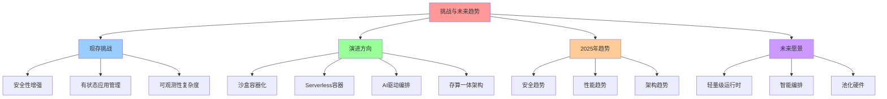
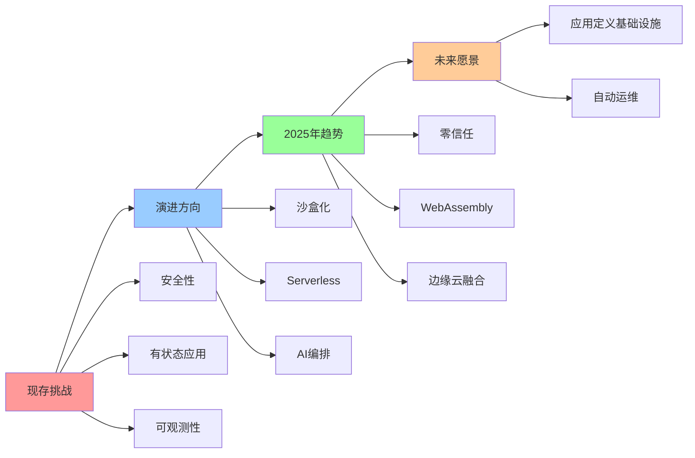
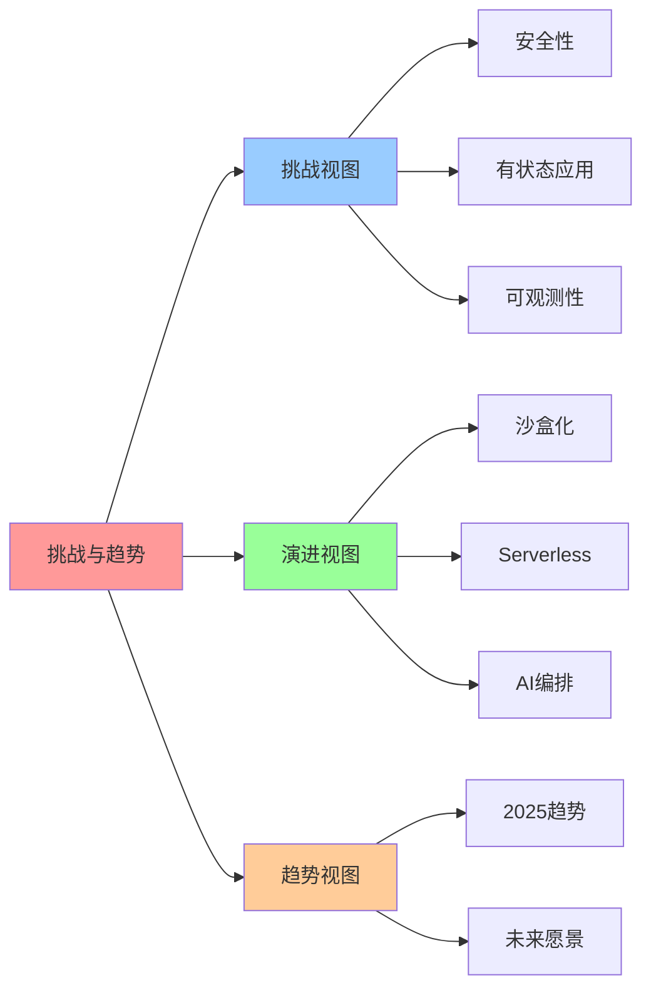

# 挑战与未来趋势

**版本**：v1.0 **创建日期**：2025-11-08 **维护者**：项目团队

## 📑 目录

- [挑战与未来趋势](#挑战与未来趋势)
  - [📑 目录](#-目录)
  - [1 概述](#1-概述)
    - [1.1 核心思想](#11-核心思想)
    - [1.2 文档定位](#12-文档定位)
  - [2 现存挑战](#2-现存挑战)
    - [2.1 安全性增强](#21-安全性增强)
      - [2.1.1 容器共享内核风险](#211-容器共享内核风险)
      - [2.1.2 运行时安全加固](#212-运行时安全加固)
    - [2.2 有状态应用管理](#22-有状态应用管理)
      - [2.2.1 StatefulSet 局限性](#221-statefulset-局限性)
      - [2.2.2 跨节点数据同步难点](#222-跨节点数据同步难点)
    - [2.3 可观测性复杂度](#23-可观测性复杂度)
      - [2.3.1 微服务调用链追踪](#231-微服务调用链追踪)
      - [2.3.2 性能分析复杂度](#232-性能分析复杂度)
  - [3 演进方向](#3-演进方向)
    - [3.1 沙盒容器化](#31-沙盒容器化)
      - [3.1.1 Kata Containers](#311-kata-containers)
      - [3.1.2 gVisor](#312-gvisor)
    - [3.2 Serverless 容器](#32-serverless-容器)
      - [3.2.1 AWS Fargate](#321-aws-fargate)
      - [3.2.2 Google Cloud Run](#322-google-cloud-run)
    - [3.3 AI 驱动的编排](#33-ai-驱动的编排)
      - [3.3.1 智能扩缩容](#331-智能扩缩容)
      - [3.3.2 负载预测](#332-负载预测)
    - [3.4 存算一体架构](#34-存算一体架构)
      - [3.4.1 CXL 总线技术](#341-cxl-总线技术)
      - [3.4.2 内存池化](#342-内存池化)
  - [4 2025 年 11 月技术趋势](#4-2025-年-11-月技术趋势)
    - [4.1 安全趋势](#41-安全趋势)
      - [4.1.1 零信任架构](#411-零信任架构)
      - [4.1.2 eBPF 安全策略](#412-ebpf-安全策略)
    - [4.2 性能趋势](#42-性能趋势)
      - [4.2.1 WebAssembly 运行时](#421-webassembly-运行时)
      - [4.2.2 硬件加速](#422-硬件加速)
    - [4.3 架构趋势](#43-架构趋势)
      - [4.3.1 边缘云融合](#431-边缘云融合)
      - [4.3.2 多运行时支持](#432-多运行时支持)
  - [5 未来架构愿景](#5-未来架构愿景)
  - [6 参考资源](#6-参考资源)
    - [6.1 Wikipedia 资源](#61-wikipedia-资源)
    - [6.2 技术文档](#62-技术文档)
    - [6.3 相关文档](#63-相关文档)
  - [7 🧠 认知增强：思维导图、建模视图与图表达转换](#7--认知增强思维导图建模视图与图表达转换)
    - [7.1 挑战与未来趋势完整思维导图](#71-挑战与未来趋势完整思维导图)
    - [7.2 挑战与未来趋势建模视图](#72-挑战与未来趋势建模视图)
      - [挑战与趋势演进视图](#挑战与趋势演进视图)
    - [7.3 挑战与未来趋势多维关系矩阵](#73-挑战与未来趋势多维关系矩阵)
      - [挑战-演进-趋势映射矩阵](#挑战-演进-趋势映射矩阵)
    - [7.4 图表达和转换](#74-图表达和转换)
      - [挑战与趋势视图转换关系](#挑战与趋势视图转换关系)
    - [7.5 形象化解释论证](#75-形象化解释论证)
      - [1. 挑战 = 系统演进障碍](#1-挑战--系统演进障碍)
      - [2. 演进方向 = 解决方案路径](#2-演进方向--解决方案路径)
      - [3. 未来愿景 = 理想系统状态](#3-未来愿景--理想系统状态)
    - [7.6 专家观点与论证](#76-专家观点与论证)
      - [计算信息软件科学家的观点](#计算信息软件科学家的观点)
        - [1. Lin Clark（WebAssembly专家）](#1-lin-clarkwebassembly专家)
        - [2. Kelsey Hightower（Kubernetes专家）](#2-kelsey-hightowerkubernetes专家)
      - [计算信息软件教育家的观点](#计算信息软件教育家的观点)
        - [1. Kelsey Hightower（Kubernetes教育家）](#1-kelsey-hightowerkubernetes教育家)
        - [2. Liz Rice（云原生教育家）](#2-liz-rice云原生教育家)
      - [计算信息软件认知学家的观点](#计算信息软件认知学家的观点)
        - [1. David Marr（计算认知科学家）](#1-david-marr计算认知科学家)
        - [2. Douglas Hofstadter（认知科学家）](#2-douglas-hofstadter认知科学家)
    - [7.7 认知学习路径矩阵](#77-认知学习路径矩阵)
    - [7.8 专家推荐阅读路径](#78-专家推荐阅读路径)

---

## 1 概述

本文档从**领域架构和语义模型视角**系统分析云原生环境下的现存挑战和未来演进方向，
重点阐述安全性增强、有状态应用管理、可观测性复杂度等核心挑战，以及沙盒容器化、
Serverless 容器、AI 驱动编排、存算一体架构等演进方向。

### 1.1 核心思想

> **云原生架构的演进遵循"安全优先、性能优化、智能编排"三大方向。通过沙盒容器化、
> Serverless 容器、AI 驱动编排和存算一体架构，实现安全性、性能和可扩展性的持续提
> 升。**

### 1.2 文档定位

- **目标读者**：云原生架构师、DevOps 工程师、安全专家
- **前置知识**：Kubernetes、容器安全、可观测性、AI/ML
- **关联文档**：
  - [`01-technology-essence.md`](01-technology-essence.md) - 技术本质与演进趋势
  - [`04-cloud-native-best-practices.md`](04-cloud-native-best-practices.md) -
    云原生最佳实践

---

## 2 现存挑战

### 2.1 安全性增强

#### 2.1.1 容器共享内核风险

**核心问题**：容器共享宿主机内核，导致攻击面扩大。

**风险场景**：

- **内核漏洞利用**：一个容器被攻破可能影响整个节点
- **资源竞争**：恶意容器可能耗尽节点资源
- **数据泄露**：容器间可能通过共享资源泄露数据

**典型案例**：

- **CVE-2021-22555**：Linux 内核漏洞，容器逃逸
- **CVE-2022-0492**：cgroups v2 漏洞，容器逃逸

#### 2.1.2 运行时安全加固

**解决方案**：

- **Falco**：CNCF 项目，运行时安全监控

  - **检测能力**：系统调用、网络流量、文件访问
  - **性能开销**：<5%
  - **规则引擎**：基于 eBPF 的高性能检测

- **Seccomp**：系统调用过滤

  - **限制能力**：只允许必要的系统调用
  - **性能影响**：<1%
  - **部署方式**：Pod Security Standards

- **AppArmor/SELinux**：强制访问控制
  - **隔离能力**：文件系统、网络、进程隔离
  - **配置复杂度**：高，需要专业安全团队

**最佳实践**：

```yaml
apiVersion: v1
kind: Pod
metadata:
  name: secure-pod
spec:
  securityContext:
    seccompProfile:
      type: RuntimeDefault
    runAsNonRoot: true
    runAsUser: 1000
  containers:
    - name: app
      securityContext:
        allowPrivilegeEscalation: false
        capabilities:
          drop:
            - ALL
```

### 2.2 有状态应用管理

#### 2.2.1 StatefulSet 局限性

**StatefulSet 解决的问题**：

- **有序部署**：Pod 按顺序创建和删除
- **稳定网络标识**：每个 Pod 有稳定的 DNS 名称
- **稳定存储**：每个 Pod 有独立的 PVC

**StatefulSet 的局限性**：

- **单节点故障**：Pod 无法自动迁移到其他节点
- **存储绑定**：存储卷绑定到特定节点，限制调度灵活性
- **扩展性**：水平扩展需要手动操作，无法自动扩缩容

#### 2.2.2 跨节点数据同步难点

**核心挑战**：

- **数据一致性**：跨节点数据同步需要强一致性保证
- **网络延迟**：跨节点数据同步增加延迟
- **故障恢复**：节点故障后数据恢复复杂

**解决方案**：

- **分布式存储**：Ceph、GlusterFS 提供跨节点存储
- **数据库集群**：MySQL Group Replication、PostgreSQL Streaming Replication
- **状态同步**：etcd、Consul 提供分布式状态管理

### 2.3 可观测性复杂度

#### 2.3.1 微服务调用链追踪

**核心挑战**：微服务拆分后，调用链追踪复杂度指数级增长。

**复杂度分析**：

- **N 个服务**：可能的调用路径数为 N²
- **调用深度**：平均调用深度 5-10 层
- **数据量**：每秒产生数百万条追踪数据

**解决方案**：

- **OpenTelemetry**：统一的可观测性标准

  - **Metrics**：Prometheus、Grafana
  - **Logs**：Loki、ELK Stack
  - **Traces**：Jaeger、Zipkin

- **eBPF 自动追踪**：无需代码埋点，自动生成调用链
  - **性能开销**：<3%
  - **覆盖范围**：100% 服务调用

#### 2.3.2 性能分析复杂度

**核心挑战**：性能问题定位困难，需要多维度数据分析。

**分析维度**：

- **应用层**：代码执行时间、函数调用栈
- **中间件层**：数据库查询、缓存命中率
- **基础设施层**：CPU、内存、网络、存储

**解决方案**：

- **APM 工具**：New Relic、Datadog、Dynatrace
- **Profiling**：pprof、perf、eBPF Profiler
- **分布式追踪**：Jaeger、Zipkin、Tempo

---

## 3 演进方向

### 3.1 沙盒容器化

#### 3.1.1 Kata Containers

**核心特性**：VM 级隔离+容器速度。

**技术架构**：

```plaintext
容器接口 (containerd/CRI-O)
  ↓
Kata Containers Runtime
  ↓
轻量级虚拟机 (QEMU/Firecracker)
  ↓
Guest Kernel + 容器
```

**性能指标**：

- **启动时间**：<1s（Firecracker），<5s（QEMU）
- **内存开销**：<50MB（Firecracker），<128MB（QEMU）
- **性能损失**：<5%
- **隔离强度**：VM 级隔离

**适用场景**：

- **多租户云**：需要强隔离的 SaaS 服务
- **不可信代码**：运行第三方插件、用户代码
- **合规要求**：金融、医疗等强合规场景

#### 3.1.2 gVisor

**核心特性**：用户态内核，系统调用拦截。

**技术架构**：

```plaintext
容器接口 (containerd/CRI-O)
  ↓
gVisor Runtime (runsc)
  ↓
用户态内核 (Sentry)
  ↓
系统调用拦截 (Gofer)
  ↓
Host Kernel
```

**性能指标**：

- **启动时间**：<100ms
- **内存开销**：<20MB
- **性能损失**：<10%
- **隔离强度**：系统调用级过滤

**适用场景**：

- **CI/CD**：运行不可信构建任务
- **Serverless**：AWS Lambda、Google Cloud Functions
- **插件系统**：运行第三方插件

### 3.2 Serverless 容器

#### 3.2.1 AWS Fargate

**核心特性**：无需管理服务器的容器服务。

**技术架构**：

```plaintext
ECS/EKS 任务定义
  ↓
Fargate 调度
  ↓
隔离的容器运行时
  ↓
AWS 基础设施
```

**性能指标**：

- **启动时间**：<30s
- **资源隔离**：每个任务独立 vCPU 和内存
- **适用场景**：ECS、EKS 无服务器模式

#### 3.2.2 Google Cloud Run

**核心特性**：完全托管的 Serverless 容器平台。

**性能指标**：

- **启动时间**：<10s（冷启动），<1s（预热后）
- **自动扩缩容**：0 到 N 实例，秒级响应
- **适用场景**：HTTP 服务、事件处理

### 3.3 AI 驱动的编排

#### 3.3.1 智能扩缩容

**核心思想**：基于历史负载预测的智能扩缩容。

**技术实现**：

- **时间序列预测**：LSTM、Prophet 预测未来负载
- **强化学习**：DQN、PPO 优化扩缩容策略
- **多目标优化**：平衡性能、成本、SLA

**典型方案**：

- **Kubernetes HPA with Custom Metrics**：基于自定义指标扩缩容
- **KEDA**：基于事件驱动的自动扩缩容
- **Crane**：腾讯开源的智能扩缩容系统

#### 3.3.2 负载预测

**预测维度**：

- **时间维度**：日、周、月周期性负载
- **事件维度**：促销、发布、故障等突发负载
- **用户维度**：用户行为模式、地理位置

**预测模型**：

- **统计模型**：ARIMA、指数平滑
- **机器学习**：LSTM、Transformer
- **深度学习**：GAN、VAE

### 3.4 存算一体架构

#### 3.4.1 CXL 总线技术

**核心特性**：打破存储墙的新型总线。

**技术架构**：

```plaintext
CPU
  ↓ (CXL 3.0, 64GT/s)
CXL Switch
  ↓
内存池 (CXL Memory)
存储池 (CXL Storage)
加速器 (CXL Accelerator)
```

**性能优势**：

- **延迟降低**：从 100ns 降至 10ns（10 倍提升）
- **带宽提升**：从 100GB/s 提升至 1TB/s（10 倍提升）
- **内存池化**：多个节点共享内存池，提升资源利用率

#### 3.4.2 内存池化

**核心思想**：多个节点共享内存池，实现内存资源的统一管理和调度。

**应用场景**：

- **大数据分析**：Spark、Flink 共享内存池
- **AI/ML 训练**：模型参数共享内存池
- **数据库集群**：共享缓存池，提升命中率

---

## 4 2025 年 11 月技术趋势

### 4.1 安全趋势

#### 4.1.1 零信任架构

**核心原则**：永不信任，始终验证。

**实现方式**：

- **身份认证**：mTLS、SPIFFE/SPIRE
- **授权策略**：OPA、Kyverno
- **网络隔离**：Calico、Cilium NetworkPolicy

#### 4.1.2 eBPF 安全策略

**核心优势**：内核级安全策略，性能开销低。

**应用场景**：

- **网络策略**：Cilium eBPF 网络策略
- **安全监控**：Falco eBPF 驱动
- **流量控制**：eBPF 限流、QoS

### 4.2 性能趋势

#### 4.2.1 WebAssembly 运行时

**核心优势**：轻量级、快速启动、安全隔离。

**典型方案**：

- **WasmEdge**：CNCF 项目，高性能 WebAssembly 运行时

  - **启动时间**：<1ms
  - **内存占用**：<1MB
  - **性能**：接近原生（<5% 损失）

- **Wasmtime**：Fastly 开源，高性能 WebAssembly 运行时
  - **JIT 编译**：接近原生性能
  - **多语言支持**：Rust、C、C++、Go

#### 4.2.2 硬件加速

**核心方向**：DPU、GPU、FPGA 加速。

**典型应用**：

- **DPU 加速**：网络、存储、安全卸载
- **GPU 加速**：AI/ML 训练、推理
- **FPGA 加速**：定制算法加速

### 4.3 架构趋势

#### 4.3.1 边缘云融合

**核心思想**：边缘和云端统一管理，数据就近处理。

**典型方案**：

- **K3s + KubeEdge**：轻量级边缘集群
- **WasmEdge**：边缘运行时
- **5G MEC**：移动边缘计算

#### 4.3.2 多运行时支持

**核心思想**：Kubernetes 支持多种容器运行时。

**典型方案**：

- **containerd**：默认运行时
- **CRI-O**：OCI 兼容运行时
- **Kata Containers**：VM 级隔离
- **gVisor**：用户态内核
- **WasmEdge**：WebAssembly 运行时

---

## 5 未来架构愿景

**未来架构将呈现"轻量级运行时+智能编排+池化硬件"的三位一体格局**：

1. **轻量级运行时**：WebAssembly、Kata Containers、gVisor 提供安全、快速的运行时
2. **智能编排**：AI 驱动的智能扩缩容、负载预测、资源调度
3. **池化硬件**：DPU、CXL 内存池、存算一体架构

**性能优化从软件层向硬件卸载演进**：

- **网络卸载**：DPU 卸载 OVS、负载均衡
- **存储卸载**：DPU 卸载 NVMe-oF、EC 纠删码
- **安全卸载**：DPU 卸载 TLS、IPSec

**存储与计算边界日益模糊**：

- **存算一体**：CXL 总线打破存储墙
- **内存池化**：多个节点共享内存池
- **计算存储融合**：DPU 同时处理计算和存储

**最终实现"应用定义基础设施"的终极目标**：

- **声明式配置**：应用描述所需资源，基础设施自动提供
- **智能调度**：AI 驱动的智能资源调度和优化
- **自动运维**：自愈、自扩展、自优化

---

## 6 参考资源

### 6.1 Wikipedia 资源

- [Container security](https://en.wikipedia.org/wiki/Container_security)
- [Serverless computing](https://en.wikipedia.org/wiki/Serverless_computing)
- [Edge computing](https://en.wikipedia.org/wiki/Edge_computing)
- [Compute Express Link](https://en.wikipedia.org/wiki/Compute_Express_Link)
- [WebAssembly](https://en.wikipedia.org/wiki/WebAssembly)

### 6.2 技术文档

- [Kubernetes Security](https://kubernetes.io/docs/concepts/security/)
- [Falco Documentation](https://falco.org/)
- [Kata Containers](https://katacontainers.io/)
- [gVisor](https://gvisor.dev/)
- [OpenTelemetry](https://opentelemetry.io/)

### 6.3 相关文档

- [`01-technology-essence.md`](01-technology-essence.md) - 技术本质与演进趋势
- [`04-cloud-native-best-practices.md`](04-cloud-native-best-practices.md) - 云
  原生最佳实践
- [`06-technology-selection-decision-tree.md`](06-technology-selection-decision-tree.md) -
  技术选型决策树

---

## 7 🧠 认知增强：思维导图、建模视图与图表达转换

### 7.1 挑战与未来趋势完整思维导图



### 7.2 挑战与未来趋势建模视图

#### 挑战与趋势演进视图



### 7.3 挑战与未来趋势多维关系矩阵

#### 挑战-演进-趋势映射矩阵

| 挑战 | 安全性 | 有状态应用 | 可观测性 | 演进方向 | 2025趋势 | 认知价值 |
|-----|--------|-----------|---------|---------|---------|---------|
| **安全性** | ✅ 核心 | ❌ 无 | ❌ 无 | 沙盒化 | 零信任 | 安全理解 |
| **有状态应用** | ❌ 无 | ✅ 核心 | ❌ 无 | Serverless | 存储优化 | 状态理解 |
| **可观测性** | ❌ 无 | ❌ 无 | ✅ 核心 | AI编排 | 自动观测 | 观测理解 |
| **综合演进** | ⚠️ 部分 | ⚠️ 部分 | ⚠️ 部分 | 综合技术 | 综合趋势 | 演进理解 |

### 7.4 图表达和转换

#### 挑战与趋势视图转换关系



### 7.5 形象化解释论证

#### 1. 挑战 = 系统演进障碍

> **类比**：挑战就像系统演进障碍，安全性是"安全障碍"（安全风险），有状态应用是"状态障碍"（状态管理困难），可观测性是"观测障碍"（观测复杂度），就像系统演进障碍通过安全、状态、观测组织障碍一样，挑战通过安全性、有状态应用、可观测性组织挑战。

**认知价值**：

- **障碍理解**：通过系统演进障碍类比，理解挑战的障碍性
- **安全理解**：通过安全障碍类比，理解安全性的安全性
- **状态理解**：通过状态障碍类比，理解有状态应用的状态性

#### 2. 演进方向 = 解决方案路径

> **类比**：演进方向就像解决方案路径，沙盒化是"安全路径"（解决安全问题），Serverless是"弹性路径"（解决状态问题），AI编排是"智能路径"（解决观测问题），就像解决方案路径通过安全、弹性、智能组织路径一样，演进方向通过沙盒化、Serverless、AI编排组织演进。

**认知价值**：

- **路径理解**：通过解决方案路径类比，理解演进方向的路径性
- **安全理解**：通过安全路径类比，理解沙盒化的安全性
- **智能理解**：通过智能路径类比，理解AI编排的智能性

#### 3. 未来愿景 = 理想系统状态

> **类比**：未来愿景就像理想系统状态，轻量级运行时是"轻量状态"（轻量级系统），智能编排是"智能状态"（智能管理系统），池化硬件是"池化状态"（资源池化系统），就像理想系统状态通过轻量、智能、池化组织状态一样，未来愿景通过轻量级运行时、智能编排、池化硬件组织愿景。

**认知价值**：

- **愿景理解**：通过理想系统状态类比，理解未来愿景的愿景性
- **轻量理解**：通过轻量状态类比，理解轻量级运行时的轻量性
- **智能理解**：通过智能状态类比，理解智能编排的智能性

### 7.6 专家观点与论证

#### 计算信息软件科学家的观点

##### 1. Lin Clark（WebAssembly专家）

> "Future trends show that lightweight runtimes will become the norm. Understanding future trends helps us prepare for what's coming."

**在挑战与趋势中的应用**：

- **趋势理解**：轻量级运行时将成为常态
- **准备理解**：理解如何为未来做准备
- **趋势理解**：理解未来趋势的价值

##### 2. Kelsey Hightower（Kubernetes专家）

> "Challenges drive innovation. Understanding challenges helps us understand where technology is heading."

**在挑战与趋势中的应用**：

- **创新理解**：挑战驱动创新
- **方向理解**：理解技术发展方向
- **挑战理解**：理解挑战的价值

#### 计算信息软件教育家的观点

##### 1. Kelsey Hightower（Kubernetes教育家）

> "Teaching challenges and future trends helps students understand that technology is constantly evolving. This is essential for understanding modern computing."

**教育价值**：

- **演进理解**：技术不断演进
- **计算理解**：学习现代计算的基础
- **趋势理解**：理解技术演进的趋势

##### 2. Liz Rice（云原生教育家）

> "Challenges and future trends provide a way to understand technology evolution. This helps students understand how to prepare for the future."

**教育价值**：

- **演进理解**：挑战和未来趋势提供理解技术演进的方法
- **准备理解**：帮助学生理解如何为未来做准备
- **趋势学习**：学习技术趋势的方法

#### 计算信息软件认知学家的观点

##### 1. David Marr（计算认知科学家）

> "Understanding challenges and future trends requires understanding them at multiple levels: current challenges, evolution directions, and future vision."

**认知价值**：

- **多层次理解**：理解挑战和未来趋势需要多层次理解
- **挑战理解**：理解当前挑战
- **愿景理解**：理解未来愿景

##### 2. Douglas Hofstadter（认知科学家）

> "Challenges and future trends are cognitive tools that help us organize and understand technology evolution. They provide a structured way to think about the future."

**认知价值**：

- **认知工具**：挑战和未来趋势是组织信息的认知工具
- **演进理解**：通过挑战和趋势理解技术演进
- **结构理解**：挑战和趋势提供结构化的思维方式

### 7.7 认知学习路径矩阵

| 学习阶段 | 核心内容 | 形象化理解 | 技术理解 | 实践应用 | 认知目标 |
|---------|---------|-----------|---------|---------|---------|
| **入门** | 挑战识别 | 系统演进障碍类比 | 挑战定义 | 挑战分析 | 建立基础 |
| **进阶** | 演进方向 | 解决方案路径类比 | 演进技术 | 演进规划 | 理解演进 |
| **高级** | 2025趋势 | 趋势分析 | 趋势技术 | 趋势应用 | 掌握趋势 |
| **专家** | 未来愿景 | 理想系统状态类比 | 愿景技术 | 系统设计 | 掌握愿景 |

### 7.8 专家推荐阅读路径

**计算信息软件科学家推荐路径**：

1. **挑战识别**：理解安全性、有状态应用、可观测性等挑战
2. **演进方向**：掌握沙盒化、Serverless、AI编排等演进方向
3. **2025趋势**：理解零信任、WebAssembly、边缘云融合等趋势
4. **未来愿景**：学习应用定义基础设施的未来愿景

**计算信息软件教育家推荐路径**：

1. **形象化理解**：通过系统演进障碍、解决方案路径、理想系统状态等类比，建立直观理解
2. **渐进学习**：从简单挑战识别开始，逐步学习复杂未来愿景
3. **实践结合**：结合实际项目，理解挑战和趋势的应用
4. **思维训练**：通过挑战和趋势学习，训练系统性思维能力

**计算信息软件认知学家推荐路径**：

1. **认知模式**：识别挑战和趋势中的认知模式
2. **结构理解**：理解挑战和趋势揭示的技术结构
3. **跨域应用**：将挑战和趋势思维应用到其他领域
4. **认知提升**：通过挑战和趋势学习，提升认知能力

---
