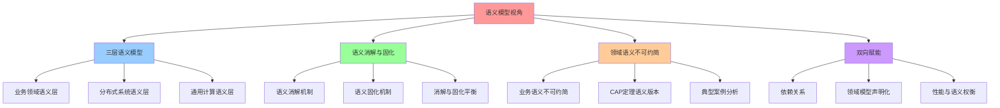
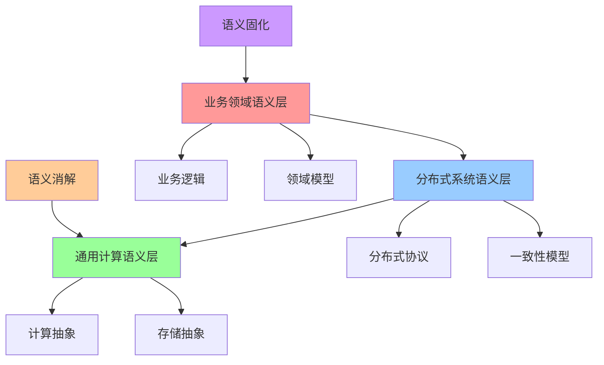
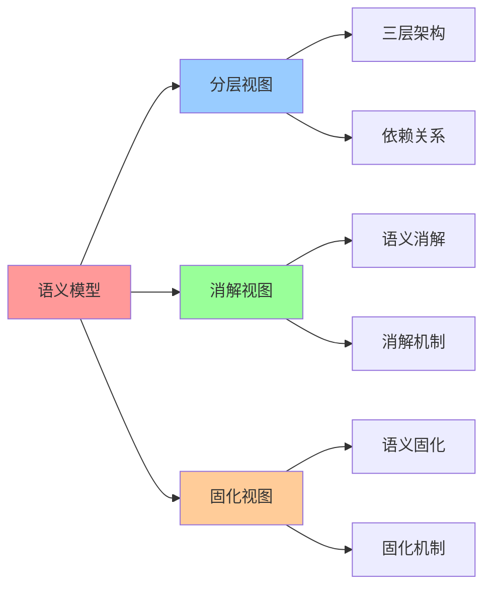

# 语义模型视角下的分布式系统分层抽象

**版本**：v1.0 **创建日期**：2025-11-08 **维护者**：项目团队

## 📑 目录

- [语义模型视角下的分布式系统分层抽象](#语义模型视角下的分布式系统分层抽象)
  - [📑 目录](#-目录)
  - [1 概述](#1-概述)
    - [1.1 核心思想](#11-核心思想)
    - [1.2 文档定位](#12-文档定位)
  - [2 三层语义模型架构](#2-三层语义模型架构)
    - [2.1 业务领域语义层](#21-业务领域语义层)
    - [2.2 分布式系统语义层](#22-分布式系统语义层)
    - [2.3 通用计算语义层](#23-通用计算语义层)
  - [3 语义消解与固化](#3-语义消解与固化)
    - [3.1 语义消解机制](#31-语义消解机制)
    - [3.2 语义固化机制](#32-语义固化机制)
    - [3.3 消解与固化的平衡](#33-消解与固化的平衡)
  - [4 领域语义的不可约简性](#4-领域语义的不可约简性)
    - [4.1 业务语义的不可约简性](#41-业务语义的不可约简性)
    - [4.2 CAP 定理的语义版本](#42-cap-定理的语义版本)
    - [4.3 典型案例分析](#43-典型案例分析)
  - [5 通用框架与领域模型的双向赋能](#5-通用框架与领域模型的双向赋能)
    - [5.1 依赖关系：从"承载"到"增强"](#51-依赖关系从承载到增强)
    - [5.2 典型模式：领域模型声明化](#52-典型模式领域模型声明化)
    - [5.3 性能与语义的权衡](#53-性能与语义的权衡)
  - [6 语义模型视角的实践应用](#6-语义模型视角的实践应用)
    - [6.1 架构设计原则](#61-架构设计原则)
    - [6.2 技术选型决策](#62-技术选型决策)
    - [6.3 最佳实践](#63-最佳实践)
  - [7 2025 年 11 月趋势](#7-2025-年-11-月趋势)
    - [7.1 技术趋势](#71-技术趋势)
    - [7.2 架构演进](#72-架构演进)
  - [8 总结](#8-总结)
  - [9 参考资源](#9-参考资源)
    - [9.1 Wikipedia 资源](#91-wikipedia-资源)
    - [9.2 技术文档](#92-技术文档)
    - [9.3 相关文档](#93-相关文档)
  - [10 🧠 认知增强：思维导图、建模视图与图表达转换](#10--认知增强思维导图建模视图与图表达转换)
    - [10.1 语义模型完整思维导图](#101-语义模型完整思维导图)
    - [10.2 语义模型建模视图](#102-语义模型建模视图)
      - [三层语义模型架构视图](#三层语义模型架构视图)
    - [10.3 语义模型多维关系矩阵](#103-语义模型多维关系矩阵)
      - [语义层-消解-固化映射矩阵](#语义层-消解-固化映射矩阵)
    - [10.4 图表达和转换](#104-图表达和转换)
      - [语义模型视图转换关系](#语义模型视图转换关系)
    - [10.5 形象化解释论证](#105-形象化解释论证)
      - [1. 三层语义模型 = 语言层级体系](#1-三层语义模型--语言层级体系)
      - [2. 语义消解 = 知识下沉过程](#2-语义消解--知识下沉过程)
      - [3. 领域语义不可约简 = 核心业务本质](#3-领域语义不可约简--核心业务本质)
    - [10.6 专家观点与论证](#106-专家观点与论证)
      - [计算信息软件科学家的观点](#计算信息软件科学家的观点)
        - [1. Eric Evans（领域驱动设计创始人）](#1-eric-evans领域驱动设计创始人)
        - [2. Martin Fowler（软件架构专家）](#2-martin-fowler软件架构专家)
      - [计算信息软件教育家的观点](#计算信息软件教育家的观点)
        - [1. Eric Evans（领域驱动设计教育家）](#1-eric-evans领域驱动设计教育家)
        - [2. Martin Fowler（软件架构教育家）](#2-martin-fowler软件架构教育家)
      - [计算信息软件认知学家的观点](#计算信息软件认知学家的观点)
        - [1. David Marr（计算认知科学家）](#1-david-marr计算认知科学家)
        - [2. Douglas Hofstadter（认知科学家）](#2-douglas-hofstadter认知科学家)
    - [10.7 认知学习路径矩阵](#107-认知学习路径矩阵)
    - [10.8 专家推荐阅读路径](#108-专家推荐阅读路径)

---

## 1 概述

本文档从**语义模型视角**系统阐述分布式系统的分层抽象，重点阐述三层语义模型架构、
语义消解与固化机制，以及领域语义的不可约简性。

### 1.1 核心思想

> **分布式系统的架构演进本质上是语义的持续消解与固化过程。通用能力下沉为基础设施
> ，领域语义顽固浮于顶层。可被消解的复杂性会无限趋近于零，而剩余的硬核复杂性则无
> 限收敛于业务本质。**

### 1.2 文档定位

- **目标读者**：架构师、技术决策者、分布式系统研究者
- **前置知识**：分布式系统、容器编排、领域驱动设计
- **关联文档**：
  - [`../02-semantic-model-perspective/01-three-layer-semantic-architecture.md`](../02-semantic-model-perspective/01-three-layer-semantic-architecture.md) -
    三层语义模型架构
  - [`../03-layered-disintegration-law/01-introduction.md`](../03-layered-disintegration-law/01-introduction.md) -
    分层消解律概述

---

## 2 三层语义模型架构

### 2.1 业务领域语义层

**业务领域语义层**：

```plaintext
┌────────────────────────────────────────────────────────┐
│ 层3：业务领域语义层 (业务逻辑/领域模型)                    │
│ 代码占比：10-20%  │ 不可替代性：★★★★★ (100%用户代码)    │
│ 示例：订单状态机、购物车、反欺诈模型                       │
└────────────────────────────────────────────────────────┘
```

**核心特征**：

- **职责**：业务逻辑、领域模型、业务规则
- **代码占比**：10-20%
- **不可替代性**：★★★★★（100%用户代码）
- **消解率**：0%（无法被消解）

### 2.2 分布式系统语义层

**分布式系统语义层**：

```plaintext
┌────────────────────────────────────────────────────────┐
│ 层2：分布式系统语义层 (服务发现/负载均衡/容错)             │
│ 代码占比：30-50%  │ 不可替代性：★☆☆☆☆ (80-95%被消解)    │
│ 示例：服务注册、健康检查、故障恢复                         │
└────────────────────────────────────────────────────────┘
```

**核心特征**：

- **职责**：服务发现、负载均衡、容错、一致性
- **代码占比**：30-50%
- **不可替代性**：★☆☆☆☆（80-95%被消解）
- **消解率**：80-95%（大部分被 K8s 消解）

### 2.3 通用计算语义层

**通用计算语义层**：

```plaintext
┌────────────────────────────────────────────────────────┐
│ 层1：通用计算语义层 (容器隔离/网络/存储)                   │
│ 代码占比：30-40%  │ 不可替代性：☆☆☆☆☆ (100%被消解)     │
│ 示例：容器隔离、网络配置、存储管理                         │
└────────────────────────────────────────────────────────┘
```

**核心特征**：

- **职责**：容器隔离、网络配置、存储管理
- **代码占比**：30-40%
- **不可替代性**：☆☆☆☆☆（100%被消解）
- **消解率**：100%（完全被 K8s 消解）

---

## 3 语义消解与固化

### 3.1 语义消解机制

**语义消解机制**：

- **通用能力下沉**：分布式系统的通用功能被容器编排框架**语义内化**
- **声明式配置**：从"如何实现分布式"到"想要什么状态"
- **自动化管理**：服务发现、负载均衡、容错、扩缩容被完全自动化

**消解率趋势**：

- **第一阶段**（显式分布式语义层）：消解率 ≈ 0%
- **第二阶段**（语义下沉至基础设施）：消解率 ≈ 80-95%
- **第三阶段**（领域语义的二次消解）：消解率 ≈ 95-99%

### 3.2 语义固化机制

**语义固化机制**：

- **领域语义顽固**：业务模型的**不变性规则、聚合边界、状态机**无法被通用框架消解
- **显式设计**：领域语义必须显性设计，无法被通用框架消解
- **业务规则**：业务规则是业务领域的核心知识，无法被通用框架消解

**固化率趋势**：

- **业务领域语义**：固化率 ≈ 100%（无法被消解）
- **分布式系统语义**：固化率 ≈ 5-20%（残留部分无法被消解）
- **通用计算语义**：固化率 ≈ 0%（完全被消解）

### 3.3 消解与固化的平衡

**消解与固化的平衡**：

```plaintext
消解率(Disintegration Rate) + 固化率(Solidification Rate) = 100%
```

**核心规律**：

- **通用能力**：消解率越高，固化率越低
- **领域语义**：消解率越低，固化率越高
- **平衡点**：消解率 ≈ 80-95%，固化率 ≈ 5-20%

---

## 4 领域语义的不可约简性

### 4.1 业务语义的不可约简性

**业务语义的不可约简性**：

- **第一性原理**：业务语义是业务领域的核心知识，无法被通用框架消解
- **不可约简性**：业务语义的不可约简性（Irreducibility）是业务领域的本质特征
- **硬核边界**：业务语义是架构中的硬核边界，无法被通用框架消解

### 4.2 CAP 定理的语义版本

**CAP 定理的语义版本**：

> **在分布式系统中，一致性（Consistency）、可用性（Availability）和领域语义
> （Domain Semantics）三者不可兼得，最多只能同时满足两个。**

**语义版本的核心规律**：

- **一致性 + 可用性**：损失领域语义（通用框架）
- **一致性 + 领域语义**：损失可用性（强一致性系统）
- **可用性 + 领域语义**：损失一致性（最终一致性系统）

### 4.3 典型案例分析

**典型案例：电商订单系统**：

- **订单状态机**：订单状态转换是业务领域的核心知识，无法被通用框架消解
- **购物车**：购物车状态同步是业务领域的核心知识，无法被通用框架消解
- **促销计算**：促销规则计算是业务领域的核心知识，无法被通用框架消解

---

## 5 通用框架与领域模型的双向赋能

### 5.1 依赖关系：从"承载"到"增强"

**依赖关系的演进**：

- **传统架构**：领域模型依赖通用框架（承载关系）
- **现代架构**：通用框架与领域模型双向赋能（增强关系）
- **未来架构**：领域模型通过 CRD/Operator 反向定义框架行为（反向定义）

### 5.2 典型模式：领域模型声明化

**领域模型声明化模式**：

- **声明式配置**：领域模型通过 YAML/JSON 声明式配置
- **CRD/Operator**：领域模型通过 CRD/Operator 反向定义框架行为
- **领域特定语言**：领域模型通过 DSL 表达业务语义

### 5.3 性能与语义的权衡

**性能与语义的权衡**：

- **通用性**：通用框架提供通用能力，但损失领域表达力
- **领域表达力**：领域模型提供领域表达力，但损失通用性
- **执行效率**：硬编码提供执行效率，但损失通用性和领域表达力

---

## 6 语义模型视角的实践应用

### 6.1 架构设计原则

**架构设计原则**：

1. **通用能力下沉**：将通用能力下沉为基础设施
2. **领域语义固化**：将领域语义固化为业务模型
3. **双向赋能**：通用框架与领域模型双向赋能
4. **收敛演进**：长期看，高频出现的领域模式将下沉为新一层通用语义

### 6.2 技术选型决策

**技术选型决策**：

- **通用框架**：选择通用框架（如 K8s）提供通用能力
- **领域模型**：选择领域模型（如 CRD/Operator）表达业务语义
- **权衡决策**：根据业务场景权衡通用性和领域表达力

### 6.3 最佳实践

**最佳实践**：

- **声明式配置**：使用声明式配置（如 YAML）表达领域模型
- **CRD/Operator**：使用 CRD/Operator 反向定义框架行为
- **领域特定语言**：使用 DSL 表达业务语义

---

## 7 2025 年 11 月趋势

### 7.1 技术趋势

**2025 年 11 月技术趋势**：

1. **领域语义的二次消解**：高频出现的领域模式下沉为新一层通用语义
2. **领域特定基础设施**：Dapr、Temporal、Knative 等将领域模式固化为基础设施
3. **零开销抽象**：通过 WebAssembly 模块或 eBPF 程序将领域语义编译注入至内核/运
   行时

### 7.2 架构演进

**架构演进方向**：

1. **语义栈收敛**：领域语义与通用框架的零开销融合
2. **领域专用运行时**：领域专用运行时（Domain-Specific Runtime）
3. **架构终局**：语义栈收敛，领域语义与通用框架的零开销融合

---

## 8 总结

**语义模型视角的核心结论**：

1. **三层语义模型架构**：业务领域语义层、分布式系统语义层、通用计算语义层
2. **语义消解与固化**：通用能力下沉为基础设施，领域语义顽固浮于顶层
3. **领域语义的不可约简性**：业务语义的不可约简性是业务领域的本质特征
4. **双向赋能**：通用框架与领域模型双向赋能，形成"领域特定基础设施"（DSI）

---

## 9 参考资源

### 9.1 Wikipedia 资源

- [Domain-driven design](https://en.wikipedia.org/wiki/Domain-driven_design) -
  领域驱动设计
- [Layered architecture](https://en.wikipedia.org/wiki/Layered_architecture) -
  分层架构
- [Abstraction (computer science)](<https://en.wikipedia.org/wiki/Abstraction_(computer_science)>) -
  抽象

### 9.2 技术文档

- [Kubernetes Documentation](https://kubernetes.io/docs/) - Kubernetes 官方文档
- [Dapr Documentation](https://docs.dapr.io/) - Dapr 官方文档
- [Temporal Documentation](https://docs.temporal.io/) - Temporal 官方文档

### 9.3 相关文档

- [`../02-semantic-model-perspective/01-three-layer-semantic-architecture.md`](../02-semantic-model-perspective/01-three-layer-semantic-architecture.md) -
  三层语义模型架构
- [`../02-semantic-model-perspective/02-irreducibility-of-domain-semantics.md`](../02-semantic-model-perspective/02-irreducibility-of-domain-semantics.md) -
  领域语义无法通用化的本质原因
- [`../03-layered-disintegration-law/01-introduction.md`](../03-layered-disintegration-law/01-introduction.md) -
  分层消解律概述

---

## 10 🧠 认知增强：思维导图、建模视图与图表达转换

### 10.1 语义模型完整思维导图



### 10.2 语义模型建模视图

#### 三层语义模型架构视图



### 10.3 语义模型多维关系矩阵

#### 语义层-消解-固化映射矩阵

| 语义层 | 业务领域 | 分布式系统 | 通用计算 | 消解机制 | 固化机制 | 认知价值 |
|-------|---------|-----------|---------|---------|---------|---------|
| **业务领域** | ✅ 核心 | ❌ 无 | ❌ 无 | 语义下沉 | 语义固化 | 业务理解 |
| **分布式系统** | ⚠️ 承载 | ✅ 核心 | ⚠️ 依赖 | 协议消解 | 协议固化 | 分布式理解 |
| **通用计算** | ⚠️ 承载 | ⚠️ 承载 | ✅ 核心 | 抽象消解 | 抽象固化 | 计算理解 |
| **语义演进** | ⚠️ 不可约简 | ⚠️ 部分消解 | ✅ 完全消解 | 持续消解 | 持续固化 | 演进理解 |

### 10.4 图表达和转换

#### 语义模型视图转换关系



### 10.5 形象化解释论证

#### 1. 三层语义模型 = 语言层级体系

> **类比**：三层语义模型就像语言层级体系，业务领域语义层是"专业术语"（业务语言），分布式系统语义层是"通用语言"（系统语言），通用计算语义层是"基础语言"（计算语言），就像语言层级体系通过术语、通用、基础组织语言一样，三层语义模型通过业务、系统、计算组织语义。

**认知价值**：

- **层级理解**：通过语言层级体系类比，理解三层语义模型的层级性
- **术语理解**：通过专业术语类比，理解业务领域语义层的术语性
- **基础理解**：通过基础语言类比，理解通用计算语义层的基础性

#### 2. 语义消解 = 知识下沉过程

> **类比**：语义消解就像知识下沉过程，业务语义下沉到系统语义是"知识抽象"（业务抽象），系统语义下沉到计算语义是"知识泛化"（系统泛化），就像知识下沉过程通过抽象、泛化组织下沉一样，语义消解通过业务抽象、系统泛化组织消解。

**认知价值**：

- **下沉理解**：通过知识下沉过程类比，理解语义消解的下沉性
- **抽象理解**：通过知识抽象类比，理解业务抽象抽象性
- **泛化理解**：通过知识泛化类比，理解系统泛化的泛化性

#### 3. 领域语义不可约简 = 核心业务本质

> **类比**：领域语义不可约简就像核心业务本质，业务语义是"业务核心"（业务本质），不能消解到系统语义是"本质不可约简"（本质保留），就像核心业务本质通过核心、本质组织本质一样，领域语义不可约简通过业务核心、本质保留组织不可约简。

**认知价值**：

- **本质理解**：通过核心业务本质类比，理解领域语义不可约简的本质性
- **核心理解**：通过业务核心类比，理解业务语义的核心性
- **保留理解**：通过本质保留类比，理解不可约简的保留性

### 10.6 专家观点与论证

#### 计算信息软件科学家的观点

##### 1. Eric Evans（领域驱动设计创始人）

> "Domain semantics are irreducible. Understanding domain semantics helps us understand the essence of business logic."

**在语义模型中的应用**：

- **本质理解**：领域语义不可约简
- **业务理解**：理解业务逻辑的本质
- **语义理解**：理解领域语义的价值

##### 2. Martin Fowler（软件架构专家）

> "Semantic models provide a way to understand system architecture. Understanding semantic models helps us build better systems."

**在语义模型中的应用**：

- **架构理解**：语义模型提供理解系统架构的方法
- **系统理解**：理解如何构建更好的系统
- **模型理解**：理解语义模型的价值

#### 计算信息软件教育家的观点

##### 1. Eric Evans（领域驱动设计教育家）

> "Teaching semantic models helps students understand that business semantics are irreducible. This is essential for understanding domain-driven design."

**教育价值**：

- **不可约简理解**：业务语义不可约简
- **设计理解**：学习领域驱动设计的基础
- **语义理解**：理解业务语义的价值

##### 2. Martin Fowler（软件架构教育家）

> "Semantic models provide a way to understand layered abstraction. This helps students understand how systems are structured."

**教育价值**：

- **抽象理解**：语义模型提供理解分层抽象的方法
- **结构理解**：帮助学生理解系统结构
- **系统学习**：学习系统结构的方法

#### 计算信息软件认知学家的观点

##### 1. David Marr（计算认知科学家）

> "Understanding semantic models requires understanding them at multiple levels: business semantics, system semantics, and computational semantics."

**认知价值**：

- **多层次理解**：理解语义模型需要多层次理解
- **业务理解**：理解业务语义
- **系统理解**：理解系统语义

##### 2. Douglas Hofstadter（认知科学家）

> "Semantic models are cognitive tools that help us organize and understand system architecture. They provide a structured way to think about system design."

**认知价值**：

- **认知工具**：语义模型是组织信息的认知工具
- **架构理解**：通过语义模型理解系统架构
- **结构理解**：语义模型提供结构化的思维方式

### 10.7 认知学习路径矩阵

| 学习阶段 | 核心内容 | 形象化理解 | 技术理解 | 实践应用 | 认知目标 |
|---------|---------|-----------|---------|---------|---------|
| **入门** | 语义模型概念 | 语言层级体系类比 | 语义模型定义 | 简单模型 | 建立基础 |
| **进阶** | 三层架构 | 三层架构技术 | 分层抽象 | 架构设计 | 理解架构 |
| **高级** | 语义消解 | 知识下沉过程类比 | 消解机制 | 系统设计 | 掌握消解 |
| **专家** | 不可约简 | 核心业务本质类比 | 不可约简理论 | 领域设计 | 掌握不可约简 |

### 10.8 专家推荐阅读路径

**计算信息软件科学家推荐路径**：

1. **三层架构**：理解业务领域、分布式系统、通用计算三层语义模型
2. **语义消解**：掌握语义消解机制和固化机制
3. **不可约简**：理解领域语义的不可约简性和CAP定理语义版本
4. **双向赋能**：学习通用框架与领域模型的双向赋能

**计算信息软件教育家推荐路径**：

1. **形象化理解**：通过语言层级体系、知识下沉过程、核心业务本质等类比，建立直观理解
2. **渐进学习**：从简单语义模型概念开始，逐步学习复杂不可约简理论
3. **实践结合**：结合实际项目，理解语义模型的应用
4. **思维训练**：通过语义模型学习，训练系统性思维能力

**计算信息软件认知学家推荐路径**：

1. **认知模式**：识别语义模型中的认知模式
2. **结构理解**：理解语义模型揭示的系统结构
3. **跨域应用**：将语义模型思维应用到其他领域
4. **认知提升**：通过语义模型学习，提升认知能力

---

**最后更新：2025-11-15 **维护者**：项目团队
