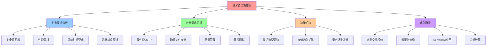
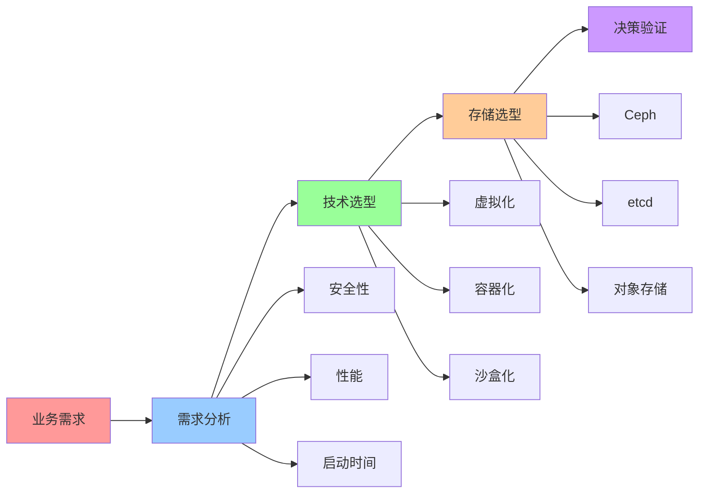
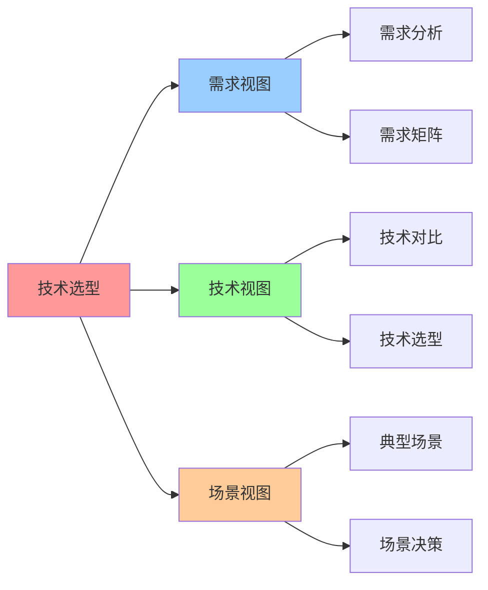

# 技术选型决策树

**版本**：v1.0 **创建日期**：2025-11-08 **维护者**：项目团队

## 📑 目录

- [技术选型决策树](#技术选型决策树)
  - [📑 目录](#-目录)
  - [1 概述](#1-概述)
    - [1.1 核心思想](#11-核心思想)
    - [1.2 文档定位](#12-文档定位)
  - [2 业务需求分析](#2-业务需求分析)
    - [2.1 安全性要求](#21-安全性要求)
      - [2.1.1 极高安全性](#211-极高安全性)
      - [2.1.2 中等安全性](#212-中等安全性)
      - [2.1.3 低安全性](#213-低安全性)
    - [2.2 性能要求](#22-性能要求)
      - [2.2.1 极高性能](#221-极高性能)
      - [2.2.2 中等性能](#222-中等性能)
      - [2.2.3 低性能](#223-低性能)
    - [2.3 启动时间要求](#23-启动时间要求)
      - [2.3.1 极低启动时间](#231-极低启动时间)
      - [2.3.2 中等启动时间](#232-中等启动时间)
      - [2.3.3 低启动时间](#233-低启动时间)
    - [2.4 迭代速度要求](#24-迭代速度要求)
      - [2.4.1 快速迭代](#241-快速迭代)
      - [2.4.2 中等迭代](#242-中等迭代)
      - [2.4.3 慢速迭代](#243-慢速迭代)
  - [3 存储需求分析](#3-存储需求分析)
    - [3.1 高性能 OLTP](#31-高性能-oltp)
    - [3.2 海量文件存储](#32-海量文件存储)
    - [3.3 配置管理](#33-配置管理)
    - [3.4 开发测试](#34-开发测试)
  - [4 决策矩阵](#4-决策矩阵)
    - [4.1 技术选型矩阵](#41-技术选型矩阵)
    - [4.2 存储选型矩阵](#42-存储选型矩阵)
    - [4.3 混合场景决策](#43-混合场景决策)
  - [5 典型场景决策树](#5-典型场景决策树)
    - [5.1 金融交易系统](#51-金融交易系统)
    - [5.2 微服务架构](#52-微服务架构)
    - [5.3 Serverless 应用](#53-serverless-应用)
    - [5.4 边缘计算](#54-边缘计算)
    - [5.5 多租户云](#55-多租户云)
    - [5.6 CI/CD 流水线](#56-cicd-流水线)
    - [5.7 插件系统](#57-插件系统)
  - [6 2025 年 11 月趋势](#6-2025-年-11-月趋势)
    - [6.1 技术选型趋势](#61-技术选型趋势)
    - [6.2 存储选型趋势](#62-存储选型趋势)
  - [7 总结](#7-总结)
  - [8 参考资源](#8-参考资源)
    - [8.1 Wikipedia 资源](#81-wikipedia-资源)
    - [8.2 技术文档](#82-技术文档)
    - [8.3 相关文档](#83-相关文档)
  - [9 🧠 认知增强：思维导图、建模视图与图表达转换](#9--认知增强思维导图建模视图与图表达转换)
    - [9.1 技术选型决策树完整思维导图](#91-技术选型决策树完整思维导图)
    - [9.2 技术选型决策树建模视图](#92-技术选型决策树建模视图)
      - [技术选型决策流程视图](#技术选型决策流程视图)
    - [9.3 技术选型决策树多维关系矩阵](#93-技术选型决策树多维关系矩阵)
      - [需求-技术-场景映射矩阵](#需求-技术-场景映射矩阵)
    - [9.4 图表达和转换](#94-图表达和转换)
      - [技术选型决策树视图转换关系](#技术选型决策树视图转换关系)
    - [9.5 形象化解释论证](#95-形象化解释论证)
      - [1. 技术选型决策树 = 导航系统](#1-技术选型决策树--导航系统)
      - [2. 需求分析 = 需求分解过程](#2-需求分析--需求分解过程)
      - [3. 技术选型 = 工具选择过程](#3-技术选型--工具选择过程)
    - [9.6 专家观点与论证](#96-专家观点与论证)
      - [计算信息软件科学家的观点](#计算信息软件科学家的观点)
        - [1. Martin Fowler（软件架构专家）](#1-martin-fowler软件架构专家)
        - [2. Kelsey Hightower（Kubernetes专家）](#2-kelsey-hightowerkubernetes专家)
      - [计算信息软件教育家的观点](#计算信息软件教育家的观点)
        - [1. Martin Fowler（软件架构教育家）](#1-martin-fowler软件架构教育家)
        - [2. Kelsey Hightower（Kubernetes教育家）](#2-kelsey-hightowerkubernetes教育家)
      - [计算信息软件认知学家的观点](#计算信息软件认知学家的观点)
        - [1. David Marr（计算认知科学家）](#1-david-marr计算认知科学家)
        - [2. Douglas Hofstadter（认知科学家）](#2-douglas-hofstadter认知科学家)
    - [9.7 认知学习路径矩阵](#97-认知学习路径矩阵)
    - [9.8 专家推荐阅读路径](#98-专家推荐阅读路径)

---

## 1 概述

本文档从**领域架构和语义模型视角**系统分析技术选型决策树，为不同业务场景提供技术
选型指导，重点阐述业务需求分析、存储需求分析、决策矩阵和典型场景决策树。

### 1.1 核心思想

> **技术选型应遵循"场景驱动、性能优先、安全兼顾"三大原则。通过业务需求分析、存储
> 需求分析和决策矩阵，为不同场景选择最适合的技术方案。**

### 1.2 文档定位

- **目标读者**：架构师、技术决策者、DevOps 工程师
- **前置知识**：虚拟化、容器化、沙盒化、分布式存储
- **关联文档**：
  - [`01-technology-essence.md`](01-technology-essence.md) - 技术本质与演进趋势
  - [`03-distributed-storage.md`](03-distributed-storage.md) - 分布式存储系统架
    构

---

## 2 业务需求分析

### 2.1 安全性要求

#### 2.1.1 极高安全性

**适用场景**：金融交易、多租户云、医疗系统。

**推荐方案**：**虚拟化（KubeVirt/QEMU/KVM）**

**理由**：

- **独立内核**：每个虚拟机有独立内核，隔离强度最高
- **强隔离**：硬件级抽象，攻击面最小
- **合规要求**：满足金融、医疗等强合规场景

**典型实现**：

- **KubeVirt**：Kubernetes 原生虚拟化
- **QEMU/KVM**：传统虚拟化方案
- **Firecracker**：AWS 微虚拟机，专为 Serverless 优化

#### 2.1.2 中等安全性

**适用场景**：微服务、API 服务、Web 应用。

**推荐方案**：**容器化（Docker/Kubernetes）**

**理由**：

- **进程级隔离**：共享内核，但进程隔离
- **安全加固**：SELinux、AppArmor、Seccomp 增强安全性
- **性能优势**：接近原生性能，启动快速

**典型实现**：

- **Docker**：容器运行时
- **Kubernetes**：容器编排
- **containerd**：OCI 兼容运行时

#### 2.1.3 低安全性

**适用场景**：开发测试、CI/CD、内部工具。

**推荐方案**：**容器化（Docker）**

**理由**：

- **快速部署**：秒级启动，快速迭代
- **资源效率**：低资源占用，适合开发环境
- **简单管理**：无需复杂安全配置

### 2.2 性能要求

#### 2.2.1 极高性能

**适用场景**：高频交易、实时计算、数据库。

**推荐方案**：**容器化（Docker/Kubernetes）+ 硬件加速**

**理由**：

- **接近原生性能**：<5% 性能损失
- **硬件加速**：DPU、GPU、FPGA 加速
- **资源隔离**：CPU、内存、网络资源隔离

**典型实现**：

- **Kubernetes + DPU**：网络、存储卸载
- **Kubernetes + GPU**：AI/ML 训练、推理
- **Kubernetes + FPGA**：定制算法加速

#### 2.2.2 中等性能

**适用场景**：Web 应用、API 服务、微服务。

**推荐方案**：**容器化（Docker/Kubernetes）**

**理由**：

- **性能足够**：<5% 性能损失，满足大多数场景
- **资源效率**：低资源占用，高资源利用率
- **易于管理**：Kubernetes 统一管理

#### 2.2.3 低性能

**适用场景**：批处理、数据分析、离线任务。

**推荐方案**：**容器化（Docker/Kubernetes）**

**理由**：

- **成本优先**：低资源占用，降低成本
- **弹性扩展**：按需扩展，资源利用率高
- **易于管理**：Kubernetes 统一管理

### 2.3 启动时间要求

#### 2.3.1 极低启动时间

**适用场景**：Serverless、边缘计算、插件系统。

**推荐方案**：**沙盒化（WasmEdge/Firecracker）**

**理由**：

- **毫秒级启动**：<1ms（WasmEdge），<125ms（Firecracker）
- **低资源占用**：<1MB（WasmEdge），<5MB（Firecracker）
- **安全隔离**：系统调用过滤，强隔离

**典型实现**：

- **WasmEdge**：CNCF 项目，高性能 WebAssembly 运行时
- **Firecracker**：AWS 微虚拟机，专为 Serverless 优化
- **gVisor**：Google 用户态内核

#### 2.3.2 中等启动时间

**适用场景**：微服务、API 服务、Web 应用。

**推荐方案**：**容器化（Docker/Kubernetes）**

**理由**：

- **秒级启动**：<10s，满足大多数场景
- **资源效率**：低资源占用，高资源利用率
- **易于管理**：Kubernetes 统一管理

#### 2.3.3 低启动时间

**适用场景**：批处理、数据分析、离线任务。

**推荐方案**：**容器化（Docker/Kubernetes）或虚拟化（KubeVirt）**

**理由**：

- **启动时间不敏感**：分钟级启动可接受
- **资源效率**：容器化优先，虚拟化备选
- **易于管理**：Kubernetes 统一管理

### 2.4 迭代速度要求

#### 2.4.1 快速迭代

**适用场景**：微服务、DevOps、敏捷开发。

**推荐方案**：**容器化（Docker/Kubernetes）**

**理由**：

- **快速部署**：秒级启动，快速迭代
- **CI/CD 集成**：与 Jenkins、GitLab CI 无缝集成
- **版本管理**：镜像版本管理，快速回滚

**典型实现**：

- **Docker**：容器运行时
- **Kubernetes**：容器编排
- **Helm**：应用包管理

#### 2.4.2 中等迭代

**适用场景**：传统应用、企业应用。

**推荐方案**：**容器化（Docker/Kubernetes）或虚拟化（KubeVirt）**

**理由**：

- **部署速度**：容器化优先，虚拟化备选
- **版本管理**：镜像版本管理，支持回滚
- **易于管理**：Kubernetes 统一管理

#### 2.4.3 慢速迭代

**适用场景**：遗留系统、传统应用。

**推荐方案**：**虚拟化（KubeVirt/QEMU/KVM）**

**理由**：

- **兼容性**：支持传统应用，无需改造
- **稳定性**：成熟技术，稳定可靠
- **易于管理**：Kubernetes 统一管理

---

## 3 存储需求分析

### 3.1 高性能 OLTP

**适用场景**：数据库、高频交易、实时计算。

**推荐方案**：**Ceph RBD + NVMe**

**理由**：

- **高性能**：4K 随机 IOPS 50 万+，延迟<5ms
- **强一致性**：RBD 提供强一致性保证
- **动态扩展**：支持在线扩容

**典型实现**：

- **Ceph RBD**：分布式块存储
- **NVMe SSD**：高性能存储介质
- **RDMA**：低延迟网络

### 3.2 海量文件存储

**适用场景**：文件共享、对象存储、大数据。

**推荐方案**：**CephFS/GlusterFS**

**理由**：

- **高扩展性**：PB 级扩展，支持海量文件
- **高并发**：支持高并发读写
- **易于管理**：Kubernetes CSI 驱动

**典型实现**：

- **CephFS**：分布式文件系统
- **GlusterFS**：分布式文件系统
- **MinIO**：对象存储

### 3.3 配置管理

**适用场景**：Kubernetes 配置、服务发现、协调服务。

**推荐方案**：**etcd**

**理由**：

- **强一致性**：Raft 协议保证强一致性
- **高性能**：写入 10,000/s，读取 100,000+/s
- **Kubernetes 原生**：Kubernetes 核心存储

**典型实现**：

- **etcd**：分布式键值存储
- **Consul**：服务发现和配置管理
- **ZooKeeper**：协调服务

### 3.4 开发测试

**适用场景**：开发环境、测试环境、CI/CD。

**推荐方案**：**本地存储/EmptyDir**

**理由**：

- **简单快速**：无需复杂配置，快速部署
- **成本低**：本地存储，无需额外成本
- **易于管理**：Kubernetes 原生支持

**典型实现**：

- **EmptyDir**：临时存储
- **HostPath**：本地路径挂载
- **Local PV**：本地持久化存储

---

## 4 决策矩阵

### 4.1 技术选型矩阵

| 场景           | 安全性要求 | 性能要求 | 启动时间要求 | 推荐方案                   |
| -------------- | ---------- | -------- | ------------ | -------------------------- |
| **金融交易**   | 极高       | 高       | 中           | 虚拟化（KubeVirt）         |
| **微服务**     | 中         | 高       | 低           | 容器化（Docker/K8s）       |
| **Serverless** | 中         | 中       | 极低         | 沙盒化（Firecracker/Wasm） |
| **边缘计算**   | 中         | 中       | 低           | 容器化（K3s）+ Wasm        |
| **多租户云**   | 极高       | 高       | 中           | 虚拟化（QEMU/KVM）         |
| **CI/CD**      | 低         | 中       | 低           | 容器化（Docker）           |
| **插件系统**   | 高         | 中       | 极低         | 沙盒化（WasmEdge）         |

### 4.2 存储选型矩阵

| 场景            | 数据持久性 | 性能要求 | 扩展性要求 | 推荐方案               |
| --------------- | ---------- | -------- | ---------- | ---------------------- |
| **高性能 OLTP** | 高         | 极高     | 中         | Ceph RBD + NVMe        |
| **海量文件**    | 高         | 中       | 极高       | CephFS/GlusterFS       |
| **配置管理**    | 高         | 高       | 中         | etcd                   |
| **开发测试**    | 低         | 中       | 低         | 本地存储/EmptyDir      |
| **对象存储**    | 高         | 中       | 极高       | MinIO/S3               |
| **冷数据归档**  | 高         | 低       | 极高       | 对象存储（S3 Glacier） |

### 4.3 混合场景决策

**混合场景**：需要同时满足多个需求。

**推荐方案**：**Kata Containers + Kubernetes**

**理由**：

- **VM 级隔离**：Kata Containers 提供 VM 级隔离
- **容器速度**：接近容器启动速度
- **Kubernetes 集成**：无缝集成 Kubernetes

**典型实现**：

- **Kata Containers**：VM 级隔离的容器运行时
- **Kubernetes**：容器编排
- **gVisor**：用户态内核，系统调用过滤

---

## 5 典型场景决策树

### 5.1 金融交易系统

```text
金融交易系统
  │
  ├─> 安全性要求极高? → 虚拟化（KubeVirt）
  │     │
  │     ├─> 性能要求高? → KubeVirt + DPU 加速
  │     │
  │     └─> 性能要求中? → KubeVirt + 标准配置
  │
  └─> 存储需求
        │
        ├─> 高性能OLTP? → Ceph RBD + NVMe
        │
        └─> 配置管理? → etcd
```

**推荐方案**：

- **运行时**：KubeVirt（虚拟化）
- **存储**：Ceph RBD + NVMe（高性能 OLTP）
- **配置**：etcd（配置管理）

### 5.2 微服务架构

```text
微服务架构
  │
  ├─> 安全性要求中? → 容器化（Docker/K8s）
  │     │
  │     ├─> 快速迭代? → Docker + Kubernetes + Helm
  │     │
  │     └─> 性能要求高? → Kubernetes + DPU 加速
  │
  └─> 存储需求
        │
        ├─> 有状态服务? → Ceph RBD + NVMe
        │
        └─> 无状态服务? → EmptyDir/本地存储
```

**推荐方案**：

- **运行时**：Docker + Kubernetes（容器化）
- **存储**：Ceph RBD + NVMe（有状态服务）
- **配置**：etcd（配置管理）

### 5.3 Serverless 应用

```text
Serverless 应用
  │
  ├─> 启动时间要求极低? → 沙盒化（Firecracker/Wasm）
  │     │
  │     ├─> 安全性要求高? → WasmEdge（WebAssembly）
  │     │
  │     └─> 安全性要求中? → Firecracker（微虚拟机）
  │
  └─> 存储需求
        │
        ├─> 有状态服务? → 对象存储（S3）
        │
        └─> 无状态服务? → EmptyDir/临时存储
```

**推荐方案**：

- **运行时**：WasmEdge（WebAssembly）或 Firecracker（微虚拟机）
- **存储**：对象存储（S3）（有状态服务）
- **配置**：etcd（配置管理）

### 5.4 边缘计算

```text
边缘计算
  │
  ├─> 轻量级要求? → K3s + WasmEdge
  │     │
  │     ├─> 资源受限? → WasmEdge（WebAssembly）
  │     │
  │     └─> 资源充足? → K3s（轻量级 Kubernetes）
  │
  └─> 存储需求
        │
        ├─> 本地存储? → Local PV
        │
        └─> 云端同步? → 对象存储（S3）
```

**推荐方案**：

- **运行时**：K3s + WasmEdge（轻量级边缘集群）
- **存储**：Local PV（本地存储）
- **配置**：etcd（配置管理）

### 5.5 多租户云

```text
多租户云
  │
  ├─> 安全性要求极高? → 虚拟化（QEMU/KVM）
  │     │
  │     ├─> Kubernetes 集成? → KubeVirt
  │     │
  │     └─> 传统虚拟化? → QEMU/KVM
  │
  └─> 存储需求
        │
        ├─> 高性能OLTP? → Ceph RBD + NVMe
        │
        └─> 海量文件? → CephFS/GlusterFS
```

**推荐方案**：

- **运行时**：KubeVirt（虚拟化）
- **存储**：Ceph RBD + NVMe（高性能 OLTP）或 CephFS（海量文件）
- **配置**：etcd（配置管理）

### 5.6 CI/CD 流水线

```text
CI/CD 流水线
  │
  ├─> 安全性要求低? → 容器化（Docker）
  │     │
  │     ├─> 快速迭代? → Docker + Kubernetes
  │     │
  │     └─> 简单部署? → Docker Compose
  │
  └─> 存储需求
        │
        ├─> 构建缓存? → 本地存储/EmptyDir
        │
        └─> 构建产物? → 对象存储（S3）
```

**推荐方案**：

- **运行时**：Docker + Kubernetes（容器化）
- **存储**：本地存储/EmptyDir（构建缓存）或对象存储（S3）（构建产物）
- **配置**：etcd（配置管理）

### 5.7 插件系统

```text
插件系统
  │
  ├─> 安全性要求高? → 沙盒化（WasmEdge）
  │     │
  │     ├─> 启动时间要求极低? → WasmEdge（WebAssembly）
  │     │
  │     └─> 安全性要求极高? → gVisor（用户态内核）
  │
  └─> 存储需求
        │
        ├─> 插件配置? → etcd
        │
        └─> 插件数据? → 对象存储（S3）
```

**推荐方案**：

- **运行时**：WasmEdge（WebAssembly）或 gVisor（用户态内核）
- **存储**：etcd（插件配置）或对象存储（S3）（插件数据）
- **配置**：etcd（配置管理）

---

## 6 2025 年 11 月趋势

### 6.1 技术选型趋势

**2025 年 11 月技术选型趋势**：

1. **WebAssembly 运行时**：WasmEdge、Wasmtime 成为 Serverless 和边缘计算首选
2. **轻量级虚拟机**：Firecracker、Kata Containers 在安全性和性能之间取得平衡
3. **多运行时支持**：Kubernetes 支持多种容器运行时，满足不同场景需求

### 6.2 存储选型趋势

**2025 年 11 月存储选型趋势**：

1. **存算分离**：CXL 总线打破存储墙，实现存算一体架构
2. **DPU 加速**：NVIDIA BlueField DPU 卸载存储处理，提升性能
3. **智能调度**：基于节点存储容量和性能自动选择存储类

---

## 7 总结

**技术选型决策树核心原则**：

1. **场景驱动**：根据业务场景选择最适合的技术方案
2. **性能优先**：在满足安全性的前提下，优先考虑性能
3. **安全兼顾**：在满足性能的前提下，兼顾安全性

**典型场景推荐**：

- **金融交易**：虚拟化（KubeVirt）+ Ceph RBD + NVMe
- **微服务**：容器化（Docker/K8s）+ Ceph RBD + NVMe
- **Serverless**：沙盒化（WasmEdge/Firecracker）+ 对象存储（S3）
- **边缘计算**：K3s + WasmEdge + Local PV
- **多租户云**：虚拟化（KubeVirt）+ Ceph RBD/FS
- **CI/CD**：容器化（Docker）+ 本地存储/对象存储
- **插件系统**：沙盒化（WasmEdge/gVisor）+ etcd/对象存储

**2025 年 11 月趋势**：

- **WebAssembly 运行时**：成为 Serverless 和边缘计算首选
- **轻量级虚拟机**：在安全性和性能之间取得平衡
- **存算一体架构**：CXL 总线打破存储墙，实现存算一体

---

## 8 参考资源

### 8.1 Wikipedia 资源

- [Virtualization](https://en.wikipedia.org/wiki/Virtualization)
- [OS-level virtualization](https://en.wikipedia.org/wiki/OS-level_virtualization)
- [Sandbox (computer security)](<https://en.wikipedia.org/wiki/Sandbox_(computer_security)>)
- [Distributed data store](https://en.wikipedia.org/wiki/Distributed_data_store)

### 8.2 技术文档

- [Kubernetes Documentation](https://kubernetes.io/docs/)
- [Docker Documentation](https://docs.docker.com/)
- [Ceph Documentation](https://docs.ceph.com/)
- [WasmEdge Documentation](https://wasmedge.org/)

### 8.3 相关文档

- [`01-technology-essence.md`](01-technology-essence.md) - 技术本质与演进趋势
- [`03-distributed-storage.md`](03-distributed-storage.md) - 分布式存储系统架构
- [`04-cloud-native-best-practices.md`](04-cloud-native-best-practices.md) - 云
  原生最佳实践
- [`05-challenges-future-trends.md`](05-challenges-future-trends.md) - 挑战与未
  来趋势
- [`../04-domain-case-studies/`](../04-domain-case-studies/) - 领域案例分析
  （Spark、Argo、Temporal、Ceph、Flink、Kafka 等）
- [`../03-layered-disintegration-law/01-introduction.md`](../03-layered-disintegration-law/01-introduction.md) -
  分层消解律概述

---

## 9 🧠 认知增强：思维导图、建模视图与图表达转换

### 9.1 技术选型决策树完整思维导图



### 9.2 技术选型决策树建模视图

#### 技术选型决策流程视图



### 9.3 技术选型决策树多维关系矩阵

#### 需求-技术-场景映射矩阵

| 需求 | 安全性 | 性能 | 启动时间 | 技术方案 | 适用场景 | 认知价值 |
|-----|--------|------|---------|---------|---------|---------|
| **极高安全性** | ✅ 核心 | ⚠️ 次要 | ⚠️ 次要 | 虚拟化 | 金融交易 | 安全理解 |
| **极高性能** | ⚠️ 次要 | ✅ 核心 | ⚠️ 次要 | 容器化+DPU | 高性能计算 | 性能理解 |
| **极低启动时间** | ⚠️ 次要 | ⚠️ 次要 | ✅ 核心 | 沙盒化 | Serverless | 启动理解 |
| **综合需求** | ⚠️ 平衡 | ⚠️ 平衡 | ⚠️ 平衡 | 混合方案 | 综合场景 | 综合理解 |

### 9.4 图表达和转换

#### 技术选型决策树视图转换关系



### 9.5 形象化解释论证

#### 1. 技术选型决策树 = 导航系统

> **类比**：技术选型决策树就像导航系统，业务需求是"目的地"（目标需求），技术方案是"路线选择"（技术路线），决策树是"导航路径"（决策路径），就像导航系统通过目的地、路线、路径组织导航一样，技术选型决策树通过需求、方案、路径组织选型。

**认知价值**：

- **导航理解**：通过导航系统类比，理解技术选型决策树的导航性
- **目标理解**：通过目的地类比，理解业务需求的目标性
- **路径理解**：通过导航路径类比，理解决策树的路径性

#### 2. 需求分析 = 需求分解过程

> **类比**：需求分析就像需求分解过程，安全性是"安全需求"（安全分解），性能是"性能需求"（性能分解），启动时间是"时间需求"（时间分解），就像需求分解过程通过安全、性能、时间组织分解一样，需求分析通过安全性、性能、启动时间组织分析。

**认知价值**：

- **分解理解**：通过需求分解过程类比，理解需求分析的分解性
- **安全理解**：通过安全需求类比，理解安全性的安全性
- **性能理解**：通过性能需求类比，理解性能的性能性

#### 3. 技术选型 = 工具选择过程

> **类比**：技术选型就像工具选择过程，虚拟化是"重型工具"（高隔离），容器化是"中型工具"（中隔离），沙盒化是"轻型工具"（低隔离），就像工具选择过程通过重型、中型、轻型组织选择一样，技术选型通过虚拟化、容器化、沙盒化组织选型。

**认知价值**：

- **选择理解**：通过工具选择过程类比，理解技术选型的选择性
- **工具理解**：通过工具类比，理解技术的工具性
- **隔离理解**：通过隔离类比，理解技术的隔离性

### 9.6 专家观点与论证

#### 计算信息软件科学家的观点

##### 1. Martin Fowler（软件架构专家）

> "Technology selection is about matching technology to requirements. Understanding technology selection helps us make informed decisions."

**在技术选型中的应用**：

- **匹配理解**：技术选型是关于匹配技术和需求
- **决策理解**：理解如何做出明智决策
- **选型理解**：理解技术选型的价值

##### 2. Kelsey Hightower（Kubernetes专家）

> "Technology selection decision trees provide a structured way to choose technologies. Understanding decision trees helps us navigate complex choices."

**在技术选型中的应用**：

- **结构化理解**：技术选型决策树提供结构化的选择方法
- **导航理解**：理解如何导航复杂选择
- **决策理解**：理解决策树的价值

#### 计算信息软件教育家的观点

##### 1. Martin Fowler（软件架构教育家）

> "Teaching technology selection helps students understand that technology choices should be driven by requirements. This is essential for understanding system design."

**教育价值**：

- **需求驱动理解**：技术选择应该由需求驱动
- **设计理解**：学习系统设计的基础
- **选择理解**：理解技术选择的方法

##### 2. Kelsey Hightower（Kubernetes教育家）

> "Technology selection decision trees provide a way to understand technology choices. This helps students understand how to make informed decisions."

**教育价值**：

- **选择理解**：技术选型决策树提供理解技术选择的方法
- **决策理解**：帮助学生理解如何做出明智决策
- **选型学习**：学习技术选型的方法

#### 计算信息软件认知学家的观点

##### 1. David Marr（计算认知科学家）

> "Understanding technology selection requires understanding it at multiple levels: requirements analysis, technology comparison, and decision making."

**认知价值**：

- **多层次理解**：理解技术选型需要多层次理解
- **分析理解**：理解需求分析
- **决策理解**：理解决策制定

##### 2. Douglas Hofstadter（认知科学家）

> "Technology selection decision trees are cognitive tools that help us organize and understand technology choices. They provide a structured way to think about technology selection."

**认知价值**：

- **认知工具**：技术选型决策树是组织信息的认知工具
- **选择理解**：通过决策树理解技术选择
- **结构理解**：决策树提供结构化的思维方式

### 9.7 认知学习路径矩阵

| 学习阶段 | 核心内容 | 形象化理解 | 技术理解 | 实践应用 | 认知目标 |
|---------|---------|-----------|---------|---------|---------|
| **入门** | 决策树概念 | 导航系统类比 | 决策树定义 | 简单选型 | 建立基础 |
| **进阶** | 需求分析 | 需求分解过程类比 | 需求分析方法 | 需求分析 | 理解需求 |
| **高级** | 技术选型 | 工具选择过程类比 | 技术对比方法 | 技术选型 | 掌握选型 |
| **专家** | 场景决策 | 场景匹配 | 场景决策方法 | 系统设计 | 掌握决策 |

### 9.8 专家推荐阅读路径

**计算信息软件科学家推荐路径**：

1. **需求分析**：理解安全性、性能、启动时间等需求分析方法
2. **技术选型**：掌握虚拟化、容器化、沙盒化等技术选型方法
3. **存储选型**：理解Ceph、etcd、对象存储等存储选型方法
4. **场景决策**：学习典型场景的决策方法和最佳实践

**计算信息软件教育家推荐路径**：

1. **形象化理解**：通过导航系统、需求分解过程、工具选择过程等类比，建立直观理解
2. **渐进学习**：从简单决策树概念开始，逐步学习复杂场景决策
3. **实践结合**：结合实际项目，理解技术选型的应用
4. **思维训练**：通过技术选型学习，训练系统性思维能力

**计算信息软件认知学家推荐路径**：

1. **认知模式**：识别技术选型中的认知模式
2. **结构理解**：理解技术选型揭示的决策结构
3. **跨域应用**：将技术选型思维应用到其他领域
4. **认知提升**：通过技术选型学习，提升认知能力

---
