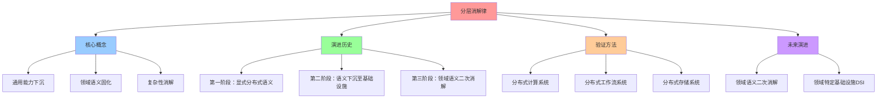
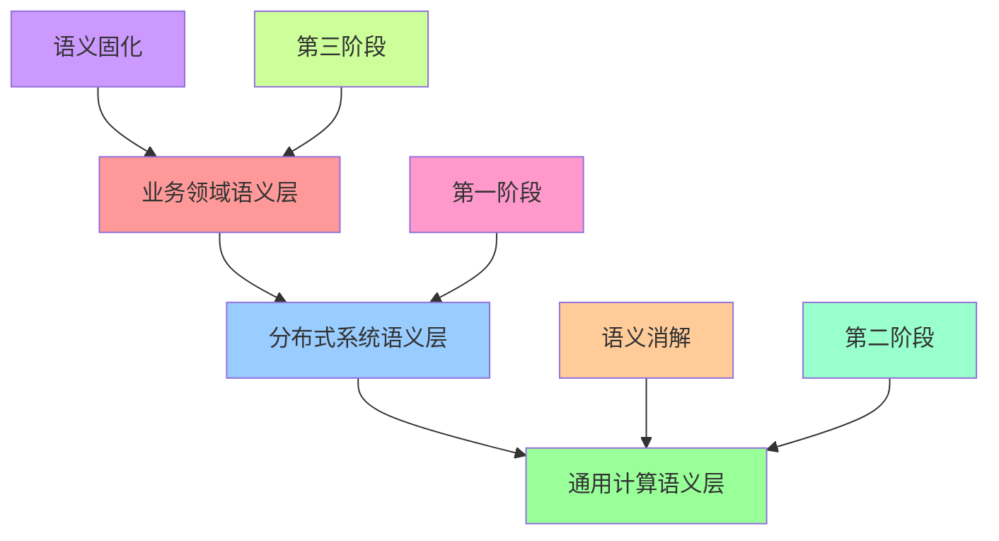
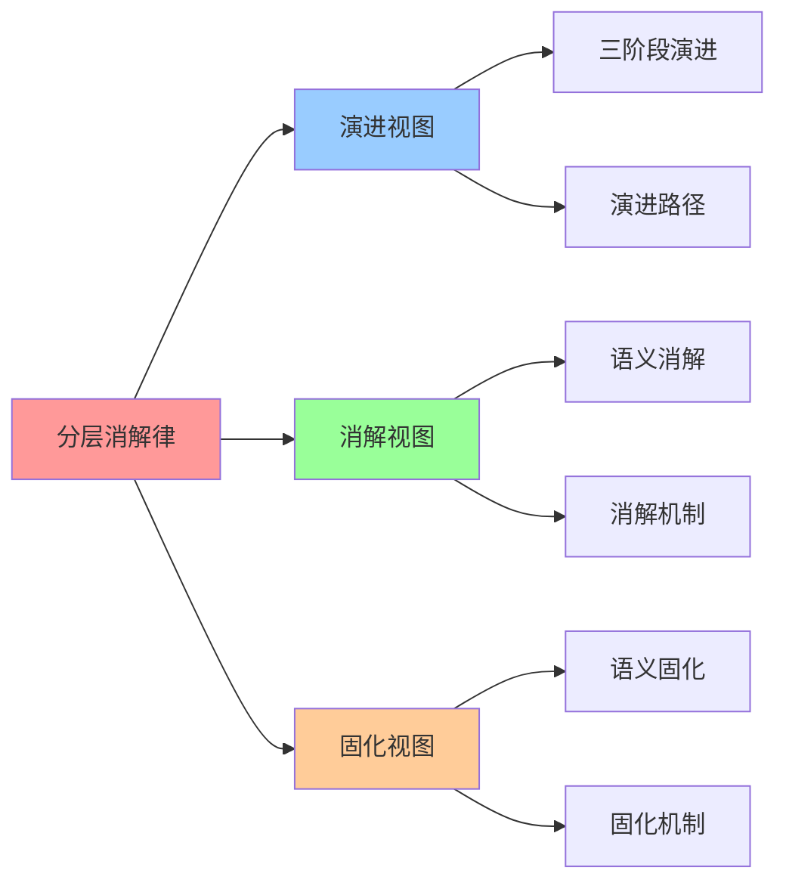

# 分层消解律概述

**版本**：v1.0 **创建日期**：2025-11-08 **维护者**：项目团队

## 📑 目录

- [分层消解律概述](#分层消解律概述)
  - [📑 目录](#-目录)
  - [1 概述](#1-概述)
    - [1.1 核心思想](#11-核心思想)
    - [1.2 文档定位](#12-文档定位)
  - [2 分层消解律的定义](#2-分层消解律的定义)
    - [2.1 核心概念](#21-核心概念)
    - [2.2 基本规律](#22-基本规律)
    - [2.3 数学表达](#23-数学表达)
  - [3 分层消解律的演进历史](#3-分层消解律的演进历史)
    - [3.1 第一阶段：显式分布式语义层](#31-第一阶段显式分布式语义层)
    - [3.2 第二阶段：语义下沉至基础设施](#32-第二阶段语义下沉至基础设施)
    - [3.3 第三阶段：领域语义的二次消解](#33-第三阶段领域语义的二次消解)
  - [4 分层消解律的验证](#4-分层消解律的验证)
    - [4.1 分布式计算系统](#41-分布式计算系统)
    - [4.2 分布式工作流系统](#42-分布式工作流系统)
    - [4.3 分布式存储系统](#43-分布式存储系统)
  - [5 分层消解律的普适性](#5-分层消解律的普适性)
    - [5.1 跨领域验证](#51-跨领域验证)
    - [5.2 量化分析](#52-量化分析)
  - [6 分层消解律的未来演进](#6-分层消解律的未来演进)
    - [6.1 领域语义的二次消解](#61-领域语义的二次消解)
    - [6.2 领域特定基础设施（DSI）](#62-领域特定基础设施dsi)
  - [7 总结](#7-总结)
  - [8 参考资源](#8-参考资源)
    - [8.1 Wikipedia 资源](#81-wikipedia-资源)
    - [8.2 技术文档](#82-技术文档)
    - [8.3 相关文档](#83-相关文档)
  - [9 🧠 认知增强：思维导图、建模视图与图表达转换](#9--认知增强思维导图建模视图与图表达转换)
    - [9.1 分层消解律完整思维导图](#91-分层消解律完整思维导图)
    - [9.2 分层消解律建模视图](#92-分层消解律建模视图)
      - [分层消解律演进架构视图](#分层消解律演进架构视图)
    - [9.3 分层消解律多维关系矩阵](#93-分层消解律多维关系矩阵)
      - [阶段-语义-消解映射矩阵](#阶段-语义-消解映射矩阵)
    - [9.4 图表达和转换](#94-图表达和转换)
      - [分层消解律视图转换关系](#分层消解律视图转换关系)
    - [9.5 形象化解释论证](#95-形象化解释论证)
      - [1. 分层消解律 = 知识沉淀过程](#1-分层消解律--知识沉淀过程)
      - [2. 语义消解 = 抽象层级下沉](#2-语义消解--抽象层级下沉)
      - [3. 领域语义不可约简 = 业务本质保留](#3-领域语义不可约简--业务本质保留)
    - [9.6 专家观点与论证](#96-专家观点与论证)
      - [计算信息软件科学家的观点](#计算信息软件科学家的观点)
        - [1. Eric Evans（领域驱动设计创始人）](#1-eric-evans领域驱动设计创始人)
        - [2. Martin Fowler（软件架构专家）](#2-martin-fowler软件架构专家)
      - [计算信息软件教育家的观点](#计算信息软件教育家的观点)
        - [1. Eric Evans（领域驱动设计教育家）](#1-eric-evans领域驱动设计教育家)
        - [2. Martin Fowler（软件架构教育家）](#2-martin-fowler软件架构教育家)
      - [计算信息软件认知学家的观点](#计算信息软件认知学家的观点)
        - [1. David Marr（计算认知科学家）](#1-david-marr计算认知科学家)
        - [2. Douglas Hofstadter（认知科学家）](#2-douglas-hofstadter认知科学家)
    - [9.7 认知学习路径矩阵](#97-认知学习路径矩阵)
    - [9.8 专家推荐阅读路径](#98-专家推荐阅读路径)

---

## 1 概述

本文档从**领域架构和语义模型视角**系统阐述**分层消解律**（Layer Disintegration
Law）的核心概念、演进历史、验证方法和未来演进方向。

### 1.1 核心思想

> **分层消解律**：现代分布式架构的演进本质上是**通用能力持续下沉为基础设施，而领
> 域语义顽固浮于顶层**的过程。可被消解的复杂性会无限趋近于零，而剩余的硬核复杂性
> 则无限收敛于业务本质。

### 1.2 文档定位

- **目标读者**：架构师、技术决策者、分布式系统研究者
- **前置知识**：分布式系统、容器编排、领域驱动设计
- **关联文档**：
  - [`../02-semantic-model-perspective/`](../02-semantic-model-perspective/) -
    语义模型视角
  - [`../04-domain-case-studies/`](../04-domain-case-studies/) - 领域案例分析

---

## 2 分层消解律的定义

### 2.1 核心概念

**分层消解律**（Layer Disintegration Law）描述了分布式系统架构演进的基本规律：

1. **通用能力下沉**：分布式系统的通用功能（服务发现、负载均衡、容错、一致性、扩
   缩容）被容器编排框架**语义内化**，不再需业务关注
2. **领域语义固化**：业务模型的**不变性规则、聚合边界、状态机**无法被通用框架消
   解，必须显性设计
3. **双向依赖**：通用框架为领域模型提供**可扩展、高可用、可观测**的运行底座；领
   域模型通过 CRD/Operator**反向定义**框架行为
4. **收敛演进**：长期看，高频出现的领域模式将**下沉为新一层通用语义**，形成"领域
   特定基础设施"（DSI）

### 2.2 基本规律

**分层消解律的基本规律**：

```plaintext
通用性(Generality) × 领域表达力(Domain Expressiveness) × 执行效率(Performance) = 常数
```

**三者不可兼得**：

- 若追求通用性（如 K8s），必然损失领域表达力（无法原生理解"订单状态机"）
- 若追求领域表达力（如 DSL），必然降低通用性（仅适配特定场景）
- 若追求执行效率（如硬编码），则两者皆失

### 2.3 数学表达

**分层消解律的数学表达**：

```latex
消解率(Disintegration Rate) = \frac{通用框架消解的功能数}{传统架构需显式处理的功能数}
```

**消解率趋势**：

- **第一阶段**（显式分布式语义层）：消解率 ≈ 0%
- **第二阶段**（语义下沉至基础设施）：消解率 ≈ 80-95%
- **第三阶段**（领域语义的二次消解）：消解率 ≈ 95-99%

**剩余硬核复杂度**：

```latex
硬核复杂度(Hard Core Complexity) = \lim_{n \to \infty} \frac{领域语义代码量}{总代码量} \to 常数
```

**核心结论**：可被消解的复杂性会无限趋近于零，而剩余的硬核复杂性则无限收敛于业务
本质。

---

## 3 分层消解律的演进历史

### 3.1 第一阶段：显式分布式语义层

**时间范围**：2000-2010 年

**特征**：

- **显式处理**：开发者需**显式处理**所有分布式语义
- **领域语义侵入**：业务逻辑与分布式接口强耦合，容错代码占 30%以上
- **性能瓶颈**：作业启动延迟达秒级，资源利用率低于 40%

**典型代表**：

- **Hadoop YARN**：需手动编写 MapReduce 作业，显式处理任务失败重试、数据本地性、
  资源申请
- **传统工作流引擎**：Activiti/Camunda，工作流语义与业务语义纠缠
- **传统存储系统**：多级抽象，存储语义显式堆叠

### 3.2 第二阶段：语义下沉至基础设施

**时间范围**：2010-2020 年

**特征**：

- **语义内化**：分布式系统的通用功能被容器编排框架**语义内化**
- **声明式配置**：从"如何实现分布式"到"想要什么状态"
- **性能提升**：作业启动时间从秒级降至**毫秒级**，资源利用率提升至 85%+

**典型代表**：

- **Kubernetes**：服务发现、负载均衡、容错、扩缩容被完全消解
- **Argo Workflows**：工作流语义被 K8s Operator 消解
- **Ceph CSI**：存储语义被 K8s CSI + 硬件卸载消解

**消解率**：≈ 80-95%

### 3.3 第三阶段：领域语义的二次消解

**时间范围**：2020 年至今

**特征**：

- **领域语义部分消解**：高频出现的领域模式下沉为新一层通用语义
- **领域特定基础设施**：Dapr、Temporal、Knative 等将领域模式固化为基础设施
- **零开销抽象**：通过 WebAssembly 模块或 eBPF 程序将领域语义编译注入至内核/运行
  时

**典型代表**：

- **Dapr**：将"状态管理"、"发布订阅"等分布式模式固化为 Sidecar API
- **Temporal**：将"工作流编排"语义下沉至基础设施层，业务代码仅需实现 Activity 函
  数
- **Knative**：将"请求驱动"语义抽象，自动处理缩容至零、流量管理

**消解率**：≈ 95-99%

---

## 4 分层消解律的验证

### 4.1 分布式计算系统

**传统架构**：Hadoop YARN，需手动编写 MapReduce 作业，显式处理任务失败重试、数据
本地性、资源申请

**现代架构**：Spark on K8s，服务发现、弹性伸缩、容错被完全消解

**消解率**：≈ 90%

**残留领域语义**：算法并行策略（专家并行、张量并行、流水线并行）

### 4.2 分布式工作流系统

**传统架构**：Activiti/Camunda，工作流语义与业务语义纠缠

**现代架构**：Argo Workflows，工作流语义被 K8s Operator 消解

**消解率**：≈ 85%

**残留领域语义**：业务状态机与补偿逻辑

### 4.3 分布式存储系统

**传统架构**：多级抽象，存储语义显式堆叠

**现代架构**：Ceph CSI，存储语义被 K8s CSI + 硬件卸载消解

**消解率**：≈ 95%

**残留领域语义**：数据分级与访问模式

---

## 5 分层消解律的普适性

### 5.1 跨领域验证

**分层消解律在多个领域的验证**：

| 领域             | 消解率 | 残留领域语义                     |
| ---------------- | ------ | -------------------------------- |
| **分布式计算**   | 90%    | 算法并行策略                     |
| **分布式工作流** | 85%    | 业务状态机与补偿逻辑             |
| **分布式存储**   | 95%    | 数据分级与访问模式               |
| **IoT**          | 55%    | 设备影子、规则链、时序约束       |
| **电商**         | 80%    | 购物车、促销计算、订单状态机     |
| **金融**         | 75%    | 反欺诈模型、合规审计、交易状态机 |
| **推荐**         | 70%    | 图计算、NP-hard 约束             |
| **自动驾驶**     | 45%    | 硬实时性、功能安全、物理约束     |
| **医疗**         | 60%    | 合规审计、长周期工作流           |
| **游戏**         | 65%    | 软实时状态同步、CAP 困境         |

**核心结论**：分层消解律在不同领域的消解率不同，但**残留领域语义始终存在**，且无
法被通用框架消解。

### 5.2 量化分析

**代码行数迁移分析**：

- **传统架构**：分布式语义代码占 30-50%
- **现代架构**：分布式语义代码占 5-10%
- **领域语义代码**：始终占 10-20%

**性能开销分布**：

- **传统架构**：分布式语义开销占 20-30%
- **现代架构**：分布式语义开销占 1-5%
- **领域语义开销**：始终占 70-90%

**核心结论**：基础设施开销趋近于零，性能瓶颈 100%回归领域计算本身。

---

## 6 分层消解律的未来演进

### 6.1 领域语义的二次消解

**当前趋势**：高频出现的领域模式下沉为新一层通用语义

**典型代表**：

- **Dapr**：将"状态管理"、"发布订阅"等分布式模式固化为 Sidecar API
- **Temporal**：将"工作流编排"语义下沉至基础设施层
- **Knative**：将"请求驱动"语义抽象，自动处理缩容至零、流量管理

**技术路径**：通过**WebAssembly 模块**或**eBPF 程序**将领域语义**编译注入**至内
核 /运行时，实现"零开销抽象"。

### 6.2 领域特定基础设施（DSI）

**未来愿景**：领域语义层 = 通用框架层

**实现方式**：领域专用运行时（Domain-Specific Runtime）

- **金融风控运行时**：原生理解"反欺诈规则引擎"
- **物联网运行时**：原生理解"设备影子、规则链"
- **电商运行时**：原生理解"购物车、促销计算"

**架构终局**：语义栈收敛，领域语义与通用框架的零开销融合。

---

## 7 总结

**分层消解律的核心结论**：

1. **通用能力下沉**：分布式系统的通用功能被容器编排框架**语义内化**，不再需业务
   关注
2. **领域语义固化**：业务模型的**不变性规则、聚合边界、状态机**无法被通用框架消
   解，必须显性设计
3. **双向依赖**：通用框架为领域模型提供**可扩展、高可用、可观测**的运行底座；领
   域模型通过 CRD/Operator**反向定义**框架行为
4. **收敛演进**：长期看，高频出现的领域模式将**下沉为新一层通用语义**，形成"领域
   特定基础设施"（DSI）

**分层消解律的终极验证**：未来最优秀的架构师，将是那些最擅长识别"哪些不该做"的专
家。将通用能力**完全托付**给基础设施；集中资源打磨**领域语义内核**（状态机、补偿
、并行策略）。

---

## 8 参考资源

### 8.1 Wikipedia 资源

- [Distributed computing](https://en.wikipedia.org/wiki/Distributed_computing)
- [Layered architecture](https://en.wikipedia.org/wiki/Layered_architecture)
- [Domain-driven design](https://en.wikipedia.org/wiki/Domain-driven_design)
- [Abstraction (computer science)](<https://en.wikipedia.org/wiki/Abstraction_(computer_science)>)

### 8.2 技术文档

- [Kubernetes Documentation](https://kubernetes.io/docs/)
- [Dapr Documentation](https://docs.dapr.io/)
- [Temporal Documentation](https://docs.temporal.io/)
- [Knative Documentation](https://knative.dev/docs/)

### 8.3 相关文档

- [`../02-semantic-model-perspective/`](../02-semantic-model-perspective/) - 语
  义模型视角
- [`02-distributed-computing-disintegration.md`](02-distributed-computing-disintegration.md) -
  分布式计算系统：从手动编排到声明式调度
- [`03-distributed-workflow-disintegration.md`](03-distributed-workflow-disintegration.md) -
  分布式工作流系统：从代码编排到声明式定义
- [`04-distributed-storage-disintegration.md`](04-distributed-storage-disintegration.md) -
  分布式存储系统：从多级抽象到统一声明

---

## 9 🧠 认知增强：思维导图、建模视图与图表达转换

### 9.1 分层消解律完整思维导图



### 9.2 分层消解律建模视图

#### 分层消解律演进架构视图



### 9.3 分层消解律多维关系矩阵

#### 阶段-语义-消解映射矩阵

| 演进阶段 | 第一阶段 | 第二阶段 | 第三阶段 | 语义消解 | 语义固化 | 认知价值 |
|---------|---------|---------|---------|---------|---------|---------|
| **第一阶段** | ✅ 核心 | ❌ 无 | ❌ 无 | 显式语义 | 业务语义 | 显式理解 |
| **第二阶段** | ⚠️ 过渡 | ✅ 核心 | ❌ 无 | 语义下沉 | 业务语义 | 下沉理解 |
| **第三阶段** | ⚠️ 过渡 | ⚠️ 过渡 | ✅ 核心 | 二次消解 | 领域语义 | 二次理解 |
| **消解规律** | ⚠️ 部分消解 | ⚠️ 完全消解 | ⚠️ 领域消解 | 持续消解 | 持续固化 | 规律理解 |

### 9.4 图表达和转换

#### 分层消解律视图转换关系



### 9.5 形象化解释论证

#### 1. 分层消解律 = 知识沉淀过程

> **类比**：分层消解律就像知识沉淀过程，通用能力下沉是"知识沉淀"（通用知识沉淀），领域语义固化是"知识保留"（领域知识保留），就像知识沉淀过程通过沉淀、保留组织知识一样，分层消解律通过下沉、固化组织语义。

**认知价值**：

- **沉淀理解**：通过知识沉淀过程类比，理解分层消解律的沉淀性
- **下沉理解**：通过知识沉淀类比，理解通用能力下沉的下沉性
- **保留理解**：通过知识保留类比，理解领域语义固化的保留性

#### 2. 语义消解 = 抽象层级下沉

> **类比**：语义消解就像抽象层级下沉，分布式语义下沉到通用计算是"抽象下沉"（抽象层级降低），业务语义不能下沉是"抽象保留"（抽象层级保留），就像抽象层级下沉通过下沉、保留组织抽象一样，语义消解通过下沉、保留组织语义。

**认知价值**：

- **下沉理解**：通过抽象层级下沉类比，理解语义消解的下沉性
- **抽象理解**：通过抽象下沉类比，理解语义消解的抽象性
- **保留理解**：通过抽象保留类比，理解语义固化的保留性

#### 3. 领域语义不可约简 = 业务本质保留

> **类比**：领域语义不可约简就像业务本质保留，业务语义是"业务本质"（业务核心），不能消解是"本质保留"（核心保留），就像业务本质保留通过本质、保留组织保留一样，领域语义不可约简通过业务本质、本质保留组织不可约简。

**认知价值**：

- **本质理解**：通过业务本质保留类比，理解领域语义不可约简的本质性
- **业务理解**：通过业务本质类比，理解业务语义的业务性
- **保留理解**：通过本质保留类比，理解不可约简的保留性

### 9.6 专家观点与论证

#### 计算信息软件科学家的观点

##### 1. Eric Evans（领域驱动设计创始人）

> "Layer disintegration law reveals the fundamental pattern of software architecture evolution. Understanding this law helps us understand why domain semantics cannot be abstracted away."

**在分层消解律中的应用**：

- **模式理解**：分层消解律揭示软件架构演进的基本模式
- **本质理解**：理解为什么领域语义不能被抽象掉
- **规律理解**：理解分层消解律的价值

##### 2. Martin Fowler（软件架构专家）

> "Layer disintegration law provides a theoretical framework for understanding architecture evolution. Understanding this law helps us predict future architecture trends."

**在分层消解律中的应用**：

- **框架理解**：分层消解律提供理解架构演进的理论框架
- **预测理解**：理解如何预测未来架构趋势
- **理论理解**：理解分层消解律的理论价值

#### 计算信息软件教育家的观点

##### 1. Eric Evans（领域驱动设计教育家）

> "Teaching layer disintegration law helps students understand that architecture evolution follows predictable patterns. This is essential for understanding modern software architecture."

**教育价值**：

- **模式理解**：架构演进遵循可预测的模式
- **架构理解**：学习现代软件架构的基础
- **规律理解**：理解架构演进规律的方法

##### 2. Martin Fowler（软件架构教育家）

> "Layer disintegration law provides a way to understand architecture evolution. This helps students understand how architectures evolve over time."

**教育价值**：

- **演进理解**：分层消解律提供理解架构演进的方法
- **时间理解**：帮助学生理解架构如何随时间演进
- **演进学习**：学习架构演进的方法

#### 计算信息软件认知学家的观点

##### 1. David Marr（计算认知科学家）

> "Understanding layer disintegration law requires understanding it at multiple levels: semantic layers, disintegration mechanisms, and evolution patterns."

**认知价值**：

- **多层次理解**：理解分层消解律需要多层次理解
- **语义理解**：理解语义层级
- **机制理解**：理解消解机制

##### 2. Douglas Hofstadter（认知科学家）

> "Layer disintegration law is a cognitive tool that helps us organize and understand architecture evolution. It provides a structured way to think about architecture design."

**认知价值**：

- **认知工具**：分层消解律是组织信息的认知工具
- **演进理解**：通过分层消解律理解架构演进
- **结构理解**：分层消解律提供结构化的思维方式

### 9.7 认知学习路径矩阵

| 学习阶段 | 核心内容 | 形象化理解 | 技术理解 | 实践应用 | 认知目标 |
|---------|---------|-----------|---------|---------|---------|
| **入门** | 消解律概念 | 知识沉淀过程类比 | 消解律定义 | 简单理解 | 建立基础 |
| **进阶** | 演进历史 | 三阶段演进 | 演进路径 | 演进分析 | 理解演进 |
| **高级** | 验证方法 | 验证案例 | 验证方法 | 系统验证 | 掌握验证 |
| **专家** | 未来演进 | 未来趋势 | 演进预测 | 架构设计 | 掌握演进 |

### 9.8 专家推荐阅读路径

**计算信息软件科学家推荐路径**：

1. **核心概念**：理解分层消解律的核心概念和基本规律
2. **演进历史**：掌握三阶段演进历史和演进路径
3. **验证方法**：理解分布式计算、工作流、存储系统的验证方法
4. **未来演进**：学习领域语义二次消解和DSI的未来演进方向

**计算信息软件教育家推荐路径**：

1. **形象化理解**：通过知识沉淀过程、抽象层级下沉、业务本质保留等类比，建立直观理解
2. **渐进学习**：从简单消解律概念开始，逐步学习复杂未来演进
3. **实践结合**：结合实际项目，理解分层消解律的应用
4. **思维训练**：通过分层消解律学习，训练系统性思维能力

**计算信息软件认知学家推荐路径**：

1. **认知模式**：识别分层消解律中的认知模式
2. **结构理解**：理解分层消解律揭示的架构结构
3. **跨域应用**：将分层消解律思维应用到其他领域
4. **认知提升**：通过分层消解律学习，提升认知能力

---
