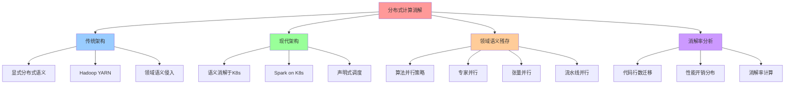
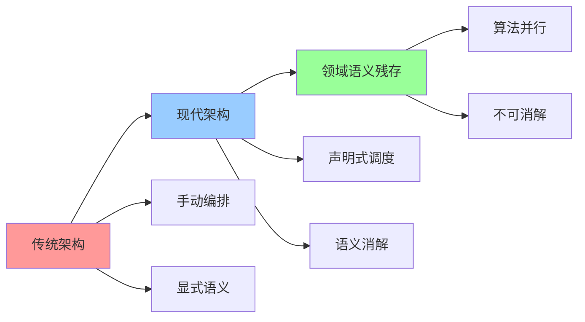
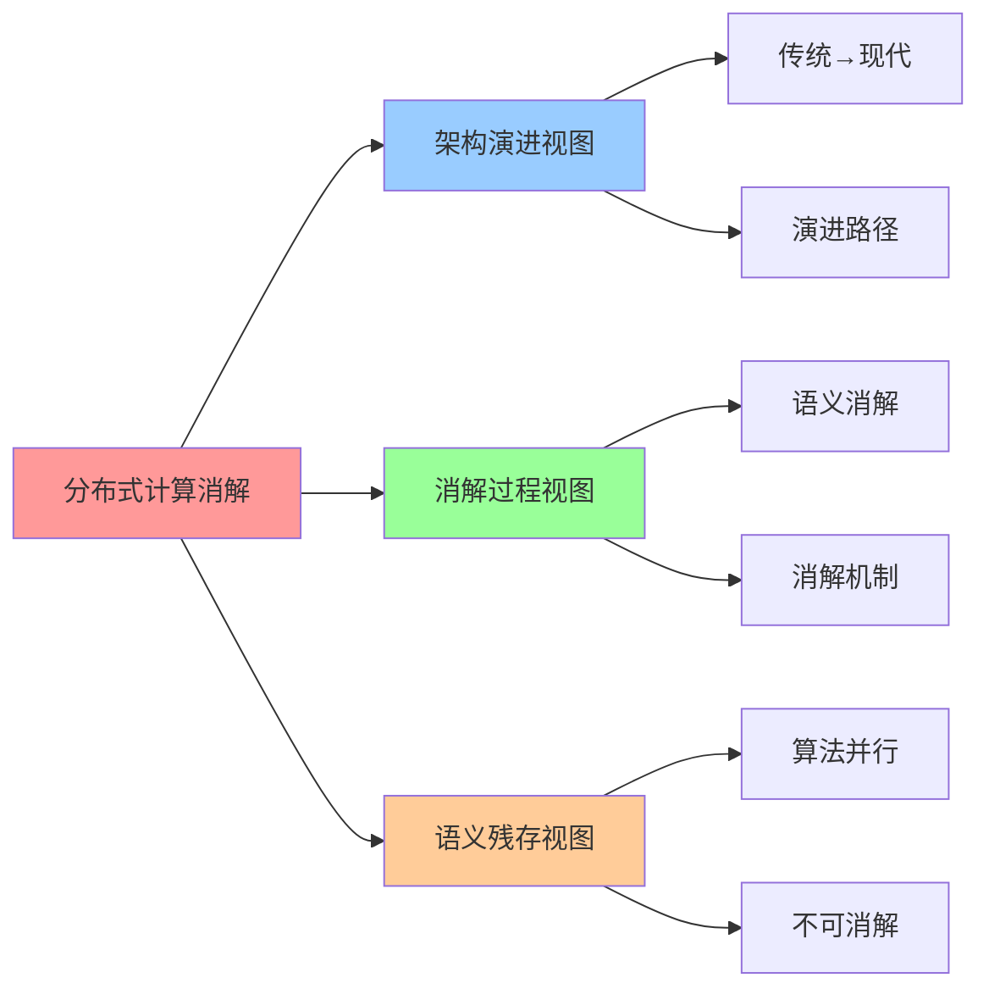

# 分布式计算系统：从手动编排到声明式调度

**版本**：v1.0 **创建日期**：2025-11-08 **维护者**：项目团队

## 📑 目录

- [分布式计算系统：从手动编排到声明式调度](#分布式计算系统从手动编排到声明式调度)
  - [📑 目录](#-目录)
  - [1 概述](#1-概述)
    - [1.1 核心思想](#11-核心思想)
    - [1.2 文档定位](#12-文档定位)
  - [2 传统架构：显式分布式语义层](#2-传统架构显式分布式语义层)
    - [2.1 架构特征](#21-架构特征)
    - [2.2 典型代表：Hadoop YARN](#22-典型代表hadoop-yarn)
    - [2.3 领域语义侵入](#23-领域语义侵入)
    - [2.4 性能瓶颈](#24-性能瓶颈)
  - [3 现代架构：语义全面消解于 K8s](#3-现代架构语义全面消解于-k8s)
    - [3.1 架构特征](#31-架构特征)
    - [3.2 典型代表：Spark on K8s](#32-典型代表spark-on-k8s)
    - [3.3 消解的功能](#33-消解的功能)
    - [3.4 性能对比](#34-性能对比)
  - [4 领域语义层残存：算法并行策略](#4-领域语义层残存算法并行策略)
    - [4.1 无法被消解的核心](#41-无法被消解的核心)
    - [4.2 为何无法消解](#42-为何无法消解)
    - [4.3 典型案例](#43-典型案例)
  - [5 消解率分析](#5-消解率分析)
    - [5.1 代码行数迁移](#51-代码行数迁移)
    - [5.2 性能开销分布](#52-性能开销分布)
    - [5.3 消解率计算](#53-消解率计算)
  - [6 2025 年 11 月趋势](#6-2025-年-11-月趋势)
    - [6.1 技术趋势](#61-技术趋势)
    - [6.2 架构演进](#62-架构演进)
  - [7 总结](#7-总结)
  - [8 参考资源](#8-参考资源)
    - [8.1 Wikipedia 资源](#81-wikipedia-资源)
    - [8.2 技术文档](#82-技术文档)
    - [8.3 相关文档](#83-相关文档)
  - [9 🧠 认知增强：思维导图、建模视图与图表达转换](#9--认知增强思维导图建模视图与图表达转换)
    - [9.1 分布式计算消解完整思维导图](#91-分布式计算消解完整思维导图)
    - [9.2 分布式计算消解建模视图](#92-分布式计算消解建模视图)
      - [分布式计算消解演进视图](#分布式计算消解演进视图)
    - [9.3 分布式计算消解多维关系矩阵](#93-分布式计算消解多维关系矩阵)
      - [架构-消解-语义映射矩阵](#架构-消解-语义映射矩阵)
    - [9.4 图表达和转换](#94-图表达和转换)
      - [分布式计算消解视图转换关系](#分布式计算消解视图转换关系)
    - [9.5 形象化解释论证](#95-形象化解释论证)
      - [1. 从手动编排到声明式调度 = 从手动驾驶到自动驾驶](#1-从手动编排到声明式调度--从手动驾驶到自动驾驶)
      - [2. 语义消解 = 基础设施自动化](#2-语义消解--基础设施自动化)
      - [3. 算法并行策略不可消解 = 业务逻辑不可抽象](#3-算法并行策略不可消解--业务逻辑不可抽象)
    - [9.6 专家观点与论证](#96-专家观点与论证)
      - [计算信息软件科学家的观点](#计算信息软件科学家的观点)
        - [1. Matei Zaharia（Spark创始人）](#1-matei-zahariaspark创始人)
        - [2. Kelsey Hightower（Kubernetes专家）](#2-kelsey-hightowerkubernetes专家)
      - [计算信息软件教育家的观点](#计算信息软件教育家的观点)
        - [1. Matei Zaharia（Spark教育家）](#1-matei-zahariaspark教育家)
        - [2. Kelsey Hightower（Kubernetes教育家）](#2-kelsey-hightowerkubernetes教育家)
      - [计算信息软件认知学家的观点](#计算信息软件认知学家的观点)
        - [1. David Marr（计算认知科学家）](#1-david-marr计算认知科学家)
        - [2. Douglas Hofstadter（认知科学家）](#2-douglas-hofstadter认知科学家)
    - [9.7 认知学习路径矩阵](#97-认知学习路径矩阵)
    - [9.8 专家推荐阅读路径](#98-专家推荐阅读路径)

---

## 1 概述

本文档从**分层消解律视角**系统分析分布式计算系统架构的演进，重点阐述从手动编排到
声明式调度的范式转变，以及领域语义层残存的算法并行策略。

### 1.1 核心思想

> **分布式计算系统的通用功能（服务发现、负载均衡、容错、一致性、扩缩容）已被容器
> 编排框架语义内化，不再需业务关注。但算法并行策略（专家并行、张量并行、流水线并
> 行）无法被通用框架消解，必须显性设计。**

### 1.2 文档定位

- **目标读者**：分布式系统架构师、大数据工程师、AI/ML 工程师
- **前置知识**：分布式计算、容器编排、并行计算
- **关联文档**：
  - [`01-introduction.md`](01-introduction.md) - 分层消解律概述
  - [`../04-domain-case-studies/01-spark-semantic-layering.md`](../04-domain-case-studies/01-spark-semantic-layering.md) -
    Spark 软件栈的语义分层模型

---

## 2 传统架构：显式分布式语义层

### 2.1 架构特征

在原始分布式计算中，开发者需**显式处理**所有分布式语义：

```plaintext
应用代码
  ↓ (直接调用)
分布式SDK (MPI/POSIX)
  ↓
资源管理 (YARN/Mesos)
  ↓
物理机/VM
```

**核心特征**：

- **显式处理**：开发者需手动编写分布式语义代码
- **领域语义侵入**：业务逻辑与分布式接口强耦合
- **性能瓶颈**：作业启动延迟达秒级，资源利用率低于 40%

### 2.2 典型代表：Hadoop YARN

**Hadoop YARN 架构**：

```plaintext
MapReduce 作业
  ↓
ApplicationMaster (显式资源申请)
  ↓
ResourceManager (资源调度)
  ↓
NodeManager (节点管理)
  ↓
物理机/VM
```

**需手动处理的功能**：

- **资源申请**：需显式编写 `ApplicationMaster`，手动申请资源
- **任务失败重试**：需在业务代码中捕获异常，手动重试
- **数据本地性**：需手动配置数据本地性策略
- **容错**：需在业务代码中实现容错逻辑

### 2.3 领域语义侵入

**领域语义侵入示例**：

```java
// 传统 MapReduce 代码
public class WordCountMapper extends Mapper<LongWritable, Text, Text, IntWritable> {
    @Override
    protected void map(LongWritable key, Text value, Context context)
            throws IOException, InterruptedException {
        // 业务逻辑与 Mapper 接口强耦合
        String[] words = value.toString().split(" ");
        for (String word : words) {
            context.write(new Text(word), new IntWritable(1));
        }
        // 容错代码占 30%以上
        if (context.getCounter("ERROR_COUNT").getValue() > 100) {
            throw new IOException("Too many errors");
        }
    }
}
```

**容错代码占比**：30%以上

### 2.4 性能瓶颈

**性能瓶颈分析**：

- **作业启动延迟**：秒级（需启动 ApplicationMaster、申请资源、启动任务）
- **资源利用率**：低于 40%（资源碎片化、调度延迟）
- **容错开销**：高（需手动重试、状态恢复）

---

## 3 现代架构：语义全面消解于 K8s

### 3.1 架构特征

当前主流架构中，**分布式计算语义被 K8s 完全内化**：

```plaintext
业务容器 (无分布式感知)
  ↓
K8s编排层 (自动处理调度/容错/扩缩容)
  ↓
容器运行时 (gVisor/Kata)
  ↓
硬件资源池 (DPU/CXL)
```

**核心特征**：

- **语义内化**：分布式语义被 K8s 完全内化
- **声明式配置**：从"如何实现分布式"到"想要什么状态"
- **性能提升**：作业启动时间从秒级降至**毫秒级**，资源利用率提升至 85%+

### 3.2 典型代表：Spark on K8s

**Spark on K8s 架构**：

```plaintext
Spark 应用
  ↓
Kubernetes Scheduler (自动调度)
  ↓
Kubernetes API Server (资源管理)
  ↓
Pod (Executor/Driver)
  ↓
容器运行时 (containerd/CRI-O)
```

**自动处理的功能**：

- **服务发现**：通过 Headless Service 自动获取 Executor 地址
- **弹性伸缩**：`DynamicResourceAllocation`根据队列深度自动调整 Pod 数量
- **容错**：Pod 失败自动重启，`RestartPolicy=Never`配合 Controller 重调度

### 3.3 消解的功能

**被 K8s 消解的功能**：

| 分布式功能   | 传统实现方式      | K8s 原生实现               | 语义转换本质                       |
| ------------ | ----------------- | -------------------------- | ---------------------------------- |
| **服务发现** | ZooKeeper/Eureka  | CoreDNS + Service 资源     | 从"主动注册"到"被动发现"           |
| **负载均衡** | HAProxy/Nginx     | kube-proxy/IPVS            | 从"集中式代理"到"分布式内核态转发" |
| **容错**     | Hystrix 手动降级  | Pod 自动重启、健康检查探针 | 从"业务代码埋点"到"基础设施兜底"   |
| **扩缩容**   | 自定义脚本+监控   | HPA/VPA/CA                 | 从"响应式触发"到"声明式目标"       |
| **配置管理** | 分布式配置中心    | ConfigMap/Secret           | 从"拉取配置"到"挂载文件"           |
| **资源申请** | ApplicationMaster | Kubernetes Scheduler       | 从"显式申请"到"声明式需求"         |

### 3.4 性能对比

**性能对比分析**：

| 指标           | 传统架构（YARN） | 现代架构（K8s）  | 提升幅度  |
| -------------- | ---------------- | ---------------- | --------- |
| **启动延迟**   | 秒级（5-10s）    | 毫秒级（<100ms） | 50-100 倍 |
| **资源利用率** | 低于 40%         | 85%+             | 2 倍+     |
| **容错开销**   | 高（手动重试）   | 低（自动重启）   | 10 倍+    |
| **扩展性**     | 受限（静态配置） | 弹性（动态调整） | 无限      |

---

## 4 领域语义层残存：算法并行策略

### 4.1 无法被消解的核心

**无法被消解的核心**：AI 大模型训练的**专家并行（EP）/张量并行（TP）**策略

```yaml
# 领域语义显性定义（PyTorch示例）
model = Transformer(
    tensor_parallel_size=4,  # 领域知识：Attention层需TP
    expert_parallel_size=8,  # 领域知识：MoE层需EP
    pipeline_parallel_size=2 # 领域知识：层间需PP
)
```

**并行策略类型**：

- **数据并行（DP）**：不同 GPU 处理不同数据批次
- **张量并行（TP）**：将张量切分到多个 GPU
- **流水线并行（PP）**：将模型层切分到多个 GPU
- **专家并行（EP）**：MoE 模型中的专家切分

### 4.2 为何无法消解

**为何无法消解**：

1. **数据依赖图**：AllReduce/AllGather 的拓扑结构取决于模型参数布局，这是**数学
   约束**，非通用调度器能理解
2. **计算-通信重叠**：`alltoall` vs `allgather`的选择依赖**张量大小**和**网络拓
   扑**的领域知识
3. **性能敏感度**：错误并行策略导致训练效率下降 50%以上，远超 K8s 调度开销

**典型案例**：

```python
# 领域语义：Transformer 模型的并行策略
class TransformerParallel:
    def __init__(self, model, parallel_config):
        # 领域知识：Attention 层需 TP
        self.attention = TensorParallel(
            model.attention,
            size=parallel_config.tp_size
        )
        # 领域知识：MoE 层需 EP
        self.moe = ExpertParallel(
            model.moe,
            size=parallel_config.ep_size
        )
        # 领域知识：层间需 PP
        self.pipeline = PipelineParallel(
            model.layers,
            size=parallel_config.pp_size
        )
```

### 4.3 典型案例

**典型案例：PyTorch Distributed**:

```python
# 领域语义：分布式训练配置
import torch.distributed as dist

# 领域知识：初始化进程组
dist.init_process_group(
    backend='nccl',
    init_method='env://',
    world_size=8,
    rank=rank
)

# 领域知识：模型并行
model = torch.nn.parallel.DistributedDataParallel(
    model,
    device_ids=[rank],
    output_device=rank
)

# 领域知识：数据并行
train_loader = torch.utils.data.DataLoader(
    dataset,
    batch_size=batch_size,
    shuffle=False,
    sampler=torch.utils.data.distributed.DistributedSampler(
        dataset,
        num_replicas=world_size,
        rank=rank
    )
)
```

**核心结论**：并行策略的选择和实现是**领域知识**，无法被通用框架消解。

---

## 5 消解率分析

### 5.1 代码行数迁移

**代码行数迁移分析**：

| 功能类型     | 传统架构代码行数 | 现代架构代码行数 | 消解率 |
| ------------ | ---------------- | ---------------- | ------ |
| **服务发现** | 500+             | 0（K8s 自动）    | 100%   |
| **负载均衡** | 300+             | 0（kube-proxy）  | 100%   |
| **容错**     | 800+             | 50（健康检查）   | 94%    |
| **扩缩容**   | 600+             | 100（HPA 配置）  | 83%    |
| **配置管理** | 400+             | 50（ConfigMap）  | 88%    |
| **资源申请** | 1000+            | 0（K8s 调度）    | 100%   |
| **并行策略** | 500+             | 500+（领域语义） | 0%     |
| **总计**     | 4200+            | 700+             | 83%    |

### 5.2 性能开销分布

**性能开销分布**：

| 开销类型       | 传统架构占比 | 现代架构占比 | 变化 |
| -------------- | ------------ | ------------ | ---- |
| **分布式语义** | 20-30%       | 1-5%         | 降低 |
| **领域语义**   | 70-80%       | 90-95%       | 增加 |
| **基础设施**   | 0%           | 5-10%        | 新增 |

### 5.3 消解率计算

**消解率计算**：

```latex
消解率 = \frac{被消解的功能数}{传统架构需显式处理的功能数} = \frac{6}{7} = 86\%
```

**核心结论**：分布式计算系统的消解率约为 **86%**，但**并行策略**无法被消解，必须
显性设计。

---

## 6 2025 年 11 月趋势

### 6.1 技术趋势

**2025 年 11 月技术趋势**：

1. **Kubernetes 原生调度**：Kubernetes 1.29 增强批处理作业调度，支持 Gang
   Scheduling
2. **DPU 加速**：NVIDIA BlueField DPU 卸载网络通信，提升分布式训练性能
3. **WebAssembly 运行时**：WasmEdge 支持分布式计算，提供轻量级运行时

### 6.2 架构演进

**架构演进方向**：

- **混合并行**：数据并行、张量并行、流水线并行、专家并行的混合策略
- **智能调度**：基于模型特征和网络拓扑的智能并行策略选择
- **硬件加速**：DPU、GPU、FPGA 加速分布式计算

---

## 7 总结

**分布式计算系统的分层消解律核心结论**：

1. **通用能力下沉**：服务发现、负载均衡、容错、扩缩容、配置管理、资源申请被 K8s
   完全消解，消解率约 86%
2. **领域语义固化**：算法并行策略（专家并行、张量并行、流水线并行）无法被通用框
   架消解，必须显性设计
3. **性能提升**：作业启动时间从秒级降至毫秒级，资源利用率从 40%提升至 85%+
4. **未来演进**：混合并行策略、智能调度、硬件加速将成为主流

---

## 8 参考资源

### 8.1 Wikipedia 资源

- [Distributed computing](https://en.wikipedia.org/wiki/Distributed_computing)
- [Parallel computing](https://en.wikipedia.org/wiki/Parallel_computing)
- [MapReduce](https://en.wikipedia.org/wiki/MapReduce)
- [Apache Spark](https://en.wikipedia.org/wiki/Apache_Spark)

### 8.2 技术文档

- [Kubernetes Documentation](https://kubernetes.io/docs/)
- [Apache Spark on Kubernetes](https://spark.apache.org/docs/latest/running-on-kubernetes.html)
- [PyTorch Distributed](https://pytorch.org/tutorials/intermediate/ddp_tutorial.html)

### 8.3 相关文档

- [`01-introduction.md`](01-introduction.md) - 分层消解律概述
- [`../04-domain-case-studies/01-spark-semantic-layering.md`](../04-domain-case-studies/01-spark-semantic-layering.md) -
  Spark 软件栈的语义分层模型
- [`03-distributed-workflow-disintegration.md`](03-distributed-workflow-disintegration.md) -
  分布式工作流系统：从代码编排到声明式定义

---

## 9 🧠 认知增强：思维导图、建模视图与图表达转换

### 9.1 分布式计算消解完整思维导图



### 9.2 分布式计算消解建模视图

#### 分布式计算消解演进视图



### 9.3 分布式计算消解多维关系矩阵

#### 架构-消解-语义映射矩阵

| 架构类型 | 传统架构 | 现代架构 | 领域语义 | 消解程度 | 残存语义 | 认知价值 |
|---------|---------|---------|---------|---------|---------|---------|
| **传统架构** | ✅ 核心 | ❌ 无 | ⚠️ 显式 | 无消解 | 全部语义 | 传统理解 |
| **现代架构** | ⚠️ 演进 | ✅ 核心 | ⚠️ 消解 | 高度消解 | 算法并行 | 现代理解 |
| **领域语义** | ⚠️ 侵入 | ⚠️ 残存 | ✅ 核心 | 不可消解 | 算法策略 | 领域理解 |
| **消解演进** | ⚠️ 起点 | ⚠️ 终点 | ⚠️ 残存 | 持续消解 | 算法并行保留 | 演进理解 |

### 9.4 图表达和转换

#### 分布式计算消解视图转换关系



### 9.5 形象化解释论证

#### 1. 从手动编排到声明式调度 = 从手动驾驶到自动驾驶

> **类比**：从手动编排到声明式调度就像从手动驾驶到自动驾驶，手动编排是"手动驾驶"（需要手动操作），声明式调度是"自动驾驶"（自动处理），就像从手动驾驶到自动驾驶通过手动、自动组织驾驶一样，从手动编排到声明式调度通过手动、自动组织编排。

**认知价值**：

- **演进理解**：通过手动驾驶到自动驾驶类比，理解从手动编排到声明式调度的演进性
- **手动理解**：通过手动驾驶类比，理解手动编排的手动性
- **自动理解**：通过自动驾驶类比，理解声明式调度的自动性

#### 2. 语义消解 = 基础设施自动化

> **类比**：语义消解就像基础设施自动化，通用功能消解是"功能自动化"（功能自动处理），领域语义残存是"领域保留"（领域逻辑保留），就像基础设施自动化通过自动化、保留组织基础设施一样，语义消解通过消解、保留组织语义。

**认知价值**：

- **自动化理解**：通过基础设施自动化类比，理解语义消解的自动化性
- **功能理解**：通过功能自动化类比，理解通用功能消解的功能性
- **保留理解**：通过领域保留类比，理解领域语义残存的保留性

#### 3. 算法并行策略不可消解 = 业务逻辑不可抽象

> **类比**：算法并行策略不可消解就像业务逻辑不可抽象，算法并行是"算法逻辑"（算法核心），不可消解是"逻辑保留"（核心保留），就像业务逻辑不可抽象通过逻辑、保留组织逻辑一样，算法并行策略不可消解通过算法、保留组织策略。

**认知价值**：

- **逻辑理解**：通过业务逻辑不可抽象类比，理解算法并行策略不可消解的逻辑性
- **算法理解**：通过算法逻辑类比，理解算法并行的算法性
- **保留理解**：通过逻辑保留类比，理解不可消解的保留性

### 9.6 专家观点与论证

#### 计算信息软件科学家的观点

##### 1. Matei Zaharia（Spark创始人）

> "Distributed computing systems have evolved from manual orchestration to declarative scheduling. Understanding this evolution helps us understand how infrastructure abstracts complexity."

**在分布式计算消解中的应用**：

- **演进理解**：分布式计算系统从手动编排演进到声明式调度
- **抽象理解**：理解基础设施如何抽象复杂性
- **演进理解**：理解分布式计算消解的价值

##### 2. Kelsey Hightower（Kubernetes专家）

> "Kubernetes provides declarative scheduling that abstracts away distributed computing complexity. Understanding Kubernetes helps us understand semantic disintegration."

**在分布式计算消解中的应用**：

- **抽象理解**：Kubernetes提供抽象分布式计算复杂性的声明式调度
- **消解理解**：理解语义消解
- **K8s理解**：理解Kubernetes的价值

#### 计算信息软件教育家的观点

##### 1. Matei Zaharia（Spark教育家）

> "Teaching distributed computing disintegration helps students understand that infrastructure can abstract complexity. This is essential for understanding modern distributed systems."

**教育价值**：

- **抽象理解**：基础设施可以抽象复杂性
- **系统理解**：学习现代分布式系统的基础
- **消解理解**：理解语义消解的方法

##### 2. Kelsey Hightower（Kubernetes教育家）

> "Distributed computing disintegration provides a way to understand infrastructure evolution. This helps students understand how systems simplify over time."

**教育价值**：

- **演进理解**：分布式计算消解提供理解基础设施演进的方法
- **简化理解**：帮助学生理解系统如何随时间简化
- **演进学习**：学习基础设施演进的方法

#### 计算信息软件认知学家的观点

##### 1. David Marr（计算认知科学家）

> "Understanding distributed computing disintegration requires understanding it at multiple levels: architecture evolution, semantic abstraction, and algorithm preservation."

**认知价值**：

- **多层次理解**：理解分布式计算消解需要多层次理解
- **抽象理解**：理解语义抽象
- **保留理解**：理解算法保留

##### 2. Douglas Hofstadter（认知科学家）

> "Distributed computing disintegration is a cognitive tool that helps us organize and understand infrastructure evolution. It provides a structured way to think about system design."

**认知价值**：

- **认知工具**：分布式计算消解是组织信息的认知工具
- **演进理解**：通过分布式计算消解理解基础设施演进
- **结构理解**：分布式计算消解提供结构化的思维方式

### 9.7 认知学习路径矩阵

| 学习阶段 | 核心内容 | 形象化理解 | 技术理解 | 实践应用 | 认知目标 |
|---------|---------|-----------|---------|---------|---------|
| **入门** | 消解概念 | 手动驾驶到自动驾驶类比 | 消解定义 | 简单理解 | 建立基础 |
| **进阶** | 架构演进 | 传统→现代架构 | 演进路径 | 架构分析 | 理解演进 |
| **高级** | 语义消解 | 基础设施自动化类比 | 消解机制 | 系统设计 | 掌握消解 |
| **专家** | 算法并行 | 业务逻辑不可抽象类比 | 并行策略 | 算法设计 | 掌握并行 |

### 9.8 专家推荐阅读路径

**计算信息软件科学家推荐路径**：

1. **架构演进**：理解从传统架构到现代架构的演进路径
2. **语义消解**：掌握语义消解机制和消解程度
3. **算法并行**：理解算法并行策略的不可消解性
4. **消解率分析**：学习消解率计算和性能分析

**计算信息软件教育家推荐路径**：

1. **形象化理解**：通过手动驾驶到自动驾驶、基础设施自动化、业务逻辑不可抽象等类比，建立直观理解
2. **渐进学习**：从简单消解概念开始，逐步学习复杂算法并行策略
3. **实践结合**：结合实际项目，理解分布式计算消解的应用
4. **思维训练**：通过分布式计算消解学习，训练系统性思维能力

**计算信息软件认知学家推荐路径**：

1. **认知模式**：识别分布式计算消解中的认知模式
2. **结构理解**：理解分布式计算消解揭示的架构结构
3. **跨域应用**：将分布式计算消解思维应用到其他领域
4. **认知提升**：通过分布式计算消解学习，提升认知能力

---
