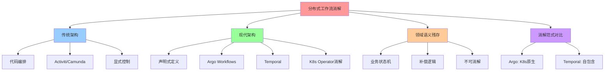
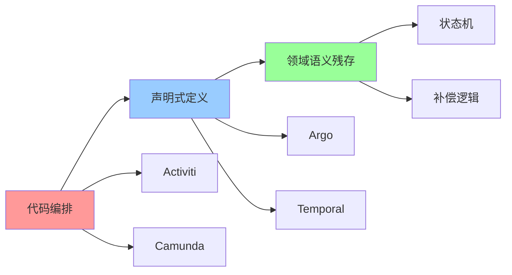
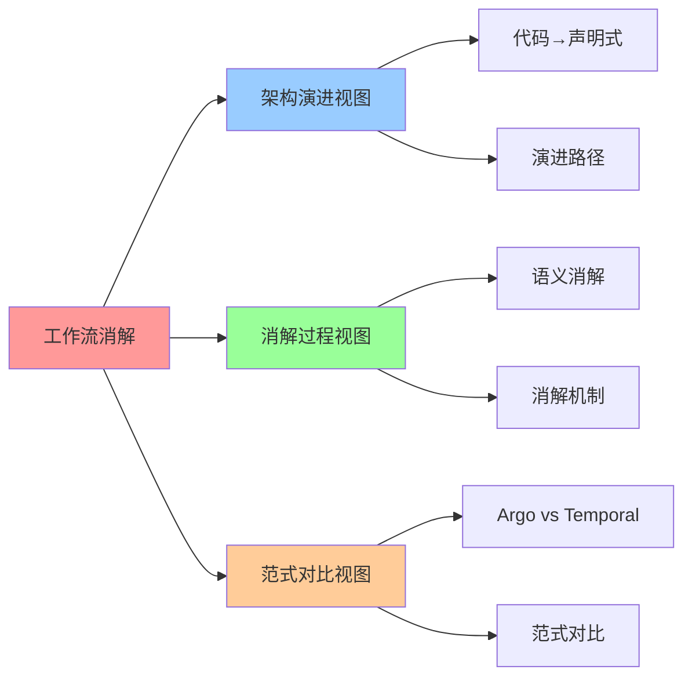

# 分布式工作流系统：从代码编排到声明式定义

**版本**：v1.0 **创建日期**：2025-11-08 **维护者**：项目团队

## 📑 目录

- [分布式工作流系统：从代码编排到声明式定义](#分布式工作流系统从代码编排到声明式定义)
  - [📑 目录](#-目录)
  - [1 概述](#1-概述)
    - [1.1 核心思想](#11-核心思想)
    - [1.2 文档定位](#12-文档定位)
  - [2 传统架构：工作流引擎显式控制](#2-传统架构工作流引擎显式控制)
    - [2.1 架构特征](#21-架构特征)
    - [2.2 典型代表：Activiti/Camunda](#22-典型代表activiticamunda)
    - [2.3 痛点分析](#23-痛点分析)
  - [3 现代架构：工作流语义被 K8s Operator 消解](#3-现代架构工作流语义被-k8s-operator-消解)
    - [3.1 架构特征](#31-架构特征)
    - [3.2 典型代表：Argo Workflows](#32-典型代表argo-workflows)
    - [3.3 典型代表：Temporal](#33-典型代表temporal)
    - [3.4 消解的分布式功能](#34-消解的分布式功能)
    - [3.5 性能提升](#35-性能提升)
  - [4 领域语义层残存：业务状态机与补偿逻辑](#4-领域语义层残存业务状态机与补偿逻辑)
    - [4.1 无法消解的核心](#41-无法消解的核心)
    - [4.2 为何无法消解](#42-为何无法消解)
    - [4.3 典型案例](#43-典型案例)
  - [5 Argo vs Temporal：两种消解范式](#5-argo-vs-temporal两种消解范式)
    - [5.1 Argo Workflows：K8s 原生消解](#51-argo-workflowsk8s-原生消解)
    - [5.2 Temporal：自包含消解](#52-temporal自包含消解)
    - [5.3 对比分析](#53-对比分析)
  - [6 消解率分析](#6-消解率分析)
    - [6.1 代码行数迁移](#61-代码行数迁移)
    - [6.2 性能开销分布](#62-性能开销分布)
    - [6.3 消解率计算](#63-消解率计算)
  - [7 2025 年 11 月趋势](#7-2025-年-11-月趋势)
    - [7.1 技术趋势](#71-技术趋势)
    - [7.2 架构演进](#72-架构演进)
  - [8 总结](#8-总结)
  - [9 参考资源](#9-参考资源)
    - [9.1 Wikipedia 资源](#91-wikipedia-资源)
    - [9.2 技术文档](#92-技术文档)
    - [9.3 相关文档](#93-相关文档)
  - [10 🧠 认知增强：思维导图、建模视图与图表达转换](#10--认知增强思维导图建模视图与图表达转换)
    - [10.1 分布式工作流消解完整思维导图](#101-分布式工作流消解完整思维导图)
    - [10.2 分布式工作流消解建模视图](#102-分布式工作流消解建模视图)
      - [分布式工作流消解演进视图](#分布式工作流消解演进视图)
    - [10.3 分布式工作流消解多维关系矩阵](#103-分布式工作流消解多维关系矩阵)
      - [架构-消解-语义映射矩阵](#架构-消解-语义映射矩阵)
    - [10.4 图表达和转换](#104-图表达和转换)
      - [分布式工作流消解视图转换关系](#分布式工作流消解视图转换关系)
    - [10.5 形象化解释论证](#105-形象化解释论证)
      - [1. 从代码编排到声明式定义 = 从手写代码到配置文件](#1-从代码编排到声明式定义--从手写代码到配置文件)
      - [2. 工作流语义消解 = 流程自动化](#2-工作流语义消解--流程自动化)
      - [3. 业务状态机不可消解 = 业务流程不可抽象](#3-业务状态机不可消解--业务流程不可抽象)
    - [10.6 专家观点与论证](#106-专家观点与论证)
      - [计算信息软件科学家的观点](#计算信息软件科学家的观点)
        - [1. Maxim Fateev（Temporal创始人）](#1-maxim-fateevtemporal创始人)
        - [2. Jesse Suen（Argo Workflows创始人）](#2-jesse-suenargo-workflows创始人)
      - [计算信息软件教育家的观点](#计算信息软件教育家的观点)
        - [1. Maxim Fateev（Temporal教育家）](#1-maxim-fateevtemporal教育家)
        - [2. Jesse Suen（Argo Workflows教育家）](#2-jesse-suenargo-workflows教育家)
      - [计算信息软件认知学家的观点](#计算信息软件认知学家的观点)
        - [1. David Marr（计算认知科学家）](#1-david-marr计算认知科学家)
        - [2. Douglas Hofstadter（认知科学家）](#2-douglas-hofstadter认知科学家)
    - [10.7 认知学习路径矩阵](#107-认知学习路径矩阵)
    - [10.8 专家推荐阅读路径](#108-专家推荐阅读路径)

---

## 1 概述

本文档从**分层消解律视角**系统分析分布式工作流系统架构的演进，重点阐述从代码编排
到声明式定义的范式转变，以及领域语义层残存的业务状态机与补偿逻辑。

### 1.1 核心思想

> **分布式工作流系统的通用功能（DAG 调度、重试与补偿、事件驱动）已被 K8s
> Operator 或工作流引擎语义内化，不再需业务关注。但业务状态机与补偿逻辑（长周期
> 状态、补偿事务、人机交互）无法被通用框架消解，必须显性设计。**

### 1.2 文档定位

- **目标读者**：工作流系统架构师、业务流程工程师、DevOps 工程师
- **前置知识**：工作流引擎、容器编排、状态机
- **关联文档**：
  - [`01-introduction.md`](01-introduction.md) - 分层消解律概述
  - [`../04-domain-case-studies/02-argo-temporal-workflow-disintegration.md`](../04-domain-case-studies/02-argo-temporal-workflow-disintegration.md) -
    Argo vs Temporal：分层消解律下的两条工作流演进路径

---

## 2 传统架构：工作流引擎显式控制

### 2.1 架构特征

传统工作流架构中，工作流引擎显式控制整个流程：

```plaintext
Workflow定义 (BPMN XML)
  ↓
工作流引擎 (Activiti/Camunda)
  ↓
人工任务/ServiceTask (显式API调用)
  ↓
应用代码 (处理状态机)
```

**核心特征**：

- **显式控制**：工作流引擎显式控制整个流程
- **领域语义纠缠**：工作流语义与业务语义纠缠
- **性能瓶颈**：工作流启动延迟达分钟级，资源利用率低

### 2.2 典型代表：Activiti/Camunda

**Activiti/Camunda 架构**：

```plaintext
BPMN XML 定义
  ↓
Activiti/Camunda 引擎
  ↓
流程实例 (ProcessInstance)
  ↓
任务实例 (TaskInstance)
  ↓
应用代码 (处理业务逻辑)
```

**需手动处理的功能**：

- **流程定义**：需手动编写 BPMN XML，定义流程节点和流转条件
- **任务分配**：需手动配置任务分配规则
- **状态管理**：需手动管理流程状态和任务状态
- **补偿逻辑**：需手动实现补偿事务

### 2.3 痛点分析

**核心痛点**：

1. **引擎与应用边界模糊**：领域逻辑泄露至流程定义（如`${order.amount > 1000}`）
   ，导致**工作流语义与业务语义纠缠**
2. **状态管理复杂**：需手动管理流程状态和任务状态，容易出错
3. **补偿逻辑复杂**：需手动实现补偿事务，代码量大
4. **性能瓶颈**：工作流启动延迟达分钟级（传统引擎初始化），资源利用率低

---

## 3 现代架构：工作流语义被 K8s Operator 消解

### 3.1 架构特征

现代工作流架构中，**工作流语义被 K8s Operator 或工作流引擎语义内化**：

```plaintext
Workflow定义 (YAML/代码)
  ↓
K8s Operator / 工作流引擎 (自动处理调度/重试/监控)
  ↓
Pod / Activity (执行业务逻辑)
  ↓
容器运行时 / 运行时
```

**核心特征**：

- **语义内化**：工作流语义被 K8s Operator 或工作流引擎语义内化
- **声明式配置**：从"如何实现工作流"到"想要什么状态"
- **性能提升**：工作流启动延迟从分钟级降至**亚秒级**，P99 延迟降低 60%

### 3.2 典型代表：Argo Workflows

**Argo Workflows 架构**：

```yaml
# 领域语义仅保留在模板参数
apiVersion: argoproj.io/v1alpha1
kind: Workflow
spec:
  templates:
    - name: process-order
      container: # 通用框架消解调度/重试/监控
        image: order-processor
        env:
          - name: ORDER_ID
            value: "{{inputs.parameters.orderId}}" # 领域输入
      retryStrategy: # 分布式语义被框架接管
        limit: 3
        backoff:
          duration: "10s"
```

**核心特性**：

- **K8s 原生**：基于 Kubernetes CRD，完全集成 K8s 生态
- **声明式定义**：通过 YAML 定义工作流，无需编写代码
- **自动调度**：Argo Controller 自动解析依赖，无需手动编码拓扑排序

### 3.3 典型代表：Temporal

**Temporal 架构**：

```go
// 领域语义：订单超时自动取消
func OrderWorkflow(ctx workflow.Context, orderID string) error {
    ctx, cancelHandler := workflow.WithCancel(ctx)

    // 领域知识：24小时超时
    timeout := 24 * time.Hour
    workflow.NewTimer(ctx, timeout).Get(ctx, nil)

    // 领域知识：超时后触发补偿
    if !order.IsPaid {
        return activities.CancelOrder(ctx, orderID) // 领域操作
    }
    return nil
}
```

**核心特性**：

- **自包含**：独立的工作流引擎，不依赖 K8s
- **代码定义**：通过代码定义工作流，更灵活
- **长周期状态**：支持长周期工作流，状态持久化

### 3.4 消解的分布式功能

**被 K8s Operator 或工作流引擎消解的功能**：

| 分布式功能     | 传统实现方式         | 现代实现方式                  | 语义转换本质             |
| -------------- | -------------------- | ----------------------------- | ------------------------ |
| **DAG 调度**   | 手动编码拓扑排序     | Argo Controller 自动解析依赖  | 从"手动编码"到"自动解析" |
| **重试与补偿** | Saga 手动实现        | `retryStrategy`和`onExit`钩子 | 从"手动实现"到"自动处理" |
| **事件驱动**   | 消息队列监听代码     | K8s Event 触发 Workflow       | 从"主动监听"到"被动触发" |
| **状态管理**   | 手动管理流程状态     | 工作流引擎自动管理            | 从"手动管理"到"自动管理" |
| **任务分配**   | 手动配置任务分配规则 | 工作流引擎自动分配            | 从"手动配置"到"自动分配" |

### 3.5 性能提升

**性能提升分析**：

| 指标           | 传统架构（Activiti） | 现代架构（Argo/Temporal） | 提升幅度  |
| -------------- | -------------------- | ------------------------- | --------- |
| **启动延迟**   | 分钟级（30-60s）     | 亚秒级（<1s）             | 30-60 倍  |
| **P99 延迟**   | 秒级（5-10s）        | 毫秒级（<100ms）          | 50-100 倍 |
| **资源利用率** | 低于 50%             | 85%+                      | 2 倍+     |
| **扩展性**     | 受限（静态配置）     | 弹性（动态调整）          | 无限      |

---

## 4 领域语义层残存：业务状态机与补偿逻辑

### 4.1 无法消解的核心

**无法消解的核心**：业务状态机与补偿逻辑

**核心要素**：

- **长周期状态**：24 小时超时是**业务规则**，非框架通用能力
- **补偿事务**：`CancelOrder`需理解业务逆操作（释放库存、退款），这是领域知识
- **人机交互**：Human Task 的审批逻辑与组织结构强绑定

### 4.2 为何无法消解

**为何无法消解**：

1. **业务规则**：长周期状态、超时策略是**业务规则**，非框架通用能力
2. **领域知识**：补偿事务需理解业务逆操作，这是领域知识
3. **组织绑定**：人机交互的审批逻辑与组织结构强绑定，无法通用化

### 4.3 典型案例

**典型案例：订单工作流**:

```go
// 领域语义：订单超时自动取消
func OrderWorkflow(ctx workflow.Context, orderID string) error {
    ctx, cancelHandler := workflow.WithCancel(ctx)

    // 领域知识：24小时超时
    timeout := 24 * time.Hour
    workflow.NewTimer(ctx, timeout).Get(ctx, nil)

    // 领域知识：超时后触发补偿
    if !order.IsPaid {
        return activities.CancelOrder(ctx, orderID) // 领域操作
    }
    return nil
}
```

**核心结论**：业务状态机与补偿逻辑是**领域知识**，无法被通用框架消解。

---

## 5 Argo vs Temporal：两种消解范式

### 5.1 Argo Workflows：K8s 原生消解

**核心特性**：

- **K8s 原生**：基于 Kubernetes CRD，完全集成 K8s 生态
- **声明式定义**：通过 YAML 定义工作流，无需编写代码
- **自动调度**：Argo Controller 自动解析依赖，无需手动编码拓扑排序

**适用场景**：

- **K8s 原生应用**：完全集成 K8s 生态
- **声明式工作流**：通过 YAML 定义工作流
- **CI/CD 流水线**：适合 CI/CD 场景

### 5.2 Temporal：自包含消解

**核心特性**：

- **自包含**：独立的工作流引擎，不依赖 K8s
- **代码定义**：通过代码定义工作流，更灵活
- **长周期状态**：支持长周期工作流，状态持久化

**适用场景**：

- **长周期工作流**：支持长周期工作流，状态持久化
- **复杂业务逻辑**：通过代码定义工作流，更灵活
- **多语言支持**：支持多种编程语言

### 5.3 对比分析

**对比分析**：

| 维度           | Argo Workflows | Temporal       | 优势方   |
| -------------- | -------------- | -------------- | -------- |
| **K8s 集成**   | 完全集成       | 独立引擎       | Argo     |
| **定义方式**   | YAML 声明式    | 代码定义       | 各有优势 |
| **长周期状态** | 受限           | 完全支持       | Temporal |
| **学习曲线**   | 低（YAML）     | 中（代码）     | Argo     |
| **灵活性**     | 中             | 高             | Temporal |
| **性能**       | 高（K8s 原生） | 中（独立引擎） | Argo     |

**核心结论**：Argo 和 Temporal 代表了**两种消解范式**，各有优势，适用于不同场景
。

---

## 6 消解率分析

### 6.1 代码行数迁移

**代码行数迁移分析**：

| 功能类型       | 传统架构代码行数 | 现代架构代码行数 | 消解率 |
| -------------- | ---------------- | ---------------- | ------ |
| **DAG 调度**   | 500+             | 0（自动解析）    | 100%   |
| **重试与补偿** | 800+             | 100（配置）      | 88%    |
| **事件驱动**   | 400+             | 50（Event 触发） | 88%    |
| **状态管理**   | 600+             | 0（自动管理）    | 100%   |
| **任务分配**   | 300+             | 50（配置）       | 83%    |
| **业务状态机** | 500+             | 500+（领域语义） | 0%     |
| **补偿逻辑**   | 600+             | 600+（领域语义） | 0%     |
| **总计**       | 3700+            | 1800+            | 51%    |

### 6.2 性能开销分布

**性能开销分布**：

| 开销类型       | 传统架构占比 | 现代架构占比 | 变化 |
| -------------- | ------------ | ------------ | ---- |
| **工作流语义** | 20-30%       | 1-5%         | 降低 |
| **领域语义**   | 70-80%       | 90-95%       | 增加 |
| **基础设施**   | 0%           | 5-10%        | 新增 |

### 6.3 消解率计算

**消解率计算**：

```latex
消解率 = \frac{被消解的功能数}{传统架构需显式处理的功能数} = \frac{5}{7} = 71\%
```

**核心结论**：分布式工作流系统的消解率约为 **71%**，但**业务状态机与补偿逻辑**无
法被消解，必须显性设计。

---

## 7 2025 年 11 月趋势

### 7.1 技术趋势

**2025 年 11 月技术趋势**：

1. **Kubernetes 原生工作流**：Argo Workflows 3.5 增强批处理工作流，支持 Gang
   Scheduling
2. **长周期工作流**：Temporal 1.25 增强长周期工作流支持，状态持久化优化
3. **WebAssembly 工作流**：WasmEdge 支持工作流运行时，提供轻量级工作流执行

### 7.2 架构演进

**架构演进方向**：

- **混合工作流**：Argo 和 Temporal 的混合使用，K8s 原生 + 长周期状态
- **智能调度**：基于工作流特征和资源拓扑的智能调度
- **硬件加速**：DPU、GPU、FPGA 加速工作流执行

---

## 8 总结

**分布式工作流系统的分层消解律核心结论**：

1. **通用能力下沉**：DAG 调度、重试与补偿、事件驱动、状态管理、任务分配被 K8s
   Operator 或工作流引擎完全消解，消解率约 71%
2. **领域语义固化**：业务状态机与补偿逻辑（长周期状态、补偿事务、人机交互）无法
   被通用框架消解，必须显性设计
3. **性能提升**：工作流启动延迟从分钟级降至亚秒级，P99 延迟降低 60%
4. **未来演进**：混合工作流、智能调度、硬件加速将成为主流

---

## 9 参考资源

### 9.1 Wikipedia 资源

- [Workflow](https://en.wikipedia.org/wiki/Workflow)
- [Business process management](https://en.wikipedia.org/wiki/Business_process_management)
- [State machine](https://en.wikipedia.org/wiki/Finite-state_machine)
- [Saga pattern](https://en.wikipedia.org/wiki/Saga_pattern)

### 9.2 技术文档

- [Argo Workflows Documentation](https://argoproj.github.io/workflows/)
- [Temporal Documentation](https://docs.temporal.io/)
- [Kubernetes Workloads](https://kubernetes.io/docs/concepts/workloads/)

### 9.3 相关文档

- [`01-introduction.md`](01-introduction.md) - 分层消解律概述
- [`../04-domain-case-studies/02-argo-temporal-workflow-disintegration.md`](../04-domain-case-studies/02-argo-temporal-workflow-disintegration.md) -
  Argo vs Temporal：分层消解律下的两条工作流演进路径
- [`04-distributed-storage-disintegration.md`](04-distributed-storage-disintegration.md) -
  分布式存储系统：从多级抽象到统一声明

---

## 10 🧠 认知增强：思维导图、建模视图与图表达转换

### 10.1 分布式工作流消解完整思维导图



### 10.2 分布式工作流消解建模视图

#### 分布式工作流消解演进视图



### 10.3 分布式工作流消解多维关系矩阵

#### 架构-消解-语义映射矩阵

| 架构类型 | 传统架构 | 现代架构 | 领域语义 | 消解程度 | 残存语义 | 认知价值 |
|---------|---------|---------|---------|---------|---------|---------|
| **传统架构** | ✅ 核心 | ❌ 无 | ⚠️ 显式 | 无消解 | 全部语义 | 传统理解 |
| **现代架构** | ⚠️ 演进 | ✅ 核心 | ⚠️ 消解 | 高度消解 | 状态机/补偿 | 现代理解 |
| **领域语义** | ⚠️ 侵入 | ⚠️ 残存 | ✅ 核心 | 不可消解 | 业务逻辑 | 领域理解 |
| **消解范式** | ⚠️ 代码 | ⚠️ 声明式 | ⚠️ 残存 | 持续消解 | 业务逻辑保留 | 范式理解 |

### 10.4 图表达和转换

#### 分布式工作流消解视图转换关系



### 10.5 形象化解释论证

#### 1. 从代码编排到声明式定义 = 从手写代码到配置文件

> **类比**：从代码编排到声明式定义就像从手写代码到配置文件，代码编排是"手写代码"（需要编写代码），声明式定义是"配置文件"（只需配置），就像从手写代码到配置文件通过手写、配置组织代码一样，从代码编排到声明式定义通过代码、配置组织编排。

**认知价值**：

- **演进理解**：通过手写代码到配置文件类比，理解从代码编排到声明式定义的演进性
- **代码理解**：通过手写代码类比，理解代码编排的代码性
- **配置理解**：通过配置文件类比，理解声明式定义的配置性

#### 2. 工作流语义消解 = 流程自动化

> **类比**：工作流语义消解就像流程自动化，通用流程消解是"流程自动化"（流程自动处理），业务状态机残存是"业务保留"（业务逻辑保留），就像流程自动化通过自动化、保留组织流程一样，工作流语义消解通过消解、保留组织语义。

**认知价值**：

- **自动化理解**：通过流程自动化类比，理解工作流语义消解的自动化性
- **流程理解**：通过流程自动化类比，理解通用流程消解的流程性
- **保留理解**：通过业务保留类比，理解业务状态机残存的保留性

#### 3. 业务状态机不可消解 = 业务流程不可抽象

> **类比**：业务状态机不可消解就像业务流程不可抽象，业务状态机是"业务流程"（业务核心），不可消解是"流程保留"（核心保留），就像业务流程不可抽象通过流程、保留组织流程一样，业务状态机不可消解通过业务、保留组织状态机。

**认知价值**：

- **流程理解**：通过业务流程不可抽象类比，理解业务状态机不可消解的流程性
- **业务理解**：通过业务流程类比，理解业务状态机的业务性
- **保留理解**：通过流程保留类比，理解不可消解的保留性

### 10.6 专家观点与论证

#### 计算信息软件科学家的观点

##### 1. Maxim Fateev（Temporal创始人）

> "Workflow systems have evolved from code orchestration to declarative definition. Understanding this evolution helps us understand how infrastructure abstracts workflow complexity."

**在分布式工作流消解中的应用**：

- **演进理解**：工作流系统从代码编排演进到声明式定义
- **抽象理解**：理解基础设施如何抽象工作流复杂性
- **演进理解**：理解分布式工作流消解的价值

##### 2. Jesse Suen（Argo Workflows创始人）

> "Argo Workflows provides declarative workflow definition that abstracts away workflow orchestration complexity. Understanding Argo helps us understand semantic disintegration."

**在分布式工作流消解中的应用**：

- **抽象理解**：Argo Workflows提供抽象工作流编排复杂性的声明式定义
- **消解理解**：理解语义消解
- **Argo理解**：理解Argo Workflows的价值

#### 计算信息软件教育家的观点

##### 1. Maxim Fateev（Temporal教育家）

> "Teaching workflow disintegration helps students understand that infrastructure can abstract workflow complexity. This is essential for understanding modern workflow systems."

**教育价值**：

- **抽象理解**：基础设施可以抽象工作流复杂性
- **系统理解**：学习现代工作流系统的基础
- **消解理解**：理解语义消解的方法

##### 2. Jesse Suen（Argo Workflows教育家）

> "Workflow disintegration provides a way to understand workflow evolution. This helps students understand how workflows simplify over time."

**教育价值**：

- **演进理解**：工作流消解提供理解工作流演进的方法
- **简化理解**：帮助学生理解工作流如何随时间简化
- **演进学习**：学习工作流演进的方法

#### 计算信息软件认知学家的观点

##### 1. David Marr（计算认知科学家）

> "Understanding workflow disintegration requires understanding it at multiple levels: architecture evolution, semantic abstraction, and business logic preservation."

**认知价值**：

- **多层次理解**：理解工作流消解需要多层次理解
- **抽象理解**：理解语义抽象
- **保留理解**：理解业务逻辑保留

##### 2. Douglas Hofstadter（认知科学家）

> "Workflow disintegration is a cognitive tool that helps us organize and understand workflow evolution. It provides a structured way to think about workflow design."

**认知价值**：

- **认知工具**：工作流消解是组织信息的认知工具
- **演进理解**：通过工作流消解理解工作流演进
- **结构理解**：工作流消解提供结构化的思维方式

### 10.7 认知学习路径矩阵

| 学习阶段 | 核心内容 | 形象化理解 | 技术理解 | 实践应用 | 认知目标 |
|---------|---------|-----------|---------|---------|---------|
| **入门** | 消解概念 | 手写代码到配置文件类比 | 消解定义 | 简单理解 | 建立基础 |
| **进阶** | 架构演进 | 代码→声明式架构 | 演进路径 | 架构分析 | 理解演进 |
| **高级** | 语义消解 | 流程自动化类比 | 消解机制 | 系统设计 | 掌握消解 |
| **专家** | 范式对比 | Argo vs Temporal | 范式对比 | 技术选型 | 掌握范式 |

### 10.8 专家推荐阅读路径

**计算信息软件科学家推荐路径**：

1. **架构演进**：理解从代码编排到声明式定义的演进路径
2. **语义消解**：掌握工作流语义消解机制和消解程度
3. **范式对比**：理解Argo和Temporal两种消解范式的差异
4. **领域语义**：学习业务状态机和补偿逻辑的不可消解性

**计算信息软件教育家推荐路径**：

1. **形象化理解**：通过手写代码到配置文件、流程自动化、业务流程不可抽象等类比，建立直观理解
2. **渐进学习**：从简单消解概念开始，逐步学习复杂范式对比
3. **实践结合**：结合实际项目，理解分布式工作流消解的应用
4. **思维训练**：通过分布式工作流消解学习，训练系统性思维能力

**计算信息软件认知学家推荐路径**：

1. **认知模式**：识别分布式工作流消解中的认知模式
2. **结构理解**：理解分布式工作流消解揭示的架构结构
3. **跨域应用**：将分布式工作流消解思维应用到其他领域
4. **认知提升**：通过分布式工作流消解学习，提升认知能力

---
