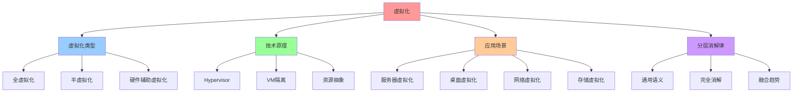
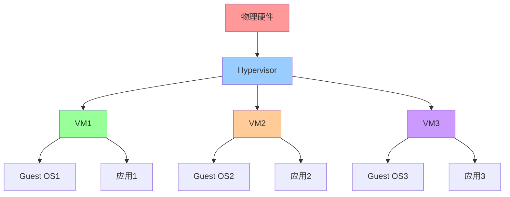
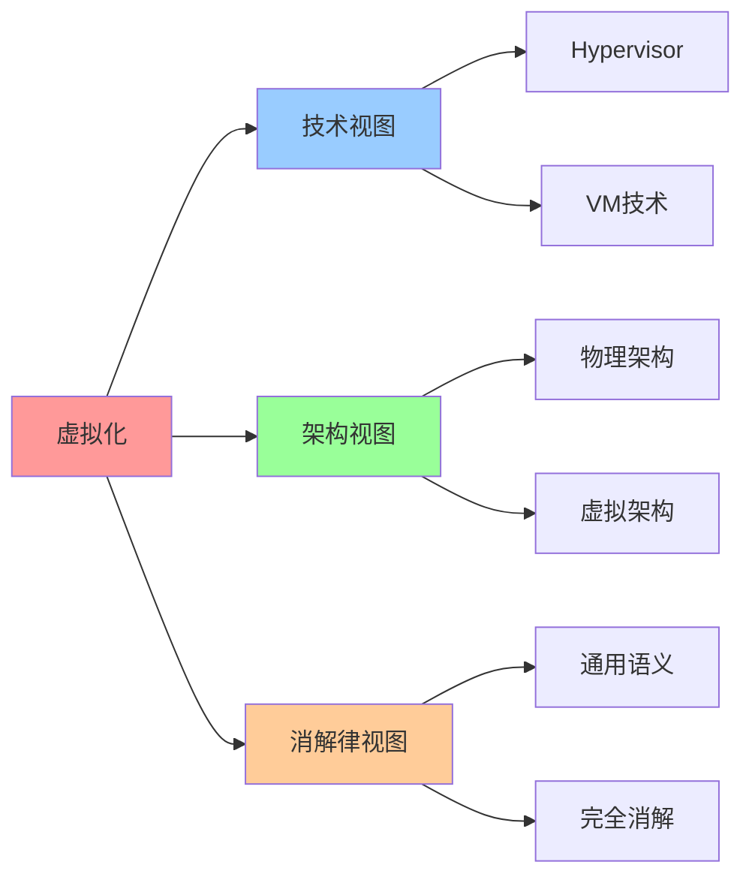

# 虚拟化（Virtualization）

## 📑 目录

- [虚拟化（Virtualization）](#虚拟化virtualization)
  - [📑 目录](#-目录)
  - [1 概述](#1-概述)
    - [1.1 Wikipedia 定义](#11-wikipedia-定义)
    - [1.2 文档定位](#12-文档定位)
  - [2 Wikipedia 定义与解释](#2-wikipedia-定义与解释)
    - [2.1 核心定义](#21-核心定义)
    - [2.2 技术原理](#22-技术原理)
    - [2.3 应用场景](#23-应用场景)
  - [3 与容器化、沙盒化的关系](#3-与容器化沙盒化的关系)
    - [3.1 技术对比](#31-技术对比)
    - [3.2 适用场景](#32-适用场景)
    - [3.3 融合趋势](#33-融合趋势)
  - [4 在分层消解律中的位置](#4-在分层消解律中的位置)
    - [4.1 语义层级](#41-语义层级)
    - [4.2 消解率](#42-消解率)
    - [4.3 残留语义](#43-残留语义)
  - [5 2025 年 11 月趋势](#5-2025-年-11-月趋势)
    - [5.1 技术趋势](#51-技术趋势)
    - [5.2 架构演进](#52-架构演进)
  - [6 总结](#6-总结)
  - [7 参考资源](#7-参考资源)
    - [7.1 Wikipedia 资源](#71-wikipedia-资源)
    - [7.2 技术文档](#72-技术文档)
    - [7.3 相关文档](#73-相关文档)
  - [8 🧠 认知增强：思维导图、建模视图与图表达转换](#8--认知增强思维导图建模视图与图表达转换)
    - [8.1 虚拟化完整思维导图](#81-虚拟化完整思维导图)
    - [8.2 虚拟化建模视图](#82-虚拟化建模视图)
      - [虚拟化架构视图](#虚拟化架构视图)
    - [8.3 虚拟化多维关系矩阵](#83-虚拟化多维关系矩阵)
      - [虚拟化类型-技术-应用映射矩阵](#虚拟化类型-技术-应用映射矩阵)
    - [8.4 图表达和转换](#84-图表达和转换)
      - [虚拟化视图转换关系](#虚拟化视图转换关系)
    - [8.5 形象化解释论证](#85-形象化解释论证)
      - [1. 虚拟化 = 酒店房间系统](#1-虚拟化--酒店房间系统)
      - [2. Hypervisor = 资源管理器](#2-hypervisor--资源管理器)
      - [3. 虚拟化消解 = 通用基础设施](#3-虚拟化消解--通用基础设施)
    - [8.6 专家观点与论证](#86-专家观点与论证)
      - [计算信息软件科学家的观点](#计算信息软件科学家的观点)
        - [1. Gerald Popek（虚拟化理论创始人）](#1-gerald-popek虚拟化理论创始人)
        - [2. Mendel Rosenblum（VMware创始人）](#2-mendel-rosenblumvmware创始人)
      - [计算信息软件教育家的观点](#计算信息软件教育家的观点)
        - [1. Andrew Tanenbaum（操作系统教育家）](#1-andrew-tanenbaum操作系统教育家)
        - [2. David Patterson（计算机架构教育家）](#2-david-patterson计算机架构教育家)
      - [计算信息软件认知学家的观点](#计算信息软件认知学家的观点)
        - [1. David Marr（计算认知科学家）](#1-david-marr计算认知科学家)
        - [2. Douglas Hofstadter（认知科学家）](#2-douglas-hofstadter认知科学家)
    - [8.7 认知学习路径矩阵](#87-认知学习路径矩阵)
    - [8.8 专家推荐阅读路径](#88-专家推荐阅读路径)

---

## 1 概述

本文档基于**Wikipedia 定义**系统阐述虚拟化（Virtualization）的概念、技术原理和应
用场景，并分析其在分层消解律中的位置。

### 1.1 Wikipedia 定义

**虚拟化（Virtualization）**：在计算中，虚拟化是指创建计算资源的虚拟（而非物理）
版本的行为，包括硬件平台、存储设备和计算机网络资源。

**来
源**：[Wikipedia - Virtualization](https://en.wikipedia.org/wiki/Virtualization)

### 1.2 文档定位

- **目标读者**：架构师、系统工程师、虚拟化技术研究者
- **前置知识**：操作系统、计算机体系结构、网络基础
- **关联文档**：
  - [`../01-core-themes/01-technology-essence.md`](../01-core-themes/01-technology-essence.md) -
    技术本质与演进趋势
  - [`02-containerization.md`](02-containerization.md) - 容器化
    （Containerization）
  - [`03-sandboxing.md`](03-sandboxing.md) - 沙盒化（Sandboxing）

---

## 2 Wikipedia 定义与解释

### 2.1 核心定义

**虚拟化（Virtualization）**：

> **在计算中，虚拟化是指创建计算资源的虚拟（而非物理）版本的行为，包括硬件平台、
> 存储设备和计算机网络资源。**

**核心特征**：

- **硬件虚拟化**：创建虚拟硬件平台（如虚拟机）
- **存储虚拟化**：创建虚拟存储设备（如虚拟磁盘）
- **网络虚拟化**：创建虚拟网络资源（如虚拟网络接口）

### 2.2 技术原理

**虚拟化技术原理**：

- **Hypervisor**：虚拟机监控器（VMM），负责管理和调度虚拟机
- **硬件抽象层**：将物理硬件抽象为虚拟硬件
- **资源隔离**：通过硬件虚拟化实现资源隔离

**典型实现**：

- **Type 1 Hypervisor**：直接运行在硬件上（如 VMware ESXi、Xen）
- **Type 2 Hypervisor**：运行在操作系统上（如 VMware Workstation、VirtualBox）

### 2.3 应用场景

**虚拟化应用场景**：

- **服务器虚拟化**：在一台物理服务器上运行多个虚拟机
- **桌面虚拟化**：在服务器上运行虚拟桌面，用户通过客户端访问
- **网络虚拟化**：创建虚拟网络，实现网络隔离和资源管理
- **存储虚拟化**：将多个物理存储设备抽象为统一的虚拟存储池

---

## 3 与容器化、沙盒化的关系

### 3.1 技术对比

**虚拟化 vs 容器化 vs 沙盒化**：

| 维度         | 虚拟化             | 容器化           | 沙盒化               |
| ------------ | ------------------ | ---------------- | -------------------- |
| **隔离级别** | 硬件级隔离         | 进程级隔离       | 系统调用级隔离       |
| **启动时间** | 分钟级（30-60s）   | 秒级（1-5s）     | 毫秒级（<100ms）     |
| **资源开销** | 高（完整操作系统） | 中（共享内核）   | 低（轻量级运行时）   |
| **安全性**   | 高（硬件级隔离）   | 中（进程级隔离） | 中（系统调用过滤）   |
| **适用场景** | 多租户、安全敏感   | 微服务、DevOps   | Serverless、边缘计算 |

### 3.2 适用场景

**虚拟化适用场景**：

- **多租户环境**：需要强隔离的多租户环境
- **安全敏感应用**：金融交易、政府涉密等安全敏感应用
- **遗留系统迁移**：将遗留系统迁移到虚拟化环境

### 3.3 融合趋势

**虚拟化与容器化的融合趋势**：

- **Kata Containers**：结合虚拟机和容器的优势，提供 VM 级隔离和容器速度
- **gVisor**：Google 开发的用户态内核，通过系统调用拦截提供额外隔离层
- **Firecracker**：AWS 开发的轻量级虚拟化技术，用于 Lambda 和 Fargate

---

## 4 在分层消解律中的位置

### 4.1 语义层级

**虚拟化在分层消解律中的位置**：

```plaintext
┌────────────────────────────────────────────────────────┐
│ 层1：通用计算语义层 (General-Purpose Computing Layer)  │
│ 职责：资源调度、进程隔离、网络虚拟化、存储抽象            │
│ 实现：容器运行时、CNI、CSI、gVisor、Kata Containers     │
│ 不可替代性：★☆☆☆☆ (完全通用)                          │
└────────────────────────────────────────────────────────┘
```

**核心特征**：

- **语义层级**：层 1（通用计算语义层）
- **消解率**：100%（完全被基础设施消解）
- **残留语义**：无（完全通用）

### 4.2 消解率

**虚拟化消解率**：

- **消解率**：100%（完全被基础设施消解）
- **消解方式**：硬件虚拟化、Hypervisor、虚拟化平台
- **残留语义**：无（完全通用）

### 4.3 残留语义

**虚拟化残留语义**：

- **残留语义**：无（完全通用）
- **原因**：虚拟化是通用计算语义，不包含领域特定语义
- **结论**：虚拟化可以被完全消解，无需领域特定设计

---

## 5 2025 年 11 月趋势

### 5.1 技术趋势

**2025 年 11 月技术趋势**：

1. **轻量级虚拟化**：Firecracker、Kata Containers 等轻量级虚拟化技术普及
2. **硬件加速**：DPU 卸载虚拟化处理，提升性能
3. **混合部署**：虚拟化与容器化混合部署，各取所长

### 5.2 架构演进

**架构演进方向**：

- **轻量级虚拟化**：从传统虚拟化向轻量级虚拟化演进
- **硬件加速**：通过 DPU 等硬件加速虚拟化处理
- **混合部署**：虚拟化与容器化混合部署，实现最佳隔离和性能

---

## 6 总结

**虚拟化（Virtualization）核心结论**：

1. **Wikipedia 定义**：虚拟化是指创建计算资源的虚拟（而非物理）版本的行为
2. **技术原理**：通过 Hypervisor 实现硬件抽象和资源隔离
3. **应用场景**：服务器虚拟化、桌面虚拟化、网络虚拟化、存储虚拟化
4. **在分层消解律中的位置**：层 1（通用计算语义层），消解率 100%
5. **与容器化、沙盒化的关系**：虚拟化提供硬件级隔离，容器化提供进程级隔离，沙盒
   化提供系统调用级隔离

**核心结论**：虚拟化是通用计算语义，可以被完全消解，无需领域特定设计。虚拟化与容
器化、沙盒化的融合趋势明显，形成混合部署模式。

---

## 7 参考资源

### 7.1 Wikipedia 资源

- [Virtualization](https://en.wikipedia.org/wiki/Virtualization)
- [Hypervisor](https://en.wikipedia.org/wiki/Hypervisor)
- [Hardware virtualization](https://en.wikipedia.org/wiki/Hardware_virtualization)

### 7.2 技术文档

- [VMware Documentation](https://docs.vmware.com/)
- [Xen Documentation](https://xenproject.org/developers/technical-resources/)
- [Kata Containers Documentation](https://katacontainers.io/docs/)

### 7.3 相关文档

- [`../01-core-themes/01-technology-essence.md`](../01-core-themes/01-technology-essence.md) -
  技术本质与演进趋势
- [`02-containerization.md`](02-containerization.md) - 容器化
  （Containerization）
- [`03-sandboxing.md`](03-sandboxing.md) - 沙盒化（Sandboxing）

---

## 8 🧠 认知增强：思维导图、建模视图与图表达转换

### 8.1 虚拟化完整思维导图



### 8.2 虚拟化建模视图

#### 虚拟化架构视图



### 8.3 虚拟化多维关系矩阵

#### 虚拟化类型-技术-应用映射矩阵

| 虚拟化类型 | 全虚拟化 | 半虚拟化 | 硬件辅助 | Hypervisor | 应用场景 | 认知价值 |
|-----------|---------|---------|---------|-----------|---------|---------|
| **全虚拟化** | ✅ 核心 | ❌ 无 | ⚠️ 部分 | KVM, Xen | 完全隔离 | 隔离理解 |
| **半虚拟化** | ❌ 无 | ✅ 核心 | ❌ 无 | Xen PV | 性能优化 | 性能理解 |
| **硬件辅助** | ⚠️ 部分 | ❌ 无 | ✅ 核心 | VT-x, AMD-V | 硬件加速 | 加速理解 |
| **通用语义** | ✅ 核心 | ✅ 核心 | ✅ 核心 | 通用框架 | 完全消解 | 消解理解 |

### 8.4 图表达和转换

#### 虚拟化视图转换关系



### 8.5 形象化解释论证

#### 1. 虚拟化 = 酒店房间系统

> **类比**：虚拟化就像酒店房间系统，物理硬件是"酒店大楼"（物理资源），Hypervisor是"酒店管理系统"（虚拟化层），VM是"房间"（虚拟资源），Guest OS是"房间设施"（操作系统），应用是"客人"（应用程序），就像酒店房间系统通过大楼、系统、房间、设施、客人组织酒店一样，虚拟化通过硬件、Hypervisor、VM、OS、应用组织计算资源。

**认知价值**：

- **系统理解**：通过酒店房间系统类比，理解虚拟化的系统性
- **资源理解**：通过房间类比，理解VM的资源性
- **管理理解**：通过管理系统类比，理解Hypervisor的管理性

#### 2. Hypervisor = 资源管理器

> **类比**：Hypervisor就像资源管理器，物理资源是"资源池"（CPU、内存、存储），VM是"资源分配"（分配给每个VM的资源），资源调度是"资源分配策略"（如何分配资源），就像资源管理器通过资源池、分配、策略管理资源一样，Hypervisor通过物理资源、VM、调度管理计算资源。

**认知价值**：

- **管理理解**：通过资源管理器类比，理解Hypervisor的管理性
- **分配理解**：通过资源分配类比，理解VM的分配性
- **策略理解**：通过资源分配策略类比，理解资源调度的策略性

#### 3. 虚拟化消解 = 通用基础设施

> **类比**：虚拟化消解就像通用基础设施，虚拟化是"基础设施"（通用计算语义），消解是"基础设施化"（将虚拟化变为基础设施），通用框架是"基础设施标准"（统一的虚拟化标准），就像通用基础设施通过基础设施、基础设施化、标准组织基础设施一样，虚拟化消解通过虚拟化、消解、框架组织通用计算语义。

**认知价值**：

- **基础设施理解**：通过通用基础设施类比，理解虚拟化的基础设施性
- **消解理解**：通过基础设施化类比，理解消解的消解性
- **标准理解**：通过基础设施标准类比，理解通用框架的标准性

### 8.6 专家观点与论证

#### 计算信息软件科学家的观点

##### 1. Gerald Popek（虚拟化理论创始人）

> "Virtualization provides a way to abstract physical resources. Understanding virtualization helps us understand how to manage resources efficiently."

**在虚拟化中的应用**：

- **抽象理解**：虚拟化提供抽象物理资源的方法
- **资源理解**：理解如何高效管理资源
- **管理理解**：理解虚拟化的资源管理价值

##### 2. Mendel Rosenblum（VMware创始人）

> "Virtualization is the foundation of cloud computing. Understanding virtualization helps us understand how cloud computing works."

**在虚拟化中的应用**：

- **基础理解**：虚拟化是云计算的基础
- **云计算理解**：理解云计算的工作原理
- **技术理解**：理解虚拟化在云计算中的作用

#### 计算信息软件教育家的观点

##### 1. Andrew Tanenbaum（操作系统教育家）

> "Teaching virtualization helps students understand that operating systems can be abstracted. This is essential for understanding modern computing."

**教育价值**：

- **抽象理解**：虚拟化帮助学生理解操作系统的抽象
- **计算理解**：学习现代计算的基础
- **系统理解**：理解操作系统的抽象性

##### 2. David Patterson（计算机架构教育家）

> "Virtualization provides a way to understand resource management. This helps students understand how systems work."

**教育价值**：

- **资源管理理解**：虚拟化提供理解资源管理的方法
- **系统理解**：帮助学生理解系统工作原理
- **管理理解**：学习资源管理的方法

#### 计算信息软件认知学家的观点

##### 1. David Marr（计算认知科学家）

> "Understanding virtualization requires understanding it at multiple levels: hardware abstraction, resource management, and system architecture."

**认知价值**：

- **多层次理解**：理解虚拟化需要多层次理解
- **抽象理解**：理解硬件抽象
- **架构理解**：理解系统架构

##### 2. Douglas Hofstadter（认知科学家）

> "Virtualization is a cognitive tool that helps us organize and understand complex computing resources. It provides a structured way to think about resource management."

**认知价值**：

- **认知工具**：虚拟化是组织信息的认知工具
- **资源理解**：通过虚拟化理解复杂计算资源
- **结构理解**：虚拟化提供结构化的思维方式

### 8.7 认知学习路径矩阵

| 学习阶段 | 核心内容 | 形象化理解 | 技术理解 | 实践应用 | 认知目标 |
|---------|---------|-----------|---------|---------|---------|
| **入门** | 虚拟化概念 | 酒店房间系统类比 | 虚拟化定义 | 简单虚拟化 | 建立基础 |
| **进阶** | Hypervisor | 资源管理器类比 | Hypervisor技术 | VM管理 | 理解管理 |
| **高级** | 虚拟化类型 | 虚拟化架构类比 | 全/半虚拟化 | 虚拟化选型 | 掌握类型 |
| **专家** | 虚拟化消解 | 通用基础设施类比 | 消解律理解 | 系统设计 | 掌握消解 |

### 8.8 专家推荐阅读路径

**计算信息软件科学家推荐路径**：

1. **虚拟化定义**：理解虚拟化的定义和技术原理
2. **Hypervisor**：掌握Hypervisor的技术和实现
3. **虚拟化类型**：理解全虚拟化、半虚拟化、硬件辅助虚拟化
4. **虚拟化消解**：学习虚拟化在分层消解律中的位置

**计算信息软件教育家推荐路径**：

1. **形象化理解**：通过酒店房间系统、资源管理器、通用基础设施等类比，建立直观理解
2. **渐进学习**：从简单虚拟化概念开始，逐步学习复杂虚拟化技术
3. **实践结合**：结合实际项目，理解虚拟化的应用
4. **思维训练**：通过虚拟化学习，训练系统性思维能力

**计算信息软件认知学家推荐路径**：

1. **认知模式**：识别虚拟化中的认知模式
2. **结构理解**：理解虚拟化揭示的资源结构
3. **跨域应用**：将虚拟化思维应用到其他领域
4. **认知提升**：通过虚拟化学习，提升认知能力

---
