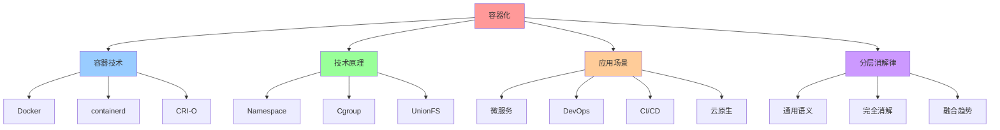
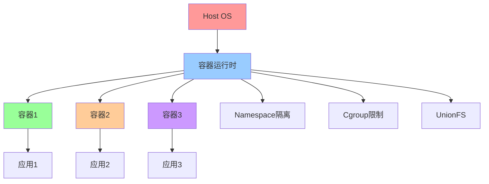
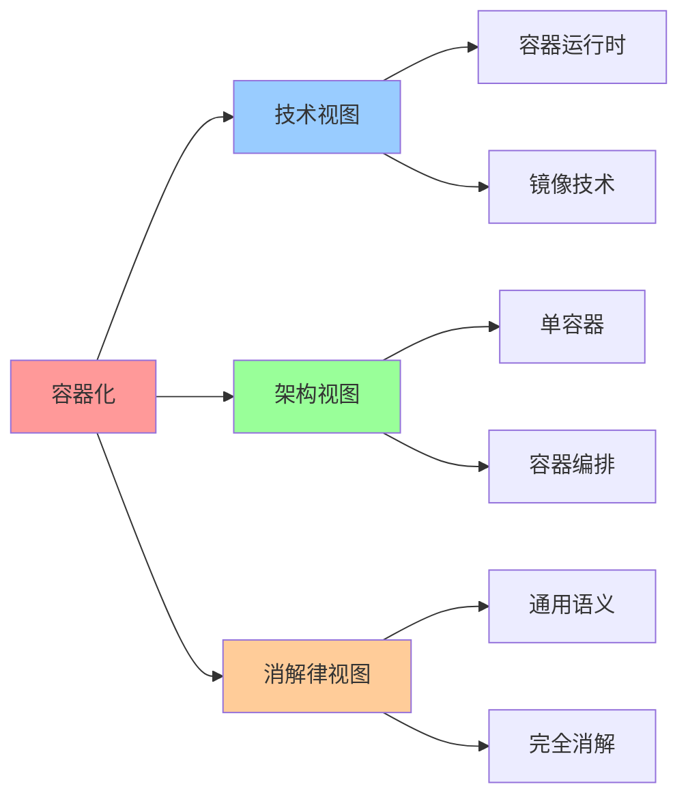

# 容器化（Containerization）

## 📑 目录

- [容器化（Containerization）](#容器化containerization)
  - [📑 目录](#-目录)
  - [1 概述](#1-概述)
    - [1.1 Wikipedia 定义](#11-wikipedia-定义)
    - [1.2 文档定位](#12-文档定位)
  - [2 Wikipedia 定义与解释](#2-wikipedia-定义与解释)
    - [2.1 核心定义](#21-核心定义)
    - [2.2 技术原理](#22-技术原理)
    - [2.3 应用场景](#23-应用场景)
  - [3 与虚拟化、沙盒化的关系](#3-与虚拟化沙盒化的关系)
    - [3.1 技术对比](#31-技术对比)
    - [3.2 适用场景](#32-适用场景)
    - [3.3 融合趋势](#33-融合趋势)
  - [4 在分层消解律中的位置](#4-在分层消解律中的位置)
    - [4.1 语义层级](#41-语义层级)
    - [4.2 消解率](#42-消解率)
    - [4.3 残留语义](#43-残留语义)
  - [5 2025 年 11 月趋势](#5-2025-年-11-月趋势)
    - [5.1 技术趋势](#51-技术趋势)
    - [5.2 架构演进](#52-架构演进)
  - [6 总结](#6-总结)
  - [7 参考资源](#7-参考资源)
    - [7.1 Wikipedia 资源](#71-wikipedia-资源)
    - [7.2 技术文档](#72-技术文档)
    - [7.3 相关文档](#73-相关文档)
  - [8 🧠 认知增强：思维导图、建模视图与图表达转换](#8--认知增强思维导图建模视图与图表达转换)
    - [8.1 容器化完整思维导图](#81-容器化完整思维导图)
    - [8.2 容器化建模视图](#82-容器化建模视图)
      - [容器化架构视图](#容器化架构视图)
    - [8.3 容器化多维关系矩阵](#83-容器化多维关系矩阵)
      - [容器技术-原理-应用映射矩阵](#容器技术-原理-应用映射矩阵)
    - [8.4 图表达和转换](#84-图表达和转换)
      - [容器化视图转换关系](#容器化视图转换关系)
    - [8.5 形象化解释论证](#85-形象化解释论证)
      - [1. 容器化 = 标准化集装箱](#1-容器化--标准化集装箱)
      - [2. Namespace = 房间隔离](#2-namespace--房间隔离)
      - [3. 容器化消解 = 通用基础设施](#3-容器化消解--通用基础设施)
    - [8.6 专家观点与论证](#86-专家观点与论证)
      - [计算信息软件科学家的观点](#计算信息软件科学家的观点)
        - [1. Solomon Hykes（Docker创始人）](#1-solomon-hykesdocker创始人)
        - [2. Brendan Burns（Kubernetes创始人）](#2-brendan-burnskubernetes创始人)
      - [计算信息软件教育家的观点](#计算信息软件教育家的观点)
        - [1. Kelsey Hightower（Kubernetes教育家）](#1-kelsey-hightowerkubernetes教育家)
        - [2. Liz Rice（容器安全教育家）](#2-liz-rice容器安全教育家)
      - [计算信息软件认知学家的观点](#计算信息软件认知学家的观点)
        - [1. David Marr（计算认知科学家）](#1-david-marr计算认知科学家)
        - [2. Douglas Hofstadter（认知科学家）](#2-douglas-hofstadter认知科学家)
    - [8.7 认知学习路径矩阵](#87-认知学习路径矩阵)
    - [8.8 专家推荐阅读路径](#88-专家推荐阅读路径)

---

## 1 概述

本文档基于**Wikipedia 定义**系统阐述容器化（Containerization）的概念、技术原理和
应用场景，并分析其在分层消解律中的位置。

### 1.1 Wikipedia 定义

**容器化（Containerization）**：容器化是一种操作系统级虚拟化方法，通过容器在单个
操作系统内核上运行多个隔离的用户空间实例。

**来
源**：[Wikipedia - OS-level virtualization](https://en.wikipedia.org/wiki/OS-level_virtualization)

### 1.2 文档定位

- **目标读者**：架构师、DevOps 工程师、容器技术研究者
- **前置知识**：操作系统、Linux 内核、容器技术
- **关联文档**：
  - [`../01-core-themes/01-technology-essence.md`](../01-core-themes/01-technology-essence.md) -
    技术本质与演进趋势
  - [`01-virtualization.md`](01-virtualization.md) - 虚拟化（Virtualization）
  - [`03-sandboxing.md`](03-sandboxing.md) - 沙盒化（Sandboxing）

---

## 2 Wikipedia 定义与解释

### 2.1 核心定义

**容器化（Containerization）**：

> **容器化是一种操作系统级虚拟化方法，通过容器在单个操作系统内核上运行多个隔离的
> 用户空间实例。**

**核心特征**：

- **操作系统级虚拟化**：在单个操作系统内核上运行多个隔离的用户空间实例
- **资源隔离**：通过命名空间、cgroups 等技术实现资源隔离
- **轻量级**：相比虚拟机，容器更轻量级，启动更快

### 2.2 技术原理

**容器化技术原理**：

- **命名空间（Namespaces）**：实现进程、网络、文件系统等资源的隔离
- **控制组（cgroups）**：限制和监控容器的资源使用
- **联合文件系统（UnionFS）**：实现容器镜像的分层存储

**典型实现**：

- **Docker**：最流行的容器化平台
- **containerd**：容器运行时
- **CRI-O**：Kubernetes 容器运行时

### 2.3 应用场景

**容器化应用场景**：

- **微服务架构**：将应用拆分为多个微服务，每个微服务运行在独立容器中
- **DevOps 流程**：通过容器实现应用的快速构建、部署和回滚
- **云原生应用**：容器是云原生应用的基础运行时
- **CI/CD 流水线**：容器化应用便于在 CI/CD 流水线中测试和部署

---

## 3 与虚拟化、沙盒化的关系

### 3.1 技术对比

**容器化 vs 虚拟化 vs 沙盒化**：

| 维度         | 容器化           | 虚拟化             | 沙盒化               |
| ------------ | ---------------- | ------------------ | -------------------- |
| **隔离级别** | 进程级隔离       | 硬件级隔离         | 系统调用级隔离       |
| **启动时间** | 秒级（1-5s）     | 分钟级（30-60s）   | 毫秒级（<100ms）     |
| **资源开销** | 中（共享内核）   | 高（完整操作系统） | 低（轻量级运行时）   |
| **安全性**   | 中（进程级隔离） | 高（硬件级隔离）   | 中（系统调用过滤）   |
| **适用场景** | 微服务、DevOps   | 多租户、安全敏感   | Serverless、边缘计算 |

### 3.2 适用场景

**容器化适用场景**：

- **微服务架构**：将应用拆分为多个微服务，每个微服务运行在独立容器中
- **DevOps 流程**：通过容器实现应用的快速构建、部署和回滚
- **云原生应用**：容器是云原生应用的基础运行时

### 3.3 融合趋势

**容器化与虚拟化的融合趋势**：

- **Kata Containers**：结合虚拟机和容器的优势，提供 VM 级隔离和容器速度
- **gVisor**：Google 开发的用户态内核，通过系统调用拦截提供额外隔离层
- **Firecracker**：AWS 开发的轻量级虚拟化技术，用于 Lambda 和 Fargate

---

## 4 在分层消解律中的位置

### 4.1 语义层级

**容器化在分层消解律中的位置**：

```plaintext
┌────────────────────────────────────────────────────────┐
│ 层1：通用计算语义层 (General-Purpose Computing Layer)  │
│ 职责：资源调度、进程隔离、网络虚拟化、存储抽象            │
│ 实现：容器运行时、CNI、CSI、gVisor、Kata Containers     │
│ 不可替代性：★☆☆☆☆ (完全通用)                          │
└────────────────────────────────────────────────────────┘
```

**核心特征**：

- **语义层级**：层 1（通用计算语义层）
- **消解率**：100%（完全被基础设施消解）
- **残留语义**：无（完全通用）

### 4.2 消解率

**容器化消解率**：

- **消解率**：100%（完全被基础设施消解）
- **消解方式**：容器运行时、容器编排平台（如 Kubernetes）
- **残留语义**：无（完全通用）

### 4.3 残留语义

**容器化残留语义**：

- **残留语义**：无（完全通用）
- **原因**：容器化是通用计算语义，不包含领域特定语义
- **结论**：容器化可以被完全消解，无需领域特定设计

---

## 5 2025 年 11 月趋势

### 5.1 技术趋势

**2025 年 11 月技术趋势**：

1. **容器运行时标准化**：containerd、CRI-O 等容器运行时标准化
2. **容器安全增强**：通过 Kata Containers、gVisor 等增强容器安全性
3. **边缘容器**：K3s、KubeEdge 等轻量级容器编排平台在边缘计算中普及

### 5.2 架构演进

**架构演进方向**：

- **容器运行时标准化**：从 Docker 向 containerd、CRI-O 等标准化运行时演进
- **容器安全增强**：通过 Kata Containers、gVisor 等增强容器安全性
- **边缘容器**：容器技术向边缘计算延伸，实现边缘容器编排

---

## 6 总结

**容器化（Containerization）核心结论**：

1. **Wikipedia 定义**：容器化是一种操作系统级虚拟化方法，通过容器在单个操作系统
   内核上运行多个隔离的用户空间实例
2. **技术原理**：通过命名空间、cgroups、联合文件系统等技术实现资源隔离
3. **应用场景**：微服务架构、DevOps 流程、云原生应用、CI/CD 流水线
4. **在分层消解律中的位置**：层 1（通用计算语义层），消解率 100%
5. **与虚拟化、沙盒化的关系**：容器化提供进程级隔离，虚拟化提供硬件级隔离，沙盒
   化提供系统调用级隔离

**核心结论**：容器化是通用计算语义，可以被完全消解，无需领域特定设计。容器化与虚
拟化、沙盒化的融合趋势明显，形成混合部署模式。

---

## 7 参考资源

### 7.1 Wikipedia 资源

- [OS-level virtualization](https://en.wikipedia.org/wiki/OS-level_virtualization)
- [Container (computing)](<https://en.wikipedia.org/wiki/Container_(computing)>)
- [Docker (software)](<https://en.wikipedia.org/wiki/Docker_(software)>)

### 7.2 技术文档

- [Docker Documentation](https://docs.docker.com/)
- [containerd Documentation](https://containerd.io/docs/)
- [CRI-O Documentation](https://cri-o.io/docs/)

### 7.3 相关文档

- [`../01-core-themes/01-technology-essence.md`](../01-core-themes/01-technology-essence.md) -
  技术本质与演进趋势
- [`01-virtualization.md`](01-virtualization.md) - 虚拟化（Virtualization）
- [`03-sandboxing.md`](03-sandboxing.md) - 沙盒化（Sandboxing）

---

## 8 🧠 认知增强：思维导图、建模视图与图表达转换

### 8.1 容器化完整思维导图



### 8.2 容器化建模视图

#### 容器化架构视图



### 8.3 容器化多维关系矩阵

#### 容器技术-原理-应用映射矩阵

| 容器技术 | Docker | containerd | CRI-O | 技术原理 | 应用场景 | 认知价值 |
|---------|--------|-----------|-------|---------|---------|---------|
| **Docker** | ✅ 核心 | ❌ 无 | ❌ 无 | Namespace+Cgroup | 开发部署 | 开发理解 |
| **containerd** | ⚠️ 部分 | ✅ 核心 | ❌ 无 | CRI标准 | 生产环境 | 生产理解 |
| **CRI-O** | ❌ 无 | ❌ 无 | ✅ 核心 | OCI标准 | K8s集成 | 集成理解 |
| **通用语义** | ✅ 核心 | ✅ 核心 | ✅ 核心 | 通用框架 | 完全消解 | 消解理解 |

### 8.4 图表达和转换

#### 容器化视图转换关系



### 8.5 形象化解释论证

#### 1. 容器化 = 标准化集装箱

> **类比**：容器化就像标准化集装箱，容器是"集装箱"（标准化的应用打包），镜像是"集装箱模板"（可重复使用的模板），容器运行时是"港口系统"（管理集装箱的系统），编排系统是"物流系统"（管理多个集装箱的系统），就像标准化集装箱通过集装箱、模板、港口、物流组织运输一样，容器化通过容器、镜像、运行时、编排组织应用部署。

**认知价值**：

- **标准化理解**：通过标准化集装箱类比，理解容器化的标准化性
- **模板理解**：通过集装箱模板类比，理解镜像的模板性
- **系统理解**：通过港口系统类比，理解容器运行时的系统性

#### 2. Namespace = 房间隔离

> **类比**：Namespace就像房间隔离，每个容器是"房间"（独立的命名空间），进程是"房间内的人"（在命名空间内的进程），资源是"房间资源"（命名空间内的资源），就像房间隔离通过房间、人、资源组织隔离一样，Namespace通过命名空间、进程、资源组织隔离。

**认知价值**：

- **隔离理解**：通过房间隔离类比，理解Namespace的隔离性
- **空间理解**：通过房间类比，理解命名空间的空间性
- **资源理解**：通过房间资源类比，理解资源的资源性

#### 3. 容器化消解 = 通用基础设施

> **类比**：容器化消解就像通用基础设施，容器化是"基础设施"（通用计算语义），消解是"基础设施化"（将容器化变为基础设施），通用框架是"基础设施标准"（统一的容器化标准），就像通用基础设施通过基础设施、基础设施化、标准组织基础设施一样，容器化消解通过容器化、消解、框架组织通用计算语义。

**认知价值**：

- **基础设施理解**：通过通用基础设施类比，理解容器化的基础设施性
- **消解理解**：通过基础设施化类比，理解消解的消解性
- **标准理解**：通过基础设施标准类比，理解通用框架的标准性

### 8.6 专家观点与论证

#### 计算信息软件科学家的观点

##### 1. Solomon Hykes（Docker创始人）

> "Containerization provides a way to package applications with their dependencies. Understanding containerization helps us understand how to deploy applications consistently."

**在容器化中的应用**：

- **打包理解**：容器化提供打包应用和依赖的方法
- **部署理解**：理解如何一致地部署应用
- **一致性理解**：理解容器化的一致性价值

##### 2. Brendan Burns（Kubernetes创始人）

> "Containerization is the foundation of modern application deployment. Understanding containerization helps us understand how cloud-native applications work."

**在容器化中的应用**：

- **基础理解**：容器化是现代应用部署的基础
- **云原生理解**：理解云原生应用的工作原理
- **技术理解**：理解容器化在云原生中的作用

#### 计算信息软件教育家的观点

##### 1. Kelsey Hightower（Kubernetes教育家）

> "Teaching containerization helps students understand that applications can be packaged and deployed consistently. This is essential for understanding modern DevOps."

**教育价值**：

- **打包理解**：容器化帮助学生理解应用的打包和部署
- **DevOps理解**：学习现代DevOps的基础
- **一致性理解**：理解应用部署的一致性

##### 2. Liz Rice（容器安全教育家）

> "Containerization provides a way to understand application isolation. This helps students understand how to build secure applications."

**教育价值**：

- **隔离理解**：容器化提供理解应用隔离的方法
- **安全理解**：帮助学生理解如何构建安全应用
- **隔离学习**：学习应用隔离的方法

#### 计算信息软件认知学家的观点

##### 1. David Marr（计算认知科学家）

> "Understanding containerization requires understanding it at multiple levels: process isolation, resource management, and application packaging."

**认知价值**：

- **多层次理解**：理解容器化需要多层次理解
- **隔离理解**：理解进程隔离
- **打包理解**：理解应用打包

##### 2. Douglas Hofstadter（认知科学家）

> "Containerization is a cognitive tool that helps us organize and understand complex application deployments. It provides a structured way to think about application packaging."

**认知价值**：

- **认知工具**：容器化是组织信息的认知工具
- **部署理解**：通过容器化理解复杂应用部署
- **结构理解**：容器化提供结构化的思维方式

### 8.7 认知学习路径矩阵

| 学习阶段 | 核心内容 | 形象化理解 | 技术理解 | 实践应用 | 认知目标 |
|---------|---------|-----------|---------|---------|---------|
| **入门** | 容器概念 | 标准化集装箱类比 | 容器定义 | 简单容器 | 建立基础 |
| **进阶** | 容器技术 | 房间隔离类比 | Namespace/Cgroup | 容器管理 | 理解隔离 |
| **高级** | 容器编排 | 物流系统类比 | K8s编排 | 容器编排 | 掌握编排 |
| **专家** | 容器化消解 | 通用基础设施类比 | 消解律理解 | 系统设计 | 掌握消解 |

### 8.8 专家推荐阅读路径

**计算信息软件科学家推荐路径**：

1. **容器定义**：理解容器化的定义和技术原理
2. **容器技术**：掌握Namespace、Cgroup、UnionFS等技术
3. **容器运行时**：理解Docker、containerd、CRI-O等运行时
4. **容器化消解**：学习容器化在分层消解律中的位置

**计算信息软件教育家推荐路径**：

1. **形象化理解**：通过标准化集装箱、房间隔离、通用基础设施等类比，建立直观理解
2. **渐进学习**：从简单容器概念开始，逐步学习复杂容器编排
3. **实践结合**：结合实际项目，理解容器化的应用
4. **思维训练**：通过容器化学习，训练系统性思维能力

**计算信息软件认知学家推荐路径**：

1. **认知模式**：识别容器化中的认知模式
2. **结构理解**：理解容器化揭示的应用结构
3. **跨域应用**：将容器化思维应用到其他领域
4. **认知提升**：通过容器化学习，提升认知能力

---
