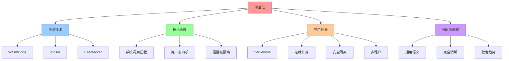
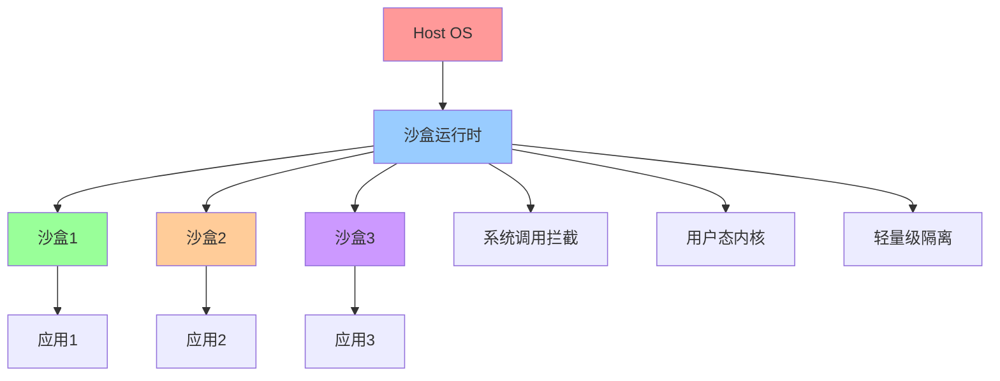
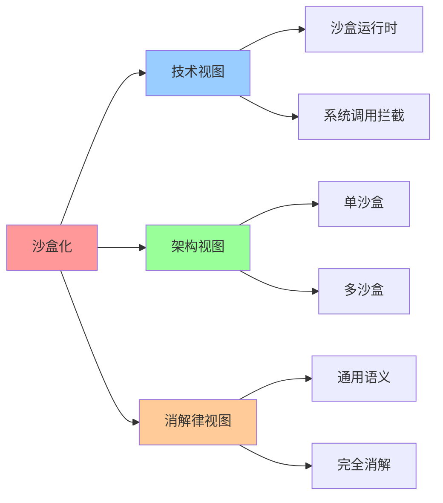

# 沙盒化（Sandboxing）

## 📑 目录

- [沙盒化（Sandboxing）](#沙盒化sandboxing)
  - [📑 目录](#-目录)
  - [1 概述](#1-概述)
    - [1.1 Wikipedia 定义](#11-wikipedia-定义)
    - [1.2 文档定位](#12-文档定位)
  - [2 Wikipedia 定义与解释](#2-wikipedia-定义与解释)
    - [2.1 核心定义](#21-核心定义)
    - [2.2 技术原理](#22-技术原理)
    - [2.3 应用场景](#23-应用场景)
  - [3 与虚拟化、容器化的关系](#3-与虚拟化容器化的关系)
    - [3.1 技术对比](#31-技术对比)
    - [3.2 适用场景](#32-适用场景)
    - [3.3 融合趋势](#33-融合趋势)
  - [4 在分层消解律中的位置](#4-在分层消解律中的位置)
    - [4.1 语义层级](#41-语义层级)
    - [4.2 消解率](#42-消解率)
    - [4.3 残留语义](#43-残留语义)
  - [5 2025 年 11 月趋势](#5-2025-年-11-月趋势)
    - [5.1 技术趋势](#51-技术趋势)
    - [5.2 架构演进](#52-架构演进)
  - [6 总结](#6-总结)
  - [7 参考资源](#7-参考资源)
    - [7.1 Wikipedia 资源](#71-wikipedia-资源)
    - [7.2 技术文档](#72-技术文档)
    - [7.3 相关文档](#73-相关文档)
  - [8 🧠 认知增强：思维导图、建模视图与图表达转换](#8--认知增强思维导图建模视图与图表达转换)
    - [8.1 沙盒化完整思维导图](#81-沙盒化完整思维导图)
    - [8.2 沙盒化建模视图](#82-沙盒化建模视图)
      - [沙盒化架构视图](#沙盒化架构视图)
    - [8.3 沙盒化多维关系矩阵](#83-沙盒化多维关系矩阵)
      - [沙盒技术-原理-应用映射矩阵](#沙盒技术-原理-应用映射矩阵)
    - [8.4 图表达和转换](#84-图表达和转换)
      - [沙盒化视图转换关系](#沙盒化视图转换关系)
    - [8.5 形象化解释论证](#85-形象化解释论证)
      - [1. 沙盒化 = 安全隔离室](#1-沙盒化--安全隔离室)
      - [2. 系统调用拦截 = 安全检查站](#2-系统调用拦截--安全检查站)
      - [3. 沙盒化消解 = 通用安全基础设施](#3-沙盒化消解--通用安全基础设施)
    - [8.6 专家观点与论证](#86-专家观点与论证)
      - [计算信息软件科学家的观点](#计算信息软件科学家的观点)
        - [1. Lin Clark（WebAssembly专家）](#1-lin-clarkwebassembly专家)
        - [2. Brad Fitzpatrick（gVisor创始人）](#2-brad-fitzpatrickgvisor创始人)
      - [计算信息软件教育家的观点](#计算信息软件教育家的观点)
        - [1. Lin Clark（WebAssembly教育家）](#1-lin-clarkwebassembly教育家)
        - [2. Liz Rice（容器安全教育家）](#2-liz-rice容器安全教育家)
      - [计算信息软件认知学家的观点](#计算信息软件认知学家的观点)
        - [1. David Marr（计算认知科学家）](#1-david-marr计算认知科学家)
        - [2. Douglas Hofstadter（认知科学家）](#2-douglas-hofstadter认知科学家)
    - [8.7 认知学习路径矩阵](#87-认知学习路径矩阵)
    - [8.8 专家推荐阅读路径](#88-专家推荐阅读路径)

---

## 1 概述

本文档基于**Wikipedia 定义**系统阐述沙盒化（Sandboxing）的概念、技术原理和应用场
景，并分析其在分层消解律中的位置。

### 1.1 Wikipedia 定义

**沙盒化（Sandboxing）**：在计算机安全中，沙盒是一种安全机制，用于将运行中的程序
与系统其他部分隔离，通常用于执行未测试代码或不受信任的程序。

**来
源**：[Wikipedia - Sandbox (computer security)](<https://en.wikipedia.org/wiki/Sandbox_(computer_security)>)

### 1.2 文档定位

- **目标读者**：安全工程师、系统架构师、沙盒技术研究者
- **前置知识**：操作系统、计算机安全、系统调用
- **关联文档**：
  - [`../01-core-themes/01-technology-essence.md`](../01-core-themes/01-technology-essence.md) -
    技术本质与演进趋势
  - [`01-virtualization.md`](01-virtualization.md) - 虚拟化（Virtualization）
  - [`02-containerization.md`](02-containerization.md) - 容器化
    （Containerization）

---

## 2 Wikipedia 定义与解释

### 2.1 核心定义

**沙盒化（Sandboxing）**：

> **在计算机安全中，沙盒是一种安全机制，用于将运行中的程序与系统其他部分隔离，通
> 常用于执行未测试代码或不受信任的程序。**

**核心特征**：

- **安全隔离**：将运行中的程序与系统其他部分隔离
- **系统调用过滤**：通过系统调用拦截和过滤实现隔离
- **轻量级**：相比虚拟机和容器，沙盒更轻量级，启动更快

### 2.2 技术原理

**沙盒化技术原理**：

- **系统调用拦截**：拦截和过滤系统调用，限制程序对系统资源的访问
- **用户态内核**：在用户态实现内核功能，提供额外隔离层
- **轻量级运行时**：提供轻量级运行时环境，支持快速启动

**典型实现**：

- **gVisor**：Google 开发的用户态内核，通过系统调用拦截提供额外隔离层
- **WebAssembly (Wasm)**：轻量级、安全、高性能的沙盒运行时
- **Firecracker**：AWS 开发的轻量级虚拟化技术，用于 Lambda 和 Fargate

### 2.3 应用场景

**沙盒化应用场景**：

- **Serverless 计算**：AWS Lambda、Google Cloud Functions 等 Serverless 平台使用
  沙盒技术
- **边缘计算**：在资源受限的边缘设备上运行沙盒化应用
- **插件系统**：在插件系统中运行不受信任的代码
- **代码执行环境**：在线代码执行平台（如 CodePen、JSFiddle）使用沙盒技术

---

## 3 与虚拟化、容器化的关系

### 3.1 技术对比

**沙盒化 vs 虚拟化 vs 容器化**：

| 维度         | 沙盒化               | 虚拟化             | 容器化           |
| ------------ | -------------------- | ------------------ | ---------------- |
| **隔离级别** | 系统调用级隔离       | 硬件级隔离         | 进程级隔离       |
| **启动时间** | 毫秒级（<100ms）     | 分钟级（30-60s）   | 秒级（1-5s）     |
| **资源开销** | 低（轻量级运行时）   | 高（完整操作系统） | 中（共享内核）   |
| **安全性**   | 中（系统调用过滤）   | 高（硬件级隔离）   | 中（进程级隔离） |
| **适用场景** | Serverless、边缘计算 | 多租户、安全敏感   | 微服务、DevOps   |

### 3.2 适用场景

**沙盒化适用场景**：

- **Serverless 计算**：AWS Lambda、Google Cloud Functions 等 Serverless 平台
- **边缘计算**：在资源受限的边缘设备上运行沙盒化应用
- **插件系统**：在插件系统中运行不受信任的代码
- **代码执行环境**：在线代码执行平台

### 3.3 融合趋势

**沙盒化与容器化的融合趋势**：

- **WebAssembly (Wasm)**：作为轻量级、安全、高性能的沙盒运行时，在 Serverless、
  边缘计算、插件系统等场景广泛应用
- **gVisor**：Google 开发的用户态内核，通过系统调用拦截提供额外隔离层
- **Firecracker**：AWS 开发的轻量级虚拟化技术，用于 Lambda 和 Fargate

---

## 4 在分层消解律中的位置

### 4.1 语义层级

**沙盒化在分层消解律中的位置**：

```plaintext
┌────────────────────────────────────────────────────────┐
│ 层1：通用计算语义层 (General-Purpose Computing Layer)  │
│ 职责：资源调度、进程隔离、网络虚拟化、存储抽象            │
│ 实现：容器运行时、CNI、CSI、gVisor、Kata Containers     │
│ 不可替代性：★☆☆☆☆ (完全通用)                          │
└────────────────────────────────────────────────────────┘
```

**核心特征**：

- **语义层级**：层 1（通用计算语义层）
- **消解率**：100%（完全被基础设施消解）
- **残留语义**：无（完全通用）

### 4.2 消解率

**沙盒化消解率**：

- **消解率**：100%（完全被基础设施消解）
- **消解方式**：沙盒运行时、沙盒编排平台（如 WasmEdge、gVisor）
- **残留语义**：无（完全通用）

### 4.3 残留语义

**沙盒化残留语义**：

- **残留语义**：无（完全通用）
- **原因**：沙盒化是通用计算语义，不包含领域特定语义
- **结论**：沙盒化可以被完全消解，无需领域特定设计

---

## 5 2025 年 11 月趋势

### 5.1 技术趋势

**2025 年 11 月技术趋势**：

1. **WebAssembly 普及**：Wasm 在 Serverless、边缘计算、插件系统等场景广泛应用
2. **沙盒运行时标准化**：WasmEdge、gVisor 等沙盒运行时标准化
3. **边缘沙盒**：沙盒技术向边缘计算延伸，实现边缘沙盒编排

### 5.2 架构演进

**架构演进方向**：

- **WebAssembly 普及**：Wasm 在 Serverless、边缘计算、插件系统等场景广泛应用
- **沙盒运行时标准化**：从自定义沙盒向 WasmEdge、gVisor 等标准化沙盒运行时演进
- **边缘沙盒**：沙盒技术向边缘计算延伸，实现边缘沙盒编排

---

## 6 总结

**沙盒化（Sandboxing）核心结论**：

1. **Wikipedia 定义**：沙盒是一种安全机制，用于将运行中的程序与系统其他部分隔离
2. **技术原理**：通过系统调用拦截、用户态内核、轻量级运行时等技术实现隔离
3. **应用场景**：Serverless 计算、边缘计算、插件系统、代码执行环境
4. **在分层消解律中的位置**：层 1（通用计算语义层），消解率 100%
5. **与虚拟化、容器化的关系**：沙盒化提供系统调用级隔离，虚拟化提供硬件级隔离，
   容器化提供进程级隔离

**核心结论**：沙盒化是通用计算语义，可以被完全消解，无需领域特定设计。沙盒化与虚
拟化、容器化的融合趋势明显，形成混合部署模式。

---

## 7 参考资源

### 7.1 Wikipedia 资源

- [Sandbox (computer security)](<https://en.wikipedia.org/wiki/Sandbox_(computer_security)>)
- [WebAssembly](https://en.wikipedia.org/wiki/WebAssembly)
- [gVisor](https://en.wikipedia.org/wiki/GVisor)

### 7.2 技术文档

- [WasmEdge Documentation](https://wasmedge.org/docs/)
- [gVisor Documentation](https://gvisor.dev/docs/)
- [Firecracker Documentation](https://firecracker-microvm.github.io/)

### 7.3 相关文档

- [`../01-core-themes/01-technology-essence.md`](../01-core-themes/01-technology-essence.md) -
  技术本质与演进趋势
- [`01-virtualization.md`](01-virtualization.md) - 虚拟化（Virtualization）
- [`02-containerization.md`](02-containerization.md) - 容器化
  （Containerization）

---

## 8 🧠 认知增强：思维导图、建模视图与图表达转换

### 8.1 沙盒化完整思维导图



### 8.2 沙盒化建模视图

#### 沙盒化架构视图



### 8.3 沙盒化多维关系矩阵

#### 沙盒技术-原理-应用映射矩阵

| 沙盒技术 | WasmEdge | gVisor | Firecracker | 技术原理 | 应用场景 | 认知价值 |
|---------|---------|--------|-------------|---------|---------|---------|
| **WasmEdge** | ✅ 核心 | ❌ 无 | ❌ 无 | WebAssembly | Serverless | Wasm理解 |
| **gVisor** | ❌ 无 | ✅ 核心 | ❌ 无 | 用户态内核 | 安全隔离 | 安全理解 |
| **Firecracker** | ❌ 无 | ❌ 无 | ✅ 核心 | 轻量级VM | Lambda/Fargate | 轻量理解 |
| **通用语义** | ✅ 核心 | ✅ 核心 | ✅ 核心 | 通用框架 | 完全消解 | 消解理解 |

### 8.4 图表达和转换

#### 沙盒化视图转换关系



### 8.5 形象化解释论证

#### 1. 沙盒化 = 安全隔离室

> **类比**：沙盒化就像安全隔离室，沙盒是"隔离室"（安全的执行环境），系统调用拦截是"安全检查"（拦截和过滤系统调用），用户态内核是"隔离室管理系统"（管理隔离室的系统），就像安全隔离室通过隔离室、检查、系统组织安全一样，沙盒化通过沙盒、拦截、内核组织安全隔离。

**认知价值**：

- **安全理解**：通过安全隔离室类比，理解沙盒化的安全性
- **隔离理解**：通过隔离室类比，理解沙盒的隔离性
- **检查理解**：通过安全检查类比，理解系统调用拦截的检查性

#### 2. 系统调用拦截 = 安全检查站

> **类比**：系统调用拦截就像安全检查站，系统调用是"通行请求"（应用对系统的请求），拦截是"安全检查"（检查请求是否安全），过滤是"通行控制"（决定是否允许通行），就像安全检查站通过请求、检查、控制组织安全一样，系统调用拦截通过调用、拦截、过滤组织安全。

**认知价值**：

- **检查理解**：通过安全检查站类比，理解系统调用拦截的检查性
- **请求理解**：通过通行请求类比，理解系统调用的请求性
- **控制理解**：通过通行控制类比，理解过滤的控制性

#### 3. 沙盒化消解 = 通用安全基础设施

> **类比**：沙盒化消解就像通用安全基础设施，沙盒化是"基础设施"（通用安全语义），消解是"基础设施化"（将沙盒化变为基础设施），通用框架是"基础设施标准"（统一的沙盒化标准），就像通用安全基础设施通过基础设施、基础设施化、标准组织安全一样，沙盒化消解通过沙盒化、消解、框架组织通用安全语义。

**认知价值**：

- **基础设施理解**：通过通用安全基础设施类比，理解沙盒化的基础设施性
- **消解理解**：通过基础设施化类比，理解消解的消解性
- **标准理解**：通过基础设施标准类比，理解通用框架的标准性

### 8.6 专家观点与论证

#### 计算信息软件科学家的观点

##### 1. Lin Clark（WebAssembly专家）

> "Sandboxing provides a way to execute untrusted code safely. Understanding sandboxing helps us understand how to build secure systems."

**在沙盒化中的应用**：

- **安全理解**：沙盒化提供安全执行不可信代码的方法
- **系统理解**：理解如何构建安全系统
- **执行理解**：理解安全执行的价值

##### 2. Brad Fitzpatrick（gVisor创始人）

> "Sandboxing is essential for multi-tenant systems. Understanding sandboxing helps us understand how to isolate workloads."

**在沙盒化中的应用**：

- **多租户理解**：沙盒化对多租户系统至关重要
- **隔离理解**：理解如何隔离工作负载
- **系统理解**：理解沙盒化在多租户系统中的作用

#### 计算信息软件教育家的观点

##### 1. Lin Clark（WebAssembly教育家）

> "Teaching sandboxing helps students understand that code execution can be isolated. This is essential for understanding modern security."

**教育价值**：

- **隔离理解**：沙盒化帮助学生理解代码执行的隔离
- **安全理解**：学习现代安全的基础
- **执行理解**：理解代码执行的隔离性

##### 2. Liz Rice（容器安全教育家）

> "Sandboxing provides a way to understand security isolation. This helps students understand how to build secure applications."

**教育价值**：

- **隔离理解**：沙盒化提供理解安全隔离的方法
- **安全理解**：帮助学生理解如何构建安全应用
- **隔离学习**：学习安全隔离的方法

#### 计算信息软件认知学家的观点

##### 1. David Marr（计算认知科学家）

> "Understanding sandboxing requires understanding it at multiple levels: system call interception, user-space kernels, and security isolation."

**认知价值**：

- **多层次理解**：理解沙盒化需要多层次理解
- **拦截理解**：理解系统调用拦截
- **隔离理解**：理解安全隔离

##### 2. Douglas Hofstadter（认知科学家）

> "Sandboxing is a cognitive tool that helps us organize and understand complex security mechanisms. It provides a structured way to think about security isolation."

**认知价值**：

- **认知工具**：沙盒化是组织信息的认知工具
- **安全理解**：通过沙盒化理解复杂安全机制
- **结构理解**：沙盒化提供结构化的思维方式

### 8.7 认知学习路径矩阵

| 学习阶段 | 核心内容 | 形象化理解 | 技术理解 | 实践应用 | 认知目标 |
|---------|---------|-----------|---------|---------|---------|
| **入门** | 沙盒概念 | 安全隔离室类比 | 沙盒定义 | 简单沙盒 | 建立基础 |
| **进阶** | 系统调用拦截 | 安全检查站类比 | 拦截技术 | 沙盒管理 | 理解拦截 |
| **高级** | 沙盒技术 | 沙盒架构类比 | WasmEdge/gVisor | 沙盒选型 | 掌握技术 |
| **专家** | 沙盒化消解 | 通用安全基础设施类比 | 消解律理解 | 系统设计 | 掌握消解 |

### 8.8 专家推荐阅读路径

**计算信息软件科学家推荐路径**：

1. **沙盒定义**：理解沙盒化的定义和技术原理
2. **系统调用拦截**：掌握系统调用拦截的技术和实现
3. **沙盒技术**：理解WasmEdge、gVisor、Firecracker等沙盒技术
4. **沙盒化消解**：学习沙盒化在分层消解律中的位置

**计算信息软件教育家推荐路径**：

1. **形象化理解**：通过安全隔离室、安全检查站、通用安全基础设施等类比，建立直观理解
2. **渐进学习**：从简单沙盒概念开始，逐步学习复杂沙盒技术
3. **实践结合**：结合实际项目，理解沙盒化的应用
4. **思维训练**：通过沙盒化学习，训练系统性思维能力

**计算信息软件认知学家推荐路径**：

1. **认知模式**：识别沙盒化中的认知模式
2. **结构理解**：理解沙盒化揭示的安全结构
3. **跨域应用**：将沙盒化思维应用到其他领域
4. **认知提升**：通过沙盒化学习，提升认知能力

---
