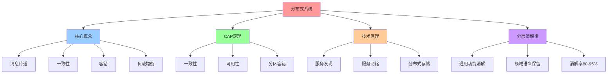
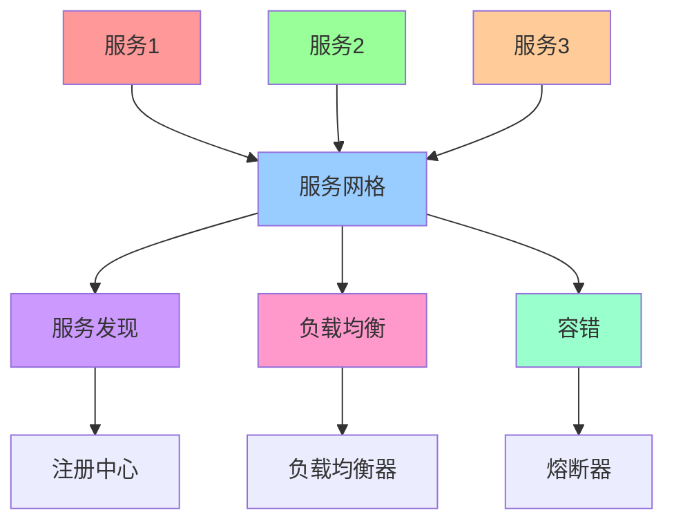
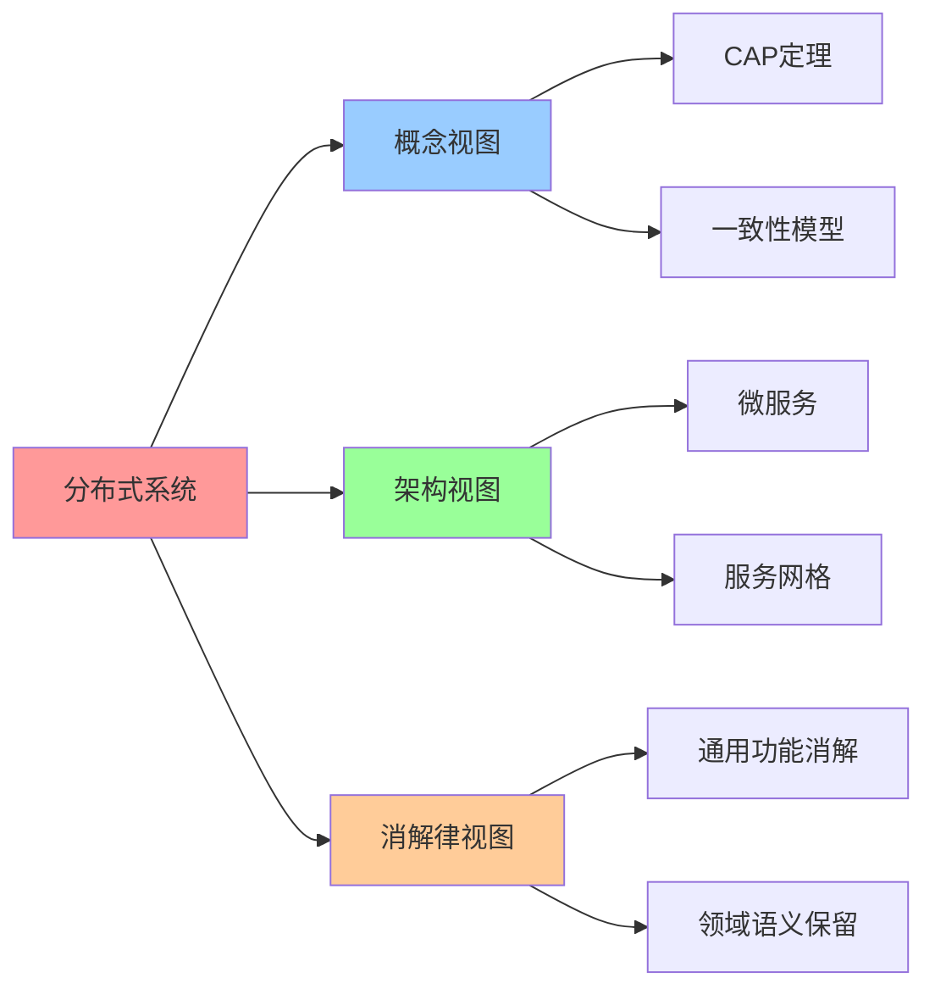

# 分布式系统（Distributed Systems）

## 📑 目录

- [分布式系统（Distributed Systems）](#分布式系统distributed-systems)
  - [📑 目录](#-目录)
  - [1 概述](#1-概述)
    - [1.1 Wikipedia 定义](#11-wikipedia-定义)
    - [1.2 文档定位](#12-文档定位)
  - [2 Wikipedia 定义与解释](#2-wikipedia-定义与解释)
    - [2.1 核心定义](#21-核心定义)
    - [2.2 技术原理](#22-技术原理)
    - [2.3 应用场景](#23-应用场景)
  - [3 CAP 定理](#3-cap-定理)
    - [3.1 CAP 定理定义](#31-cap-定理定义)
    - [3.2 一致性模型](#32-一致性模型)
    - [3.3 在分层消解律中的应用](#33-在分层消解律中的应用)
  - [4 与云原生的关系](#4-与云原生的关系)
    - [4.1 技术对比](#41-技术对比)
    - [4.2 融合趋势](#42-融合趋势)
  - [5 在分层消解律中的位置](#5-在分层消解律中的位置)
    - [5.1 语义层级](#51-语义层级)
    - [5.2 消解率](#52-消解率)
    - [5.3 残留语义](#53-残留语义)
  - [6 2025 年 11 月趋势](#6-2025-年-11-月趋势)
    - [6.1 技术趋势](#61-技术趋势)
    - [6.2 架构演进](#62-架构演进)
  - [7 总结](#7-总结)
  - [8 参考资源](#8-参考资源)
    - [8.1 Wikipedia 资源](#81-wikipedia-资源)
    - [8.2 技术文档](#82-技术文档)
    - [8.3 相关文档](#83-相关文档)
  - [9 🧠 认知增强：思维导图、建模视图与图表达转换](#9--认知增强思维导图建模视图与图表达转换)
    - [9.1 分布式系统完整思维导图](#91-分布式系统完整思维导图)
    - [9.2 分布式系统建模视图](#92-分布式系统建模视图)
      - [分布式系统架构视图](#分布式系统架构视图)
    - [9.3 分布式系统多维关系矩阵](#93-分布式系统多维关系矩阵)
      - [CAP定理-技术-消解律映射矩阵](#cap定理-技术-消解律映射矩阵)
    - [9.4 图表达和转换](#94-图表达和转换)
      - [分布式系统视图转换关系](#分布式系统视图转换关系)
    - [9.5 形象化解释论证](#95-形象化解释论证)
      - [1. 分布式系统 = 多城市协作网络](#1-分布式系统--多城市协作网络)
      - [2. CAP定理 = 三难选择](#2-cap定理--三难选择)
      - [3. 分布式系统消解 = 通用框架与领域语义分工](#3-分布式系统消解--通用框架与领域语义分工)
    - [9.6 专家观点与论证](#96-专家观点与论证)
      - [计算信息软件科学家的观点](#计算信息软件科学家的观点)
        - [1. Leslie Lamport（分布式系统理论创始人）](#1-leslie-lamport分布式系统理论创始人)
        - [2. Eric Brewer（CAP定理提出者）](#2-eric-brewercap定理提出者)
      - [计算信息软件教育家的观点](#计算信息软件教育家的观点)
        - [1. Martin Kleppmann（分布式系统教育家）](#1-martin-kleppmann分布式系统教育家)
        - [2. Andrew Tanenbaum（分布式系统教育家）](#2-andrew-tanenbaum分布式系统教育家)
      - [计算信息软件认知学家的观点](#计算信息软件认知学家的观点)
        - [1. David Marr（计算认知科学家）](#1-david-marr计算认知科学家)
        - [2. Douglas Hofstadter（认知科学家）](#2-douglas-hofstadter认知科学家)
    - [9.7 认知学习路径矩阵](#97-认知学习路径矩阵)
    - [9.8 专家推荐阅读路径](#98-专家推荐阅读路径)

---

## 1 概述

本文档基于**Wikipedia 定义**系统阐述分布式系统（Distributed Systems）的概念、技
术原理和应用场景，并分析其在分层消解律中的位置。

### 1.1 Wikipedia 定义

**分布式系统（Distributed Systems）**：分布式系统是一组计算机的集合，这些计算机
通过网络连接，并通过消息传递进行通信和协调，以实现共同的目标。

**来
源**：[Wikipedia - Distributed computing](https://en.wikipedia.org/wiki/Distributed_computing)

### 1.2 文档定位

- **目标读者**：分布式系统架构师、系统工程师、分布式系统研究者
- **前置知识**：计算机网络、操作系统、分布式计算
- **关联文档**：
  - [`../01-core-themes/02-distributed-computing.md`](../01-core-themes/02-distributed-computing.md) -
    集群分布式计算系统架构演进
  - [`../03-layered-disintegration-law/02-distributed-computing-disintegration.md`](../03-layered-disintegration-law/02-distributed-computing-disintegration.md) -
    分布式计算系统：从手动编排到声明式调度
  - [`05-cloud-native.md`](05-cloud-native.md) - 云原生（Cloud Native）

---

## 2 Wikipedia 定义与解释

### 2.1 核心定义

**分布式系统（Distributed Systems）**：

> **分布式系统是一组计算机的集合，这些计算机通过网络连接，并通过消息传递进行通信
> 和协调，以实现共同的目标。**

**核心特征**：

- **多计算机**：由多个计算机组成的系统
- **网络连接**：通过网络连接进行通信
- **消息传递**：通过消息传递进行协调
- **共同目标**：实现共同的目标

### 2.2 技术原理

**分布式系统技术原理**：

- **消息传递**：通过消息传递进行通信和协调
- **一致性**：保证数据一致性
- **容错**：处理节点故障
- **负载均衡**：分配负载到多个节点

**典型实现**：

- **微服务架构**：将应用拆分为多个微服务，每个微服务运行在独立节点上
- **分布式存储**：将数据分布到多个节点上
- **分布式计算**：将计算任务分布到多个节点上

### 2.3 应用场景

**分布式系统应用场景**：

- **大规模 Web 应用**：Google、Amazon 等大规模 Web 应用
- **分布式数据库**：MySQL Cluster、MongoDB 等分布式数据库
- **分布式计算**：Hadoop、Spark 等分布式计算框架
- **云原生应用**：Kubernetes、Istio 等云原生应用

---

## 3 CAP 定理

### 3.1 CAP 定理定义

**CAP 定理**：

> **在分布式系统中，一致性（Consistency）、可用性（Availability）和分区容错性
> （Partition tolerance）三者不可兼得，最多只能同时满足两个。**

**来源**：[Wikipedia - CAP theorem](https://en.wikipedia.org/wiki/CAP_theorem)

**核心特征**：

- **一致性（Consistency）**：所有节点同时看到相同的数据
- **可用性（Availability）**：系统持续可用，能够响应请求
- **分区容错性（Partition tolerance）**：系统在网络分区时仍能继续运行

### 3.2 一致性模型

**一致性模型**：

- **强一致性**：所有节点同时看到相同的数据（如 Raft、Paxos）
- **最终一致性**：系统最终会达到一致状态（如 DynamoDB、Cassandra）
- **弱一致性**：不保证数据一致性（如 DNS）

### 3.3 在分层消解律中的应用

**CAP 定理在分层消解律中的应用**：

- **语义版本**：通用性、领域表达力、执行效率三者不可兼得
- **领域语义的不可约简性**：业务语义的不可约简性是 CAP 定理的语义版本
- **架构设计原则**：根据业务需求选择一致性、可用性和分区容错性的权衡

---

## 4 与云原生的关系

### 4.1 技术对比

**分布式系统 vs 云原生**：

| 维度         | 分布式系统       | 云原生                |
| ------------ | ---------------- | --------------------- |
| **定义**     | 多计算机系统     | 基于云计算的架构模式  |
| **技术栈**   | 消息传递、一致性 | 容器、编排、服务网格  |
| **应用场景** | 大规模 Web 应用  | 云原生应用            |
| **演进方向** | 从单体到微服务   | 从微服务到 Serverless |

### 4.2 融合趋势

**分布式系统与云原生的融合趋势**：

- **容器化**：分布式系统容器化，实现快速部署和扩展
- **编排**：通过 Kubernetes 等编排平台管理分布式系统
- **服务网格**：通过 Istio 等服务网格实现分布式系统的服务治理

---

## 5 在分层消解律中的位置

### 5.1 语义层级

**分布式系统在分层消解律中的位置**：

```plaintext
┌────────────────────────────────────────────────────────┐
│ 层2：分布式系统语义层 (Distributed System Semantic Layer) │
│ 传统职责：服务发现、负载均衡、容错、一致性、扩缩容             │
│ 新形态：被K8s/Istio/Envoy等框架"语义下沉"                  │
│ 实现：声明式配置、CRD、Service Mesh                         │
│ 不可替代性：★★☆☆☆ (正在被消解)                            │
└────────────────────────────────────────────────────────┘
```

**核心特征**：

- **语义层级**：层 2（分布式系统语义层）
- **消解率**：80-95%（大部分被通用框架消解）
- **残留语义**：部分分布式语义无法被消解，必须显性设计

### 5.2 消解率

**分布式系统消解率**：

- **消解率**：80-95%（大部分被通用框架消解）
- **消解方式**：Kubernetes、Istio、Envoy 等通用框架
- **残留语义**：部分分布式语义无法被消解，必须显性设计

### 5.3 残留语义

**分布式系统残留语义**：

- **残留语义**：部分分布式语义无法被消解，必须显性设计
- **原因**：某些分布式语义是领域特定的，无法被通用框架消解
- **结论**：分布式系统的通用功能可以被消解，但领域特定语义必须显性设计

---

## 6 2025 年 11 月趋势

### 6.1 技术趋势

**2025 年 11 月技术趋势**：

1. **服务网格普及**：Istio、Linkerd 等服务网格在分布式系统中广泛应用
2. **Serverless 演进**：Serverless 架构在分布式系统中普及
3. **边缘计算**：分布式系统向边缘计算延伸

### 6.2 架构演进

**架构演进方向**：

- **服务网格普及**：通过服务网格实现分布式系统的服务治理
- **Serverless 演进**：从微服务向 Serverless 架构演进
- **边缘计算**：分布式系统向边缘计算延伸，实现边缘分布式系统

---

## 7 总结

**分布式系统（Distributed Systems）核心结论**：

1. **Wikipedia 定义**：分布式系统是一组计算机的集合，这些计算机通过网络连接，并
   通过消息传递进行通信和协调
2. **技术原理**：通过消息传递、一致性、容错、负载均衡等技术实现分布式系统
3. **应用场景**：大规模 Web 应用、分布式数据库、分布式计算、云原生应用
4. **CAP 定理**：一致性、可用性和分区容错性三者不可兼得
5. **在分层消解律中的位置**：层 2（分布式系统语义层），消解率 80-95%

**核心结论**：分布式系统的通用功能（服务发现、负载均衡、容错等）可以被通用框架消
解，但领域特定语义（一致性模型、分区策略等）必须显性设计。

---

## 8 参考资源

### 8.1 Wikipedia 资源

- [Distributed computing](https://en.wikipedia.org/wiki/Distributed_computing)
- [CAP theorem](https://en.wikipedia.org/wiki/CAP_theorem)
- [Consistency model](https://en.wikipedia.org/wiki/Consistency_model)

### 8.2 技术文档

- [Kubernetes Documentation](https://kubernetes.io/docs/)
- [Istio Documentation](https://istio.io/docs/)
- [Envoy Documentation](https://www.envoyproxy.io/docs/)

### 8.3 相关文档

- [`../01-core-themes/02-distributed-computing.md`](../01-core-themes/02-distributed-computing.md) -
  集群分布式计算系统架构演进
- [`../03-layered-disintegration-law/02-distributed-computing-disintegration.md`](../03-layered-disintegration-law/02-distributed-computing-disintegration.md) -
  分布式计算系统：从手动编排到声明式调度
- [`05-cloud-native.md`](05-cloud-native.md) - 云原生（Cloud Native）

---

## 9 🧠 认知增强：思维导图、建模视图与图表达转换

### 9.1 分布式系统完整思维导图



### 9.2 分布式系统建模视图

#### 分布式系统架构视图



### 9.3 分布式系统多维关系矩阵

#### CAP定理-技术-消解律映射矩阵

| CAP维度 | 一致性 | 可用性 | 分区容错 | 技术实现 | 消解律位置 | 认知价值 |
|--------|--------|--------|---------|---------|-----------|---------|
| **一致性** | ✅ 核心 | ❌ 无 | ⚠️ 部分 | 分布式事务 | 领域语义 | 一致性理解 |
| **可用性** | ❌ 无 | ✅ 核心 | ⚠️ 部分 | 冗余设计 | 通用功能 | 可用性理解 |
| **分区容错** | ⚠️ 部分 | ⚠️ 部分 | ✅ 核心 | 网络分区 | 通用功能 | 容错理解 |
| **通用功能** | ❌ 无 | ✅ 核心 | ✅ 核心 | 通用框架 | 80-95%消解 | 消解理解 |

### 9.4 图表达和转换

#### 分布式系统视图转换关系



### 9.5 形象化解释论证

#### 1. 分布式系统 = 多城市协作网络

> **类比**：分布式系统就像多城市协作网络，节点是"城市"（分布式系统中的节点），消息传递是"通信网络"（城市间的通信），一致性是"统一规则"（城市间的统一规则），容错是"备用方案"（城市间的备用方案），就像多城市协作网络通过城市、通信、规则、方案组织协作一样，分布式系统通过节点、消息、一致性、容错组织分布式计算。

**认知价值**：

- **网络理解**：通过多城市协作网络类比，理解分布式系统的网络性
- **协作理解**：通过城市协作类比，理解节点的协作性
- **规则理解**：通过统一规则类比，理解一致性的规则性

#### 2. CAP定理 = 三难选择

> **类比**：CAP定理就像三难选择，一致性是"质量"（数据的一致性质量），可用性是"速度"（系统的响应速度），分区容错是"稳定性"（系统的稳定性），就像三难选择通过质量、速度、稳定性组织选择一样，CAP定理通过一致性、可用性、分区容错组织分布式系统的设计选择。

**认知价值**：

- **选择理解**：通过三难选择类比，理解CAP定理的选择性
- **权衡理解**：通过质量、速度、稳定性类比，理解CAP定理的权衡性
- **设计理解**：通过设计选择类比，理解CAP定理的设计性

#### 3. 分布式系统消解 = 通用框架与领域语义分工

> **类比**：分布式系统消解就像通用框架与领域语义分工，通用功能是"基础设施"（服务发现、负载均衡等），领域语义是"业务规则"（一致性模型、分区策略等），消解是"基础设施化"（将通用功能变为基础设施），就像通用框架与领域语义分工通过基础设施、规则、基础设施化组织分工一样，分布式系统消解通过通用功能、领域语义、消解组织分布式系统。

**认知价值**：

- **分工理解**：通过通用框架与领域语义分工类比，理解分布式系统消解的分工性
- **基础设施理解**：通过基础设施类比，理解通用功能的基础设施性
- **规则理解**：通过业务规则类比，理解领域语义的规则性

### 9.6 专家观点与论证

#### 计算信息软件科学家的观点

##### 1. Leslie Lamport（分布式系统理论创始人）

> "A distributed system is one in which the failure of a computer you didn't even know existed can render your own computer unusable."

**在分布式系统中的应用**：

- **失败理解**：分布式系统的失败可能影响整个系统
- **系统理解**：理解分布式系统的复杂性
- **容错理解**：理解容错的重要性

##### 2. Eric Brewer（CAP定理提出者）

> "CAP theorem shows that you can't have all three properties at once. Understanding CAP theorem helps us make informed design decisions."

**在分布式系统中的应用**：

- **权衡理解**：CAP定理显示不能同时拥有所有三个属性
- **设计理解**：理解如何做出明智的设计决策
- **选择理解**：理解分布式系统的设计选择

#### 计算信息软件教育家的观点

##### 1. Martin Kleppmann（分布式系统教育家）

> "Teaching distributed systems helps students understand that building distributed systems is fundamentally different from building single-machine systems."

**教育价值**：

- **差异理解**：分布式系统与单机系统有根本差异
- **系统理解**：学习构建分布式系统的方法
- **复杂性理解**：理解分布式系统的复杂性

##### 2. Andrew Tanenbaum（分布式系统教育家）

> "Distributed systems provide a way to understand how to build scalable systems. This helps students understand modern computing."

**教育价值**：

- **扩展性理解**：分布式系统提供理解如何构建可扩展系统的方法
- **计算理解**：学习现代计算的基础
- **系统理解**：理解可扩展系统的构建方法

#### 计算信息软件认知学家的观点

##### 1. David Marr（计算认知科学家）

> "Understanding distributed systems requires understanding them at multiple levels: network communication, consistency models, and fault tolerance."

**认知价值**：

- **多层次理解**：理解分布式系统需要多层次理解
- **通信理解**：理解网络通信
- **一致性理解**：理解一致性模型

##### 2. Douglas Hofstadter（认知科学家）

> "Distributed systems are cognitive tools that help us organize and understand complex computing systems. They provide a structured way to think about system design."

**认知价值**：

- **认知工具**：分布式系统是组织信息的认知工具
- **系统理解**：通过分布式系统理解复杂计算系统
- **结构理解**：分布式系统提供结构化的思维方式

### 9.7 认知学习路径矩阵

| 学习阶段 | 核心内容 | 形象化理解 | 技术理解 | 实践应用 | 认知目标 |
|---------|---------|-----------|---------|---------|---------|
| **入门** | 分布式概念 | 多城市协作网络类比 | 分布式定义 | 简单分布式 | 建立基础 |
| **进阶** | CAP定理 | 三难选择类比 | CAP理解 | 系统设计 | 理解权衡 |
| **高级** | 一致性模型 | 一致性模型类比 | 一致性技术 | 一致性实现 | 掌握一致性 |
| **专家** | 分布式消解 | 通用框架与领域语义分工类比 | 消解律理解 | 系统设计 | 掌握消解 |

### 9.8 专家推荐阅读路径

**计算信息软件科学家推荐路径**：

1. **分布式定义**：理解分布式系统的定义和技术原理
2. **CAP定理**：掌握CAP定理的理解和应用
3. **一致性模型**：理解各种一致性模型和技术
4. **分布式消解**：学习分布式系统在分层消解律中的位置

**计算信息软件教育家推荐路径**：

1. **形象化理解**：通过多城市协作网络、三难选择、通用框架与领域语义分工等类比，建立直观理解
2. **渐进学习**：从简单分布式概念开始，逐步学习复杂一致性模型
3. **实践结合**：结合实际项目，理解分布式系统的应用
4. **思维训练**：通过分布式系统学习，训练系统性思维能力

**计算信息软件认知学家推荐路径**：

1. **认知模式**：识别分布式系统中的认知模式
2. **结构理解**：理解分布式系统揭示的系统结构
3. **跨域应用**：将分布式系统思维应用到其他领域
4. **认知提升**：通过分布式系统学习，提升认知能力

---
