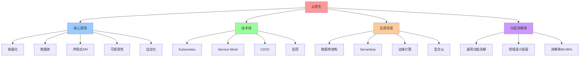
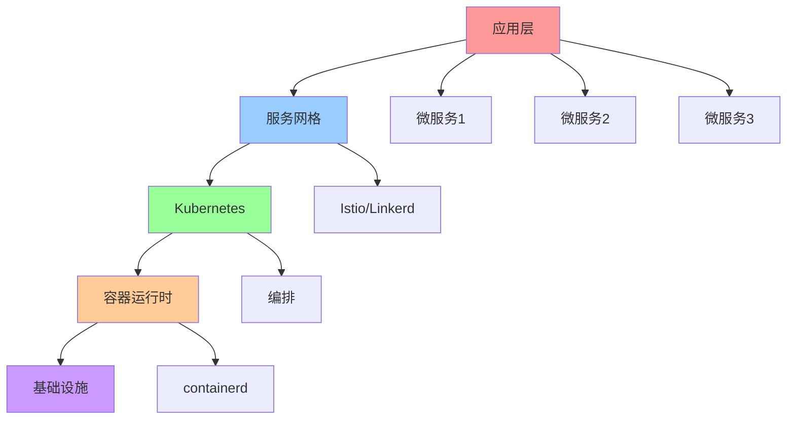
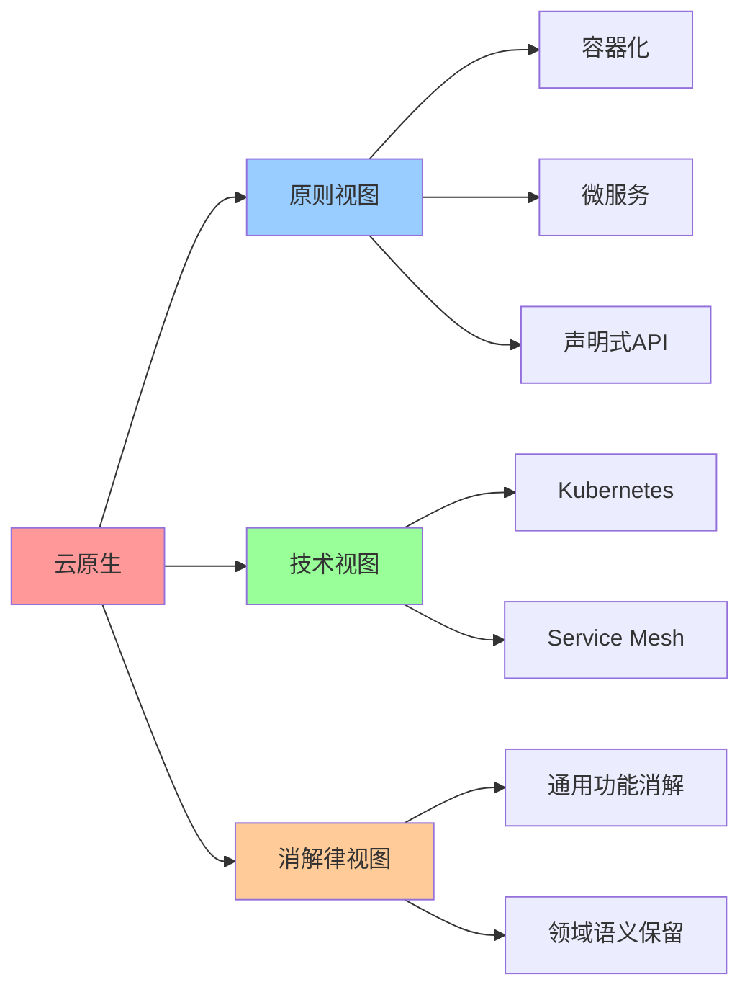

# 云原生（Cloud Native）

## 📑 目录

- [云原生（Cloud Native）](#云原生cloud-native)
  - [📑 目录](#-目录)
  - [1 概述](#1-概述)
    - [1.1 Wikipedia 定义](#11-wikipedia-定义)
    - [1.2 文档定位](#12-文档定位)
  - [2 Wikipedia 定义与解释](#2-wikipedia-定义与解释)
    - [2.1 核心定义](#21-核心定义)
    - [2.2 技术原理](#22-技术原理)
    - [2.3 应用场景](#23-应用场景)
  - [3 核心原则](#3-核心原则)
    - [3.1 CNCF 定义](#31-cncf-定义)
    - [3.2 核心原则](#32-核心原则)
    - [3.3 技术栈](#33-技术栈)
  - [4 与容器化的关系](#4-与容器化的关系)
    - [4.1 技术对比](#41-技术对比)
    - [4.2 融合趋势](#42-融合趋势)
  - [5 在分层消解律中的位置](#5-在分层消解律中的位置)
    - [5.1 语义层级](#51-语义层级)
    - [5.2 消解率](#52-消解率)
    - [5.3 残留语义](#53-残留语义)
  - [6 2025 年 11 月趋势](#6-2025-年-11-月趋势)
    - [6.1 技术趋势](#61-技术趋势)
    - [6.2 架构演进](#62-架构演进)
  - [7 总结](#7-总结)
  - [8 参考资源](#8-参考资源)
    - [8.1 Wikipedia 资源](#81-wikipedia-资源)
    - [8.2 技术文档](#82-技术文档)
    - [8.3 相关文档](#83-相关文档)
  - [9 🧠 认知增强：思维导图、建模视图与图表达转换](#9--认知增强思维导图建模视图与图表达转换)
    - [9.1 云原生完整思维导图](#91-云原生完整思维导图)
    - [9.2 云原生建模视图](#92-云原生建模视图)
      - [云原生架构视图](#云原生架构视图)
    - [9.3 云原生多维关系矩阵](#93-云原生多维关系矩阵)
      - [核心原则-技术-消解律映射矩阵](#核心原则-技术-消解律映射矩阵)
    - [9.4 图表达和转换](#94-图表达和转换)
      - [云原生视图转换关系](#云原生视图转换关系)
    - [9.5 形象化解释论证](#95-形象化解释论证)
      - [1. 云原生 = 现代化工厂](#1-云原生--现代化工厂)
      - [2. 声明式API = 需求说明书](#2-声明式api--需求说明书)
      - [3. 云原生消解 = 通用框架与领域语义分工](#3-云原生消解--通用框架与领域语义分工)
    - [9.6 专家观点与论证](#96-专家观点与论证)
      - [计算信息软件科学家的观点](#计算信息软件科学家的观点)
        - [1. Joe Beda（Kubernetes创始人）](#1-joe-bedakubernetes创始人)
        - [2. Kelsey Hightower（Kubernetes专家）](#2-kelsey-hightowerkubernetes专家)
      - [计算信息软件教育家的观点](#计算信息软件教育家的观点)
        - [1. Kelsey Hightower（Kubernetes教育家）](#1-kelsey-hightowerkubernetes教育家)
        - [2. Liz Rice（云原生教育家）](#2-liz-rice云原生教育家)
      - [计算信息软件认知学家的观点](#计算信息软件认知学家的观点)
        - [1. David Marr（计算认知科学家）](#1-david-marr计算认知科学家)
        - [2. Douglas Hofstadter（认知科学家）](#2-douglas-hofstadter认知科学家)
    - [9.7 认知学习路径矩阵](#97-认知学习路径矩阵)
    - [9.8 专家推荐阅读路径](#98-专家推荐阅读路径)

---

## 1 概述

本文档基于**Wikipedia 定义**系统阐述云原生（Cloud Native）的概念、技术原理和应用
场景，并分析其在分层消解律中的位置。

### 1.1 Wikipedia 定义

**云原生（Cloud Native）**：云原生是一种构建和运行应用程序的方法，利用云计算交付
模型的优势。

**来
源**：[Wikipedia - Cloud native computing](https://en.wikipedia.org/wiki/Cloud_native_computing)

### 1.2 文档定位

- **目标读者**：云原生架构师、DevOps 工程师、云原生技术研究者
- **前置知识**：容器技术、Kubernetes、微服务架构
- **关联文档**：
  - [`../01-core-themes/04-cloud-native-best-practices.md`](../01-core-themes/04-cloud-native-best-practices.md) -
    云原生环境下的最佳实践
  - [`02-containerization.md`](02-containerization.md) - 容器化
    （Containerization）
  - [`04-distributed-systems.md`](04-distributed-systems.md) - 分布式系统
    （Distributed Systems）

---

## 2 Wikipedia 定义与解释

### 2.1 核心定义

**云原生（Cloud Native）**：

> **云原生是一种构建和运行应用程序的方法，利用云计算交付模型的优势。**

**核心特征**：

- **容器化**：应用容器化，实现快速部署和扩展
- **微服务**：应用拆分为微服务，实现独立部署和扩展
- **编排**：通过 Kubernetes 等编排平台管理应用
- **DevOps**：通过 DevOps 流程实现持续集成和持续部署

### 2.2 技术原理

**云原生技术原理**：

- **容器化**：应用容器化，实现快速部署和扩展
- **编排**：通过 Kubernetes 等编排平台管理应用
- **服务网格**：通过 Istio 等服务网格实现服务治理
- **可观测性**：通过 Prometheus、Jaeger 等工具实现可观测性

**典型实现**：

- **Kubernetes**：容器编排平台
- **Istio**：服务网格
- **Prometheus**：监控和告警
- **Jaeger**：分布式追踪

### 2.3 应用场景

**云原生应用场景**：

- **微服务架构**：将应用拆分为微服务，每个微服务运行在独立容器中
- **Serverless 应用**：通过 Serverless 平台运行应用
- **边缘计算**：在边缘设备上运行云原生应用
- **混合云**：在混合云环境中运行云原生应用

---

## 3 核心原则

### 3.1 CNCF 定义

**CNCF 定义**：

> **云原生技术使组织能够在公共云、私有云和混合云等现代动态环境中构建和运行可扩展
> 的应用程序。**

**来
源**：[CNCF - Cloud Native Definition](https://github.com/cncf/toc/blob/main/DEFINITION.md)

### 3.2 核心原则

**云原生核心原则**：

- **容器化**：应用容器化，实现快速部署和扩展
- **微服务**：应用拆分为微服务，实现独立部署和扩展
- **声明式 API**：通过声明式 API 管理应用状态
- **可观测性**：通过监控、日志、追踪实现可观测性
- **自动化**：通过自动化实现持续集成和持续部署

### 3.3 技术栈

**云原生技术栈**：

- **容器运行时**：containerd、CRI-O
- **容器编排**：Kubernetes
- **服务网格**：Istio、Linkerd
- **监控**：Prometheus、Grafana
- **日志**：Loki、Fluentd
- **追踪**：Jaeger、Zipkin

---

## 4 与容器化的关系

### 4.1 技术对比

**云原生 vs 容器化**：

| 维度         | 云原生                | 容器化               |
| ------------ | --------------------- | -------------------- |
| **定义**     | 构建和运行应用的方法  | 操作系统级虚拟化方法 |
| **技术栈**   | 容器、编排、服务网格  | 容器运行时           |
| **应用场景** | 云原生应用            | 容器化应用           |
| **演进方向** | 从微服务到 Serverless | 从容器到编排         |

### 4.2 融合趋势

**云原生与容器化的融合趋势**：

- **容器化是基础**：容器化是云原生的基础技术
- **编排是关键**：通过 Kubernetes 等编排平台实现云原生
- **服务网格是增强**：通过服务网格增强云原生能力

---

## 5 在分层消解律中的位置

### 5.1 语义层级

**云原生在分层消解律中的位置**：

```plaintext
┌────────────────────────────────────────────────────────┐
│ 层2：分布式系统语义层 (Distributed System Semantic Layer) │
│ 传统职责：服务发现、负载均衡、容错、一致性、扩缩容             │
│ 新形态：被K8s/Istio/Envoy等框架"语义下沉"                  │
│ 实现：声明式配置、CRD、Service Mesh                         │
│ 不可替代性：★★☆☆☆ (正在被消解)                            │
└────────────────────────────────────────────────────────┘
```

**核心特征**：

- **语义层级**：层 2（分布式系统语义层）
- **消解率**：80-95%（大部分被通用框架消解）
- **残留语义**：部分分布式语义无法被消解，必须显性设计

### 5.2 消解率

**云原生消解率**：

- **消解率**：80-95%（大部分被通用框架消解）
- **消解方式**：Kubernetes、Istio、Envoy 等通用框架
- **残留语义**：部分分布式语义无法被消解，必须显性设计

### 5.3 残留语义

**云原生残留语义**：

- **残留语义**：部分分布式语义无法被消解，必须显性设计
- **原因**：某些分布式语义是领域特定的，无法被通用框架消解
- **结论**：云原生的通用功能可以被消解，但领域特定语义必须显性设计

---

## 6 2025 年 11 月趋势

### 6.1 技术趋势

**2025 年 11 月技术趋势**：

1. **Kubernetes 1.29**：增强声明式 API，支持更多语义消解
2. **服务网格演进**：Istio 1.20 增强服务网格能力
3. **边缘云原生**：K3s、KubeEdge 等轻量级云原生平台在边缘计算中普及

### 6.2 架构演进

**架构演进方向**：

- **Kubernetes 原生语义**：Kubernetes 增强声明式 API，支持更多语义消解
- **服务网格演进**：Istio 增强服务网格能力，支持更多流量管理语义
- **边缘云原生**：云原生技术向边缘计算延伸，实现边缘云原生

---

## 7 总结

**云原生（Cloud Native）核心结论**：

1. **Wikipedia 定义**：云原生是一种构建和运行应用程序的方法，利用云计算交付模型
   的优势
2. **技术原理**：通过容器化、编排、服务网格、可观测性等技术实现云原生
3. **应用场景**：微服务架构、Serverless 应用、边缘计算、混合云
4. **核心原则**：容器化、微服务、声明式 API、可观测性、自动化
5. **在分层消解律中的位置**：层 2（分布式系统语义层），消解率 80-95%

**核心结论**：云原生的通用功能（服务发现、负载均衡、容错等）可以被通用框架消解，
但领域特定语义（一致性模型、分区策略等）必须显性设计。

---

## 8 参考资源

### 8.1 Wikipedia 资源

- [Cloud native computing](https://en.wikipedia.org/wiki/Cloud_native_computing)
- [Kubernetes](https://en.wikipedia.org/wiki/Kubernetes)
- [Service mesh](https://en.wikipedia.org/wiki/Service_mesh)

### 8.2 技术文档

- [CNCF - Cloud Native Definition](https://github.com/cncf/toc/blob/main/DEFINITION.md)
- [Kubernetes Documentation](https://kubernetes.io/docs/)
- [Istio Documentation](https://istio.io/docs/)

### 8.3 相关文档

- [`../01-core-themes/04-cloud-native-best-practices.md`](../01-core-themes/04-cloud-native-best-practices.md) -
  云原生环境下的最佳实践
- [`02-containerization.md`](02-containerization.md) - 容器化
  （Containerization）
- [`04-distributed-systems.md`](04-distributed-systems.md) - 分布式系统
  （Distributed Systems）

---

## 9 🧠 认知增强：思维导图、建模视图与图表达转换

### 9.1 云原生完整思维导图



### 9.2 云原生建模视图

#### 云原生架构视图



### 9.3 云原生多维关系矩阵

#### 核心原则-技术-消解律映射矩阵

| 核心原则 | 容器化 | 微服务 | 声明式API | 可观测性 | 消解律位置 | 认知价值 |
|---------|--------|--------|----------|---------|-----------|---------|
| **容器化** | ✅ 核心 | ⚠️ 部分 | ⚠️ 部分 | ❌ 无 | 通用功能 | 容器理解 |
| **微服务** | ⚠️ 部分 | ✅ 核心 | ⚠️ 部分 | ⚠️ 部分 | 领域语义 | 服务理解 |
| **声明式API** | ⚠️ 部分 | ⚠️ 部分 | ✅ 核心 | ❌ 无 | 通用功能 | API理解 |
| **可观测性** | ❌ 无 | ⚠️ 部分 | ❌ 无 | ✅ 核心 | 通用功能 | 观测理解 |
| **通用功能** | ✅ 核心 | ❌ 无 | ✅ 核心 | ✅ 核心 | 80-95%消解 | 消解理解 |

### 9.4 图表达和转换

#### 云原生视图转换关系



### 9.5 形象化解释论证

#### 1. 云原生 = 现代化工厂

> **类比**：云原生就像现代化工厂，容器是"标准化生产线"（标准化的应用部署），微服务是"模块化生产"（模块化的服务），Kubernetes是"生产管理系统"（管理生产的系统），Service Mesh是"质量控制系统"（控制质量的系统），就像现代化工厂通过生产线、模块、系统、控制组织生产一样，云原生通过容器、微服务、K8s、Mesh组织应用部署。

**认知价值**：

- **工厂理解**：通过现代化工厂类比，理解云原生的工厂性
- **生产线理解**：通过标准化生产线类比，理解容器的生产线性
- **系统理解**：通过生产管理系统类比，理解Kubernetes的系统性

#### 2. 声明式API = 需求说明书

> **类比**：声明式API就像需求说明书，声明是"需求描述"（描述期望状态），API是"需求格式"（需求的格式），控制器是"需求执行"（执行需求的系统），就像需求说明书通过描述、格式、执行组织需求一样，声明式API通过声明、API、控制器组织应用管理。

**认知价值**：

- **需求理解**：通过需求说明书类比，理解声明式API的需求性
- **描述理解**：通过需求描述类比，理解声明的描述性
- **执行理解**：通过需求执行类比，理解控制器的执行性

#### 3. 云原生消解 = 通用框架与领域语义分工

> **类比**：云原生消解就像通用框架与领域语义分工，通用功能是"基础设施"（容器化、声明式API等），领域语义是"业务规则"（微服务设计、业务逻辑等），消解是"基础设施化"（将通用功能变为基础设施），就像通用框架与领域语义分工通过基础设施、规则、基础设施化组织分工一样，云原生消解通过通用功能、领域语义、消解组织云原生应用。

**认知价值**：

- **分工理解**：通过通用框架与领域语义分工类比，理解云原生消解的分工性
- **基础设施理解**：通过基础设施类比，理解通用功能的基础设施性
- **规则理解**：通过业务规则类比，理解领域语义的规则性

### 9.6 专家观点与论证

#### 计算信息软件科学家的观点

##### 1. Joe Beda（Kubernetes创始人）

> "Cloud native is about building applications that take advantage of cloud computing. Understanding cloud native helps us understand how to build scalable applications."

**在云原生中的应用**：

- **云计算理解**：云原生是关于构建利用云计算优势的应用
- **扩展性理解**：理解如何构建可扩展应用
- **应用理解**：理解云原生应用的价值

##### 2. Kelsey Hightower（Kubernetes专家）

> "Cloud native is not just about technology—it's about culture and practices. Understanding cloud native helps us understand how to build better systems."

**在云原生中的应用**：

- **文化理解**：云原生不仅仅是技术，还包括文化和实践
- **系统理解**：理解如何构建更好的系统
- **实践理解**：理解云原生的实践价值

#### 计算信息软件教育家的观点

##### 1. Kelsey Hightower（Kubernetes教育家）

> "Teaching cloud native helps students understand that building applications for the cloud is different from building traditional applications."

**教育价值**：

- **差异理解**：为云构建应用与传统应用构建有差异
- **应用理解**：学习为云构建应用的方法
- **云理解**：理解云计算的应用构建方法

##### 2. Liz Rice（云原生教育家）

> "Cloud native provides a way to understand modern application architecture. This helps students understand how to build scalable systems."

**教育价值**：

- **架构理解**：云原生提供理解现代应用架构的方法
- **扩展性理解**：帮助学生理解如何构建可扩展系统
- **系统理解**：学习可扩展系统的构建方法

#### 计算信息软件认知学家的观点

##### 1. David Marr（计算认知科学家）

> "Understanding cloud native requires understanding it at multiple levels: containerization, orchestration, and service architecture."

**认知价值**：

- **多层次理解**：理解云原生需要多层次理解
- **容器理解**：理解容器化
- **编排理解**：理解编排

##### 2. Douglas Hofstadter（认知科学家）

> "Cloud native is a cognitive tool that helps us organize and understand modern application architecture. It provides a structured way to think about application design."

**认知价值**：

- **认知工具**：云原生是组织信息的认知工具
- **架构理解**：通过云原生理解现代应用架构
- **结构理解**：云原生提供结构化的思维方式

### 9.7 认知学习路径矩阵

| 学习阶段 | 核心内容 | 形象化理解 | 技术理解 | 实践应用 | 认知目标 |
|---------|---------|-----------|---------|---------|---------|
| **入门** | 云原生概念 | 现代化工厂类比 | 云原生定义 | 简单云原生 | 建立基础 |
| **进阶** | 核心原则 | 需求说明书类比 | 容器化/微服务 | 云原生应用 | 理解原则 |
| **高级** | 技术栈 | 云原生架构类比 | Kubernetes/Mesh | 云原生系统 | 掌握技术 |
| **专家** | 云原生消解 | 通用框架与领域语义分工类比 | 消解律理解 | 系统设计 | 掌握消解 |

### 9.8 专家推荐阅读路径

**计算信息软件科学家推荐路径**：

1. **云原生定义**：理解云原生的定义和核心原则
2. **技术栈**：掌握Kubernetes、Service Mesh等技术栈
3. **核心原则**：理解容器化、微服务、声明式API等核心原则
4. **云原生消解**：学习云原生在分层消解律中的位置

**计算信息软件教育家推荐路径**：

1. **形象化理解**：通过现代化工厂、需求说明书、通用框架与领域语义分工等类比，建立直观理解
2. **渐进学习**：从简单云原生概念开始，逐步学习复杂技术栈
3. **实践结合**：结合实际项目，理解云原生的应用
4. **思维训练**：通过云原生学习，训练系统性思维能力

**计算信息软件认知学家推荐路径**：

1. **认知模式**：识别云原生中的认知模式
2. **结构理解**：理解云原生揭示的应用结构
3. **跨域应用**：将云原生思维应用到其他领域
4. **认知提升**：通过云原生学习，提升认知能力

---
