# 00. 认知图谱：云原生容器技术栈快速认知指南

## 📑 目录

- [00.1 文档定位](#001-文档定位)
- [00.2 核心思维导图](#002-核心思维导图)
  - [00.2.1 全局知识地图](#0021-全局知识地图)
  - [00.2.2 技术演进路径（演化主线）](#0022-技术演进路径演化主线)
  - [00.2.3 应用场景地图](#0023-应用场景地图)
- [00.3 核心概念定义](#003-核心概念定义)
  - [00.3.1 基础概念](#0031-基础概念)
  - [00.3.2 架构概念](#0032-架构概念)
  - [00.3.3 运行时概念](#0033-运行时概念)
- [00.4 概念属性矩阵](#004-概念属性矩阵)
  - [00.4.1 技术栈属性矩阵](#0041-技术栈属性矩阵)
  - [00.4.2 概念关系矩阵](#0042-概念关系矩阵)
- [00.5 认知路径](#005-认知路径)
  - [00.5.1 新手路径](#0051-新手路径)
  - [00.5.2 进阶路径](#0052-进阶路径)
  - [00.5.3 专家路径](#0053-专家路径)
- [00.6 多维层次结构](#006-多维层次结构)
  - [00.6.1 层次维度](#0061-层次维度)
  - [00.6.2 场景维度](#0062-场景维度)
  - [00.6.3 技术维度](#0063-技术维度)
- [00.7 快速参考表](#007-快速参考表)
  - [00.7.1 技术选型快速参考](#0071-技术选型快速参考)
  - [00.7.2 性能指标快速参考](#0072-性能指标快速参考)
  - [00.7.3 文档导航快速参考](#0073-文档导航快速参考)
- [00.8 形式化定义](#008-形式化定义)
  - [00.8.1 概念体系形式化](#0081-概念体系形式化)
  - [00.8.2 技术演进形式化](#0082-技术演进形式化)
  - [00.8.3 认知路径形式化](#0083-认知路径形式化)

---

## 00.1 文档定位

本文档提供云原生容器技术栈的**快速认知图谱**，通过思维导图、概念矩阵、认知路径和
多维结构，帮助快速建立技术认知体系。

**核心价值**：

- **快速认知**：通过思维导图快速理解整体结构
- **概念清晰**：核心概念的定义、属性和关系
- **学习路径**：从新手到专家的认知路径
- **多维视角**：不同维度的层次结构

## 00.2 核心思维导图

### 00.2.1 全局知识地图

```mermaid
mindmap
  root((云原生容器栈))
    理念层
      容器化
        一次构建任意运行
        Dev/Prod 一致性
        不可变基础设施
      声明式
        期望状态 > 实际状态
        控制循环
        API 对象
      弹性
        自愈
        水平伸缩
        自动扩缩容
    架构层
      Docker
        镜像层存储
        Namespace/Cgroups
        containerd/runc
        OCI 标准
      Kubernetes
        Pod/Service/Ingress
        Controller/Operator
        etcd 存储
        CRI 接口
      K3s
        单二进制
        sqlite/etcd
        内置 CNI/Ingress
        裁剪 Alpha API
      Service Mesh
        透明通信层
        Sidecar/Ambient 模式
        mTLS 零信任
        流量治理
        可观测性
    运行时层
      传统容器
        Docker + runc
        containerd
        OCI Runtime
      Wasm 容器
        WasmEdge
        crun
        runwasi
        零 rootfs
    策略层
      OPA
        Rego 语言
        Gatekeeper
        Kyverno
      OPA-Wasm
        编译到 Wasm
        WasmEdge 执行
        低延迟策略
    场景层
      边缘计算
        5G MEC
        工业 IoT
        在线游戏
      Serverless
        函数即服务
        极速冷启动
        高密度部署
      AI 推理
        模型 Wasm 化
        GPU 加速
        边缘 AI
```



### 00.2.2 技术演进路径（演化主线）

**核心理念：从"集装箱"到"声明式宇宙"的演进**:

```mermaid
graph TB
    A[容器化理念<br/>"集装箱化"] --> B[Docker<br/>2013<br/>打包隔离<br/>"乐高积木的魔法包装盒"]
    B --> C[Kubernetes<br/>2014<br/>编排自愈<br/>"超级机器人管家"]
    C --> D[K3s<br/>2019<br/>轻量边缘<br/>"瑞士军刀版 Kubernetes"]
    C --> E[WasmEdge<br/>2020<br/>字节码运行时<br/>"口袋版 OS"]
    C --> H[Service Mesh<br/>2016+<br/>透明通信层<br/>"微服务通信的操作系统"]
    E --> F[OPA-Wasm<br/>2021+<br/>策略即代码<br/>"微秒级决策"]

    B --> G[OCI 标准<br/>2015-2016<br/>容器规范]

    style A fill:#e1f5ff
    style B fill:#fff4e1
    style C fill:#fff4e1
    style D fill:#fff4e1
    style E fill:#fff4e1
    style F fill:#fff4e1
```

**演化主线（Docker → K8s → K3s → WasmEdge → OPA）**：

| 阶段          | 技术         | 类比       | 解决的问题           | 演化逻辑 |
| ------------- | ------------ | ---------- | -------------------- | -------- |
| **第 1 阶段** | Docker       | 集装箱     | "在我机器能跑"的问题 | 打包问题 |
| **第 2 阶段** | Kubernetes   | 机器人管家 | 大规模编排问题       | 规模问题 |
| **第 3 阶段** | K3s          | 瑞士军刀   | 资源受限环境         | 资源问题 |
| **第 4 阶段** | WasmEdge     | 口袋版 OS  | 冷启动速度           | 速度问题 |
| **第 5 阶段** | Service Mesh | 透明通信层 | 微服务间通信治理     | 通信问题 |
| **第 6 阶段** | OPA-Wasm     | 微秒级决策 | 策略执行延迟         | 延迟问题 |

**一句话总结**：Docker 把"进程"变"镜像"，K8s 把"镜像"变"服务"，K3s 把"服务"塞进"
口袋"，WasmEdge 把"字节码"变"一等公民"，Service Mesh 把"通信"变"透明层
"，OPA-Wasm 把"政策"变"微秒级函数"。

### 00.2.3 应用场景地图

```mermaid
graph LR
    A[应用场景] --> B[边缘计算]
    A --> C[Serverless]
    A --> D[AI 推理]
    A --> E[传统云原生]

    B --> B1[5G MEC<br/>K3s+WasmEdge]
    B --> B2[工业 IoT<br/>K3s+WasmEdge]
    B --> B3[在线游戏<br/>K3s+WasmEdge+GPU]

    C --> C1[函数服务<br/>K3s+WasmEdge]
    C --> C2[API Gateway<br/>WasmEdge+OPA]

    D --> D1[边缘 AI<br/>K3s+WasmEdge+GPU]
    D --> D2[云端 AI<br/>K8s+WasmEdge+GPU]

    E --> E1[大规模集群<br/>K8s+Docker+Service Mesh]
    E --> E2[混合云<br/>K8s中心+K3s边缘+Service Mesh]
    E --> E3[微服务架构<br/>K8s+Istio/Linkerd/Cilium]

    style B fill:#e1f5ff
    style C fill:#e6ffe6
    style D fill:#fff4e1
    style E fill:#ffe6e6
```



## 00.3 核心概念定义

### 00.3.1 基础概念

| 概念           | 定义                        | 核心属性                                | 关键关系                  |
| -------------- | --------------------------- | --------------------------------------- | ------------------------- |
| **容器**       | 带环境的进程                | Namespace、Cgroups、镜像层              | Docker → Kubernetes → K3s |
| **镜像**       | 不可变的应用打包            | OCI 规范、分层存储、Content-addressable | Docker 镜像 → Wasm 模块   |
| **Pod**        | 逻辑主机，共享网络/IPC/存储 | 最小调度单元、共享 Namespace            | Kubernetes 核心对象       |
| **Node**       | Kubernetes 工作节点         | Kubelet、容器运行时、CNI                | 集群基本单元              |
| **Service**    | 稳定网络标识                | ClusterIP、Labels、Selector             | Pod 访问抽象              |
| **Deployment** | 期望副本集                  | Replicas、滚动更新、自愈                | 应用部署抽象              |

### 00.3.2 架构概念

| 概念             | 定义                   | 核心属性                        | 关键关系              |
| ---------------- | ---------------------- | ------------------------------- | --------------------- |
| **控制平面**     | 集群大脑，管理期望状态 | API Server、etcd、Controller    | Kubernetes/K3s 核心   |
| **数据平面**     | 工作负载执行层         | Kubelet、容器运行时、CNI        | Pod 执行层            |
| **CRI**          | 容器运行时接口         | containerd、CRI-O、镜像管理     | Kubernetes 运行时抽象 |
| **RuntimeClass** | 运行时选择器           | handler、调度约束               | 多运行时混部          |
| **Wasm 模块**    | WebAssembly 字节码     | .wasm 文件、零 rootfs、跨平台   | WasmEdge 执行         |
| **Service Mesh** | 服务间通信基础设施层   | Sidecar/Ambient、mTLS、流量治理 | Istio/Linkerd/Cilium  |
| **OPA**          | 策略即代码引擎         | Rego 语言、编译到 Wasm          | 策略决策引擎          |

### 00.3.3 运行时概念

| 概念           | 定义                      | 核心属性                   | 关键关系          |
| -------------- | ------------------------- | -------------------------- | ----------------- |
| **runc**       | OCI 标准 Linux 容器运行时 | Namespace、Cgroups、rootfs | Docker 默认运行时 |
| **crun**       | C 实现的 OCI 运行时       | 支持 Wasm、自动识别        | Wasm 容器运行时   |
| **runwasi**    | Wasm shim for containerd  | 原生集成、统一管理         | Wasm CRI 集成     |
| **containerd** | 容器运行时守护进程        | CRI 实现、镜像管理         | Kubernetes CRI    |
| **WasmEdge**   | WebAssembly 运行时        | WASI、WASI-NN、GPU Plugin  | Wasm 字节码执行   |

## 00.4 概念属性矩阵

> **详细矩阵分析**：参见 [09. 矩阵视角](../09-matrix-perspective/README.md) - 完
> 整的矩阵力学体系

### 00.4.1 技术栈属性矩阵

| 技术             | 层次         | 定位            | 体积   | 启动   | 内存       | 节点数        | 适用场景        |
| ---------------- | ------------ | --------------- | ------ | ------ | ---------- | ------------- | --------------- |
| **Docker**       | 应用打包     | 容器化工具      | ~100MB | < 1s   | ~100MB     | 单机          | 开发/测试       |
| **Kubernetes**   | 集群编排     | 容器编排平台    | ~1GB   | 10-30s | ~512MB     | 1-10000+      | 大规模生产      |
| **K3s**          | 轻量编排     | 边缘 Kubernetes | ~60MB  | < 10s  | ~250MB     | 1-1000        | 边缘/IoT        |
| **WasmEdge**     | 字节码运行时 | Wasm 执行引擎   | ~8MB   | < 10ms | ~2MB       | 3000 Pod/Node | Serverless/边缘 |
| **Service Mesh** | 服务网格     | 透明通信层      | ~500MB | < 1min | ~20MB/服务 | 100-10000+    | 微服务架构      |
| **OPA**          | 策略执行     | 策略引擎        | ~50MB  | ~100ms | ~50MB      | -             | 策略决策        |
| **OPA-Wasm**     | 策略执行     | Wasm 策略引擎   | ~2MB   | < 10ms | ~2MB       | -             | 边缘策略        |

**属性说明**：

- **体积**：二进制/镜像大小
- **启动**：启动时间
- **内存**：运行时内存占用
- **节点数**：支持的集群规模
- **适用场景**：主要应用场景

### 00.4.2 概念关系矩阵

| 概念 A         | 关系   | 概念 B          | 说明                       |
| -------------- | ------ | --------------- | -------------------------- |
| **Docker**     | → 基础 | **Kubernetes**  | K8s 基于 Docker/containerd |
| **Kubernetes** | → 裁剪 | **K3s**         | K3s 是 K8s 的轻量版本      |
| **Kubernetes** | → 支持 | **WasmEdge**    | K8s 通过 CRI 支持 WasmEdge |
| **K3s**        | → 优化 | **WasmEdge**    | K3s 边缘场景优化 WasmEdge  |
| **OPA**        | → 编译 | **OPA-Wasm**    | OPA 策略编译到 Wasm        |
| **WasmEdge**   | → 执行 | **OPA-Wasm**    | WasmEdge 执行 Wasm 策略    |
| **Docker**     | → 标准 | **OCI**         | Docker 推动 OCI 标准       |
| **Kubernetes** | → 接口 | **CRI**         | K8s 定义 CRI 接口          |
| **containerd** | → 实现 | **CRI**         | containerd 实现 CRI        |
| **runc**       | → 实现 | **OCI Runtime** | runc 实现 OCI Runtime Spec |

**关系类型**：

- **→ 基础**：B 基于 A 构建
- **→ 裁剪**：B 是 A 的轻量版本
- **→ 支持**：A 支持 B
- **→ 优化**：A 针对 B 场景优化
- **→ 编译**：A 编译到 B
- **→ 执行**：A 执行 B
- **→ 标准**：A 推动 B 标准
- **→ 接口**：A 定义 B 接口
- **→ 实现**：A 实现 B 规范

## 00.5 认知路径

### 00.5.1 新手路径

```mermaid
graph LR
    A[新手] --> B[理解容器]
    B --> C[学习 Docker]
    C --> D[理解编排]
    D --> E[学习 Kubernetes]
    E --> F[实践应用]

    style A fill:#ffe6e6
    style F fill:#e6ffe6
```



**新手路径步骤**：

| 阶段       | 目标            | 核心概念                       | 推荐文档                                                        |
| ---------- | --------------- | ------------------------------ | --------------------------------------------------------------- |
| **阶段 1** | 理解容器概念    | 容器、镜像、Namespace          | [04-docker](../TECHNICAL/00-docker/docker.md)                   |
| **阶段 2** | 掌握 Docker     | Dockerfile、镜像构建、容器运行 | [04-docker](../TECHNICAL/00-docker/docker.md)                   |
| **阶段 3** | 理解编排需求    | Pod、Service、Deployment       | [05-kubernetes](../TECHNICAL/01-kubernetes/kubernetes.md)       |
| **阶段 4** | 学习 Kubernetes | API 对象、控制器、调度         | [05-kubernetes](../TECHNICAL/01-kubernetes/kubernetes.md)       |
| **阶段 5** | 实践应用        | 部署应用、故障排查             | [15-installation](../TECHNICAL/10-installation/installation.md) |

### 00.5.2 进阶路径


**进阶路径步骤**：

| 阶段       | 目标            | 核心概念                         | 推荐文档                                                                                                                        |
| ---------- | --------------- | -------------------------------- | ------------------------------------------------------------------------------------------------------------------------------- |
| **阶段 1** | 深入架构设计    | K3s 裁剪、CRI、RuntimeClass      | [02-k3s](../TECHNICAL/02-k3s/k3s.md) [04-orchestration-runtime](../TECHNICAL/04-orchestration-runtime/orchestration-runtime.md) |
| **阶段 2** | 掌握 WasmEdge   | Wasm 字节码、零 rootfs、集成路线 | [07-wasm-edge](../TECHNICAL/03-wasm-edge/wasmedge.md)                                                                           |
| **阶段 3** | 学习策略即代码  | OPA、Rego、Wasm 编译             | [10-policy-opa](../TECHNICAL/06-policy-opa/policy-opa.md)                                                                       |
| **阶段 4** | 边缘计算场景    | K3s + WasmEdge 组合              | [11-edge-serverless](../TECHNICAL/07-edge-serverless/edge-serverless.md)                                                        |
| **阶段 5** | Serverless 场景 | 极速冷启动、高密度部署           | [11-edge-serverless](../TECHNICAL/07-edge-serverless/edge-serverless.md)                                                        |
| **阶段 6** | AI 推理场景     | 模型 Wasm 化、GPU 加速           | [12-ai-inference](../TECHNICAL/08-ai-inference/ai-inference.md)                                                                 |

### 00.5.3 专家路径

```mermaid
graph TB
    A[专家] --> B[架构设计]
    A --> C[性能优化]
    A --> D[安全合规]

    B --> B1[技术选型]
    B --> B2[组合方案]
    B --> B3[决策框架]

    C --> C1[基准测试]
    C --> C2[优化策略]

    D --> D1[镜像签名]
    D --> D2[策略治理]

    style A fill:#fff4e1
```



**专家路径步骤**：

| 阶段       | 目标           | 核心概念                     | 推荐文档                                                                                    |
| ---------- | -------------- | ---------------------------- | ------------------------------------------------------------------------------------------- |
| **阶段 1** | 架构设计决策   | 技术组合、规格匹配、决策框架 | [05-architecture-design](../05-architecture-design/architecture-design.md)                  |
| **阶段 2** | 性能基准与优化 | 性能指标、对比分析、优化策略 | [04-benchmarks](../04-benchmarks/benchmarks.md)                                             |
| **阶段 3** | 安全与合规     | 镜像签名、SBOM、策略治理     | [09-security-compliance](../TECHNICAL/09-security-compliance/security-compliance.md)        |
| **阶段 4** | 供应链安全     | OCI Artifact、Cosign、SBOM   | [05-oci-supply-chain](../TECHNICAL/05-oci-supply-chain/oci-supply-chain.md)                 |
| **阶段 5** | 实际案例       | 华为 MEC、阿里云 ACK Edge    | [05-architecture-design](../05-architecture-design/architecture-design.md#175-实际应用案例) |

## 00.6 多维层次结构

### 00.6.1 层次维度

```mermaid
graph TB
    A[层次结构] --> B[理念层]
    A --> C[架构层]
    A --> D[运行时层]
    A --> E[策略层]
    A --> F[场景层]

    B --> B1[容器化理念]
    B --> B2[声明式理念]
    B --> B3[弹性理念]

    C --> C1[Docker 架构]
    C --> C2[Kubernetes 架构]
    C --> C3[K3s 架构]

    D --> D1[runc 运行时]
    D --> D2[crun 运行时]
    D --> D3[WasmEdge 运行时]

    E --> E1[OPA 策略]
    E --> E2[OPA-Wasm 策略]

    F --> F1[边缘计算]
    F --> F2[Serverless]
    F --> F3[AI 推理]
```



**层次结构说明**：

- **理念层**：核心思想演进
- **架构层**：系统架构设计
- **运行时层**：容器运行时
- **策略层**：策略执行
- **场景层**：应用场景

### 00.6.2 场景维度

| 场景             | 编排层            | 运行时                 | 存储        | 网络           | 策略     | 特点                           |
| ---------------- | ----------------- | ---------------------- | ----------- | -------------- | -------- | ------------------------------ |
| **大规模生产**   | Kubernetes        | Docker + runc          | etcd        | Calico/Cilium  | OPA      | 成熟稳定                       |
| **边缘计算**     | K3s               | WasmEdge + crun        | sqlite      | flannel        | OPA-Wasm | 轻量高效                       |
| **Serverless**   | K3s/K8s           | WasmEdge + crun        | sqlite/etcd | flannel/Calico | OPA-Wasm | 极速冷启动                     |
| **AI 推理**      | K3s/K8s           | WasmEdge + GPU         | sqlite/etcd | flannel/Calico | OPA-Wasm | GPU 加速（直通，性能>98%）     |
| **深度学习训练** | K8s               | Container/VM + GPU     | sqlite/etcd | flannel/Calico | OPA      | GPU 直通，多 OS 支持，性能>95% |
| **多租户 GPU**   | K8s               | VM + GPU (vGPU/SR-IOV) | sqlite/etcd | flannel/Calico | OPA      | GPU 虚拟化，资源共享           |
| **混合云**       | K8s 中心+K3s 边缘 | Docker+WasmEdge        | etcd+sqlite | Calico+flannel | OPA-Wasm | 统一管理                       |

### 00.6.3 技术维度

```mermaid
graph LR
    A[技术栈] --> B[容器化技术]
    A --> C[编排技术]
    A --> D[运行时技术]
    A --> E[策略技术]

    B --> B1[Docker<br/>OCI Image]
    C --> C1[Kubernetes<br/>K3s]
    D --> D1[runc<br/>crun<br/>WasmEdge]
    E --> E1[OPA<br/>OPA-Wasm]
```



## 00.7 快速参考表

### 00.7.1 技术选型快速参考

| 场景需求         | 推荐技术栈                   | 关键指标           | 设备访问           | 内核特性         |
| ---------------- | ---------------------------- | ------------------ | ------------------ | ---------------- |
| **资源受限**     | K3s + WasmEdge + sqlite      | 内存 < 300MB       | 无需求             | 无需求           |
| **低延迟**       | WasmEdge + crun              | 启动 < 10ms        | 无需求             | 无需求           |
| **大规模集群**   | Kubernetes + Docker + etcd   | 节点 > 1000        | 无需求             | epoll/io_uring   |
| **边缘计算**     | K3s + WasmEdge + flannel     | 离线能力           | 无需求             | 无需求           |
| **Serverless**   | K3s + WasmEdge + HPA         | 冷启动 < 10ms      | 无需求             | 无需求           |
| **AI 推理**      | K3s + WasmEdge + GPU         | 推理延迟 < 50ms    | GPU（直通）        | 无需求           |
| **深度学习训练** | K8s + VM/Container + GPU     | GPU 性能>95%       | GPU（直通）        | 无需求           |
| **多租户 GPU**   | K8s + VM + GPU (vGPU/SR-IOV) | GPU 资源共享       | GPU（vGPU/SR-IOV） | 无需求           |
| **USB/PCI 设备** | K8s + VM（半虚拟化）         | 设备访问           | USB/PCI            | 无需求           |
| **高并发网络**   | K8s + Container              | epoll 延迟 100ns   | 无需求             | epoll（必需）    |
| **高性能数据库** | K8s + Container              | io_uring 延迟 50ns | 无需求             | io_uring（必需） |
| **策略执行**     | OPA-Wasm + Gatekeeper        | 评估延迟 < 1ms     | 无需求             | 无需求           |

> **详细决策指南**：查看
> [10. 技术决策模型](../10-decision-models/QUICK-REFERENCE.md) - 设备访问
> （USB/PCI/GPU）和内核特性决策快速参考

### 00.7.2 性能指标快速参考

| 技术           | 启动时间 | 内存占用 | 镜像体积 | Pod 密度      |
| -------------- | -------- | -------- | -------- | ------------- |
| **Docker**     | 1-2s     | 18-500MB | 10-500MB | 300 Pod/Node  |
| **WasmEdge**   | 6-10ms   | 2-50MB   | 0.9-10MB | 3000 Pod/Node |
| **Kubernetes** | 10-30s   | ~512MB   | ~1GB     | 10000+ 节点   |
| **K3s**        | < 10s    | ~250MB   | ~60MB    | 1000 节点     |
| **OPA**        | ~100ms   | ~50MB    | ~50MB    | -             |
| **OPA-Wasm**   | < 10ms   | ~2MB     | ~2MB     | -             |

### 00.7.3 文档导航快速参考

| 学习目标             | 推荐文档                                                                                      | 核心内容                        |
| -------------------- | --------------------------------------------------------------------------------------------- | ------------------------------- |
| **快速入门**         | [01-overview](../01-overview/overview.md)                                                     | 技术栈总览                      |
| **核心理念**         | [02-principles](../02-principles/principles.md)                                               | 云原生理念                      |
| **架构设计**         | [03-architecture](../03-architecture/architecture.md)                                         | 架构与对象模型                  |
| **执行流与调度**     | [03-execution-flow-scheduling](../03-architecture/execution-flow-scheduling.md)               | 执行流与调度视角                |
| **技术选型决策**     | [10-decision-models](../10-decision-models/decision-models.md)                                | 技术决策模型与权衡框架          |
| **快速参考指南**     | [10-quick-reference](../10-decision-models/QUICK-REFERENCE.md)                                | 设备访问和内核特性决策          |
| **一致性检查报告**   | [10-consistency-report](../10-decision-models/CONSISTENCY-REPORT.md)                          | 文档一致性检查与 Wikipedia 对齐 |
| **Docker 基础**      | [00-docker](../TECHNICAL/00-docker/docker.md)                                                 | Docker 技术规范                 |
| **Kubernetes**       | [01-kubernetes](../TECHNICAL/01-kubernetes/kubernetes.md)                                     | K8s 架构与实践                  |
| **K3s 轻量**         | [02-k3s](../TECHNICAL/02-k3s/k3s.md)                                                          | K3s 轻量级架构                  |
| **WasmEdge**         | [03-wasm-edge](../TECHNICAL/03-wasm-edge/wasmedge.md)                                         | WasmEdge 集成指南               |
| **运行时**           | [04-orchestration-runtime](../TECHNICAL/04-orchestration-runtime/orchestration-runtime.md)    | CRI 与 RuntimeClass             |
| **供应链**           | [05-oci-supply-chain](../TECHNICAL/05-oci-supply-chain/oci-supply-chain.md)                   | OCI 与供应链安全                |
| **策略即代码**       | [06-policy-opa](../TECHNICAL/06-policy-opa/policy-opa.md)                                     | OPA 策略即代码                  |
| **边缘 Serverless**  | [07-edge-serverless](../TECHNICAL/07-edge-serverless/edge-serverless.md)                      | 边缘与 Serverless               |
| **AI 推理**          | [08-ai-inference](../TECHNICAL/08-ai-inference/ai-inference.md)                               | AI 推理                         |
| **安全合规**         | [09-security-compliance](../TECHNICAL/09-security-compliance/security-compliance.md)          | 安全与合规                      |
| **性能基准**         | [04-benchmarks](../04-benchmarks/benchmarks.md)                                               | 性能基线                        |
| **安装部署**         | [10-installation](../TECHNICAL/10-installation/installation.md)                               | 安装与部署                      |
| **故障排查**         | [11-troubleshooting](../TECHNICAL/11-troubleshooting/troubleshooting.md)                      | 故障排查                        |
| **架构设计**         | [05-architecture-design](../05-architecture-design/architecture-design.md)                    | 全局架构设计                    |
| **问题解决方案**     | [06-problem-solution-matrix](../06-problem-solution-matrix/problem-solution-matrix.md)        | 技术问题与部署疑难杂症          |
| **形式化理论**       | [07-formal-theory](../07-formal-theory/formal-theory.md)                                      | 结构同构与关系等价              |
| **范畴论视角**       | [08-category-theory](../08-category-theory/category-theory.md)                                | 对象、态射与函子                |
| **矩阵视角**         | [09-matrix-perspective](../09-matrix-perspective/README.md)                                   | 矩阵力学与数学建模              |
| **网络技术规格堆栈** | [12-network-stack](../TECHNICAL/12-network-stack/network-stack.md)                            | 网络技术与规格全面梳理          |
| **缩写词汇表**       | [13-acronyms-glossary](../TECHNICAL/13-acronyms-glossary/acronyms-glossary.md)                | 所有缩写词定义与关系            |
| **主题清单**         | [14-theme-inventory](../TECHNICAL/14-theme-inventory/theme-inventory.md)                      | 全面梳理所有主题与子主题        |
| **架构框架**         | [28-architecture-framework](../TECHNICAL/28-architecture-framework/architecture-framework.md) | 多维度架构体系与技术规范        |
| **存储技术规格堆栈** | [15-storage-stack](../TECHNICAL/15-storage-stack/storage-stack.md)                            | 存储技术与规格全面梳理          |
| **监控与可观测性**   | [16-observability](../TECHNICAL/16-observability/observability.md)                            | Metrics/Logging/Tracing         |

<!-- cSpell:ignore cicd containerd runc crun runwasi wasmedge WasmEdge WASI OCI Kubernetes K8s K3s RuntimeClass etcd sqlite CRI Pod Service Namespace Cgroups -->

| **GitOps 和持续交付** |
[17-gitops-cicd](../TECHNICAL/17-gitops-cicd/gitops-cicd.md) | GitOps/CI/CD 技术
规范 | | **Operator 和 CRD** |
[18-operator-crd](../TECHNICAL/18-operator-crd/operator-crd.md) | Operator/CRD
开发规范 | | **服务网格** |
[19-service-mesh](../TECHNICAL/19-service-mesh/service-mesh.md) | 服务网格技术规
范（可选） | | **多集群管理** |
[20-multi-cluster](../TECHNICAL/20-multi-cluster/multi-cluster.md) | 多集群管理
技术规范（可选） | | **镜像仓库和镜像管理** |
[21-image-registry](../TECHNICAL/21-image-registry/image-registry.md) | 镜像仓库
与管理技术规范 | | **升级和迁移** |
[22-upgrade-migration](../TECHNICAL/22-upgrade-migration/upgrade-migration.md) |
升级和迁移技术规范 | | **开发和调试工具** |
[23-dev-tools](../TECHNICAL/23-dev-tools/dev-tools.md) | 开发和调试工具规范 | |
**成本优化** |
[24-cost-optimization](../TECHNICAL/24-cost-optimization/cost-optimization.md) |
成本优化技术规范（可选） | | **社区生态和最佳实践** |
[25-community-best-practices](../TECHNICAL/25-community-best-practices/community-best-practices.md)
| 社区生态和最佳实践（可选） | | **文档体系分析与改进** |
[26-analysis-improvement](../TECHNICAL/26-analysis-improvement/analysis-improvement.md)
| 批判性分析和改进计划 | | **2025 年技术趋势汇总** |
[27-2025-trends](../TECHNICAL/27-2025-trends/2025-trends.md) | 2025 年最新技术趋
势和版本信息 |

## 00.8 形式化定义

### 00.8.1 概念体系形式化

**技术栈层次定义**： $$T = \{L, A, R, P, S\}$$

其中：

- $L$ = 理念层（Layer of Principles）
- $A$ = 架构层（Layer of Architecture）
- $R$ = 运行时层（Layer of Runtime）
- $P$ = 策略层（Layer of Policy）
- $S$ = 场景层（Layer of Scenario）

### 00.8.2 技术演进形式化

**技术演进函数**： $$E(t) = \{D(t), K(t), K_3(t), W(t), O(t)\}$$

其中：

- $D(t)$ = Docker 在时间 $t$ 的状态
- $K(t)$ = Kubernetes 在时间 $t$ 的状态
- $K_3(t)$ = K3s 在时间 $t$ 的状态
- $W(t)$ = WasmEdge 在时间 $t$ 的状态
- $O(t)$ = OPA 在时间 $t$ 的状态

**演进关系**：
$$K(t) \supset D(t), \quad K_3(t) \subset K(t), \quad W(t) \perp K(t), \quad O(t) \perp K(t)$$

### 00.8.3 认知路径形式化

**认知路径函数**：

$$
P(l) = \begin{cases}
\text{新手路径} & \text{if } l = \text{beginner} \\
\text{进阶路径} & \text{if } l = \text{intermediate} \\
\text{专家路径} & \text{if } l = \text{expert}
\end{cases}
$$

其中 $l$ 是学习者水平（learner level）。

**认知目标函数**： $$G(l) = \arg\max_{D} \text{Knowledge}(D, l)$$

其中 $D$ 是文档集合，$\text{Knowledge}$ 是知识获取函数。

---

> **使用指南**：
>
> - **快速认知**：查看 [0.2 核心思维导图](#002-核心思维导图)
> - **概念查询**：查看 [0.3 核心概念定义](#003-核心概念定义)
> - **技术选型**：查看 [0.7.1 技术选型快速参考](#0071-技术选型快速参考)
> - **设备访问决策**：查看
>   [10. 技术决策模型](../10-decision-models/QUICK-REFERENCE.md) - 设备访问
>   （USB/PCI/GPU）和内核特性决策快速参考
> - **一致性检查**：查看
>   [10. 一致性检查报告](../10-decision-models/CONSISTENCY-REPORT.md) - 确保所有
>   技术定义与 Wikipedia 标准对齐
> - **学习路径**：查看 [0.5 认知路径](#005-认知路径)
> - **详细文档**：查看 [0.7.3 文档导航快速参考](#0073-文档导航快速参考)
>
> ---
>
> **最后更新**：2025-11-03
