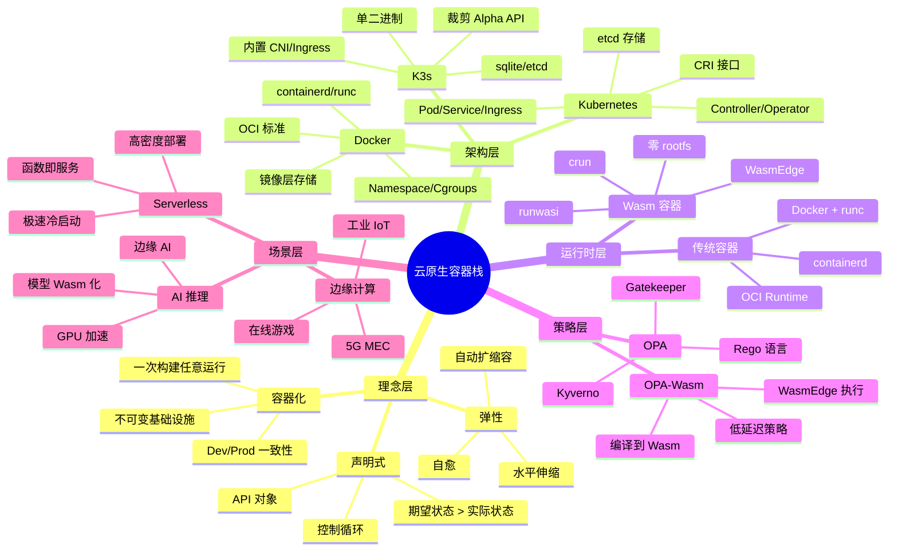
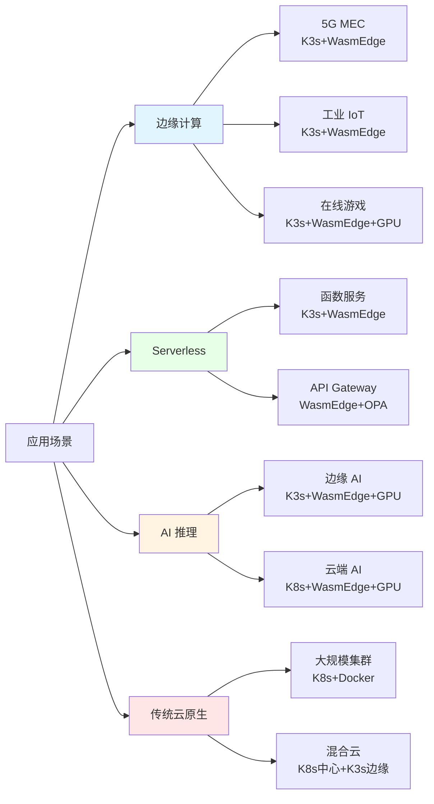

# 0. 认知图谱：云原生容器技术栈快速认知指南

## 目录

- [目录](#目录)
- [0.1 文档定位](#01-文档定位)
- [0.2 核心思维导图](#02-核心思维导图)
  - [0.2.1 全局知识地图](#021-全局知识地图)
  - [0.2.2 技术演进路径（演化主线）](#022-技术演进路径演化主线)
  - [0.2.3 应用场景地图](#023-应用场景地图)
- [0.3 核心概念定义](#03-核心概念定义)
  - [0.3.1 基础概念](#031-基础概念)
  - [0.3.2 架构概念](#032-架构概念)
  - [0.3.3 运行时概念](#033-运行时概念)
- [0.4 概念属性矩阵](#04-概念属性矩阵)
  - [0.4.1 技术栈属性矩阵](#041-技术栈属性矩阵)
  - [0.4.2 概念关系矩阵](#042-概念关系矩阵)
- [0.5 认知路径](#05-认知路径)
  - [0.5.1 新手路径](#051-新手路径)
  - [0.5.2 进阶路径](#052-进阶路径)
  - [0.5.3 专家路径](#053-专家路径)
- [0.6 多维层次结构](#06-多维层次结构)
  - [0.6.1 层次维度](#061-层次维度)
  - [0.6.2 场景维度](#062-场景维度)
  - [0.6.3 技术维度](#063-技术维度)
- [0.7 快速参考表](#07-快速参考表)
  - [0.7.1 技术选型快速参考](#071-技术选型快速参考)
  - [0.7.2 性能指标快速参考](#072-性能指标快速参考)
  - [0.7.3 文档导航快速参考](#073-文档导航快速参考)
- [0.8 形式化定义](#08-形式化定义)
  - [0.8.1 概念体系形式化](#081-概念体系形式化)
  - [0.8.2 技术演进形式化](#082-技术演进形式化)
  - [0.8.3 认知路径形式化](#083-认知路径形式化)

---

## 0.1 文档定位

本文档提供云原生容器技术栈的**快速认知图谱**，通过思维导图、概念矩阵、认知路径和
多维结构，帮助快速建立技术认知体系。

**核心价值**：

- **快速认知**：通过思维导图快速理解整体结构
- **概念清晰**：核心概念的定义、属性和关系
- **学习路径**：从新手到专家的认知路径
- **多维视角**：不同维度的层次结构

## 0.2 核心思维导图

### 0.2.1 全局知识地图



### 0.2.2 技术演进路径（演化主线）

**核心理念：从"集装箱"到"声明式宇宙"的演进**:

```mermaid
graph TB
    A[容器化理念<br/>"集装箱化"] --> B[Docker<br/>2013<br/>打包隔离<br/>"乐高积木的魔法包装盒"]
    B --> C[Kubernetes<br/>2014<br/>编排自愈<br/>"超级机器人管家"]
    C --> D[K3s<br/>2019<br/>轻量边缘<br/>"瑞士军刀版 Kubernetes"]
    C --> E[WasmEdge<br/>2020<br/>字节码运行时<br/>"口袋版 OS"]
    E --> F[OPA-Wasm<br/>2021+<br/>策略即代码<br/>"微秒级决策"]

    B --> G[OCI 标准<br/>2015-2016<br/>容器规范]

    style A fill:#e1f5ff
    style B fill:#fff4e1
    style C fill:#fff4e1
    style D fill:#fff4e1
    style E fill:#fff4e1
    style F fill:#fff4e1
```

**演化主线（Docker → K8s → K3s → WasmEdge → OPA）**：

| 阶段          | 技术       | 类比       | 解决的问题           | 演化逻辑 |
| ------------- | ---------- | ---------- | -------------------- | -------- |
| **第 1 阶段** | Docker     | 集装箱     | "在我机器能跑"的问题 | 打包问题 |
| **第 2 阶段** | Kubernetes | 机器人管家 | 大规模编排问题       | 规模问题 |
| **第 3 阶段** | K3s        | 瑞士军刀   | 资源受限环境         | 资源问题 |
| **第 4 阶段** | WasmEdge   | 口袋版 OS  | 冷启动速度           | 速度问题 |
| **第 5 阶段** | OPA-Wasm   | 微秒级决策 | 策略执行延迟         | 延迟问题 |

**一句话总结**：Docker 把"进程"变"镜像"，K8s 把"镜像"变"服务"，K3s 把"服务"塞进"
口袋"，WasmEdge 把"字节码"变"一等公民"，OPA-Wasm 把"政策"变"微秒级函数"。

### 0.2.3 应用场景地图



## 0.3 核心概念定义

### 0.3.1 基础概念

| 概念           | 定义                        | 核心属性                                | 关键关系                  |
| -------------- | --------------------------- | --------------------------------------- | ------------------------- |
| **容器**       | 带环境的进程                | Namespace、Cgroups、镜像层              | Docker → Kubernetes → K3s |
| **镜像**       | 不可变的应用打包            | OCI 规范、分层存储、Content-addressable | Docker 镜像 → Wasm 模块   |
| **Pod**        | 逻辑主机，共享网络/IPC/存储 | 最小调度单元、共享 Namespace            | Kubernetes 核心对象       |
| **Node**       | Kubernetes 工作节点         | Kubelet、容器运行时、CNI                | 集群基本单元              |
| **Service**    | 稳定网络标识                | ClusterIP、Labels、Selector             | Pod 访问抽象              |
| **Deployment** | 期望副本集                  | Replicas、滚动更新、自愈                | 应用部署抽象              |

### 0.3.2 架构概念

| 概念             | 定义                   | 核心属性                      | 关键关系              |
| ---------------- | ---------------------- | ----------------------------- | --------------------- |
| **控制平面**     | 集群大脑，管理期望状态 | API Server、etcd、Controller  | Kubernetes/K3s 核心   |
| **数据平面**     | 工作负载执行层         | Kubelet、容器运行时、CNI      | Pod 执行层            |
| **CRI**          | 容器运行时接口         | containerd、CRI-O、镜像管理   | Kubernetes 运行时抽象 |
| **RuntimeClass** | 运行时选择器           | handler、调度约束             | 多运行时混部          |
| **Wasm 模块**    | WebAssembly 字节码     | .wasm 文件、零 rootfs、跨平台 | WasmEdge 执行         |
| **OPA**          | 策略即代码引擎         | Rego 语言、编译到 Wasm        | 策略决策引擎          |

### 0.3.3 运行时概念

| 概念           | 定义                      | 核心属性                   | 关键关系          |
| -------------- | ------------------------- | -------------------------- | ----------------- |
| **runc**       | OCI 标准 Linux 容器运行时 | Namespace、Cgroups、rootfs | Docker 默认运行时 |
| **crun**       | C 实现的 OCI 运行时       | 支持 Wasm、自动识别        | Wasm 容器运行时   |
| **runwasi**    | Wasm shim for containerd  | 原生集成、统一管理         | Wasm CRI 集成     |
| **containerd** | 容器运行时守护进程        | CRI 实现、镜像管理         | Kubernetes CRI    |
| **WasmEdge**   | WebAssembly 运行时        | WASI、WASI-NN、GPU Plugin  | Wasm 字节码执行   |

## 0.4 概念属性矩阵

> **详细矩阵分析**：参见 [09. 矩阵视角](../09-matrix-perspective/README.md) - 完
> 整的矩阵力学体系

### 0.4.1 技术栈属性矩阵

| 技术           | 层次         | 定位            | 体积   | 启动   | 内存   | 节点数        | 适用场景        |
| -------------- | ------------ | --------------- | ------ | ------ | ------ | ------------- | --------------- |
| **Docker**     | 应用打包     | 容器化工具      | ~100MB | < 1s   | ~100MB | 单机          | 开发/测试       |
| **Kubernetes** | 集群编排     | 容器编排平台    | ~1GB   | 10-30s | ~512MB | 1-10000+      | 大规模生产      |
| **K3s**        | 轻量编排     | 边缘 Kubernetes | ~60MB  | < 10s  | ~250MB | 1-1000        | 边缘/IoT        |
| **WasmEdge**   | 字节码运行时 | Wasm 执行引擎   | ~8MB   | < 10ms | ~2MB   | 3000 Pod/Node | Serverless/边缘 |
| **OPA**        | 策略执行     | 策略引擎        | ~50MB  | ~100ms | ~50MB  | -             | 策略决策        |
| **OPA-Wasm**   | 策略执行     | Wasm 策略引擎   | ~2MB   | < 10ms | ~2MB   | -             | 边缘策略        |

**属性说明**：

- **体积**：二进制/镜像大小
- **启动**：启动时间
- **内存**：运行时内存占用
- **节点数**：支持的集群规模
- **适用场景**：主要应用场景

### 0.4.2 概念关系矩阵

| 概念 A         | 关系   | 概念 B          | 说明                       |
| -------------- | ------ | --------------- | -------------------------- |
| **Docker**     | → 基础 | **Kubernetes**  | K8s 基于 Docker/containerd |
| **Kubernetes** | → 裁剪 | **K3s**         | K3s 是 K8s 的轻量版本      |
| **Kubernetes** | → 支持 | **WasmEdge**    | K8s 通过 CRI 支持 WasmEdge |
| **K3s**        | → 优化 | **WasmEdge**    | K3s 边缘场景优化 WasmEdge  |
| **OPA**        | → 编译 | **OPA-Wasm**    | OPA 策略编译到 Wasm        |
| **WasmEdge**   | → 执行 | **OPA-Wasm**    | WasmEdge 执行 Wasm 策略    |
| **Docker**     | → 标准 | **OCI**         | Docker 推动 OCI 标准       |
| **Kubernetes** | → 接口 | **CRI**         | K8s 定义 CRI 接口          |
| **containerd** | → 实现 | **CRI**         | containerd 实现 CRI        |
| **runc**       | → 实现 | **OCI Runtime** | runc 实现 OCI Runtime Spec |

**关系类型**：

- **→ 基础**：B 基于 A 构建
- **→ 裁剪**：B 是 A 的轻量版本
- **→ 支持**：A 支持 B
- **→ 优化**：A 针对 B 场景优化
- **→ 编译**：A 编译到 B
- **→ 执行**：A 执行 B
- **→ 标准**：A 推动 B 标准
- **→ 接口**：A 定义 B 接口
- **→ 实现**：A 实现 B 规范

## 0.5 认知路径

### 0.5.1 新手路径


**新手路径步骤**：

| 阶段       | 目标            | 核心概念                       | 推荐文档                                                        |
| ---------- | --------------- | ------------------------------ | --------------------------------------------------------------- |
| **阶段 1** | 理解容器概念    | 容器、镜像、Namespace          | [04-docker](../TECHNICAL/00-docker/docker.md)                   |
| **阶段 2** | 掌握 Docker     | Dockerfile、镜像构建、容器运行 | [04-docker](../TECHNICAL/00-docker/docker.md)                   |
| **阶段 3** | 理解编排需求    | Pod、Service、Deployment       | [05-kubernetes](../TECHNICAL/01-kubernetes/kubernetes.md)       |
| **阶段 4** | 学习 Kubernetes | API 对象、控制器、调度         | [05-kubernetes](../TECHNICAL/01-kubernetes/kubernetes.md)       |
| **阶段 5** | 实践应用        | 部署应用、故障排查             | [15-installation](../TECHNICAL/10-installation/installation.md) |

### 0.5.2 进阶路径


**进阶路径步骤**：

| 阶段       | 目标            | 核心概念                         | 推荐文档                                                                                                                        |
| ---------- | --------------- | -------------------------------- | ------------------------------------------------------------------------------------------------------------------------------- |
| **阶段 1** | 深入架构设计    | K3s 裁剪、CRI、RuntimeClass      | [06-k3s](../TECHNICAL/02-k3s/k3s.md) [08-orchestration-runtime](../TECHNICAL/04-orchestration-runtime/orchestration-runtime.md) |
| **阶段 2** | 掌握 WasmEdge   | Wasm 字节码、零 rootfs、集成路线 | [07-wasm-edge](../TECHNICAL/03-wasm-edge/wasmedge.md)                                                                           |
| **阶段 3** | 学习策略即代码  | OPA、Rego、Wasm 编译             | [10-policy-opa](../TECHNICAL/06-policy-opa/policy-opa.md)                                                                       |
| **阶段 4** | 边缘计算场景    | K3s + WasmEdge 组合              | [11-edge-serverless](../TECHNICAL/07-edge-serverless/edge-serverless.md)                                                        |
| **阶段 5** | Serverless 场景 | 极速冷启动、高密度部署           | [11-edge-serverless](../TECHNICAL/07-edge-serverless/edge-serverless.md)                                                        |
| **阶段 6** | AI 推理场景     | 模型 Wasm 化、GPU 加速           | [12-ai-inference](../TECHNICAL/08-ai-inference/ai-inference.md)                                                                 |

### 0.5.3 专家路径


**专家路径步骤**：

| 阶段       | 目标           | 核心概念                     | 推荐文档                                                                                    |
| ---------- | -------------- | ---------------------------- | ------------------------------------------------------------------------------------------- |
| **阶段 1** | 架构设计决策   | 技术组合、规格匹配、决策框架 | [05-architecture-design](../05-architecture-design/architecture-design.md)                  |
| **阶段 2** | 性能基准与优化 | 性能指标、对比分析、优化策略 | [04-benchmarks](../04-benchmarks/benchmarks.md)                                             |
| **阶段 3** | 安全与合规     | 镜像签名、SBOM、策略治理     | [09-security-compliance](../TECHNICAL/09-security-compliance/security-compliance.md)        |
| **阶段 4** | 供应链安全     | OCI Artifact、Cosign、SBOM   | [05-oci-supply-chain](../TECHNICAL/05-oci-supply-chain/oci-supply-chain.md)                 |
| **阶段 5** | 实际案例       | 华为 MEC、阿里云 ACK Edge    | [05-architecture-design](../05-architecture-design/architecture-design.md#175-实际应用案例) |

## 0.6 多维层次结构

### 0.6.1 层次维度


**层次结构说明**：

- **理念层**：核心思想演进
- **架构层**：系统架构设计
- **运行时层**：容器运行时
- **策略层**：策略执行
- **场景层**：应用场景

### 0.6.2 场景维度

| 场景           | 编排层            | 运行时          | 存储        | 网络           | 策略     | 特点       |
| -------------- | ----------------- | --------------- | ----------- | -------------- | -------- | ---------- |
| **大规模生产** | Kubernetes        | Docker + runc   | etcd        | Calico/Cilium  | OPA      | 成熟稳定   |
| **边缘计算**   | K3s               | WasmEdge + crun | sqlite      | flannel        | OPA-Wasm | 轻量高效   |
| **Serverless** | K3s/K8s           | WasmEdge + crun | sqlite/etcd | flannel/Calico | OPA-Wasm | 极速冷启动 |
| **AI 推理**    | K3s/K8s           | WasmEdge + GPU  | sqlite/etcd | flannel/Calico | OPA-Wasm | GPU 加速   |
| **混合云**     | K8s 中心+K3s 边缘 | Docker+WasmEdge | etcd+sqlite | Calico+flannel | OPA-Wasm | 统一管理   |

### 0.6.3 技术维度


## 0.7 快速参考表

### 0.7.1 技术选型快速参考

| 场景需求       | 推荐技术栈                 | 关键指标        |
| -------------- | -------------------------- | --------------- |
| **资源受限**   | K3s + WasmEdge + sqlite    | 内存 < 300MB    |
| **低延迟**     | WasmEdge + crun            | 启动 < 10ms     |
| **大规模集群** | Kubernetes + Docker + etcd | 节点 > 1000     |
| **边缘计算**   | K3s + WasmEdge + flannel   | 离线能力        |
| **Serverless** | K3s + WasmEdge + HPA       | 冷启动 < 10ms   |
| **AI 推理**    | K3s + WasmEdge + GPU       | 推理延迟 < 50ms |
| **策略执行**   | OPA-Wasm + Gatekeeper      | 评估延迟 < 1ms  |

### 0.7.2 性能指标快速参考

| 技术           | 启动时间 | 内存占用 | 镜像体积 | Pod 密度      |
| -------------- | -------- | -------- | -------- | ------------- |
| **Docker**     | 1-2s     | 18-500MB | 10-500MB | 300 Pod/Node  |
| **WasmEdge**   | 6-10ms   | 2-50MB   | 0.9-10MB | 3000 Pod/Node |
| **Kubernetes** | 10-30s   | ~512MB   | ~1GB     | 10000+ 节点   |
| **K3s**        | < 10s    | ~250MB   | ~60MB    | 1000 节点     |
| **OPA**        | ~100ms   | ~50MB    | ~50MB    | -             |
| **OPA-Wasm**   | < 10ms   | ~2MB     | ~2MB     | -             |

### 0.7.3 文档导航快速参考

| 学习目标             | 推荐文档                                                                                   | 核心内容                 |
| -------------------- | ------------------------------------------------------------------------------------------ | ------------------------ |
| **快速入门**         | [01-overview](../01-overview/overview.md)                                                  | 技术栈总览               |
| **核心理念**         | [02-principles](../02-principles/principles.md)                                            | 云原生理念               |
| **架构设计**         | [03-architecture](../03-architecture/architecture.md)                                      | 架构与对象模型           |
| **Docker 基础**      | [04-docker](../TECHNICAL/00-docker/docker.md)                                              | Docker 技术规范          |
| **Kubernetes**       | [05-kubernetes](../TECHNICAL/01-kubernetes/kubernetes.md)                                  | K8s 架构与实践           |
| **K3s 轻量**         | [06-k3s](../TECHNICAL/02-k3s/k3s.md)                                                       | K3s 轻量级架构           |
| **WasmEdge**         | [07-wasm-edge](../TECHNICAL/03-wasm-edge/wasmedge.md)                                      | WasmEdge 集成指南        |
| **运行时**           | [08-orchestration-runtime](../TECHNICAL/04-orchestration-runtime/orchestration-runtime.md) | CRI 与 RuntimeClass      |
| **供应链**           | [09-oci-supply-chain](../TECHNICAL/05-oci-supply-chain/oci-supply-chain.md)                | OCI 与供应链安全         |
| **策略即代码**       | [10-policy-opa](../TECHNICAL/06-policy-opa/policy-opa.md)                                  | OPA 策略即代码           |
| **边缘 Serverless**  | [11-edge-serverless](../TECHNICAL/07-edge-serverless/edge-serverless.md)                   | 边缘与 Serverless        |
| **AI 推理**          | [12-ai-inference](../TECHNICAL/08-ai-inference/ai-inference.md)                            | AI 推理                  |
| **安全合规**         | [13-security-compliance](../TECHNICAL/09-security-compliance/security-compliance.md)       | 安全与合规               |
| **性能基准**         | [04-benchmarks](../04-benchmarks/benchmarks.md)                                            | 性能基线                 |
| **安装部署**         | [15-installation](../TECHNICAL/10-installation/installation.md)                            | 安装与部署               |
| **故障排查**         | [16-troubleshooting](../TECHNICAL/11-troubleshooting/troubleshooting.md)                   | 故障排查                 |
| **架构设计**         | [05-architecture-design](../05-architecture-design/architecture-design.md)                 | 全局架构设计             |
| **问题解决方案**     | [06-problem-solution-matrix](../06-problem-solution-matrix/problem-solution-matrix.md)     | 技术问题与部署疑难杂症   |
| **形式化理论**       | [07-formal-theory](../07-formal-theory/formal-theory.md)                                   | 结构同构与关系等价       |
| **范畴论视角**       | [08-category-theory](../08-category-theory/category-theory.md)                             | 对象、态射与函子         |
| **矩阵视角**         | [09-matrix-perspective](../09-matrix-perspective/README.md)                                | 矩阵力学与数学建模       |
| **网络技术规格堆栈** | [21-network-stack](../TECHNICAL/12-network-stack/network-stack.md)                         | 网络技术与规格全面梳理   |
| **缩写词汇表**       | [22-acronyms-glossary](../TECHNICAL/13-acronyms-glossary/acronyms-glossary.md)             | 所有缩写词定义与关系     |
| **主题清单**         | [23-theme-inventory](../TECHNICAL/14-theme-inventory/theme-inventory.md)                   | 全面梳理所有主题与子主题 |
| **存储技术规格堆栈** | [24-storage-stack](../TECHNICAL/15-storage-stack/storage-stack.md)                         | 存储技术与规格全面梳理   |
| **监控与可观测性**   | [25-observability](../TECHNICAL/16-observability/observability.md)                         | Metrics/Logging/Tracing  |

<!-- cSpell:ignore cicd containerd runc crun runwasi wasmedge WasmEdge WASI OCI Kubernetes K8s K3s RuntimeClass etcd sqlite CRI Pod Service Namespace Cgroups -->

| **GitOps 和持续交付** |
[26-gitops-cicd](../TECHNICAL/17-gitops-cicd/gitops-cicd.md) | GitOps/CI/CD 技术
规范 | | **Operator 和 CRD** |
[27-operator-crd](../TECHNICAL/18-operator-crd/operator-crd.md) | Operator/CRD
开发规范 | | **服务网格** |
[28-service-mesh](../TECHNICAL/19-service-mesh/service-mesh.md) | 服务网格技术规
范（可选） | | **多集群管理** |
[29-multi-cluster](../TECHNICAL/20-multi-cluster/multi-cluster.md) | 多集群管理
技术规范（可选） | | **镜像仓库和镜像管理** |
[30-image-registry](../TECHNICAL/21-image-registry/image-registry.md) | 镜像仓库
与管理技术规范 | | **升级和迁移** |
[31-upgrade-migration](../TECHNICAL/22-upgrade-migration/upgrade-migration.md) |
升级和迁移技术规范 | | **开发和调试工具** |
[32-dev-tools](../TECHNICAL/23-dev-tools/dev-tools.md) | 开发和调试工具规范 | |
**成本优化** |
[33-cost-optimization](../TECHNICAL/24-cost-optimization/cost-optimization.md) |
成本优化技术规范（可选） | | **社区生态和最佳实践** |
[34-community-best-practices](../TECHNICAL/25-community-best-practices/community-best-practices.md)
| 社区生态和最佳实践（可选） | | **文档体系分析与改进** |
[35-analysis-improvement](../TECHNICAL/26-analysis-improvement/analysis-improvement.md)
| 批判性分析和改进计划 | | **2025 年技术趋势汇总** |
[36-2025-trends](../TECHNICAL/27-2025-trends/2025-trends.md) | 2025 年最新技术趋
势和版本信息 |

## 0.8 形式化定义

### 0.8.1 概念体系形式化

**技术栈层次定义**： $$T = \{L, A, R, P, S\}$$

其中：

- $L$ = 理念层（Layer of Principles）
- $A$ = 架构层（Layer of Architecture）
- $R$ = 运行时层（Layer of Runtime）
- $P$ = 策略层（Layer of Policy）
- $S$ = 场景层（Layer of Scenario）

### 0.8.2 技术演进形式化

**技术演进函数**： $$E(t) = \{D(t), K(t), K_3(t), W(t), O(t)\}$$

其中：

- $D(t)$ = Docker 在时间 $t$ 的状态
- $K(t)$ = Kubernetes 在时间 $t$ 的状态
- $K_3(t)$ = K3s 在时间 $t$ 的状态
- $W(t)$ = WasmEdge 在时间 $t$ 的状态
- $O(t)$ = OPA 在时间 $t$ 的状态

**演进关系**：
$$K(t) \supset D(t), \quad K_3(t) \subset K(t), \quad W(t) \perp K(t), \quad O(t) \perp K(t)$$

### 0.8.3 认知路径形式化

**认知路径函数**：

$$
P(l) = \begin{cases}
\text{新手路径} & \text{if } l = \text{beginner} \\
\text{进阶路径} & \text{if } l = \text{intermediate} \\
\text{专家路径} & \text{if } l = \text{expert}
\end{cases}
$$

其中 $l$ 是学习者水平（learner level）。

**认知目标函数**： $$G(l) = \arg\max_{D} \text{Knowledge}(D, l)$$

其中 $D$ 是文档集合，$\text{Knowledge}$ 是知识获取函数。

---

> **使用指南**：
>
> - **快速认知**：查看 [0.2 核心思维导图](#02-核心思维导图)
> - **概念查询**：查看 [0.3 核心概念定义](#03-核心概念定义)
> - **技术选型**：查看 [0.7.1 技术选型快速参考](#071-技术选型快速参考)
> - **学习路径**：查看 [0.5 认知路径](#05-认知路径)
> - **详细文档**：查看 [0.7.3 文档导航快速参考](#073-文档导航快速参考)
