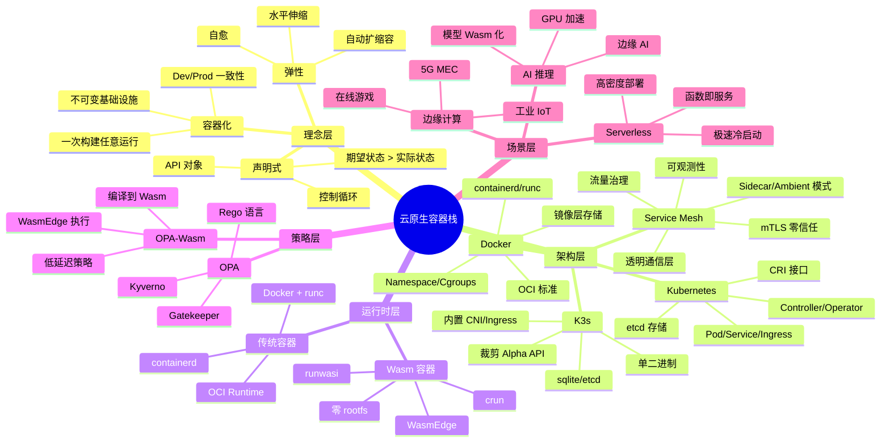
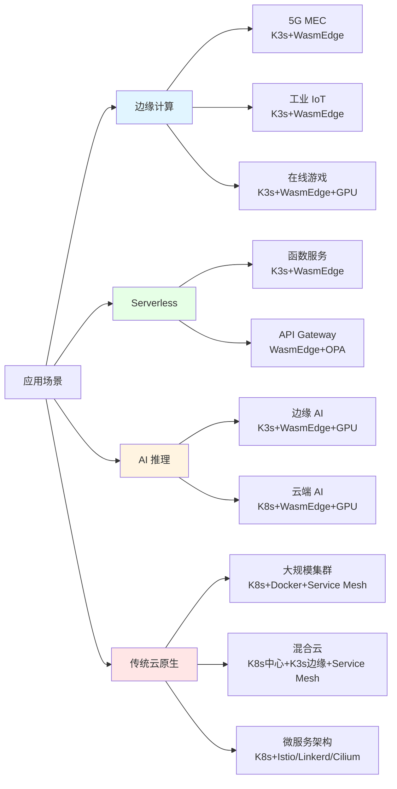
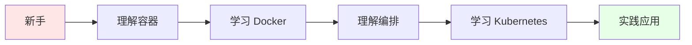
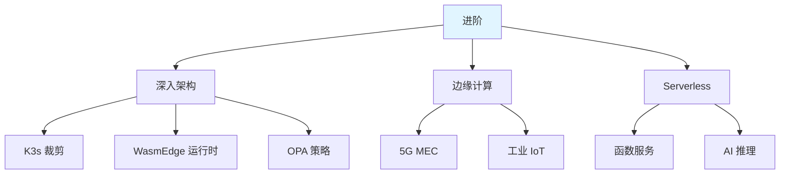
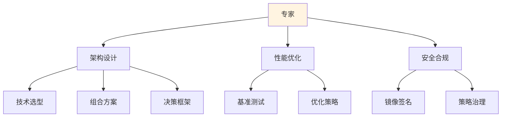
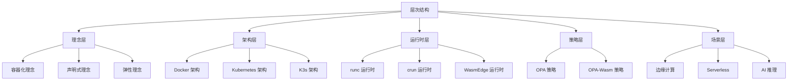
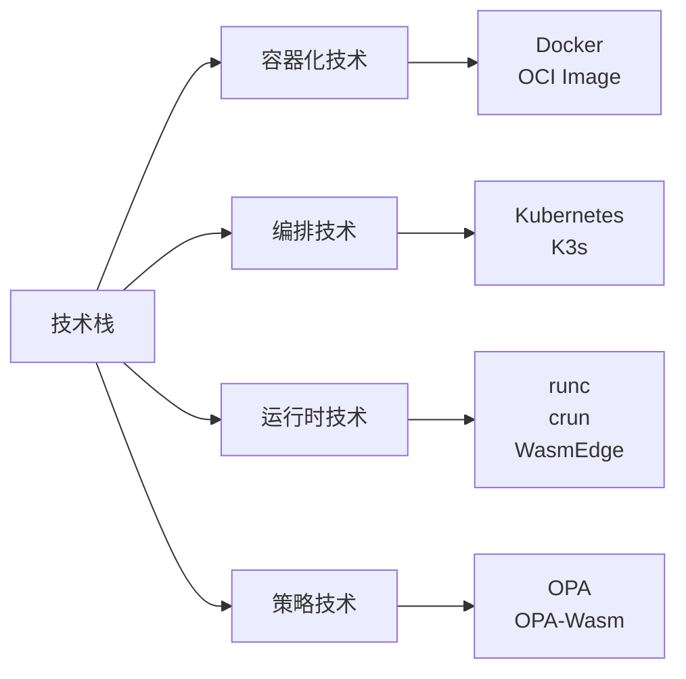
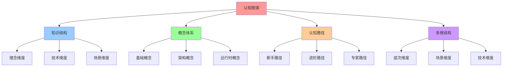
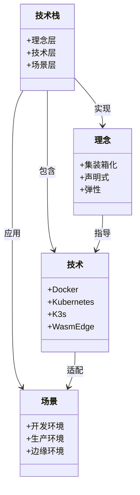
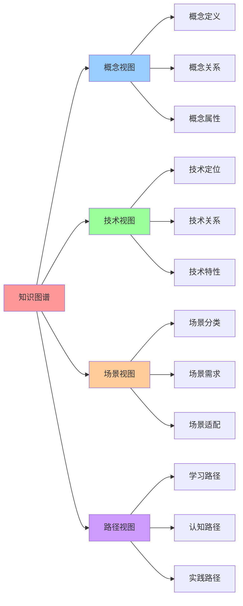

# 认知图谱：云原生容器技术栈快速认知指南

## 📑 目录

- [认知图谱：云原生容器技术栈快速认知指南](#认知图谱云原生容器技术栈快速认知指南)
  - [📑 目录](#-目录)
  - [1 文档定位](#1-文档定位)
  - [2 核心思维导图](#2-核心思维导图)
    - [2.1 全局知识地图](#21-全局知识地图)
    - [2.2 技术演进路径（演化主线）](#22-技术演进路径演化主线)
    - [2.3 应用场景地图](#23-应用场景地图)
  - [3 核心概念定义](#3-核心概念定义)
    - [3.1 基础概念](#31-基础概念)
    - [3.2 架构概念](#32-架构概念)
    - [3.3 运行时概念](#33-运行时概念)
  - [4 概念属性矩阵](#4-概念属性矩阵)
    - [4.1 技术栈属性矩阵](#41-技术栈属性矩阵)
    - [4.2 概念关系矩阵](#42-概念关系矩阵)
  - [5 认知路径](#5-认知路径)
    - [5.1 新手路径](#51-新手路径)
    - [5.2 进阶路径](#52-进阶路径)
    - [5.3 专家路径](#53-专家路径)
  - [6 多维层次结构](#6-多维层次结构)
    - [6.1 层次维度](#61-层次维度)
    - [6.2 场景维度](#62-场景维度)
    - [6.3 技术维度](#63-技术维度)
  - [7 快速参考表](#7-快速参考表)
    - [7.1 技术选型快速参考](#71-技术选型快速参考)
    - [7.2 性能指标快速参考](#72-性能指标快速参考)
    - [7.3 文档导航快速参考](#73-文档导航快速参考)
  - [8 形式化定义](#8-形式化定义)
    - [8.1 概念体系形式化](#81-概念体系形式化)
    - [8.2 技术演进形式化](#82-技术演进形式化)
    - [8.3 认知路径形式化](#83-认知路径形式化)
  - [9 认知增强：思维导图、建模视图与图表达转换](#9-认知增强思维导图建模视图与图表达转换)
    - [9.1 认知图谱完整思维导图](#91-认知图谱完整思维导图)
    - [9.2 知识建模视图（UML 类图）](#92-知识建模视图uml-类图)
      - [概念关系类图](#概念关系类图)
    - [9.3 知识多维关系矩阵](#93-知识多维关系矩阵)
      - [概念-技术-场景三维矩阵](#概念-技术-场景三维矩阵)
      - [学习路径-概念-技术映射矩阵](#学习路径-概念-技术映射矩阵)
    - [9.4 图表达和转换](#94-图表达和转换)
      - [知识图谱视图转换关系](#知识图谱视图转换关系)
      - [视图转换规则](#视图转换规则)
    - [9.5 形象化解释论证](#95-形象化解释论证)
      - [认知图谱的形象化类比](#认知图谱的形象化类比)
        - [1. 认知图谱 = 城市地图](#1-认知图谱--城市地图)
        - [2. 概念体系 = 知识大厦](#2-概念体系--知识大厦)
        - [3. 学习路径 = 登山路线](#3-学习路径--登山路线)
    - [9.6 专家观点与论证](#96-专家观点与论证)
      - [计算信息软件科学家的观点](#计算信息软件科学家的观点)
        - [1. Tim Berners-Lee（万维网发明人）](#1-tim-berners-lee万维网发明人)
        - [2. Alan Kay（面向对象编程之父）](#2-alan-kay面向对象编程之父)
      - [计算信息软件教育家的观点](#计算信息软件教育家的观点)
        - [1. Seymour Papert（建构主义教育家）](#1-seymour-papert建构主义教育家)
        - [2. Donald Knuth（计算机科学教育家）](#2-donald-knuth计算机科学教育家)
      - [计算信息软件认知学家的观点](#计算信息软件认知学家的观点)
        - [1. Jean Piaget（认知发展理论）](#1-jean-piaget认知发展理论)
        - [2. Lev Vygotsky（社会文化理论）](#2-lev-vygotsky社会文化理论)
    - [9.7 认知学习路径矩阵](#97-认知学习路径矩阵)
    - [9.8 专家推荐阅读路径](#98-专家推荐阅读路径)

---

## 1 文档定位

本文档提供云原生容器技术栈的**快速认知图谱**，通过思维导图、概念矩阵、认知路径和
多维结构，帮助快速建立技术认知体系。

**为什么需要认知图谱？**

在学习和理解云原生容器技术栈时，我们经常面临以下挑战：

1. **知识体系庞大**：云原生容器技术栈涉及多个技术领域，知识体系庞大，难以快速建
   立整体认知
2. **概念关系复杂**：核心概念之间的关系复杂，难以理清概念之间的关联
3. **学习路径不明确**：缺乏明确的学习路径，不知道从何开始学习
4. **视角单一**：只从单一视角理解技术，难以形成全面的技术认知

认知图谱通过**思维导图、概念矩阵、认知路径和多维结构**，帮助我们：

1. **快速建立整体认知**：通过思维导图快速理解技术栈的整体结构
2. **理清概念关系**：通过概念矩阵理清核心概念的定义、属性和关系
3. **明确学习路径**：通过认知路径明确从新手到专家的学习路径
4. **多维度理解**：通过多维结构从不同维度理解技术栈

**核心价值**：

- **快速认知**：通过思维导图快速理解整体结构
- **概念清晰**：核心概念的定义、属性和关系
- **学习路径**：从新手到专家的认知路径
- **多维视角**：不同维度的层次结构

**为什么这些核心价值重要？**

1. **快速认知的价值**：

   - **降低学习门槛**：通过思维导图可视化技术栈的整体结构，降低学习门槛
   - **提高学习效率**：快速理解整体结构后，可以更有针对性地深入学习
   - **建立知识框架**：通过整体认知建立知识框架，便于后续知识的组织和记忆

2. **概念清晰的价值**：

   - **避免概念混淆**：通过清晰的概念定义，避免概念混淆和理解错误
   - **理解概念关系**：通过概念属性矩阵和关系矩阵，理解概念之间的关系
   - **建立概念体系**：通过概念体系建立完整的概念认知框架

3. **学习路径的价值**：

   - **明确学习方向**：通过认知路径明确学习方向，避免盲目学习
   - **循序渐进**：从新手到专家的路径设计，确保循序渐进的学习
   - **提高学习效果**：通过明确的学习路径，提高学习效果

4. **多维视角的价值**：
   - **全面理解**：通过多维视角全面理解技术栈
   - **深入分析**：从不同维度深入分析技术栈的特点和应用
   - **灵活应用**：通过多维视角，灵活应用技术栈到不同场景

## 2 核心思维导图

### 2.1 全局知识地图



### 2.2 技术演进路径（演化主线）

**为什么需要理解技术演进路径？**

理解技术演进路径具有以下重要价值：

1. **理解技术发展的历史脉络**：

   - **历史背景**：通过技术演进路径，我们可以理解每个技术产生的历史背景和解决的
     问题
   - **演进逻辑**：通过演进逻辑，我们可以理解技术发展的内在规律
   - **技术关联**：通过演进路径，我们可以理解不同技术之间的关联关系

2. **预测技术发展的未来趋势**：

   - **趋势分析**：通过技术演进路径，我们可以分析技术发展的趋势
   - **未来预测**：通过演进逻辑，我们可以预测技术发展的未来方向
   - **技术选型**：通过理解演进路径，我们可以做出更合理的技术选型决策

3. **避免重复历史错误**：
   - **经验教训**：通过理解技术演进历史，我们可以学习历史经验教训
   - **避免重复**：理解历史错误后，我们可以避免重复历史错误
   - **优化决策**：通过历史经验，我们可以优化技术决策

**核心理念：从"集装箱"到"声明式宇宙"的演进**:

```mermaid
graph TB
    A[容器化理念<br/>"集装箱化"] --> B[Docker<br/>2013<br/>打包隔离<br/>"乐高积木的魔法包装盒"]
    B --> C[Kubernetes<br/>2014<br/>编排自愈<br/>"超级机器人管家"]
    C --> D[K3s<br/>2019<br/>轻量边缘<br/>"瑞士军刀版 Kubernetes"]
    C --> E[WasmEdge<br/>2020<br/>字节码运行时<br/>"口袋版 OS"]
    C --> H[Service Mesh<br/>2016+<br/>透明通信层<br/>"微服务通信的操作系统"]
    E --> F[OPA-Wasm<br/>2021+<br/>策略即代码<br/>"微秒级决策"]

    B --> G[OCI 标准<br/>2015-2016<br/>容器规范]

    style A fill:#e1f5ff
    style B fill:#fff4e1
    style C fill:#fff4e1
    style D fill:#fff4e1
    style E fill:#fff4e1
    style F fill:#fff4e1
```

**演化主线（Docker → K8s → K3s → WasmEdge → OPA）**：

| 阶段          | 技术         | 类比       | 解决的问题           | 演化逻辑 | 2025 年状态                          |
| ------------- | ------------ | ---------- | -------------------- | -------- | ------------------------------------ |
| **第 1 阶段** | Docker       | 集装箱     | "在我机器能跑"的问题 | 打包问题 | 成熟稳定，OCI 标准                   |
| **第 2 阶段** | Kubernetes   | 机器人管家 | 大规模编排问题       | 规模问题 | K8s 1.30+，生产就绪                  |
| **第 3 阶段** | K3s          | 瑞士军刀   | 资源受限环境         | 资源问题 | K3s 1.30+，内置 Wasm 支持            |
| **第 4 阶段** | WasmEdge     | 口袋版 OS  | 冷启动速度           | 速度问题 | WasmEdge 0.14+，K8s 1.30 原生支持   |
| **第 5 阶段** | Service Mesh | 透明通信层 | 微服务间通信治理     | 通信问题 | Istio/Linkerd/Cilium，Wasm 插件支持  |
| **第 6 阶段** | OPA-Wasm     | 微秒级决策 | 策略执行延迟         | 延迟问题 | Gatekeeper v3.15+，Wasm 引擎成熟     |

> **📊 2025 年趋势参考**：详细技术状态和版本信息请查看
> [27. 2025 年技术趋势汇总](../TECHNICAL/10-reference-trends/2025-trends/2025-trends.md)

**一句话总结**：Docker 把"进程"变"镜像"，K8s 把"镜像"变"服务"，K3s 把"服务"塞进"
口袋"，WasmEdge 把"字节码"变"一等公民"，Service Mesh 把"通信"变"透明层
"，OPA-Wasm 把"政策"变"微秒级函数"。

**为什么这个演进路径是合理的？**

这个演进路径体现了技术发展的内在逻辑：

1. **从打包到编排**（Docker → Kubernetes）：

   - **问题演进**：从解决"打包问题"演进到解决"编排问题"
   - **技术演进**：从单机容器技术演进到分布式编排技术
   - **价值演进**：从提高开发效率演进到提高运维效率

2. **从重量到轻量**（Kubernetes → K3s）：

   - **问题演进**：从解决"大规模编排问题"演进到解决"资源受限环境问题"
   - **技术演进**：从重量级编排系统演进到轻量级编排系统
   - **价值演进**：从适用于大规模集群演进到适用于边缘计算

3. **从容器到字节码**（容器 → WasmEdge）：

   - **问题演进**：从解决"隔离问题"演进到解决"冷启动速度问题"
   - **技术演进**：从容器技术演进到字节码运行时技术
   - **价值演进**：从提高资源利用率演进到提高冷启动速度

4. **从显式到透明**（应用代码 → Service Mesh）：

   - **问题演进**：从解决"应用功能问题"演进到解决"通信治理问题"
   - **技术演进**：从应用层通信演进到基础设施层通信
   - **价值演进**：从应用开发关注通信演进到基础设施透明处理通信

5. **从秒级到微秒级**（OPA → OPA-Wasm）：
   - **问题演进**：从解决"策略执行问题"演进到解决"策略执行延迟问题"
   - **技术演进**：从传统策略引擎演进到 Wasm 策略引擎
   - **价值演进**：从秒级策略执行演进到微秒级策略执行

### 2.3 应用场景地图

**为什么需要应用场景地图？**

应用场景地图帮助我们：

1. **理解技术的实际应用**：

   - **场景识别**：通过应用场景地图，我们可以识别不同技术的应用场景
   - **技术匹配**：通过场景地图，我们可以理解哪些技术适合哪些场景
   - **价值理解**：通过场景地图，我们可以理解技术在实际应用中的价值

2. **指导技术选型**：

   - **场景驱动**：通过应用场景，我们可以驱动技术选型决策
   - **技术组合**：通过场景地图，我们可以理解不同技术的组合方式
   - **最佳实践**：通过场景地图，我们可以学习技术应用的最佳实践

3. **预测技术趋势**：
   - **场景演进**：通过应用场景地图，我们可以理解场景的演进趋势
   - **技术需求**：通过场景演进，我们可以预测技术的未来需求
   - **创新方向**：通过场景分析，我们可以发现技术创新的方向



**2025 年实际案例**：

- **边缘计算案例**：参见 [工业 IoT 案例](../../../cases/manufacturing-industrial-iot.md)、[电商高并发案例](../../../cases/ecommerce-high-concurrency.md)
- **Serverless 案例**：参见 [边缘 Serverless 场景](../TECHNICAL/03-application-scenarios/edge-serverless/edge-serverless.md)
- **AI 推理案例**：参见 [AI 推理场景](../TECHNICAL/03-application-scenarios/ai-inference/ai-inference.md)
- **传统云原生案例**：参见 [支付网关案例](../../../cases/finance-payment-gateway.md)、[在线游戏案例](../../../cases/gaming-online-game.md)

> **📊 更多案例**：完整案例库请查看 [cases/README.md](../../../cases/README.md)

## 3 核心概念定义

### 3.1 基础概念

| 概念           | 定义                        | 核心属性                                | 关键关系                  |
| -------------- | --------------------------- | --------------------------------------- | ------------------------- |
| **容器**       | 带环境的进程                | Namespace、Cgroups、镜像层              | Docker → Kubernetes → K3s |
| **镜像**       | 不可变的应用打包            | OCI 规范、分层存储、Content-addressable | Docker 镜像 → Wasm 模块   |
| **Pod**        | 逻辑主机，共享网络/IPC/存储 | 最小调度单元、共享 Namespace            | Kubernetes 核心对象       |
| **Node**       | Kubernetes 工作节点         | Kubelet、容器运行时、CNI                | 集群基本单元              |
| **Service**    | 稳定网络标识                | ClusterIP、Labels、Selector             | Pod 访问抽象              |
| **Deployment** | 期望副本集                  | Replicas、滚动更新、自愈                | 应用部署抽象              |

### 3.2 架构概念

| 概念             | 定义                   | 核心属性                        | 关键关系              |
| ---------------- | ---------------------- | ------------------------------- | --------------------- |
| **控制平面**     | 集群大脑，管理期望状态 | API Server、etcd、Controller    | Kubernetes/K3s 核心   |
| **数据平面**     | 工作负载执行层         | Kubelet、容器运行时、CNI        | Pod 执行层            |
| **CRI**          | 容器运行时接口         | containerd、CRI-O、镜像管理     | Kubernetes 运行时抽象 |
| **RuntimeClass** | 运行时选择器           | handler、调度约束               | 多运行时混部          |
| **Wasm 模块**    | WebAssembly 字节码     | .wasm 文件、零 rootfs、跨平台   | WasmEdge 执行         |
| **Service Mesh** | 服务间通信基础设施层   | Sidecar/Ambient、mTLS、流量治理 | Istio/Linkerd/Cilium  |
| **OPA**          | 策略即代码引擎         | Rego 语言、编译到 Wasm          | 策略决策引擎          |

### 3.3 运行时概念

| 概念           | 定义                      | 核心属性                   | 关键关系          |
| -------------- | ------------------------- | -------------------------- | ----------------- |
| **runc**       | OCI 标准 Linux 容器运行时 | Namespace、Cgroups、rootfs | Docker 默认运行时 |
| **crun**       | C 实现的 OCI 运行时       | 支持 Wasm、自动识别        | Wasm 容器运行时   |
| **runwasi**    | Wasm shim for containerd  | 原生集成、统一管理         | Wasm CRI 集成     |
| **containerd** | 容器运行时守护进程        | CRI 实现、镜像管理         | Kubernetes CRI    |
| **WasmEdge**   | WebAssembly 运行时        | WASI、WASI-NN、GPU Plugin  | Wasm 字节码执行   |

## 4 概念属性矩阵

> **详细矩阵分析**：参见
> [09. 矩阵视角](../../03-theoretical-perspectives/matrix-perspective/README.md) -
> 完整的矩阵力学体系

### 4.1 技术栈属性矩阵

| 技术             | 层次         | 定位            | 体积   | 启动   | 内存       | 节点数        | 适用场景        | 2025 版本       |
| ---------------- | ------------ | --------------- | ------ | ------ | ---------- | ------------- | --------------- | --------------- |
| **Docker**       | 应用打包     | 容器化工具      | ~100MB | < 1s   | ~100MB     | 单机          | 开发/测试       | Docker 24.0+    |
| **Kubernetes**   | 集群编排     | 容器编排平台    | ~1GB   | 10-30s | ~512MB     | 1-10000+      | 大规模生产      | K8s 1.30+       |
| **K3s**          | 轻量编排     | 边缘 Kubernetes | ~60MB  | < 10s  | ~250MB     | 1-1000        | 边缘/IoT        | K3s 1.30+       |
| **WasmEdge**     | 字节码运行时 | Wasm 执行引擎   | ~8MB   | < 10ms | ~2MB       | 3000 Pod/Node | Serverless/边缘 | WasmEdge 0.14+  |
| **Service Mesh** | 服务网格     | 透明通信层      | ~500MB | < 1min | ~20MB/服务 | 100-10000+    | 微服务架构      | Istio 1.22+     |
| **OPA**          | 策略执行     | 策略引擎        | ~50MB  | ~100ms | ~50MB      | -             | 策略决策        | OPA 0.64+       |
| **OPA-Wasm**     | 策略执行     | Wasm 策略引擎   | ~2MB   | < 10ms | ~2MB       | -             | 边缘策略        | Gatekeeper 3.15+|

**属性说明**：

- **体积**：二进制/镜像大小
- **启动**：启动时间
- **内存**：运行时内存占用
- **节点数**：支持的集群规模
- **适用场景**：主要应用场景
- **2025 版本**：2025 年最新稳定版本（截至 2025-11-07）

> **📊 性能基准数据**：详细性能对比和基准测试数据请查看
> [04. 性能基准](../../05-decision-analysis/benchmarks/benchmarks.md)

### 4.2 概念关系矩阵

| 概念 A         | 关系   | 概念 B          | 说明                       |
| -------------- | ------ | --------------- | -------------------------- |
| **Docker**     | → 基础 | **Kubernetes**  | K8s 基于 Docker/containerd |
| **Kubernetes** | → 裁剪 | **K3s**         | K3s 是 K8s 的轻量版本      |
| **Kubernetes** | → 支持 | **WasmEdge**    | K8s 通过 CRI 支持 WasmEdge |
| **K3s**        | → 优化 | **WasmEdge**    | K3s 边缘场景优化 WasmEdge  |
| **OPA**        | → 编译 | **OPA-Wasm**    | OPA 策略编译到 Wasm        |
| **WasmEdge**   | → 执行 | **OPA-Wasm**    | WasmEdge 执行 Wasm 策略    |
| **Docker**     | → 标准 | **OCI**         | Docker 推动 OCI 标准       |
| **Kubernetes** | → 接口 | **CRI**         | K8s 定义 CRI 接口          |
| **containerd** | → 实现 | **CRI**         | containerd 实现 CRI        |
| **runc**       | → 实现 | **OCI Runtime** | runc 实现 OCI Runtime Spec |

**关系类型**：

- **→ 基础**：B 基于 A 构建
- **→ 裁剪**：B 是 A 的轻量版本
- **→ 支持**：A 支持 B
- **→ 优化**：A 针对 B 场景优化
- **→ 编译**：A 编译到 B
- **→ 执行**：A 执行 B
- **→ 标准**：A 推动 B 标准
- **→ 接口**：A 定义 B 接口
- **→ 实现**：A 实现 B 规范

## 5 认知路径

### 5.1 新手路径



**新手路径步骤**：

| 阶段       | 目标            | 核心概念                       | 推荐文档                                                                   |
| ---------- | --------------- | ------------------------------ | -------------------------------------------------------------------------- |
| **阶段 1** | 理解容器概念    | 容器、镜像、Namespace          | [04-docker](../TECHNICAL/01-core-foundations/docker/docker.md)             |
| **阶段 2** | 掌握 Docker     | Dockerfile、镜像构建、容器运行 | [04-docker](../TECHNICAL/01-core-foundations/docker/docker.md)             |
| **阶段 3** | 理解编排需求    | Pod、Service、Deployment       | [05-kubernetes](../TECHNICAL/01-core-foundations/kubernetes/kubernetes.md) |
| **阶段 4** | 学习 Kubernetes | API 对象、控制器、调度         | [05-kubernetes](../TECHNICAL/01-core-foundations/kubernetes/kubernetes.md) |
| **阶段 5** | 实践应用        | 部署应用、故障排查             | [15-installation](../TECHNICAL/05-devops/installation/installation.md)     |

### 5.2 进阶路径



**进阶路径步骤**：

| 阶段       | 目标            | 核心概念                         | 推荐文档                                                                                                                                                        |
| ---------- | --------------- | -------------------------------- | --------------------------------------------------------------------------------------------------------------------------------------------------------------- |
| **阶段 1** | 深入架构设计    | K3s 裁剪、CRI、RuntimeClass      | [02-k3s](../TECHNICAL/01-core-foundations/k3s/k3s.md) [04-orchestration-runtime](../TECHNICAL/02-runtime-policy/orchestration-runtime/orchestration-runtime.md) |
| **阶段 2** | 掌握 WasmEdge   | Wasm 字节码、零 rootfs、集成路线 | [07-wasm-edge](../TECHNICAL/02-runtime-policy/wasm-edge/wasmedge.md)                                                                                            |
| **阶段 3** | 学习策略即代码  | OPA、Rego、Wasm 编译             | [10-policy-opa](../TECHNICAL/02-runtime-policy/policy-opa/policy-opa.md)                                                                                        |
| **阶段 4** | 边缘计算场景    | K3s + WasmEdge 组合              | [11-edge-serverless](../TECHNICAL/03-application-scenarios/edge-serverless/edge-serverless.md)                                                                  |
| **阶段 5** | Serverless 场景 | 极速冷启动、高密度部署           | [11-edge-serverless](../TECHNICAL/03-application-scenarios/edge-serverless/edge-serverless.md)                                                                  |
| **阶段 6** | AI 推理场景     | 模型 Wasm 化、GPU 加速           | [12-ai-inference](../TECHNICAL/03-application-scenarios/ai-inference/ai-inference.md)                                                                           |

### 5.3 专家路径



**专家路径步骤**：

| 阶段       | 目标           | 核心概念                     | 推荐文档                                                                                                           |
| ---------- | -------------- | ---------------------------- | ------------------------------------------------------------------------------------------------------------------ |
| **阶段 1** | 架构设计决策   | 技术组合、规格匹配、决策框架 | [05-architecture-design](../../02-architecture-design/architecture-design/architecture-design.md)                  |
| **阶段 2** | 性能基准与优化 | 性能指标、对比分析、优化策略 | [04-benchmarks](../../05-decision-analysis/benchmarks/benchmarks.md)                                               |
| **阶段 3** | 安全与合规     | 镜像签名、SBOM、策略治理     | [09-security-compliance](../TECHNICAL/07-security-compliance/security-compliance/security-compliance.md)           |
| **阶段 4** | 供应链安全     | OCI Artifact、Cosign、SBOM   | [05-oci-supply-chain](../TECHNICAL/02-runtime-policy/oci-supply-chain/oci-supply-chain.md)                         |
| **阶段 5** | 实际案例       | 华为 MEC、阿里云 ACK Edge    | [05-architecture-design](../../02-architecture-design/architecture-design/architecture-design.md#175-实际应用案例) |

## 6 多维层次结构

### 6.1 层次维度



**层次结构说明**：

- **理念层**：核心思想演进
- **架构层**：系统架构设计
- **运行时层**：容器运行时
- **策略层**：策略执行
- **场景层**：应用场景

### 6.2 场景维度

| 场景             | 编排层            | 运行时                 | 存储        | 网络           | 策略     | 特点                           |
| ---------------- | ----------------- | ---------------------- | ----------- | -------------- | -------- | ------------------------------ |
| **大规模生产**   | Kubernetes        | Docker + runc          | etcd        | Calico/Cilium  | OPA      | 成熟稳定                       |
| **边缘计算**     | K3s               | WasmEdge + crun        | sqlite      | flannel        | OPA-Wasm | 轻量高效                       |
| **Serverless**   | K3s/K8s           | WasmEdge + crun        | sqlite/etcd | flannel/Calico | OPA-Wasm | 极速冷启动                     |
| **AI 推理**      | K3s/K8s           | WasmEdge + GPU         | sqlite/etcd | flannel/Calico | OPA-Wasm | GPU 加速（直通，性能>98%）     |
| **深度学习训练** | K8s               | Container/VM + GPU     | sqlite/etcd | flannel/Calico | OPA      | GPU 直通，多 OS 支持，性能>95% |
| **多租户 GPU**   | K8s               | VM + GPU (vGPU/SR-IOV) | sqlite/etcd | flannel/Calico | OPA      | GPU 虚拟化，资源共享           |
| **混合云**       | K8s 中心+K3s 边缘 | Docker+WasmEdge        | etcd+sqlite | Calico+flannel | OPA-Wasm | 统一管理                       |

### 6.3 技术维度



## 7 快速参考表

> **💡 使用提示**：本节提供快速决策参考，详细决策模型和权衡分析请查看
> [10. 技术决策模型](../../05-decision-analysis/decision-models/decision-models.md)

### 7.1 技术选型快速参考

| 场景需求         | 推荐技术栈                   | 关键指标           | 设备访问           | 内核特性         |
| ---------------- | ---------------------------- | ------------------ | ------------------ | ---------------- |
| **资源受限**     | K3s + WasmEdge + sqlite      | 内存 < 300MB       | 无需求             | 无需求           |
| **低延迟**       | WasmEdge + crun              | 启动 < 10ms        | 无需求             | 无需求           |
| **大规模集群**   | Kubernetes + Docker + etcd   | 节点 > 1000        | 无需求             | epoll/io_uring   |
| **边缘计算**     | K3s + WasmEdge + flannel     | 离线能力           | 无需求             | 无需求           |
| **Serverless**   | K3s + WasmEdge + HPA         | 冷启动 < 10ms      | 无需求             | 无需求           |
| **AI 推理**      | K3s + WasmEdge + GPU         | 推理延迟 < 50ms    | GPU（直通）        | 无需求           |
| **深度学习训练** | K8s + VM/Container + GPU     | GPU 性能>95%       | GPU（直通）        | 无需求           |
| **多租户 GPU**   | K8s + VM + GPU (vGPU/SR-IOV) | GPU 资源共享       | GPU（vGPU/SR-IOV） | 无需求           |
| **USB/PCI 设备** | K8s + VM（半虚拟化）         | 设备访问           | USB/PCI            | 无需求           |
| **高并发网络**   | K8s + Container              | epoll 延迟 100ns   | 无需求             | epoll（必需）    |
| **高性能数据库** | K8s + Container              | io_uring 延迟 50ns | 无需求             | io_uring（必需） |
| **策略执行**     | OPA-Wasm + Gatekeeper        | 评估延迟 < 1ms     | 无需求             | 无需求           |

> **详细决策指南**：查看
> [10. 技术决策模型](../../05-decision-analysis/decision-models/QUICK-REFERENCE.md) -
> 设备访问（USB/PCI/GPU）和内核特性决策快速参考

### 7.2 性能指标快速参考

| 技术           | 启动时间 | 内存占用 | 镜像体积 | Pod 密度      |
| -------------- | -------- | -------- | -------- | ------------- |
| **Docker**     | 1-2s     | 18-500MB | 10-500MB | 300 Pod/Node  |
| **WasmEdge**   | 6-10ms   | 2-50MB   | 0.9-10MB | 3000 Pod/Node |
| **Kubernetes** | 10-30s   | ~512MB   | ~1GB     | 10000+ 节点   |
| **K3s**        | < 10s    | ~250MB   | ~60MB    | 1000 节点     |
| **OPA**        | ~100ms   | ~50MB    | ~50MB    | -             |
| **OPA-Wasm**   | < 10ms   | ~2MB     | ~2MB     | -             |

### 7.3 文档导航快速参考

| 学习目标             | 推荐文档                                                                                                            | 核心内容                        |
| -------------------- | ------------------------------------------------------------------------------------------------------------------- | ------------------------------- |
| **快速入门**         | [01-overview](../overview/overview.md)                                                                              | 技术栈总览                      |
| **核心理念**         | [02-principles](../principles/principles.md)                                                                        | 云原生理念                      |
| **架构设计**         | [03-architecture](../../02-architecture-design/architecture/architecture.md)                                        | 架构与对象模型                  |
| **执行流与调度**     | [03-execution-flow-scheduling](../../02-architecture-design/architecture/execution-flow-scheduling.md)              | 执行流与调度视角                |
| **技术选型决策**     | [10-decision-models](../../05-decision-analysis/decision-models/decision-models.md)                                 | 技术决策模型与权衡框架          |
| **快速参考指南**     | [10-quick-reference](../../05-decision-analysis/decision-models/QUICK-REFERENCE.md)                                 | 设备访问和内核特性决策          |
| **一致性检查报告**   | [10-consistency-report](../../05-decision-analysis/decision-models/CONSISTENCY-REPORT.md)                           | 文档一致性检查与 Wikipedia 对齐 |
| **Docker 基础**      | [00-docker](../TECHNICAL/01-core-foundations/docker/docker.md)                                                      | Docker 技术规范                 |
| **Kubernetes**       | [01-kubernetes](../TECHNICAL/01-core-foundations/kubernetes/kubernetes.md)                                          | K8s 架构与实践                  |
| **K3s 轻量**         | [02-k3s](../TECHNICAL/01-core-foundations/k3s/k3s.md)                                                               | K3s 轻量级架构                  |
| **WasmEdge**         | [03-wasm-edge](../TECHNICAL/02-runtime-policy/wasm-edge/wasmedge.md)                                                | WasmEdge 集成指南               |
| **运行时**           | [04-orchestration-runtime](../TECHNICAL/02-runtime-policy/orchestration-runtime/orchestration-runtime.md)           | CRI 与 RuntimeClass             |
| **供应链**           | [05-oci-supply-chain](../TECHNICAL/02-runtime-policy/oci-supply-chain/oci-supply-chain.md)                          | OCI 与供应链安全                |
| **策略即代码**       | [06-policy-opa](../TECHNICAL/02-runtime-policy/policy-opa/policy-opa.md)                                            | OPA 策略即代码                  |
| **边缘 Serverless**  | [07-edge-serverless](../TECHNICAL/03-application-scenarios/edge-serverless/edge-serverless.md)                      | 边缘与 Serverless               |
| **AI 推理**          | [08-ai-inference](../TECHNICAL/03-application-scenarios/ai-inference/ai-inference.md)                               | AI 推理                         |
| **安全合规**         | [09-security-compliance](../TECHNICAL/07-security-compliance/security-compliance/security-compliance.md)            | 安全与合规                      |
| **性能基准**         | [04-benchmarks](../../05-decision-analysis/benchmarks/benchmarks.md)                                                | 性能基线                        |
| **安装部署**         | [10-installation](../TECHNICAL/05-devops/installation/installation.md)                                              | 安装与部署                      |
| **故障排查**         | [11-troubleshooting](../TECHNICAL/05-devops/troubleshooting/troubleshooting.md)                                     | 故障排查                        |
| **架构设计**         | [05-architecture-design](../../02-architecture-design/architecture-design/architecture-design.md)                   | 全局架构设计                    |
| **问题解决方案**     | [06-problem-solution-matrix](../../02-architecture-design/problem-solution-matrix/problem-solution-matrix.md)       | 技术问题与部署疑难杂症          |
| **形式化理论**       | [07-formal-theory](../../03-theoretical-perspectives/formal-theory/formal-theory.md)                                | 结构同构与关系等价              |
| **范畴论视角**       | [08-category-theory](../../03-theoretical-perspectives/category-theory/category-theory.md)                          | 对象、态射与函子                |
| **矩阵视角**         | [09-matrix-perspective](../../03-theoretical-perspectives/matrix-perspective/README.md)                             | 矩阵力学与数学建模              |
| **网络技术规格堆栈** | [12-network-stack](../TECHNICAL/04-infrastructure-stack/network-stack/network-stack.md)                             | 网络技术与规格全面梳理          |
| **缩写词汇表**       | [13-acronyms-glossary](../TECHNICAL/10-reference-trends/acronyms-glossary/acronyms-glossary.md)                     | 所有缩写词定义与关系            |
| **主题清单**         | [14-theme-inventory](../TECHNICAL/10-reference-trends/theme-inventory/theme-inventory.md)                           | 全面梳理所有主题与子主题        |
| **架构框架**         | [28-architecture-framework](../TECHNICAL/08-architecture-analysis/architecture-framework/architecture-framework.md) | 多维度架构体系与技术规范        |
| **存储技术规格堆栈** | [15-storage-stack](../TECHNICAL/04-infrastructure-stack/storage-stack/storage-stack.md)                             | 存储技术与规格全面梳理          |
| **监控与可观测性**   | [16-observability](../TECHNICAL/04-infrastructure-stack/observability/observability.md)                             | Metrics/Logging/Tracing         |

<!-- cSpell:ignore cicd containerd runc crun runwasi wasmedge WasmEdge WASI OCI Kubernetes K8s K3s RuntimeClass etcd sqlite CRI Pod Service Namespace Cgroups -->

| **GitOps 和持续交付** |
[17-gitops-cicd](../TECHNICAL/05-devops/gitops-cicd/gitops-cicd.md) |
GitOps/CI/CD 技术规范 | | **Operator 和 CRD** |
[18-operator-crd](../TECHNICAL/05-devops/operator-crd/operator-crd.md) |
Operator/CRD 开发规范 | | **服务网格** |
[19-service-mesh](../TECHNICAL/06-advanced-features/service-mesh/service-mesh.md)
| 服务网格技术规范（可选） | | **多集群管理** |
[20-multi-cluster](../TECHNICAL/06-advanced-features/multi-cluster/multi-cluster.md)
| 多集群管理技术规范（可选） | | **镜像仓库和镜像管理** |
[21-image-registry](../TECHNICAL/06-advanced-features/image-registry/image-registry.md)
| 镜像仓库与管理技术规范 | | **升级和迁移** |
[22-upgrade-migration](../TECHNICAL/05-devops/upgrade-migration/upgrade-migration.md)
| 升级和迁移技术规范 | | **开发和调试工具** |
[23-dev-tools](../TECHNICAL/05-devops/dev-tools/dev-tools.md) | 开发和调试工具规
范 | | **成本优化** |
[24-cost-optimization](../TECHNICAL/09-optimization-practices/cost-optimization/cost-optimization.md)
| 成本优化技术规范（可选） | | **社区生态和最佳实践** |
[25-community-best-practices](../TECHNICAL/09-optimization-practices/community-best-practices/community-best-practices.md)
| 社区生态和最佳实践（可选） | | **文档体系分析与改进** |
[26-analysis-improvement](../TECHNICAL/09-optimization-practices/analysis-improvement/analysis-improvement.md)
| 批判性分析和改进计划 | | **2025 年技术趋势汇总** |
[27-2025-trends](../TECHNICAL/10-reference-trends/2025-trends/2025-trends.md) |
2025 年最新技术趋势和版本信息（**强烈推荐**：了解最新技术状态） |

## 8 形式化定义

### 8.1 概念体系形式化

**技术栈层次定义**： $$T = \{L, A, R, P, S\}$$

其中：

- $L$ = 理念层（Layer of Principles）
- $A$ = 架构层（Layer of Architecture）
- $R$ = 运行时层（Layer of Runtime）
- $P$ = 策略层（Layer of Policy）
- $S$ = 场景层（Layer of Scenario）

### 8.2 技术演进形式化

**技术演进函数**： $$E(t) = \{D(t), K(t), K_3(t), W(t), O(t)\}$$

其中：

- $D(t)$ = Docker 在时间 $t$ 的状态
- $K(t)$ = Kubernetes 在时间 $t$ 的状态
- $K_3(t)$ = K3s 在时间 $t$ 的状态
- $W(t)$ = WasmEdge 在时间 $t$ 的状态
- $O(t)$ = OPA 在时间 $t$ 的状态

**演进关系**：
$$K(t) \supset D(t), \quad K_3(t) \subset K(t), \quad W(t) \perp K(t), \quad O(t) \perp K(t)$$

### 8.3 认知路径形式化

**认知路径函数**：

$$
P(l) = \begin{cases}
\text{新手路径} & \text{if } l = \text{beginner} \\
\text{进阶路径} & \text{if } l = \text{intermediate} \\
\text{专家路径} & \text{if } l = \text{expert}
\end{cases}
$$

其中 $l$ 是学习者水平（learner level）。

**认知目标函数**： $$G(l) = \arg\max_{D} \text{Knowledge}(D, l)$$

其中 $D$ 是文档集合，$\text{Knowledge}$ 是知识获取函数。

---

---

## 9 认知增强：思维导图、建模视图与图表达转换

### 9.1 认知图谱完整思维导图



### 9.2 知识建模视图（UML 类图）

#### 概念关系类图



### 9.3 知识多维关系矩阵

#### 概念-技术-场景三维矩阵

| 概念维度 | Docker | Kubernetes | K3s | WasmEdge | 开发场景 | 生产场景 | 边缘场景 | 认知价值 |
|---------|--------|------------|-----|----------|---------|---------|---------|---------|
| **容器** | ✅ 核心 | ✅ 继承 | ✅ 继承 | ⚠️ 部分 | ✅ 适用 | ✅ 适用 | ⚠️ 部分 | 概念理解 |
| **Pod** | ❌ 无 | ✅ 核心 | ✅ 继承 | ⚠️ 部分 | ⚠️ 部分 | ✅ 适用 | ✅ 适用 | 概念理解 |
| **声明式** | ⚠️ 部分 | ✅ 核心 | ✅ 继承 | ⚠️ 部分 | ✅ 适用 | ✅ 适用 | ✅ 适用 | 理念理解 |
| **弹性** | ⚠️ 部分 | ✅ 核心 | ✅ 继承 | ✅ 增强 | ✅ 适用 | ✅ 适用 | ✅ 适用 | 理念理解 |
| **极速启动** | ❌ 无 | ❌ 无 | ❌ 无 | ✅ 核心 | ⚠️ 部分 | ⚠️ 部分 | ✅ 适用 | 性能理解 |

#### 学习路径-概念-技术映射矩阵

| 学习路径 | 核心概念 | 对应技术 | 学习难度 | 认知目标 | 实践应用 |
|---------|---------|---------|---------|---------|---------|
| **新手路径** | 容器、镜像 | Docker | ⭐⭐ | 建立基础 | 单机部署 |
| **进阶路径** | Pod、Deployment | Kubernetes | ⭐⭐⭐⭐ | 理解编排 | 集群管理 |
| **专家路径** | Wasm、策略 | WasmEdge、OPA | ⭐⭐⭐⭐⭐ | 掌握高级 | 边缘计算 |

### 9.4 图表达和转换

#### 知识图谱视图转换关系



#### 视图转换规则

**转换规则 1：概念视图 → 技术视图**:

```yaml
概念视图转换:
  输入: 概念（容器、Pod、声明式）
  转换规则:
    - 容器 → Docker 镜像、容器运行时
    - Pod → Kubernetes Pod、容器组
    - 声明式 → Kubernetes 声明式 API、控制循环
  输出: 技术实现（Docker、K8s、K3s）
```

**转换规则 2：技术视图 → 场景视图**:

```yaml
技术视图转换:
  输入: 技术特性（Docker、K8s、K3s、WasmEdge）
  转换规则:
    - Docker → 开发环境、单机部署
    - Kubernetes → 生产环境、大规模集群
    - K3s → 边缘环境、资源受限
    - WasmEdge → 边缘环境、极致性能
  输出: 适用场景（开发、生产、边缘）
```

**转换规则 3：场景视图 → 路径视图**:

```yaml
场景视图转换:
  输入: 场景需求（开发、生产、边缘）
  转换规则:
    - 开发场景 → 新手路径（Docker）
    - 生产场景 → 进阶路径（Kubernetes）
    - 边缘场景 → 专家路径（K3s + WasmEdge）
  输出: 学习路径（新手、进阶、专家）
```

### 9.5 形象化解释论证

#### 认知图谱的形象化类比

##### 1. 认知图谱 = 城市地图

> **类比**：认知图谱就像城市地图，概念是"地标"（重要位置），技术是"道路"（连接方式），场景是"区域"（应用范围），学习路径是"导航路线"（到达方式），就像通过地图理解城市结构一样，通过认知图谱理解技术栈结构。

**认知价值**：

- **结构理解**：通过城市地图类比，理解认知图谱的结构性
- **导航理解**：通过导航路线类比，理解学习路径的导航性
- **区域理解**：通过城市区域类比，理解场景的应用范围

##### 2. 概念体系 = 知识大厦

> **类比**：概念体系就像知识大厦，基础概念是"地基"（基础支撑），架构概念是"框架"（结构支撑），运行时概念是"功能层"（功能实现），就像大厦从地基到框架再到功能层的构建一样，概念体系从基础到架构再到运行时的构建。

**认知价值**：

- **层次理解**：通过大厦层次类比，理解概念体系的层次性
- **支撑理解**：通过地基框架类比，理解概念之间的支撑关系
- **构建理解**：通过大厦构建类比，理解概念体系的构建过程

##### 3. 学习路径 = 登山路线

> **类比**：学习路径就像登山路线，新手路径是"缓坡路线"（容易攀登），进阶路径是"标准路线"（中等难度），专家路径是"挑战路线"（高难度），就像登山从缓坡到标准再到挑战的路线选择一样，学习从新手到进阶再到专家的路径选择。

**认知价值**：

- **难度理解**：通过登山难度类比，理解学习路径的难度梯度
- **选择理解**：通过路线选择类比，理解学习路径的选择性
- **目标理解**：通过登山目标类比，理解学习路径的目标导向

### 9.6 专家观点与论证

#### 计算信息软件科学家的观点

##### 1. Tim Berners-Lee（万维网发明人）

> "The Web is more a social creation than a technical one. I designed it for a social effect—to help people work together."

**在认知图谱中的应用**：

- **社会性**：技术栈不仅是技术，更是社会协作的工具
- **协作性**：通过技术栈实现团队协作和知识共享
- **影响性**：技术栈的设计影响社会协作方式

##### 2. Alan Kay（面向对象编程之父）

> "The best way to predict the future is to invent it. But the best way to invent it is to understand the past."

**在认知图谱中的应用**：

- **历史理解**：通过认知图谱理解技术演进历史
- **未来预测**：基于历史理解预测技术发展趋势
- **创新指导**：通过历史理解指导技术创新

#### 计算信息软件教育家的观点

##### 1. Seymour Papert（建构主义教育家）

> "You can't teach people everything they need to know. The best you can do is position them where they can find what they need to know when they need to know it."

**教育价值**：

- **定位学习**：认知图谱帮助学习者定位知识位置
- **自主探索**：通过认知图谱自主探索知识
- **需求导向**：根据需求在认知图谱中查找知识

##### 2. Donald Knuth（计算机科学教育家）

> "The best programs are written so that computing machines can perform them quickly and so that human beings can understand them clearly."

**教育价值**：

- **清晰理解**：认知图谱帮助清晰理解技术概念
- **快速掌握**：通过认知图谱快速掌握技术知识
- **系统学习**：认知图谱提供系统化的学习路径

#### 计算信息软件认知学家的观点

##### 1. Jean Piaget（认知发展理论）

> "The principal goal of education is to create men who are capable of doing new things, not simply of repeating what other generations have done."

**认知价值**：

- **创新思维**：认知图谱培养创新思维能力
- **理解能力**：通过认知图谱提升理解能力
- **应用能力**：认知图谱提升知识应用能力

##### 2. Lev Vygotsky（社会文化理论）

> "What a child can do today with assistance, she will be able to do by herself tomorrow."

**认知价值**：

- **渐进学习**：认知图谱支持渐进式学习
- **辅助学习**：通过认知图谱提供学习辅助
- **自主能力**：认知图谱培养自主学习能力

### 9.7 认知学习路径矩阵

| 学习阶段 | 核心概念 | 形象化理解 | 技术理解 | 实践应用 | 认知目标 |
|---------|---------|-----------|---------|---------|---------|
| **入门** | 容器、镜像 | 城市地图类比 | 技术定位 | 简单部署 | 建立框架 |
| **进阶** | Pod、Deployment | 知识大厦类比 | 架构理解 | 集群管理 | 理解架构 |
| **高级** | Wasm、策略 | 登山路线类比 | 高级特性 | 边缘计算 | 掌握高级 |

### 9.8 专家推荐阅读路径

**计算信息软件科学家推荐路径**：

1. **概念体系**：从基础概念到架构概念再到运行时概念
2. **技术演进**：理解技术演进的历史脉络
3. **知识结构**：理解知识结构的系统性
4. **认知路径**：掌握从新手到专家的认知路径

**计算信息软件教育家推荐路径**：

1. **形象化理解**：通过城市地图、知识大厦、登山路线等类比，建立直观理解
2. **渐进学习**：从简单概念开始，逐步学习复杂概念
3. **实践结合**：结合实际案例，理解技术应用
4. **路径选择**：根据学习目标选择合适的学习路径

**计算信息软件认知学家推荐路径**：

1. **认知模式**：识别认知图谱中的认知模式
2. **类比理解**：通过类比理解技术概念
3. **模型构建**：构建技术栈的心理模型
4. **认知提升**：通过认知图谱学习，提升认知能力

> **使用指南**：
>
> - **快速认知**：查看 [2 核心思维导图](#2-核心思维导图)
> - **概念查询**：查看 [3 核心概念定义](#3-核心概念定义)
> - **技术选型**：查看 [7.1 技术选型快速参考](#71-技术选型快速参考)
> - **设备访问决策**：查看
>   [10. 技术决策模型](../../05-decision-analysis/decision-models/QUICK-REFERENCE.md) -
>   设备访问（USB/PCI/GPU）和内核特性决策快速参考
> - **一致性检查**：查看
>   [10. 一致性检查报告](../../05-decision-analysis/decision-models/CONSISTENCY-REPORT.md) -
>   确保所有技术定义与 Wikipedia 标准对齐
> - **学习路径**：查看 [5 认知路径](#5-认知路径)
> - **详细文档**：查看 [7.3 文档导航快速参考](#73-文档导航快速参考)
> - **认知增强**：查看 [9 认知增强](#9-认知增强思维导图建模视图与图表达转换)
>
> ---
>
> ## 2025 年最新实践
>
> ### 认知图谱应用最佳实践（2025）
>
> **2025 年趋势**：认知图谱在技术学习和决策中的深度应用
>
> **实践要点**：
>
> - **快速认知**：使用认知图谱快速建立技术认知体系
> - **概念清晰**：通过概念矩阵理清核心概念的定义和关系
> - **学习路径**：使用认知路径明确从新手到专家的学习路径
>
> **代码示例**：
>
> ```python
> # 2025 年认知图谱应用工具
> class CognitiveMapManager:
>     def __init__(self):
>         self.mindmap_builder = MindMapBuilder()
>         self.concept_analyzer = ConceptAnalyzer()
>         self.path_planner = LearningPathPlanner()
>
>     def build_cognitive_map(self, tech_stack):
>         """构建认知图谱"""
>         # 构建思维导图
>         mindmap = self.mindmap_builder.build(tech_stack)
>
>         # 分析概念关系
>         concepts = self.concept_analyzer.analyze(tech_stack)
>
>         # 规划学习路径
>         learning_path = self.path_planner.plan(tech_stack, concepts)
>
>         return mindmap, concepts, learning_path
> ```
>
> ## 实际应用案例
>
> ### 案例 1：技术栈认知图谱构建（2025）
>
> **场景**：使用认知图谱快速建立云原生技术栈的认知体系
>
> **实现方案**：
>
> ```python
> # 技术栈认知图谱构建
> tech_stack = {
>     'containerization': 'Docker',
>     'orchestration': 'Kubernetes',
>     'edge': 'K3s',
>     'runtime': 'WasmEdge',
>     'policy': 'OPA'
> }
>
> manager = CognitiveMapManager()
> mindmap, concepts, learning_path = manager.build_cognitive_map(tech_stack)
>
> print(f"思维导图: {mindmap}")
> print(f"概念关系: {concepts}")
> print(f"学习路径: {learning_path}")
> ```
>
> **效果**：
>
> - 快速认知：使用认知图谱快速建立技术认知体系
> - 概念清晰：通过概念矩阵理清核心概念的定义和关系
> - 学习路径：使用认知路径明确从新手到专家的学习路径
>
> ---
>
> **最后更新**：2025-11-15
> **文档状态**：✅ 完整 | 📊 包含思维导图、建模视图、多维矩阵、图表达转换、形象化解释论证、专家观点 | 🎯 生产就绪技术组合
