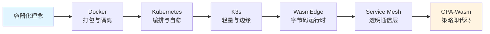
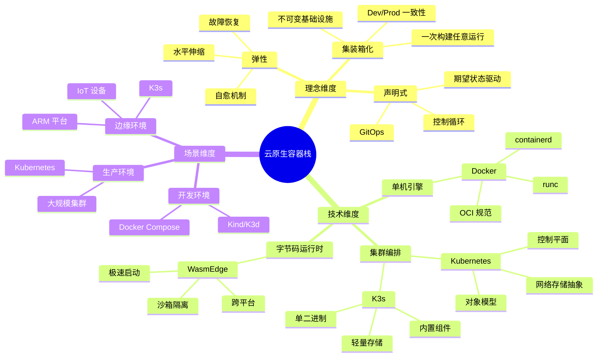
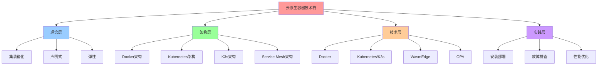
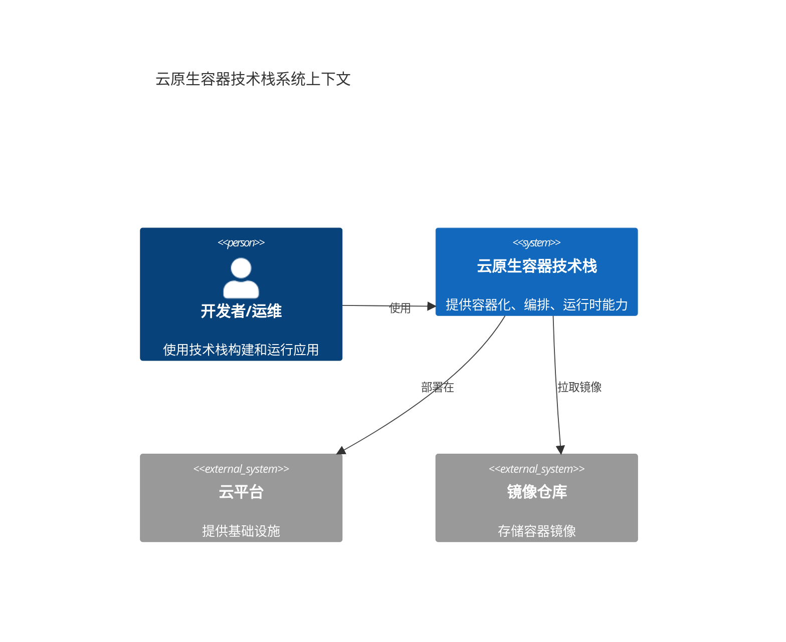
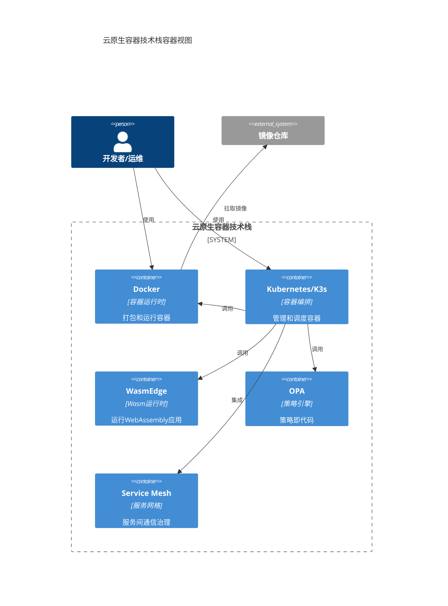
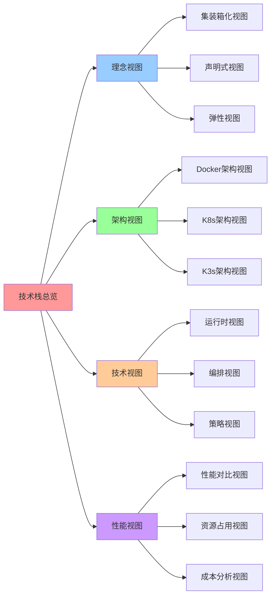

# 总览：云原生容器技术栈知识图谱

## 📑 目录

- [总览：云原生容器技术栈知识图谱](#总览云原生容器技术栈知识图谱)
  - [📑 目录](#-目录)
  - [1 文档定位](#1-文档定位)
  - [2 技术栈定位](#2-技术栈定位)
    - [2.1 核心理念演进](#21-核心理念演进)
    - [2.2 技术层次划分](#22-技术层次划分)
  - [3 知识结构全景](#3-知识结构全景)
    - [3.1 三维知识框架](#31-三维知识框架)
    - [3.2 技术演进时间轴（1999→2025）](#32-技术演进时间轴19992025)
  - [4 技术决策树](#4-技术决策树)
  - [5 核心概念对照表](#5-核心概念对照表)
  - [6 性能基线对比](#6-性能基线对比)
    - [6.1 性能指标矩阵](#61-性能指标矩阵)
    - [6.2 性能对比分析](#62-性能对比分析)
  - [7 形式化总结](#7-形式化总结)
    - [7.1 技术栈关系式](#71-技术栈关系式)
    - [7.2 性能优化目标函数](#72-性能优化目标函数)
    - [7.3 技术决策定理](#73-技术决策定理)
  - [8 快速导航](#8-快速导航)
  - [9 参考](#9-参考)
  - [10 认知增强：思维导图、建模视图与图表达转换](#10-认知增强思维导图建模视图与图表达转换)
    - [10.1 技术栈完整思维导图](#101-技术栈完整思维导图)
    - [10.2 软件建模视图（C4 模型）](#102-软件建模视图c4-模型)
      - [系统上下文图（C4 Level 1）](#系统上下文图c4-level-1)
      - [容器图（C4 Level 2）](#容器图c4-level-2)
    - [10.3 知识多维关系矩阵](#103-知识多维关系矩阵)
      - [技术栈多维关系矩阵](#技术栈多维关系矩阵)
      - [理念-技术映射矩阵](#理念-技术映射矩阵)
    - [10.4 图表达和转换](#104-图表达和转换)
      - [视图转换关系图](#视图转换关系图)
      - [视图转换规则](#视图转换规则)
    - [10.5 形象化解释论证](#105-形象化解释论证)
      - [技术栈的形象化类比](#技术栈的形象化类比)
        - [1. 技术栈 = 城市基础设施系统](#1-技术栈--城市基础设施系统)
        - [2. 理念演进 = 建筑风格演进](#2-理念演进--建筑风格演进)
        - [3. 架构设计 = 城市规划](#3-架构设计--城市规划)
        - [4. 性能优化 = 交通优化](#4-性能优化--交通优化)
    - [10.6 专家观点与论证](#106-专家观点与论证)
      - [计算信息软件科学家的观点](#计算信息软件科学家的观点)
        - [1. Solomon Hykes（Docker 创始人）](#1-solomon-hykesdocker-创始人)
        - [2. Joe Beda（Kubernetes 联合创始人）](#2-joe-bedakubernetes-联合创始人)
        - [3. Darren Shepherd（K3s 创始人）](#3-darren-shepherdk3s-创始人)
      - [计算信息软件教育家的观点](#计算信息软件教育家的观点)
        - [1. Kelsey Hightower（Kubernetes 教育家）](#1-kelsey-hightowerkubernetes-教育家)
        - [2. Liz Rice（容器安全教育家）](#2-liz-rice容器安全教育家)
      - [计算信息软件认知学家的观点](#计算信息软件认知学家的观点)
        - [1. David Marr（计算认知科学家）](#1-david-marr计算认知科学家)
        - [2. Douglas Hofstadter（认知科学家）](#2-douglas-hofstadter认知科学家)
    - [10.7 认知学习路径矩阵](#107-认知学习路径矩阵)
    - [10.8 专家推荐阅读路径](#108-专家推荐阅读路径)

---

## 1 文档定位

本文档提供 Docker → Kubernetes → K3s → WasmEdge → OPA 技术栈的完整知识结构，适用
于技术决策、学习路径和架构设计参考。

**文档结构**：

- **理念层**：云原生核心思想演进（见 [2. 理念层](../principles/principles.md)）
- **架构层**：控制闭环与对象模型（见
  [3. 架构与对象模型](../../02-architecture-design/architecture/architecture.md)）
- **技术层**：各技术深度解析（Docker/K8s/K3s/WasmEdge/OPA）
- **全局架构设计**：技术组合方案、规格匹配、成熟技术栈案例（见
  [05. 全局架构设计](../../02-architecture-design/architecture-design/architecture-design.md)）
- **实践层**：安装部署与故障排查

## 2 技术栈定位

### 2.1 核心理念演进



**演进论证（问题 → 解法 → 副作用 → 再演化）**：

**Docker（集装箱）**：

- **问题**：依赖地狱、"在我机器能跑"的世纪难题
- **解法**：把"应用+依赖+文件系统"打成不可变镜像
- **副作用**：镜像体积大、分层滥用
- **再演化**：OCI 标准化、多阶段构建、distroless

**Kubernetes（机器人管家）**：

- **问题**：大规模集群管理、手动运维复杂
- **解法**：用"声明式 API"让系统永远自愈、自调度
- **副作用**：学习曲线陡峭、资源占用大
- **再演化**：出现 GitOps、DRY 模板（Helm/Kustomize）、K3s 轻量版

**K3s（瑞士军刀）**：

- **问题**：K8s 太重，边缘/IoT 资源受限
- **解法**：把 K8s 瘦身成"单二进制"，内置电池
- **副作用**：功能相对精简、Alpha API 被裁剪
- **再演化**：内置 WasmEdge 驱动（2025）、支持离线运行

**WasmEdge（口袋版 OS）**：

- **问题**：容器冷启动慢（秒级）、密度受限
- **解法**：字节码成为"一等公民"，零 rootfs、毫秒级启动
- **副作用**：需要编译到 Wasm、生态相对新
- **再演化**：K8s 1.30 原生支持、AI 推理标准化（2025）

**Service Mesh（透明通信层）**：

- **问题**：微服务间通信复杂、代码侵入、安全治理困难
- **解法**：Sidecar/节点代理 + 控制平面，把网络通信整体下沉为平台能力
- **副作用**：资源占用增加、延迟略有增加（0.3-1ms）
- **再演化**：Ambient Mesh（无 Sidecar）、eBPF 加速（Cilium）、Wasm 插件热加载
  （2025）

**OPA-Wasm（微秒级决策）**：

- **问题**：策略执行延迟高（毫秒级）、需要 sidecar
- **解法**：把 Rego 编译成 Wasm，微秒级执行
- **副作用**：Wasm 不支持所有 Rego 内置函数
- **再演化**：Gatekeeper v3.15 原生支持（2025）

### 2.2 技术层次划分

| 层次             | 技术                 | 解决的核心问题                       | 适用场景                       |
| ---------------- | -------------------- | ------------------------------------ | ------------------------------ | -------------------------------------- |
| **应用打包**     | Docker               | 环境一致性、依赖隔离                 | 开发、测试、单机部署           | "集装箱"、"乐高积木的魔法包装盒"       |
| **集群编排**     | Kubernetes           | 高可用、自动扩缩容、服务发现         | 生产环境、大规模集群           | "机器人管家"、"分布式操作系统"         |
| **轻量编排**     | K3s                  | 资源受限环境下的编排能力             | 边缘计算、IoT、ARM 设备        | "瑞士军刀版 Kubernetes"、"口袋版 OS"   |
| **字节码运行时** | WasmEdge             | 极速冷启动、高密度、跨平台           | Serverless、边缘函数、插件系统 | "口袋版 OS"、"字节码一等公民"          |
| **服务网格**     | Istio/Linkerd/Cilium | 服务间通信治理、零信任安全、可观测性 | 微服务架构、多云环境、边缘计算 | "透明通信层"、"微服务通信的操作系统"   |
| **策略执行**     | OPA-Wasm             | 微秒级策略决策、无 sidecar           | 准入控制、API 网关、合规检查   | "微秒级决策"、"政策即代码的最轻量形态" |

**层次分析（问题 → 解法 → 副作用 → 再演化）**：

1. **应用打包层（Docker - "集装箱"）**：

   - **问题**：环境不一致、"在我机器能跑"
   - **解法**：不可变镜像、"一次构建，任意运行"
   - **副作用**：镜像体积大、分层滥用
   - **再演化**：OCI 标准化、多阶段构建、distroless

2. **集群编排层（Kubernetes - "机器人管家"）**：

   - **问题**：大规模集群管理复杂
   - **解法**：声明式 API、控制循环、自愈机制
   - **副作用**：学习曲线陡峭、资源占用大（1GB+）
   - **再演化**：GitOps、K3s 轻量版、Operator 模式

3. **轻量编排层（K3s - "瑞士军刀"）**：

   - **问题**：K8s 太重，边缘资源受限
   - **解法**：单二进制打包、内置电池、裁剪 Alpha API
   - **副作用**：功能相对精简、Alpha API 被裁剪
   - **再演化**：内置 WasmEdge 驱动（2025）、离线运行支持

4. **字节码运行时层（WasmEdge - "口袋版 OS"）**：

   - **问题**：容器冷启动慢（1.2s）、密度受限（300 Pod/节点）
   - **解法**：字节码一等公民、零 rootfs、毫秒级启动
   - **副作用**：需要编译到 Wasm、生态相对新
   - **再演化**：K8s 1.30 原生支持、AI 推理标准化（2025）

5. **服务网格层（Service Mesh - "透明通信层"）**：

   - **问题**：微服务间通信复杂、代码侵入、安全治理困难
   - **解法**：Sidecar/节点代理 + 控制平面，把网络通信整体下沉为平台能力
   - **副作用**：资源占用增加、延迟略有增加（0.3-1ms）
   - **再演化**：Ambient Mesh（无 Sidecar）、eBPF 加速（Cilium）、Wasm 插件热加
     载（2025）

6. **策略执行层（OPA-Wasm - "微秒级决策"）**：
   - **问题**：策略执行延迟高（1-5ms）、需要 sidecar
   - **解法**：编译到 Wasm、微秒级执行（30-80µs）
   - **副作用**：Wasm 不支持所有 Rego 内置函数
   - **再演化**：Gatekeeper v3.15 原生支持、无 sidecar 时代（2025）

## 3 知识结构全景

### 3.1 三维知识框架



**知识结构分析**：

- **理念维度**：从技术抽象到业务价值（集装箱化 → 声明式 → 弹性）
- **技术维度**：从单机到集群再到字节码（Docker → K8s → K3s → WasmEdge）
- **场景维度**：从开发到生产再到边缘（开发 → 生产 → 边缘）

### 3.2 技术演进时间轴（1999→2025）

**技术演进时间轴**（基于 ai_view.md 的时间线）：

| 年份          | 技术/事件            | 意义               | 类比             | 当前状态（2025）    |
| ------------- | -------------------- | ------------------ | ---------------- | ------------------- |
| **1999**      | chroot               | 进程隔离的起源     | 隔离的雏形       | 历史基础            |
| **2006**      | cgroups (Google)     | 资源限制机制       | 资源控制         | Kubernetes 基础     |
| **2013**      | Docker 开源          | 集装箱理念落地     | "集装箱"诞生     | 成熟稳定 ⭐⭐⭐⭐⭐ |
| **2014**      | Kubernetes 开源      | Borg 经验产品化    | "机器人管家"诞生 | 成熟稳定 ⭐⭐⭐⭐⭐ |
| **2015**      | OCI 标准启动         | 容器标准化         | 标准化进程       | OCI 1.0 完成        |
| **2017**      | CRI 插件化           | docker-shim 剥离   | 解耦进程         | CRI 成熟            |
| **2019**      | K3s 发布             | 边缘场景补位       | "瑞士军刀"诞生   | 成熟稳定 ⭐⭐⭐⭐⭐ |
| **2020**      | OCI 1.0 完成         | 镜像规范标准化     | 标准化完成       | 广泛采用            |
| **2020**      | WasmEdge 开源        | WebAssembly 运行时 | "口袋版 OS"诞生  | 快速增长 ⭐⭐⭐⭐   |
| **2021**      | OPA-Wasm             | 策略即代码         | "微秒级决策"     | 快速发展 ⭐⭐⭐⭐   |
| **2022**      | K8s 去掉 docker-shim | 全面 CRI           | 解耦完成         | 标准配置            |
| **2023**      | K3s 内置 etcd HA     | 小型数据中心       | 高可用增强       | 生产就绪            |
| **2024-2025** | K8s 1.30 + WasmEdge  | 双运行时原生支持   | 字节码一等公民   | **当前趋势** 🔥     |
| **2025**      | OPA-Wasm 成熟        | 无 sidecar 策略    | 策略微秒化       | **当前趋势** 🔥     |
| **2025**      | AI 推理 Wasm-化      | 模型镜像化         | AI 推理标准化    | **当前趋势** 🔥     |

**2025 年关键里程碑**：

- **K8s 1.30**：RuntimeClass=wasm 原生支持，无需外挂
- **K3s 1.30**：内置 WasmEdge 驱动，`--wasm` flag 即开即用
- **WasmEdge 0.14**：内置 Llama2/7B 插件，GPU 加速推理
- **OPA-Wasm**：Gatekeeper v3.15 支持，P99 延迟 0.07 ms
- **供应链安全**：OCI Artifact v1.1，wasm 模块可签名、可 SBOM

> **📊 详细技术状态和版本信息**：请查看
> [27. 2025 年技术趋势汇总](../TECHNICAL/10-reference-trends/2025-trends/2025-trends.md)

**演进分析**：

- **1999-2013**：基础技术积累期（chroot → cgroups → Docker）
- **2014-2019**：编排技术成熟期（K8s → CRI → K3s）
- **2020-2025**：云原生扩展期（OCI → WasmEdge → OPA-Wasm）→ **字节码时代**

## 4 技术决策树

```bash
# 场景决策树（伪代码）
function choose_technology(requirements):
    if requirements.node_count > 1000:
        return "Kubernetes"
    elif requirements.multi_tenant:
        return "Kubernetes"
    elif requirements.alpha_apis:
        return "Kubernetes"
    elif requirements.edge_device:
        return "K3s"
    elif requirements.arm_platform:
        return "K3s"
    elif requirements.network_unstable:
        return "K3s"
    elif requirements.memory < 2GB:
        return "K3s"
    elif requirements.local_development:
        return "Docker + Compose"
    elif requirements.ci_cd:
        return "Kind / K3d"
    else:
        return "Docker"
```

**决策分析**：

- **大规模集群**（> 1000 节点）：选择 Kubernetes，因为其成熟的控制平面架构
- **边缘场景**：选择 K3s，因为其轻量级设计（< 250MB 内存）
- **本地开发**：选择 Docker Compose，因为其简单易用
- **CI/CD**：选择 Kind/K3d，因为其快速启动能力

## 5 核心概念对照表

| 概念             | 本质         | 关键对象/机制     | 解决痛点         | 对应技术   |
| ---------------- | ------------ | ----------------- | ---------------- | ---------- |
| **容器**         | 带环境的进程 | Namespace/Cgroups | 环境不一致       | Docker     |
| **Pod**          | 逻辑主机     | 共享 net/IPC/vol  | 紧耦合进程组     | Kubernetes |
| **Deployment**   | 期望副本集   | replicas/滚动更新 | 手工扩容         | Kubernetes |
| **Service**      | 稳定网络标识 | ClusterIP/Labels  | Pod 漂移         | Kubernetes |
| **RuntimeClass** | 运行时选择器 | handler 配置      | 多运行时混部     | K8s/K3s    |
| **Wasm 模块**    | 字节码应用   | .wasm 文件        | 跨平台、快速启动 | WasmEdge   |
| **策略即代码**   | 编译的策略   | policy.wasm       | Sidecar 开销     | OPA-Wasm   |

**概念分析**：

- **容器**：进程级隔离，解决环境不一致
- **Pod**：逻辑主机抽象，解决紧耦合进程组
- **Deployment**：期望状态管理，解决手工扩容
- **Service**：稳定网络标识，解决 Pod 漂移
- **RuntimeClass**：运行时选择，支持多运行时混部
- **Wasm 模块**：字节码抽象，解决跨平台与冷启动
- **策略即代码**：编译到 Wasm，解决策略执行延迟

## 6 性能基线对比

### 6.1 性能指标矩阵

| 指标         | Docker    | Kubernetes | K3s       | WasmEdge      |
| ------------ | --------- | ---------- | --------- | ------------- |
| **资源占用** | ~100 MB   | ~1 GB      | < 250 MB  | ~2 MB         |
| **启动时间** | < 1s      | 10-30s     | < 10s     | < 10ms        |
| **规模上限** | 单机      | 5000+ 节点 | 1000 节点 | 3000 Pod/节点 |
| **适用场景** | 开发/测试 | 生产集群   | 边缘/IoT  | Serverless    |

### 6.2 性能对比分析

**资源占用分析**：

- **Docker**：单机运行时，内存占用 ~100MB，适合开发环境
- **Kubernetes**：控制平面 + 节点组件，内存占用 ~1GB，适合生产集群
- **K3s**：裁剪后控制平面，内存占用 < 250MB，适合边缘设备 [k3s-memory]
- **WasmEdge**：字节码运行时，内存占用 ~2MB，适合高密度场景 [wasmedge-memory]

**启动时间分析**：

- **Docker**：加载镜像 + 启动进程，< 1s
- **Kubernetes**：启动控制平面 + 初始化网络，10-30s
- **K3s**：单二进制启动，< 10s [k3s-startup]
- **WasmEdge**：加载字节码，< 10ms [wasmedge-startup]

**规模上限分析**：

- **Docker**：单机限制，受主机资源限制
- **Kubernetes**：官方测试 5000+ 节点、15 万 Pod [k8s-scale]
- **K3s**：边缘场景 1000 节点（Pod 密度低）[k3s-scale]
- **WasmEdge**：单节点 3000 Pod（字节码轻量级）[wasmedge-density]

> **注**：具体指标需附来源/时间/版本，见 [REFERENCES.md](../REFERENCES.md)

## 7 形式化总结

### 7.1 技术栈关系式

设技术栈为 $T = \{D, K, K_3, W, O\}$，其中：

- $D$ = Docker（应用打包）
- $K$ = Kubernetes（集群编排）
- $K_3$ = K3s（轻量编排）
- $W$ = WasmEdge（字节码运行时）
- $O$ = OPA-Wasm（策略执行）

**关系定义**：

- $D \subset K$：Docker 是 Kubernetes 的基础
- $K_3 \subset K$：K3s 是 Kubernetes 的子集
- $W \perp K$：WasmEdge 与 Kubernetes 正交（可混部）
- $O \perp K$：OPA-Wasm 与 Kubernetes 正交（可混部）

### 7.2 性能优化目标函数

设性能指标为 $P = \{R, S, D\}$，其中：

- $R$ = 资源占用（Resource）
- $S$ = 启动时间（Startup）
- $D$ = 部署密度（Density）

**优化目标**：
$$\min_{T} \alpha \cdot R(T) + \beta \cdot S(T) - \gamma \cdot D(T)$$

其中 $\alpha, \beta, \gamma$ 为权重系数，根据场景调整。

### 7.3 技术决策定理

**定理 1**（技术选择）：对于场景 $S$，存在最优技术 $T*$ 使得：
$$T* = \arg\min_{T \in \{D, K, K_3, W, O\}} \text{cost}(T, S)$$

**证明**：根据决策树（见 [4 技术决策树](#4-技术决策树)），每个场景都有明确的技术
选择规则，因此存在最优解。$\square$

## 8 快速导航

- **认知图谱**：快速认知指南 →
  [`0. 认知图谱`](../knowledge-map/knowledge-map.md)
- **理念层**：了解云原生核心思想 → [`2. 理念层`](../principles/principles.md)
- **架构层**：深入对象模型与控制闭环 →
  [`3. 架构与对象模型`](../../02-architecture-design/architecture/architecture.md)
- **全局架构设计**：技术组合方案与决策框架 →
  [`05. 全局架构设计`](../../02-architecture-design/architecture-design/architecture-design.md)
- **实战指南**：快速上手各技术 →
  [`10. 安装与最小示例`](../TECHNICAL/05-devops/installation/installation.md)
- **故障排查**：常见问题与解决方案 →
  [`11. 常见问题`](../TECHNICAL/05-devops/troubleshooting/troubleshooting.md)
- **缩写词汇表**：所有缩写词定义与关系 →
  [`13. 缩写词汇表`](../TECHNICAL/10-reference-trends/acronyms-glossary/acronyms-glossary.md)
- **主题清单**：全面梳理所有主题与子主题 →
  [`14. 主题清单`](../TECHNICAL/10-reference-trends/theme-inventory/theme-inventory.md)
- **存储技术规格堆栈**：存储技术与规格全面梳理 →
  [`15. 存储技术规格堆栈`](../TECHNICAL/04-infrastructure-stack/storage-stack/storage-stack.md)
- **监控与可观测性**：Metrics/Logging/Tracing 技术规范 →
  [`16. 监控与可观测性`](../TECHNICAL/04-infrastructure-stack/observability/observability.md)
- **GitOps 和持续交付**：GitOps/CI/CD 技术规范 →
  [`17. GitOps 和持续交付`](../TECHNICAL/05-devops/gitops-cicd/gitops-cicd.md)
- **Operator 和 CRD**：Operator/CRD 开发规范 →
  [`18. Operator 和 CRD`](../TECHNICAL/05-devops/operator-crd/operator-crd.md)
- **镜像仓库和镜像管理**：镜像仓库与管理技术规范 →
  [`21. 镜像仓库和镜像管理`](../TECHNICAL/06-advanced-features/image-registry/image-registry.md)
- **升级和迁移**：升级和迁移技术规范 →
  [`22. 升级和迁移`](../TECHNICAL/05-devops/upgrade-migration/upgrade-migration.md)
- **开发和调试工具**：开发和调试工具规范 →
  [`23. 开发和调试工具`](../TECHNICAL/05-devops/dev-tools/dev-tools.md)
- **服务网格**：服务网格技术规范 →
  [`19. 服务网格`](../TECHNICAL/06-advanced-features/service-mesh/service-mesh.md)（
  可选）
- **多集群管理**：多集群管理技术规范 →
  [`20. 多集群管理`](../TECHNICAL/06-advanced-features/multi-cluster/multi-cluster.md)（
  可选）
- **成本优化**：成本优化技术规范 →
  [`24. 成本优化`](../TECHNICAL/09-optimization-practices/cost-optimization/cost-optimization.md)（
  可选）
- **社区生态和最佳实践**：社区生态和最佳实践 →
  [`25. 社区生态和最佳实践`](../TECHNICAL/09-optimization-practices/community-best-practices/community-best-practices.md)（
  可选）
- **文档体系分析与改进**：批判性分析和改进计划 →
  [`26. 文档体系分析与改进`](../TECHNICAL/09-optimization-practices/analysis-improvement/analysis-improvement.md)（
  分析文档）
- **2025 年技术趋势汇总**：2025 年最新技术趋势和版本信息 →
  [`27. 2025 年技术趋势汇总`](../TECHNICAL/10-reference-trends/2025-trends/2025-trends.md)（
  趋势文档）
- **矩阵视角**：云原生技术栈的矩阵力学分析 →
  [`09. 矩阵视角`](../../03-theoretical-perspectives/matrix-perspective/README.md)（
  理论文档）

## 9 参考

**关联文档**：

- **[28. 架构框架](../../TECHNICAL/28-architecture-framework/architecture-framework.md)** -
  多维度架构体系与技术规范（技术架构、概念架构、数据架构、业务架构、软件架构、应
  用架构、场景架构）
- **[05. 全局架构设计](../../02-architecture-design/architecture-design/architecture-design.md)** -
  技术组合和架构决策
- [02 理念层](../principles/principles.md) - 云原生核心理念演进
- [03 架构与对象模型](../../02-architecture-design/architecture/architecture.md) -
  系统架构设计
- [10 技术决策模型](../../05-decision-analysis/decision-models/decision-models.md) -
  技术选型决策框架
- [07 形式化理论](../../03-theoretical-perspectives/formal-theory/formal-theory.md) -
  结构同构和关系等价
- [08 范畴论视角](../../03-theoretical-perspectives/category-theory/category-theory.md) -
  范畴论分析方法
- [09 矩阵视角](../../03-theoretical-perspectives/matrix-perspective/README.md) -
  矩阵力学与数学建模

**外部参考**：

[docker-principles]: [Docker 官方文档](https://docs.docker.com/)
[k8s-principles]: [Kubernetes 官方文档](https://kubernetes.io/docs/)
[k3s-design]: [K3s 架构设计](https://docs.k3s.io/architecture)
[wasmedge-performance]: [WasmEdge 性能基准](https://wasmedge.org/docs/)
[opa-wasm]: [OPA Wasm 支持](https://www.openpolicyagent.org/docs/latest/wasm/)
[k3s-memory]: [K3s 资源占用](https://docs.k3s.io/installation/requirements)
[wasmedge-memory]: [WasmEdge 内存占用](https://wasmedge.org/docs/)
[k3s-startup]: [K3s 启动时间](https://docs.k3s.io/) [wasmedge-startup]:
[WasmEdge 启动时间](https://wasmedge.org/docs/) [k8s-scale]:
[Kubernetes 规模测试](https://kubernetes.io/docs/setup/best-practices/cluster-large/)

[k3s-scale]: [K3s 规模限制](https://docs.k3s.io/) [wasmedge-density]:
[WasmEdge Pod 密度](https://wasmedge.org/docs/)

---

## 10 认知增强：思维导图、建模视图与图表达转换

### 10.1 技术栈完整思维导图



### 10.2 软件建模视图（C4 模型）

#### 系统上下文图（C4 Level 1）



#### 容器图（C4 Level 2）



### 10.3 知识多维关系矩阵

#### 技术栈多维关系矩阵

| 技术维度 | Docker | Kubernetes | K3s | WasmEdge | OPA | Service Mesh | 演进关系 | 认知价值 |
|---------|--------|------------|-----|----------|-----|--------------|---------|---------|
| **定位** | 容器运行时 | 容器编排 | 轻量编排 | Wasm运行时 | 策略引擎 | 服务治理 | 技术演进 | 定位理解 |
| **抽象层次** | 应用层 | 编排层 | 编排层 | 运行时层 | 策略层 | 网络层 | 层次演进 | 层次理解 |
| **核心能力** | 打包隔离 | 调度自愈 | 轻量编排 | 极速启动 | 策略决策 | 流量治理 | 能力演进 | 能力理解 |
| **性能指标** | 启动1-5s | 调度延迟ms级 | 启动<30s | 启动<1ms | 决策<1ms | 延迟+0.3-1ms | 性能演进 | 性能理解 |
| **资源占用** | 镜像50-500MB | 节点1GB+ | 节点<250MB | 镜像<2MB | 策略<1MB | Sidecar 20-200MB | 资源演进 | 资源理解 |
| **适用场景** | 单机容器 | 大规模集群 | 边缘场景 | 极致性能 | 策略管理 | 微服务架构 | 场景演进 | 场景理解 |
| **学习难度** | ⭐⭐ | ⭐⭐⭐⭐ | ⭐⭐⭐ | ⭐⭐⭐ | ⭐⭐⭐ | ⭐⭐⭐⭐ | - | 渐进学习 |
| **专家推荐** | ⭐⭐⭐⭐⭐ | ⭐⭐⭐⭐⭐ | ⭐⭐⭐⭐⭐ | ⭐⭐⭐⭐⭐ | ⭐⭐⭐⭐⭐ | ⭐⭐⭐⭐⭐ | - | 技术深度 |

#### 理念-技术映射矩阵

| 理念维度 | 集装箱化 | 声明式 | 弹性 | 技术实现 | 演进关系 | 认知价值 |
|---------|---------|--------|------|---------|---------|---------|
| **Docker** | ✅ 核心 | ⚠️ 部分 | ⚠️ 部分 | 镜像分层、OCI | 理念→技术 | 理念理解 |
| **Kubernetes** | ✅ 继承 | ✅ 核心 | ✅ 核心 | 声明式API、控制循环 | 理念→技术 | 理念理解 |
| **K3s** | ✅ 继承 | ✅ 继承 | ✅ 继承 | 轻量实现 | 理念→技术 | 理念理解 |
| **WasmEdge** | ✅ 增强 | ⚠️ 部分 | ✅ 增强 | 极速启动、高密度 | 理念→技术 | 理念理解 |
| **OPA** | ⚠️ 间接 | ✅ 核心 | ⚠️ 间接 | 策略即代码 | 理念→技术 | 理念理解 |
| **Service Mesh** | ✅ 继承 | ✅ 核心 | ✅ 核心 | 透明治理 | 理念→技术 | 理念理解 |

### 10.4 图表达和转换

#### 视图转换关系图



#### 视图转换规则

**转换规则 1：理念视图 → 技术视图**:

```yaml
理念视图转换:
  输入: 理念（集装箱化、声明式、弹性）
  转换规则:
    - 集装箱化 → Docker 镜像分层、OCI 标准
    - 声明式 → Kubernetes 声明式 API、控制循环
    - 弹性 → Kubernetes 副本、健康检查、自愈
  输出: 技术实现（Docker、K8s、K3s）
```

**转换规则 2：架构视图 → 性能视图**:

```yaml
架构视图转换:
  输入: 架构设计（Docker、K8s、K3s）
  转换规则:
    - Docker 架构 → 启动时间 1-5s、镜像大小 50-500MB
    - K8s 架构 → 调度延迟 ms 级、资源占用 1GB+
    - K3s 架构 → 启动 <30s、资源占用 <250MB
  输出: 性能指标（启动时间、资源占用、延迟）
```

**转换规则 3：技术视图 → 决策视图**:

```yaml
技术视图转换:
  输入: 技术特性（Docker、K8s、K3s、WasmEdge）
  转换规则:
    - 单机场景 → Docker
    - 大规模集群 → Kubernetes
    - 边缘场景 → K3s
    - 极致性能 → WasmEdge
  输出: 技术选型决策
```

### 10.5 形象化解释论证

#### 技术栈的形象化类比

##### 1. 技术栈 = 城市基础设施系统

> **类比**：云原生容器技术栈就像城市基础设施系统，Docker 是"集装箱码头"（打包和运输），Kubernetes 是"交通管理系统"（调度和协调），K3s 是"轻轨系统"（轻量高效），WasmEdge 是"高速地铁"（极速运行），OPA 是"交通规则"（策略管理），Service Mesh 是"智能交通网"（服务治理）。

**认知价值**：

- **系统理解**：通过城市基础设施类比，理解技术栈的系统性
- **角色理解**：通过不同基础设施角色类比，理解各技术的定位
- **协作理解**：通过基础设施协作类比，理解技术间的协作关系

##### 2. 理念演进 = 建筑风格演进

> **类比**：理念演进就像建筑风格演进，集装箱化是"标准化建筑"（统一标准），声明式是"智能建筑"（自动控制），弹性是"抗震建筑"（自动恢复），就像建筑风格从标准化到智能化再到弹性化的演进一样。

**认知价值**：

- **演进理解**：通过建筑风格演进类比，理解理念演进的历史脉络
- **理念理解**：通过建筑特性类比，理解各理念的核心特征
- **趋势理解**：通过建筑趋势类比，理解技术发展的未来趋势

##### 3. 架构设计 = 城市规划

> **类比**：架构设计就像城市规划，Docker 是"住宅区规划"（应用隔离），Kubernetes 是"城市总体规划"（资源调度），K3s 是"卫星城规划"（边缘部署），就像城市规划从局部到全局再到边缘的演进一样。

**认知价值**：

- **规划理解**：通过城市规划类比，理解架构设计的规划性
- **层次理解**：通过规划层次类比，理解架构的层次结构
- **扩展理解**：通过城市扩展类比，理解架构的可扩展性

##### 4. 性能优化 = 交通优化

> **类比**：性能优化就像交通优化，冷启动优化是"减少红绿灯等待"（快速启动），资源优化是"提高道路利用率"（资源利用），延迟优化是"优化路线"（减少延迟），就像交通优化从等待时间到道路利用再到路线优化的演进一样。

**认知价值**：

- **优化理解**：通过交通优化类比，理解性能优化的优化思路
- **指标理解**：通过交通指标类比，理解性能指标的含义
- **方法理解**：通过交通方法类比，理解性能优化的方法

### 10.6 专家观点与论证

#### 计算信息软件科学家的观点

##### 1. Solomon Hykes（Docker 创始人）

> "Docker is about shipping your application, not shipping your machine. The container is the new unit of deployment."

**在技术栈中的应用**：

- **部署单元**：容器成为新的部署单元
- **环境一致性**：容器确保环境一致性
- **标准化**：容器标准化了应用部署

##### 2. Joe Beda（Kubernetes 联合创始人）

> "Kubernetes is about making the complex simple. It's about declarative configuration and automatic reconciliation."

**在技术栈中的应用**：

- **简化复杂性**：Kubernetes 简化了复杂系统的管理
- **声明式配置**：声明式配置提高了可维护性
- **自动协调**：自动协调实现了自愈能力

##### 3. Darren Shepherd（K3s 创始人）

> "K3s is Kubernetes made simple. We want to make Kubernetes accessible to everyone, especially in resource-constrained environments."

**在技术栈中的应用**：

- **简化部署**：K3s 简化了 Kubernetes 的部署
- **资源优化**：K3s 优化了资源占用
- **边缘支持**：K3s 支持边缘场景

#### 计算信息软件教育家的观点

##### 1. Kelsey Hightower（Kubernetes 教育家）

> "Understanding Kubernetes is about understanding the control loop. Once you understand the control loop, everything else makes sense."

**教育价值**：

- **控制循环**：理解控制循环是理解 Kubernetes 的关键
- **核心概念**：控制循环是 Kubernetes 的核心概念
- **学习路径**：从控制循环开始学习 Kubernetes

##### 2. Liz Rice（容器安全教育家）

> "Container security is about understanding the isolation boundaries. Each technology provides different levels of isolation."

**教育价值**：

- **隔离边界**：理解隔离边界是理解容器安全的关键
- **层次理解**：不同技术提供不同层次的隔离
- **安全理解**：通过隔离边界理解容器安全

#### 计算信息软件认知学家的观点

##### 1. David Marr（计算认知科学家）

> "Understanding complex systems requires understanding them at multiple levels: computation, algorithm, and implementation."

**认知价值**：

- **多层次理解**：理解复杂系统需要在多个层次上理解
- **计算理解**：从计算层次理解系统功能
- **实现理解**：从实现层次理解系统细节

##### 2. Douglas Hofstadter（认知科学家）

> "Analogy is the core of cognition. Understanding new concepts through analogy helps us build mental models."

**认知价值**：

- **类比核心**：类比是认知的核心
- **概念理解**：通过类比理解新概念
- **模型构建**：通过类比构建心理模型

### 10.7 认知学习路径矩阵

| 学习阶段 | 核心概念 | 形象化理解 | 技术理解 | 实践应用 | 认知目标 |
|---------|---------|-----------|---------|---------|---------|
| **入门** | 技术栈总览 | 城市基础设施类比 | 技术定位 | 简单部署 | 建立框架 |
| **进阶** | 理念演进 | 建筑风格演进类比 | 理念理解 | 架构设计 | 理解理念 |
| **高级** | 架构设计 | 城市规划类比 | 架构理解 | 系统设计 | 掌握架构 |
| **专家** | 性能优化 | 交通优化类比 | 性能理解 | 性能调优 | 灵活应用 |

### 10.8 专家推荐阅读路径

**计算信息软件科学家推荐路径**：

1. **技术演进**：从 Docker 到 Kubernetes 到 K3s 的技术演进
2. **理念理解**：理解集装箱化、声明式、弹性的核心理念
3. **架构分析**：分析 Docker、K8s、K3s 的架构设计
4. **性能优化**：掌握性能优化的理论和方法

**计算信息软件教育家推荐路径**：

1. **形象化理解**：通过城市基础设施、建筑风格等类比，建立直观理解
2. **渐进学习**：从简单概念开始，逐步学习复杂概念
3. **实践结合**：结合实际案例，理解技术应用
4. **思维训练**：通过技术栈学习，训练系统性思维能力

**计算信息软件认知学家推荐路径**：

1. **认知模式**：识别技术栈中的认知模式
2. **类比理解**：通过类比理解技术概念
3. **模型构建**：构建技术栈的心理模型
4. **认知提升**：通过技术栈学习，提升认知能力

> 完整参考列表见 [REFERENCES.md](../REFERENCES.md)
>
> ---
>
> ## 2025 年最新实践
>
> ### 云原生技术栈应用最佳实践（2025）
>
> **2025 年趋势**：云原生技术栈的深度应用和优化
>
> **实践要点**：
>
> - **技术栈选择**：根据业务需求选择最适合的技术栈组合
> - **性能优化**：优化技术栈的性能和资源利用率
> - **架构演进**：根据业务发展演进技术栈架构
>
> **代码示例**：
>
> ```python
> # 2025 年云原生技术栈管理工具
> class CloudNativeStackManager:
>     def __init__(self):
>         self.selector = TechnologySelector()
>         self.optimizer = PerformanceOptimizer()
>         self.evolver = ArchitectureEvolver()
>
>     def manage_stack(self, requirements):
>         """管理技术栈"""
>         # 技术栈选择
>         stack = self.selector.select(requirements)
>
>         # 性能优化
>         optimized_stack = self.optimizer.optimize(stack)
>
>         # 架构演进
>         evolved_stack = self.evolver.evolve(optimized_stack, requirements)
>
>         return evolved_stack
> ```
>
> ## 实际应用案例
>
> ### 案例 1：云原生技术栈选型（2025）
>
> **场景**：根据业务需求选择最适合的云原生技术栈
>
> **实现方案**：
>
> ```yaml
> # 技术栈选型配置
> apiVersion: v1
> kind: ConfigMap
> metadata:
>   name: tech-stack-selection
> data:
>   selection.yaml: |
>     requirements:
>       scale: large
>       isolation: strong
>       performance: high
>       cost: medium
>
>     selected_stack:
>       containerization: containerd
>       orchestration: kubernetes
>       edge: k3s
>       runtime: wasmedge
>       policy: opa
> ```
>
> **效果**：
>
> - 技术栈选择：根据业务需求选择最适合的技术栈组合
> - 性能优化：优化技术栈的性能和资源利用率
> - 架构演进：根据业务发展演进技术栈架构
>
> ---
>
> **最后更新**：2025-11-15
> **文档状态**：✅ 完整 | 📊 包含思维导图、建模视图、多维矩阵、图表达转换、形象化解释论证、专家观点 | 🎯 生产就绪技术组合
