# 总览：云原生容器技术栈知识图谱

## 📑 目录

- [总览：云原生容器技术栈知识图谱](#总览云原生容器技术栈知识图谱)
  - [📑 目录](#-目录)
  - [1 文档定位](#1-文档定位)
  - [2 技术栈定位](#2-技术栈定位)
    - [2.1 核心理念演进](#21-核心理念演进)
    - [2.2 技术层次划分](#22-技术层次划分)
  - [3 知识结构全景](#3-知识结构全景)
    - [3.1 三维知识框架](#31-三维知识框架)
    - [3.2 技术演进时间轴（1999→2025）](#32-技术演进时间轴19992025)
  - [4 技术决策树](#4-技术决策树)
  - [5 核心概念对照表](#5-核心概念对照表)
  - [6 性能基线对比](#6-性能基线对比)
    - [6.1 性能指标矩阵](#61-性能指标矩阵)
    - [6.2 性能对比分析](#62-性能对比分析)
  - [7 形式化总结](#7-形式化总结)
    - [7.1 技术栈关系式](#71-技术栈关系式)
    - [7.2 性能优化目标函数](#72-性能优化目标函数)
    - [7.3 技术决策定理](#73-技术决策定理)
  - [8 快速导航](#8-快速导航)
  - [9 参考](#9-参考)

---

## 1 文档定位

本文档提供 Docker → Kubernetes → K3s → WasmEdge → OPA 技术栈的完整知识结构，适用
于技术决策、学习路径和架构设计参考。

**文档结构**：

- **理念层**：云原生核心思想演进（见 [2. 理念层](../principles/principles.md)）
- **架构层**：控制闭环与对象模型（见
  [3. 架构与对象模型](../../02-architecture-design/architecture/architecture.md)）
- **技术层**：各技术深度解析（Docker/K8s/K3s/WasmEdge/OPA）
- **全局架构设计**：技术组合方案、规格匹配、成熟技术栈案例（见
  [05. 全局架构设计](../../02-architecture-design/architecture-design/architecture-design.md)）
- **实践层**：安装部署与故障排查

## 2 技术栈定位

### 2.1 核心理念演进



**演进论证（问题 → 解法 → 副作用 → 再演化）**：

**Docker（集装箱）**：

- **问题**：依赖地狱、"在我机器能跑"的世纪难题
- **解法**：把"应用+依赖+文件系统"打成不可变镜像
- **副作用**：镜像体积大、分层滥用
- **再演化**：OCI 标准化、多阶段构建、distroless

**Kubernetes（机器人管家）**：

- **问题**：大规模集群管理、手动运维复杂
- **解法**：用"声明式 API"让系统永远自愈、自调度
- **副作用**：学习曲线陡峭、资源占用大
- **再演化**：出现 GitOps、DRY 模板（Helm/Kustomize）、K3s 轻量版

**K3s（瑞士军刀）**：

- **问题**：K8s 太重，边缘/IoT 资源受限
- **解法**：把 K8s 瘦身成"单二进制"，内置电池
- **副作用**：功能相对精简、Alpha API 被裁剪
- **再演化**：内置 WasmEdge 驱动（2025）、支持离线运行

**WasmEdge（口袋版 OS）**：

- **问题**：容器冷启动慢（秒级）、密度受限
- **解法**：字节码成为"一等公民"，零 rootfs、毫秒级启动
- **副作用**：需要编译到 Wasm、生态相对新
- **再演化**：K8s 1.30 原生支持、AI 推理标准化（2025）

**Service Mesh（透明通信层）**：

- **问题**：微服务间通信复杂、代码侵入、安全治理困难
- **解法**：Sidecar/节点代理 + 控制平面，把网络通信整体下沉为平台能力
- **副作用**：资源占用增加、延迟略有增加（0.3-1ms）
- **再演化**：Ambient Mesh（无 Sidecar）、eBPF 加速（Cilium）、Wasm 插件热加载
  （2025）

**OPA-Wasm（微秒级决策）**：

- **问题**：策略执行延迟高（毫秒级）、需要 sidecar
- **解法**：把 Rego 编译成 Wasm，微秒级执行
- **副作用**：Wasm 不支持所有 Rego 内置函数
- **再演化**：Gatekeeper v3.15 原生支持（2025）

### 2.2 技术层次划分

| 层次             | 技术                 | 解决的核心问题                       | 适用场景                       |
| ---------------- | -------------------- | ------------------------------------ | ------------------------------ | -------------------------------------- |
| **应用打包**     | Docker               | 环境一致性、依赖隔离                 | 开发、测试、单机部署           | "集装箱"、"乐高积木的魔法包装盒"       |
| **集群编排**     | Kubernetes           | 高可用、自动扩缩容、服务发现         | 生产环境、大规模集群           | "机器人管家"、"分布式操作系统"         |
| **轻量编排**     | K3s                  | 资源受限环境下的编排能力             | 边缘计算、IoT、ARM 设备        | "瑞士军刀版 Kubernetes"、"口袋版 OS"   |
| **字节码运行时** | WasmEdge             | 极速冷启动、高密度、跨平台           | Serverless、边缘函数、插件系统 | "口袋版 OS"、"字节码一等公民"          |
| **服务网格**     | Istio/Linkerd/Cilium | 服务间通信治理、零信任安全、可观测性 | 微服务架构、多云环境、边缘计算 | "透明通信层"、"微服务通信的操作系统"   |
| **策略执行**     | OPA-Wasm             | 微秒级策略决策、无 sidecar           | 准入控制、API 网关、合规检查   | "微秒级决策"、"政策即代码的最轻量形态" |

**层次分析（问题 → 解法 → 副作用 → 再演化）**：

1. **应用打包层（Docker - "集装箱"）**：

   - **问题**：环境不一致、"在我机器能跑"
   - **解法**：不可变镜像、"一次构建，任意运行"
   - **副作用**：镜像体积大、分层滥用
   - **再演化**：OCI 标准化、多阶段构建、distroless

2. **集群编排层（Kubernetes - "机器人管家"）**：

   - **问题**：大规模集群管理复杂
   - **解法**：声明式 API、控制循环、自愈机制
   - **副作用**：学习曲线陡峭、资源占用大（1GB+）
   - **再演化**：GitOps、K3s 轻量版、Operator 模式

3. **轻量编排层（K3s - "瑞士军刀"）**：

   - **问题**：K8s 太重，边缘资源受限
   - **解法**：单二进制打包、内置电池、裁剪 Alpha API
   - **副作用**：功能相对精简、Alpha API 被裁剪
   - **再演化**：内置 WasmEdge 驱动（2025）、离线运行支持

4. **字节码运行时层（WasmEdge - "口袋版 OS"）**：

   - **问题**：容器冷启动慢（1.2s）、密度受限（300 Pod/节点）
   - **解法**：字节码一等公民、零 rootfs、毫秒级启动
   - **副作用**：需要编译到 Wasm、生态相对新
   - **再演化**：K8s 1.30 原生支持、AI 推理标准化（2025）

5. **服务网格层（Service Mesh - "透明通信层"）**：

   - **问题**：微服务间通信复杂、代码侵入、安全治理困难
   - **解法**：Sidecar/节点代理 + 控制平面，把网络通信整体下沉为平台能力
   - **副作用**：资源占用增加、延迟略有增加（0.3-1ms）
   - **再演化**：Ambient Mesh（无 Sidecar）、eBPF 加速（Cilium）、Wasm 插件热加
     载（2025）

6. **策略执行层（OPA-Wasm - "微秒级决策"）**：
   - **问题**：策略执行延迟高（1-5ms）、需要 sidecar
   - **解法**：编译到 Wasm、微秒级执行（30-80µs）
   - **副作用**：Wasm 不支持所有 Rego 内置函数
   - **再演化**：Gatekeeper v3.15 原生支持、无 sidecar 时代（2025）

## 3 知识结构全景

### 3.1 三维知识框架



**知识结构分析**：

- **理念维度**：从技术抽象到业务价值（集装箱化 → 声明式 → 弹性）
- **技术维度**：从单机到集群再到字节码（Docker → K8s → K3s → WasmEdge）
- **场景维度**：从开发到生产再到边缘（开发 → 生产 → 边缘）

### 3.2 技术演进时间轴（1999→2025）

**技术演进时间轴**（基于 ai_view.md 的时间线）：

| 年份          | 技术/事件            | 意义               | 类比             | 当前状态（2025）    |
| ------------- | -------------------- | ------------------ | ---------------- | ------------------- |
| **1999**      | chroot               | 进程隔离的起源     | 隔离的雏形       | 历史基础            |
| **2006**      | cgroups (Google)     | 资源限制机制       | 资源控制         | Kubernetes 基础     |
| **2013**      | Docker 开源          | 集装箱理念落地     | "集装箱"诞生     | 成熟稳定 ⭐⭐⭐⭐⭐ |
| **2014**      | Kubernetes 开源      | Borg 经验产品化    | "机器人管家"诞生 | 成熟稳定 ⭐⭐⭐⭐⭐ |
| **2015**      | OCI 标准启动         | 容器标准化         | 标准化进程       | OCI 1.0 完成        |
| **2017**      | CRI 插件化           | docker-shim 剥离   | 解耦进程         | CRI 成熟            |
| **2019**      | K3s 发布             | 边缘场景补位       | "瑞士军刀"诞生   | 成熟稳定 ⭐⭐⭐⭐⭐ |
| **2020**      | OCI 1.0 完成         | 镜像规范标准化     | 标准化完成       | 广泛采用            |
| **2020**      | WasmEdge 开源        | WebAssembly 运行时 | "口袋版 OS"诞生  | 快速增长 ⭐⭐⭐⭐   |
| **2021**      | OPA-Wasm             | 策略即代码         | "微秒级决策"     | 快速发展 ⭐⭐⭐⭐   |
| **2022**      | K8s 去掉 docker-shim | 全面 CRI           | 解耦完成         | 标准配置            |
| **2023**      | K3s 内置 etcd HA     | 小型数据中心       | 高可用增强       | 生产就绪            |
| **2024-2025** | K8s 1.30 + WasmEdge  | 双运行时原生支持   | 字节码一等公民   | **当前趋势** 🔥     |
| **2025**      | OPA-Wasm 成熟        | 无 sidecar 策略    | 策略微秒化       | **当前趋势** 🔥     |
| **2025**      | AI 推理 Wasm-化      | 模型镜像化         | AI 推理标准化    | **当前趋势** 🔥     |

**2025 年关键里程碑**：

- **K8s 1.30**：RuntimeClass=wasm 原生支持，无需外挂
- **K3s 1.30**：内置 WasmEdge 驱动，`--wasm` flag 即开即用
- **WasmEdge 0.14**：内置 Llama2/7B 插件，GPU 加速推理
- **OPA-Wasm**：Gatekeeper v3.15 支持，P99 延迟 0.07 ms
- **供应链安全**：OCI Artifact v1.1，wasm 模块可签名、可 SBOM

> **📊 详细技术状态和版本信息**：请查看
> [27. 2025 年技术趋势汇总](../TECHNICAL/10-reference-trends/2025-trends/2025-trends.md)

**演进分析**：

- **1999-2013**：基础技术积累期（chroot → cgroups → Docker）
- **2014-2019**：编排技术成熟期（K8s → CRI → K3s）
- **2020-2025**：云原生扩展期（OCI → WasmEdge → OPA-Wasm）→ **字节码时代**

## 4 技术决策树

```bash
# 场景决策树（伪代码）
function choose_technology(requirements):
    if requirements.node_count > 1000:
        return "Kubernetes"
    elif requirements.multi_tenant:
        return "Kubernetes"
    elif requirements.alpha_apis:
        return "Kubernetes"
    elif requirements.edge_device:
        return "K3s"
    elif requirements.arm_platform:
        return "K3s"
    elif requirements.network_unstable:
        return "K3s"
    elif requirements.memory < 2GB:
        return "K3s"
    elif requirements.local_development:
        return "Docker + Compose"
    elif requirements.ci_cd:
        return "Kind / K3d"
    else:
        return "Docker"
```

**决策分析**：

- **大规模集群**（> 1000 节点）：选择 Kubernetes，因为其成熟的控制平面架构
- **边缘场景**：选择 K3s，因为其轻量级设计（< 250MB 内存）
- **本地开发**：选择 Docker Compose，因为其简单易用
- **CI/CD**：选择 Kind/K3d，因为其快速启动能力

## 5 核心概念对照表

| 概念             | 本质         | 关键对象/机制     | 解决痛点         | 对应技术   |
| ---------------- | ------------ | ----------------- | ---------------- | ---------- |
| **容器**         | 带环境的进程 | Namespace/Cgroups | 环境不一致       | Docker     |
| **Pod**          | 逻辑主机     | 共享 net/IPC/vol  | 紧耦合进程组     | Kubernetes |
| **Deployment**   | 期望副本集   | replicas/滚动更新 | 手工扩容         | Kubernetes |
| **Service**      | 稳定网络标识 | ClusterIP/Labels  | Pod 漂移         | Kubernetes |
| **RuntimeClass** | 运行时选择器 | handler 配置      | 多运行时混部     | K8s/K3s    |
| **Wasm 模块**    | 字节码应用   | .wasm 文件        | 跨平台、快速启动 | WasmEdge   |
| **策略即代码**   | 编译的策略   | policy.wasm       | Sidecar 开销     | OPA-Wasm   |

**概念分析**：

- **容器**：进程级隔离，解决环境不一致
- **Pod**：逻辑主机抽象，解决紧耦合进程组
- **Deployment**：期望状态管理，解决手工扩容
- **Service**：稳定网络标识，解决 Pod 漂移
- **RuntimeClass**：运行时选择，支持多运行时混部
- **Wasm 模块**：字节码抽象，解决跨平台与冷启动
- **策略即代码**：编译到 Wasm，解决策略执行延迟

## 6 性能基线对比

### 6.1 性能指标矩阵

| 指标         | Docker    | Kubernetes | K3s       | WasmEdge      |
| ------------ | --------- | ---------- | --------- | ------------- |
| **资源占用** | ~100 MB   | ~1 GB      | < 250 MB  | ~2 MB         |
| **启动时间** | < 1s      | 10-30s     | < 10s     | < 10ms        |
| **规模上限** | 单机      | 5000+ 节点 | 1000 节点 | 3000 Pod/节点 |
| **适用场景** | 开发/测试 | 生产集群   | 边缘/IoT  | Serverless    |

### 6.2 性能对比分析

**资源占用分析**：

- **Docker**：单机运行时，内存占用 ~100MB，适合开发环境
- **Kubernetes**：控制平面 + 节点组件，内存占用 ~1GB，适合生产集群
- **K3s**：裁剪后控制平面，内存占用 < 250MB，适合边缘设备 [k3s-memory]
- **WasmEdge**：字节码运行时，内存占用 ~2MB，适合高密度场景 [wasmedge-memory]

**启动时间分析**：

- **Docker**：加载镜像 + 启动进程，< 1s
- **Kubernetes**：启动控制平面 + 初始化网络，10-30s
- **K3s**：单二进制启动，< 10s [k3s-startup]
- **WasmEdge**：加载字节码，< 10ms [wasmedge-startup]

**规模上限分析**：

- **Docker**：单机限制，受主机资源限制
- **Kubernetes**：官方测试 5000+ 节点、15 万 Pod [k8s-scale]
- **K3s**：边缘场景 1000 节点（Pod 密度低）[k3s-scale]
- **WasmEdge**：单节点 3000 Pod（字节码轻量级）[wasmedge-density]

> **注**：具体指标需附来源/时间/版本，见 [REFERENCES.md](../REFERENCES.md)

## 7 形式化总结

### 7.1 技术栈关系式

设技术栈为 $T = \{D, K, K_3, W, O\}$，其中：

- $D$ = Docker（应用打包）
- $K$ = Kubernetes（集群编排）
- $K_3$ = K3s（轻量编排）
- $W$ = WasmEdge（字节码运行时）
- $O$ = OPA-Wasm（策略执行）

**关系定义**：

- $D \subset K$：Docker 是 Kubernetes 的基础
- $K_3 \subset K$：K3s 是 Kubernetes 的子集
- $W \perp K$：WasmEdge 与 Kubernetes 正交（可混部）
- $O \perp K$：OPA-Wasm 与 Kubernetes 正交（可混部）

### 7.2 性能优化目标函数

设性能指标为 $P = \{R, S, D\}$，其中：

- $R$ = 资源占用（Resource）
- $S$ = 启动时间（Startup）
- $D$ = 部署密度（Density）

**优化目标**：
$$\min_{T} \alpha \cdot R(T) + \beta \cdot S(T) - \gamma \cdot D(T)$$

其中 $\alpha, \beta, \gamma$ 为权重系数，根据场景调整。

### 7.3 技术决策定理

**定理 1**（技术选择）：对于场景 $S$，存在最优技术 $T*$ 使得：
$$T* = \arg\min_{T \in \{D, K, K_3, W, O\}} \text{cost}(T, S)$$

**证明**：根据决策树（见 [4 技术决策树](#4-技术决策树)），每个场景都有明确的技术
选择规则，因此存在最优解。$\square$

## 8 快速导航

- **认知图谱**：快速认知指南 →
  [`0. 认知图谱`](../knowledge-map/knowledge-map.md)
- **理念层**：了解云原生核心思想 → [`2. 理念层`](../principles/principles.md)
- **架构层**：深入对象模型与控制闭环 →
  [`3. 架构与对象模型`](../../02-architecture-design/architecture/architecture.md)
- **全局架构设计**：技术组合方案与决策框架 →
  [`05. 全局架构设计`](../../02-architecture-design/architecture-design/architecture-design.md)
- **实战指南**：快速上手各技术 →
  [`10. 安装与最小示例`](../TECHNICAL/05-devops/installation/installation.md)
- **故障排查**：常见问题与解决方案 →
  [`11. 常见问题`](../TECHNICAL/05-devops/troubleshooting/troubleshooting.md)
- **缩写词汇表**：所有缩写词定义与关系 →
  [`13. 缩写词汇表`](../TECHNICAL/10-reference-trends/acronyms-glossary/acronyms-glossary.md)
- **主题清单**：全面梳理所有主题与子主题 →
  [`14. 主题清单`](../TECHNICAL/10-reference-trends/theme-inventory/theme-inventory.md)
- **存储技术规格堆栈**：存储技术与规格全面梳理 →
  [`15. 存储技术规格堆栈`](../TECHNICAL/04-infrastructure-stack/storage-stack/storage-stack.md)
- **监控与可观测性**：Metrics/Logging/Tracing 技术规范 →
  [`16. 监控与可观测性`](../TECHNICAL/04-infrastructure-stack/observability/observability.md)
- **GitOps 和持续交付**：GitOps/CI/CD 技术规范 →
  [`17. GitOps 和持续交付`](../TECHNICAL/05-devops/gitops-cicd/gitops-cicd.md)
- **Operator 和 CRD**：Operator/CRD 开发规范 →
  [`18. Operator 和 CRD`](../TECHNICAL/05-devops/operator-crd/operator-crd.md)
- **镜像仓库和镜像管理**：镜像仓库与管理技术规范 →
  [`21. 镜像仓库和镜像管理`](../TECHNICAL/06-advanced-features/image-registry/image-registry.md)
- **升级和迁移**：升级和迁移技术规范 →
  [`22. 升级和迁移`](../TECHNICAL/05-devops/upgrade-migration/upgrade-migration.md)
- **开发和调试工具**：开发和调试工具规范 →
  [`23. 开发和调试工具`](../TECHNICAL/05-devops/dev-tools/dev-tools.md)
- **服务网格**：服务网格技术规范 →
  [`19. 服务网格`](../TECHNICAL/06-advanced-features/service-mesh/service-mesh.md)（
  可选）
- **多集群管理**：多集群管理技术规范 →
  [`20. 多集群管理`](../TECHNICAL/06-advanced-features/multi-cluster/multi-cluster.md)（
  可选）
- **成本优化**：成本优化技术规范 →
  [`24. 成本优化`](../TECHNICAL/09-optimization-practices/cost-optimization/cost-optimization.md)（
  可选）
- **社区生态和最佳实践**：社区生态和最佳实践 →
  [`25. 社区生态和最佳实践`](../TECHNICAL/09-optimization-practices/community-best-practices/community-best-practices.md)（
  可选）
- **文档体系分析与改进**：批判性分析和改进计划 →
  [`26. 文档体系分析与改进`](../TECHNICAL/09-optimization-practices/analysis-improvement/analysis-improvement.md)（
  分析文档）
- **2025 年技术趋势汇总**：2025 年最新技术趋势和版本信息 →
  [`27. 2025 年技术趋势汇总`](../TECHNICAL/10-reference-trends/2025-trends/2025-trends.md)（
  趋势文档）
- **矩阵视角**：云原生技术栈的矩阵力学分析 →
  [`09. 矩阵视角`](../../03-theoretical-perspectives/matrix-perspective/README.md)（
  理论文档）

## 9 参考

**关联文档**：

- **[28. 架构框架](../../TECHNICAL/28-architecture-framework/architecture-framework.md)** -
  多维度架构体系与技术规范（技术架构、概念架构、数据架构、业务架构、软件架构、应
  用架构、场景架构）
- **[05. 全局架构设计](../../02-architecture-design/architecture-design/architecture-design.md)** -
  技术组合和架构决策
- [02 理念层](../principles/principles.md) - 云原生核心理念演进
- [03 架构与对象模型](../../02-architecture-design/architecture/architecture.md) -
  系统架构设计
- [10 技术决策模型](../../05-decision-analysis/decision-models/decision-models.md) -
  技术选型决策框架
- [07 形式化理论](../../03-theoretical-perspectives/formal-theory/formal-theory.md) -
  结构同构和关系等价
- [08 范畴论视角](../../03-theoretical-perspectives/category-theory/category-theory.md) -
  范畴论分析方法
- [09 矩阵视角](../../03-theoretical-perspectives/matrix-perspective/README.md) -
  矩阵力学与数学建模

**外部参考**：

[docker-principles]: [Docker 官方文档](https://docs.docker.com/)
[k8s-principles]: [Kubernetes 官方文档](https://kubernetes.io/docs/)
[k3s-design]: [K3s 架构设计](https://docs.k3s.io/architecture)
[wasmedge-performance]: [WasmEdge 性能基准](https://wasmedge.org/docs/)
[opa-wasm]: [OPA Wasm 支持](https://www.openpolicyagent.org/docs/latest/wasm/)
[k3s-memory]: [K3s 资源占用](https://docs.k3s.io/installation/requirements)
[wasmedge-memory]: [WasmEdge 内存占用](https://wasmedge.org/docs/)
[k3s-startup]: [K3s 启动时间](https://docs.k3s.io/) [wasmedge-startup]:
[WasmEdge 启动时间](https://wasmedge.org/docs/) [k8s-scale]:
[Kubernetes 规模测试](https://kubernetes.io/docs/setup/best-practices/cluster-large/)

[k3s-scale]: [K3s 规模限制](https://docs.k3s.io/) [wasmedge-density]:
[WasmEdge Pod 密度](https://wasmedge.org/docs/)

> 完整参考列表见 [REFERENCES.md](../REFERENCES.md)
>
> ---
>
> **最后更新**：2025-11-07
> **文档状态**：✅ 完整 | 📊 包含 2025 年最新趋势 | 🎯 生产就绪技术组合
