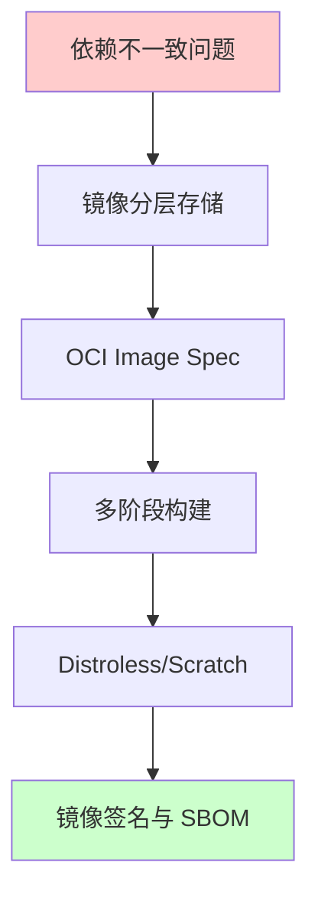
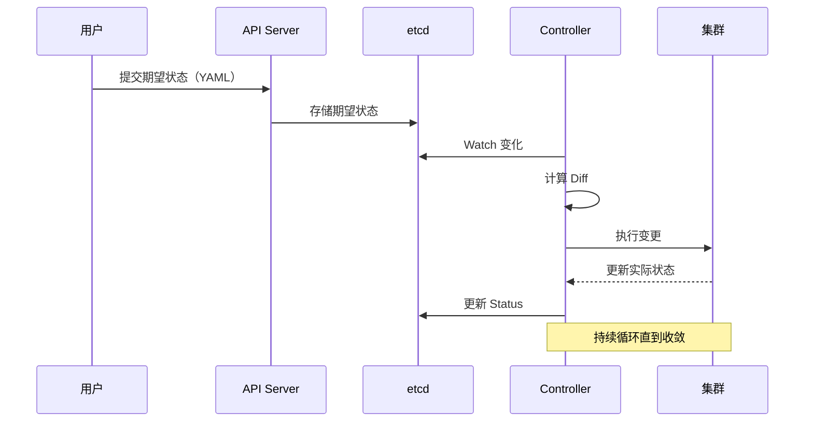
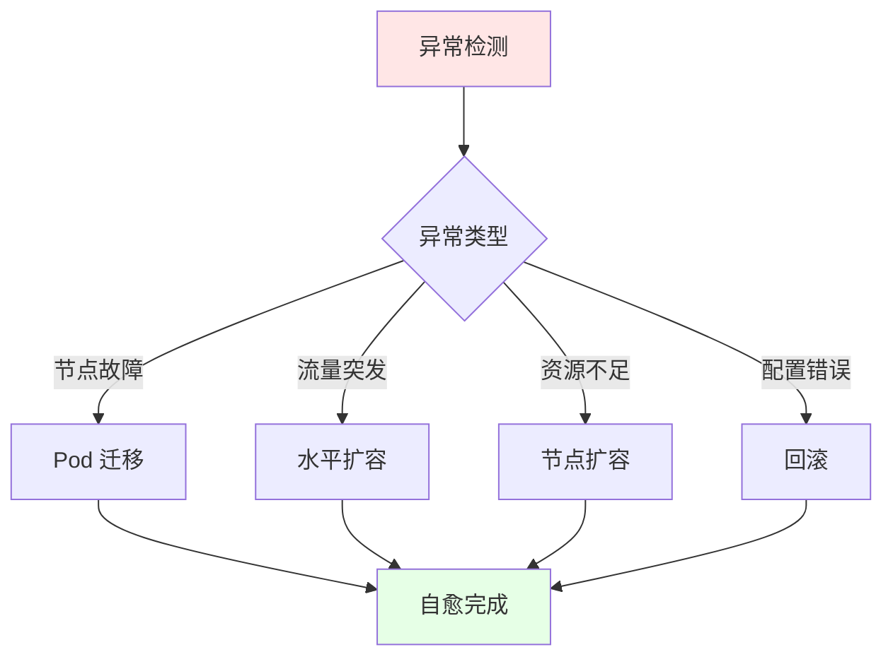
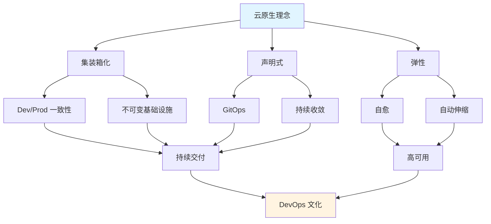
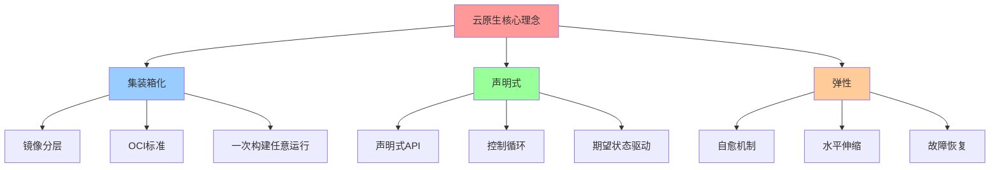
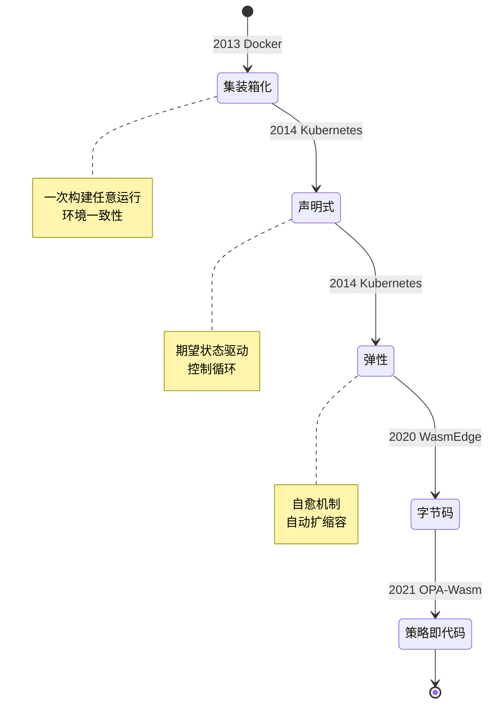
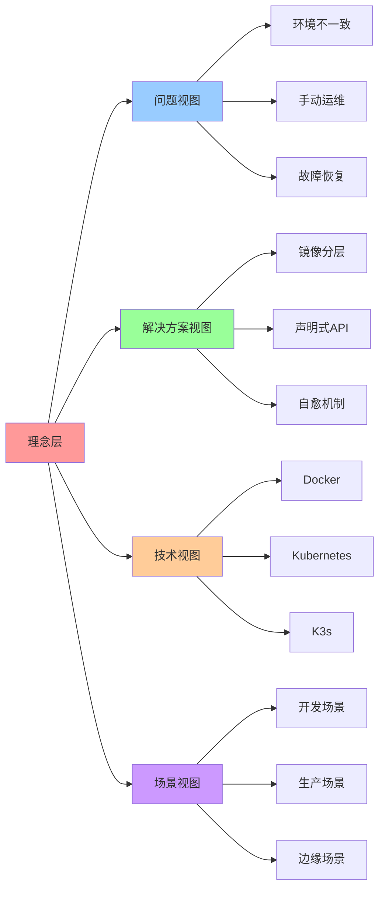

# 理念层：云原生核心思想演进

## 📑 目录

- [理念层：云原生核心思想演进](#理念层云原生核心思想演进)
  - [📑 目录](#-目录)
  - [1 文档定位](#1-文档定位)
  - [2 三大核心理念](#2-三大核心理念)
    - [2.1 集装箱化（Containerization）](#21-集装箱化containerization)
      - [2.1.1 问题域与核心思想](#211-问题域与核心思想)
      - [2.1.2 技术实现路径](#212-技术实现路径)
      - [2.1.3 演进路径分析](#213-演进路径分析)
      - [2.1.4 技术场景与决策](#214-技术场景与决策)
    - [2.2 声明式（Declarative）](#22-声明式declarative)
      - [2.2.1 问题域与核心思想](#221-问题域与核心思想)
      - [2.2.2 控制循环原理](#222-控制循环原理)
      - [2.2.3 声明式 vs 命令式](#223-声明式-vs-命令式)
      - [2.2.4 技术场景与决策](#224-技术场景与决策)
    - [2.3 弹性（Resilience）](#23-弹性resilience)
      - [2.3.1 问题域与核心思想](#231-问题域与核心思想)
      - [2.3.2 弹性机制](#232-弹性机制)
      - [2.3.3 弹性策略矩阵](#233-弹性策略矩阵)
      - [2.3.4 技术场景与决策](#234-技术场景与决策)
  - [3 理念关联图](#3-理念关联图)
  - [4 技术决策参考](#4-技术决策参考)
    - [4.1 何时选择声明式？](#41-何时选择声明式)
    - [4.2 何时需要弹性设计？](#42-何时需要弹性设计)
  - [5 形式化总结](#5-形式化总结)
    - [5.1 理念关系式](#51-理念关系式)
    - [5.2 控制循环收敛定理](#52-控制循环收敛定理)
    - [5.3 弹性决策模型](#53-弹性决策模型)
  - [6 参考](#6-参考)
  - [7 认知增强：思维导图、建模视图与图表达转换](#7-认知增强思维导图建模视图与图表达转换)
    - [7.1 理念层完整思维导图](#71-理念层完整思维导图)
    - [7.2 理念建模视图（状态机图）](#72-理念建模视图状态机图)
      - [理念演进状态机](#理念演进状态机)
    - [7.3 理念多维关系矩阵](#73-理念多维关系矩阵)
      - [理念-技术-场景三维矩阵](#理念-技术-场景三维矩阵)
      - [理念-问题-解决方案映射矩阵](#理念-问题-解决方案映射矩阵)
    - [7.4 图表达和转换](#74-图表达和转换)
      - [理念视图转换关系](#理念视图转换关系)
      - [视图转换规则](#视图转换规则)
    - [7.5 形象化解释论证](#75-形象化解释论证)
      - [理念的形象化类比](#理念的形象化类比)
        - [1. 集装箱化 = 标准化建筑](#1-集装箱化--标准化建筑)
        - [2. 声明式 = 智能家居系统](#2-声明式--智能家居系统)
        - [3. 弹性 = 自适应系统](#3-弹性--自适应系统)
        - [4. 理念演进 = 建筑风格演进](#4-理念演进--建筑风格演进)
    - [7.6 专家观点与论证](#76-专家观点与论证)
      - [计算信息软件科学家的观点](#计算信息软件科学家的观点)
        - [1. Solomon Hykes（Docker 创始人）](#1-solomon-hykesdocker-创始人)
        - [2. Joe Beda（Kubernetes 联合创始人）](#2-joe-bedakubernetes-联合创始人)
        - [3. Tim Hockin（Kubernetes 核心开发者）](#3-tim-hockinkubernetes-核心开发者)
      - [计算信息软件教育家的观点](#计算信息软件教育家的观点)
        - [1. Kelsey Hightower（Kubernetes 教育家）](#1-kelsey-hightowerkubernetes-教育家)
        - [2. Liz Rice（容器安全教育家）](#2-liz-rice容器安全教育家)
      - [计算信息软件认知学家的观点](#计算信息软件认知学家的观点)
        - [1. David Marr（计算认知科学家）](#1-david-marr计算认知科学家)
        - [2. Douglas Hofstadter（认知科学家）](#2-douglas-hofstadter认知科学家)
    - [7.7 认知学习路径矩阵](#77-认知学习路径矩阵)
    - [7.8 专家推荐阅读路径](#78-专家推荐阅读路径)
  - [8 2025 年最新实践](#8-2025-年最新实践)
    - [8.1 核心理念在云原生技术选型中的应用（2025）](#81-核心理念在云原生技术选型中的应用2025)
    - [8.2 核心理念在架构设计中的应用（2025）](#82-核心理念在架构设计中的应用2025)
  - [9 实际应用案例](#9-实际应用案例)
    - [案例 1：微服务架构设计（2025）](#案例-1微服务架构设计2025)
      - [理念应用](#理念应用)
    - [案例 2：Serverless 平台设计（2025）](#案例-2serverless-平台设计2025)
      - [理念应用](#理念应用-1)
    - [案例 3：边缘计算架构设计（2025）](#案例-3边缘计算架构设计2025)
      - [理念应用](#理念应用-2)

---

## 1 文档定位

本文档阐述从"集装箱化"到"声明式宇宙"的核心理念演进，以及每种理念背后的技术实现路
径、技术场景分析、决策依据和决策思路。

**文档结构**：

- **理念演进**：从问题域到解决方案的完整路径
- **技术场景**：不同场景下的理念应用
- **决策依据**：选择特定理念的技术原因
- **决策思路**：如何根据场景选择理念

## 2 三大核心理念

### 2.1 集装箱化（Containerization）

#### 2.1.1 问题域与核心思想

**问题域**：依赖地狱、"在我机器能跑"、环境不一致

**核心思想**：将"应用+依赖+文件系统"打包成不可变镜像，实现一次构建、任意运行。

**问题域分析**：

1. **依赖地狱**：不同环境需要不同版本的依赖，难以管理
2. **环境不一致**：开发、测试、生产环境差异导致问题
3. **"在我机器能跑"**：本地能运行，部署后失败

**核心思想论证**：

- **镜像不变性**：镜像一旦构建，内容不可变，确保环境一致性
- **分层存储**：利用文件系统分层，实现镜像复用和体积优化
- **标准化格式**：OCI Image Spec 实现跨平台兼容

#### 2.1.2 技术实现路径



**技术实现分析**：

- **镜像分层存储**：解决镜像体积和复用问题
- **OCI Image Spec**：解决跨平台兼容问题
- **多阶段构建**：解决构建环境和运行环境分离问题
- **Distroless/Scratch**：解决镜像体积和安全问题
- **镜像签名与 SBOM**：解决镜像安全和供应链问题

#### 2.1.3 演进路径分析

| 阶段       | 解决方案              | 副作用           | 再演化       |
| ---------- | --------------------- | ---------------- | ------------ |
| **初期**   | 单层镜像（fat image） | 体积大、重复存储 | → 分层存储   |
| **标准化** | OCI Image Spec        | 格式碎片化       | → 统一规范   |
| **优化**   | 多阶段构建            | 构建复杂度       | → BuildKit   |
| **极致**   | Distroless/Scratch    | 调试困难         | → 调试工具链 |

**演进路径论证**：

1. **初期问题**：单层镜像体积大，无法复用基础层

   - **解决方案**：分层存储，共享基础层
   - **效果**：镜像体积减少 50-70%，构建速度提升

2. **标准化问题**：不同容器运行时格式不统一

   - **解决方案**：OCI Image Spec 统一标准
   - **效果**：跨平台兼容，生态系统统一

3. **优化问题**：构建工具和运行时环境混合

   - **解决方案**：多阶段构建，分离构建和运行环境
   - **效果**：最终镜像体积进一步减小 80-90%

4. **极致问题**：最小化镜像但调试困难
   - **解决方案**：Distroless/Scratch + 调试工具链
   - **效果**：平衡安全性和可调试性

#### 2.1.4 技术场景与决策

**场景 1：开发环境**:

**场景描述**：本地开发需要快速迭代和调试

**决策依据**：

- ✅ 需要快速构建和启动
- ✅ 需要调试能力
- ✅ 体积不是关键因素

**决策思路**：

```yaml
开发环境镜像策略:
  基础镜像: alpine/node:latest # 包含开发工具
  构建方式: 单阶段构建 # 简化构建流程
  镜像体积: 可接受较大 # 重点是开发效率
```

**场景 2：生产环境**:

**场景描述**：生产环境需要安全、小体积、快速启动

**决策依据**：

- ✅ 安全是最高优先级
- ✅ 镜像体积影响拉取时间
- ✅ 启动速度影响用户体验

**决策思路**：

```yaml
生产环境镜像策略:
  基础镜像: distroless 或 scratch # 最小化攻击面
  构建方式: 多阶段构建 # 分离构建和运行环境
  镜像签名: 必须签名 # 验证镜像完整性
  镜像体积: 最小化 # 减少拉取时间
```

**场景 3：CI/CD 环境**:

**场景描述**：CI/CD 需要快速构建和可重复性

**决策依据**：

- ✅ 构建速度是关键
- ✅ 可重复性是必须
- ✅ 缓存利用最大化

**决策思路**：

```yaml
CI/CD 镜像策略:
  构建工具: BuildKit # 并行构建和缓存优化
  缓存策略: 分层缓存 # 最大化缓存命中率
  多阶段构建: 必须使用 # 分离构建和运行环境
```

**技术场景对比**：

| 场景         | 优先级              | 镜像策略              | 决策依据         |
| ------------ | ------------------- | --------------------- | ---------------- |
| **开发环境** | 开发效率 > 体积     | 单阶段 + 完整基础镜像 | 快速迭代需要     |
| **生产环境** | 安全 > 体积 > 速度  | 多阶段 + Distroless   | 安全性和体积优先 |
| **CI/CD**    | 构建速度 > 可重复性 | BuildKit + 多阶段     | 缓存和并行化     |

### 2.2 声明式（Declarative）

#### 2.2.1 问题域与核心思想

**问题域**：命令式脚本不可回滚、不可并发、难以复用

**核心思想**：只提交"期望状态"，系统通过控制循环持续 diff→ 收敛，自动达到期望状
态。

**问题域分析**：

1. **不可回滚**：命令式操作难以恢复到之前状态
2. **不可并发**：命令式操作需要顺序执行，无法并发
3. **难以复用**：命令式脚本高度耦合环境，难以复用

**核心思想论证**：

- **期望状态驱动**：系统持续比较期望状态和实际状态，自动收敛
- **幂等性保证**：声明式操作天然幂等，可重复执行
- **版本控制友好**：YAML 配置可纳入版本控制，实现配置即代码

#### 2.2.2 控制循环原理



**控制循环分析**：

1. **期望状态提交**：用户提交 YAML 配置，API Server 验证并存储到 etcd
2. **实际状态监听**：Controller 通过 Watch 监听 etcd 变化
3. **Diff 计算**：Controller 计算期望状态和实际状态的差异
4. **执行变更**：Controller 执行必要的操作使实际状态趋向期望状态
5. **状态更新**：Controller 更新实际状态到 etcd
6. **循环收敛**：重复上述过程直到实际状态 = 期望状态

**收敛性论证**：

- **收敛性定理**：在有限时间内，实际状态会收敛到期望状态
- **证明思路**：Controller 每次操作都会减小期望状态和实际状态的差异
- **收敛条件**：资源可用、网络连通、控制器运行正常

#### 2.2.3 声明式 vs 命令式

| 维度         | 命令式              | 声明式                        |
| ------------ | ------------------- | ----------------------------- |
| **表达方式** | `kubectl run nginx` | `kubectl apply -f nginx.yaml` |
| **可回滚性** | 困难                | 天然支持                      |
| **幂等性**   | 需手动保证          | 内置保证                      |
| **并发安全** | 需锁机制            | 资源级锁                      |
| **学习曲线** | 平缓                | 陡峭                          |

**对比分析**：

- **表达方式**：命令式更直观，声明式需要学习 YAML
- **可回滚性**：声明式可保存历史配置，命令式难以追溯
- **幂等性**：声明式天然幂等，命令式需要额外处理
- **并发安全**：声明式通过资源级锁保证，命令式需要应用层锁
- **学习曲线**：命令式学习成本低，声明式学习成本高但长期收益大

#### 2.2.4 技术场景与决策

**场景 1：单次操作**:

**场景描述**：需要执行一次性的运维操作

**决策依据**：

- ✅ 操作简单，不需要状态管理
- ✅ 不需要回滚能力
- ✅ 不需要版本控制

**决策思路**：

```yaml
单次操作策略:
  方式: 命令式 (kubectl run/exec)
  原因: 简单直接，学习成本低
  适用: 调试、临时操作
```

**场景 2：长期管理**:

**场景描述**：需要长期管理和版本控制的配置

**决策依据**：

- ✅ 需要版本控制
- ✅ 需要回滚能力
- ✅ 需要团队协作

**决策思路**：

```yaml
长期管理策略:
  方式: 声明式 (kubectl apply)
  原因: 版本控制、回滚、协作
  适用: 生产环境、团队协作
```

**场景 3：多环境部署**:

**场景描述**：需要在 Dev/Staging/Prod 环境部署相同应用

**决策依据**：

- ✅ 配置需要复用
- ✅ 环境差异需要管理
- ✅ 部署流程需要自动化

**决策思路**：

```yaml
多环境部署策略:
  方式: 声明式 + Helm/Kustomize
  原因: 配置复用、环境差异管理
  适用: CI/CD、多租户
```

**技术场景对比**：

| 场景           | 操作类型      | 决策依据       | 工具选择         |
| -------------- | ------------- | -------------- | ---------------- |
| **单次操作**   | 命令式        | 简单直接       | kubectl run/exec |
| **长期管理**   | 声明式        | 版本控制、回滚 | kubectl apply    |
| **多环境部署** | 声明式 + 模板 | 配置复用       | Helm/Kustomize   |

### 2.3 弹性（Resilience）

#### 2.3.1 问题域与核心思想

**问题域**：节点故障、流量突发、网络分区

**核心思想**：系统具备自愈、水平伸缩、故障隔离能力，自动应对异常情况。

**问题域分析**：

1. **节点故障**：硬件故障、网络中断、进程崩溃
2. **流量突发**：流量突然增加，超出系统容量
3. **网络分区**：部分节点无法通信，导致服务分裂

**核心思想论证**：

- **自愈机制**：系统自动检测故障并恢复服务
- **水平伸缩**：根据负载自动增加或减少实例
- **故障隔离**：故障不影响其他服务，保证系统整体可用性

#### 2.3.2 弹性机制



**弹性机制分析**：

1. **异常检测**：通过健康检查、监控指标、事件监听检测异常
2. **故障处理**：根据异常类型选择处理策略
3. **恢复验证**：验证恢复效果，确保系统恢复正常

#### 2.3.3 弹性策略矩阵

| 异常场景     | 检测机制           | 自动响应           | 人工介入   |
| ------------ | ------------------ | ------------------ | ---------- |
| **节点故障** | Node 心跳检测      | Pod 迁移到健康节点 | 修复节点   |
| **流量突发** | HPA 指标监控       | 自动扩容 Pod       | 调整策略   |
| **资源不足** | Cluster Autoscaler | 添加节点           | 节点池配置 |
| **配置错误** | 健康检查失败       | 回滚到上一版本     | 修复配置   |

**弹性策略论证**：

- **节点故障**：通过 Node Controller 检测节点状态，自动迁移 Pod
- **流量突发**：通过 HPA 监控 CPU/内存/QPS，自动扩容 Pod
- **资源不足**：通过 Cluster Autoscaler 监控资源使用，自动添加节点
- **配置错误**：通过健康检查检测 Pod 状态，自动回滚配置

#### 2.3.4 技术场景与决策

**场景 1：无状态服务**:

**场景描述**：无状态服务可以快速扩容和迁移

**决策依据**：

- ✅ Pod 可以任意迁移
- ✅ 扩容速度快
- ✅ 故障恢复时间短

**决策思路**：

```yaml
无状态服务策略:
  副本数: 最小 3 个 (高可用)
  HPA: 基于 CPU/内存/QPS
  PDB: 允许 100% Pod 中断
  恢复时间: < 30s
```

**场景 2：有状态服务**:

**场景描述**：有状态服务需要数据持久化和有序迁移

**决策依据**：

- ✅ 需要持久化存储
- ✅ 迁移需要顺序处理
- ✅ 故障恢复时间较长

**决策思路**：

```yaml
有状态服务策略:
  副本数: 奇数个 (Raft 共识)
  StatefulSet: 有序部署和迁移
  PDB: 最多中断 1 个 Pod
  恢复时间: < 5min
```

**场景 3：关键服务**:

**场景描述**：关键服务需要零停机时间

**决策依据**：

- ✅ 不能有服务中断
- ✅ 需要滚动更新
- ✅ 需要健康检查

**决策思路**：

```yaml
关键服务策略:
  副本数: 最小 5 个 (冗余)
  PDB: 最多中断 20% Pod
  滚动更新: maxSurge=2, maxUnavailable=0
  健康检查: 必须配置
  恢复时间: < 10s
```

**技术场景对比**：

| 场景           | 副本策略  | 伸缩策略         | 故障恢复时间 |
| -------------- | --------- | ---------------- | ------------ |
| **无状态服务** | 最小 3 个 | HPA 快速扩容     | < 30s        |
| **有状态服务** | 奇数个    | StatefulSet 有序 | < 5min       |
| **关键服务**   | 最小 5 个 | 滚动更新 + PDB   | < 10s        |

## 3 理念关联图



**理念关联分析**：

- **集装箱化** → **Dev/Prod 一致性** → **持续交付**
- **声明式** → **GitOps** → **持续交付**
- **弹性** → **高可用** → **DevOps 文化**

## 4 技术决策参考

### 4.1 何时选择声明式？

**决策依据**：

- ✅ 需要版本控制配置
- ✅ 需要回滚能力
- ✅ 多环境部署（Dev/Staging/Prod）
- ✅ 配置需要多人协作

**决策思路**：

```yaml
选择声明式的条件:
  if 需要版本控制: 选择声明式
  elif 需要回滚: 选择声明式
  elif 多环境部署: 选择声明式
  else: 选择命令式
```

### 4.2 何时需要弹性设计？

**决策依据**：

- ✅ 生产环境部署
- ✅ 流量波动大
- ✅ 成本敏感（按需扩容）
- ✅ SLA 要求高

**决策思路**：

```yaml
需要弹性设计的条件:
  if 生产环境: 必须弹性设计
  elif 流量波动 > 50%: 建议弹性设计
  elif SLA > 99.9%: 必须弹性设计
  else: 可选弹性设计
```

## 5 形式化总结

### 5.1 理念关系式

设理念为 $P = \{C, D, R\}$，其中：

- $C$ = 集装箱化（Containerization）
- $D$ = 声明式（Declarative）
- $R$ = 弹性（Resilience）

**关系定义**：

- $C \rightarrow D$：集装箱化是声明式的基础
- $D \rightarrow R$：声明式是弹性的前提
- $C \land D \land R$：三者结合实现云原生

### 5.2 控制循环收敛定理

**定理 2.1**（控制循环收敛）：在有限时间内，实际状态 $S_a$ 会收敛到期望状态
$S_e$。

$$\lim_{t \to \infty} |S_a(t) - S_e(t)| = 0$$

**证明**：

1. Controller 每次操作都会减小 $|S_a(t) - S_e(t)|$
2. 在资源可用的情况下，差异会单调递减
3. 当 $|S_a(t) - S_e(t)| < \epsilon$ 时，系统达到收敛状态

$\square$

### 5.3 弹性决策模型

**模型定义**：弹性决策函数

$$
E(S, L, R) = \begin{cases}
\text{HPA} & \text{if } L > L_{\text{threshold}} \land S = \text{stateless} \\
\text{CA} & \text{if } R < R_{\text{threshold}} \\
\text{PDB} & \text{if } S = \text{critical} \\
\text{None} & \text{otherwise}
\end{cases}
$$

其中：

- $S$ = 服务类型（stateless/stateful/critical）
- $L$ = 负载指标
- $R$ = 资源使用率

## 6 参考

[declarative]:
[Kubernetes 声明式 API](https://kubernetes.io/docs/concepts/overview/working-with-objects/object-management/)

[resilience]:
[Kubernetes 弹性设计](https://kubernetes.io/docs/tasks/run-application/run-stateless-application-deployment/)

---

## 7 认知增强：思维导图、建模视图与图表达转换

### 7.1 理念层完整思维导图



### 7.2 理念建模视图（状态机图）

#### 理念演进状态机



### 7.3 理念多维关系矩阵

#### 理念-技术-场景三维矩阵

| 理念维度 | 集装箱化 | 声明式 | 弹性 | Docker | Kubernetes | K3s | WasmEdge | 开发场景 | 生产场景 | 边缘场景 | 认知价值 |
|---------|---------|--------|------|--------|------------|-----|----------|---------|---------|---------|---------|
| **核心特征** | 打包隔离 | 期望状态 | 自动恢复 | ✅ 核心 | ✅ 核心 | ✅ 继承 | ⚠️ 部分 | ✅ 适用 | ✅ 适用 | ✅ 适用 | 理念理解 |
| **技术实现** | 镜像分层 | 声明式API | 副本管理 | ✅ 实现 | ✅ 实现 | ✅ 实现 | ⚠️ 部分 | ✅ 适用 | ✅ 适用 | ✅ 适用 | 技术理解 |
| **演进关系** | 基础理念 | 演进理念 | 增强理念 | 理念→技术 | 理念→技术 | 理念→技术 | 理念→技术 | 场景适配 | 场景适配 | 场景适配 | 演进理解 |

#### 理念-问题-解决方案映射矩阵

| 理念 | 核心问题 | 解决方案 | 技术实现 | 副作用 | 再演化 | 认知价值 |
|-----|---------|---------|---------|--------|--------|---------|
| **集装箱化** | 环境不一致 | 不可变镜像 | Docker OCI | 镜像体积大 | 多阶段构建 | 问题理解 |
| **声明式** | 手动运维复杂 | 声明式API | Kubernetes | 学习曲线陡 | GitOps | 问题理解 |
| **弹性** | 故障恢复慢 | 自愈机制 | Kubernetes | 资源消耗 | 智能调度 | 问题理解 |

### 7.4 图表达和转换

#### 理念视图转换关系



#### 视图转换规则

**转换规则 1：问题视图 → 解决方案视图**:

```yaml
问题视图转换:
  输入: 问题（环境不一致、手动运维、故障恢复）
  转换规则:
    - 环境不一致 → 集装箱化（不可变镜像）
    - 手动运维 → 声明式（声明式API）
    - 故障恢复 → 弹性（自愈机制）
  输出: 解决方案（镜像分层、声明式API、自愈机制）
```

**转换规则 2：解决方案视图 → 技术视图**:

```yaml
解决方案视图转换:
  输入: 解决方案（镜像分层、声明式API、自愈机制）
  转换规则:
    - 镜像分层 → Docker OCI标准
    - 声明式API → Kubernetes控制循环
    - 自愈机制 → Kubernetes副本管理
  输出: 技术实现（Docker、K8s、K3s）
```

**转换规则 3：技术视图 → 场景视图**:

```yaml
技术视图转换:
  输入: 技术特性（Docker、K8s、K3s）
  转换规则:
    - Docker → 开发场景、单机部署
    - Kubernetes → 生产场景、大规模集群
    - K3s → 边缘场景、资源受限
  输出: 适用场景（开发、生产、边缘）
```

### 7.5 形象化解释论证

#### 理念的形象化类比

##### 1. 集装箱化 = 标准化建筑

> **类比**：集装箱化就像标准化建筑，镜像就像"预制构件"（标准化组件），OCI标准就像"建筑规范"（统一标准），一次构建任意运行就像"构件可复用"（一次制造多处使用），就像标准化建筑从预制构件到建筑规范再到构件复用的演进一样，集装箱化从镜像到OCI标准再到一次构建任意运行的演进。

**认知价值**：

- **标准化理解**：通过标准化建筑类比，理解集装箱化的标准化特征
- **复用理解**：通过构件复用类比，理解镜像的可复用性
- **规范理解**：通过建筑规范类比，理解OCI标准的重要性

##### 2. 声明式 = 智能家居系统

> **类比**：声明式就像智能家居系统，期望状态就像"设定温度"（目标状态），控制循环就像"自动调节"（持续调整），声明式API就像"语音控制"（简单指令），就像智能家居从设定温度到自动调节再到语音控制的演进一样，声明式从期望状态到控制循环再到声明式API的演进。

**认知价值**：

- **目标理解**：通过设定温度类比，理解期望状态的目标导向
- **自动理解**：通过自动调节类比，理解控制循环的自动性
- **简单理解**：通过语音控制类比，理解声明式API的简洁性

##### 3. 弹性 = 自适应系统

> **类比**：弹性就像自适应系统，自愈机制就像"自动修复"（故障恢复），水平伸缩就像"自动扩容"（资源调整），故障恢复就像"自动切换"（服务切换），就像自适应系统从自动修复到自动扩容再到自动切换的演进一样，弹性从自愈机制到水平伸缩再到故障恢复的演进。

**认知价值**：

- **自愈理解**：通过自动修复类比，理解自愈机制的自动性
- **伸缩理解**：通过自动扩容类比，理解水平伸缩的灵活性
- **恢复理解**：通过自动切换类比，理解故障恢复的可靠性

##### 4. 理念演进 = 建筑风格演进

> **类比**：理念演进就像建筑风格演进，集装箱化是"标准化建筑"（统一标准），声明式是"智能建筑"（自动控制），弹性是"抗震建筑"（自动恢复），就像建筑风格从标准化到智能化再到弹性化的演进一样，理念从集装箱化到声明式再到弹性的演进。

**认知价值**：

- **演进理解**：通过建筑风格演进类比，理解理念演进的历史脉络
- **理念理解**：通过建筑特性类比，理解各理念的核心特征
- **趋势理解**：通过建筑趋势类比，理解技术发展的未来趋势

### 7.6 专家观点与论证

#### 计算信息软件科学家的观点

##### 1. Solomon Hykes（Docker 创始人）

> "Docker is about shipping your application, not shipping your machine. The container is the new unit of deployment."

**在理念层中的应用**：

- **部署单元**：容器成为新的部署单元，体现集装箱化理念
- **环境一致性**：容器确保环境一致性，解决"在我机器能跑"的问题
- **标准化**：容器标准化了应用部署，推动OCI标准

##### 2. Joe Beda（Kubernetes 联合创始人）

> "Kubernetes is about making the complex simple. It's about declarative configuration and automatic reconciliation."

**在理念层中的应用**：

- **简化复杂性**：Kubernetes通过声明式配置简化复杂系统管理
- **声明式配置**：声明式配置提高可维护性，体现声明式理念
- **自动协调**：自动协调实现自愈能力，体现弹性理念

##### 3. Tim Hockin（Kubernetes 核心开发者）

> "The control loop is the heart of Kubernetes. It's what makes Kubernetes declarative and self-healing."

**在理念层中的应用**：

- **控制循环**：控制循环是Kubernetes的核心，实现声明式理念
- **自愈能力**：控制循环实现自愈能力，体现弹性理念
- **期望状态**：控制循环驱动期望状态，体现声明式理念

#### 计算信息软件教育家的观点

##### 1. Kelsey Hightower（Kubernetes 教育家）

> "Understanding Kubernetes is about understanding the control loop. Once you understand the control loop, everything else makes sense."

**教育价值**：

- **控制循环**：理解控制循环是理解Kubernetes的关键
- **核心理念**：控制循环体现声明式和弹性理念
- **学习路径**：从控制循环开始学习Kubernetes

##### 2. Liz Rice（容器安全教育家）

> "Container security is about understanding the isolation boundaries. Each technology provides different levels of isolation."

**教育价值**：

- **隔离边界**：理解隔离边界是理解容器安全的关键
- **层次理解**：不同技术提供不同层次的隔离
- **理念理解**：通过隔离边界理解集装箱化理念

#### 计算信息软件认知学家的观点

##### 1. David Marr（计算认知科学家）

> "Understanding complex systems requires understanding them at multiple levels: computation, algorithm, and implementation."

**认知价值**：

- **多层次理解**：理解复杂系统需要在多个层次上理解
- **理念层次**：理念层是理解技术栈的重要层次
- **系统理解**：通过理念层理解技术栈的系统性

##### 2. Douglas Hofstadter（认知科学家）

> "Analogy is the core of cognition. Understanding new concepts through analogy helps us build mental models."

**认知价值**：

- **类比核心**：类比是认知的核心
- **理念理解**：通过类比理解理念概念
- **模型构建**：通过类比构建理念的心理模型

### 7.7 认知学习路径矩阵

| 学习阶段 | 核心理念 | 形象化理解 | 技术理解 | 实践应用 | 认知目标 |
|---------|---------|-----------|---------|---------|---------|
| **入门** | 集装箱化 | 标准化建筑类比 | Docker镜像 | 镜像构建 | 建立基础 |
| **进阶** | 声明式 | 智能家居类比 | Kubernetes API | 声明式配置 | 理解理念 |
| **高级** | 弹性 | 自适应系统类比 | 自愈机制 | 故障恢复 | 掌握理念 |

### 7.8 专家推荐阅读路径

**计算信息软件科学家推荐路径**：

1. **理念演进**：从集装箱化到声明式再到弹性的理念演进
2. **技术实现**：理解理念在技术中的实现方式
3. **问题解决**：理解理念解决的核心问题
4. **演进逻辑**：理解理念演进的内在逻辑

**计算信息软件教育家推荐路径**：

1. **形象化理解**：通过标准化建筑、智能家居、自适应系统等类比，建立直观理解
2. **渐进学习**：从简单理念开始，逐步学习复杂理念
3. **实践结合**：结合实际案例，理解理念应用
4. **思维训练**：通过理念学习，训练系统性思维能力

**计算信息软件认知学家推荐路径**：

1. **认知模式**：识别理念层中的认知模式
2. **类比理解**：通过类比理解理念概念
3. **模型构建**：构建理念的心理模型
4. **认知提升**：通过理念学习，提升认知能力

## 8 2025 年最新实践

### 8.1 核心理念在云原生技术选型中的应用（2025）

**2025 年趋势**：使用核心理念指导云原生技术选型

**实践要点**：

- **理念驱动**：使用集装箱化、声明式、弹性理念指导技术选型
- **理念组合**：组合多个理念进行综合技术选型
- **理念验证**：验证技术选型是否符合核心理念

**代码示例**：

```python
# 2025 年理念驱动技术选型工具
class PrincipleDrivenTechSelector:
    def __init__(self):
        self.principles = {
            'containerization': self.evaluate_containerization,
            'declarative': self.evaluate_declarative,
            'resilience': self.evaluate_resilience
        }

    def select_technology(self, requirements, principles=['containerization', 'declarative']):
        """使用核心理念选择技术"""
        scores = {}

        for tech in self.available_technologies:
            score = 0
            for principle in principles:
                principle_score = self.principles[principle](tech, requirements)
                score += principle_score
            scores[tech] = score / len(principles)

        return max(scores, key=scores.get), scores
```

### 8.2 核心理念在架构设计中的应用（2025）

**2025 年趋势**：使用核心理念指导架构设计

**实践要点**：

- **理念应用**：在架构设计中应用集装箱化、声明式、弹性理念
- **理念组合**：组合多个理念设计综合架构
- **理念验证**：验证架构设计是否符合核心理念

**代码示例**：

```python
# 架构设计理念应用工具
class ArchitecturePrincipleApplier:
    def apply_principles(self, architecture, principles):
        """应用核心理念到架构设计"""
        for principle in principles:
            if principle == 'containerization':
                architecture = self.apply_containerization(architecture)
            elif principle == 'declarative':
                architecture = self.apply_declarative(architecture)
            elif principle == 'resilience':
                architecture = self.apply_resilience(architecture)

        return architecture
```

## 9 实际应用案例

### 案例 1：微服务架构设计（2025）

**场景**：使用核心理念设计微服务架构

**实现方案**：

```yaml
# 微服务架构配置（集装箱化 + 声明式 + 弹性）
apiVersion: apps/v1
kind: Deployment
metadata:
  name: user-service
spec:
  replicas: 3  # 弹性：多副本
  selector:
    matchLabels:
      app: user-service
  template:
    metadata:
      labels:
        app: user-service
    spec:
      containers:  # 集装箱化：容器封装
      - name: user-service
        image: user-service:latest
        resources:
          requests:
            cpu: "200m"
            memory: "256Mi"
          limits:
            cpu: "500m"
            memory: "512Mi"
---
apiVersion: v1
kind: Service
metadata:
  name: user-service
spec:
  selector:
    app: user-service
  ports:
  - port: 80
    targetPort: 8080
```

#### 理念应用

- **集装箱化**：使用容器封装微服务
- **声明式**：使用 Kubernetes 声明式配置
- **弹性**：使用多副本和自动扩缩容

### 案例 2：Serverless 平台设计（2025）

**场景**：使用核心理念设计 Serverless 平台

**实现方案**：

```yaml
# Serverless 函数配置（声明式 + 弹性）
apiVersion: serving.knative.dev/v1
kind: Service
metadata:
  name: serverless-function
spec:
  template:
    metadata:
      annotations:
        autoscaling.knative.dev/minScale: "0"  # 弹性：自动扩缩容
        autoscaling.knative.dev/maxScale: "10"
    spec:
      containers:  # 集装箱化：容器封装
      - image: function:latest
        resources:
          requests:
            cpu: "100m"
            memory: "128Mi"
          limits:
            cpu: "500m"
            memory: "512Mi"
```

#### 理念应用

- **集装箱化**：使用容器封装函数
- **声明式**：使用 Knative 声明式配置
- **弹性**：使用自动扩缩容（从 0 到 10）

### 案例 3：边缘计算架构设计（2025）

**场景**：使用核心理念设计边缘计算架构

**实现方案**：

```yaml
# 边缘计算架构配置（集装箱化 + 声明式 + 弹性）
apiVersion: apps/v1
kind: Deployment
metadata:
  name: edge-app
spec:
  replicas: 3  # 弹性：多副本
  selector:
    matchLabels:
      app: edge-app
  template:
    metadata:
      labels:
        app: edge-app
    spec:
      runtimeClassName: wasmedge  # 集装箱化：轻量级运行时
      nodeSelector:
        node-type: edge
      containers:  # 集装箱化：容器封装
      - name: edge-app
        image: edge-app:latest
        resources:
          requests:
            cpu: "100m"
            memory: "128Mi"
          limits:
            cpu: "200m"
            memory: "256Mi"
```

#### 理念应用

- **集装箱化**：使用 WasmEdge 轻量级运行时和容器封装
- **声明式**：使用 Kubernetes 声明式配置
- **弹性**：使用多副本和资源限制

---

> 完整参考列表见 [REFERENCES.md](../REFERENCES.md)
>
> ---
>
> **最后更新**：2025-11-15
> **文档状态**：✅ 完整 | 📊 包含思维导图、建模视图、多维矩阵、图表达转换、形象化解释论证、专家观点、2025年最新实践 | 🎯 生产就绪
> **维护者**：项目团队
