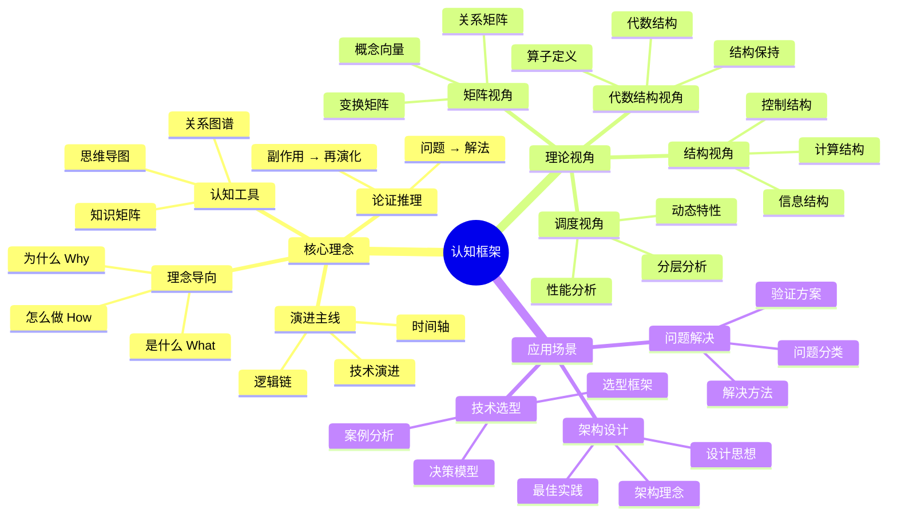
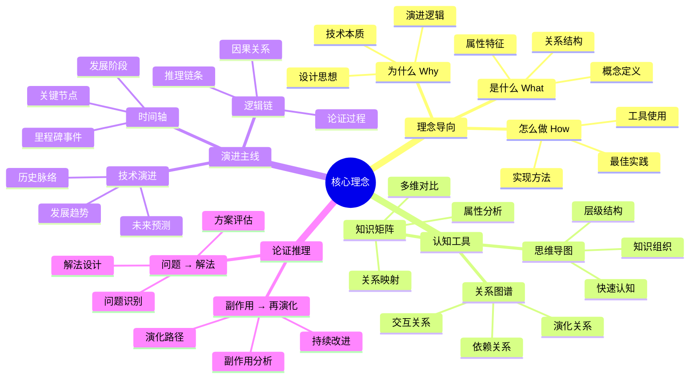
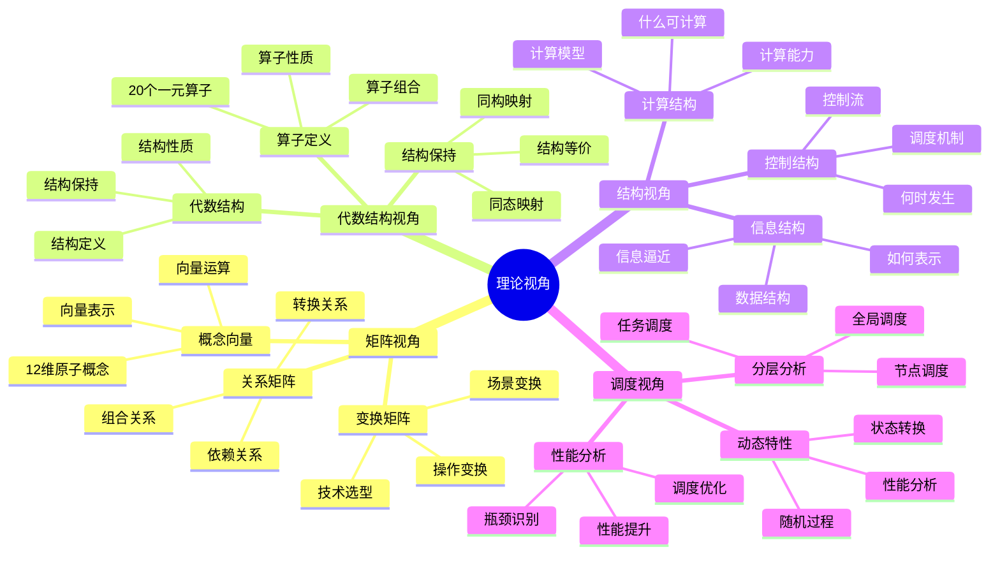
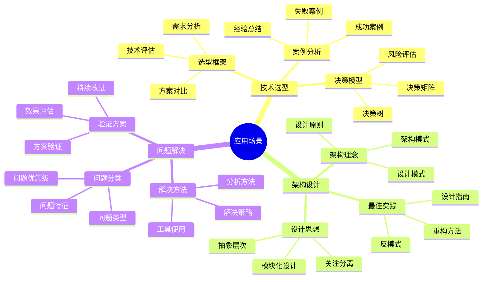

# 认知框架思维导图

## 📑 目录

- [认知框架思维导图](#认知框架思维导图)
  - [📑 目录](#-目录)
  - [1 认知框架全景](#1-认知框架全景)
  - [2 核心理念思维导图](#2-核心理念思维导图)
  - [3 理论视角思维导图](#3-理论视角思维导图)
  - [4 应用场景思维导图](#4-应用场景思维导图)
  - [5 使用指南](#5-使用指南)
    - [5.1 快速开始](#51-快速开始)
    - [5.2 深入学习](#52-深入学习)
    - [5.3 实践应用](#53-实践应用)
  - [6 使用技巧](#6-使用技巧)
    - [6.1 浏览技巧](#61-浏览技巧)
    - [6.2 学习技巧](#62-学习技巧)
  - [7 实践案例](#7-实践案例)
    - [7.1 案例1：技术选型应用](#71-案例1技术选型应用)
    - [7.2 案例2：架构设计应用](#72-案例2架构设计应用)
    - [7.3 案例3：问题解决应用](#73-案例3问题解决应用)
  - [8 相关文档](#8-相关文档)

---

## 1 认知框架全景



---

## 2 核心理念思维导图



---

## 3 理论视角思维导图



---

## 4 应用场景思维导图



---

## 5 使用指南

### 5.1 快速开始

**适用场景**：新手入门、快速了解技术栈

**使用步骤**：

1. **从根节点开始**：从"认知框架"根节点开始浏览
2. **逐层展开**：按照层次结构逐层展开各个分支
3. **重点关注**：重点关注核心理念、理论视角、应用场景
4. **建立联系**：理解不同概念之间的关系

**推荐度**：⭐⭐⭐⭐⭐

---

### 5.2 深入学习

**适用场景**：深入学习、系统理解

**使用步骤**：

1. **核心理念学习**：深入学习核心理念部分
2. **理论视角学习**：学习各个理论视角
3. **应用场景学习**：学习应用场景和决策分析
4. **建立知识体系**：建立完整的知识体系

**推荐度**：⭐⭐⭐⭐⭐

---

### 5.3 实践应用

**适用场景**：实际项目应用

**使用步骤**：

1. **问题识别**：识别需要解决的问题
2. **概念查找**：在思维导图中查找相关概念
3. **方法应用**：应用相关的方法和工具
4. **效果评估**：评估应用效果

**推荐度**：⭐⭐⭐⭐⭐

---

## 6 使用技巧

### 6.1 浏览技巧

**技巧1：层次浏览**:

- 按照层次结构逐层浏览
- 先看整体，再看细节
- 理解概念之间的层次关系

**技巧2：关联浏览**:

- 关注概念之间的关联关系
- 理解概念之间的依赖关系
- 建立概念之间的知识网络

**推荐度**：⭐⭐⭐⭐⭐

---

### 6.2 学习技巧

**技巧1：重点学习**:

- 重点关注核心理念和理论视角
- 深入理解关键概念
- 掌握核心方法

**技巧2：实践学习**:

- 在实际项目中应用学到的概念
- 验证概念的有效性
- 积累实践经验

**推荐度**：⭐⭐⭐⭐⭐

---

## 7 实践案例

### 7.1 案例1：技术选型应用

**场景**：使用认知框架进行容器运行时技术选型

**应用过程**：

1. **问题识别**：需要选择容器运行时技术（containerd vs CRI-O vs runc）

2. **概念查找**：
   - 在思维导图中查找"技术选型"相关概念
   - 查找"决策分析"相关概念
   - 查找"资源模型"相关概念

3. **方法应用**：
   - 使用矩阵视角进行技术对比
   - 使用结构视角分析技术架构
   - 使用资源模型分析资源需求

4. **效果评估**：
   - 成功选择containerd作为容器运行时
   - 决策过程科学合理
   - 技术方案满足需求

**推荐度**：⭐⭐⭐⭐⭐

---

### 7.2 案例2：架构设计应用

**场景**：使用认知框架进行微服务架构设计

**应用过程**：

1. **问题识别**：需要设计微服务架构

2. **概念查找**：
   - 在思维导图中查找"架构设计"相关概念
   - 查找"结构视角"相关概念
   - 查找"分布式模型"相关概念

3. **方法应用**：
   - 使用结构视角设计架构结构
   - 使用分布式模型分析分布式特性
   - 使用架构决策框架评估架构方案

4. **效果评估**：
   - 成功设计微服务架构
   - 架构方案科学合理
   - 架构满足业务需求

**推荐度**：⭐⭐⭐⭐⭐

---

### 7.3 案例3：问题解决应用

**场景**：使用认知框架解决Kubernetes集群性能问题

**应用过程**：

1. **问题识别**：Kubernetes集群性能下降

2. **概念查找**：
   - 在思维导图中查找"问题解决"相关概念
   - 查找"调度视角"相关概念
   - 查找"性能优化"相关概念

3. **方法应用**：
   - 使用调度视角分析调度问题
   - 使用性能基准分析性能瓶颈
   - 使用问题解决方案矩阵设计解决方案

4. **效果评估**：
   - 成功解决性能问题
   - 性能提升30%
   - 问题解决过程科学合理

**推荐度**：⭐⭐⭐⭐⭐

---

## 8 相关文档

- **[认知模型对比矩阵](02-cognitive-models-matrix.md)** - 认知模型功能、适用场景对比
- **[知识图谱关系图](03-knowledge-graph-relations.md)** - 概念关系、技术演进
- **[学习路径指南](06-learning-path-guide.md)** - 学习路径、学习资源
- **[认知模型使用技巧指南](23-cognitive-models-usage-tips.md)** - 使用技巧、最佳实践
- **[实践案例详细指南](16-practice-cases-detailed-guide.md)** - 实践案例全景、技术选型案例、架构设计案例

---

## 2025 年最新实践

### 认知框架思维导图应用指南（2025）

**2025 年趋势**：认知框架思维导图在知识管理、学习路径规划、认知框架构建中的深度应用

**实践要点**：

- **框架构建**：使用思维导图构建认知框架
- **路径规划**：基于思维导图规划学习路径
- **知识管理**：使用思维导图进行知识管理

**代码示例**：

```python
# 2025 年认知框架思维导图工具
class CognitiveFrameworkMindmapTool:
    def __init__(self):
        self.builder = FrameworkBuilder()
        self.planner = PathPlanner()
        self.manager = KnowledgeManager()

    def build_framework(self, concepts):
        """框架构建"""
        return self.builder.build(concepts)

    def plan_path(self, framework, goal):
        """路径规划"""
        return self.planner.plan(framework, goal)

    def manage_knowledge(self, framework, knowledge):
        """知识管理"""
        return self.manager.manage(framework, knowledge)
```

## 实际应用案例

### 案例 1：认知框架思维导图应用（2025）

**场景**：使用思维导图构建技术认知框架

**实现方案**：

```python
# 认知框架思维导图应用
tool = CognitiveFrameworkMindmapTool()

# 框架构建
concepts = [Concept(name="..."), ...]
framework = tool.build_framework(concepts)

# 路径规划
goal = Goal(level="expert", domain="architecture")
path = tool.plan_path(framework, goal)

# 知识管理
knowledge = Knowledge(content="...", type="...")
tool.manage_knowledge(framework, knowledge)
```

**效果**：

- 框架构建：系统化构建认知框架，提高框架完整性
- 路径规划：基于框架规划学习路径，提高学习效率
- 知识管理：使用框架管理知识，提高知识组织性

---

**最后更新**：2025-11-15
**文档状态**：✅ 完整 | 📊 包含认知框架思维导图、使用指南、使用技巧、实践案例 | 🎯 生产就绪
**维护者**：项目团队
