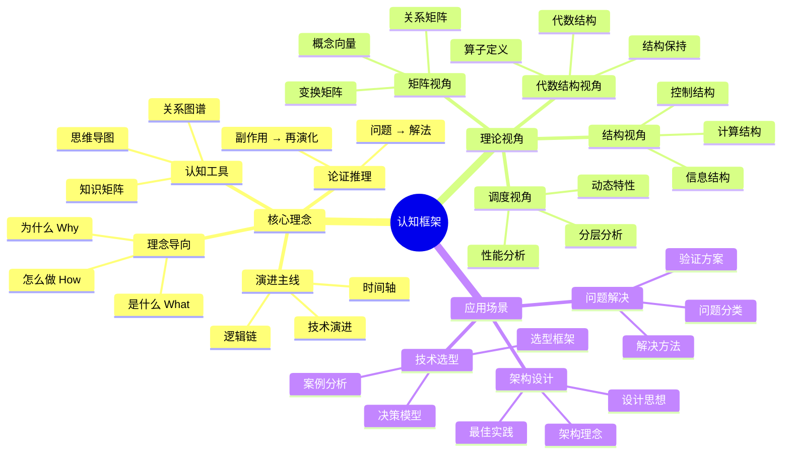
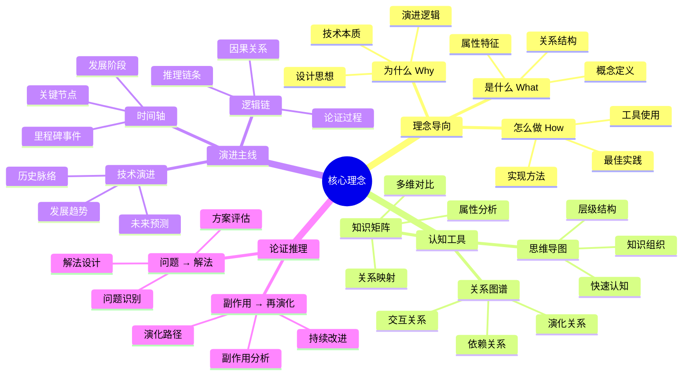
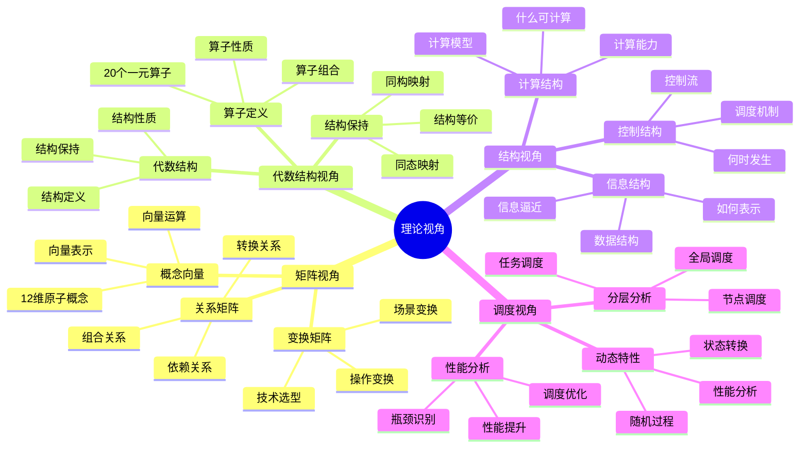
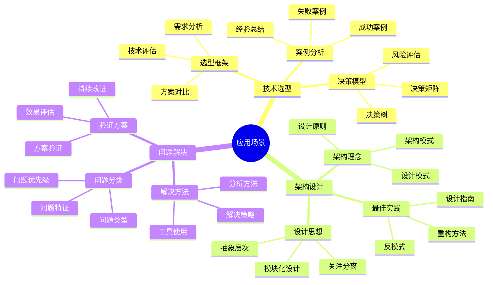

# 认知框架思维导图

## 📑 目录

- [认知框架思维导图](#认知框架思维导图)
  - [📑 目录](#-目录)
  - [1 认知框架全景](#1-认知框架全景)
  - [2 核心理念思维导图](#2-核心理念思维导图)
  - [3 理论视角思维导图](#3-理论视角思维导图)
  - [4 应用场景思维导图](#4-应用场景思维导图)

---

## 1 认知框架全景

---

## 2 核心理念思维导图

---

## 3 理论视角思维导图

---

## 4 应用场景思维导图

---

**最后更新**：2025-11-07
**文档状态**：✅ 完整 | 📊 包含认知框架思维导图 | 🎯 生产就绪
**维护者**：项目团队
