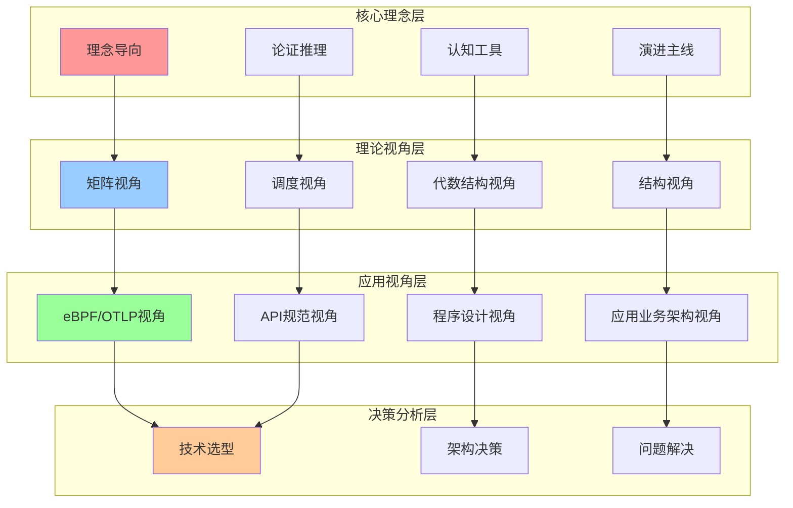
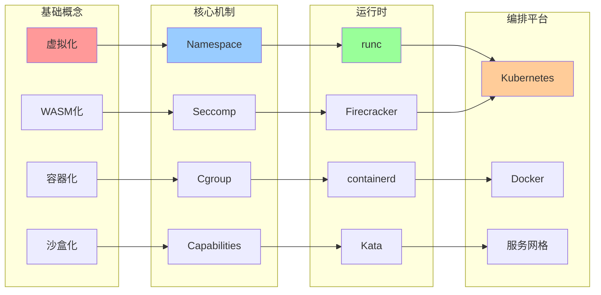
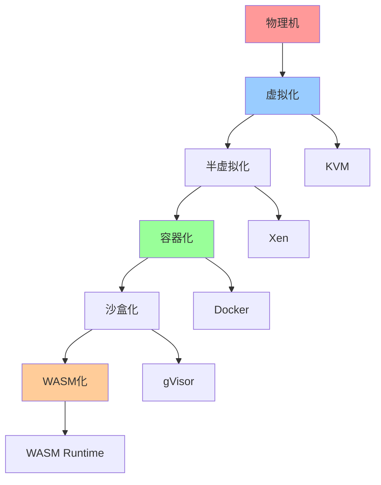
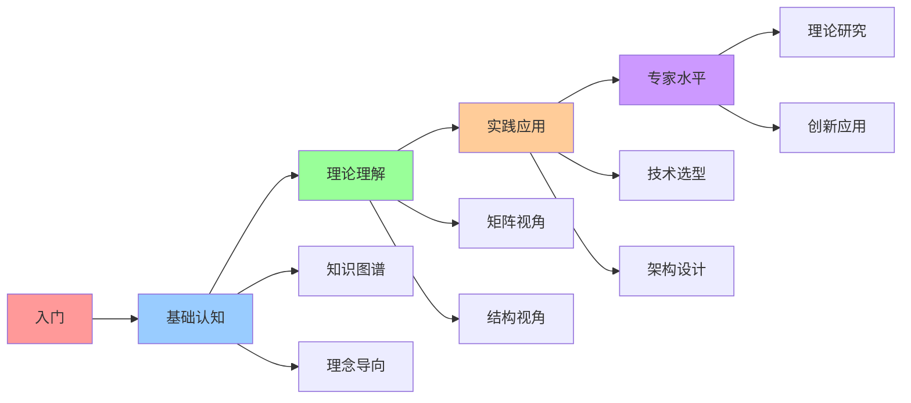

# 知识图谱关系图

## 📑 目录

- [知识图谱关系图](#知识图谱关系图)
  - [📑 目录](#-目录)
  - [1 知识图谱全景](#1-知识图谱全景)
  - [2 概念关系图](#2-概念关系图)
  - [3 技术演进关系图](#3-技术演进关系图)
  - [4 认知路径关系图](#4-认知路径关系图)

---

## 1 知识图谱全景

---

## 2 概念关系图

---

## 3 技术演进关系图

---

## 4 认知路径关系图

---

**最后更新**：2025-11-07
**文档状态**：✅ 完整 | 📊 包含知识图谱关系图 | 🎯 生产就绪
**维护者**：项目团队
