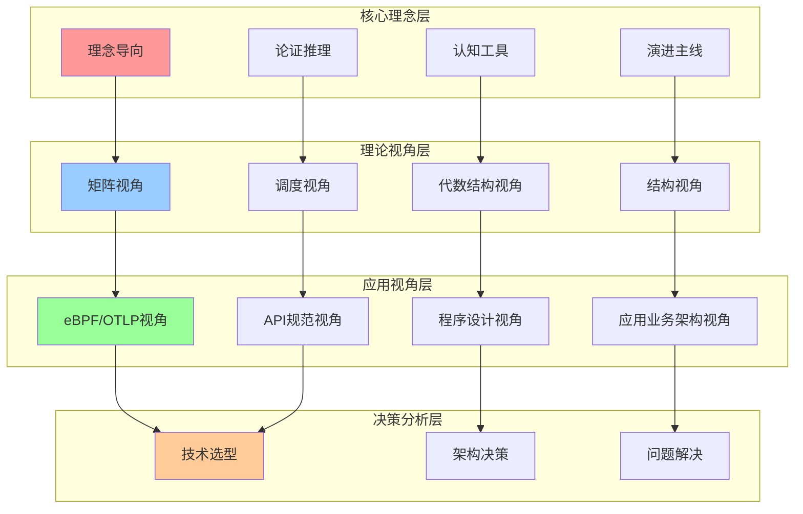
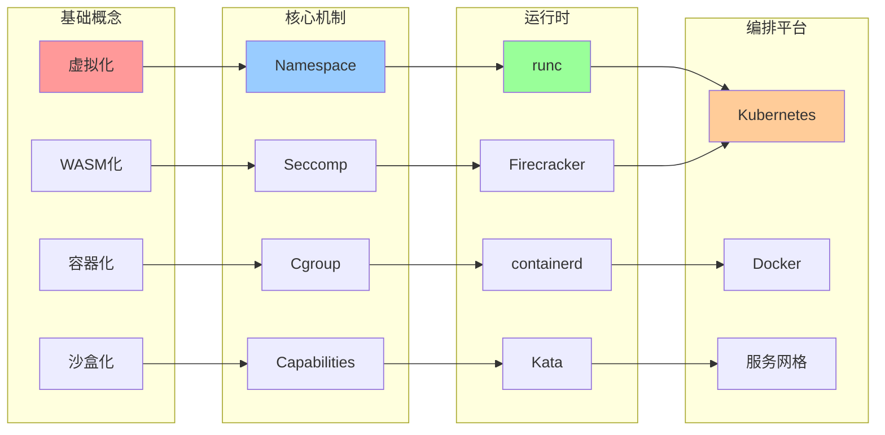
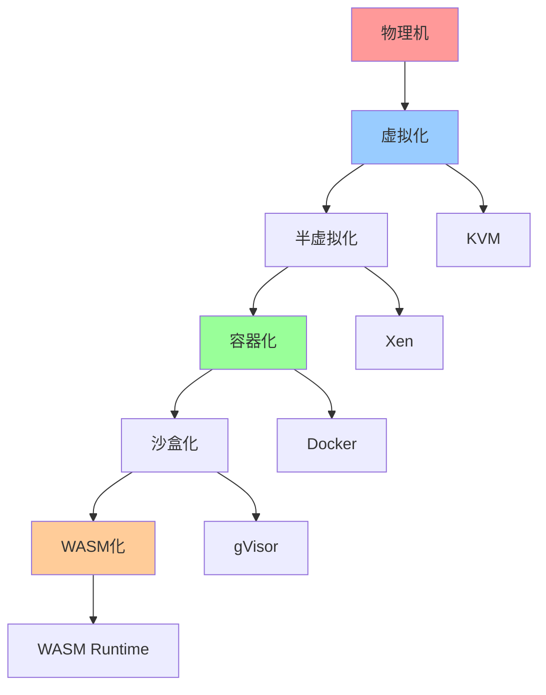
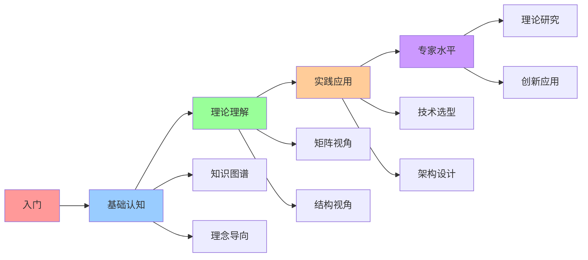

# 知识图谱关系图

## 📑 目录

- [知识图谱关系图](#知识图谱关系图)
  - [📑 目录](#-目录)
  - [1 知识图谱全景](#1-知识图谱全景)
  - [2 概念关系图](#2-概念关系图)
  - [3 技术演进关系图](#3-技术演进关系图)
  - [4 认知路径关系图](#4-认知路径关系图)
  - [5 使用指南](#5-使用指南)
    - [5.1 快速浏览](#51-快速浏览)
    - [5.2 深入学习](#52-深入学习)
    - [5.3 实践应用](#53-实践应用)
  - [6 使用技巧](#6-使用技巧)
    - [6.1 浏览技巧](#61-浏览技巧)
    - [6.2 学习技巧](#62-学习技巧)
  - [7 相关文档](#7-相关文档)
  - [2025 年最新实践](#2025-年最新实践)
    - [知识图谱关系图应用指南（2025）](#知识图谱关系图应用指南2025)
  - [实际应用案例](#实际应用案例)
    - [案例 1：知识图谱关系图应用（2025）](#案例-1知识图谱关系图应用2025)

---

## 1 知识图谱全景



---

## 2 概念关系图



---

## 3 技术演进关系图



---

## 4 认知路径关系图



---

## 5 使用指南

### 5.1 快速浏览

**适用场景**：快速了解技术栈、建立知识关联

**使用步骤**：

1. **选择起点**：选择学习的起点概念
2. **追踪关系**：追踪概念之间的关系
3. **理解演进**：理解技术演进路径
4. **规划路径**：规划学习路径

**推荐度**：⭐⭐⭐⭐⭐

---

### 5.2 深入学习

**适用场景**：深入学习、系统理解

**使用步骤**：

1. **概念关系学习**：学习概念之间的关系
2. **技术演进学习**：学习技术演进路径
3. **认知路径学习**：学习认知路径关系
4. **建立知识网络**：建立完整的知识网络

**推荐度**：⭐⭐⭐⭐⭐

---

### 5.3 实践应用

**适用场景**：实际项目应用、问题解决

**使用步骤**：

1. **问题识别**：识别需要解决的问题
2. **关系查找**：在知识图谱中查找相关关系
3. **路径规划**：规划解决问题的路径
4. **方案应用**：应用相关方案

**推荐度**：⭐⭐⭐⭐⭐

---

## 6 使用技巧

### 6.1 浏览技巧

**技巧1：起点选择**:

- 选择熟悉的概念作为起点
- 从核心概念开始浏览
- 逐步扩展到相关概念

**技巧2：关系追踪**:

- 深入追踪概念之间的关系
- 理解关系的类型和强度
- 建立关系的知识网络

**推荐度**：⭐⭐⭐⭐⭐

---

### 6.2 学习技巧

**技巧1：演进理解**:

- 理解技术演进的内在逻辑
- 分析演进的原因和影响
- 预测未来的演进方向

**技巧2：路径规划**:

- 根据关系图谱规划学习路径
- 选择最优的学习路径
- 优化学习效率

**推荐度**：⭐⭐⭐⭐⭐

---

## 7 相关文档

- **[认知框架思维导图](01-cognitive-framework-mindmap.md)** - 认知框架全景
- **[认知路径地图](04-cognitive-path-map.md)** - 学习路径全景
- **[学习路径指南](06-learning-path-guide.md)** - 学习路径、学习资源
- **[认知模型集成关系图](05-cognitive-models-integration.md)** - 模型集成关系

---

## 2025 年最新实践

### 知识图谱关系图应用指南（2025）

**2025 年趋势**：知识图谱关系图在概念关系分析、技术演进追踪、知识发现中的深度应用

**实践要点**：

- **关系分析**：使用知识图谱分析概念关系
- **演进追踪**：基于知识图谱追踪技术演进
- **知识发现**：使用知识图谱发现新知识

**代码示例**：

```python
# 2025 年知识图谱关系图工具
class KnowledgeGraphRelationsTool:
    def __init__(self):
        self.analyzer = RelationAnalyzer()
        self.tracker = EvolutionTracker()
        self.discoverer = KnowledgeDiscoverer()

    def analyze_relations(self, graph, concepts):
        """关系分析"""
        return self.analyzer.analyze(graph, concepts)

    def track_evolution(self, graph, timeline):
        """演进追踪"""
        return self.tracker.track(graph, timeline)

    def discover_knowledge(self, graph, patterns):
        """知识发现"""
        return self.discoverer.discover(graph, patterns)
```

## 实际应用案例

### 案例 1：知识图谱关系图应用（2025）

**场景**：使用知识图谱分析技术概念关系

**实现方案**：

```python
# 知识图谱关系图应用
tool = KnowledgeGraphRelationsTool()

# 关系分析
graph = KnowledgeGraph(nodes=[...], edges=[...])
concepts = [Concept(name="..."), ...]
relations = tool.analyze_relations(graph, concepts)

# 演进追踪
timeline = Timeline(start="...", end="...")
evolution = tool.track_evolution(graph, timeline)

# 知识发现
patterns = [Pattern(type="..."), ...]
knowledge = tool.discover_knowledge(graph, patterns)
```

**效果**：

- 关系分析：系统化分析概念关系，提高关系理解
- 演进追踪：基于图谱追踪技术演进，提高演进洞察
- 知识发现：使用图谱发现新知识，提高知识价值

---

**最后更新**：2025-11-15
**文档状态**：✅ 完整 | 📊 包含知识图谱关系图、使用指南、使用技巧 | 🎯 生产就绪
**维护者**：项目团队
