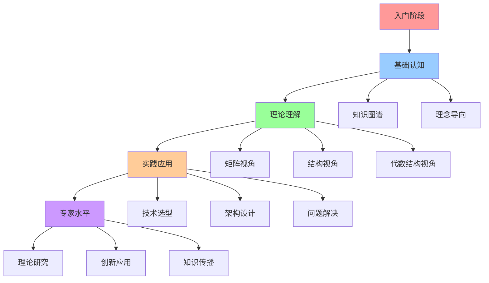
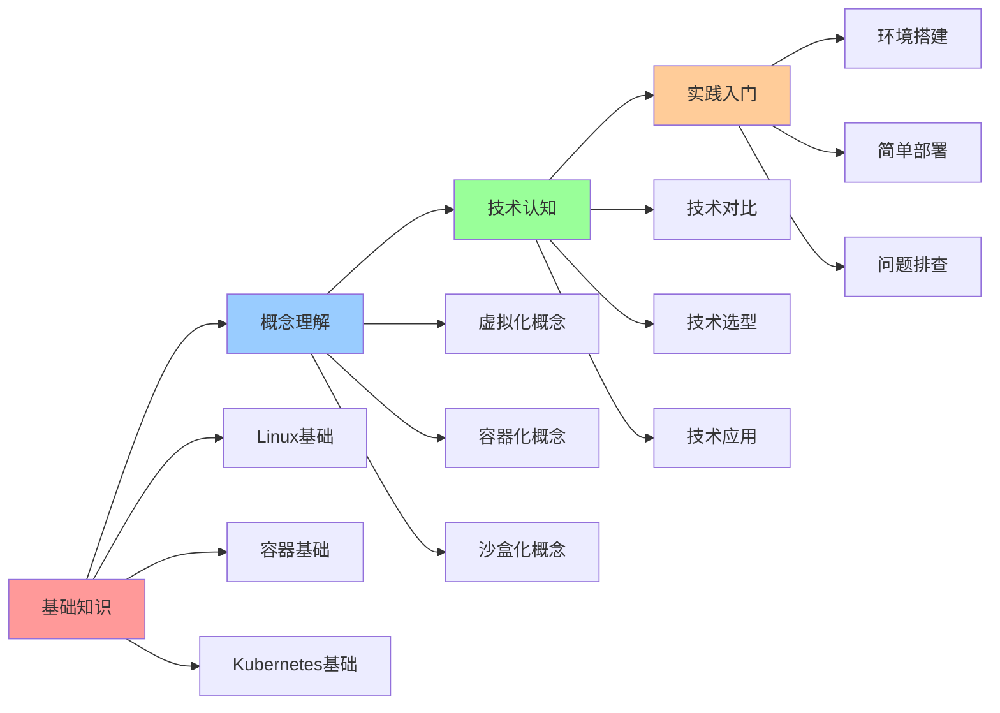
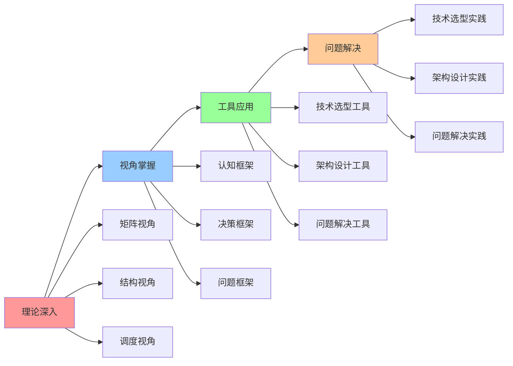
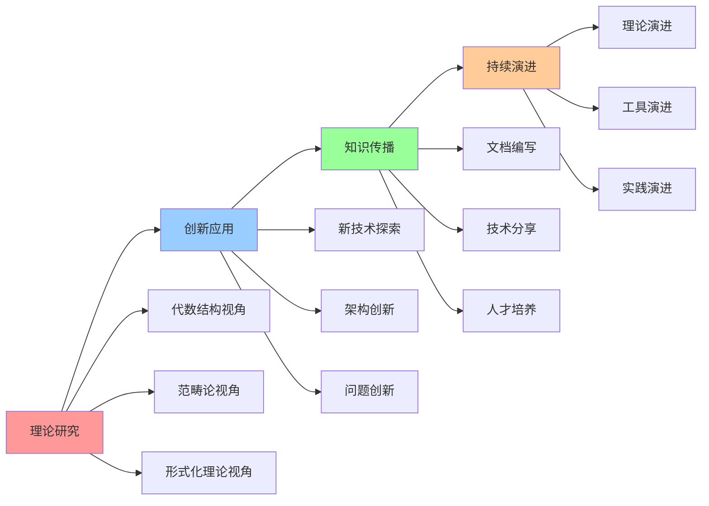

# 认知路径地图

## 📑 目录

- [认知路径地图](#认知路径地图)
  - [📑 目录](#-目录)
  - [1 学习路径全景](#1-学习路径全景)
  - [2 入门路径](#2-入门路径)
  - [3 进阶路径](#3-进阶路径)
  - [4 专家路径](#4-专家路径)
  - [5 认知路径时间表](#5-认知路径时间表)
  - [6 认知路径检查点](#6-认知路径检查点)
  - [7 使用指南](#7-使用指南)
    - [7.1 路径选择](#71-路径选择)
    - [7.2 学习执行](#72-学习执行)
  - [8 使用技巧](#8-使用技巧)
    - [8.1 路径规划技巧](#81-路径规划技巧)
    - [8.2 学习执行技巧](#82-学习执行技巧)
  - [9 相关文档](#9-相关文档)
  - [2025 年最新实践](#2025-年最新实践)
    - [认知路径地图应用指南（2025）](#认知路径地图应用指南2025)
  - [实际应用案例](#实际应用案例)
    - [案例 1：认知路径地图应用（2025）](#案例-1认知路径地图应用2025)

---

## 1 学习路径全景



---

## 2 入门路径



---

## 3 进阶路径



---

## 4 专家路径



---

## 5 认知路径时间表

| 阶段 | 时间 | 核心内容 | 学习方式 | 预期成果 | 推荐度 |
|------|------|---------|---------|---------|--------|
| **入门** | 1-2个月 | 基础知识、概念理解 | 理论学习+实践 | 基础认知 | ⭐⭐⭐⭐⭐ |
| **进阶** | 3-6个月 | 理论深入、视角掌握 | 深入学习+项目实践 | 理论理解 | ⭐⭐⭐⭐⭐ |
| **高级** | 6-12个月 | 工具应用、问题解决 | 项目实践+问题解决 | 实践应用 | ⭐⭐⭐⭐⭐ |
| **专家** | 12+个月 | 理论研究、创新应用 | 研究+创新+传播 | 专家水平 | ⭐⭐⭐⭐ |

**推荐度说明**：

- **⭐⭐⭐⭐⭐**：强烈推荐
- **⭐⭐⭐⭐**：推荐
- **⭐⭐⭐**：可选

---

## 6 认知路径检查点

| 检查点 | 阶段 | 检查内容 | 通过标准 | 推荐度 |
|--------|------|---------|---------|--------|
| **基础认知** | 入门 | 概念理解、技术认知 | 能够理解基本概念 | ⭐⭐⭐⭐⭐ |
| **理论理解** | 进阶 | 视角掌握、工具应用 | 能够应用认知模型 | ⭐⭐⭐⭐⭐ |
| **实践应用** | 高级 | 问题解决、项目实践 | 能够解决实际问题 | ⭐⭐⭐⭐⭐ |
| **专家水平** | 专家 | 理论研究、创新应用 | 能够创新应用 | ⭐⭐⭐⭐ |

**推荐度说明**：

- **⭐⭐⭐⭐⭐**：强烈推荐
- **⭐⭐⭐⭐**：推荐
- **⭐⭐⭐**：可选

---

## 7 使用指南

### 7.1 路径选择

**适用场景**：学习规划、技能提升

**使用步骤**：

1. **评估当前水平**：评估当前的知识水平和技能水平
2. **选择学习阶段**：选择当前的学习阶段（入门、进阶、高级、专家）
3. **选择学习路径**：选择合适的学习路径
4. **制定学习计划**：制定详细的学习计划

**推荐度**：⭐⭐⭐⭐⭐

---

### 7.2 学习执行

**适用场景**：学习执行、进度跟踪

**使用步骤**：

1. **按路径学习**：按照选择的学习路径逐步学习
2. **完成检查点**：完成各个阶段的检查点
3. **实践应用**：在实际项目中实践应用
4. **评估学习效果**：评估学习效果并调整路径

**推荐度**：⭐⭐⭐⭐⭐

---

## 8 使用技巧

### 8.1 路径规划技巧

**技巧1：阶段规划**:

- 明确每个阶段的学习目标
- 制定阶段性的学习计划
- 确保阶段之间的衔接

**技巧2：检查点利用**:

- 充分利用检查点评估学习效果
- 根据检查点调整学习计划
- 确保每个阶段的质量

**推荐度**：⭐⭐⭐⭐⭐

---

### 8.2 学习执行技巧

**技巧1：循序渐进**:

- 按照路径循序渐进学习
- 不要跳跃式学习
- 确保每个阶段的质量

**技巧2：实践结合**:

- 理论学习与实践相结合
- 在实际项目中应用知识
- 积累实践经验

**推荐度**：⭐⭐⭐⭐⭐

---

## 9 相关文档

- **[学习路径指南](06-learning-path-guide.md)** - 学习路径、学习资源
- **[认知学习策略指南](18-cognitive-learning-strategy.md)** - 学习策略、学习方法
- **[知识图谱关系图](03-knowledge-graph-relations.md)** - 概念关系、技术演进

---

## 2025 年最新实践

### 认知路径地图应用指南（2025）

**2025 年趋势**：认知路径地图在学习路径规划、技能发展、知识体系构建中的深度应用

**实践要点**：

- **路径规划**：使用路径地图规划学习路径
- **技能发展**：基于路径地图发展技能
- **体系构建**：使用路径地图构建知识体系

**代码示例**：

```python
# 2025 年认知路径地图工具
class CognitivePathMapTool:
    def __init__(self):
        self.planner = PathPlanner()
        self.developer = SkillDeveloper()
        self.builder = SystemBuilder()

    def plan_path(self, current_level, target_level):
        """路径规划"""
        return self.planner.plan(current_level, target_level)

    def develop_skill(self, path, skill):
        """技能发展"""
        return self.developer.develop(path, skill)

    def build_system(self, path, knowledge):
        """体系构建"""
        return self.builder.build(path, knowledge)
```

## 实际应用案例

### 案例 1：认知路径地图应用（2025）

**场景**：使用路径地图规划技术学习路径

**实现方案**：

```python
# 认知路径地图应用
tool = CognitivePathMapTool()

# 路径规划
current_level = Level(name="beginner")
target_level = Level(name="expert")
path = tool.plan_path(current_level, target_level)

# 技能发展
skill = Skill(name="architecture-design")
development = tool.develop_skill(path, skill)

# 体系构建
knowledge = Knowledge(content="...", type="...")
system = tool.build_system(path, knowledge)
```

**效果**：

- 路径规划：系统化规划学习路径，提高学习效率
- 技能发展：基于路径发展技能，提高技能水平
- 体系构建：使用路径构建知识体系，提高知识完整性

---

**最后更新**：2025-11-15
**文档状态**：✅ 完整 | 📊 包含认知路径地图、使用指南、使用技巧 | 🎯 生产就绪
**维护者**：项目团队
