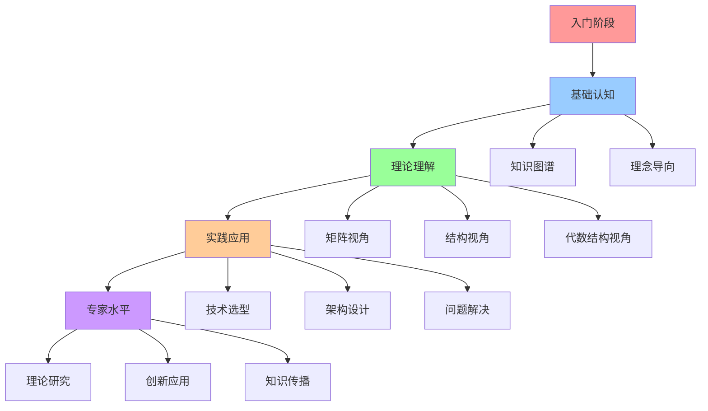
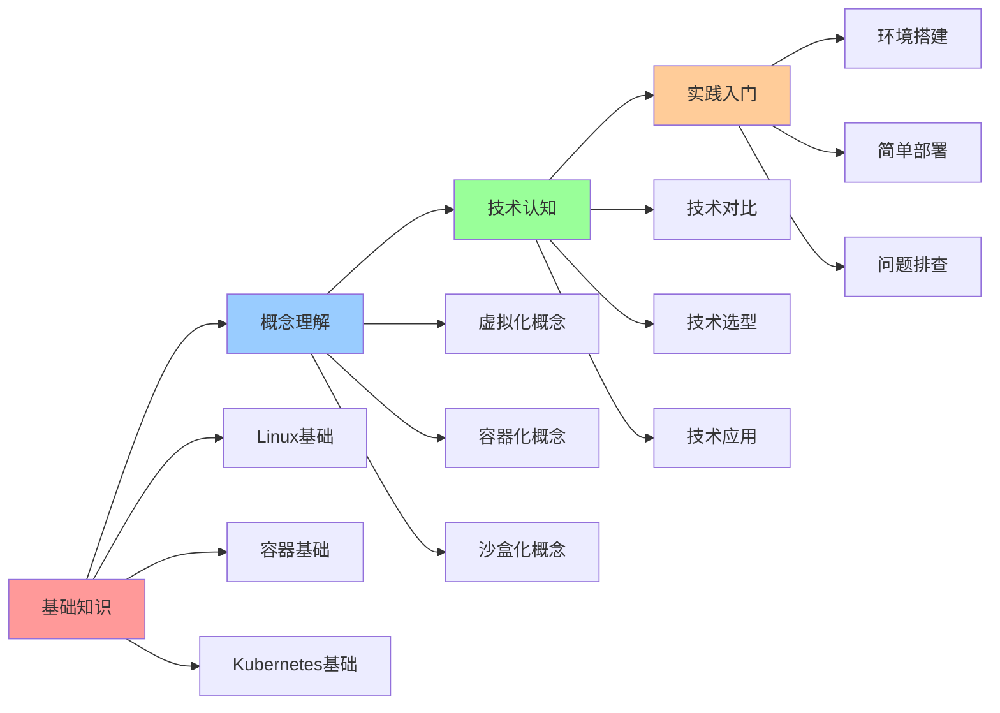
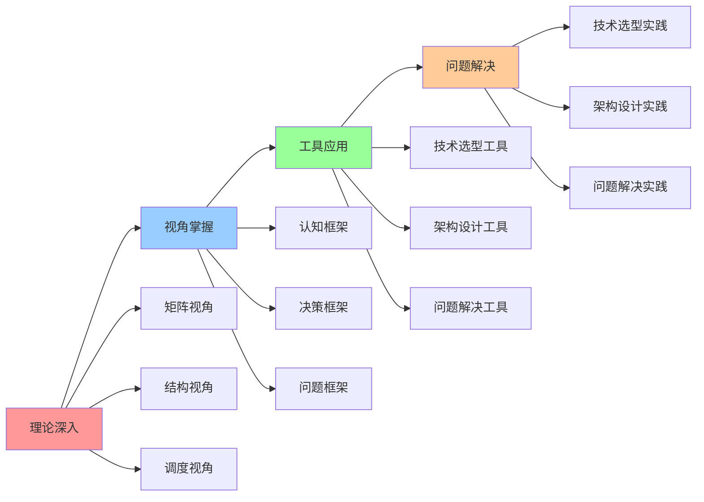
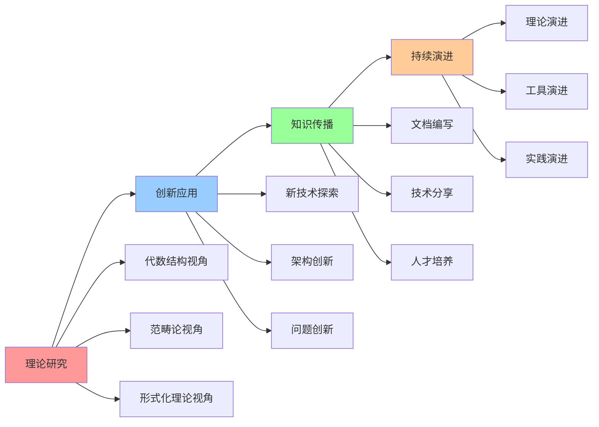

# 认知路径地图

## 📑 目录

- [认知路径地图](#认知路径地图)
  - [📑 目录](#-目录)
  - [1 学习路径全景](#1-学习路径全景)
  - [2 入门路径](#2-入门路径)
  - [3 进阶路径](#3-进阶路径)
  - [4 专家路径](#4-专家路径)

---

## 1 学习路径全景

---

## 2 入门路径

---

## 3 进阶路径

---

## 4 专家路径

---

## 5 认知路径时间表

| 阶段 | 时间 | 核心内容 | 学习方式 | 预期成果 | 推荐度 |
|------|------|---------|---------|---------|--------|
| **入门** | 1-2个月 | 基础知识、概念理解 | 理论学习+实践 | 基础认知 | ⭐⭐⭐⭐⭐ |
| **进阶** | 3-6个月 | 理论深入、视角掌握 | 深入学习+项目实践 | 理论理解 | ⭐⭐⭐⭐⭐ |
| **高级** | 6-12个月 | 工具应用、问题解决 | 项目实践+问题解决 | 实践应用 | ⭐⭐⭐⭐⭐ |
| **专家** | 12+个月 | 理论研究、创新应用 | 研究+创新+传播 | 专家水平 | ⭐⭐⭐⭐ |

**推荐度说明**：
- **⭐⭐⭐⭐⭐**：强烈推荐
- **⭐⭐⭐⭐**：推荐
- **⭐⭐⭐**：可选

---

## 6 认知路径检查点

| 检查点 | 阶段 | 检查内容 | 通过标准 | 推荐度 |
|--------|------|---------|---------|--------|
| **基础认知** | 入门 | 概念理解、技术认知 | 能够理解基本概念 | ⭐⭐⭐⭐⭐ |
| **理论理解** | 进阶 | 视角掌握、工具应用 | 能够应用认知模型 | ⭐⭐⭐⭐⭐ |
| **实践应用** | 高级 | 问题解决、项目实践 | 能够解决实际问题 | ⭐⭐⭐⭐⭐ |
| **专家水平** | 专家 | 理论研究、创新应用 | 能够创新应用 | ⭐⭐⭐⭐ |

**推荐度说明**：
- **⭐⭐⭐⭐⭐**：强烈推荐
- **⭐⭐⭐⭐**：推荐
- **⭐⭐⭐**：可选

---

**最后更新**：2025-11-07
**文档状态**：✅ 完整 | 📊 包含认知路径地图 | 🎯 生产就绪
**维护者**：项目团队
