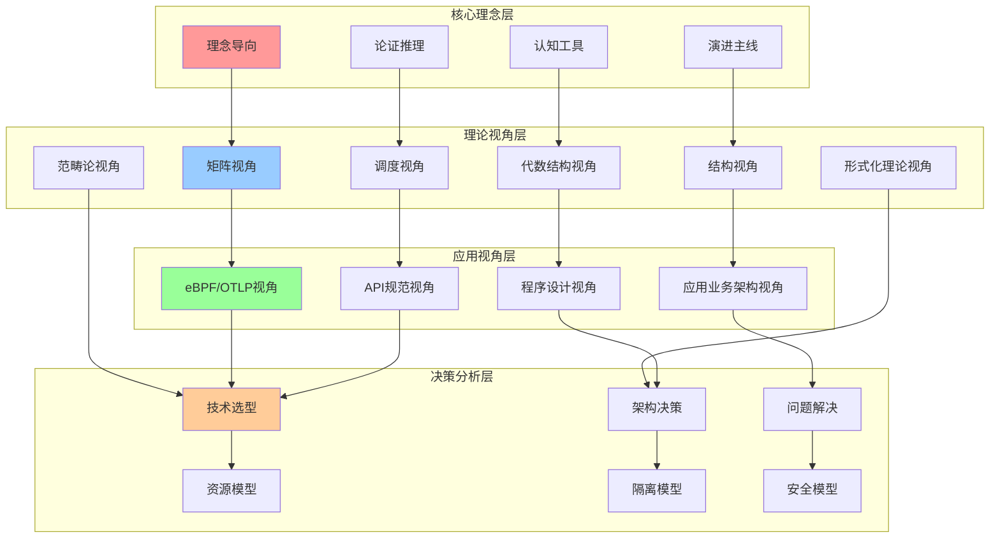
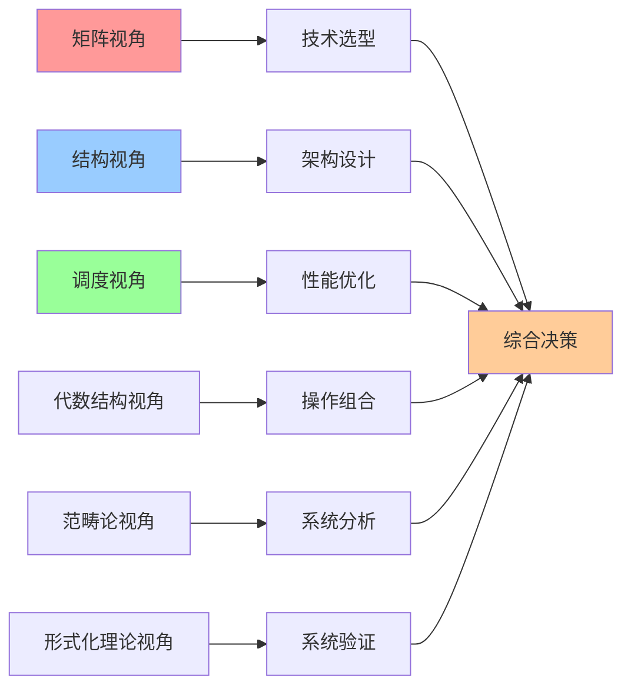
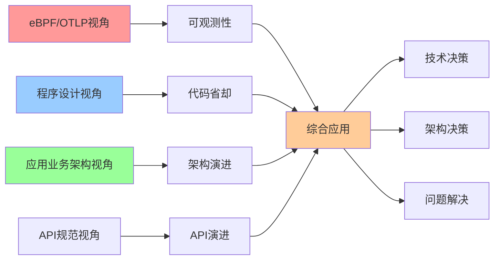
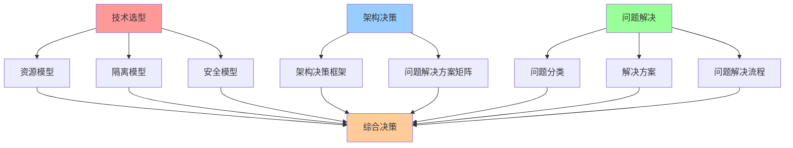
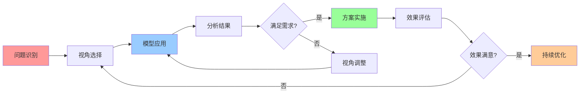

# 认知模型集成关系图

## 📑 目录

- [认知模型集成关系图](#认知模型集成关系图)
  - [📑 目录](#-目录)
  - [1 认知模型全景集成](#1-认知模型全景集成)
  - [2 理论视角集成](#2-理论视角集成)
  - [3 应用视角集成](#3-应用视角集成)
  - [4 决策分析集成](#4-决策分析集成)

---

## 1 认知模型全景集成

---

## 2 理论视角集成

---

## 3 应用视角集成

---

## 4 决策分析集成

---

## 5 认知模型组合使用矩阵

| 组合方式 | 视角1 | 视角2 | 视角3 | 适用场景 | 效果 | 复杂度 |
|---------|------|------|------|---------|------|--------|
| **技术选型组合** | 矩阵视角 | 结构视角 | - | 技术选型 | 高 | 中 |
| **架构设计组合** | 结构视角 | 架构决策框架 | - | 架构设计 | 高 | 高 |
| **性能优化组合** | 调度视角 | 矩阵视角 | 结构视角 | 性能优化 | 高 | 中 |
| **系统验证组合** | 形式化理论视角 | 结构视角 | 范畴论视角 | 系统验证 | 极高 | 极高 |
| **全面分析组合** | 矩阵视角 | 结构视角 | 调度视角 | 全面系统分析 | 极高 | 高 |
| **应用开发组合** | 程序设计视角 | eBPF/OTLP视角 | API规范视角 | 应用开发 | 高 | 中 |
| **问题解决组合** | 问题解决方案矩阵 | 矩阵视角 | 结构视角 | 问题解决 | 高 | 中 |

**效果说明**：

- **高**：单一视角效果
- **极高**：组合视角效果

---

## 6 认知模型应用流程

---

## 7 认知模型集成详细说明

### 7.1 核心理念层集成

**集成关系**：

- **理念导向 → 矩阵视角**：理念导向提供"为什么"的思考框架，矩阵视角提供技术对比的工具
- **认知工具 → 代数结构视角**：认知工具提供类比和可视化方法，代数结构视角提供形式化的操作组合
- **演进主线 → 结构视角**：演进主线提供历史脉络，结构视角提供结构化的分析框架
- **论证推理 → 调度视角**：论证推理提供决策逻辑，调度视角提供性能优化的分析工具

**集成价值**：

- **理念指导实践**：核心理念层为理论视角层提供理念指导
- **工具支撑分析**：认知工具为理论分析提供可视化支持
- **演进指导设计**：演进主线为架构设计提供历史参考
- **推理支撑决策**：论证推理为技术决策提供逻辑支撑

**推荐度**：⭐⭐⭐⭐⭐

### 7.2 理论视角层集成

**集成关系**：

- **矩阵视角 ↔ 结构视角**：矩阵视角提供技术对比，结构视角提供结构分析，两者结合进行全面的技术评估
- **调度视角 ↔ 结构视角**：调度视角提供性能分析，结构视角提供架构分析，两者结合进行性能优化
- **代数结构视角 ↔ 范畴论视角**：代数结构视角提供操作组合，范畴论视角提供系统分析，两者结合进行系统建模
- **形式化理论视角 ↔ 结构视角**：形式化理论视角提供系统验证，结构视角提供结构分析，两者结合进行系统验证

**集成价值**：

- **多维度分析**：不同视角提供不同维度的分析，集成后形成全面的分析
- **互补优势**：不同视角的优势互补，形成更强的分析能力
- **系统理解**：多视角集成帮助形成系统性的技术理解

**推荐度**：⭐⭐⭐⭐⭐

### 7.3 应用视角层集成

**集成关系**：

- **eBPF/OTLP视角 ↔ 程序设计视角**：eBPF/OTLP视角提供可观测性，程序设计视角提供代码省却，两者结合实现可观测的代码简化
- **应用业务架构视角 ↔ API规范视角**：应用业务架构视角提供架构演进，API规范视角提供API演进，两者结合实现架构和API的协同演进
- **程序设计视角 ↔ API规范视角**：程序设计视角提供编程范式转变，API规范视角提供API演进，两者结合实现编程和API的协同演进

**集成价值**：

- **技术协同**：不同应用视角的技术协同，实现整体技术栈的优化
- **演进同步**：不同视角的演进同步，避免技术栈的不一致
- **实践指导**：应用视角集成提供实践指导，帮助实际应用开发

**推荐度**：⭐⭐⭐⭐⭐

### 7.4 决策分析层集成

**集成关系**：

- **技术选型 ↔ 资源模型**：技术选型需要资源模型提供资源需求分析
- **架构决策 ↔ 隔离模型**：架构决策需要隔离模型提供隔离层次分析
- **问题解决 ↔ 安全模型**：问题解决需要安全模型提供安全需求分析
- **资源模型 ↔ 隔离模型 ↔ 安全模型**：三个模型相互关联，共同支撑技术决策

**集成价值**：

- **决策支撑**：决策分析层为技术决策提供全面的支撑
- **模型协同**：不同决策模型协同工作，形成完整的决策框架
- **实践应用**：决策分析层集成提供实践应用指导

**推荐度**：⭐⭐⭐⭐⭐

---

## 8 认知模型集成应用案例

### 8.1 案例1：容器运行时选型

**场景**：选择适合的容器运行时

**集成模型**：

- **矩阵视角**：对比 containerd、CRI-O、Docker 等功能
- **结构视角**：分析容器运行时的架构结构
- **资源模型**：评估资源需求和性能开销
- **隔离模型**：评估隔离能力和安全性

**集成流程**：

1. 使用矩阵视角进行功能对比
2. 使用结构视角分析架构差异
3. 使用资源模型评估资源需求
4. 使用隔离模型评估安全性
5. 综合评估做出决策

**效果**：选择最适合的容器运行时，平衡功能、性能、安全性

**推荐度**：⭐⭐⭐⭐⭐

### 8.2 案例2：微服务架构设计

**场景**：设计微服务架构

**集成模型**：

- **结构视角**：分析微服务架构的计算结构、控制结构、信息结构
- **调度视角**：分析服务调度的性能特性
- **分布式模型**：分析分布式系统的一致性和可用性
- **架构决策框架**：使用决策框架进行架构决策

**集成流程**：

1. 使用结构视角设计架构结构
2. 使用调度视角优化服务调度
3. 使用分布式模型保证一致性
4. 使用架构决策框架评估方案
5. 综合评估确定架构方案

**效果**：设计优秀的微服务架构，平衡性能、一致性、可用性

**推荐度**：⭐⭐⭐⭐⭐

### 8.3 案例3：性能问题解决

**场景**：解决应用性能问题

**集成模型**：

- **调度视角**：分析性能瓶颈和调度问题
- **资源模型**：分析资源使用和优化空间
- **问题解决方案矩阵**：分类问题和选择解决方案
- **性能基准**：评估性能优化效果

**集成流程**：

1. 使用调度视角识别性能瓶颈
2. 使用资源模型分析资源使用
3. 使用问题解决方案矩阵选择方案
4. 实施优化方案
5. 使用性能基准评估效果

**效果**：有效解决性能问题，提升应用性能

**推荐度**：⭐⭐⭐⭐⭐

---

## 9 认知模型集成最佳实践

### 9.1 集成原则

#### 原则1：问题导向

- 根据问题类型选择合适的模型组合
- 避免过度集成，保持集成简洁
- 关注问题本质，避免表面集成

#### 原则2：层次清晰

- 明确不同层次的模型职责
- 保持层次间的清晰关系
- 避免层次混乱和职责不清

#### 原则3：互补优势

- 选择互补的模型进行集成
- 发挥每个模型的优势
- 避免重复和冗余

**推荐度**：⭐⭐⭐⭐⭐

### 9.2 集成方法

#### 方法1：顺序集成

- 按照问题解决的顺序集成模型
- 先分析后决策，先理论后实践
- 保持逻辑清晰和流程顺畅

#### 方法2：并行集成

- 同时使用多个模型进行分析
- 从不同角度分析同一问题
- 综合多角度分析结果

#### 方法3：迭代集成

- 根据分析结果调整模型组合
- 迭代优化集成方案
- 持续改进集成效果

**推荐度**：⭐⭐⭐⭐⭐

### 9.3 集成检查清单

| 检查项 | 检查内容 | 重要性 | 推荐度 |
|--------|---------|--------|--------|
| **问题识别** | 问题是否明确、问题类型是否确定 | 极高 | ⭐⭐⭐⭐⭐ |
| **模型选择** | 选择的模型是否合适、模型组合是否合理 | 高 | ⭐⭐⭐⭐⭐ |
| **集成逻辑** | 集成逻辑是否清晰、集成流程是否顺畅 | 高 | ⭐⭐⭐⭐⭐ |
| **结果验证** | 集成结果是否有效、是否满足需求 | 高 | ⭐⭐⭐⭐⭐ |
| **持续优化** | 是否持续优化集成方案、是否积累经验 | 中 | ⭐⭐⭐⭐ |

**推荐度说明**：

- **⭐⭐⭐⭐⭐**：强烈推荐
- **⭐⭐⭐⭐**：推荐
- **⭐⭐⭐**：可选

---

## 10 认知模型集成常见问题

### 10.1 问题1：如何选择合适的模型组合？

**问题描述**：面对复杂问题时，不知道如何选择合适的模型组合

**解决方案**：

1. **问题分类**：先对问题进行分类，确定问题类型
2. **模型映射**：根据问题类型映射到合适的模型
3. **组合策略**：根据问题复杂度选择合适的组合策略
4. **经验积累**：通过实践积累经验，形成模型选择模式

**推荐度**：⭐⭐⭐⭐⭐

### 10.2 问题2：如何避免模型集成过度复杂？

**问题描述**：集成过多模型导致分析过程复杂，难以管理

**解决方案**：

1. **问题导向**：根据问题本质选择必要的模型
2. **简化集成**：优先使用简单有效的模型组合
3. **分层集成**：按照层次进行集成，避免跨层混乱
4. **工具支持**：使用工具支持模型集成，降低复杂度

**推荐度**：⭐⭐⭐⭐⭐

### 10.3 问题3：如何处理模型之间的冲突？

**问题描述**：不同模型的分析结果存在冲突，难以决策

**解决方案**：

1. **冲突分析**：深入分析冲突的原因和本质
2. **优先级排序**：根据问题优先级排序模型结果
3. **综合权衡**：综合考虑多个模型的结果，做出权衡
4. **专家评估**：必要时引入专家评估，帮助决策

**推荐度**：⭐⭐⭐⭐⭐

---

## 11 认知模型集成工具推荐

| 工具类型 | 推荐工具 | 使用场景 | 效果 | 复杂度 | 推荐度 |
|---------|---------|---------|------|--------|--------|
| **思维导图工具** | XMind、MindMaster | 模型关系可视化 | 高 | 低 | ⭐⭐⭐⭐⭐ |
| **知识图谱工具** | Neo4j、Gephi | 模型关系分析 | 高 | 中 | ⭐⭐⭐⭐ |
| **决策支持工具** | AHP、TOPSIS | 多模型决策 | 高 | 中 | ⭐⭐⭐⭐ |
| **可视化工具** | D3.js、ECharts | 模型集成可视化 | 中 | 中 | ⭐⭐⭐⭐ |
| **文档工具** | Markdown、Mermaid | 模型集成文档化 | 中 | 低 | ⭐⭐⭐⭐⭐ |

**推荐度说明**：

- **⭐⭐⭐⭐⭐**：强烈推荐
- **⭐⭐⭐⭐**：推荐
- **⭐⭐⭐**：可选

---

**最后更新**：2025-11-15
**文档状态**：✅ 完整 | 📊 包含认知模型集成关系图、详细说明、应用案例、最佳实践 | 🎯 生产就绪
**维护者**：项目团队
