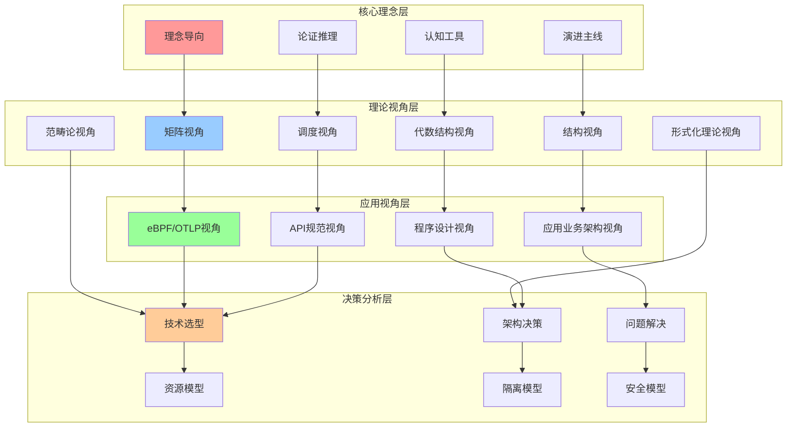
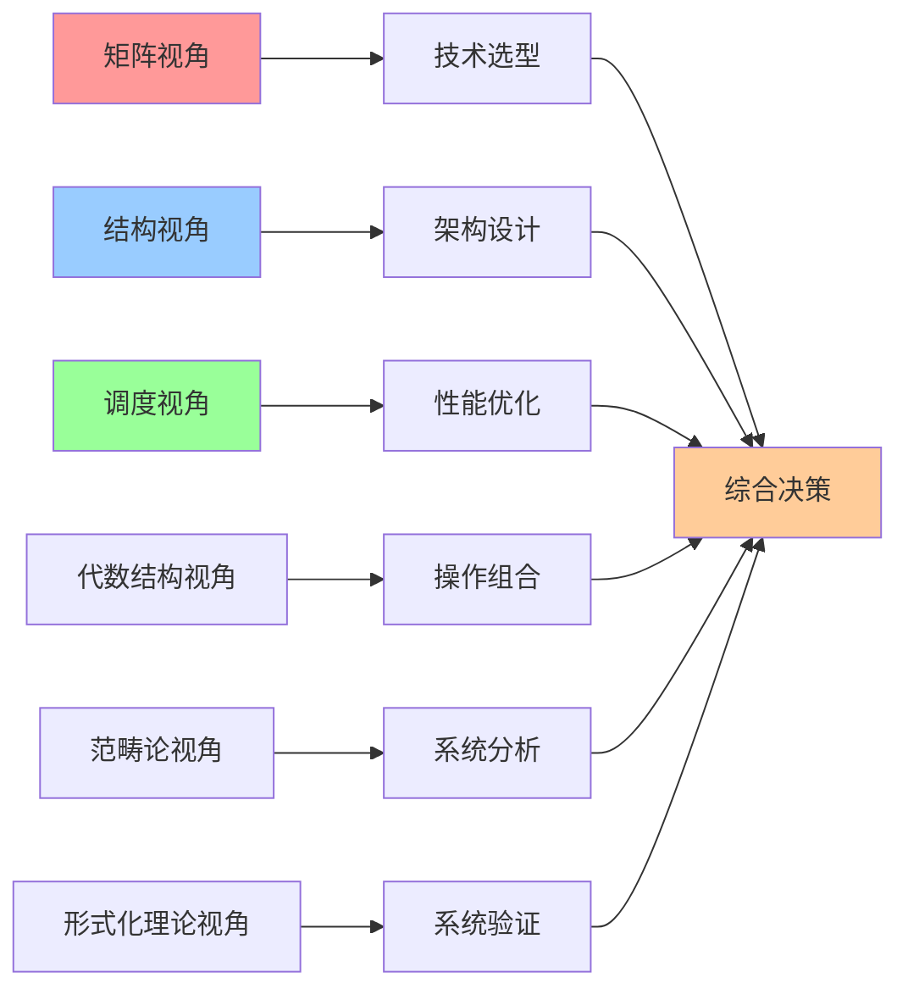
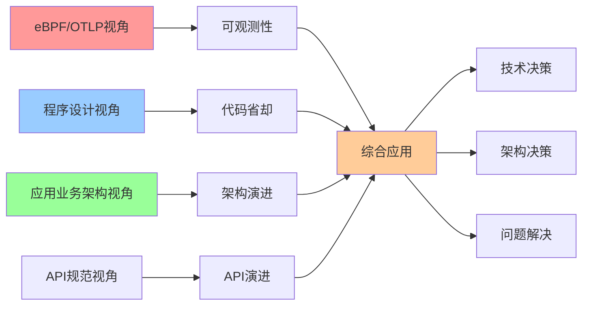
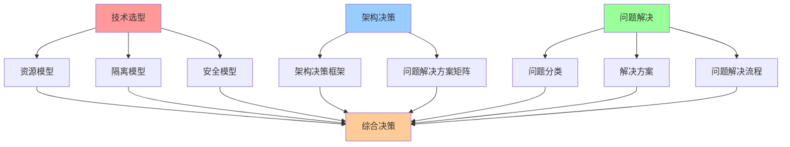
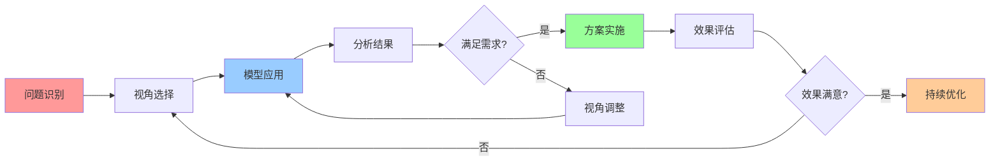

# 认知模型集成关系图

## 📑 目录

- [认知模型集成关系图](#认知模型集成关系图)
  - [📑 目录](#-目录)
  - [1 认知模型全景集成](#1-认知模型全景集成)
  - [2 理论视角集成](#2-理论视角集成)
  - [3 应用视角集成](#3-应用视角集成)
  - [4 决策分析集成](#4-决策分析集成)

---

## 1 认知模型全景集成

---

## 2 理论视角集成

---

## 3 应用视角集成

---

## 4 决策分析集成

---

## 5 认知模型组合使用矩阵

| 组合方式 | 视角1 | 视角2 | 视角3 | 适用场景 | 效果 | 复杂度 |
|---------|------|------|------|---------|------|--------|
| **技术选型组合** | 矩阵视角 | 结构视角 | - | 技术选型 | 高 | 中 |
| **架构设计组合** | 结构视角 | 架构决策框架 | - | 架构设计 | 高 | 高 |
| **性能优化组合** | 调度视角 | 矩阵视角 | 结构视角 | 性能优化 | 高 | 中 |
| **系统验证组合** | 形式化理论视角 | 结构视角 | 范畴论视角 | 系统验证 | 极高 | 极高 |
| **全面分析组合** | 矩阵视角 | 结构视角 | 调度视角 | 全面系统分析 | 极高 | 高 |
| **应用开发组合** | 程序设计视角 | eBPF/OTLP视角 | API规范视角 | 应用开发 | 高 | 中 |
| **问题解决组合** | 问题解决方案矩阵 | 矩阵视角 | 结构视角 | 问题解决 | 高 | 中 |

**效果说明**：
- **高**：单一视角效果
- **极高**：组合视角效果

---

## 6 认知模型应用流程

---

**最后更新**：2025-11-07
**文档状态**：✅ 完整 | 📊 包含认知模型集成关系图 | 🎯 生产就绪
**维护者**：项目团队
