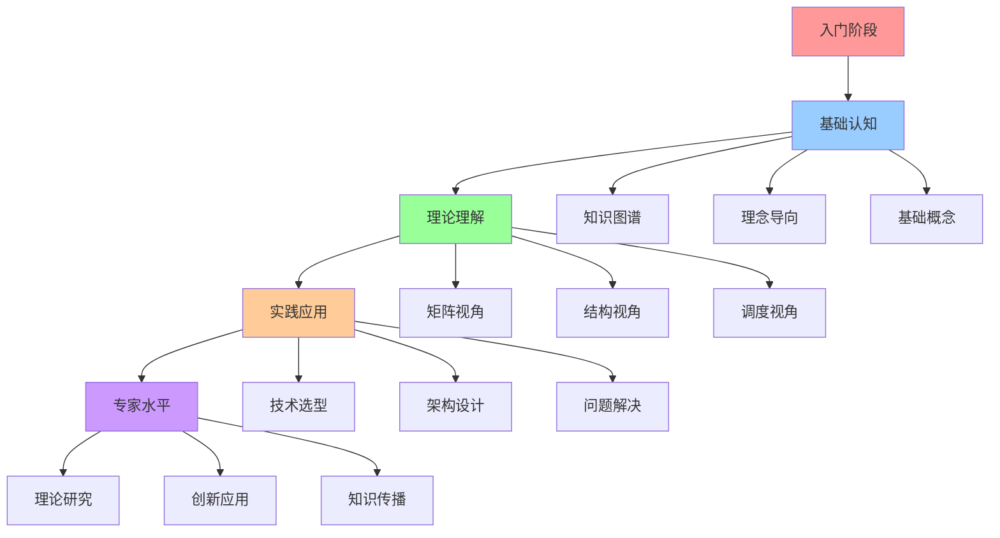
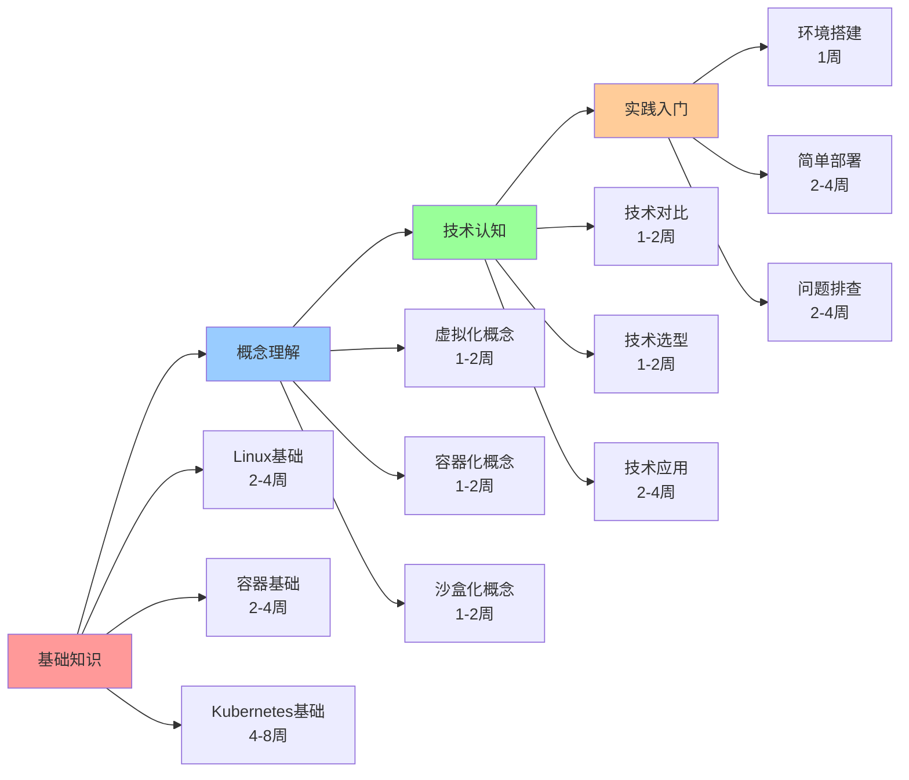
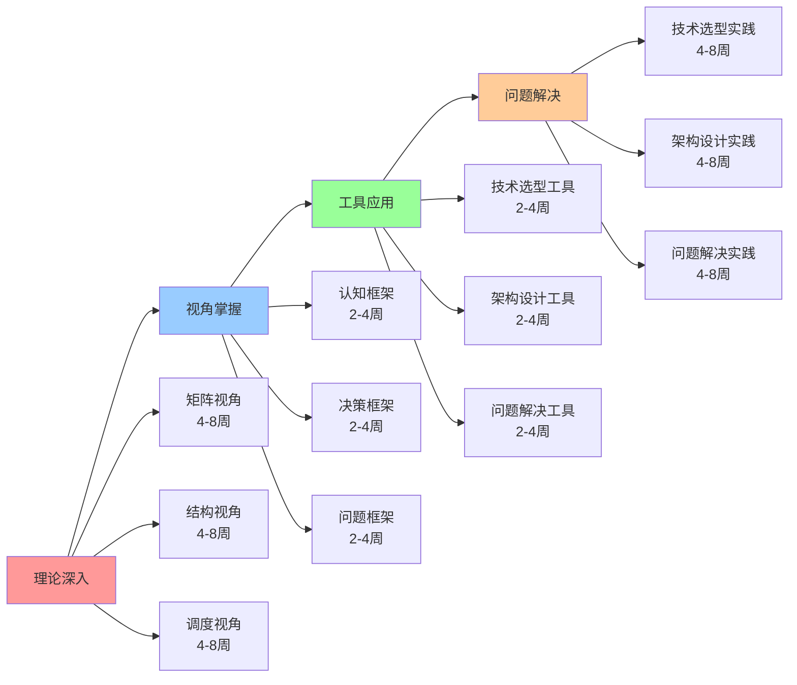
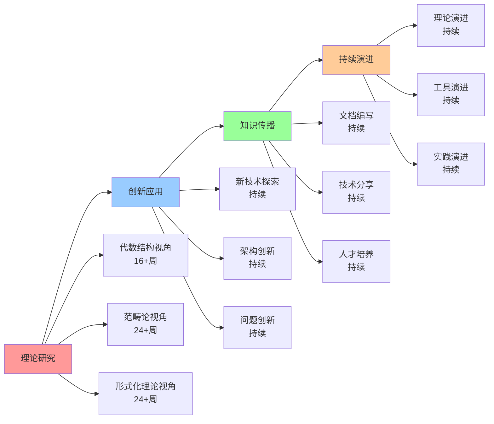

# 学习路径指南

## 📑 目录

- [学习路径指南](#学习路径指南)
  - [📑 目录](#-目录)
  - [1 学习路径全景](#1-学习路径全景)
  - [2 入门学习路径](#2-入门学习路径)
  - [3 进阶学习路径](#3-进阶学习路径)
  - [4 专家学习路径](#4-专家学习路径)
  - [5 学习路径时间表](#5-学习路径时间表)
  - [6 学习资源推荐](#6-学习资源推荐)
  - [7 使用指南](#7-使用指南)
    - [7.1 路径选择](#71-路径选择)
    - [7.2 学习执行](#72-学习执行)
  - [8 使用技巧](#8-使用技巧)
    - [8.1 路径规划技巧](#81-路径规划技巧)
    - [8.2 学习执行技巧](#82-学习执行技巧)
  - [9 相关文档](#9-相关文档)
  - [10 2025 年最新实践](#10-2025-年最新实践)
    - [10.1 个性化学习路径推荐（2025）](#101-个性化学习路径推荐2025)
    - [10.2 自适应学习系统（2025）](#102-自适应学习系统2025)
  - [11 实际应用案例](#11-实际应用案例)
    - [案例 1：云原生技术学习路径（2025）](#案例-1云原生技术学习路径2025)
    - [案例 2：边缘计算技术学习路径（2025）](#案例-2边缘计算技术学习路径2025)
    - [案例 3：Serverless 技术学习路径（2025）](#案例-3serverless-技术学习路径2025)

---

## 1 学习路径全景



---

## 2 入门学习路径



---

## 3 进阶学习路径



---

## 4 专家学习路径



---

## 5 学习路径时间表

| 阶段 | 时间 | 核心内容 | 学习方式 | 预期成果 | 推荐度 |
|------|------|---------|---------|---------|--------|
| **入门** | 1-2个月 | 基础知识、概念理解 | 理论学习+实践 | 基础认知 | ⭐⭐⭐⭐⭐ |
| **进阶** | 3-6个月 | 理论深入、视角掌握 | 深入学习+项目实践 | 理论理解 | ⭐⭐⭐⭐⭐ |
| **高级** | 6-12个月 | 工具应用、问题解决 | 项目实践+问题解决 | 实践应用 | ⭐⭐⭐⭐⭐ |
| **专家** | 12+个月 | 理论研究、创新应用 | 研究+创新+传播 | 专家水平 | ⭐⭐⭐⭐ |

**推荐度说明**：

- **⭐⭐⭐⭐⭐**：强烈推荐
- **⭐⭐⭐⭐**：推荐
- **⭐⭐⭐**：可选

---

## 6 学习资源推荐

| 资源类型 | 资源名称 | 适用阶段 | 推荐度 |
|---------|---------|---------|--------|
| **文档** | 认知模型文档 | 入门+进阶 | ⭐⭐⭐⭐⭐ |
| **可视化** | 思维导图、知识矩阵 | 入门+进阶 | ⭐⭐⭐⭐⭐ |
| **实践** | 项目实践、案例分析 | 进阶+高级 | ⭐⭐⭐⭐⭐ |
| **研究** | 理论研究、论文阅读 | 高级+专家 | ⭐⭐⭐⭐ |
| **社区** | 技术社区、技术分享 | 所有阶段 | ⭐⭐⭐⭐ |

**推荐度说明**：

- **⭐⭐⭐⭐⭐**：强烈推荐
- **⭐⭐⭐⭐**：推荐
- **⭐⭐⭐**：可选

---

## 7 使用指南

### 7.1 路径选择

**适用场景**：学习规划、技能提升

**使用步骤**：

1. **评估当前水平**：评估当前的知识水平和技能水平
2. **选择学习阶段**：选择当前的学习阶段（入门、进阶、高级、专家）
3. **选择学习路径**：选择合适的学习路径
4. **制定学习计划**：制定详细的学习计划

**推荐度**：⭐⭐⭐⭐⭐

---

### 7.2 学习执行

**适用场景**：学习执行、进度跟踪

**使用步骤**：

1. **按路径学习**：按照选择的学习路径逐步学习
2. **使用学习资源**：使用推荐的学习资源
3. **实践应用**：在实际项目中实践应用
4. **评估学习效果**：评估学习效果并调整路径

**推荐度**：⭐⭐⭐⭐⭐

---

## 8 使用技巧

### 8.1 路径规划技巧

**技巧1：阶段规划**:

- 明确每个阶段的学习目标
- 制定阶段性的学习计划
- 确保阶段之间的衔接

**技巧2：资源利用**:

- 充分利用推荐的学习资源
- 结合多种学习方式
- 提高学习效率

**推荐度**：⭐⭐⭐⭐⭐

---

### 8.2 学习执行技巧

**技巧1：循序渐进**:

- 按照路径循序渐进学习
- 不要跳跃式学习
- 确保每个阶段的质量

**技巧2：实践结合**:

- 理论学习与实践相结合
- 在实际项目中应用知识
- 积累实践经验

**推荐度**：⭐⭐⭐⭐⭐

---

## 9 相关文档

- **[认知路径地图](04-cognitive-path-map.md)** - 认知路径全景
- **[认知学习策略指南](18-cognitive-learning-strategy.md)** - 学习策略、学习方法
- **[认知模型实践总结](12-cognitive-models-summary.md)** - 实践总结、使用建议

---

## 10 2025 年最新实践

### 10.1 个性化学习路径推荐（2025）

**2025 年趋势**：使用 AI 技术进行个性化学习路径推荐

**实践要点**：

- **能力评估**：使用自动化工具评估学习者的能力水平
- **路径推荐**：基于能力评估推荐个性化学习路径
- **动态调整**：根据学习进度动态调整学习路径

**代码示例**：

```python
# 2025 年个性化学习路径推荐工具
class PersonalizedLearningPathRecommender:
    def __init__(self):
        self.learning_paths = self.load_learning_paths()
        self.assessment_tool = LearningAssessmentTool()

    def recommend_path(self, learner_profile):
        """推荐个性化学习路径"""
        # 评估学习者能力
        assessment = self.assessment_tool.assess(learner_profile)

        # 匹配学习路径
        matched_paths = self.match_paths(assessment, self.learning_paths)

        # 推荐最佳路径
        recommended_path = self.select_best_path(matched_paths)

        return recommended_path
```

### 10.2 自适应学习系统（2025）

**2025 年趋势**：使用自适应学习系统优化学习效果

**实践要点**：

- **学习监控**：实时监控学习进度和效果
- **内容调整**：根据学习效果调整学习内容
- **路径优化**：动态优化学习路径

**代码示例**：

```python
# 自适应学习系统
class AdaptiveLearningSystem:
    def adapt_learning_path(self, learner_id, current_progress):
        """自适应调整学习路径"""
        # 分析学习进度
        progress_analysis = self.analyze_progress(current_progress)

        # 调整学习内容
        adapted_content = self.adjust_content(progress_analysis)

        # 优化学习路径
        optimized_path = self.optimize_path(adapted_content)

        return optimized_path
```

## 11 实际应用案例

### 案例 1：云原生技术学习路径（2025）

**场景**：为初学者设计云原生技术学习路径

**实现方案**：

```yaml
# 学习路径配置
learning_path:
  name: "云原生技术入门"
  duration: "2-3个月"
  stages:
    - stage: "基础认知"
      duration: "2-4周"
      topics:
        - "Linux 基础"
        - "容器基础"
        - "Kubernetes 基础"
      resources:
        - "Docker 官方文档"
        - "Kubernetes 官方文档"
        - "实践项目"

    - stage: "理论理解"
      duration: "4-8周"
      topics:
        - "矩阵视角"
        - "结构视角"
        - "调度视角"
      resources:
        - "认知模型文档"
        - "思维导图"
        - "知识矩阵"

    - stage: "实践应用"
      duration: "4-8周"
      topics:
        - "技术选型"
        - "架构设计"
        - "问题解决"
      resources:
        - "实践案例"
        - "项目实战"
        - "问题解决"
```

### 案例 2：边缘计算技术学习路径（2025）

**场景**：为边缘计算场景设计学习路径

**实现方案**：

```yaml
# 边缘计算学习路径
learning_path:
  name: "边缘计算技术"
  duration: "3-4个月"
  stages:
    - stage: "基础认知"
      duration: "2-4周"
      topics:
        - "K3s 基础"
        - "WasmEdge 基础"
        - "边缘计算概念"
      resources:
        - "K3s 官方文档"
        - "WasmEdge 官方文档"

    - stage: "理论深入"
      duration: "4-8周"
      topics:
        - "边缘计算架构"
        - "轻量级运行时"
        - "边缘调度"
      resources:
        - "架构设计文档"
        - "实践案例"

    - stage: "实践应用"
      duration: "4-8周"
      topics:
        - "边缘应用部署"
        - "边缘资源管理"
        - "边缘问题解决"
      resources:
        - "边缘项目实战"
        - "边缘问题解决"
```

### 案例 3：Serverless 技术学习路径（2025）

**场景**：为 Serverless 场景设计学习路径

**实现方案**：

```yaml
# Serverless 学习路径
learning_path:
  name: "Serverless 技术"
  duration: "2-3个月"
  stages:
    - stage: "基础认知"
      duration: "2-4周"
      topics:
        - "Serverless 概念"
        - "函数计算"
        - "事件驱动"
      resources:
        - "Serverless 文档"
        - "Knative 文档"

    - stage: "理论深入"
      duration: "4-8周"
      topics:
        - "Serverless 架构"
        - "自动扩缩容"
        - "成本优化"
      resources:
        - "架构设计文档"
        - "最佳实践"

    - stage: "实践应用"
      duration: "4-8周"
      topics:
        - "函数开发"
        - "函数部署"
        - "函数监控"
      resources:
        - "函数项目实战"
        - "监控工具"
```

**效果**：

- 学习路径个性化
- 学习效果提升
- 学习时间优化

---

**最后更新**：2025-11-15
**文档状态**：✅ 完整 | 📊 包含学习路径指南、使用指南、使用技巧、2025年最新实践 | 🎯 生产就绪
**维护者**：项目团队
