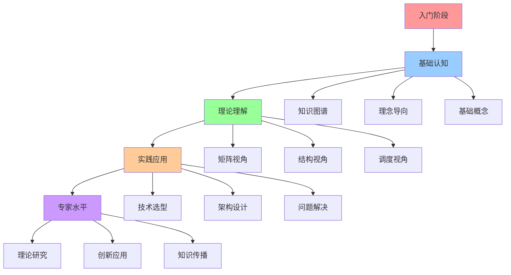
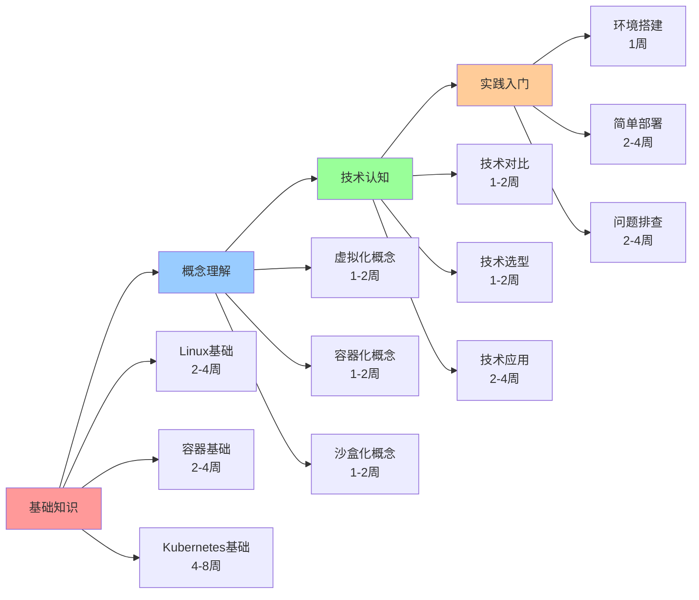
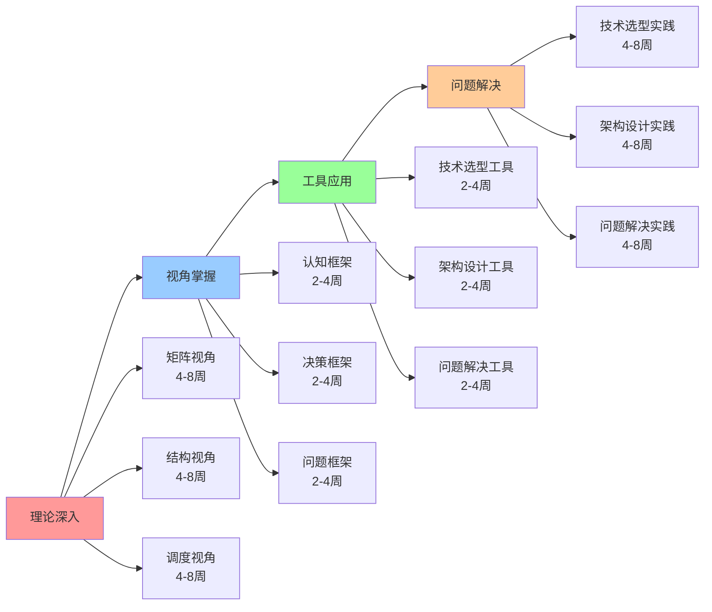
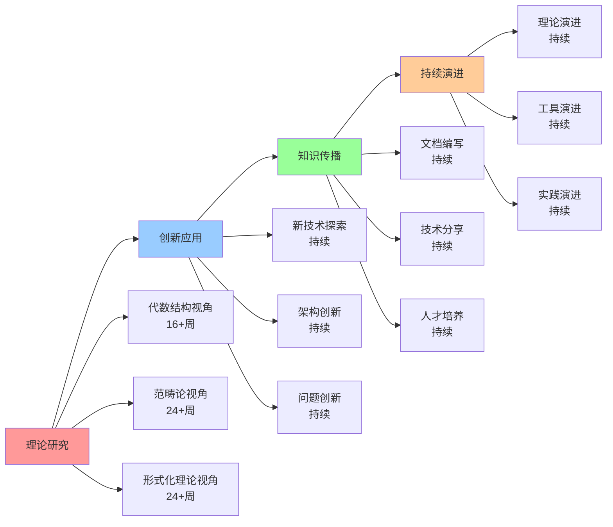

# 学习路径指南

## 📑 目录

- [学习路径指南](#学习路径指南)
  - [📑 目录](#-目录)
  - [1 学习路径全景](#1-学习路径全景)
  - [2 入门学习路径](#2-入门学习路径)
  - [3 进阶学习路径](#3-进阶学习路径)
  - [4 专家学习路径](#4-专家学习路径)
  - [5 学习路径时间表](#5-学习路径时间表)
  - [6 学习资源推荐](#6-学习资源推荐)
  - [7 使用指南](#7-使用指南)
    - [7.1 路径选择](#71-路径选择)
    - [7.2 学习执行](#72-学习执行)
  - [8 使用技巧](#8-使用技巧)
    - [8.1 路径规划技巧](#81-路径规划技巧)
    - [8.2 学习执行技巧](#82-学习执行技巧)
  - [9 相关文档](#9-相关文档)

---

## 1 学习路径全景

---

## 2 入门学习路径

---

## 3 进阶学习路径

---

## 4 专家学习路径

---

## 5 学习路径时间表

| 阶段 | 时间 | 核心内容 | 学习方式 | 预期成果 | 推荐度 |
|------|------|---------|---------|---------|--------|
| **入门** | 1-2个月 | 基础知识、概念理解 | 理论学习+实践 | 基础认知 | ⭐⭐⭐⭐⭐ |
| **进阶** | 3-6个月 | 理论深入、视角掌握 | 深入学习+项目实践 | 理论理解 | ⭐⭐⭐⭐⭐ |
| **高级** | 6-12个月 | 工具应用、问题解决 | 项目实践+问题解决 | 实践应用 | ⭐⭐⭐⭐⭐ |
| **专家** | 12+个月 | 理论研究、创新应用 | 研究+创新+传播 | 专家水平 | ⭐⭐⭐⭐ |

**推荐度说明**：

- **⭐⭐⭐⭐⭐**：强烈推荐
- **⭐⭐⭐⭐**：推荐
- **⭐⭐⭐**：可选

---

## 6 学习资源推荐

| 资源类型 | 资源名称 | 适用阶段 | 推荐度 |
|---------|---------|---------|--------|
| **文档** | 认知模型文档 | 入门+进阶 | ⭐⭐⭐⭐⭐ |
| **可视化** | 思维导图、知识矩阵 | 入门+进阶 | ⭐⭐⭐⭐⭐ |
| **实践** | 项目实践、案例分析 | 进阶+高级 | ⭐⭐⭐⭐⭐ |
| **研究** | 理论研究、论文阅读 | 高级+专家 | ⭐⭐⭐⭐ |
| **社区** | 技术社区、技术分享 | 所有阶段 | ⭐⭐⭐⭐ |

**推荐度说明**：

- **⭐⭐⭐⭐⭐**：强烈推荐
- **⭐⭐⭐⭐**：推荐
- **⭐⭐⭐**：可选

---

## 7 使用指南

### 7.1 路径选择

**适用场景**：学习规划、技能提升

**使用步骤**：

1. **评估当前水平**：评估当前的知识水平和技能水平
2. **选择学习阶段**：选择当前的学习阶段（入门、进阶、高级、专家）
3. **选择学习路径**：选择合适的学习路径
4. **制定学习计划**：制定详细的学习计划

**推荐度**：⭐⭐⭐⭐⭐

---

### 7.2 学习执行

**适用场景**：学习执行、进度跟踪

**使用步骤**：

1. **按路径学习**：按照选择的学习路径逐步学习
2. **使用学习资源**：使用推荐的学习资源
3. **实践应用**：在实际项目中实践应用
4. **评估学习效果**：评估学习效果并调整路径

**推荐度**：⭐⭐⭐⭐⭐

---

## 8 使用技巧

### 8.1 路径规划技巧

**技巧1：阶段规划**:

- 明确每个阶段的学习目标
- 制定阶段性的学习计划
- 确保阶段之间的衔接

**技巧2：资源利用**:

- 充分利用推荐的学习资源
- 结合多种学习方式
- 提高学习效率

**推荐度**：⭐⭐⭐⭐⭐

---

### 8.2 学习执行技巧

**技巧1：循序渐进**:

- 按照路径循序渐进学习
- 不要跳跃式学习
- 确保每个阶段的质量

**技巧2：实践结合**:

- 理论学习与实践相结合
- 在实际项目中应用知识
- 积累实践经验

**推荐度**：⭐⭐⭐⭐⭐

---

## 9 相关文档

- **[认知路径地图](04-cognitive-path-map.md)** - 认知路径全景
- **[认知学习策略指南](18-cognitive-learning-strategy.md)** - 学习策略、学习方法
- **[认知模型实践总结](12-cognitive-models-summary.md)** - 实践总结、使用建议

---

**最后更新**：2025-11-15
**文档状态**：✅ 完整 | 📊 包含学习路径指南、使用指南、使用技巧 | 🎯 生产就绪
**维护者**：项目团队
