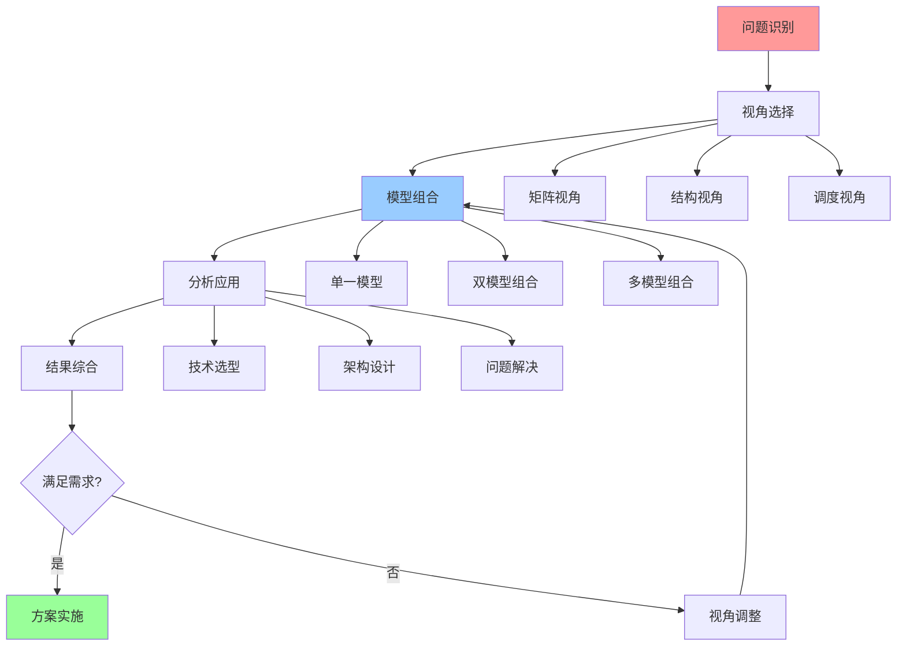

# 认知模型组合使用指南

## 📑 目录

- [认知模型组合使用指南](#认知模型组合使用指南)
  - [📑 目录](#-目录)
  - [1 组合使用全景](#1-组合使用全景)
  - [2 理论视角组合](#2-理论视角组合)
  - [3 应用视角组合](#3-应用视角组合)
  - [4 决策分析组合](#4-决策分析组合)
  - [5 组合使用检查清单](#5-组合使用检查清单)

---

## 1 组合使用全景

---

## 2 理论视角组合

| 组合方式 | 视角1 | 视角2 | 视角3 | 适用场景 | 效果 | 复杂度 |
|---------|------|------|------|---------|------|--------|
| **技术选型组合** | 矩阵视角 | 结构视角 | - | 技术选型 | 高 | 中 |
| **架构设计组合** | 结构视角 | 范畴论视角 | - | 架构设计 | 高 | 高 |
| **性能优化组合** | 调度视角 | 矩阵视角 | 结构视角 | 性能优化 | 高 | 中 |
| **系统验证组合** | 形式化理论视角 | 结构视角 | 范畴论视角 | 系统验证 | 极高 | 极高 |
| **操作组合** | 代数结构视角 | 矩阵视角 | - | 操作组合 | 高 | 中 |
| **全面分析组合** | 矩阵视角 | 结构视角 | 调度视角 | 全面系统分析 | 极高 | 高 |

**效果说明**：

- **高**：单一视角效果
- **极高**：组合视角效果

---

## 3 应用视角组合

| 组合方式 | 视角1 | 视角2 | 视角3 | 适用场景 | 效果 | 复杂度 |
|---------|------|------|------|---------|------|--------|
| **应用开发组合** | 程序设计视角 | eBPF/OTLP视角 | API规范视角 | 应用开发 | 高 | 中 |
| **架构演进组合** | 应用业务架构视角 | API规范视角 | - | 架构演进 | 高 | 中 |
| **可观测性组合** | eBPF/OTLP视角 | 程序设计视角 | - | 可观测性 | 高 | 中 |
| **技术栈组合** | 程序设计视角 | API规范视角 | 应用业务架构视角 | 技术栈选择 | 高 | 中 |
| **全面应用组合** | 所有应用视角 | - | - | 全面应用分析 | 极高 | 高 |

**效果说明**：

- **高**：单一视角效果
- **极高**：组合视角效果

---

## 4 决策分析组合

| 组合方式 | 模型1 | 模型2 | 模型3 | 适用场景 | 效果 | 复杂度 |
|---------|------|------|------|---------|------|--------|
| **资源+隔离** | 资源模型 | 隔离模型 | - | 容器化、虚拟化 | 高 | 中 |
| **隔离+安全** | 隔离模型 | 安全模型 | - | 多租户、Serverless | 高 | 高 |
| **安全+分布式** | 安全模型 | 分布式模型 | - | 分布式系统 | 高 | 高 |
| **资源+隔离+安全** | 资源模型 | 隔离模型 | 安全模型 | 企业级应用 | 极高 | 极高 |
| **全面组合** | 资源模型 | 隔离模型 | 安全模型+分布式模型 | 复杂系统 | 极高 | 极高 |

**效果说明**：

- **高**：单一模型效果
- **极高**：组合模型效果

---

## 5 组合使用检查清单

| 检查项 | 检查内容 | 重要性 | 推荐度 |
|--------|---------|--------|--------|
| **问题识别** | 问题类型、问题范围、问题复杂度 | 极高 | ⭐⭐⭐⭐⭐ |
| **视角选择** | 视角评估、视角选择、视角组合 | 高 | ⭐⭐⭐⭐⭐ |
| **模型组合** | 模型选择、模型组合、模型验证 | 高 | ⭐⭐⭐⭐⭐ |
| **分析应用** | 分析方法、分析工具、分析结果 | 高 | ⭐⭐⭐⭐⭐ |
| **结果综合** | 结果整合、结果验证、结果优化 | 中 | ⭐⭐⭐⭐ |
| **效果评估** | 效果测量、效果分析、效果报告 | 中 | ⭐⭐⭐⭐ |

**推荐度说明**：

- **⭐⭐⭐⭐⭐**：强烈推荐
- **⭐⭐⭐⭐**：推荐
- **⭐⭐⭐**：可选

---

## 6 组合使用详细说明

### 6.1 理论视角组合详细说明

#### 6.1.1 技术选型组合（矩阵视角 + 结构视角）

**组合原理**：

- **矩阵视角**：提供技术对比的工具，通过关系矩阵和属性矩阵对比不同技术的功能、性能、成本等维度
- **结构视角**：提供技术结构的分析框架，通过计算结构、控制结构、信息结构分析技术的架构特性
- **组合优势**：矩阵视角提供横向对比，结构视角提供纵向分析，两者结合形成全面的技术评估

**使用流程**：

1. **需求分析**：明确技术选型的需求和约束
2. **矩阵对比**：使用矩阵视角对比候选技术的功能、性能、成本等
3. **结构分析**：使用结构视角分析候选技术的架构特性
4. **综合评估**：综合矩阵对比和结构分析的结果
5. **决策制定**：基于综合评估做出技术选型决策

**适用场景**：

- 容器运行时选型（containerd、CRI-O、Docker）
- 隔离技术选型（虚拟化、容器化、沙盒化）
- 编排平台选型（Kubernetes、Docker Swarm、Nomad）
- 服务网格选型（Istio、Linkerd、Consul Connect）

**推荐度**：⭐⭐⭐⭐⭐

#### 6.1.2 架构设计组合（结构视角 + 范畴论视角）

**组合原理**：

- **结构视角**：提供架构结构的分析框架，分析计算结构、控制结构、信息结构
- **范畴论视角**：提供系统抽象的分析方法，通过对象、态射、函子分析系统关系
- **组合优势**：结构视角提供具体结构分析，范畴论视角提供抽象关系分析，两者结合形成完整的架构设计

**使用流程**：

1. **需求分析**：明确架构设计的需求和约束
2. **结构设计**：使用结构视角设计架构的计算、控制、信息结构
3. **关系分析**：使用范畴论视角分析架构中的对象关系和态射关系
4. **架构优化**：基于结构分析和关系分析优化架构设计
5. **架构验证**：验证架构设计的合理性和有效性

**适用场景**：

- 微服务架构设计
- Serverless 架构设计
- 边缘计算架构设计
- 多租户架构设计

**推荐度**：⭐⭐⭐⭐⭐

#### 6.1.3 性能优化组合（调度视角 + 矩阵视角 + 结构视角）

**组合原理**：

- **调度视角**：提供性能瓶颈的分析方法，分析调度决策、分层分析、动态特性
- **矩阵视角**：提供性能指标的对比工具，对比不同优化方案的性能指标
- **结构视角**：提供性能优化的结构分析，分析架构结构对性能的影响
- **组合优势**：调度视角识别瓶颈，矩阵视角对比方案，结构视角优化架构，三者结合形成全面的性能优化

**使用流程**：

1. **性能分析**：使用调度视角分析性能瓶颈和调度问题
2. **方案对比**：使用矩阵视角对比不同优化方案的性能指标
3. **结构优化**：使用结构视角优化架构结构以提升性能
4. **方案实施**：实施性能优化方案
5. **效果评估**：评估性能优化的效果

**适用场景**：

- CPU 性能优化
- 内存性能优化
- I/O 性能优化
- 网络性能优化

**推荐度**：⭐⭐⭐⭐⭐

---

### 6.2 应用视角组合详细说明

#### 6.2.1 应用开发组合（程序设计视角 + eBPF/OTLP视角 + API规范视角）

**组合原理**：

- **程序设计视角**：提供代码省却和编程范式转变的分析，减少代码量，转变编程范式
- **eBPF/OTLP视角**：提供可观测性的支持，通过 eBPF 和 OTLP 实现应用的可观测性
- **API规范视角**：提供 API 规范的设计和演进，确保 API 的一致性和演进性
- **组合优势**：程序设计视角简化代码，eBPF/OTLP视角提供可观测性，API规范视角规范接口，三者结合形成完整的应用开发方案

**使用流程**：

1. **需求分析**：明确应用开发的需求和约束
2. **代码设计**：使用程序设计视角设计代码结构和编程范式
3. **可观测性设计**：使用 eBPF/OTLP视角设计可观测性方案
4. **API设计**：使用 API规范视角设计 API 接口
5. **开发实施**：实施应用开发方案
6. **效果评估**：评估应用开发的效果

**适用场景**：

- 云原生应用开发
- 微服务应用开发
- Serverless 应用开发
- 边缘应用开发

**推荐度**：⭐⭐⭐⭐⭐

---

### 6.3 决策分析组合详细说明

#### 6.3.1 资源+隔离组合（资源模型 + 隔离模型）

**组合原理**：

- **资源模型**：提供资源需求和资源分配的分析，分析 CPU、内存、存储等资源需求
- **隔离模型**：提供隔离层次和隔离机制的分析，分析虚拟化、容器化、沙盒化等隔离层次
- **组合优势**：资源模型分析资源需求，隔离模型分析隔离需求，两者结合形成完整的资源隔离方案

**使用流程**：

1. **需求分析**：明确资源需求和隔离需求
2. **资源分析**：使用资源模型分析资源需求和资源分配
3. **隔离分析**：使用隔离模型分析隔离层次和隔离机制
4. **方案设计**：基于资源分析和隔离分析设计方案
5. **方案实施**：实施资源隔离方案
6. **效果评估**：评估资源隔离的效果

**适用场景**：

- 容器化部署
- 虚拟化部署
- 多租户平台
- Serverless 平台

**推荐度**：⭐⭐⭐⭐⭐

#### 6.3.2 隔离+安全组合（隔离模型 + 安全模型）

**组合原理**：

- **隔离模型**：提供隔离层次和隔离机制的分析，确保不同租户或应用之间的隔离
- **安全模型**：提供安全机制和安全策略的分析，确保系统的安全性
- **组合优势**：隔离模型提供隔离保障，安全模型提供安全保障，两者结合形成完整的安全隔离方案

**使用流程**：

1. **需求分析**：明确隔离需求和安全需求
2. **隔离分析**：使用隔离模型分析隔离层次和隔离机制
3. **安全分析**：使用安全模型分析安全机制和安全策略
4. **方案设计**：基于隔离分析和安全分析设计方案
5. **方案实施**：实施安全隔离方案
6. **效果评估**：评估安全隔离的效果

**适用场景**：

- 多租户平台
- Serverless 平台
- 企业级应用
- 金融系统

**推荐度**：⭐⭐⭐⭐⭐

---

## 7 组合使用实践案例

### 7.1 案例1：容器运行时选型

**场景**：选择适合的容器运行时

**组合模型**：矩阵视角 + 结构视角 + 资源模型

**组合流程**：

1. **需求分析**：明确容器运行时的需求和约束（性能、安全性、兼容性）
2. **矩阵对比**：使用矩阵视角对比 containerd、CRI-O、Docker 的功能、性能、成本
3. **结构分析**：使用结构视角分析各容器运行时的架构结构
4. **资源分析**：使用资源模型分析各容器运行时的资源需求
5. **综合评估**：综合矩阵对比、结构分析、资源分析的结果
6. **决策制定**：基于综合评估选择最适合的容器运行时

**效果**：选择最适合的容器运行时，平衡功能、性能、安全性、资源需求

**推荐度**：⭐⭐⭐⭐⭐

### 7.2 案例2：微服务架构设计

**场景**：设计微服务架构

**组合模型**：结构视角 + 范畴论视角 + 分布式模型

**组合流程**：

1. **需求分析**：明确微服务架构的需求和约束（可扩展性、可维护性、性能）
2. **结构设计**：使用结构视角设计微服务架构的计算、控制、信息结构
3. **关系分析**：使用范畴论视角分析微服务之间的关系和交互
4. **分布式分析**：使用分布式模型分析分布式系统的一致性和可用性
5. **架构优化**：基于结构分析、关系分析、分布式分析优化架构设计
6. **架构验证**：验证架构设计的合理性和有效性

**效果**：设计优秀的微服务架构，平衡性能、一致性、可用性、可扩展性

**推荐度**：⭐⭐⭐⭐⭐

### 7.3 案例3：性能优化

**场景**：优化应用性能

**组合模型**：调度视角 + 矩阵视角 + 结构视角

**组合流程**：

1. **性能分析**：使用调度视角分析性能瓶颈和调度问题
2. **方案对比**：使用矩阵视角对比不同优化方案的性能指标
3. **结构优化**：使用结构视角优化架构结构以提升性能
4. **方案实施**：实施性能优化方案
5. **效果评估**：评估性能优化的效果

**效果**：有效提升应用性能，解决性能瓶颈

**推荐度**：⭐⭐⭐⭐⭐

---

## 8 组合使用最佳实践

### 8.1 组合选择原则

**原则1：问题导向**:

- 根据问题类型选择合适的模型组合
- 避免过度组合，保持组合简洁
- 关注问题本质，避免表面组合

**原则2：互补优势**:

- 选择互补的模型进行组合
- 发挥每个模型的优势
- 避免重复和冗余

**原则3：层次清晰**:

- 明确不同层次的模型职责
- 保持层次间的清晰关系
- 避免层次混乱和职责不清

**推荐度**：⭐⭐⭐⭐⭐

### 8.2 组合使用方法

**方法1：顺序组合**:

- 按照问题解决的顺序组合模型
- 先分析后决策，先理论后实践
- 保持逻辑清晰和流程顺畅

**方法2：并行组合**:

- 同时使用多个模型进行分析
- 从不同角度分析同一问题
- 综合多角度分析结果

**方法3：迭代组合**:

- 根据分析结果调整模型组合
- 迭代优化组合方案
- 持续改进组合效果

**推荐度**：⭐⭐⭐⭐⭐

### 8.3 组合使用注意事项

**注意事项1：避免过度组合**:

- 不要组合过多模型，保持组合简洁
- 根据问题复杂度选择合适的组合
- 优先使用简单有效的组合

**注意事项2：注意模型冲突**:

- 注意不同模型的分析结果可能冲突
- 深入分析冲突的原因和本质
- 综合权衡多个模型的结果

**注意事项3：持续优化**:

- 根据实践效果优化模型组合
- 积累组合使用的经验
- 形成组合使用的模式

**推荐度**：⭐⭐⭐⭐⭐

---

## 9 组合使用工具推荐

| 工具类型 | 推荐工具 | 使用场景 | 效果 | 复杂度 | 推荐度 |
|---------|---------|---------|------|--------|--------|
| **思维导图工具** | XMind、MindMaster | 模型组合可视化 | 高 | 低 | ⭐⭐⭐⭐⭐ |
| **知识图谱工具** | Neo4j、Gephi | 模型关系分析 | 高 | 中 | ⭐⭐⭐⭐ |
| **决策支持工具** | AHP、TOPSIS | 多模型决策 | 高 | 中 | ⭐⭐⭐⭐ |
| **可视化工具** | D3.js、ECharts | 模型组合可视化 | 中 | 中 | ⭐⭐⭐⭐ |
| **文档工具** | Markdown、Mermaid | 模型组合文档化 | 中 | 低 | ⭐⭐⭐⭐⭐ |

**推荐度说明**：

- **⭐⭐⭐⭐⭐**：强烈推荐
- **⭐⭐⭐⭐**：推荐
- **⭐⭐⭐**：可选

---

**最后更新**：2025-11-15
**文档状态**：✅ 完整 | 📊 包含认知模型组合使用指南、详细说明、实践案例、最佳实践 | 🎯 生产就绪
**维护者**：项目团队
