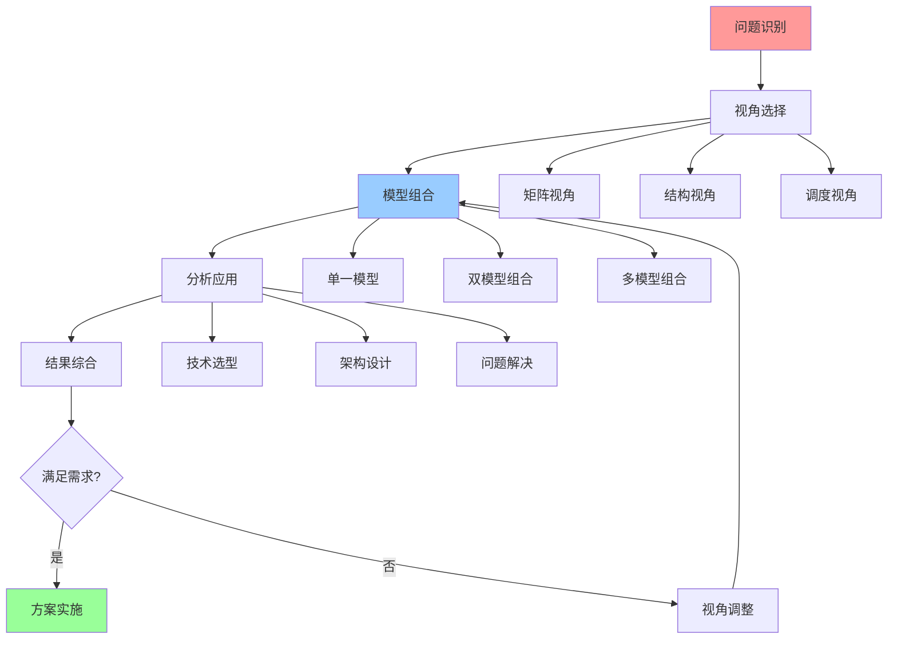

# 认知模型组合使用指南

## 📑 目录

- [认知模型组合使用指南](#认知模型组合使用指南)
  - [📑 目录](#-目录)
  - [1 组合使用全景](#1-组合使用全景)
  - [2 理论视角组合](#2-理论视角组合)
  - [3 应用视角组合](#3-应用视角组合)
  - [4 决策分析组合](#4-决策分析组合)

---

## 1 组合使用全景

---

## 2 理论视角组合

| 组合方式 | 视角1 | 视角2 | 视角3 | 适用场景 | 效果 | 复杂度 |
|---------|------|------|------|---------|------|--------|
| **技术选型组合** | 矩阵视角 | 结构视角 | - | 技术选型 | 高 | 中 |
| **架构设计组合** | 结构视角 | 范畴论视角 | - | 架构设计 | 高 | 高 |
| **性能优化组合** | 调度视角 | 矩阵视角 | 结构视角 | 性能优化 | 高 | 中 |
| **系统验证组合** | 形式化理论视角 | 结构视角 | 范畴论视角 | 系统验证 | 极高 | 极高 |
| **操作组合** | 代数结构视角 | 矩阵视角 | - | 操作组合 | 高 | 中 |
| **全面分析组合** | 矩阵视角 | 结构视角 | 调度视角 | 全面系统分析 | 极高 | 高 |

**效果说明**：
- **高**：单一视角效果
- **极高**：组合视角效果

---

## 3 应用视角组合

| 组合方式 | 视角1 | 视角2 | 视角3 | 适用场景 | 效果 | 复杂度 |
|---------|------|------|------|---------|------|--------|
| **应用开发组合** | 程序设计视角 | eBPF/OTLP视角 | API规范视角 | 应用开发 | 高 | 中 |
| **架构演进组合** | 应用业务架构视角 | API规范视角 | - | 架构演进 | 高 | 中 |
| **可观测性组合** | eBPF/OTLP视角 | 程序设计视角 | - | 可观测性 | 高 | 中 |
| **技术栈组合** | 程序设计视角 | API规范视角 | 应用业务架构视角 | 技术栈选择 | 高 | 中 |
| **全面应用组合** | 所有应用视角 | - | - | 全面应用分析 | 极高 | 高 |

**效果说明**：
- **高**：单一视角效果
- **极高**：组合视角效果

---

## 4 决策分析组合

| 组合方式 | 模型1 | 模型2 | 模型3 | 适用场景 | 效果 | 复杂度 |
|---------|------|------|------|---------|------|--------|
| **资源+隔离** | 资源模型 | 隔离模型 | - | 容器化、虚拟化 | 高 | 中 |
| **隔离+安全** | 隔离模型 | 安全模型 | - | 多租户、Serverless | 高 | 高 |
| **安全+分布式** | 安全模型 | 分布式模型 | - | 分布式系统 | 高 | 高 |
| **资源+隔离+安全** | 资源模型 | 隔离模型 | 安全模型 | 企业级应用 | 极高 | 极高 |
| **全面组合** | 资源模型 | 隔离模型 | 安全模型+分布式模型 | 复杂系统 | 极高 | 极高 |

**效果说明**：
- **高**：单一模型效果
- **极高**：组合模型效果

---

## 5 组合使用检查清单

| 检查项 | 检查内容 | 重要性 | 推荐度 |
|--------|---------|--------|--------|
| **问题识别** | 问题类型、问题范围、问题复杂度 | 极高 | ⭐⭐⭐⭐⭐ |
| **视角选择** | 视角评估、视角选择、视角组合 | 高 | ⭐⭐⭐⭐⭐ |
| **模型组合** | 模型选择、模型组合、模型验证 | 高 | ⭐⭐⭐⭐⭐ |
| **分析应用** | 分析方法、分析工具、分析结果 | 高 | ⭐⭐⭐⭐⭐ |
| **结果综合** | 结果整合、结果验证、结果优化 | 中 | ⭐⭐⭐⭐ |
| **效果评估** | 效果测量、效果分析、效果报告 | 中 | ⭐⭐⭐⭐ |

**推荐度说明**：
- **⭐⭐⭐⭐⭐**：强烈推荐
- **⭐⭐⭐⭐**：推荐
- **⭐⭐⭐**：可选

---

**最后更新**：2025-11-07
**文档状态**：✅ 完整 | 📊 包含认知模型组合使用指南 | 🎯 生产就绪
**维护者**：项目团队
