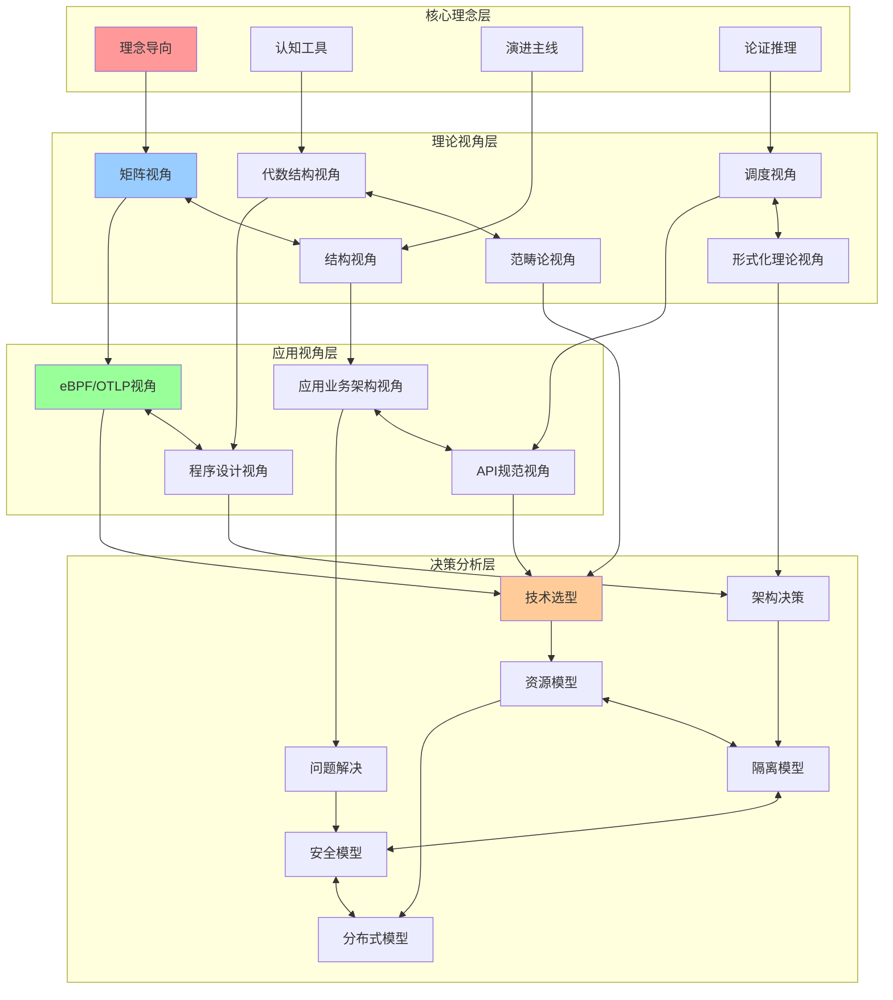
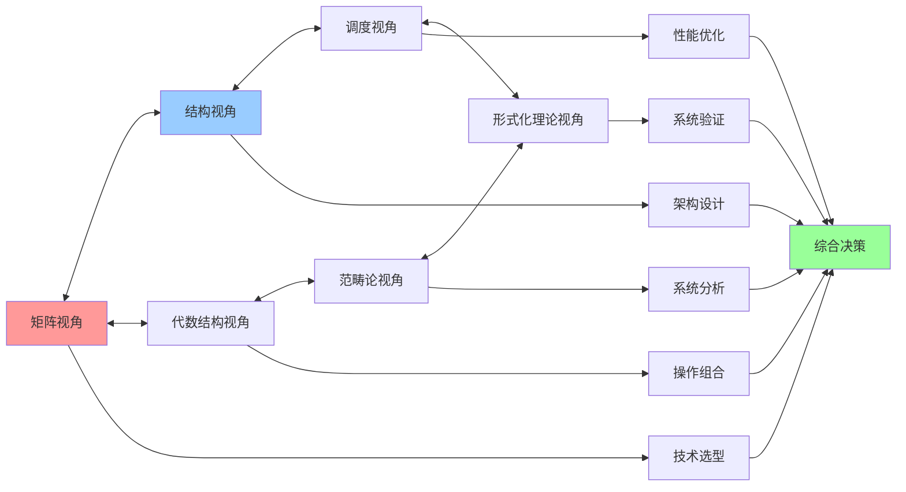
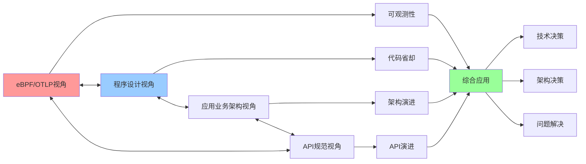
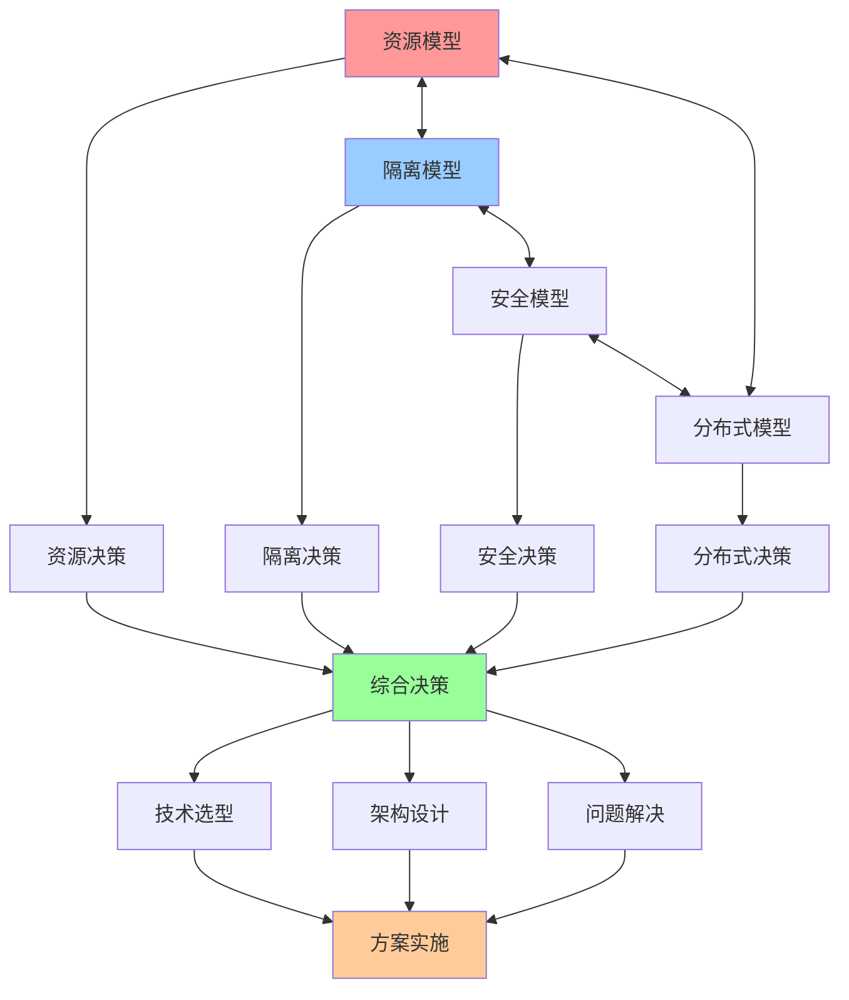

# 认知模型交互关系图

## 📑 目录

- [认知模型交互关系图](#认知模型交互关系图)
  - [📑 目录](#-目录)
  - [1 模型交互全景](#1-模型交互全景)
  - [2 理论视角交互](#2-理论视角交互)
  - [3 应用视角交互](#3-应用视角交互)
  - [4 决策分析交互](#4-决策分析交互)

---

## 1 模型交互全景

---

## 2 理论视角交互

---

## 3 应用视角交互

---

## 4 决策分析交互

---

## 5 模型交互强度矩阵

| 模型1 | 模型2 | 交互类型 | 交互强度 | 适用场景 | 推荐度 |
|------|------|---------|---------|---------|--------|
| **矩阵视角** | **结构视角** | 互补 | 高 | 技术选型、架构设计 | ⭐⭐⭐⭐⭐ |
| **结构视角** | **调度视角** | 互补 | 高 | 性能优化、架构设计 | ⭐⭐⭐⭐⭐ |
| **代数结构视角** | **范畴论视角** | 互补 | 高 | 系统分析、结构保持 | ⭐⭐⭐⭐ |
| **调度视角** | **形式化理论视角** | 互补 | 中 | 系统验证、性能分析 | ⭐⭐⭐⭐ |
| **资源模型** | **隔离模型** | 互补 | 高 | 容器化、虚拟化 | ⭐⭐⭐⭐⭐ |
| **隔离模型** | **安全模型** | 互补 | 高 | 多租户、Serverless | ⭐⭐⭐⭐⭐ |
| **安全模型** | **分布式模型** | 互补 | 中 | 分布式系统 | ⭐⭐⭐⭐ |
| **eBPF/OTLP视角** | **程序设计视角** | 互补 | 高 | 应用开发、可观测性 | ⭐⭐⭐⭐⭐ |

**推荐度说明**：
- **⭐⭐⭐⭐⭐**：强烈推荐
- **⭐⭐⭐⭐**：推荐
- **⭐⭐⭐**：可选

---

**最后更新**：2025-11-07
**文档状态**：✅ 完整 | 📊 包含认知模型交互关系图 | 🎯 生产就绪
**维护者**：项目团队
