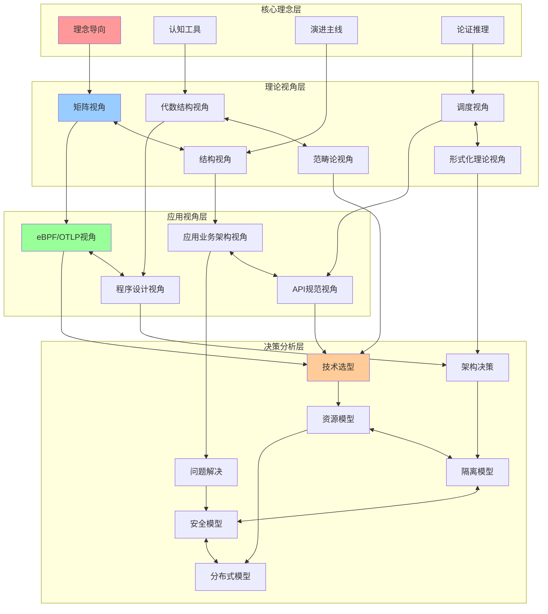
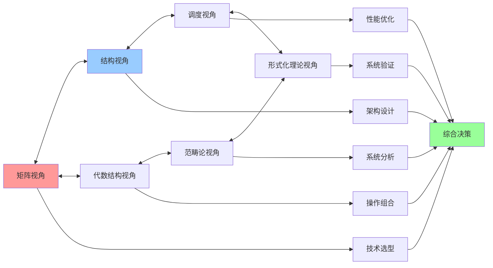
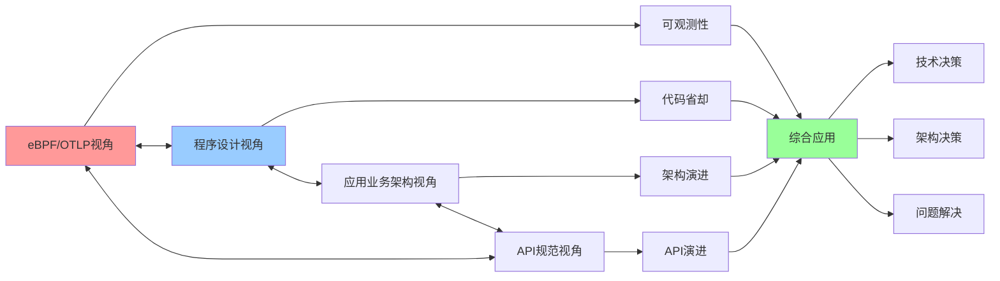
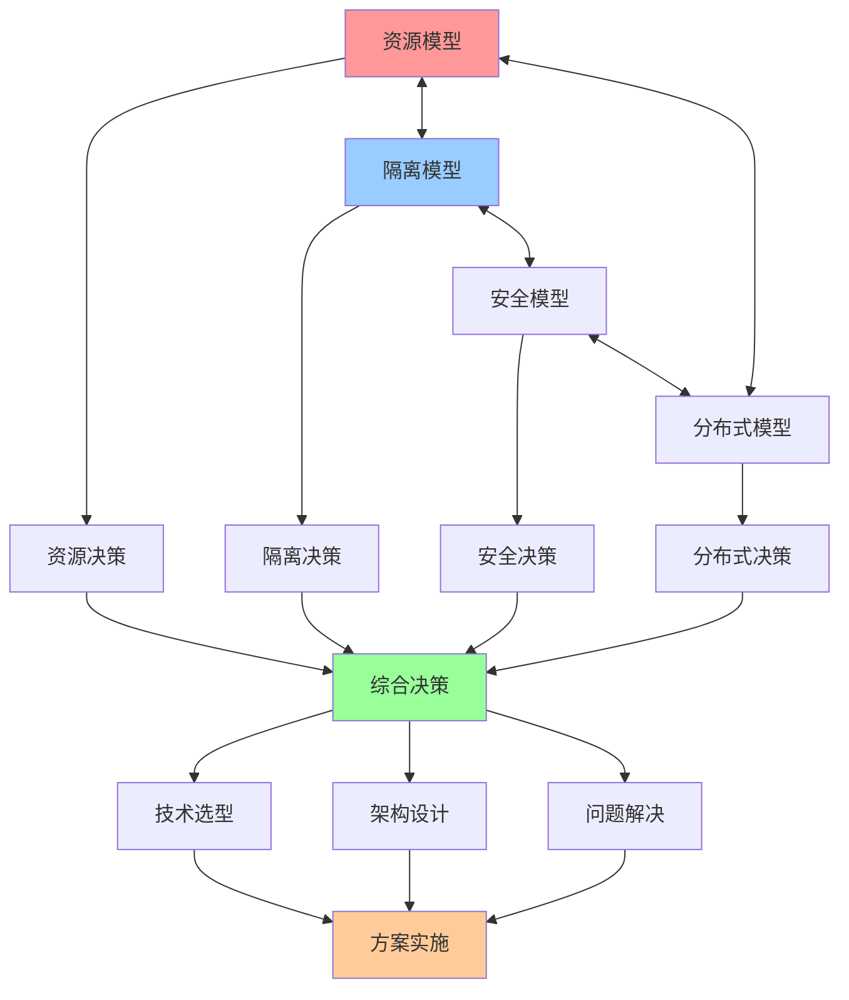

# 认知模型交互关系图

## 📑 目录

- [认知模型交互关系图](#认知模型交互关系图)
  - [📑 目录](#-目录)
  - [1 模型交互全景](#1-模型交互全景)
  - [2 理论视角交互](#2-理论视角交互)
  - [3 应用视角交互](#3-应用视角交互)
  - [4 决策分析交互](#4-决策分析交互)
  - [5 模型交互强度矩阵](#5-模型交互强度矩阵)

---

## 1 模型交互全景



---

## 2 理论视角交互



---

## 3 应用视角交互



---

## 4 决策分析交互



---

## 5 模型交互强度矩阵

| 模型1 | 模型2 | 交互类型 | 交互强度 | 适用场景 | 推荐度 |
|------|------|---------|---------|---------|--------|
| **矩阵视角** | **结构视角** | 互补 | 高 | 技术选型、架构设计 | ⭐⭐⭐⭐⭐ |
| **结构视角** | **调度视角** | 互补 | 高 | 性能优化、架构设计 | ⭐⭐⭐⭐⭐ |
| **代数结构视角** | **范畴论视角** | 互补 | 高 | 系统分析、结构保持 | ⭐⭐⭐⭐ |
| **调度视角** | **形式化理论视角** | 互补 | 中 | 系统验证、性能分析 | ⭐⭐⭐⭐ |
| **资源模型** | **隔离模型** | 互补 | 高 | 容器化、虚拟化 | ⭐⭐⭐⭐⭐ |
| **隔离模型** | **安全模型** | 互补 | 高 | 多租户、Serverless | ⭐⭐⭐⭐⭐ |
| **安全模型** | **分布式模型** | 互补 | 中 | 分布式系统 | ⭐⭐⭐⭐ |
| **eBPF/OTLP视角** | **程序设计视角** | 互补 | 高 | 应用开发、可观测性 | ⭐⭐⭐⭐⭐ |

**推荐度说明**：

- **⭐⭐⭐⭐⭐**：强烈推荐
- **⭐⭐⭐⭐**：推荐
- **⭐⭐⭐**：可选

---

## 6 模型交互详细说明

### 6.1 理论视角交互详细说明

#### 6.1.1 矩阵视角 ↔ 结构视角

**交互类型**：互补交互

**交互机制**：

- **矩阵视角 → 结构视角**：矩阵视角提供技术对比的结果，结构视角基于对比结果进行结构分析
- **结构视角 → 矩阵视角**：结构视角提供结构分析的结果，矩阵视角基于结构分析进行更深入的技术对比

**交互价值**：

- **全面分析**：矩阵视角提供横向对比，结构视角提供纵向分析，两者结合形成全面的技术分析
- **互补优势**：矩阵视角的优势在于技术对比，结构视角的优势在于结构分析，两者互补形成更强的分析能力

**适用场景**：

- 技术选型（容器运行时、隔离技术、编排平台）
- 架构设计（微服务架构、Serverless架构）
- 性能优化（CPU优化、内存优化、I/O优化）

**推荐度**：⭐⭐⭐⭐⭐

#### 6.1.2 结构视角 ↔ 调度视角

**交互类型**：互补交互

**交互机制**：

- **结构视角 → 调度视角**：结构视角提供架构结构分析，调度视角基于结构分析进行调度优化
- **调度视角 → 结构视角**：调度视角提供调度优化建议，结构视角基于调度优化建议调整架构结构

**交互价值**：

- **性能优化**：结构视角分析架构结构，调度视角优化调度策略，两者结合实现性能优化
- **架构优化**：调度视角识别性能瓶颈，结构视角优化架构结构，两者结合实现架构优化

**适用场景**：

- 性能优化（CPU调度优化、内存调度优化）
- 架构优化（微服务架构优化、Serverless架构优化）
- 资源优化（资源分配优化、资源调度优化）

**推荐度**：⭐⭐⭐⭐⭐

#### 6.1.3 代数结构视角 ↔ 范畴论视角

**交互类型**：互补交互

**交互机制**：

- **代数结构视角 → 范畴论视角**：代数结构视角提供操作组合的分析，范畴论视角基于操作组合进行系统抽象
- **范畴论视角 → 代数结构视角**：范畴论视角提供系统抽象的分析，代数结构视角基于系统抽象进行操作组合

**交互价值**：

- **系统分析**：代数结构视角分析操作组合，范畴论视角分析系统抽象，两者结合形成完整的系统分析
- **结构保持**：代数结构视角分析结构保持，范畴论视角分析函子保持，两者结合实现结构保持

**适用场景**：

- 系统分析（分布式系统分析、微服务系统分析）
- 操作组合（服务组合、API组合）
- 结构保持（架构演进、系统迁移）

**推荐度**：⭐⭐⭐⭐

---

### 6.2 应用视角交互详细说明

#### 6.2.1 eBPF/OTLP视角 ↔ 程序设计视角

**交互类型**：互补交互

**交互机制**：

- **eBPF/OTLP视角 → 程序设计视角**：eBPF/OTLP视角提供可观测性支持，程序设计视角基于可观测性设计代码结构
- **程序设计视角 → eBPF/OTLP视角**：程序设计视角提供代码结构，eBPF/OTLP视角基于代码结构设计可观测性方案

**交互价值**：

- **可观测性**：eBPF/OTLP视角提供可观测性工具，程序设计视角简化代码结构，两者结合实现可观测的代码简化
- **代码优化**：程序设计视角简化代码，eBPF/OTLP视角提供可观测性，两者结合实现代码优化和可观测性提升

**适用场景**：

- 应用开发（云原生应用开发、微服务应用开发）
- 可观测性设计（监控设计、日志设计、追踪设计）
- 代码优化（代码简化、性能优化）

**推荐度**：⭐⭐⭐⭐⭐

#### 6.2.2 应用业务架构视角 ↔ API规范视角

**交互类型**：互补交互

**交互机制**：

- **应用业务架构视角 → API规范视角**：应用业务架构视角提供架构演进方向，API规范视角基于架构演进设计API规范
- **API规范视角 → 应用业务架构视角**：API规范视角提供API演进方向，应用业务架构视角基于API演进调整架构设计

**交互价值**：

- **架构演进**：应用业务架构视角提供架构演进，API规范视角提供API演进，两者结合实现架构和API的协同演进
- **一致性保证**：应用业务架构视角保证架构一致性，API规范视角保证API一致性，两者结合实现整体一致性

**适用场景**：

- 架构演进（微服务架构演进、Serverless架构演进）
- API设计（RESTful API设计、GraphQL API设计）
- 系统集成（系统集成、服务集成）

**推荐度**：⭐⭐⭐⭐⭐

---

### 6.3 决策分析交互详细说明

#### 6.3.1 资源模型 ↔ 隔离模型

**交互类型**：互补交互

**交互机制**：

- **资源模型 → 隔离模型**：资源模型提供资源需求分析，隔离模型基于资源需求选择合适的隔离层次
- **隔离模型 → 资源模型**：隔离模型提供隔离层次选择，资源模型基于隔离层次分析资源需求

**交互价值**：

- **资源优化**：资源模型分析资源需求，隔离模型选择隔离层次，两者结合实现资源优化
- **隔离优化**：隔离模型选择隔离层次，资源模型分析资源需求，两者结合实现隔离优化

**适用场景**：

- 容器化部署（Docker、containerd）
- 虚拟化部署（KVM、Xen）
- 多租户平台（SaaS平台、PaaS平台）

**推荐度**：⭐⭐⭐⭐⭐

#### 6.3.2 隔离模型 ↔ 安全模型

**交互类型**：互补交互

**交互机制**：

- **隔离模型 → 安全模型**：隔离模型提供隔离层次选择，安全模型基于隔离层次设计安全策略
- **安全模型 → 隔离模型**：安全模型提供安全需求，隔离模型基于安全需求选择合适的隔离层次

**交互价值**：

- **安全隔离**：隔离模型提供隔离保障，安全模型提供安全保障，两者结合实现安全隔离
- **安全优化**：安全模型分析安全需求，隔离模型选择隔离层次，两者结合实现安全优化

**适用场景**：

- 多租户平台（SaaS平台、PaaS平台）
- Serverless平台（AWS Lambda、Azure Functions）
- 企业级应用（金融系统、医疗系统）

**推荐度**：⭐⭐⭐⭐⭐

#### 6.3.3 安全模型 ↔ 分布式模型

**交互类型**：互补交互

**交互机制**：

- **安全模型 → 分布式模型**：安全模型提供安全需求，分布式模型基于安全需求设计分布式安全策略
- **分布式模型 → 安全模型**：分布式模型提供分布式系统特性，安全模型基于分布式系统特性设计安全策略

**交互价值**：

- **分布式安全**：安全模型提供安全策略，分布式模型提供分布式系统特性，两者结合实现分布式安全
- **安全一致性**：分布式模型保证一致性，安全模型保证安全性，两者结合实现安全一致性

**适用场景**：

- 分布式系统（微服务系统、分布式数据库）
- 区块链系统（区块链安全、共识安全）
- 边缘计算（边缘安全、边缘一致性）

**推荐度**：⭐⭐⭐⭐

---

## 7 模型交互实践案例

### 7.1 案例1：容器运行时选型

**场景**：选择适合的容器运行时

**交互模型**：矩阵视角 ↔ 结构视角 ↔ 资源模型 ↔ 隔离模型

**交互流程**：

1. **矩阵对比**：使用矩阵视角对比 containerd、CRI-O、Docker 的功能、性能、成本
2. **结构分析**：使用结构视角分析各容器运行时的架构结构
3. **资源分析**：使用资源模型分析各容器运行时的资源需求
4. **隔离分析**：使用隔离模型分析各容器运行时的隔离能力
5. **交互综合**：综合矩阵对比、结构分析、资源分析、隔离分析的结果
6. **决策制定**：基于交互综合结果选择最适合的容器运行时

**效果**：选择最适合的容器运行时，平衡功能、性能、资源需求、隔离能力

**推荐度**：⭐⭐⭐⭐⭐

### 7.2 案例2：微服务架构设计

**场景**：设计微服务架构

**交互模型**：结构视角 ↔ 调度视角 ↔ 分布式模型 ↔ 安全模型

**交互流程**：

1. **结构设计**：使用结构视角设计微服务架构的计算、控制、信息结构
2. **调度优化**：使用调度视角优化服务调度策略
3. **分布式分析**：使用分布式模型分析分布式系统的一致性和可用性
4. **安全设计**：使用安全模型设计安全策略
5. **交互综合**：综合结构设计、调度优化、分布式分析、安全设计的结果
6. **架构优化**：基于交互综合结果优化架构设计

**效果**：设计优秀的微服务架构，平衡性能、一致性、可用性、安全性

**推荐度**：⭐⭐⭐⭐⭐

### 7.3 案例3：性能优化

**场景**：优化应用性能

**交互模型**：调度视角 ↔ 结构视角 ↔ 资源模型

**交互流程**：

1. **性能分析**：使用调度视角分析性能瓶颈和调度问题
2. **结构优化**：使用结构视角优化架构结构以提升性能
3. **资源优化**：使用资源模型优化资源分配以提升性能
4. **交互综合**：综合性能分析、结构优化、资源优化的结果
5. **方案实施**：实施性能优化方案
6. **效果评估**：评估性能优化的效果

**效果**：有效提升应用性能，解决性能瓶颈

**推荐度**：⭐⭐⭐⭐⭐

---

## 8 模型交互最佳实践

### 8.1 交互选择原则

#### 原则1：互补优势

- 选择互补的模型进行交互
- 发挥每个模型的优势
- 避免重复和冗余

#### 原则2：层次清晰

- 明确不同层次的模型职责
- 保持层次间的清晰关系
- 避免层次混乱和职责不清

#### 原则3：问题导向

- 根据问题类型选择合适的模型交互
- 避免过度交互，保持交互简洁
- 关注问题本质，避免表面交互

**推荐度**：⭐⭐⭐⭐⭐

### 8.2 交互使用方法

#### 方法1：顺序交互

- 按照问题解决的顺序进行模型交互
- 先分析后决策，先理论后实践
- 保持逻辑清晰和流程顺畅

#### 方法2：并行交互

- 同时进行多个模型的交互
- 从不同角度分析同一问题
- 综合多角度分析结果

#### 方法3：迭代交互

- 根据分析结果调整模型交互
- 迭代优化交互方案
- 持续改进交互效果

**推荐度**：⭐⭐⭐⭐⭐

### 8.3 交互使用注意事项

#### 注意事项1：避免过度交互

- 不要进行过多模型的交互，保持交互简洁
- 根据问题复杂度选择合适的交互
- 优先使用简单有效的交互

#### 注意事项2：注意交互冲突

- 注意不同模型的交互结果可能冲突
- 深入分析冲突的原因和本质
- 综合权衡多个模型的交互结果

#### 注意事项3：持续优化

- 根据实践效果优化模型交互
- 积累交互使用的经验
- 形成交互使用的模式

**推荐度**：⭐⭐⭐⭐⭐

---

## 9 模型交互工具推荐

| 工具类型 | 推荐工具 | 使用场景 | 效果 | 复杂度 | 推荐度 |
|---------|---------|---------|------|--------|--------|
| **关系图谱工具** | Neo4j、Gephi | 模型交互关系可视化 | 高 | 中 | ⭐⭐⭐⭐⭐ |
| **思维导图工具** | XMind、MindMaster | 模型交互流程可视化 | 高 | 低 | ⭐⭐⭐⭐⭐ |
| **可视化工具** | D3.js、ECharts | 模型交互可视化 | 中 | 中 | ⭐⭐⭐⭐ |
| **文档工具** | Markdown、Mermaid | 模型交互文档化 | 中 | 低 | ⭐⭐⭐⭐⭐ |
| **分析工具** | Python、R | 模型交互数据分析 | 高 | 中 | ⭐⭐⭐⭐ |

**推荐度说明**：

- **⭐⭐⭐⭐⭐**：强烈推荐
- **⭐⭐⭐⭐**：推荐
- **⭐⭐⭐**：可选

---

## 2025 年最新实践

### 认知模型交互关系应用指南（2025）

**2025 年趋势**：认知模型交互关系在模型组合、综合分析、协同应用中的深度应用

**实践要点**：

- **交互设计**：根据问题需求设计认知模型交互关系
- **交互执行**：按照交互关系执行模型组合分析
- **交互优化**：基于实践效果优化交互关系

**代码示例**：

```python
# 2025 年认知模型交互关系工具
class CognitiveModelsInteractionTool:
    def __init__(self):
        self.designer = InteractionDesigner()
        self.executor = InteractionExecutor()
        self.optimizer = InteractionOptimizer()

    def design_interaction(self, models, problem):
        """交互设计"""
        return self.designer.design(models, problem)

    def execute_interaction(self, interaction):
        """交互执行"""
        return self.executor.execute(interaction)

    def optimize_interaction(self, interaction, result):
        """交互优化"""
        return self.optimizer.optimize(interaction, result)
```

## 实际应用案例

### 案例 1：认知模型交互关系应用（2025）

**场景**：使用交互关系进行模型组合分析

**实现方案**：

```python
# 认知模型交互关系应用
tool = CognitiveModelsInteractionTool()

# 交互设计
models = [Model(type="matrix"), Model(type="structure")]
problem = Problem(complexity=HIGH)
interaction = tool.design_interaction(models, problem)

# 交互执行
result = tool.execute_interaction(interaction)

# 交互优化
optimized = tool.optimize_interaction(interaction, result)
```

**效果**：

- 交互设计：基于问题需求设计交互，提高交互有效性
- 交互执行：按照交互关系执行，保证分析质量
- 交互优化：基于实践效果优化，提高交互效率

---

**最后更新**：2025-11-15
**文档状态**：✅ 完整 | 📊 包含认知模型交互关系图、详细说明、实践案例、最佳实践 | 🎯 生产就绪
**维护者**：项目团队
