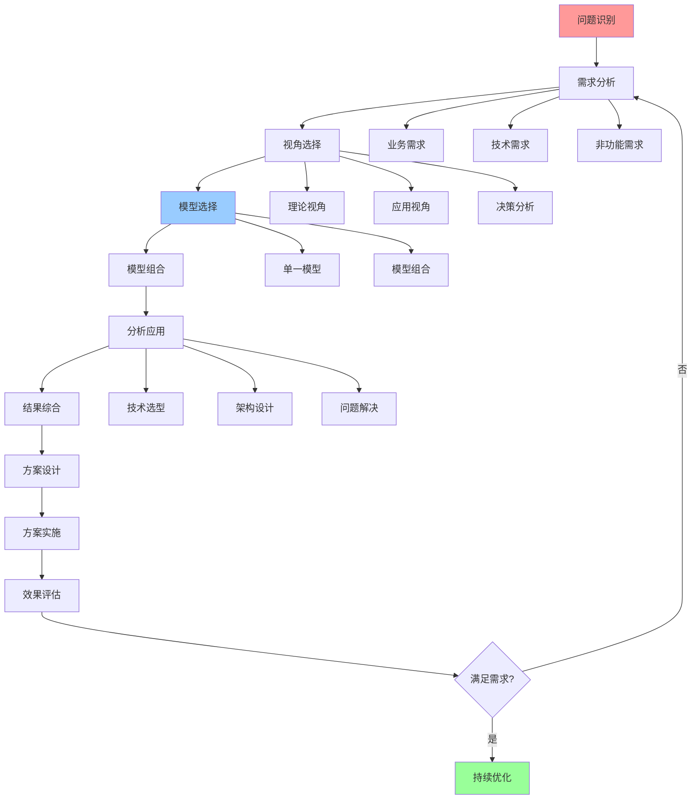
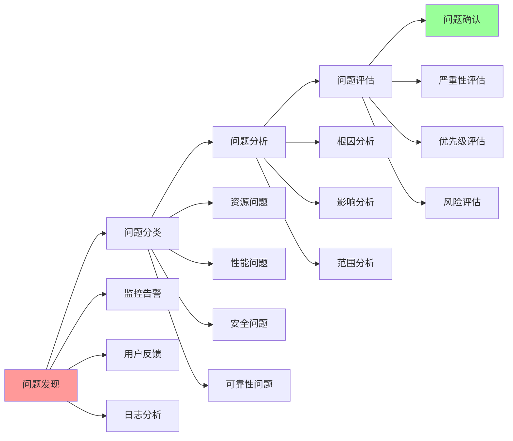
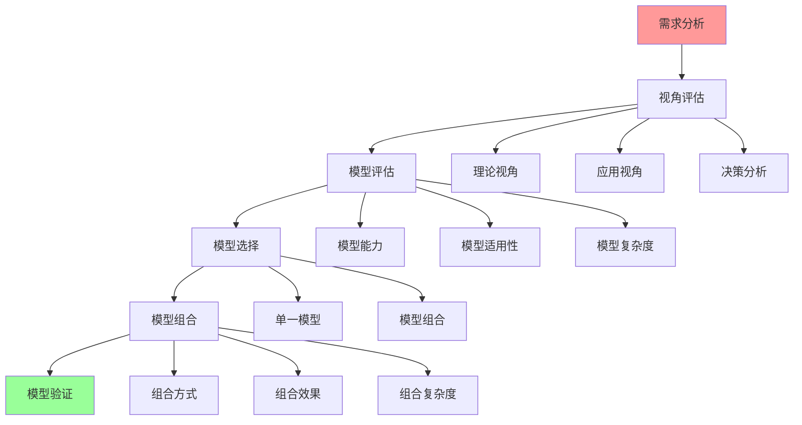
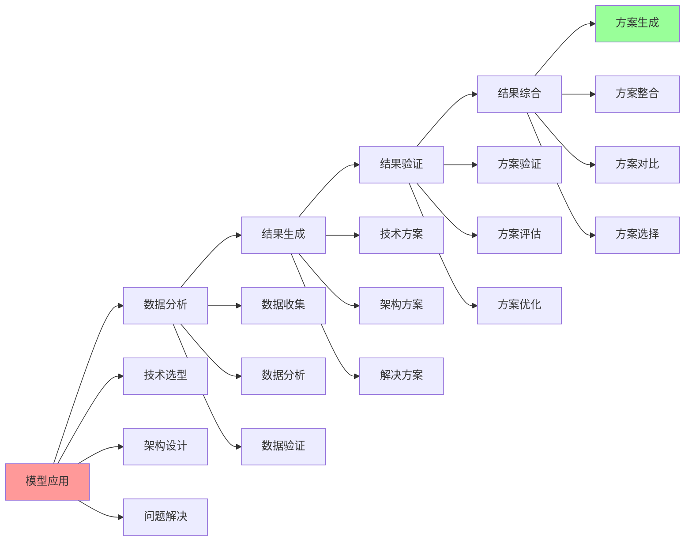

# 认知模型完整工作流

## 📑 目录

- [认知模型完整工作流](#认知模型完整工作流)
  - [📑 目录](#-目录)
  - [1 完整工作流全景](#1-完整工作流全景)
  - [2 问题识别工作流](#2-问题识别工作流)
  - [3 模型选择工作流](#3-模型选择工作流)
  - [4 分析应用工作流](#4-分析应用工作流)
  - [5 工作流检查点](#5-工作流检查点)
  - [6 工作流详细说明](#6-工作流详细说明)
    - [6.1 问题识别工作流详细说明](#61-问题识别工作流详细说明)
      - [6.1.1 问题发现](#611-问题发现)
      - [6.1.2 问题分类](#612-问题分类)
      - [6.1.3 问题分析](#613-问题分析)
    - [6.2 模型选择工作流详细说明](#62-模型选择工作流详细说明)
      - [6.2.1 需求分析](#621-需求分析)
      - [6.2.2 视角评估](#622-视角评估)
      - [6.2.3 模型选择](#623-模型选择)
    - [6.3 分析应用工作流详细说明](#63-分析应用工作流详细说明)
      - [6.3.1 模型应用](#631-模型应用)
      - [6.3.2 数据分析](#632-数据分析)
      - [6.3.3 结果综合](#633-结果综合)
  - [7 工作流实践案例](#7-工作流实践案例)
    - [7.1 案例1：容器运行时选型](#71-案例1容器运行时选型)
    - [7.2 案例2：微服务架构设计](#72-案例2微服务架构设计)
    - [7.3 案例3：性能问题解决](#73-案例3性能问题解决)
  - [8 工作流最佳实践](#8-工作流最佳实践)
    - [8.1 工作流使用原则](#81-工作流使用原则)
    - [8.2 工作流使用方法](#82-工作流使用方法)
    - [8.3 工作流使用注意事项](#83-工作流使用注意事项)
  - [9 工作流工具推荐](#9-工作流工具推荐)
  - [2025 年最新实践](#2025-年最新实践)
    - [认知模型完整工作流应用指南（2025）](#认知模型完整工作流应用指南2025)
  - [实际应用案例](#实际应用案例)
    - [案例 1：认知模型完整工作流应用（2025）](#案例-1认知模型完整工作流应用2025)

---

## 1 完整工作流全景



---

## 2 问题识别工作流



---

## 3 模型选择工作流



---

## 4 分析应用工作流



---

## 5 工作流检查点

| 检查点 | 阶段 | 检查内容 | 通过标准 | 推荐度 |
|--------|------|---------|---------|--------|
| **问题识别** | 问题识别 | 问题明确、问题分类、问题评估 | 问题清晰、可解决 | ⭐⭐⭐⭐⭐ |
| **需求分析** | 需求分析 | 需求完整、需求可行、需求优先级 | 需求明确、可实施 | ⭐⭐⭐⭐⭐ |
| **模型选择** | 模型选择 | 模型评估、模型选择、模型组合 | 模型合适、可应用 | ⭐⭐⭐⭐⭐ |
| **分析应用** | 分析应用 | 分析准确、结果有效、方案可行 | 分析正确、方案可行 | ⭐⭐⭐⭐⭐ |
| **方案实施** | 方案实施 | 实施计划、实施执行、实施验证 | 实施成功、效果良好 | ⭐⭐⭐⭐⭐ |
| **效果评估** | 效果评估 | 效果测量、效果分析、效果报告 | 效果满足预期 | ⭐⭐⭐⭐⭐ |

**推荐度说明**：

- **⭐⭐⭐⭐⭐**：强烈推荐
- **⭐⭐⭐⭐**：推荐
- **⭐⭐⭐**：可选

---

## 6 工作流详细说明

### 6.1 问题识别工作流详细说明

#### 6.1.1 问题发现

**方法**：

- **监控告警**：通过监控系统（Prometheus、Grafana）发现异常
- **用户反馈**：通过用户反馈（工单系统、用户调研）发现问题
- **日志分析**：通过日志分析（ELK、Loki）发现问题
- **性能分析**：通过性能分析（APM、性能测试）发现问题

**工具**：

- 监控系统：Prometheus、Grafana、Datadog
- 日志系统：ELK Stack、Loki、Splunk
- 可观测性工具：eBPF、OTLP、OpenTelemetry

**推荐度**：⭐⭐⭐⭐⭐

#### 6.1.2 问题分类

**分类维度**：

- **问题类型**：资源问题、性能问题、安全问题、可靠性问题
- **问题范围**：系统级、应用级、组件级
- **问题严重性**：严重、中等、轻微
- **问题紧急度**：紧急、重要、一般

**分类方法**：

- 使用问题解决方案矩阵进行分类
- 使用问题分类框架进行分类
- 使用问题分类工具进行分类

**推荐度**：⭐⭐⭐⭐⭐

#### 6.1.3 问题分析

**分析方法**：

- **根因分析**：使用 5 Why 分析、鱼骨图分析、故障树分析
- **影响分析**：分析问题对系统、业务、用户的影响
- **范围分析**：分析问题涉及的系统、组件、模块

**推荐模型**：

- **结构视角**：三类结构分析
- **调度视角**：调度问题分析
- **问题解决方案矩阵**：问题分类分析

**推荐度**：⭐⭐⭐⭐⭐

---

### 6.2 模型选择工作流详细说明

#### 6.2.1 需求分析

**分析内容**：

- **业务需求**：业务目标、业务价值、业务约束
- **技术需求**：技术目标、技术约束、技术标准
- **非功能需求**：性能需求、安全需求、可靠性需求

**分析方法**：

- **需求收集**：通过访谈、调研、文档分析收集需求
- **需求分析**：使用需求分析工具分析需求
- **需求验证**：验证需求的完整性和可行性

**推荐度**：⭐⭐⭐⭐⭐

#### 6.2.2 视角评估

**评估维度**：

- **视角能力**：视角的分析能力和适用性
- **视角适用性**：视角对问题的适用性
- **视角复杂度**：视角的学习曲线和使用复杂度

**评估方法**：

- **能力评估**：评估视角的分析能力和工具完整性
- **适用性评估**：评估视角对问题的适用性
- **复杂度评估**：评估视角的学习曲线和使用复杂度

**推荐度**：⭐⭐⭐⭐⭐

#### 6.2.3 模型选择

**选择标准**：

- **问题匹配**：模型必须能解决当前问题
- **能力匹配**：模型能力必须满足需求
- **复杂度匹配**：模型复杂度必须适合团队能力

**选择方法**：

- **模型评估**：评估模型的能力、适用性、复杂度
- **模型对比**：对比不同模型的优劣
- **模型选择**：基于评估和对比结果选择模型

**推荐度**：⭐⭐⭐⭐⭐

---

### 6.3 分析应用工作流详细说明

#### 6.3.1 模型应用

**应用方式**：

- **技术选型**：使用模型进行技术选型分析
- **架构设计**：使用模型进行架构设计分析
- **问题解决**：使用模型进行问题解决分析

**应用方法**：

- **模型使用**：按照模型的使用方法使用模型
- **工具使用**：使用模型提供的工具进行分析
- **结果生成**：生成分析结果和方案

**推荐度**：⭐⭐⭐⭐⭐

#### 6.3.2 数据分析

**分析内容**：

- **数据收集**：收集分析所需的数据
- **数据分析**：使用模型和工具分析数据
- **数据验证**：验证数据的准确性和完整性

**分析方法**：

- **数据收集**：从监控、日志、测试等渠道收集数据
- **数据分析**：使用模型和工具分析数据
- **数据验证**：验证数据的准确性和完整性

**推荐度**：⭐⭐⭐⭐⭐

#### 6.3.3 结果综合

**综合内容**：

- **方案整合**：整合不同模型的分析结果
- **方案对比**：对比不同方案的优劣
- **方案选择**：基于综合评估选择最佳方案

**综合方法**：

- **结果整合**：整合不同模型的分析结果
- **方案对比**：使用决策矩阵对比不同方案
- **方案选择**：基于综合评估选择最佳方案

**推荐度**：⭐⭐⭐⭐⭐

---

## 7 工作流实践案例

### 7.1 案例1：容器运行时选型

**场景**：选择适合的容器运行时

**工作流应用**：

1. **问题识别**：明确容器运行时选型的需求和约束
2. **需求分析**：分析性能、安全性、兼容性需求
3. **视角选择**：选择矩阵视角和结构视角
4. **模型选择**：选择矩阵视角和结构视角进行组合
5. **分析应用**：使用矩阵视角对比技术，使用结构视角分析架构
6. **结果综合**：综合矩阵对比和结构分析的结果
7. **方案设计**：设计容器运行时选型方案
8. **方案实施**：实施容器运行时选型方案
9. **效果评估**：评估容器运行时选型的效果

**效果**：成功选择最适合的容器运行时，平衡功能、性能、安全性

**推荐度**：⭐⭐⭐⭐⭐

### 7.2 案例2：微服务架构设计

**场景**：设计微服务架构

**工作流应用**：

1. **问题识别**：明确微服务架构设计的需求和约束
2. **需求分析**：分析可扩展性、可维护性、性能需求
3. **视角选择**：选择结构视角和范畴论视角
4. **模型选择**：选择结构视角和范畴论视角进行组合
5. **分析应用**：使用结构视角设计架构，使用范畴论视角分析关系
6. **结果综合**：综合结构设计和关系分析的结果
7. **方案设计**：设计微服务架构方案
8. **方案实施**：实施微服务架构方案
9. **效果评估**：评估微服务架构的效果

**效果**：成功设计优秀的微服务架构，平衡性能、一致性、可用性

**推荐度**：⭐⭐⭐⭐⭐

### 7.3 案例3：性能问题解决

**场景**：解决应用性能问题

**工作流应用**：

1. **问题识别**：通过监控告警发现性能问题
2. **需求分析**：分析性能需求和性能目标
3. **视角选择**：选择调度视角和矩阵视角
4. **模型选择**：选择调度视角和矩阵视角进行组合
5. **分析应用**：使用调度视角分析性能瓶颈，使用矩阵视角对比优化方案
6. **结果综合**：综合性能分析和方案对比的结果
7. **方案设计**：设计性能优化方案
8. **方案实施**：实施性能优化方案
9. **效果评估**：评估性能优化的效果

**效果**：成功解决性能问题，提升应用性能

**推荐度**：⭐⭐⭐⭐⭐

---

## 8 工作流最佳实践

### 8.1 工作流使用原则

**原则1：问题导向**:

- 根据问题类型选择合适的工作流
- 明确问题的本质和范围
- 关注问题的解决效果

**原则2：流程规范**:

- 严格按照工作流流程执行
- 确保每个阶段的质量
- 及时进行效果评估

**原则3：持续优化**:

- 根据实践效果优化工作流
- 积累工作流使用的经验
- 形成工作流使用的模式

**推荐度**：⭐⭐⭐⭐⭐

### 8.2 工作流使用方法

**方法1：标准流程**:

- 按照标准工作流流程执行
- 确保每个阶段的完整性
- 及时进行效果评估

**方法2：灵活调整**:

- 根据实际情况调整工作流
- 跳过不必要的阶段
- 增加必要的阶段

**方法3：迭代优化**:

- 根据实践效果优化工作流
- 迭代改进工作流流程
- 持续提升工作流效果

**推荐度**：⭐⭐⭐⭐⭐

### 8.3 工作流使用注意事项

**注意事项1：问题识别要准确**:

- 确保问题识别准确
- 明确问题的本质和范围
- 避免问题识别错误

**注意事项2：模型选择要合适**:

- 确保模型选择合适
- 明确模型的能力和适用性
- 避免模型选择错误

**注意事项3：结果综合要全面**:

- 确保结果综合全面
- 考虑所有相关因素
- 避免结果综合不完整

**推荐度**：⭐⭐⭐⭐⭐

---

## 9 工作流工具推荐

| 工具类型 | 推荐工具 | 使用场景 | 效果 | 复杂度 | 推荐度 |
|---------|---------|---------|------|--------|--------|
| **工作流工具** | Jira、Trello | 工作流管理 | 高 | 低 | ⭐⭐⭐⭐⭐ |
| **项目管理工具** | Asana、Monday | 项目管理 | 高 | 中 | ⭐⭐⭐⭐ |
| **协作工具** | Slack、Microsoft Teams | 团队协作 | 中 | 低 | ⭐⭐⭐⭐ |
| **文档工具** | Confluence、Notion | 文档管理 | 中 | 低 | ⭐⭐⭐⭐⭐ |
| **可视化工具** | Mermaid、Draw.io | 工作流可视化 | 中 | 低 | ⭐⭐⭐⭐⭐ |

**推荐度说明**：

- **⭐⭐⭐⭐⭐**：强烈推荐
- **⭐⭐⭐⭐**：推荐
- **⭐⭐⭐**：可选

---

## 2025 年最新实践

### 认知模型完整工作流应用指南（2025）

**2025 年趋势**：认知模型完整工作流在问题解决、流程优化、自动化应用中的深度应用

**实践要点**：

- **工作流设计**：根据问题类型设计认知模型工作流
- **工作流执行**：按照工作流执行问题解决过程
- **工作流优化**：基于实践效果优化工作流

**代码示例**：

```python
# 2025 年认知模型完整工作流工具
class CognitiveModelsWorkflowTool:
    def __init__(self):
        self.designer = WorkflowDesigner()
        self.executor = WorkflowExecutor()
        self.optimizer = WorkflowOptimizer()

    def design_workflow(self, problem):
        """工作流设计"""
        return self.designer.design(problem)

    def execute_workflow(self, workflow):
        """工作流执行"""
        return self.executor.execute(workflow)

    def optimize_workflow(self, workflow, experience):
        """工作流优化"""
        return self.optimizer.optimize(workflow, experience)
```

## 实际应用案例

### 案例 1：认知模型完整工作流应用（2025）

**场景**：使用完整工作流解决技术选型问题

**实现方案**：

```python
# 认知模型完整工作流应用
tool = CognitiveModelsWorkflowTool()

# 工作流设计
problem = Problem(type="technology-selection", domain="runtime")
workflow = tool.design_workflow(problem)

# 工作流执行
result = tool.execute_workflow(workflow)

# 工作流优化
experience = Experience(previous_cases=[...])
optimized = tool.optimize_workflow(workflow, experience)
```

**效果**：

- 工作流设计：基于问题类型设计工作流，提高工作流适用性
- 工作流执行：按照工作流执行，保证问题解决质量
- 工作流优化：基于实践经验优化，提高工作流效率

---

**最后更新**：2025-11-15
**文档状态**：✅ 完整 | 📊 包含认知模型完整工作流、详细说明、实践案例、最佳实践 | 🎯 生产就绪
**维护者**：项目团队
