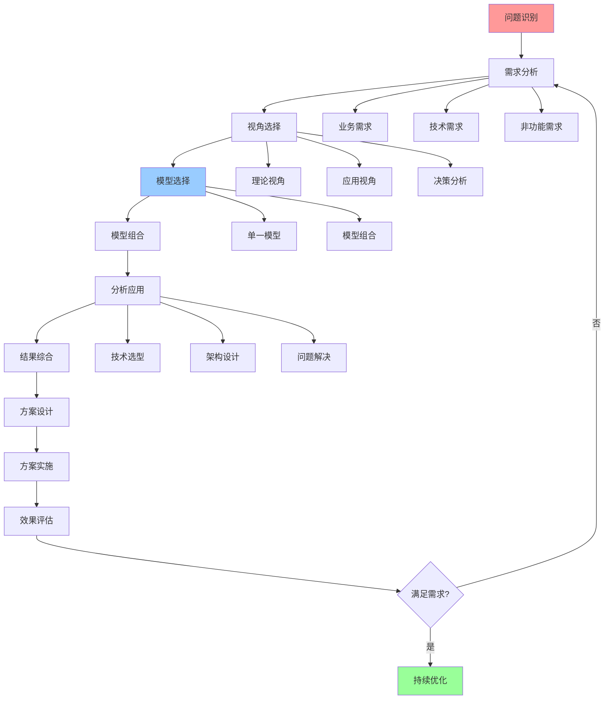
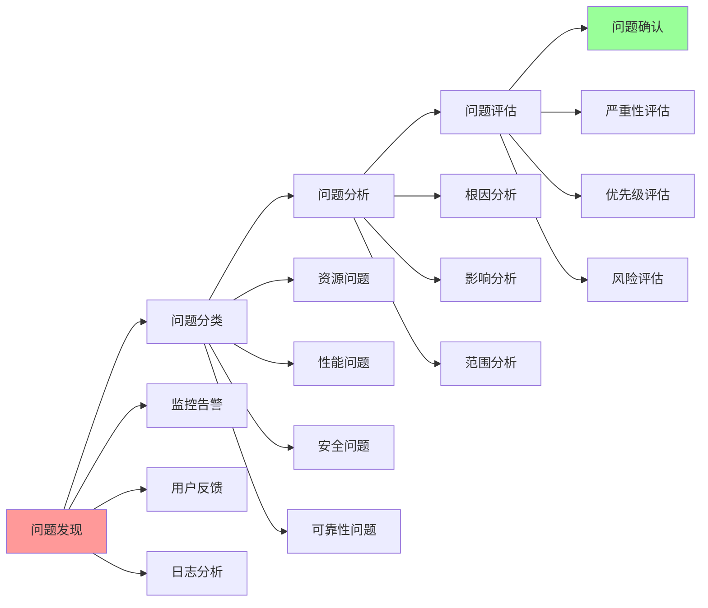
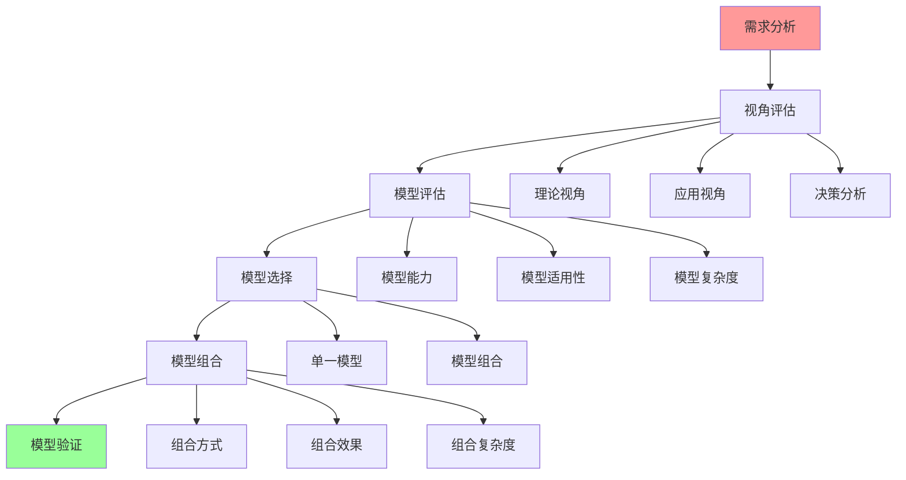
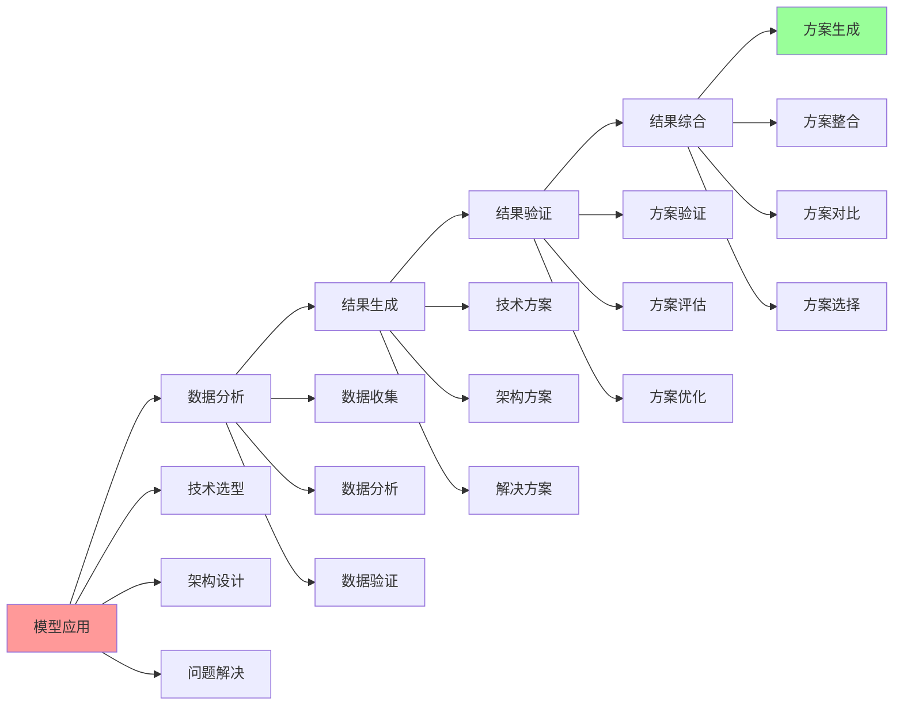

# 认知模型完整工作流

## 📑 目录

- [认知模型完整工作流](#认知模型完整工作流)
  - [📑 目录](#-目录)
  - [1 完整工作流全景](#1-完整工作流全景)
  - [2 问题识别工作流](#2-问题识别工作流)
  - [3 模型选择工作流](#3-模型选择工作流)
  - [4 分析应用工作流](#4-分析应用工作流)

---

## 1 完整工作流全景

---

## 2 问题识别工作流

---

## 3 模型选择工作流

---

## 4 分析应用工作流

---

## 5 工作流检查点

| 检查点 | 阶段 | 检查内容 | 通过标准 | 推荐度 |
|--------|------|---------|---------|--------|
| **问题识别** | 问题识别 | 问题明确、问题分类、问题评估 | 问题清晰、可解决 | ⭐⭐⭐⭐⭐ |
| **需求分析** | 需求分析 | 需求完整、需求可行、需求优先级 | 需求明确、可实施 | ⭐⭐⭐⭐⭐ |
| **模型选择** | 模型选择 | 模型评估、模型选择、模型组合 | 模型合适、可应用 | ⭐⭐⭐⭐⭐ |
| **分析应用** | 分析应用 | 分析准确、结果有效、方案可行 | 分析正确、方案可行 | ⭐⭐⭐⭐⭐ |
| **方案实施** | 方案实施 | 实施计划、实施执行、实施验证 | 实施成功、效果良好 | ⭐⭐⭐⭐⭐ |
| **效果评估** | 效果评估 | 效果测量、效果分析、效果报告 | 效果满足预期 | ⭐⭐⭐⭐⭐ |

**推荐度说明**：
- **⭐⭐⭐⭐⭐**：强烈推荐
- **⭐⭐⭐⭐**：推荐
- **⭐⭐⭐**：可选

---

**最后更新**：2025-11-07
**文档状态**：✅ 完整 | 📊 包含认知模型完整工作流 | 🎯 生产就绪
**维护者**：项目团队
