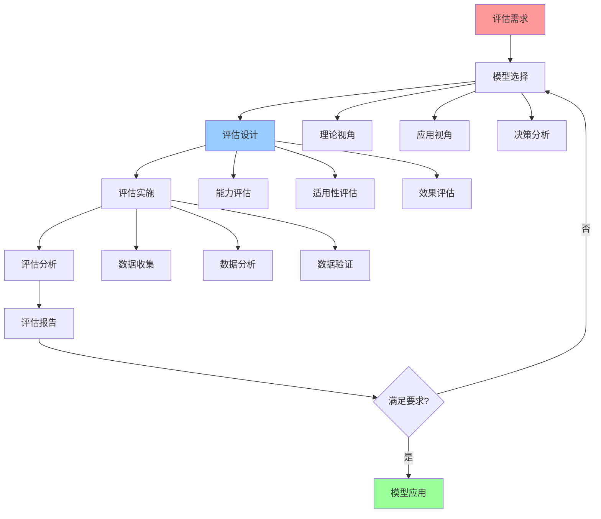

# 认知模型评估方法

## 📑 目录

- [认知模型评估方法](#认知模型评估方法)
  - [📑 目录](#-目录)
  - [1 模型评估全景](#1-模型评估全景)
  - [2 模型能力评估](#2-模型能力评估)
  - [3 模型适用性评估](#3-模型适用性评估)
  - [4 模型效果评估](#4-模型效果评估)
  - [5 模型评估检查清单](#5-模型评估检查清单)
  - [6 模型评估详细说明](#6-模型评估详细说明)
    - [6.1 模型能力评估详细说明](#61-模型能力评估详细说明)
      - [6.1.1 功能完整性评估](#611-功能完整性评估)
      - [6.1.2 分析准确性评估](#612-分析准确性评估)
    - [6.2 模型适用性评估详细说明](#62-模型适用性评估详细说明)
      - [6.2.1 场景匹配评估](#621-场景匹配评估)
      - [6.2.2 问题匹配评估](#622-问题匹配评估)
    - [6.3 模型效果评估详细说明](#63-模型效果评估详细说明)
      - [6.3.1 决策质量评估](#631-决策质量评估)
      - [6.3.2 问题解决评估](#632-问题解决评估)
  - [7 模型评估实践案例](#7-模型评估实践案例)
    - [7.1 案例1：矩阵视角评估](#71-案例1矩阵视角评估)
    - [7.2 案例2：结构视角评估](#72-案例2结构视角评估)
  - [8 模型评估最佳实践](#8-模型评估最佳实践)
    - [8.1 评估设计原则](#81-评估设计原则)
    - [8.2 评估实施方法](#82-评估实施方法)
    - [8.3 评估使用注意事项](#83-评估使用注意事项)
  - [9 模型评估工具推荐](#9-模型评估工具推荐)

---

## 1 模型评估全景



---

## 2 模型能力评估

| 评估维度 | 评估内容 | 评估方法 | 评估指标 | 推荐度 |
|---------|---------|---------|---------|--------|
| **功能完整性** | 功能覆盖、功能深度 | 功能测试、功能分析 | 功能覆盖率 | ⭐⭐⭐⭐⭐ |
| **分析准确性** | 分析准确、分析深度 | 准确性测试、准确性分析 | 准确率 | ⭐⭐⭐⭐⭐ |
| **工具完整性** | 工具覆盖、工具易用 | 工具测试、工具分析 | 工具覆盖率 | ⭐⭐⭐⭐ |
| **文档完整性** | 文档覆盖、文档质量 | 文档审查、文档分析 | 文档覆盖率 | ⭐⭐⭐⭐ |
| **生态支持** | 社区支持、工具支持 | 生态调研、生态分析 | 生态支持度 | ⭐⭐⭐⭐ |
| **更新维护** | 更新频率、维护质量 | 更新跟踪、维护分析 | 更新频率 | ⭐⭐⭐ |

**推荐度说明**：

- **⭐⭐⭐⭐⭐**：强烈推荐
- **⭐⭐⭐⭐**：推荐
- **⭐⭐⭐**：可选

---

## 3 模型适用性评估

| 评估维度 | 评估内容 | 评估方法 | 评估指标 | 推荐度 |
|---------|---------|---------|---------|--------|
| **场景匹配** | 场景适用、场景覆盖 | 场景测试、场景分析 | 场景匹配度 | ⭐⭐⭐⭐⭐ |
| **问题匹配** | 问题适用、问题覆盖 | 问题测试、问题分析 | 问题匹配度 | ⭐⭐⭐⭐⭐ |
| **团队匹配** | 团队能力、团队经验 | 团队评估、团队分析 | 团队匹配度 | ⭐⭐⭐⭐ |
| **复杂度匹配** | 复杂度合适、学习曲线 | 复杂度评估、学习分析 | 复杂度匹配度 | ⭐⭐⭐⭐ |
| **资源匹配** | 资源需求、资源可用 | 资源评估、资源分析 | 资源匹配度 | ⭐⭐⭐⭐ |
| **时间匹配** | 时间需求、时间可用 | 时间评估、时间分析 | 时间匹配度 | ⭐⭐⭐ |

**推荐度说明**：

- **⭐⭐⭐⭐⭐**：强烈推荐
- **⭐⭐⭐⭐**：推荐
- **⭐⭐⭐**：可选

---

## 4 模型效果评估

| 评估维度 | 评估内容 | 评估方法 | 评估指标 | 推荐度 |
|---------|---------|---------|---------|--------|
| **决策质量** | 决策准确、决策有效 | 决策测试、决策分析 | 决策准确率 | ⭐⭐⭐⭐⭐ |
| **问题解决** | 问题解决、解决效果 | 问题测试、效果分析 | 问题解决率 | ⭐⭐⭐⭐⭐ |
| **效率提升** | 效率提升、时间节省 | 效率测试、效率分析 | 效率提升率 | ⭐⭐⭐⭐ |
| **成本降低** | 成本降低、成本优化 | 成本测试、成本分析 | 成本降低率 | ⭐⭐⭐⭐ |
| **质量提升** | 质量提升、质量改善 | 质量测试、质量分析 | 质量提升率 | ⭐⭐⭐⭐ |
| **用户满意度** | 用户满意、用户反馈 | 用户调研、用户分析 | 用户满意度 | ⭐⭐⭐⭐ |

**推荐度说明**：

- **⭐⭐⭐⭐⭐**：强烈推荐
- **⭐⭐⭐⭐**：推荐
- **⭐⭐⭐**：可选

---

## 5 模型评估检查清单

| 检查项 | 检查内容 | 重要性 | 推荐度 |
|--------|---------|--------|--------|
| **评估需求** | 评估目标、评估范围、评估标准 | 极高 | ⭐⭐⭐⭐⭐ |
| **模型选择** | 模型评估、模型选择、模型验证 | 高 | ⭐⭐⭐⭐⭐ |
| **评估设计** | 评估方法、评估指标、评估流程 | 高 | ⭐⭐⭐⭐⭐ |
| **评估实施** | 数据收集、数据分析、数据验证 | 高 | ⭐⭐⭐⭐⭐ |
| **评估分析** | 结果分析、结果验证、结果报告 | 中 | ⭐⭐⭐⭐ |
| **模型应用** | 模型应用、效果评估、持续优化 | 中 | ⭐⭐⭐⭐ |

**推荐度说明**：

- **⭐⭐⭐⭐⭐**：强烈推荐
- **⭐⭐⭐⭐**：推荐
- **⭐⭐⭐**：可选

---

## 6 模型评估详细说明

### 6.1 模型能力评估详细说明

#### 6.1.1 功能完整性评估

**评估内容**：

- **功能覆盖**：模型功能的覆盖范围和覆盖深度
- **功能深度**：模型功能的深入程度和详细程度
- **功能完整性**：模型功能的完整性和一致性

**评估方法**：

- **功能测试**：通过功能测试验证模型功能
- **功能分析**：通过功能分析评估模型功能
- **功能对比**：通过功能对比评估模型功能

**评估指标**：

- **功能覆盖率**：模型功能覆盖的百分比
- **功能完整度**：模型功能完整的程度
- **功能一致性**：模型功能一致的程度

**推荐度**：⭐⭐⭐⭐⭐

#### 6.1.2 分析准确性评估

**评估内容**：

- **分析准确**：模型分析的准确性和可靠性
- **分析深度**：模型分析的深入程度和详细程度
- **分析有效性**：模型分析的有效性和实用性

**评估方法**：

- **准确性测试**：通过准确性测试验证模型分析
- **准确性分析**：通过准确性分析评估模型分析
- **准确性对比**：通过准确性对比评估模型分析

**评估指标**：

- **准确率**：模型分析的准确率
- **精确度**：模型分析的精确度
- **召回率**：模型分析的召回率

**推荐度**：⭐⭐⭐⭐⭐

---

### 6.2 模型适用性评估详细说明

#### 6.2.1 场景匹配评估

**评估内容**：

- **场景适用**：模型对场景的适用性和匹配度
- **场景覆盖**：模型对场景的覆盖范围和覆盖深度
- **场景匹配度**：模型与场景的匹配程度

**评估方法**：

- **场景测试**：通过场景测试验证模型适用性
- **场景分析**：通过场景分析评估模型适用性
- **场景对比**：通过场景对比评估模型适用性

**评估指标**：

- **场景匹配度**：模型与场景的匹配程度
- **场景覆盖率**：模型对场景的覆盖百分比
- **场景适用度**：模型对场景的适用程度

**推荐度**：⭐⭐⭐⭐⭐

#### 6.2.2 问题匹配评估

**评估内容**：

- **问题适用**：模型对问题的适用性和匹配度
- **问题覆盖**：模型对问题的覆盖范围和覆盖深度
- **问题匹配度**：模型与问题的匹配程度

**评估方法**：

- **问题测试**：通过问题测试验证模型适用性
- **问题分析**：通过问题分析评估模型适用性
- **问题对比**：通过问题对比评估模型适用性

**评估指标**：

- **问题匹配度**：模型与问题的匹配程度
- **问题覆盖率**：模型对问题的覆盖百分比
- **问题适用度**：模型对问题的适用程度

**推荐度**：⭐⭐⭐⭐⭐

---

### 6.3 模型效果评估详细说明

#### 6.3.1 决策质量评估

**评估内容**：

- **决策准确**：模型决策的准确性和可靠性
- **决策有效**：模型决策的有效性和实用性
- **决策质量**：模型决策的质量和水平

**评估方法**：

- **决策测试**：通过决策测试验证模型决策
- **决策分析**：通过决策分析评估模型决策
- **决策对比**：通过决策对比评估模型决策

**评估指标**：

- **决策准确率**：模型决策的准确率
- **决策有效率**：模型决策的有效率
- **决策质量分**：模型决策的质量分数

**推荐度**：⭐⭐⭐⭐⭐

#### 6.3.2 问题解决评估

**评估内容**：

- **问题解决**：模型对问题的解决能力和效果
- **解决效果**：模型解决问题的效果和质量
- **解决效率**：模型解决问题的效率和速度

**评估方法**：

- **问题测试**：通过问题测试验证模型解决能力
- **效果分析**：通过效果分析评估模型解决效果
- **效率分析**：通过效率分析评估模型解决效率

**评估指标**：

- **问题解决率**：模型解决问题的百分比
- **解决效果分**：模型解决问题的效果分数
- **解决效率分**：模型解决问题的效率分数

**推荐度**：⭐⭐⭐⭐⭐

---

## 7 模型评估实践案例

### 7.1 案例1：矩阵视角评估

**评估目标**：评估矩阵视角的能力、适用性、效果

**评估流程**：

1. **能力评估**：
   - 功能完整性：评估矩阵视角的功能覆盖和功能深度
   - 分析准确性：评估矩阵视角的分析准确性和可靠性
   - 工具完整性：评估矩阵视角的工具覆盖和工具易用性

2. **适用性评估**：
   - 场景匹配：评估矩阵视角对技术选型场景的适用性
   - 问题匹配：评估矩阵视角对技术选型问题的适用性
   - 团队匹配：评估矩阵视角对团队能力的匹配度

3. **效果评估**：
   - 决策质量：评估矩阵视角在技术选型中的决策质量
   - 问题解决：评估矩阵视角在技术选型中的问题解决能力
   - 效率提升：评估矩阵视角在技术选型中的效率提升

**评估结果**：

- **能力评估**：功能完整性高、分析准确性高、工具完整性中
- **适用性评估**：场景匹配度高、问题匹配度高、团队匹配度中
- **效果评估**：决策质量高、问题解决能力强、效率提升明显

**推荐度**：⭐⭐⭐⭐⭐

### 7.2 案例2：结构视角评估

**评估目标**：评估结构视角的能力、适用性、效果

**评估流程**：

1. **能力评估**：
   - 功能完整性：评估结构视角的功能覆盖和功能深度
   - 分析准确性：评估结构视角的分析准确性和可靠性
   - 工具完整性：评估结构视角的工具覆盖和工具易用性

2. **适用性评估**：
   - 场景匹配：评估结构视角对架构设计场景的适用性
   - 问题匹配：评估结构视角对架构设计问题的适用性
   - 团队匹配：评估结构视角对团队能力的匹配度

3. **效果评估**：
   - 决策质量：评估结构视角在架构设计中的决策质量
   - 问题解决：评估结构视角在架构设计中的问题解决能力
   - 质量提升：评估结构视角在架构设计中的质量提升

**评估结果**：

- **能力评估**：功能完整性高、分析准确性高、工具完整性中
- **适用性评估**：场景匹配度高、问题匹配度高、团队匹配度中
- **效果评估**：决策质量高、问题解决能力强、质量提升明显

**推荐度**：⭐⭐⭐⭐⭐

---

## 8 模型评估最佳实践

### 8.1 评估设计原则

**原则1：全面性**:

- 评估要全面覆盖能力、适用性、效果
- 评估要考虑多个维度和多个指标
- 评估要综合考虑定量和定性指标

**原则2：客观性**:

- 评估要客观公正，避免主观偏见
- 评估要基于数据和事实
- 评估要使用标准化的评估方法

**原则3：实用性**:

- 评估要实用有效，能够指导实践
- 评估要考虑实际应用场景
- 评估要提供可操作的建议

**推荐度**：⭐⭐⭐⭐⭐

### 8.2 评估实施方法

**方法1：标准化评估**:

- 使用标准化的评估方法和指标
- 确保评估的一致性和可比性
- 提供标准化的评估报告

**方法2：多维度评估**:

- 从多个维度评估模型
- 综合考虑定量和定性指标
- 提供多维度的评估结果

**方法3：持续评估**:

- 持续跟踪和评估模型效果
- 根据实践效果调整评估方法
- 持续改进评估质量

**推荐度**：⭐⭐⭐⭐⭐

### 8.3 评估使用注意事项

**注意事项1：评估要全面**:

- 不要只评估单一维度
- 要综合考虑多个维度
- 要提供全面的评估结果

**注意事项2：评估要客观**:

- 不要有主观偏见
- 要基于数据和事实
- 要使用标准化的评估方法

**注意事项3：评估要实用**:

- 不要只做理论评估
- 要考虑实际应用场景
- 要提供可操作的建议

**推荐度**：⭐⭐⭐⭐⭐

---

## 9 模型评估工具推荐

| 工具类型 | 推荐工具 | 使用场景 | 效果 | 复杂度 | 推荐度 |
|---------|---------|---------|------|--------|--------|
| **评估工具** | Excel、Google Sheets | 数据评估 | 高 | 低 | ⭐⭐⭐⭐⭐ |
| **分析工具** | Python、R | 数据分析 | 高 | 中 | ⭐⭐⭐⭐ |
| **可视化工具** | Tableau、Power BI | 数据可视化 | 高 | 中 | ⭐⭐⭐⭐ |
| **统计工具** | SPSS、SAS | 统计分析 | 高 | 高 | ⭐⭐⭐ |
| **文档工具** | Markdown、LaTeX | 评估报告 | 中 | 低 | ⭐⭐⭐⭐⭐ |

**推荐度说明**：

- **⭐⭐⭐⭐⭐**：强烈推荐
- **⭐⭐⭐⭐**：推荐
- **⭐⭐⭐**：可选

---

## 2025 年最新实践

### 认知模型评估方法应用指南（2025）

**2025 年趋势**：认知模型评估方法在模型选择、效果评估、持续优化中的深度应用

**实践要点**：

- **评估设计**：使用系统化方法设计认知模型评估方案
- **评估执行**：按照评估方案执行评估过程
- **评估优化**：基于评估结果优化模型使用

**代码示例**：

```python
# 2025 年认知模型评估方法工具
class CognitiveModelsEvaluationTool:
    def __init__(self):
        self.designer = EvaluationDesigner()
        self.executor = EvaluationExecutor()
        self.optimizer = ModelOptimizer()

    def design_evaluation(self, model, criteria):
        """评估设计"""
        return self.designer.design(model, criteria)

    def execute_evaluation(self, evaluation_plan):
        """评估执行"""
        return self.executor.execute(evaluation_plan)

    def optimize_model(self, evaluation_result):
        """模型优化"""
        return self.optimizer.optimize(evaluation_result)
```

## 实际应用案例

### 案例 1：认知模型评估方法应用（2025）

**场景**：使用评估方法评估认知模型效果

**实现方案**：

```python
# 认知模型评估方法应用
tool = CognitiveModelsEvaluationTool()

# 评估设计
model = CognitiveModel(type="matrix-perspective")
criteria = EvaluationCriteria(accuracy=..., efficiency=...)
plan = tool.design_evaluation(model, criteria)

# 评估执行
result = tool.execute_evaluation(plan)

# 模型优化
optimized = tool.optimize_model(result)
```

**效果**：

- 评估设计：系统化设计评估方案，提高评估质量
- 评估执行：按照方案执行评估，保证评估准确性
- 模型优化：基于评估结果优化，提高模型效果

---

**最后更新**：2025-11-15
**文档状态**：✅ 完整 | 📊 包含认知模型评估方法、详细说明、实践案例、最佳实践 | 🎯 生产就绪
**维护者**：项目团队
