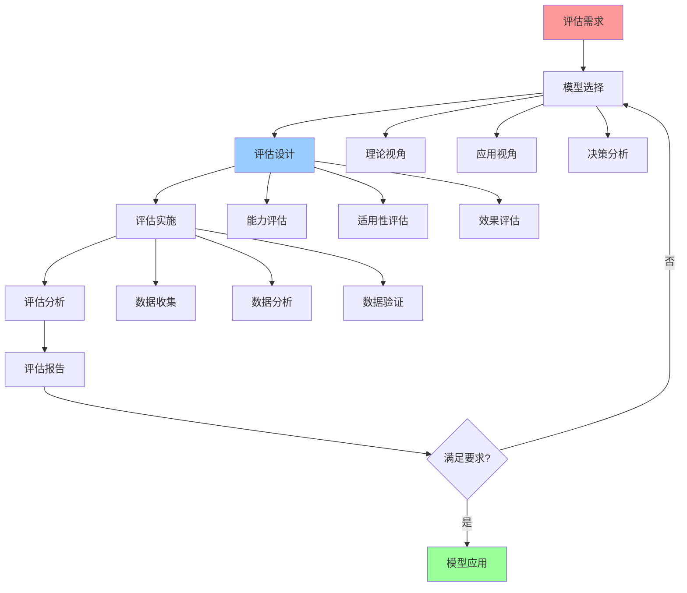

# 认知模型评估方法

## 📑 目录

- [认知模型评估方法](#认知模型评估方法)
  - [📑 目录](#-目录)
  - [1 模型评估全景](#1-模型评估全景)
  - [2 模型能力评估](#2-模型能力评估)
  - [3 模型适用性评估](#3-模型适用性评估)
  - [4 模型效果评估](#4-模型效果评估)

---

## 1 模型评估全景

---

## 2 模型能力评估

| 评估维度 | 评估内容 | 评估方法 | 评估指标 | 推荐度 |
|---------|---------|---------|---------|--------|
| **功能完整性** | 功能覆盖、功能深度 | 功能测试、功能分析 | 功能覆盖率 | ⭐⭐⭐⭐⭐ |
| **分析准确性** | 分析准确、分析深度 | 准确性测试、准确性分析 | 准确率 | ⭐⭐⭐⭐⭐ |
| **工具完整性** | 工具覆盖、工具易用 | 工具测试、工具分析 | 工具覆盖率 | ⭐⭐⭐⭐ |
| **文档完整性** | 文档覆盖、文档质量 | 文档审查、文档分析 | 文档覆盖率 | ⭐⭐⭐⭐ |
| **生态支持** | 社区支持、工具支持 | 生态调研、生态分析 | 生态支持度 | ⭐⭐⭐⭐ |
| **更新维护** | 更新频率、维护质量 | 更新跟踪、维护分析 | 更新频率 | ⭐⭐⭐ |

**推荐度说明**：
- **⭐⭐⭐⭐⭐**：强烈推荐
- **⭐⭐⭐⭐**：推荐
- **⭐⭐⭐**：可选

---

## 3 模型适用性评估

| 评估维度 | 评估内容 | 评估方法 | 评估指标 | 推荐度 |
|---------|---------|---------|---------|--------|
| **场景匹配** | 场景适用、场景覆盖 | 场景测试、场景分析 | 场景匹配度 | ⭐⭐⭐⭐⭐ |
| **问题匹配** | 问题适用、问题覆盖 | 问题测试、问题分析 | 问题匹配度 | ⭐⭐⭐⭐⭐ |
| **团队匹配** | 团队能力、团队经验 | 团队评估、团队分析 | 团队匹配度 | ⭐⭐⭐⭐ |
| **复杂度匹配** | 复杂度合适、学习曲线 | 复杂度评估、学习分析 | 复杂度匹配度 | ⭐⭐⭐⭐ |
| **资源匹配** | 资源需求、资源可用 | 资源评估、资源分析 | 资源匹配度 | ⭐⭐⭐⭐ |
| **时间匹配** | 时间需求、时间可用 | 时间评估、时间分析 | 时间匹配度 | ⭐⭐⭐ |

**推荐度说明**：
- **⭐⭐⭐⭐⭐**：强烈推荐
- **⭐⭐⭐⭐**：推荐
- **⭐⭐⭐**：可选

---

## 4 模型效果评估

| 评估维度 | 评估内容 | 评估方法 | 评估指标 | 推荐度 |
|---------|---------|---------|---------|--------|
| **决策质量** | 决策准确、决策有效 | 决策测试、决策分析 | 决策准确率 | ⭐⭐⭐⭐⭐ |
| **问题解决** | 问题解决、解决效果 | 问题测试、效果分析 | 问题解决率 | ⭐⭐⭐⭐⭐ |
| **效率提升** | 效率提升、时间节省 | 效率测试、效率分析 | 效率提升率 | ⭐⭐⭐⭐ |
| **成本降低** | 成本降低、成本优化 | 成本测试、成本分析 | 成本降低率 | ⭐⭐⭐⭐ |
| **质量提升** | 质量提升、质量改善 | 质量测试、质量分析 | 质量提升率 | ⭐⭐⭐⭐ |
| **用户满意度** | 用户满意、用户反馈 | 用户调研、用户分析 | 用户满意度 | ⭐⭐⭐⭐ |

**推荐度说明**：
- **⭐⭐⭐⭐⭐**：强烈推荐
- **⭐⭐⭐⭐**：推荐
- **⭐⭐⭐**：可选

---

## 5 模型评估检查清单

| 检查项 | 检查内容 | 重要性 | 推荐度 |
|--------|---------|--------|--------|
| **评估需求** | 评估目标、评估范围、评估标准 | 极高 | ⭐⭐⭐⭐⭐ |
| **模型选择** | 模型评估、模型选择、模型验证 | 高 | ⭐⭐⭐⭐⭐ |
| **评估设计** | 评估方法、评估指标、评估流程 | 高 | ⭐⭐⭐⭐⭐ |
| **评估实施** | 数据收集、数据分析、数据验证 | 高 | ⭐⭐⭐⭐⭐ |
| **评估分析** | 结果分析、结果验证、结果报告 | 中 | ⭐⭐⭐⭐ |
| **模型应用** | 模型应用、效果评估、持续优化 | 中 | ⭐⭐⭐⭐ |

**推荐度说明**：
- **⭐⭐⭐⭐⭐**：强烈推荐
- **⭐⭐⭐⭐**：推荐
- **⭐⭐⭐**：可选

---

**最后更新**：2025-11-07
**文档状态**：✅ 完整 | 📊 包含认知模型评估方法 | 🎯 生产就绪
**维护者**：项目团队
