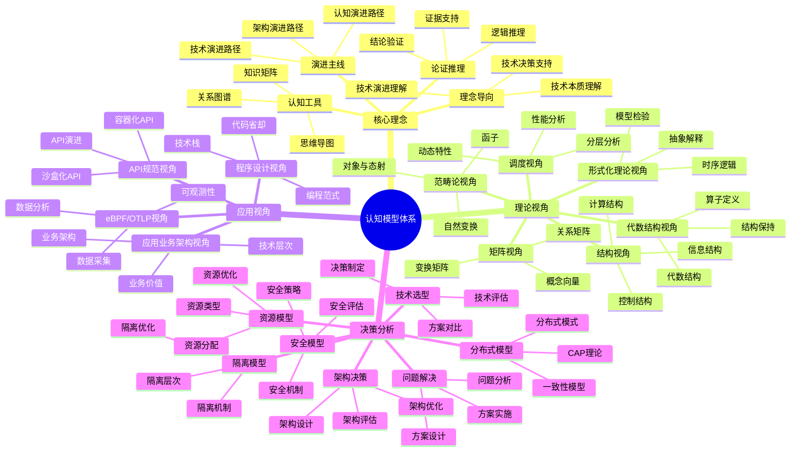

# 认知模型实践总结

## 📑 目录

- [认知模型实践总结](#认知模型实践总结)
  - [📑 目录](#-目录)
  - [1 认知模型全景总结](#1-认知模型全景总结)
  - [2 理论视角总结](#2-理论视角总结)
  - [3 应用视角总结](#3-应用视角总结)
  - [4 决策分析总结](#4-决策分析总结)
  - [5 认知模型使用建议](#5-认知模型使用建议)
  - [6 认知模型使用建议详细说明](#6-认知模型使用建议详细说明)
    - [6.1 快速认知建议](#61-快速认知建议)
    - [6.2 技术选型建议](#62-技术选型建议)
    - [6.3 架构设计建议](#63-架构设计建议)
  - [7 认知模型使用实践案例](#7-认知模型使用实践案例)
    - [7.1 案例1：技术选型实践](#71-案例1技术选型实践)
    - [7.2 案例2：架构设计实践](#72-案例2架构设计实践)
  - [8 认知模型使用最佳实践](#8-认知模型使用最佳实践)
    - [8.1 使用原则](#81-使用原则)
    - [8.2 使用方法](#82-使用方法)
    - [8.3 使用注意事项](#83-使用注意事项)
  - [9 认知模型使用工具推荐](#9-认知模型使用工具推荐)
  - [2025 年最新实践](#2025-年最新实践)
    - [认知模型实践总结应用指南（2025）](#认知模型实践总结应用指南2025)
  - [实际应用案例](#实际应用案例)
    - [案例 1：认知模型实践总结应用（2025）](#案例-1认知模型实践总结应用2025)

---

## 1 认知模型全景总结



---

## 2 理论视角总结

| 视角 | 核心工具 | 适用场景 | 优势 | 学习曲线 | 推荐度 |
|------|---------|---------|------|---------|--------|
| **矩阵视角** | 向量、矩阵 | 技术选型、场景转换 | 直观、易理解 | 中 | ⭐⭐⭐⭐⭐ |
| **结构视角** | 三类结构 | 技术本质理解、架构设计 | 深入理解本质 | 中 | ⭐⭐⭐⭐⭐ |
| **调度视角** | 分层、图、动态系统 | 调度优化、性能分析 | 专门针对调度 | 中 | ⭐⭐⭐⭐ |
| **代数结构视角** | 算子、代数结构 | 操作组合、结构保持 | 严格的数学基础 | 高 | ⭐⭐⭐⭐ |
| **范畴论视角** | 对象、态射、函子 | 系统结构、关系分析 | 统一的数学框架 | 极高 | ⭐⭐⭐ |
| **形式化理论视角** | 时序逻辑、模型检验 | 系统验证、形式化证明 | 严格的验证方法 | 高 | ⭐⭐⭐ |

**推荐度说明**：

- **⭐⭐⭐⭐⭐**：强烈推荐
- **⭐⭐⭐⭐**：推荐
- **⭐⭐⭐**：可选

---

## 3 应用视角总结

| 视角 | 核心内容 | 适用场景 | 优势 | 学习曲线 | 推荐度 |
|------|---------|---------|------|---------|--------|
| **eBPF/OTLP视角** | 可观测性、数据采集 | 监控运维、性能分析 | 全面可观测性 | 中 | ⭐⭐⭐⭐⭐ |
| **程序设计视角** | 代码省却、编程范式 | 应用开发、代码优化 | 代码省却95.7% | 中 | ⭐⭐⭐⭐⭐ |
| **应用业务架构视角** | 技术层次、业务架构 | 架构设计、业务分析 | 业务价值分析 | 中 | ⭐⭐⭐⭐⭐ |
| **API规范视角** | 容器化API、沙盒化API | API设计、API演进 | API标准化 | 中 | ⭐⭐⭐⭐ |

**推荐度说明**：

- **⭐⭐⭐⭐⭐**：强烈推荐
- **⭐⭐⭐⭐**：推荐
- **⭐⭐⭐**：可选

---

## 4 决策分析总结

| 模型 | 核心内容 | 适用场景 | 优势 | 学习曲线 | 推荐度 |
|------|---------|---------|------|---------|--------|
| **资源模型** | 资源类型、资源分配 | 资源管理、资源优化 | 资源优化 | 中 | ⭐⭐⭐⭐⭐ |
| **隔离模型** | 隔离层次、隔离机制 | 隔离设计、安全设计 | 隔离优化 | 中 | ⭐⭐⭐⭐⭐ |
| **安全模型** | 安全机制、安全策略 | 安全设计、安全评估 | 安全优化 | 高 | ⭐⭐⭐⭐⭐ |
| **分布式模型** | CAP理论、一致性模型 | 分布式设计、系统分析 | 分布式优化 | 高 | ⭐⭐⭐⭐⭐ |

**推荐度说明**：

- **⭐⭐⭐⭐⭐**：强烈推荐
- **⭐⭐⭐⭐**：推荐
- **⭐⭐⭐**：可选

---

## 5 认知模型使用建议

| 使用场景 | 推荐模型 | 使用方式 | 预期效果 | 复杂度 | 推荐度 |
|---------|---------|---------|---------|--------|--------|
| **快速认知** | 知识图谱+理念导向 | 快速浏览 | 高 | 低 | ⭐⭐⭐⭐⭐ |
| **技术选型** | 矩阵视角+结构视角 | 综合分析 | 高 | 中 | ⭐⭐⭐⭐⭐ |
| **架构设计** | 结构视角+架构决策框架 | 综合设计 | 高 | 高 | ⭐⭐⭐⭐⭐ |
| **性能优化** | 调度视角+性能基准 | 性能分析 | 高 | 中 | ⭐⭐⭐⭐ |
| **问题解决** | 问题解决方案矩阵 | 问题分析 | 高 | 中 | ⭐⭐⭐⭐⭐ |
| **全面分析** | 多模型组合 | 综合分析 | 极高 | 高 | ⭐⭐⭐⭐ |

**推荐度说明**：

- **⭐⭐⭐⭐⭐**：强烈推荐
- **⭐⭐⭐⭐**：推荐
- **⭐⭐⭐**：可选

---

## 6 认知模型使用建议详细说明

### 6.1 快速认知建议

**适用场景**：新手入门、快速了解技术栈

**推荐模型**：知识图谱 + 理念导向

**使用方式**：

1. **知识图谱浏览**：快速浏览知识图谱，了解技术栈全貌
2. **理念导向学习**：学习核心理念，理解技术本质
3. **建立认知框架**：建立初步的认知框架

**预期效果**：快速建立整体认知框架，理解技术栈全貌

**复杂度**：低

**推荐度**：⭐⭐⭐⭐⭐

---

### 6.2 技术选型建议

**适用场景**：技术选型、方案对比

**推荐模型**：矩阵视角 + 结构视角

**使用方式**：

1. **矩阵对比**：使用矩阵视角对比不同技术方案
2. **结构分析**：使用结构视角分析技术架构
3. **综合评估**：综合对比和分析结果做出决策

**预期效果**：科学技术选型，选择最适合的技术方案

**复杂度**：中

**推荐度**：⭐⭐⭐⭐⭐

---

### 6.3 架构设计建议

**适用场景**：架构设计、架构优化

**推荐模型**：结构视角 + 架构决策框架

**使用方式**：

1. **结构设计**：使用结构视角设计架构结构
2. **架构评估**：使用架构决策框架评估架构方案
3. **架构优化**：基于评估结果优化架构设计

**预期效果**：设计优秀的架构，平衡性能、一致性、可用性

**复杂度**：高

**：⭐⭐⭐⭐⭐

---

## 7 认知模型使用实践案例

### 7.1 案例1：技术选型实践

**场景**：选择适合的容器运行时

**使用模型**：矩阵视角 + 结构视角 + 资源模型

**使用流程**：

1. **矩阵对比**：使用矩阵视角对比 containerd、CRI-O、Docker
2. **结构分析**：使用结构视角分析各容器运行时的架构
3. **资源分析**：使用资源模型分析资源需求
4. **综合评估**：综合对比和分析结果
5. **决策制定**：基于综合评估做出决策

**效果**：成功选择最适合的容器运行时，决策过程科学合理

**推荐度**：⭐⭐⭐⭐⭐

### 7.2 案例2：架构设计实践

**场景**：设计微服务架构

**使用模型**：结构视角 + 架构决策框架 + 分布式模型

**使用流程**：

1. **结构设计**：使用结构视角设计微服务架构
2. **架构评估**：使用架构决策框架评估架构方案
3. **分布式分析**：使用分布式模型分析分布式特性
4. **架构优化**：基于评估和分析结果优化架构
5. **架构验证**：验证架构设计的有效性

**效果**：成功设计优秀的微服务架构，架构方案科学合理

**推荐度**：⭐⭐⭐⭐⭐

---

## 8 认知模型使用最佳实践

### 8.1 使用原则

**原则1：问题导向**:

- 根据问题类型选择合适的模型
- 明确问题的本质和范围
- 关注问题的解决效果

**原则2：模型组合**:

- 根据问题复杂度选择合适的模型组合
- 发挥每个模型的优势
- 避免模型过度组合

**原则3：持续优化**:

- 根据实践效果优化模型使用
- 积累模型使用的经验
- 形成模型使用的模式

**推荐度**：⭐⭐⭐⭐⭐

### 8.2 使用方法

**方法1：标准流程**:

- 按照标准流程使用模型
- 确保每个步骤的质量
- 及时进行效果评估

**方法2：灵活调整**:

- 根据实际情况调整使用方式
- 跳过不必要的步骤
- 增加必要的步骤

**方法3：迭代优化**:

- 根据实践效果优化使用方式
- 迭代改进使用流程
- 持续提升使用效果

**推荐度**：⭐⭐⭐⭐⭐

### 8.3 使用注意事项

**注意事项1：模型要合适**:

- 确保模型与问题匹配
- 避免模型过度使用
- 要关注模型的实际效果

**注意事项2：组合要合理**:

- 合理组合多个模型
- 避免模型组合过度复杂
- 要关注组合的实际效果

**注意事项3：效果要评估**:

- 要评估模型使用的效果
- 要根据效果调整使用方式
- 要持续优化使用效果

**推荐度**：⭐⭐⭐⭐⭐

---

## 9 认知模型使用工具推荐

| 工具类型 | 推荐工具 | 使用场景 | 效果 | 复杂度 | 推荐度 |
|---------|---------|---------|------|--------|--------|
| **思维导图工具** | XMind、MindMaster | 知识整理、思维整理 | 高 | 低 | ⭐⭐⭐⭐⭐ |
| **知识矩阵工具** | Excel、Google Sheets | 技术对比、方案对比 | 高 | 低 | ⭐⭐⭐⭐⭐ |
| **关系图谱工具** | Neo4j、Gephi | 关系分析、知识关联 | 高 | 中 | ⭐⭐⭐⭐ |
| **分析工具** | Python、R | 数据分析、模型应用 | 高 | 中 | ⭐⭐⭐⭐ |
| **文档工具** | Markdown、Confluence | 文档管理、知识沉淀 | 中 | 低 | ⭐⭐⭐⭐⭐ |

**推荐度说明**：

- **⭐⭐⭐⭐⭐**：强烈推荐
- **⭐⭐⭐⭐**：推荐
- **⭐⭐⭐**：可选

---

## 2025 年最新实践

### 认知模型实践总结应用指南（2025）

**2025 年趋势**：认知模型实践总结在知识管理、经验总结、最佳实践提炼中的深度应用

**实践要点**：

- **总结方法**：使用系统化方法进行认知模型实践总结
- **经验提炼**：基于实践总结提炼最佳实践和经验教训
- **知识共享**：使用实践总结促进知识共享和经验传播

**代码示例**：

```python
# 2025 年认知模型实践总结工具
class CognitiveModelsSummaryTool:
    def __init__(self):
        self.summarizer = PracticeSummarizer()
        self.extractor = ExperienceExtractor()
        self.sharing_platform = KnowledgeSharingPlatform()

    def summarize_practices(self, practices):
        """实践总结"""
        return self.summarizer.summarize(practices)

    def extract_experience(self, summary):
        """经验提炼"""
        return self.extractor.extract(summary)

    def share_knowledge(self, summary, audience):
        """知识共享"""
        return self.sharing_platform.share(summary, audience)
```

## 实际应用案例

### 案例 1：认知模型实践总结应用（2025）

**场景**：使用实践总结进行知识管理和经验提炼

**实现方案**：

```python
# 认知模型实践总结应用
tool = CognitiveModelsSummaryTool()

# 实践总结
practices = [Practice(scenario="...", result="..."), ...]
summary = tool.summarize_practices(practices)

# 经验提炼
experience = tool.extract_experience(summary)

# 知识共享
audience = Audience(team=[...], level="all")
tool.share_knowledge(summary, audience)
```

**效果**：

- 实践总结：系统化总结实践经验，提高总结质量
- 经验提炼：基于总结提炼最佳实践，提高经验价值
- 知识共享：使用总结促进知识共享，提高知识传播效率

---

**最后更新**：2025-11-15
**文档状态**：✅ 完整 | 📊 包含认知模型实践总结、详细说明、实践案例、最佳实践、工具推荐 | 🎯 生产就绪
**维护者**：项目团队
