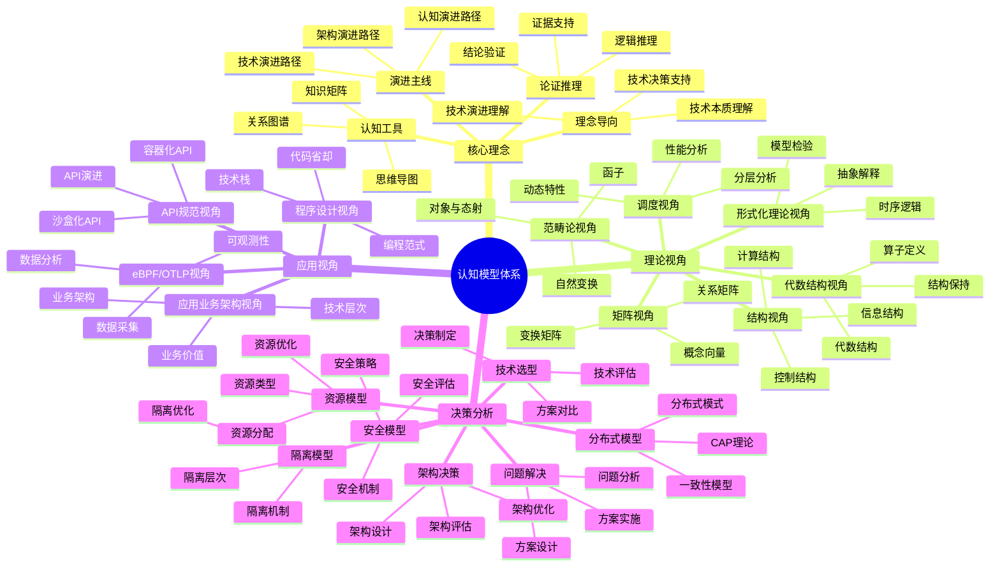

# 认知模型实践总结

## 📑 目录

- [认知模型实践总结](#认知模型实践总结)
  - [📑 目录](#-目录)
  - [1 认知模型全景总结](#1-认知模型全景总结)
  - [2 理论视角总结](#2-理论视角总结)
  - [3 应用视角总结](#3-应用视角总结)
  - [4 决策分析总结](#4-决策分析总结)

---

## 1 认知模型全景总结

---

## 2 理论视角总结

| 视角 | 核心工具 | 适用场景 | 优势 | 学习曲线 | 推荐度 |
|------|---------|---------|------|---------|--------|
| **矩阵视角** | 向量、矩阵 | 技术选型、场景转换 | 直观、易理解 | 中 | ⭐⭐⭐⭐⭐ |
| **结构视角** | 三类结构 | 技术本质理解、架构设计 | 深入理解本质 | 中 | ⭐⭐⭐⭐⭐ |
| **调度视角** | 分层、图、动态系统 | 调度优化、性能分析 | 专门针对调度 | 中 | ⭐⭐⭐⭐ |
| **代数结构视角** | 算子、代数结构 | 操作组合、结构保持 | 严格的数学基础 | 高 | ⭐⭐⭐⭐ |
| **范畴论视角** | 对象、态射、函子 | 系统结构、关系分析 | 统一的数学框架 | 极高 | ⭐⭐⭐ |
| **形式化理论视角** | 时序逻辑、模型检验 | 系统验证、形式化证明 | 严格的验证方法 | 高 | ⭐⭐⭐ |

**推荐度说明**：
- **⭐⭐⭐⭐⭐**：强烈推荐
- **⭐⭐⭐⭐**：推荐
- **⭐⭐⭐**：可选

---

## 3 应用视角总结

| 视角 | 核心内容 | 适用场景 | 优势 | 学习曲线 | 推荐度 |
|------|---------|---------|------|---------|--------|
| **eBPF/OTLP视角** | 可观测性、数据采集 | 监控运维、性能分析 | 全面可观测性 | 中 | ⭐⭐⭐⭐⭐ |
| **程序设计视角** | 代码省却、编程范式 | 应用开发、代码优化 | 代码省却95.7% | 中 | ⭐⭐⭐⭐⭐ |
| **应用业务架构视角** | 技术层次、业务架构 | 架构设计、业务分析 | 业务价值分析 | 中 | ⭐⭐⭐⭐⭐ |
| **API规范视角** | 容器化API、沙盒化API | API设计、API演进 | API标准化 | 中 | ⭐⭐⭐⭐ |

**推荐度说明**：
- **⭐⭐⭐⭐⭐**：强烈推荐
- **⭐⭐⭐⭐**：推荐
- **⭐⭐⭐**：可选

---

## 4 决策分析总结

| 模型 | 核心内容 | 适用场景 | 优势 | 学习曲线 | 推荐度 |
|------|---------|---------|------|---------|--------|
| **资源模型** | 资源类型、资源分配 | 资源管理、资源优化 | 资源优化 | 中 | ⭐⭐⭐⭐⭐ |
| **隔离模型** | 隔离层次、隔离机制 | 隔离设计、安全设计 | 隔离优化 | 中 | ⭐⭐⭐⭐⭐ |
| **安全模型** | 安全机制、安全策略 | 安全设计、安全评估 | 安全优化 | 高 | ⭐⭐⭐⭐⭐ |
| **分布式模型** | CAP理论、一致性模型 | 分布式设计、系统分析 | 分布式优化 | 高 | ⭐⭐⭐⭐⭐ |

**推荐度说明**：
- **⭐⭐⭐⭐⭐**：强烈推荐
- **⭐⭐⭐⭐**：推荐
- **⭐⭐⭐**：可选

---

## 5 认知模型使用建议

| 使用场景 | 推荐模型 | 使用方式 | 预期效果 | 复杂度 | 推荐度 |
|---------|---------|---------|---------|--------|--------|
| **快速认知** | 知识图谱+理念导向 | 快速浏览 | 高 | 低 | ⭐⭐⭐⭐⭐ |
| **技术选型** | 矩阵视角+结构视角 | 综合分析 | 高 | 中 | ⭐⭐⭐⭐⭐ |
| **架构设计** | 结构视角+架构决策框架 | 综合设计 | 高 | 高 | ⭐⭐⭐⭐⭐ |
| **性能优化** | 调度视角+性能基准 | 性能分析 | 高 | 中 | ⭐⭐⭐⭐ |
| **问题解决** | 问题解决方案矩阵 | 问题分析 | 高 | 中 | ⭐⭐⭐⭐⭐ |
| **全面分析** | 多模型组合 | 综合分析 | 极高 | 高 | ⭐⭐⭐⭐ |

**推荐度说明**：
- **⭐⭐⭐⭐⭐**：强烈推荐
- **⭐⭐⭐⭐**：推荐
- **⭐⭐⭐**：可选

---

**最后更新**：2025-11-07
**文档状态**：✅ 完整 | 📊 包含认知模型实践总结 | 🎯 生产就绪
**维护者**：项目团队
